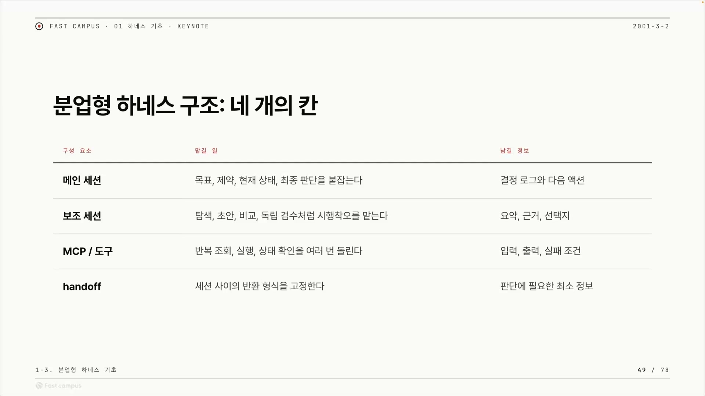
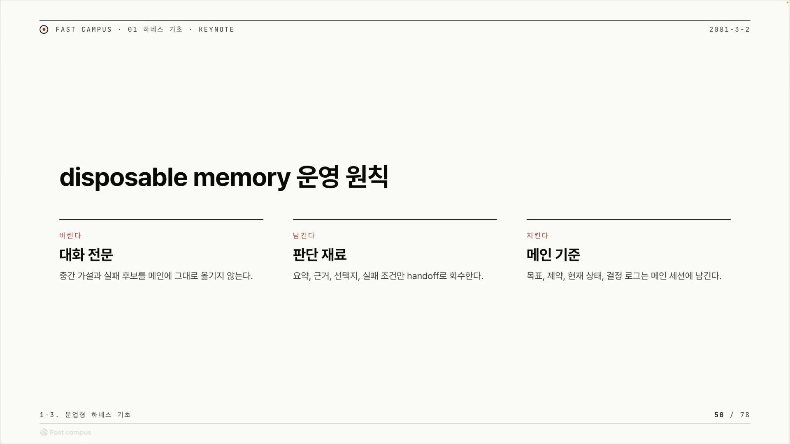
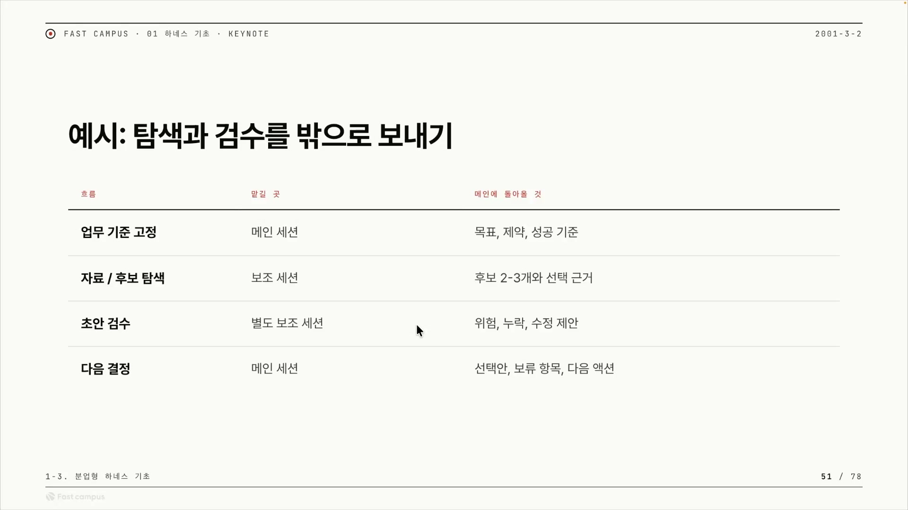
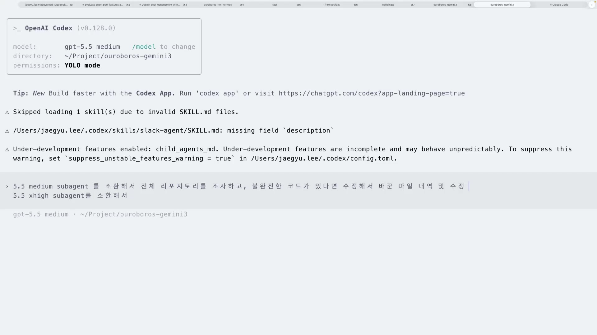
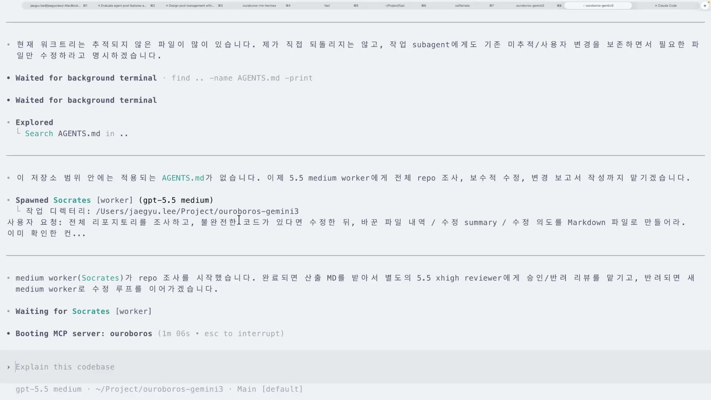
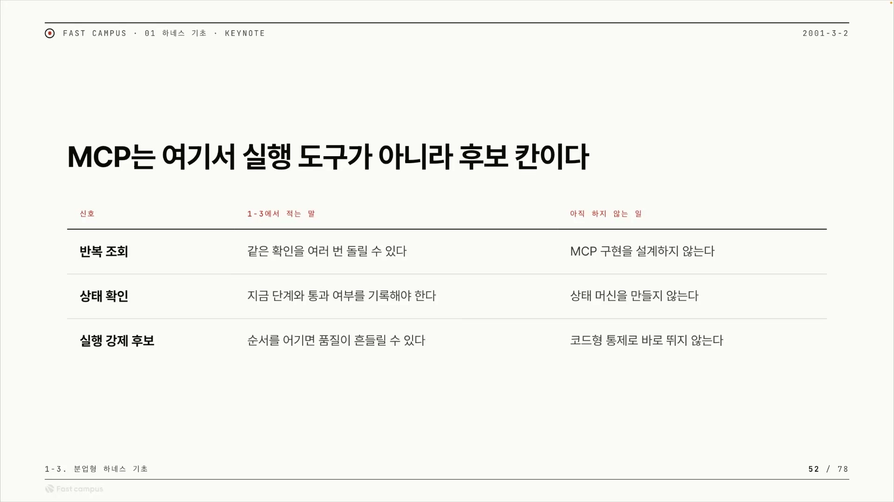

코딩 에이전트를 오래 굴려본 사람이라면 한 번쯤 겪는 장면이 있다. 처음엔 멀쩡하게 일을 잘 하던 메인 세션이, 작업이 길어질수록 점점 자기가 뭘 하려던 건지를 놓친다. 코드베이스를 한참 뒤지다 보면 정작 "이 작업의 목표가 무엇이었나"가 흐려지고, 엉뚱한 데를 고치기 시작한다. 원인은 단순하다. 메인 세션이 봐야 할 컨텍스트 창에, 봐도 그만 안 봐도 그만인 탐색 과정과 시행착오가 잔뜩 들어차 목표를 밀어내기 때문이다.

이 강의는 그 문제를 정면으로 다룬다. 핵심 발상은 한 문장으로 줄일 수 있다. 서브에이전트와 MCP를 '쓰고 버리는 메모리(disposable memory)'로 다뤄서, 메인 세션의 컨텍스트만은 끝까지 깨끗하게 지킨다. 일은 밖에서 시키고, 결과만 들여온다. 이걸 설계의 틀로 정리한 것이 분업형 하네스다.

## 분업형 하네스: 네 개의 칸으로 나눈 지도

분업형 하네스(division-of-labor harness)는 새로운 도구나 기능의 이름이 아니다. 에이전트의 작업을 역할별로 쪼개 운영하는 설계 패턴의 이름이다. 발표자는 이걸 네 칸짜리 표 한 장으로 정리한다. 앞으로 분업형 하네스를 만들 때 "꼭 적어놔야 할 표"라고 부른다.

네 칸은 메인 세션, 보조 세션, MCP/도구, 핸드오프다. 그리고 표의 묘미는 각 칸을 두 질문으로 채운다는 데 있다. 무엇을 맡기나, 그리고 끝나고 무엇을 남기나. 슬라이드 그대로 옮기면 이렇다.

| 구성 요소      | 맡길 일                                           | 남길 정보               |
| -------------- | ------------------------------------------------- | ----------------------- |
| **메인 세션**  | 목표, 제약, 현재 상태, 최종 판단을 붙잡는다       | 결정 로그와 다음 액션   |
| **보조 세션**  | 탐색, 초안, 비교, 독립 검수처럼 시행착오를 맡는다 | 요약, 근거, 선택지      |
| **MCP / 도구** | 반복 조회, 실행, 상태 확인을 여러 번 돌린다       | 입력, 출력, 실패 조건   |
| **핸드오프**   | 세션 사이의 반환 형식을 고정한다                  | 판단에 필요한 최소 정보 |

칸을 하나씩 보면 각자의 성격이 분명해진다.

**메인 세션**은 목표, 제약, 현재 상태, 최종 판단을 쥔다. 발표자는 자신의 도구 '우로보로스'를 예로 든다. "인터뷰가 끝나면 시드 단계를 진행해라" 같은 식으로, 메인 세션이 지금 무엇을 할 건지를 드러내고 거기서 어떤 걸 결정할지를 사용자 판단에 맞춰 진행한다. 즉 메인 세션은 노동자가 아니라 의사결정자다. 그래서 메인에 들어오는 정보는 적을수록 좋다. 판단에 필요 없는 중간 과정이 컨텍스트를 차지하면, 정작 목표가 긴 잡음 속에 묻혀 까먹히기 때문이다.

**보조 세션**은 메인이 하지 않을 것들을 위임받는다. 탐색부터 검수까지, 최종 판단에 직접 필요 없는 일이다. 여기서 핵심은 보조 세션의 가치가 "일을 대신 한다"에 있지 않다는 점이다. 보조 세션의 진짜 역할은 그 일의 너저분한 과정, 그러니까 중간 가설과 실패 후보와 긴 로그를 자기 안에서 흡수해 메인에 묻히지 않게 하는 데 있다. 그래서 보조 세션이 곧 disposable memory의 몸통이 된다.

**MCP/도구**는 반복 조회나 상태 확인처럼 캡슐로 묶어 여러 번 돌려야 하는 동작을 맡는다. 발표자는 이 칸을 스킬과 비교해 설명한다. 스킬은 자연어로 쓰여 있어서, 모델이 바뀔 때마다 같은 지시문이 제대로 동작한다는 보장이 없다. 반면 MCP는 코드로 동작을 확실하게 보장해줄 때 선택한다. 그래서 MCP 칸의 본질은 '도구'라기보다 '계약'에 가깝다. 입력 파라미터·출력 형태·실패 조건을 미리 못 박아두는 자리다.

**핸드오프**는 세션과 세션 사이의 반환 형식을 고정한다. 핸드오프가 없으면 보조 세션의 긴 결과가 그대로 메인을 오염시킨다. 그래서 무엇을 남길지를 먼저 정하는 게 핸드오프의 전부다. 네 칸 중 앞의 셋을 잇는 접합부이자, 분업의 마지막 잠금장치인 셈이다.

이 네 칸을 관통하는 논리는 하나다. 메인 세션의 컨텍스트는 가장 비싸고 잊으면 안 되는 자원이다. 그걸 깨끗하게 지키려고 탐색·검수·반복 동작을 밖(보조 세션·MCP)으로 내보내고, 돌아올 때는 핸드오프로 "요약과 위치"만 들이도록 형식을 고정한다. 그러니까 이 네 칸은 일을 나누는 칸이라기보다, 컨텍스트 오염이 어디서 새어 들어올 수 있는지를 표시한 지도에 가깝다. 이름은 '분업형'이지만 무게중심은 분업보다 경계 관리에 있다.

## Disposable Memory: 버린다, 남긴다, 지킨다

네 칸을 다 나눈 다음, 강의는 그중 '남길 정보'를 한 단계 더 깊이 판다. 무엇을 버리고 무엇을 가져올 것인가. 이 강의 전체에서 'disposable memory'라는 제목이 붙은 슬라이드는 딱 한 장인데, 그게 이 운영 원칙을 세 칸으로 압축한다.

| 동작       | 대상      | 원칙                                                  |
| ---------- | --------- | ----------------------------------------------------- |
| **버린다** | 대화 전문 | 중간 가설과 실패 후보를 메인에 그대로 옮기지 않는다   |
| **남긴다** | 판단 재료 | 요약, 근거, 선택지, 실패 조건만 핸드오프로 회수한다   |
| **지킨다** | 메인 기준 | 목표, 제약, 현재 상태, 결정 로그는 메인 세션에 남긴다 |

세 칸을 일회용 컵에 빗대면 직관적이다. 컵 안에서 음료를 만드는 과정, 그러니까 얼음을 갈고 시럽을 넣고 다시 따라내는 과정은 컵과 함께 버린다. 식탁에 올리는 건 완성된 한 잔뿐이다. 서브에이전트의 컨텍스트가 일회용 컵이고, 핸드오프로 넘기는 요약이 완성된 한 잔이다. 서브에이전트가 안에서 어떤 파일을 봤고 어떤 가설을 버렸는지, 그 너저분한 과정 전체가 '버린다' 칸의 대상이다.

세 칸은 사실 층위가 다르다. 버린다와 남긴다는 보조에서 메인으로 가는 회수 규칙이고, 지킨다는 메인이 위임하는 동안에도 자기 정체성을 잃지 않는다는 보존 규칙이다. 세 칸을 한 표에 묶은 이유도 여기 있다. 무엇을 버리고 남길지 정하는 행위의 목적이 결국 '메인 기준을 지키기 위함'이기 때문이다.

### "정보는 많을수록 좋은 거 아닌가"

여기서 자연스럽게 떠오르는 반문이 있다. 다 넘기면 정보가 많아서 더 좋은 거 아닌가. 발표자의 답은 오염(contamination)이다. LLM은 한정된 컨텍스트 창 안에서 동작한다. 거기에 보조 세션의 시행착오 로그가 통째로 들어오면 두 가지가 망가진다. 첫째, 메인이 정작 봐야 할 목표와 결정 로그가 잡음에 묻힌다. 둘째, 보조가 이미 폐기한 틀린 가설이 메인의 컨텍스트에는 살아남아, 메인이 그걸 사실인 양 참조하거나 같은 실수를 반복한다. 보조 세션이 애써 걸러낸 작업을 메인에서 도로 무효화하는 셈이다.

그래서 목표는 오염을 0으로 만드는 게 아니다. 결론은 어차피 넘겨야 하니 완전 무오염은 불가능하다. 핵심은 잡음만 쳐내는 것, 발표자의 표현으로 "최소한의 오염"이다. disposable memory가 단순한 토큰 절약 테크닉이 아니라 메인의 판단 품질을 지키는 위생 규칙인 이유가 이것이다. 토큰이 줄어드는 건 결과일 뿐, 본질은 컨텍스트를 깨끗하게 유지하는 데 있다.

한 가지 미묘한 구분도 짚어둘 만하다. '버린다' 칸에는 실패 후보가, '남긴다' 칸에는 실패 조건이 들어 있다. 둘은 다르다. 시도하다 버린 잡다한 가설은 버리되, "이런 경우엔 깨진다"는 재사용 가능한 규칙은 판단 재료로 남긴다. 버리는 건 과정의 잡음이고, 남기는 건 그 과정에서 추출한 교훈이다.

이 전체를 한 번 더 압축하면 프로그래밍의 개념 하나로 떨어진다. 값을 통째로 복사해 넘기는 pass-by value 대신, 위치만 가리켜 넘기는 pass-by reference로 바꾸는 일이다. 보조 세션의 컨텍스트를 통째로 메인에 복사해 넣으면 오염되고 토큰이 폭증한다. 결론 요약과 파일 경로만 넘기면 메인은 가볍게 유지되고, 정말 필요할 때만 그 위치를 다시 열어보면 된다. 발표자가 '요약'과 함께 콕 집어 말한 '파일 위치'가 바로 참조 전달이다.

## 메인은 쥐고, 보조는 떠맡고, 핸드오프로 막는다

원칙이 잡혔으니 운용으로 내려가 보자. 분업의 실무는 결국 "무엇을 메인이 쥐고, 무엇을 밖으로 내보내는가"의 문제다.

표가 보여주는 배정이 명료하다. 업무 기준 고정은 메인 세션이, 자료·후보 탐색은 보조 세션이, 초안 검수는 또 다른 별도 보조 세션이, 다음 결정은 다시 메인 세션이 맡는다. 여기서 놓치기 쉬운 디테일이 검수를 탐색과 다른 별도 세션에 맡긴다는 점이다. 한 세션이 자기가 만든 초안을 자기가 검수하면 같은 컨텍스트에 갇혀 자기 편향을 못 본다. 검수를 깨끗한 제3의 세션에 맡겨야 '다른 눈'으로 본다.

발표자가 이 표를 띄우며 한 말이 운용의 중심이다. 탐색과 검수를 밖으로 보내는 게 메인 세션 입장에서 굉장히 중요하다, 메인은 목표와 성공 기준을 놓치면 안 되니까 다른 작업을 서브에이전트로 위임한다. 그리고 이 분업이 주는 이득을 발표자는 이렇게 못 박는다. 에이전트가 토큰을 많이 쓸 수 있음에도 불구하고, 메인 세션의 토큰은 많이 아낄 수 있다.

이 문장이 분업형 하네스의 경제학적 핵심이고, 곱씹을수록 반직관적이다. 보조 세션은 탐색·수정·검수를 하느라 토큰을 펑펑 써도 된다. 그 토큰은 보조 세션 안에서 소비되고, 일이 끝나면 통째로 버려지기 때문이다. 메인에 돌아오는 건 핸드오프로 압축된 요약 한 장뿐이다. 그래서 "서브에이전트는 토큰을 많이 써도 메인 세션 토큰은 아낀다"는 비대칭이 성립한다. 서브에이전트를 여러 개 돌리면 총 토큰은 오히려 늘어날 수도 있다. 하지만 아끼려는 건 총량이 아니라 메인의 컨텍스트다. 메인이 목표를 까먹지 않으려면 가벼워야 한다는, 앞서 본 원칙의 다른 얼굴이다.

핸드오프는 이 운용에서 단순한 데이터 전달 규약이 아니라 오염 방어선으로 작동한다. "보조는 결과만 정해진 형식으로 돌려준다"는 규칙을 미리 박아두면, 보조가 내부적으로 아무리 길게 헤매도 그 잡음이 메인으로 새지 않는다. 강의에서 형식 고정의 실제 예로 든 것이 마크다운이다. 보조에게 "변경 보고서와 변경한 파일 목록을 마크다운으로 만들어라"라고 출력 형식을 고정하고, 그 마크다운만 회수한다. 출력 형식을 .md로 고정한 것이 곧 핸드오프 형식을 고정한 것이다.

일을 보낸 뒤 메인이 어떻게 행동할지에는 두 갈래가 있다. 결과를 기다리는 동기 대기, 그리고 보조가 일하는 동안 메인이 다른 일을 하는 비동기(fire-and-forget)다. 선택 기준은 결국 "보조의 산출물이 메인의 다음 결정에 곧바로 물리는가"다. 워커의 마크다운이 있어야 리뷰어를 소환할 수 있다면 동기 대기가 맞고, 결과가 당장 안 필요하고 메인이 병렬로 할 다른 일이 있다면 fire-and-forget이 유휴 시간을 없앤다. 형식이 고정돼 있어야 비동기로 받아도 메인이 안전하게 처리할 수 있으니, 핸드오프와 비동기는 한 쌍이다.

그리고 이 사이클에서 사람이 끼어드는 자리는 분명하다. 작업이 다 끝나면 "다음 결정으로 뭘 할 거냐"를 사람과 의논하고, 그 결정에 따른 실행은 다시 보조로 위임한다. 휴먼인더루프는 전 과정을 감시하는 게 아니라, 갈림길에서만 개입하고 실행은 위임하는 구조다.

## 화면으로 보는 분업: Codex 데모

여기까지가 표와 개념이라면, 발표자는 같은 원리를 코덱스(Codex) 터미널에서 라이브로 보여준다. 데모의 목적부터 분명히 한다. 코덱스를 기반으로 어떻게 대화 전문을 무시하고 결과만 가져오는지를 보여주겠다는 것. 그러니까 데모의 진짜 주제는 "서브에이전트를 어떻게 부르는가"가 아니라, "서브에이전트가 만든 거대한 중간 과정을 메인이 어떻게 안 보고 넘기는가"다.

화면에 등장하는 모델 표기는 모두 같은 베이스 모델(GPT-5.5)을 reasoning effort, 즉 생각의 깊이만 바꿔 부르는 코덱스의 관례다. 미디엄으로 돌리면 싸고 빠르고, 등급을 올리면 더 깊게 생각하는 대신 비싸고 느리다. 일꾼은 '5.5 미디엄'으로 돌리고, 파일 내역과 수정 서머리를 마크다운으로 만들어 전달시키는 단계에는 xhigh를 붙인다. 그리고 검토자는 발표자가 구어로 '하이 리뷰어'라 부르는, 미디엄보다 높은 등급(high)으로 돌리는 서브에이전트다. 그래서 등급 분업이 가능하다. 싸고 빠른 일꾼이 먼저 작업하고, 더 깊게 생각하는 상위 등급 검토자가 검수한다.

발표자는 우로보로스 리포지토리를 대상으로 '5.5 미디엄 서브에이전트'를 소환해 세 가지를 한 번에 맡긴다. 전체 리포 조사, 보수적 수정, 변경 보고서 작성이다. 자연어 한 줄이 워커 인스턴스 하나를 만드는 명령으로 작동한다. 여기서 "보수적 수정"이라는 단서가 중요하다. 워커가 마음대로 갈아엎는 게 아니라 메인이 정한 제약 안에서만 손대게 하고, 무엇을 했는지 보고서로 남기게 한다. 뒤따라올 리뷰 단계와 짝을 이루는 설계다.

이어서 '5.5 xhigh'로 파일 내역과 수정 서머리를 마크다운으로 만들어 전달시키고, 그 위에 리뷰 루프를 건다. 정리하면 명령의 골자는 이렇다.

1. 5.5 미디엄 워커가 전체 리포를 조사하고 수정한다
2. 산출을 마크다운으로 출력 형식 고정한다
3. high 등급 리뷰어(발표자가 '하이 리뷰어'라 부르는)를 소환해 그 마크다운을 검수한다
4. 승인될 때까지 미디엄 워커를 반복 소환한다

여기서 마크다운은 단순 산출물이 아니라 세션 간 핸드오프의 그릇이다. 대화 전문 대신 "변경한 파일과 변경 보고서"라는 판단 재료만 마크다운에 담아 회수하는 것, 이게 앞서 예고한 "결과만 가져온다"의 구체적 구현이다.

소환 명령을 던지기 전, 발표자는 자기 작업 방식을 한 마디 끼워 넣는다. 보통 코덱스 같은 도구에서는 리포 안에 `AGENTS.md` 같은 에이전트 정의 파일을 두고 역할을 고정한다. 그런데 발표자는 그렇게 하지 않는다. 코드베이스가 크지 않고 우로보로스 안에서는 에이전트 정의 파일을 관리하는 게 외려 부담이라, 스킬이나 자작 하네스로 그때그때 조사를 시키는 방식을 택한다. 리포에 박힌 정적 정의 대신, 호출 시점에 자연어로 굴리는 동적 소환을 선호한다는 것이다.

소환이 성공하자 화면에 워커가 뜬다. 'Socrates'라는 이름이 붙어 있다. 추상적이던 '워커'가 이름 붙은 구체적 실체로 터미널에 등장한 것이다. 한 가지 헷갈리지 말 것은, '소크라테스'는 모델 등급이 아니라 발표자의 하네스가 이 워커 인스턴스에 붙인 별명이라는 점이다. 사람과 메인 세션이 "어떤 워커가 무엇을 했는지" 추적하기 쉽게 만드는 라벨일 뿐이다. 소크라테스는 리포 조사를 시작하고, 스스로 다음 흐름을 내뱉는다. 조사가 끝나면 산출 마크다운을 받아 하이 리뷰어에게 승인받고, 완료되면 다시 수정 작업을 이어간다.

이제 발표자는 한 발 물러서 구조로 환원한다. 우리는 소크라테스가 안에서 뭘 하는지, 어떤 파일을 보고 어떤 코드가 나쁜지를 다 볼 필요가 없다. 그건 판단 재료로서 변경 보고서와 변경한 파일을 마크다운으로 만들게 했고, 그걸 핸드오프로 회수했다. 메인은 그 마크다운을 받아 다시 다른 서브에이전트로 리뷰를 시킨다. 그림이 여기서 완성된다.

- **워커(소크라테스, medium)**: 어떤 파일을 봤고 뭐가 나쁜지 같은 내부 과정은 워커 안에서 태우고 버린다. 메인은 그 과정을 안 본다.
- **핸드오프(마크다운)**: 워커는 변경한 파일과 변경 보고서만 마크다운으로 남긴다. 곧 판단 재료다.
- **리뷰어(하이, high 등급)**: 그 마크다운을 받아 검수하고 승인한다.
- **메인 세션**: 직접 코드를 보지 않는다. 대신 "어떤 워커가 소환됐고, 어떤 리뷰어가 무슨 리뷰를 냈는지"의 이력만 기억하며 전체를 지휘한다.

즉 메인 세션은 실무자가 아니라 오케스트레이터, 기억을 쥔 지휘자다. 메인이 쥐는 '현재 상태'가 여기서는 "누가 소환됐고, 어떤 리뷰가 돌았고, 다음 차례가 무엇인가"라는 지휘 기록으로 구체화된다. 메인은 각 보조 세션의 내용은 안 들고, 상태만 든다. 실무의 토큰 폭발은 전부 일회용 서브에이전트 안에서 일어나고 버려진다.

참고로 데모 중 화면이 멈춰 보였던 건, 발표자가 마크다운 전달을 기다리는 동기 대기 상태였기 때문이다. fire-and-forget으로 기다리는 동안 다른 일을 할 수도 있지만, 이 데모에서는 마크다운을 만들어 전달시키려 했기에 그 전달을 기다리고 있었다고 솔직히 짚는다.

## MCP는 어디에: 실행 도구가 아니라 후보

네 칸 중 아직 깊이 다루지 않은 칸이 MCP다. 그런데 발표자가 MCP에 대해 하는 말이 의외다. 지금 이 단계에서 MCP는 "당장 쓰는 실행 도구"가 아니라 "조건이 맞으면 나중에 코드로 굳힐 후보"의 자리에 놓인다.

슬라이드가 메시지를 그대로 보여준다. 왼쪽 열은 MCP에 적합한 신호다. 반복 조회, 상태 확인, 실행 강제 후보, 그리고 발표자가 말로 덧붙인 "순서를 진짜 어기면 문제가 생기는 경우". 오른쪽 열은 그런데도 지금은 하지 않는 일이다. MCP 구현을 설계하지 않는다, 상태 머신을 만들지 않는다, 코드형 통제로 바로 뛰지 않는다. 표가 '조건 목록' 형태라는 것 자체가 메시지다. MCP는 지금 누르는 버튼이 아니라, 이런 신호가 보이면 그제서야 코드로 만들 후보라는 뜻이다.

왜 미루는가. 답은 스킬과 MCP의 트레이드오프에 있다.

|                      | 스킬                                          | MCP                                              |
| -------------------- | --------------------------------------------- | ------------------------------------------------ |
| 동작을 기술하는 매체 | 자연어(마크다운)                              | 코드(프로토콜 구현)                              |
| 모델이 바뀌면        | 같은 자연어를 다르게 해석할 수 있어 보장 없음 | 입출력이 코드로 고정돼 모델과 무관하게 계약 유지 |
| 선택 기준            | 유연하고 가볍게 반복할 때                     | 확실하게 코드로 보장해야 할 때                   |

스킬은 "모델에게 부탁하는 글"이고 MCP는 "모델이 따를 수밖에 없는 계약"이다. MCP는 프로토콜이라, 쓰려면 입력 파라미터·출력 형태·실패 조건을 미리 못 박아야 동작한다. 이건 내가 직접 MCP를 만들 때만의 얘기가 아니다. 발표자는 남이 만든 MCP를 그대로 가져다 쓸 때도 똑같다고 강조한다. 브라우저를 LLM이 조작하게 해주는 Playwright MCP나, 크롬 개발자도구 기능을 노출하는 Chrome DevTools MCP 같은 기성 도구를 쓸 때도 입력·출력·실패 조건은 똑같이 필요하다. 두 예시가 우연이 아닌 게, 둘 다 "페이지를 열고 상태를 읽고 다시 확인하고"를 수없이 반복하는 작업이라 'MCP = 반복 조회·상태 확인 캡슐'이라는 정의의 실물 증거다.

발표자 자신의 우로보로스가 MCP와 서브에이전트를 함께 쓰는 사례를 보여준다. 메인 세션에서 인터뷰를 진행하고, 인터뷰가 끝나면 사람이 목표를 명세로 굳히고(스펙화), 그걸 '런'으로 구현한다. 런이 끝나면 Evaluate 기반으로 MCP 콜을 기다리는 구간이 오는데, 메인은 그 대기 시간에 손 놓고 있지 않는다. 만들어진 걸 스스로 보며, 때로는 서브에이전트를 동원해 자체 검증을 병행한다. 여기서 MCP와 서브에이전트는 경쟁 관계가 아니라 역할이 다른 두 검증 채널이다. MCP 콜은 코드로 고정된 확실한 검증이지만 결과가 돌아오기까지 시간이 걸리고, 그 공백을 빠르고 유연한 서브에이전트 검증이 메운다. 코드는 확실하지만 느리고, 자연어는 싸고 유연하지만 보장이 약하다는 트레이드오프가 한 시스템 안에서 공존하며 서로를 보완하는 모습이다.

그래서 MCP를 다루는 발표자의 전략은 일종의 점진적 경화(硬化)다. 처음엔 모든 통제를 값싼 자연어, 즉 서브에이전트로 한다. 같은 패턴이 충분히 반복돼 "이건 확실히 코드로 묶어야겠다"는 확신이 설 때 비로소 그 후보를 MCP로 승격시킨다. 그 승격 시점에 상태 머신이 함께 등장한다는 점도 의미심장하다. 순서와 상태가 코드로 강제돼야 할 만큼 복잡해졌다는 신호이기 때문이다.

## 그래서 언제 무엇을 쓰는가

강의는 선택 기준으로 수렴한다. 세 가지 하네스를 언제 고를지의 판단 트리다.

| 상황                                      | 선택             |
| ----------------------------------------- | ---------------- |
| 문서 규칙만 반복된다                      | 마크다운 하네스  |
| 맥락(컨텍스트)이 무겁다                   | 분업형 하네스    |
| 순서가 결정적이고 + 분업형으로는 부족하다 | MCP              |
| 위 MCP 조건이어도 목표가 아직 흐리다      | MCP 보류(비추천) |

이 표는 셋 중 하나를 고르는 병렬 선택지가 아니라 계단으로 읽어야 한다. 마크다운에서 분업형으로, 분업형에서 MCP로 올라갈수록 통제 강도와 구현 비용이 같이 오른다. 아래 단계로 내려가는 조건은 늘 "윗 단계로는 부족할 때"다. 분업형은 마크다운만으로 컨텍스트를 감당 못 할 때 꺼내고, MCP는 분업형의 자연어 통제로 순서를 못 잡을 때 비로소 꺼낸다. 발표자가 자기 강의의 학습 순서를 그렇게 짠 것도 같은 이유다. 먼저 마크다운으로 규칙을 굳히고, 무거워지면 분업형으로 쪼개 자연어 통제를 익히고, 그래도 순서가 안 잡힐 때만 MCP. MCP는 가장 늦게, 가장 신중하게.

그런데 이 모든 선택에 앞서는 단 하나의 게이트가 있다. 위 트리가 "자동화를 한다면 무엇으로?"의 답이라면, 그 이전에 "자동화를 해도 되는가?"를 먼저 통과해야 한다. 발표자의 답은 단호하다.

**목표와 성공 기준이 흐리면, 아예 자동화하지 마라.**

이유가 곱씹을 만하다. 불명확한 목표를 자동화하면, 그 불명확함이 더 빠르고 더 많이 생성된다. 자동화는 증폭기다. 입력이 명확하면 명확한 결과를 빠르게 대량 생산하지만, 입력이 흐리면 흐린 결과를 기계 속도로 복제해 퍼뜨린다. 사람이 직접 할 때는 느려서 흐림이 조금씩만 쌓이지만, 자동화는 그 흐림을 순식간에 확산시킨다. 그래서 목표가 흐릴 때는 자동화 대신 휴먼인더루프로 사람이 먼저 생각을 깎아야 한다. 여기서 휴먼인더루프는 단순한 안전장치가 아니라, 목표와 성공 기준을 선명하게 다듬는 단계 그 자체다. 메인 세션이 끝까지 붙들어야 할 그 기준이 애초에 흐리다면, 붙들 것 자체가 부실하기 때문이다.

흐린 목표는 특히 MCP에서 더 위험하다. MCP는 입력·출력·실패 조건을 코드로 고정해야 동작한다. 곧 요구를 계약으로 굳힌다는 뜻이다. 요구가 명확하면 이 고정이 안정성을 주지만, 요구가 흐리면 틀린 계약을 콘크리트로 굳히는 꼴이 된다. 자연어 통제는 흐림을 다음 턴에 프롬프트 한 줄로 고쳐 쓸 여지가 있지만, 코드형 계약은 그 흐림을 구조에 새겨 넣어 되돌리기가 비싸진다. 그래서 "순서가 중요해 MCP가 적합해 보여도, 목표가 아직 흐리면 비추천"이라는 단서가 붙는다.

결국 이 강의가 남기는 건 두 겹의 지혜다. 도구를 고르는 계단(마크다운 → 분업형 → MCP)이 하나, 그리고 그 계단에 발을 올리기 전에 반드시 통과해야 하는 게이트(목표가 선명한가)가 하나. 서브에이전트와 MCP를 쓰고 버리는 메모리로 다루는 모든 기술은, 메인 세션이 목표를 끝까지 놓치지 않게 하려는 한 가지 목적을 향한다. 그리고 그 목표 자체가 흐릴 때는, 어떤 기술도 꺼내지 않는 것이 가장 좋은 선택이다.
