AI 코딩 에이전트를 좀 길게 써 본 사람이라면 한 번쯤 겪는 증상이 있다. 처음엔 똑똑하게 굴던 모델이 작업이 길어질수록 점점 멍청해진다. 방금 정한 제약을 잊고, 아까 본 자료를 또 찾고, 분명히 짚었던 목표에서 슬그머니 벗어난다. 토큰은 토큰대로 빨리 닳는다. 이게 그냥 모델이 나빠서가 아니라 **메인 세션의 컨텍스트가 오염됐기 때문**이라는 게 이 강의의 출발점이다.

이번 클립은 그 오염을 막는 한 가지 방법, "분업형 하네스"를 다룬다. 무거운 일을 메인이 직접 떠안지 말고 서브 에이전트로 떼어내되, 무엇을 떼고 무엇을 메인이 쥘지를 역할 분리표라는 표 한 장으로 먼저 설계한다. 그리고 그 설계를 실제 스킬에 적용해, 고치기 전(문서형)과 후(분업형)를 같은 조건에서 나란히 돌려 컨텍스트 사용량을 비교한다. 설계를 한 번 하고 그 설계를 한 번 실증하는, 이 두 덩어리가 강의의 큰 줄기다.

## 하네스가 뭐고, 왜 세 종류로 나누나

하네스(harness)는 AI 에이전트가 일을 일관되게 해내도록 감싸는 **구조 또는 틀**이다. 같은 모델이라도 그냥 "보고서 써줘"라고 던지는 것과, 절차와 역할을 정해 놓고 그 틀 안에서 일하게 하는 것은 결과가 다르다. 그 틀이 하네스다. 강의는 이걸 세 종류로 가른다.

- **문서형(마크다운) 하네스**. SKILL.md 같은 문서 한 장에 절차를 적어 두고, 메인 세션이 그걸 그대로 따라 수행한다. 단순하지만 메인이 모든 단계를 혼자 짊어진다.
- **분업형 하네스**. 일을 여러 서브 에이전트로 쪼개고, 메인은 그들을 지휘(오케스트레이션)만 한다. 오늘의 주제다.
- **MCP형 하네스**. 도구와 프로토콜 기반이고, 이건 다음 클립에서 다룬다.

세 종류라고 했지만 이번 실습의 핵심 대비는 앞의 둘이다. 같은 마케팅 보고서 스킬을 문서형으로 만든 버전이 v1, 분업형으로 바꾼 버전이 v2다. 강의 후반의 비교 실험이 바로 이 v1과 v2의 대결이다.

## 프롬프트만으로도 분업은 시작된다

본격적인 실습에 들어가기 전, 강사는 앞 클립에서 만든 데모를 다시 꺼낸다. Codex에서 서브 에이전트를 소환하면 공자, 하위헌스(Huygens) 같은 철학자나 수학자 이름이 자동으로 붙는다. 이건 Codex가 서브 에이전트마다 붙여 주는 코드네임일 뿐, 실제로 그 인물을 다루는 건 아니다.

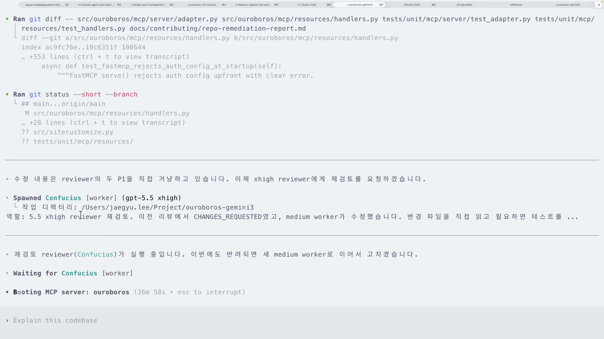

여기서 벌어지는 일이 분업형 하네스의 축소판이다. 한 에이전트가 코드를 고치면, 메인 세션이 그 결과를 받아 다시 다른 에이전트(최고 추론 강도 `xhigh`로 돌린 리뷰어)에게 재검토를 맡긴다. 리뷰어가 OK할 때까지 생성과 검수가 오간다. 강사가 별도로 하네스를 짠 게 아니다. **프롬프트만으로** 이 생성과 검수 루프가 28분째 자율로 돌고 있었다.

여기서 끌어낼 메시지는 분명하다. 분업은 거창한 인프라가 아니라 설계의 문제다. 역할만 잘 나눠도 시작할 수 있고, 이걸 하네스 형태로 더 구조화하면 훨씬 잘 돈다. 오늘 실습이 하려는 게 바로 그 구조화다.

## 무엇을 밖으로 보낼 것인가

설계의 첫 질문은 "무엇을 서브 에이전트로 보낼 것인가"다. 강사는 이걸 세 갈래로 정리한다.

- **메인이 끝까지 쥘 것**. 목표, 제약, 현재 상태. 그리고 사람이 내려야 할 최종 판단.
- **서브로 보낼 것**. 탐색, 검수, 생성처럼 맥락을 많이 먹는 무거운 일.
- **핸드오프로 남길 것**. 서브가 한 일을 메인이 알 수 있게 돌려주는 결과.

세 번째 핸드오프가 함정이다. 서브 에이전트가 일을 아무리 잘해도, 무엇을 했는지 메인에게 제대로 전달하지 못하면 메인이 그 결과를 다시 찾아 헤매야 한다. 강사 표현으로는 "그것만큼 낭비가 없다." 분업해서 떼어 놨는데 메인이 그걸 다시 주워 담느라 컨텍스트를 쓰면, 분업한 의미가 사라진다. 그래서 핸드오프 형식을 잘 정하는 일이 작업을 떼어내는 일만큼 중요하다.

## 메인이 지치던 실제 증상

추상적인 원칙을 실제 작업에 붙여 본다. 강사가 고른 소재는 본인이 만들어 쓰던 **원페이저 마케팅 보고서** 스킬이다. 템플릿이 반복적이고, 작성과 검수가 무거워 메인이 지치던 작업이다.

진단 화면은 이 스킬이 왜 무거운지를 보여준다. 이 스킬은 탐색, 쟁점화, 본문 작성, 자기 검수 이 네 단계를 **전부 한 대화, 곧 메인 세션 컨텍스트에 누적**한다. 그래서 본문을 쓸 때쯤이면 수집해 온 raw 자료까지 전부 메인에 떠 있다. 정작 중요한 보고 목표와 결정은 그 부산물 더미에 묻힐 위험에 놓인다.

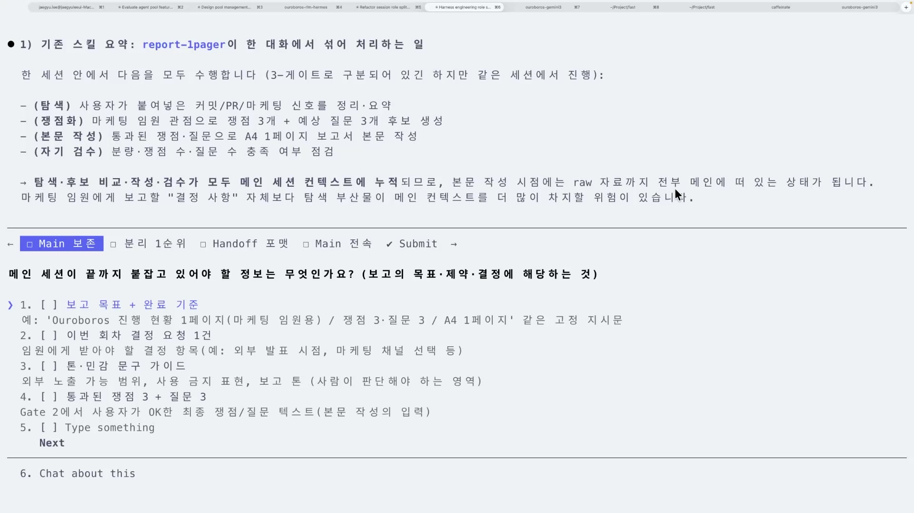

이게 컨텍스트 오염의 정체다. 메인이 일꾼이 되는 순간 작업 부산물이 쌓이고, 그 부산물이 판단을 흐린다. 그러니 이 네 가지 중 무거운 건 밖으로 내보낸다.

## 무엇을 분리할까, 네 가지 잣대

모든 일을 다 서브로 보내는 게 답은 아니다. 짧은 일까지 굳이 떼어내면 오히려 손해다. 강사는 분리 여부를 따지는 네 가지 잣대를 둔다.

- 길이. 짧은 일은 분리할 필요가 없다. SQL 쿼리 하나를 서브 에이전트에 맡길 이유는 없다.
- 혼재. 자료와 결정이 섞인 일은 분리를 검토한다.
- 재사용. 다음에도 비슷하게 나눌 일이면 서브로 빼두는 게 이득이다.
- 일회성. 한 번 쓰고 말 잡무에 하네스를 짜는 건 오버 엔지니어링이다. 그런 건 그냥 한 번 켜서 처리하면 된다.

개발자들 사이엔 "같은 일이 세 번 반복되면 스킬로 만들라"는 통념이 있다. 이 강의는 거기서 한 발 더 나아간 단계다. 이미 만든 스킬을, 이번엔 분업 구조로 다시 짜는 작업이기 때문이다. 그러니 잣대도 "스킬로 만들까"가 아니라 "이 스킬의 어느 부분을 서브로 뺄까"로 옮겨 간다.

## 역할 분리표를 채우는 네 단계

실습 자료는 빈 표 묶음이다. 이 표를 Claude Code의 askQuestion 인터페이스로 한 칸씩 결정해 채운다. 메인 세션이 사용자에게 질문을 넘기고, 그 답으로 표가 채워지는 이 과정 자체가 작은 핸드오프이기도 하다.

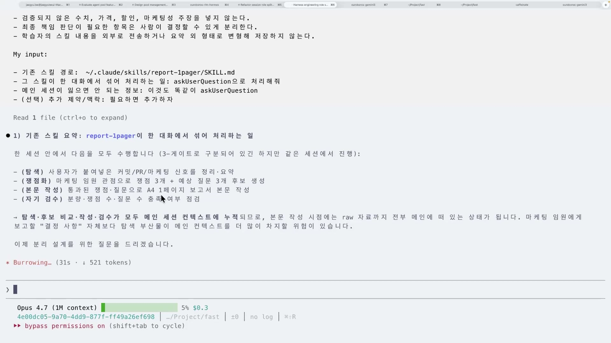

채우는 순서는 네 단계다.

첫째, 입력 선택이다. 분업 대상으로 삼을 업무 하나를 고른다. 앞의 네 잣대로 거른다. 여기선 원페이저 마케팅 보고서 스킬이 대상이다.

둘째, 메인이 끝까지 쥘 정보를 적는다. 메인 세션이 절대 놓으면 안 되는 것을 먼저 적는다. 강사의 선택은 보고 목표와 사용자가 OK한 결정, 이 둘이다. 메인은 "무엇을 이루려 하는가"와 "사람이 승인한 것"만 들고 있으면 된다.

셋째, 밖으로 보낼 일과 받을 형식을 정한다. 서브로 떼고 싶은 무거운 일들을 적는다. 탐색해 온 리스트와 수치(매우 무겁다), 쟁점 질문 후보(여러 개라 무겁다), 그리고 자기 검수까지. 강사는 이 작업들을 한 서브 에이전트에 몰지 않고 각각 다른 서브 에이전트에서 돌리길 원한다고 못박는다.

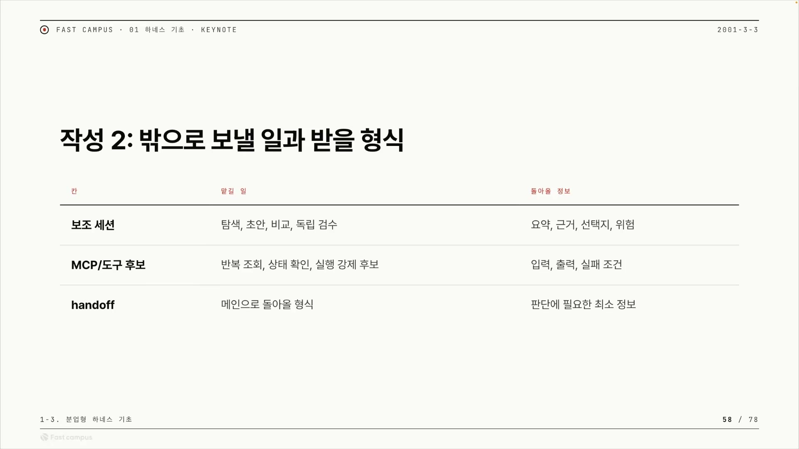

이 셋째 칸에서 핸드오프 형식을 함께 정한다. 강사가 정한 형식은 이렇다. 서브 에이전트는 **무엇을 입력으로 받았고, 무슨 작업을 했고, 어떻게 바꿨는지**를 요약(summary)으로 돌려준다. 이 세 줄이 핸드오프 템플릿이다. 실제로 오로보로스 실습에서도 각 에이전트가 자기가 한 일을 이렇게 요약해 주지 않으면, 검수와 평가를 맡은 에이전트가 무엇을 검수해야 할지조차 알 수 없다. 실무에서 그대로 베껴 쓸 수 있는 부분이라, 서브 에이전트 프롬프트 끝에 "반환 형식: 입력 요약 / 수행 내용 / 변경점"을 고정해 두면 된다.

넷째, 버릴 기억과 남길 재료를 가른다. 마지막은 검수다. 기억을 세 열로 분류한다. 버릴 것(대화 전문 같은 휘발성 잡음), 남길 것(판단에 쓰이는 재료), 보호할 것(메인이 쥐는 기준). 버릴 기억이 잘 버려졌는지, 남길 재료가 메인과 서브로 제대로 갈렸는지를 점검한다.

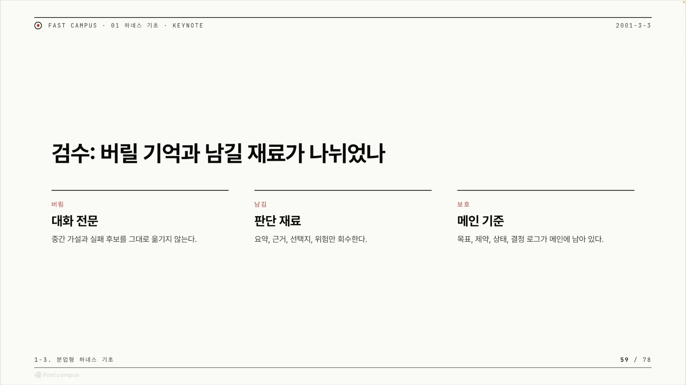

## 사람만 결정할 것

표를 채우다 보면 자연스럽게 한 줄이 더 생긴다. **메인이 절대 서브에 넘기면 안 되는 최종 판단**이다. 강사가 꼽은 건 둘이다. 쟁점을 최종 채택하는 일은 완전히 사람 책임이다. 그리고 무엇을 어디까지 외부에 노출 · 공개할지 같은 민감한 판단도 AI에 넘기기 어렵다. 이런 결정은 게이트(gate)에 둔다. 게이트는 분업형 실행이 단계별로 끊기는 체크포인트다. 각 게이트에서 메인이 OK 또는 반려 신호를 주고 다음으로 넘어간다. 사람이 결정해야 할 지점을 바로 이 게이트에 배치하는 것이다.

이렇게 네 단계와 사람의 결정선까지 정하면, 메인 세션과 보조 세션으로 역할이 깔끔하게 갈린 표가 완성된다.

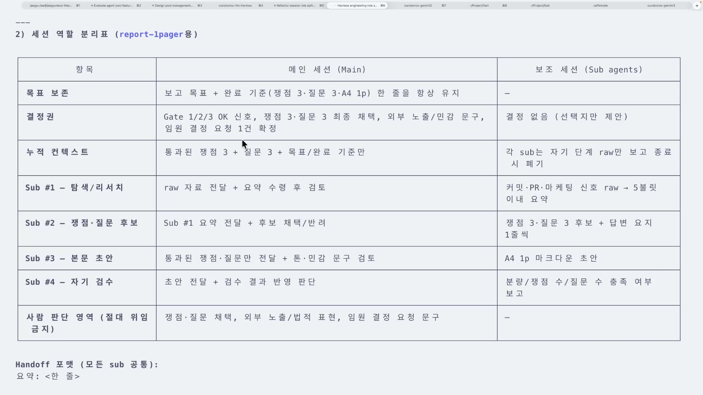

이 분리표를 근거로 SKILL.md를 고친다. 메인이 유지할 책임은 두 가지로 줄어든다. 반려 기준을 한 줄로 고정해 출력하는 것, 그리고 모든 게이트에서 OK 또는 반려 신호를 주는 것. 나머지 단계는 전부 서브 에이전트로 위임한다. 표 한 장이 그대로 코드의 골격으로 옮겨 가는 셈이다.

## v1과 v2를 같은 조건에서 붙여 보기

분리표대로 고친 버전을 그냥 덮어쓰지 않고 **v2로 따로 저장**한다. 기존 문서형 버전(v1)을 보존해야 둘을 나란히 비교할 수 있기 때문이다. 그래서 비교 대상은 `report-1pager`(v1, 문서형)와 `report-1pager-v2`(v2, 분업형) 둘이다.

비교 실험을 신뢰하려면 무엇이 같고 무엇이 다른지를 먼저 못박아야 한다. 같은 것은 모델과 입력과 작업이다. 모델은 둘 다 Sonnet으로 통일한다.

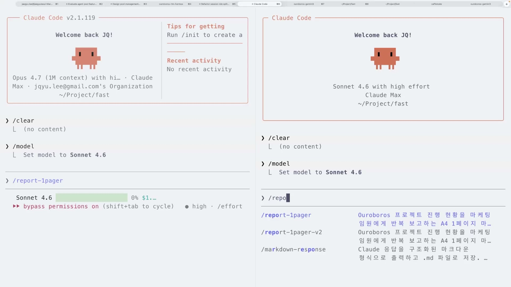

모델을 Sonnet으로 고른 데는 이유가 있다. Sonnet은 원 밀리언(1M 컨텍스트)이 아니라서 변화가 더 잘 드러난다는 것이다. 컨텍스트 한도가 넉넉한 모델로 돌리면 절약 효과가 잘 안 보인다. 한도가 작은 모델로 돌려야 컨텍스트를 아꼈는지 아닌지가 또렷이 드러난다. 다른 건 딱 하나, 문서형이냐 분업형이냐다.

작업은 같은 마케팅 보고서 작성이고, 입력도 같은 3일치 데이터다. 메인 세션이 GitHub에서 최근 3일치 커밋과 PR, 이슈를 모아 온다.

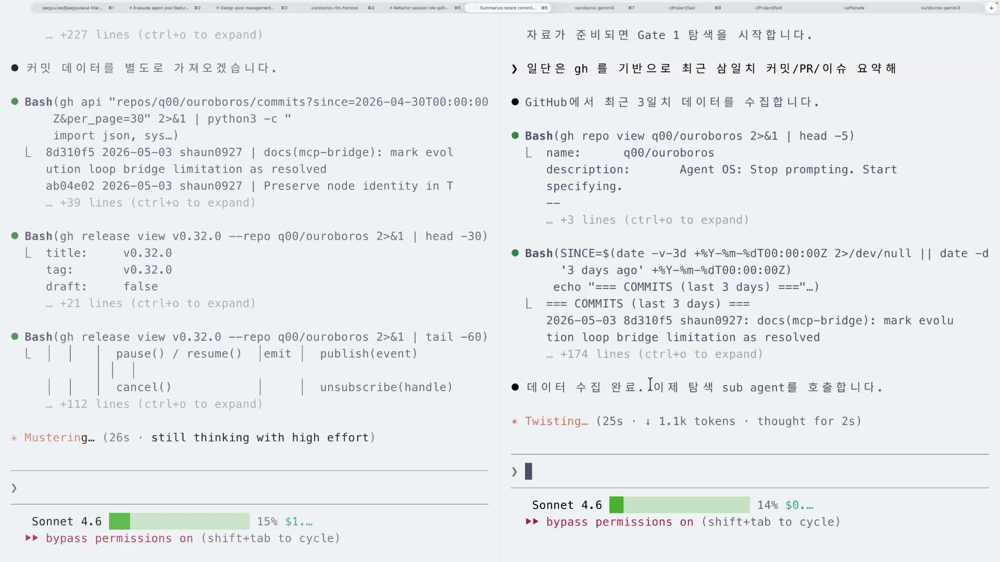

여기서 다루는 소재는 실제로 존재하는 오픈소스 프로젝트 "오로보로스(Ouroboros)"다. GitHub의 Q00/ouroboros 저장소로, 자신을 "Agent OS"로 소개하는 AI 코딩용 프로젝트다. 화면에서 메인 세션은 `gh repo view q00/ouroboros`, `gh api repos/q00/ouroboros/commits` 같은 명령으로 이 저장소의 최근 커밋과 PR, 릴리즈를 실제로 수집해 마케팅 보고서의 재료로 삼는다. 다만 그 위에서 만들어지는 보고서, 곧 벤치마크 1등이나 GitHub 트렌딩, 외부 컨트리뷰터 활성화 같은 마케팅 신호와 기능 정리는 AI 에이전트가 그 데이터를 마케팅 관점으로 가공해 써 내려간 결과물이다. 그래서 실습의 초점은 보고서 내용 하나하나의 진위가 아니라, 그 보고서를 만드는 과정에서 컨텍스트가 어떻게 흐르느냐에 있다.

## 게이트별로 흘러가는 분업

분업형은 게이트 단위로 끊겨 진행된다. 자료 수집이 끝나면 서브 에이전트가 약 1만 토큰 규모를 써서 릴리즈 기능 요약을 가져온다. 그 다음 게이트에서 포지셔닝 쟁점과 예상 질문을 뽑는다. "에이전트 OS를 카테고리명으로 쓸 수 있는가" 같은 후보들이다. 메인 세션은 마케팅 임원이 던질 법한 예상 질문 3개를, 다시 뽑는 과정 없이 한 번에 뽑아낸다.

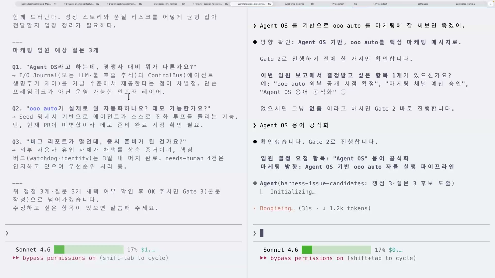

게이트를 하나 통과할 때마다 컨텍스트 사용량이 표시되니, 어느 단계에서 얼마나 썼는지를 눈으로 확인할 수 있다. 이게 게이트의 또 다른 효용이다. 분업이 실제로 컨텍스트를 아끼고 있는지를 단계마다 점검하게 해 준다.

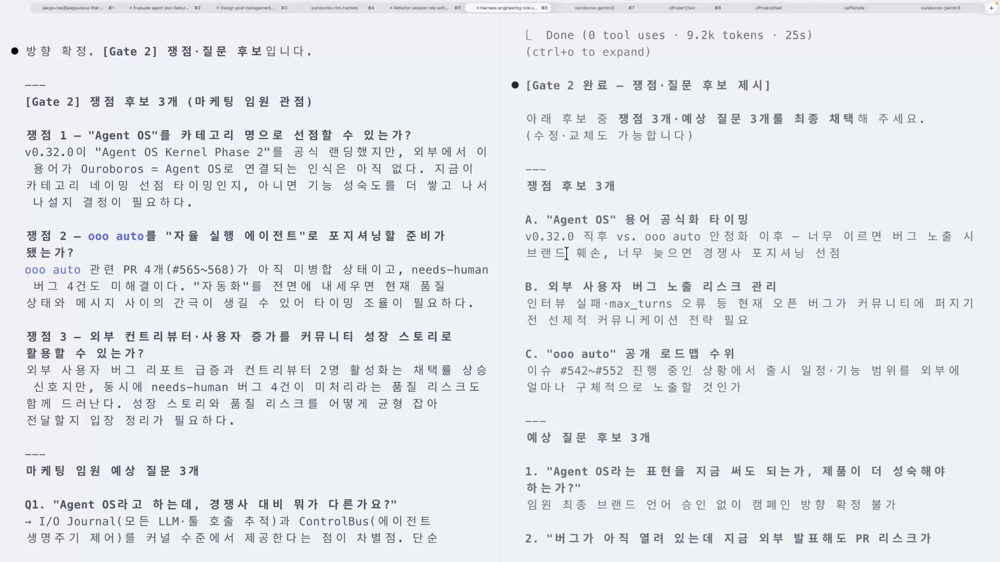

## 검수는 다른 눈이어야 한다

이 실험에서 검수 단계를 따로 떼어 볼 만하다. 보고서를 다 쓴 뒤 자기 검수를 돌리자, 검수 에이전트가 문제를 잡아낸다. 크게 개선됐지만 남은 문제 두 개가 있고, 그중 하나가 "보고서에 OO-Auto라는 기능이 등장하는데 정작 그게 무슨 기능인지 정의가 없다"는 것이다.

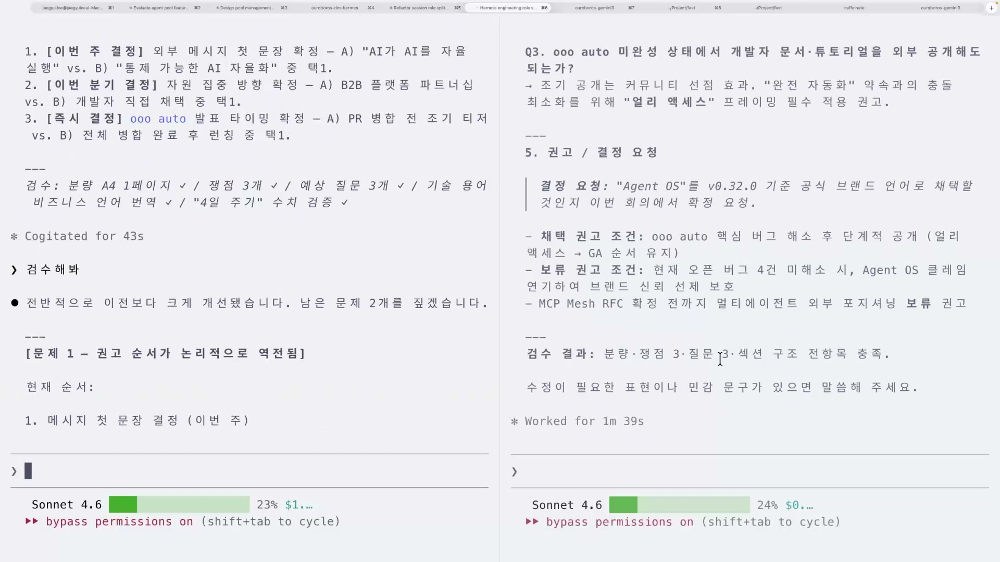

이 장면이 분업의 진짜 가치를 보여준다. 메인 세션 혼자 작업하면, 자기가 놓친 과정을 또 그 놓친 눈으로 검수하게 된다. 본문을 쓴 컨텍스트와 검수하는 컨텍스트가 같으니 같은 사각지대를 공유하는 것이다. 분업형은 검수를 다른 컨텍스트의 에이전트에 맡긴다. 보고서를 쓴 에이전트와 검수하는 에이전트가 서로 다른 맥락을 갖고 있어, 빠진 정의 같은 걸 객관적으로 잡아낸다. 게다가 한 번에 완벽히 나오는 경우는 드물어서 검수를 여러 번 돌리는 게 자연스럽다. 생성과 검수를 나누는 진짜 이유는 속도가 아니라 이 **객관적 자기 교정**에 있다.

문제를 반영해 최종본을 다시 쓰면 보고서가 완성된다. 에이전트를 많이 부르는 분업형 쪽이 오히려 더 빨리 끝났다.

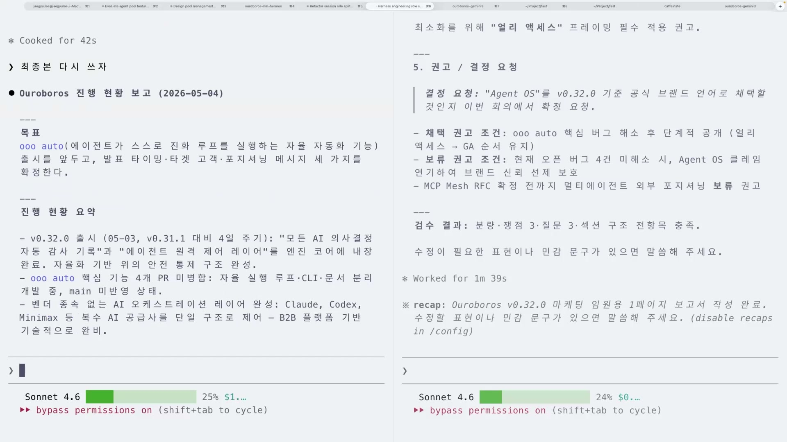

## 25% 대 24%, 그리고 정직한 단서

그래서 결과는 어땠나. 같은 작업을 끝냈을 때 문서형 v1은 컨텍스트를 25%, 분업형 v2는 24% 썼다.

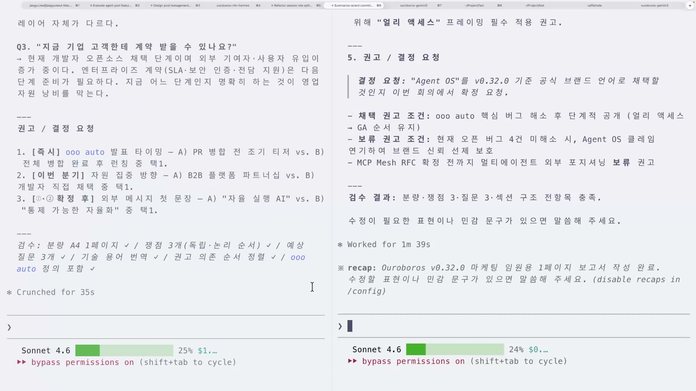

여기서 솔직해질 필요가 있다. 25% 대 24%는 작은 차이다. 분업형이 압도적으로 적게 썼다고 말하면 과장이다. 강사 본인이 그 이유를 짚는다. 이번 실습은 서브 에이전트의 결과를 **값으로 통째 받았다**. 프로그래밍에서 말하는 pass by value처럼, 서브가 만든 내용 전체가 메인 컨텍스트로 들어와 버린 것이다. 만약 결과를 **파일 이름으로** 받았다면, 메인은 그 파일을 가리키는 포인터만 쥐고 필요할 때 열어 봤을 테니 컨텍스트를 훨씬 아꼈을 것이다.

이 단서가 중요한 진실을 담고 있다. **분업형으로 바꿨다고 컨텍스트가 자동으로 절약되는 게 아니다.** 결과를 어떻게 주고받느냐, 곧 핸드오프 설계까지 손봐야 효과가 난다. "분업형으로 바꿨다"는 끝이 아니라 시작이다.

그러니 이 실험에서 가져갈 결론은 수치의 크기가 아니다. 같은 작업에서 분업형이 컨텍스트를 아끼면서, 동시에 사람 손은 덜 탔다는 사실이다. 문서형 v1은 검수를 다시 해보라고 일일이 지시하는 등 사람이 계속 개입해야 했다. 분업형 v2는 하나는 생성하고 하나는 검수하는 에이전트로 나눠 두니, 사람이 손대지 않아도 검수가 돌고 일이 완료됐다. 차이는 1%포인트가 아니라 거기에 있다.

## 분업은 메인을 지키는 구조다

정리하면 이렇다. 문서형(마크다운) 하네스로 스킬을 돌리면 메인이 모든 걸 혼자 짊어지다가 스스로 단계를 빠뜨리고, 어떤 툴을 제대로 쓰지 않아 할루시네이션 같은 결과가 나오기도 한다. 분업형은 메인에 목표와 제약만 또렷이 기억시켜 두고, 탐색이나 검수처럼 맥락을 잡아먹는 일은 보조 세션에서 소모하게 한다. 그래서 분업은 결국 **메인 세션의 컨텍스트를 지켜 주는 구조**다.

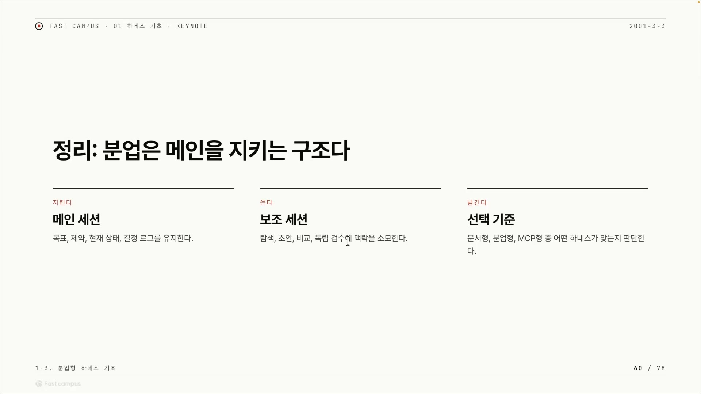

다만 문서형이 무조건 나쁜 건 아니다. 사람 손을 많이 탄다는 건 뒤집으면 사람이 매 단계 개입할 수 있다는 뜻이라, 그렇게 끼어들고 싶은 작업엔 오히려 맞을 수도 있다. 어느 쪽을 고를지는 앞에서 본 네 잣대로 따지면 된다. 일의 길이, 자료와 결정의 혼재, 재사용 여부, 그리고 일회성이다.

분업형 하네스는 마크다운 하네스에서 출발해 "서브 에이전트를 어떻게 쓸지" 구조를 먼저 정하고 시작하면 더 잘 만들 수 있다. 오늘 다룬 건 챕터 1의 맛보기에 가깝다. 더 어렵고 더 구조적인 하네스는 다음 챕터들의 몫이고, 세 번째 종류인 MCP형 하네스는 바로 다음 클립에서 이어진다.
