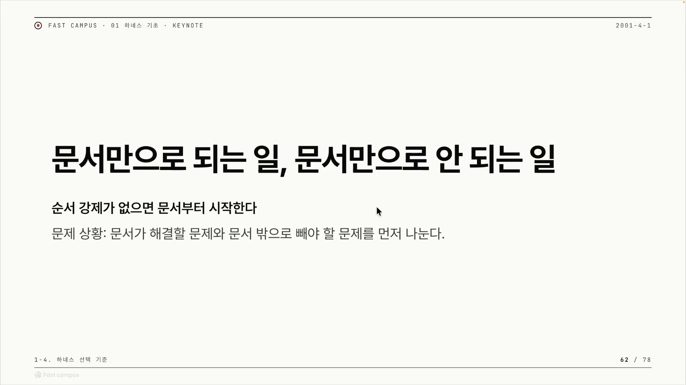
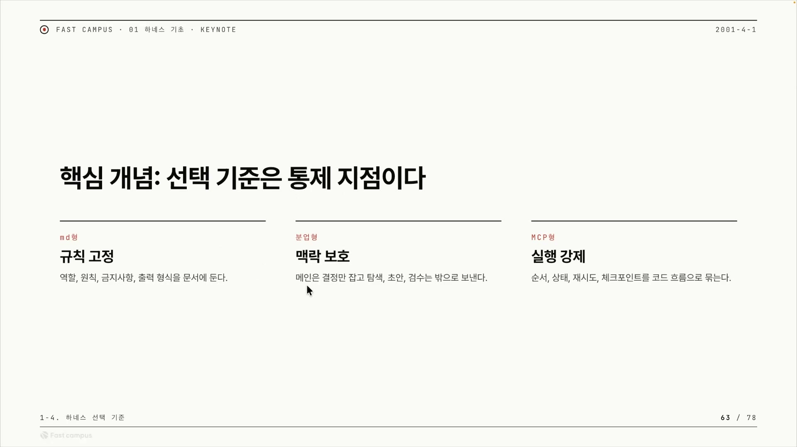
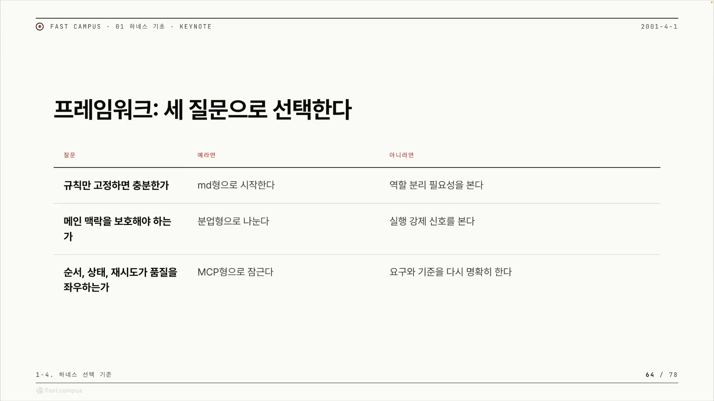
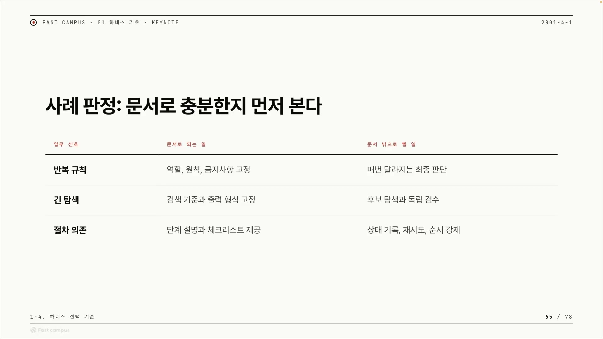
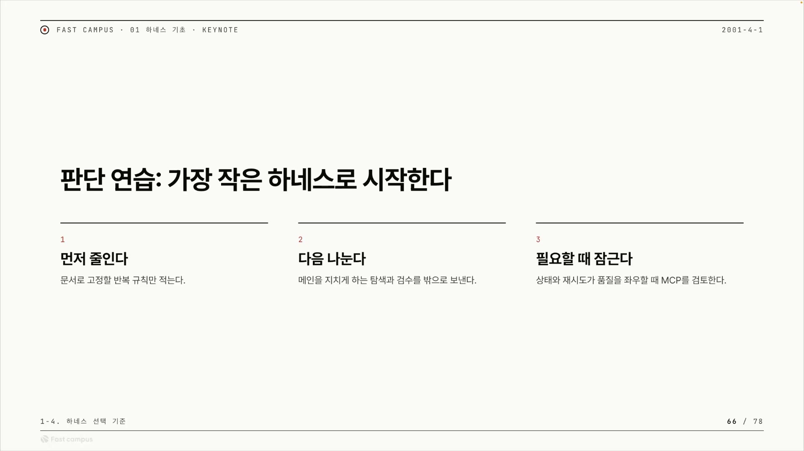

AI에게 일을 시키다 보면 한 가지 갈림길에 선다. 어떤 일은 규칙을 글로 적어 던져주는 것만으로 깔끔하게 끝나고, 어떤 일은 아무리 글을 잘 적어도 자꾸 어긋난다. 이 강의(패스트캠퍼스 'Ch04-01. 문서만으로 되는 일, 문서만으로 안 되는 일')는 바로 그 경계를 다룬다. 새로운 기법을 가르치는 게 아니라, 앞에서 따로따로 배운 세 가지 방식을 놓고 "그래서 내 일에는 셋 중 무엇을 써야 하나"라는 질문에 답을 주는 정리편이다.



출발점은 단순하다. 순서를 빡빡하게 강제할 필요가 크지 않으면, 일단 문서부터 시작해도 된다는 것이다. 마크다운에 규칙을 적어 AI에게 주고, 그걸로 굴러가면 거기서 멈춘다. 문제는 안 굴러갈 때다. 탐색하고 비교하고 검수하는 작업이 한 대화에 계속 쌓이거나, "이거 다음엔 뭘 해야 하지"를 사람이 매번 기억해야 하는 일이라면 문서만으로는 버겁다.

여기서 누구나 한 번쯤 떠올리는 해법이 있다. 그럼 문서를 더 길게, 더 자세히 쓰면 되지 않나? 강의의 대답은 단호하다.

> "그럼 더 안 되죠. 긴 스킬로 인해서 컨텍스트가 더 많이 축적되고 모델이 길을 잃어버릴 상황이 생깁니다."

문서를 늘리는 건 해결이 아니라 악화다. 이 반직관이 강의 전체의 입구다. 왜 길게 쓸수록 더 안 되는지는 컨텍스트라는 말 하나로 설명된다. 컨텍스트는 AI가 한 작업에서 지금 머릿속에 들고 있는 정보 전체다. 처음 받은 지시문, 그동안 주고받은 내용, 작업하며 만든 중간 산출물이 다 여기 들어간다. 사람으로 치면 단기 기억에 가깝다. 그런데 이 머릿속에 잡다한 게 너무 많이 쌓이면 AI는 정작 중요한 걸 놓치고 엉뚱해진다. 긴 문서는 AI가 매번 읽고 짊어져야 할 양을 부풀려, 핵심에 집중할 여력을 깎아먹는다. 문서를 길게 쓰면 더 안 되는 이유가 바로 이것이다.

이 강의의 중심어는 하네스다. 말(馬)에 씌우는 마구(馬具)에서 온 말로, 똑똑하지만 제멋대로일 수 있는 AI에 고삐를 채워 원하는 방향으로 일하게 만드는 작업 틀, 곧 통제 장치를 가리킨다. 하네스를 만드는 방식이 세 가지라는 게 이번 챕터의 주제다.

## 세 하네스를 가르는 단 하나의 기준: 통제 지점

흔히 마크다운 → 분업 → MCP를 초급에서 고급으로 올라가는 사다리로 오해한다. 강의는 이걸 분명히 부정한다. 셋은 성능 등급이 아니라 무엇을 통제하느냐로 갈린다. 슬라이드 제목이 그대로 명제다. 선택 기준은 통제 지점이다.

| 유형          | 통제 지점 | 무엇을 두는가                                         |
| ------------- | --------- | ----------------------------------------------------- |
| md형 (문서형) | 규칙 고정 | 역할, 원칙, 금지사항, 출력 형식을 문서에 둔다         |
| 분업형        | 맥락 보호 | 메인은 결정만 잡고 탐색, 초안, 검수는 밖으로 보낸다   |
| MCP형         | 실행 강제 | 순서, 상태, 재시도, 체크포인트를 코드 흐름으로 묶는다 |



**문서형(마크다운) 하네스**는 가장 단순하다. AI에게 줄 규칙을 마크다운 문서 한 장에 적어둔다. "너의 역할은 X다, 원칙은 Y다, Z는 하지 마라, 결과는 이 형식으로 내라" 같은 걸 글로 못 박는 방식이다. 여기서 '스킬'이라는 말이 나오는데, 이 강의에서 스킬은 곧 AI에게 주는 규칙 문서 한 묶음을 뜻한다. 매번 같은 규칙으로 같은 모양의 결과를 내는 일이라면 문서만으로 끝난다. 강의는 "간단한 업무 자동화들은 마크다운 형태에서 다 끝나지 않을까"라고 말한다.

**분업형 하네스**는 일을 쪼갠다. 핵심 결정은 메인 대화(메인 세션)가 내리고, 양 많고 부수적인 작업(탐색, 초안, 검수)은 별도의 보조 AI인 서브에이전트에게 떼어 보낸다. 이렇게 하는 이유가 '맥락 보호'다. 탐색이나 검수는 임시 데이터를 잔뜩 만드는데, 이걸 전부 메인에 쌓으면 메인의 머릿속이 흐려진다. 그래서 임시 데이터가 생기는 작업을 메인 밖으로 빼서, 메인의 컨텍스트를 깨끗하게 지킨다.

> "탐색이나 초안이나 검수 등의 임시적인 데이터들이 존재하는 것들은 메인 세션이 아니라 서브 에이전트를 이용해서 호출시키는 게 좋을 것 같습니다."

같은 일을 문서에 다 적어둘 수도 있다. 하지만 빼는 편이 더 자세히 다룰 수 있고, 컨텍스트를 덜 먹고, 메인이 오염되지 않는다는 게 강의의 설명이다.

**MCP형 하네스**는 순서, 상태, 재시도, 체크포인트를 코드로 강제하는 가장 무겁고 확실한 방식이다. 여기서 MCP는 정식 정의(Model Context Protocol)보다는, 이 강의 맥락에선 "AI의 동작을 코드로 묶어 강제하는 방식" 정도로 이해하면 충분하다. 핵심은 사람이 손대지 않아도 시스템이 스스로 완료까지 밀어붙인다는 점이다.

> "유저는 딱히 뭔가 액션이 없더라도 그게 될 때까지 계속 강제하고 상태를 체크하고 완료될 때까지 계속 돌게 하는 것들이 MCP형이라고 볼 수 있을 것 같습니다."

왜 이걸 글로는 못 하느냐가 중요하다. 실행 강제, 순서, 상태, 재시도 같은 것은 자연어로 부탁해서는 보장되지 않는다. 문서에 "꼭 재시도해"라고 적어두는 것과, 코드로 "성공할 때까지 반복 실행"을 박아두는 것은 신뢰도가 다르다. 그래서 이런 것은 코드 흐름으로 묶어 캡슐화한다.

세 하네스는 위로 갈수록 강력하지만 그만큼 만들기 어렵고 무겁다. 그래서 더 우월한 걸 고르는 게 아니라, 내 문제의 통제 지점에 맞는 걸 고르는 것이다.

## 세 질문으로 정한다

그럼 실제로 어떻게 고르나. 강의는 감으로 정하지 말고, 순서가 있는 세 개의 예/아니오 질문으로 정하라고 한다.

| 질문                                 | 예라면            | 아니라면                       |
| ------------------------------------ | ----------------- | ------------------------------ |
| 규칙만 고정하면 충분한가             | md형으로 시작한다 | 역할 분리 필요성을 본다        |
| 메인 맥락을 보호해야 하는가          | 분업형으로 나눈다 | 실행 강제 신호를 본다          |
| 순서·상태·재시도가 품질을 좌우하는가 | MCP형으로 잠근다  | 요구와 기준을 다시 명확히 한다 |



이 표를 단순 비교표로 읽으면 절반만 본 것이다. 오른쪽 '아니라면' 칸이 곧 다음 질문으로 내려가는 화살표다. 위에서부터 묻고, '예'가 나오면 그 하네스에서 멈추고, '아니오'면 한 칸 아래로 내려간다. 결정 트리로 풀면 이렇게 흐른다.

```
[질문 1] 규칙만 고정하면 충분한가?
  ├─ 예   → 문서형(md). 역할·원칙·금지·출력 형식만 문서에 박으면 끝.
  └─ 아니오 ↓
[질문 2] 메인 맥락을 보호해야 하는가? (탐색·검수로 메인이 지치는가)
  ├─ 예   → 분업형. 무거운 작업을 서브에이전트로 분리.
  └─ 아니오 ↓
[질문 3] 순서·상태·재시도가 품질을 좌우하는가? (틀리면 안 되는 순서, 반드시 재시도)
  ├─ 예   → MCP형. 코드로 실행을 강제·잠금.
  └─ 아니오 → 도구 문제가 아니다. 요구·성공 기준부터 다시 정의하라.
```

첫 질문의 판별 신호는 반복 규칙, 역할, 금지사항, 출력 형식이 핵심이냐다. 매번 같은 규칙으로 같은 결과를 낸다면 문서형에서 시작한다. 둘째 질문의 신호는 탐색, 생성, 검수 같은 작업이 한 세션에 쌓여 메인이 흐려지느냐다. 그렇다면 무거운 작업을 밖으로 빼야 하니 분업형이다. 셋째 질문의 신호는 한 번 실패하면 안 되거나 정해진 순서를 반드시 지켜야 하느냐다. 그렇다면 재시도를 사람이 챙기는 게 아니라 코드로 무조건 강제해야 하니 MCP형이다.

세 질문이 왜 이 순서인지에도 뜻이 있다. 위에서 아래로 갈수록 만들기 비싸지는 순서다. 가장 싼 문서형을 먼저 묻고 '예'가 나오면 거기서 멈추니, 자연스럽게 가장 가벼운 해법에서 멈추게 된다. 절제의 철학이 표의 구조 자체에 박혀 있어서, 순서대로 따라가기만 해도 과하게 만들지 않게 된다.

가장 곱씹을 대목은 맨 아래 칸이다. 세 질문에 모두 '아니오'라면 어떻게 하나. 표는 "요구와 기준을 다시 명확히 한다"라고 답한다.

> "만약에 이 세 질문이 모두 명확하지 않다면 우리가 어떠한 자동화를 할지 요구 자체가 덜 정의된 상태라고 볼 수 있을 것 같아요. … 목표나 제약, 성공 기준부터 다시 명확하게 하고 오는 것이 중요할 것 같습니다."

하네스를 못 고르는 건 도구가 부족해서가 아니라 문제 정의가 안 된 것이다. 자동화하고 싶은데 세 질문 어디에도 '예'가 안 나온다면, 만들 게 없는 게 아니라 무엇을 만들지를 아직 모르는 상태다. 강의가 이 지점을 AX(AI Transformation), 곧 업무를 AI 중심으로 다시 설계하는 일과 연결하는 것도 그래서다.

## 하네스를 통째로 고르지 않는다: 문서의 경계

지금까지가 "어떤 하네스냐"였다면, 여기서 한 칸 더 내려간다. 실무에서는 하나의 업무를 통째로 한 하네스에 맡기지 않는다. **같은 일 안에서도** 문서로 고정할 부분과 문서 밖으로 빼야 할 부분을 나눈다.

| 업무 신호 | 문서로 되는 일              | 문서 밖으로 뺄 일            |
| --------- | --------------------------- | ---------------------------- |
| 반복 규칙 | 역할, 원칙, 금지사항 고정   | 매번 달라지는 최종 판단      |
| 긴 탐색   | 검색 기준과 출력 형식 고정  | 후보 탐색과 독립 검수        |
| 절차 의존 | 단계 설명과 체크리스트 제공 | 상태 기록, 재시도, 순서 강제 |



세 행을 관통하는 원리는 하나다. 변하지 않는 것은 문서에 두고, 매번 달라지거나 반드시 강제돼야 하는 것은 밖으로 뺀다.

반복 규칙에서 역할, 원칙, 금지사항은 매번 같으니 문서로 고정한다. 하지만 최종 판단은 문서에 박지 말아야 한다. 상황마다 답이 달라야 하는 것을 글로 못 박으면 AI가 그 틀에 갇히기 때문이다.

> "최종 판단 자체가 계속 달라지죠. 그럼 그거 자체는 문서에 따로 픽스하지 말고 열린 결말로 만들어두는 것이 좋을 것 같습니다. … 최종 판단까지도 어떤 문서에 적어두게 된다면 그것 자체가 최종 판단에 프릭션이 될 수 있거든요."

여기 두 용어가 묶여 있다. **열린 결말**은 출력 형식 같은 틀은 고정하되 상황마다 달라져야 하는 결론은 미리 못 박지 않고 열어두는 것이고, 그 판단은 사람에게 위임한다. **프릭션**(friction)은 일을 매끄럽게 흐르지 못하게 하는 걸림돌이다. 도우려고 문서에 다 적어둔 것이 오히려 AI의 판단을 막는 역효과를 가리킨다. 출발점을 고정하는 건 좋지만 결말까지 고정하면 그 친절이 마찰이 된다는 것이다.

긴 탐색에서는 검색 기준과 출력 형식까지는 문서에 둘 수 있다. 다만 실제 후보 탐색과 독립 검수는 보조 세션으로 빼는 편이 낫다. 문서에 둘 수는 있지만 빼면 더 자세하고, 컨텍스트를 덜 먹고, 오염되지 않는다. 앞서 본 분업형으로 이어지는 대목이다.

절차 의존에서 가장 미묘한 구분이 나온다. 단계를 설명하고 체크리스트를 주는 것은 문서로 된다. 하지만 상태 기록, 재시도, 완전한 순서 강제는 문서 밖으로 빼야 한다.

> "절차의 의존, 어떤 순서에 대해서 의존해야 될 단계는 문서에 둬도 동작을 합니다. 하지만 이 상태 기록, 재시도, 완전한 순서 강제에 대해서는 문서 밖으로 빼서 MCP에서 시도를 해보는 것도 좋을 것 같습니다."

순서를 설명하는 것은 문서로 되지만, 순서를 강제하는 것은 문서로 안 된다. 글은 "이 순서대로 해"라고 말할 뿐, 안 지켜도 막지 못한다. 강제는 코드의 몫이다. 이 한 줄이 문서가 잘하는 일과 못하는 일의 본질을 가른다. 문서는 말해줄 수 있는 것을 잘하고, 분업과 코드는 강제하거나 덜어내야 하는 것을 잘한다.

## 실전: 가장 작은 하네스부터

이론을 행동으로 옮기는 순서도 정해져 있다. 먼저 줄이고, 다음 나누고, 필요할 때 잠근다.

| 단계 | 제목             | 내용                                            |
| ---- | ---------------- | ----------------------------------------------- |
| 1    | 먼저 줄인다      | 문서로 고정할 반복 규칙만 적는다                |
| 2    | 다음 나눈다      | 메인을 지치게 하는 탐색과 검수를 밖으로 보낸다  |
| 3    | 필요할 때 잠근다 | 상태와 재시도가 품질을 좌우할 때 MCP를 검토한다 |



이 3단계는 앞의 세 질문과 1:1로 맞물린다. 질문이 "무엇을 골라야 하나"였다면, 단계는 "어떤 순서로 실제 손을 대나"다.

1단계가 '줄인다'인 이유가 핵심이다. 처음부터 많이 적으려 하지 말라는 뜻이다. 그 업무에서 매번 똑같이 반복되는 규칙만 골라 마크다운에 적는다. 어떤 역할을 넣을지, 어떤 원칙을 넣을지, 출력 형식을 무엇으로 고정할지를 적어두는 정도다. 이걸로 메인이 버거워지면 2단계로 가서, 컨텍스트를 많이 먹거나 오염시키는 작업을 밖으로 뺀다. 그래도 상태와 재시도가 품질을 좌우한다면, 그때 비로소 3단계에서 MCP를 검토한다. '필요할 때'라는 조건이 핵심이다. MCP는 기본값이 아니라 예외다.

> "정말 상태 그리고 재시도 같은 게 품질을 좌우할 때 MCP를 검토해보면 될 것 같습니다."

시작점도 정해져 있다. 챕터를 따라오며 시도해본 업무 자동화 중 안 됐던 것이 있다면, 그게 가장 좋은 출발점이다. 안 되던 걸 가져와 "1단계, 이 일에서 문서로 줄일 수 있는 규칙은 무엇인가"부터 다시 짚는다.

## 결국 두 가지 절제

표면은 하네스 3종 비교지만, 이 강의가 정말 하고 싶은 말은 두 개의 절제로 모인다.

하나는 **과하게 만들지 마라**다. 모든 하네스가 MCP형일 필요는 없다. 강력한 도구를 처음부터 꺼내면 비용만 크고 얻는 건 적다. 막히는 지점이 곧 다음 단계로 가라는 신호이고, 막히지 않으면 굳이 올라갈 이유가 없다. 소프트웨어 공학에서 말하는 오버엔지니어링 경계와 똑같은 정신이다. 그래서 곧장 MCP로 건너뛰기도 어렵다. 아래 단계를 거치며 무엇이 부족한지를 알아야 위 단계를 제대로 만든다.

> "모든 하네스가 MCP형으로 만들어질 필요가 없습니다. … 하지만 바로 MCP형 넘어가기는 어렵겠죠."

다른 하나는 **문서에 다 적으려 하지 마라**다. 길게 쓴다고 해결되지 않는다. 문서가 잘하는 일은 고정된 규칙을 말해주는 것이고, 못하는 일은 매번 달라지는 판단, 양 많은 탐색, 엄격한 순서 강제다. 못하는 일은 깔끔하게 문서 밖으로 빼서 분업과 코드에 맡긴다.

세 하네스, 세 질문, 세 단계로 갈래는 많아 보이지만 손에 쥘 한 문장은 짧다. 통제할 지점이 규칙이면 문서로, 맥락이면 분업으로, 실행 순서와 재시도면 코드로 간다. 그리고 무엇을 고르든 가장 작은 것부터 시작한다.
