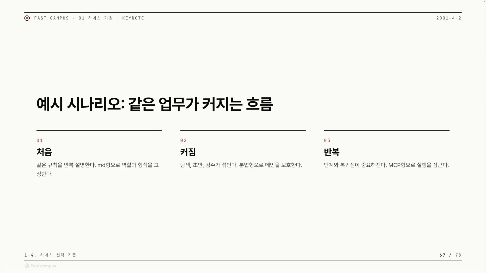
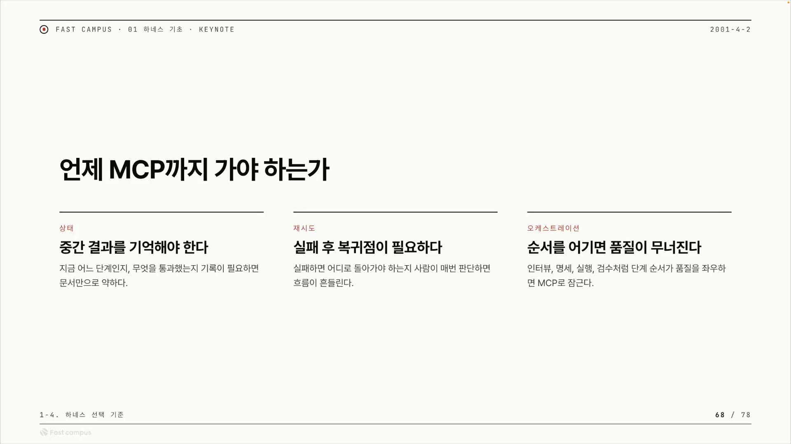
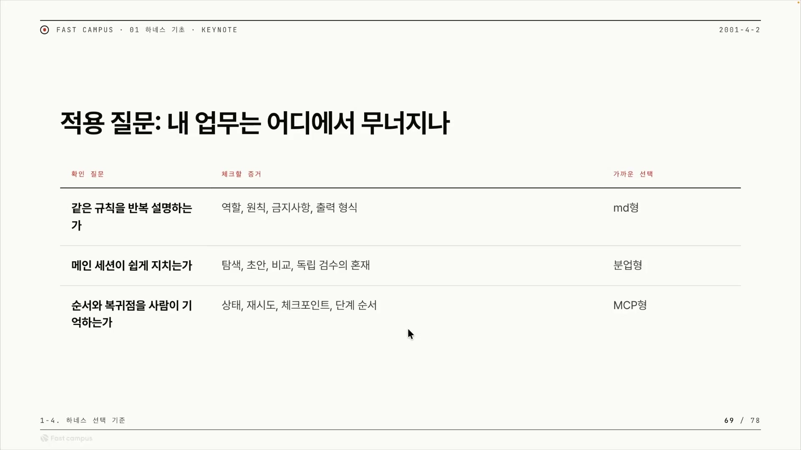
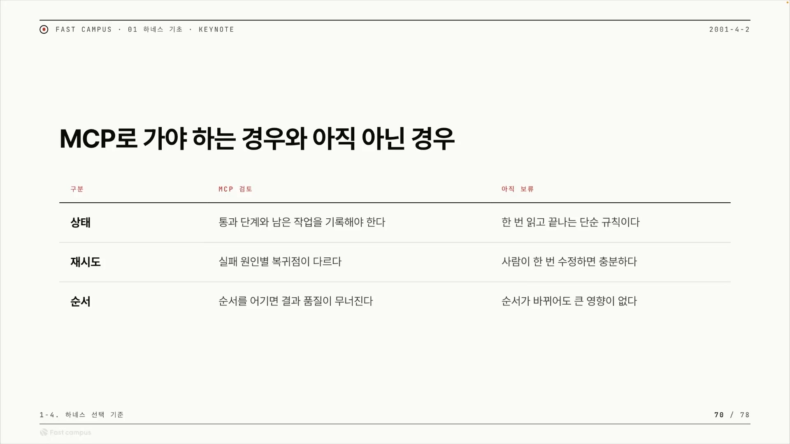
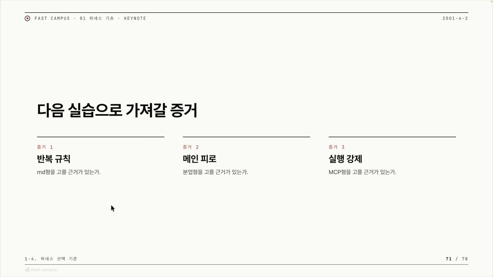

MCP라는 단어를 처음 들으면, 왠지 그게 제일 어렵고 제일 높은 단계처럼 느껴진다. 프롬프트로 시작해서, 규칙을 정리하고, 역할을 나누고, 그러다 마침내 도달하는 끝판왕. 그런 사다리의 꼭대기.

이 강의를 정리하면서 가장 먼저 무너진 게 그 그림이었다. 강의자는 거의 정색하듯 못을 박는다.

> "MCP형이 더 고급같이 보인다고 생각하면 안 됩니다."

MCP는 사다리의 꼭대기가 아니다. AI 에이전트에게 일을 시킬 때 쓰는 틀(이걸 강의에서는 "하네스(harness)"라고 부른다)에는 세 종류가 있는데, 셋은 초급에서 고급으로 올라가는 계단이 아니라 서로 다른 문제를 푸는 도구다. 그래서 핵심 질문은 "언제 MCP까지 올라가나"가 아니라 "내 문제에 셋 중 무엇이 맞나"가 된다. 이 글은 그 판단 기준을 정리한 것이다.

## 하네스라는 말부터

하네스는 원래 말에 채우는 마구(馬具)를 가리킨다. 묶어서 제어하는 장치라는 뜻이다. AI에게 일을 시킬 때도 마찬가지여서, 마구잡이로 프롬프트만 던지면 결과가 매번 흔들린다. 그래서 그 작업을 규칙, 역할, 실행 순서 같은 틀로 감싸 결과를 안정시키는데, 그 틀이 하네스다.

강의는 하네스를 세 종류로 나눈다. 마크다운형, 분업형, MCP형. 이름은 달라 보여도 가르는 기준은 하나다. **무엇을 어디까지 강제하느냐.**

## 같은 업무가 커지는 흐름

강의는 추상적인 분류 대신 같은 업무가 점점 커지는 한 장면으로 시작한다.

처음에는 단순하다. 매번 같은 역할과 같은 금지사항을 설명하고, 결과를 받는다. 이 정도는 그 "매번 같은 말"을 문서 하나에 적어두면 끝난다. 역할, 원칙, 하지 말 것, 출력 형식을 마크다운에 박아두면 그게 마크다운형이다. 같은 규칙을 입으로 반복하다 보면 어디선가 빠뜨리거나 어긋나는데, 그걸 글로 고정해 막는다.

업무가 커지면 한 작업 안에 탐색과 초안과 검수가 섞이기 시작한다. 한 세션에서 이걸 다 하면 맥락이 길어지고, 강의자 표현으로 "쉽게 지친다". 그래서 성격이 다른 일을 서로 다른 세션으로 쪼개 맡긴다. 탐색은 탐색끼리, 검수는 검수끼리. 메인 세션은 가볍게 유지하고 무거운 일은 떼어내는 것, 이게 분업형이다.

여기서 더 반복되면 양상이 달라진다. 소프트웨어 개발이 그렇듯 탐색에서 초안, 검수로 도는 주기가 계속 돌면, 어느 단계까지 통과했는지, 실패하면 어디로 돌아갈지, 어떤 체크포인트를 지나야 다음으로 갈 수 있는지가 중요해진다. 이때부터 마크다운형이나 분업형으로는 부족해진다. 그래서 MCP형이 필요해진다.

강의자는 그 "필요해지는 순간"을 세 신호로 정리한다. 강의 제목을 단 슬라이드이기도 하다.

상태는 중간 결과를 기억해야 하는 것이다. 재시도는 실패한 뒤 어디로 돌아갈지의 문제다. 오케스트레이션은 여러 단계를 정해진 순서로 지휘하는 것인데, 그 순서를 어기면 품질이 무너진다. 이 셋이 동시에 걸리기 시작하면 사람의 머리로 붙들기 어려워지고, 그제서야 MCP형이 답이 된다.

## 세 하네스가 강제하는 범위

세 유형을 강의자가 직접 내린 정의로 나란히 두면 차이가 또렷하다.

| 유형 | 본질 | 푸는 문제 |
|---|---|---|
| 마크다운형 | 규칙을 기억시키는 방식 | 같은 역할, 원칙, 금지사항을 매번 다시 설명하는 낭비 |
| 분업형 | 메인 세션의 컨텍스트를 보호하는 방식 | 한 세션에 탐색, 초안, 검수가 섞여 맥락이 지치는 문제 |
| MCP형 | 실행 흐름 자체를 메인 세션에서 아예 못 건들게 하는 것 | 순서, 상태, 재시도를 사람이 매번 머리로 챙겨야 하는 문제 |

이 셋을 강제하는 범위로 줄 세우면 한 줄로 정리된다. 마크다운형은 규칙만 고정한다. 분업형은 규칙에 더해 누가 무엇을 할지 역할까지 나눈다. MCP형은 거기에 실행 흐름까지 묶는다. 순서, 상태, 재시도, 복귀점을 전부 도구 안쪽에 넣어버린다.

여기서 마크다운형과 MCP형의 결정적 차이가 드러난다. 마크다운형은 규칙을 기억시킬 뿐, 작업의 순서나 흐름은 강제하지 못한다. 분업형은 일을 나눌 뿐, 실패했을 때 어디로 되돌아갈지는 보장하지 못한다. 그 둘이 못 하는 자리를 MCP형이 메운다. 강의자 말로는 실행 흐름을 메인 세션이 아예 못 건드리게, 도구 안쪽으로 넣어버려서 순서와 상태와 재시도와 체크포인트를 강제해버리는 것이다.

왜 그렇게까지 하느냐면, LLM이 비결정적이기 때문이다. 같은 입력을 줘도 매번 조금씩 다르게 행동한다. 코드나 프로그램은 반대로 결정적이다. 같은 입력이면 같은 결과가 나온다. MCP형의 존재 이유를 강의자는 이렇게 말한다.

> "비결정적인 모델을 결정적으로 만들어주는, 실행으로 묶어내는 장치."

흔들리는 모델을 코드로 묶어 결과를 고정한다는 뜻이다. 그래서 결과가 흔들리는 이유가 결국 실행 순서나 복귀 조건에 있다면, MCP형으로 가서 코드로 모델을 통제해야 한다는 게 강의자의 판단이다.

다만 뒤로 갈수록 좋아지는 게 아니라, 강제하는 범위가 넓어지는 만큼 만들기 어렵고 무거워진다. MCP가 많은 걸 해결해주긴 하지만, 강의자도 인정하듯 바로 MCP로 만드는 것 자체가 어렵다. 내 업무에 딱 맞는 하네스를 만드는 데 MCP가 답이 아닐 수도 있고, 더 적은 기술과 공수로 되는 경우가 많다. 그래서 MCP는 기본값이 아니라 도착점이다.

## 내 업무는 어디에서 무너지나

셋 중 무엇을 고를지를 강의자는 두 개의 표로 정리해 준다. 첫 표는 내 업무가 어디에서 무너지는지를 묻고, 무너지는 그 지점이 곧 처방이 된다.

| 확인 질문 | 체크할 증거 | 가까운 선택 |
|---|---|---|
| 같은 규칙을 반복 설명하는가 | 역할, 원칙, 금지사항, 출력 형식 | 마크다운형 |
| 메인 세션이 쉽게 지치는가 | 탐색, 초안, 비교, 독립 검수의 혼재 | 분업형 |
| 순서와 복귀점을 사람이 기억하는가 | 상태, 재시도, 체크포인트, 단계 순서 | MCP형 |

위에서부터 차례로 묻고, "그렇다"가 나오는 줄의 처방을 쓰면 된다. 같은 규칙을 매번 다시 설명하고 있을 뿐이라면 마크다운형으로 충분하다. 한 세션에 탐색과 초안과 검수가 한데 섞여 메인이 지친다면 분업형이다. MCP형은 맨 아래 줄에 해당할 때만 등장한다. 순서와 복귀점을 사람이 스스로 머리로 붙들고 있을 때.

강의자가 그 신호를 묘사하는 장면은 이렇다. 사람이 "아 이거 다음은 이 스킬 써야지, 그다음은 이거 써야 하는 거 아닌가" 하고 다음 순서를 매번 고민하기 시작하는 순간. 그렇게 복잡해진다는 건 MCP형이 왔다는 신호다.

## MCP인가, 아직 아닌가

첫 표에서 MCP형이 의심되더라도 바로 만들러 가지는 않는다. 둘째 표로 세 축을 각각 따져 확정한다. 상태와 재시도와 순서, 이 세 단어가 MCP가 정말 필요한지를 가르는 리트머스다.

| 구분 | MCP 검토 | 아직 보류 |
|---|---|---|
| 상태 | 통과 단계와 남은 작업을 기록해야 한다 | 한 번 읽고 끝나는 단순 규칙이다 |
| 재시도 | 실패 원인별로 복귀점이 다르다 | 사람이 한 번 수정하면 충분하다 |
| 순서 | 순서를 어기면 결과 품질이 무너진다 | 순서가 바뀌어도 큰 영향이 없다 |

상태는 지금 어느 단계까지 왔고 남은 일이 무엇인지를 기록해 추적해야 하는가의 문제다. 단계를 통과할 때마다 남은 작업을 적어둬야 한다면 MCP가 맞다. 그냥 한 번 읽고 끝나는 규칙이라면 그럴 필요가 없다.

재시도는 실패했을 때 돌아갈 자리의 문제다. 강의자가 드는 예가 손에 잡힌다. 인수 기준(AC, 작업이 완료됐다고 인정받기 위한 조건 목록)을 번호로 관리할 때, 어느 AC에서 실패했느냐에 따라 돌아갈 지점이 다르다. 투두리스트에서 4번째가 실패했으면 처음부터가 아니라 4번째부터 다시 시작하면 된다. 실패 원인마다 복귀점이 이렇게 달라질 때 재시도를 강제하는 MCP가 빛난다. 반대로 사람이 적당히 한 번 고치면 충분하거나 어차피 일회성이라면 MCP로 갈 이유가 없다.

순서는 어기면 결과가 망가지는 작업이냐의 문제다. 강의자는 자기 도구를 예로 든다. 병렬로 여러 작업을 두고 무엇을 먼저 할지 판단한 뒤 그 순서로 진행하는데, 그 순서를 어기면 당연히 망가진다. 이렇게 순서가 결과 품질을 좌우하면 MCP로 순서를 고정한다.

판단 원칙은 단순하다. 세 축 중 하나라도 "검토" 쪽이 뚜렷하면 MCP를 고려한다. 셋 다 "보류"면 마크다운형이나 분업형으로 충분하다. 결과 품질이 무너지는 이유가 상태든 재시도든 순서든 거기에 있다면, MCP로 상태를 고정하고 복귀할 체크포인트를 만들고 순서를 잠근다. 그게 아니라면 MCP 이전 단계를 써보면 된다.

## MCP가 독이 되는 자리

여기까지는 "언제 가야 하나"였다. 강의는 마지막에 그 반대편, 가지 말아야 할 때를 짚는다. 그리고 이건 상태나 재시도 같은 기술적 조건이 아니라 요구가 명확한가라는 전혀 다른 축의 이야기다.

> "반대로 목표, 맥락, 성공기준이 비어 있다면, MCP를 쓰면 안 됩니다."

MCP는 실행을 결정적으로 고정하는 장치다. 그런데 내가 원하는 것 자체가 모호하면, 그 모호함을 고정하고 증폭하게 된다. 결정적으로 반복한다는 MCP의 강점이 그대로 약점으로 뒤집힌다. 잘못된 방향으로 빠르고 일관되게 달려버리는 것이다. 강의자는 이걸 한 문장으로 묶는다.

> "불명확한 요구를 자동화하면, 불명확함도 함께 반복됩니다."

그래서 자동화보다 앞에 와야 하는 건 인간의 판단이다. 무엇을 원하는지를 먼저 분명히 하는 일은 모델에 위임할 수 없다. 강의자 표현으로 "내가 정말 원하는 게 무엇인가는 인간만이 생각할 수 있게" 두어야 한다.

이 대목에서 강의자는 자기 도구를 증거로 꺼낸다. 우로보로스(Ouroboros)라는 AI 작업 도구인데, 그것조차 "모호했을 때는 잘 안 된다"는 피드백을 받는다고 한다. 잘 만든 MCP 도구도 모호한 입력 앞에서는 무력하다는 자기 고백이다. 그래서 우로보로스에는 소크라테스 인터뷰라는 기능이 있다. 사용자가 자기가 정확히 뭘 원하는지 모를 때, 답을 주는 대신 질문을 던져 진짜 원하는 것을 스스로 끌어내게 하는 장치다. 소크라테스식 문답에서 따온 이름이고, 위치가 중요하다. MCP로 올리기 전 단계. 모호함을 걷어내 성공기준을 채운 다음에야 자동화로 넘어간다.

## 다음으로 가져갈 것

결국 이 챕터가 다룬 건 세 갈래의 신호였다. 같은 규칙이 반복되는가, 메인 세션이 지치는가, 실행 자체를 강제해야 하는가. 각각이 마크다운형, 분업형, MCP형으로 이어진다.

정리하면 이렇다. MCP는 더 높은 단계라서가 아니라, 사람이 지켜야 할 순서가 생기고 업무 품질이 거기서 병목이 되기 시작할 때 고르는 것이다. 그 전에는 더 가벼운 틀로 충분하다. 그리고 무엇을 원하는지가 비어 있다면, MCP가 아니라 그 비어 있음을 먼저 채워야 한다. 자동화가 대신해줄 수 없는, 인간의 몫으로 남는 자리다.
