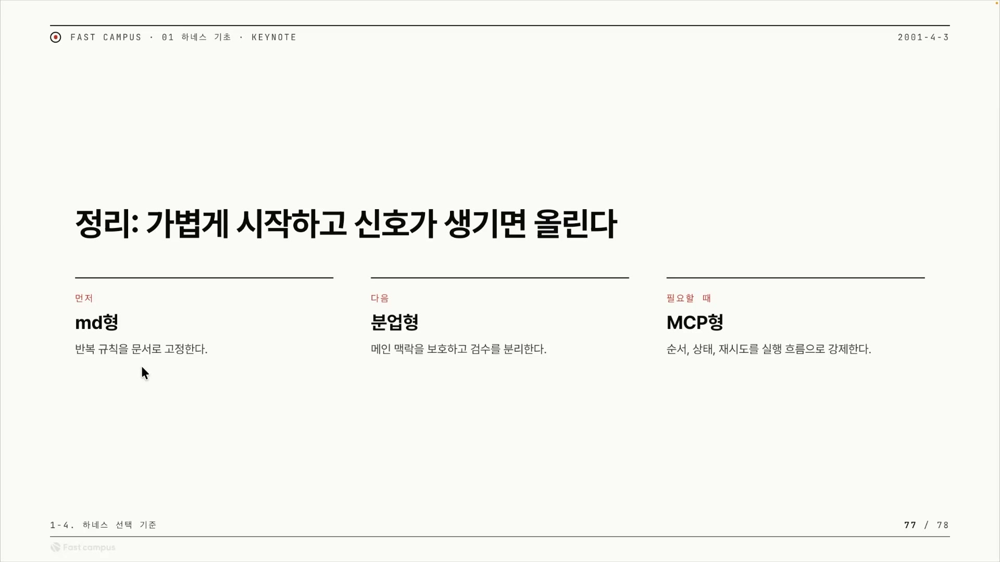
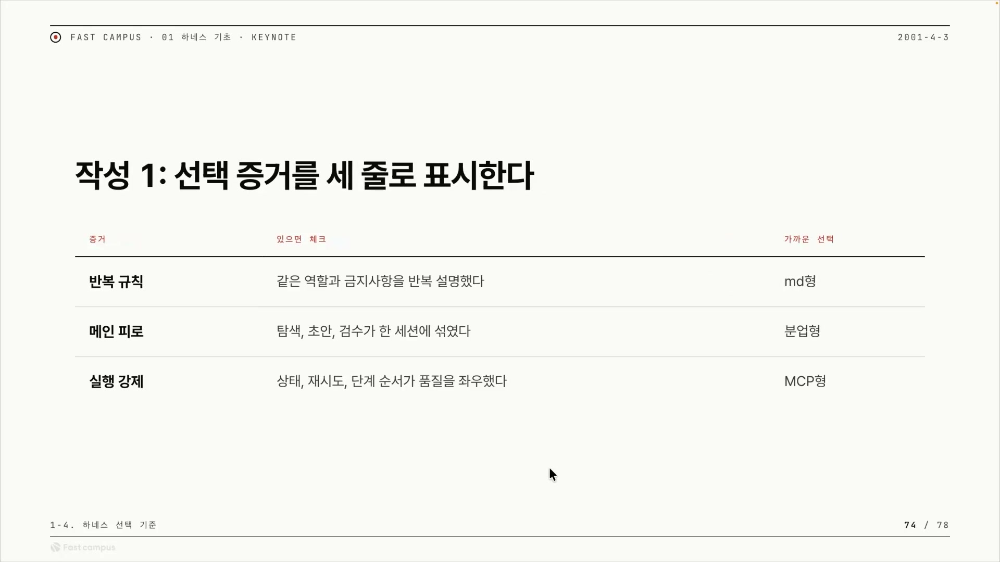
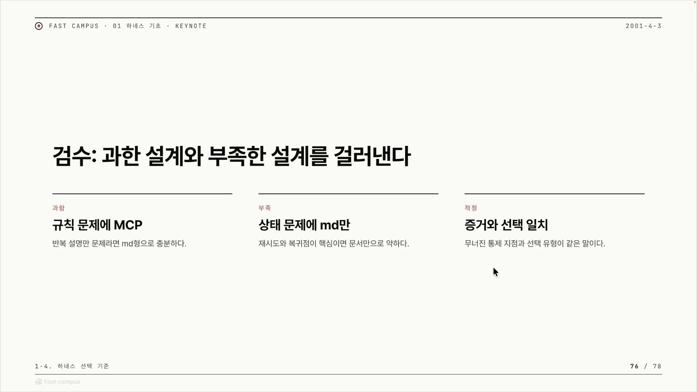
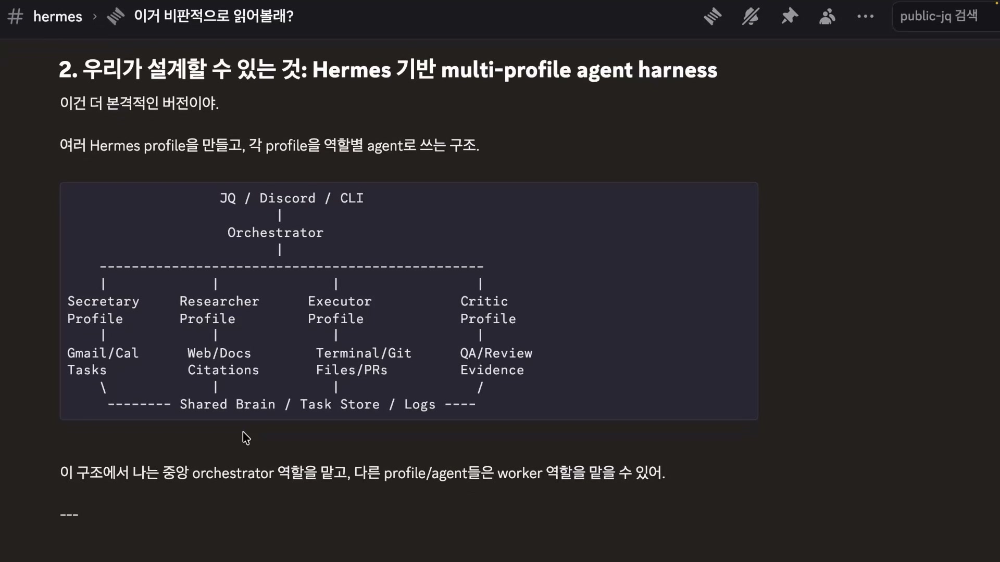
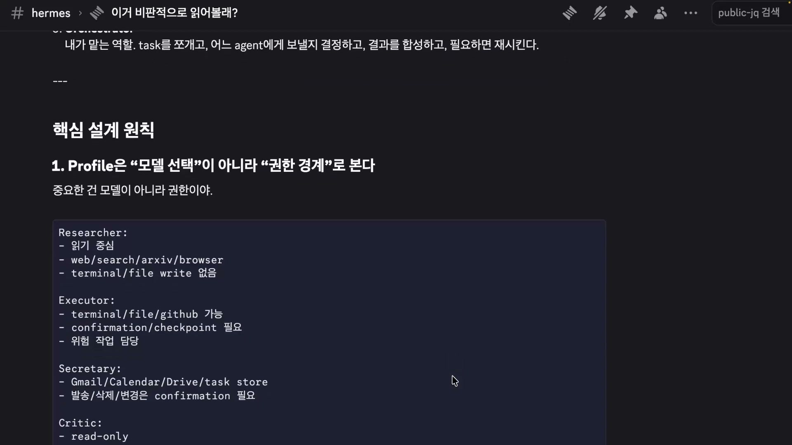
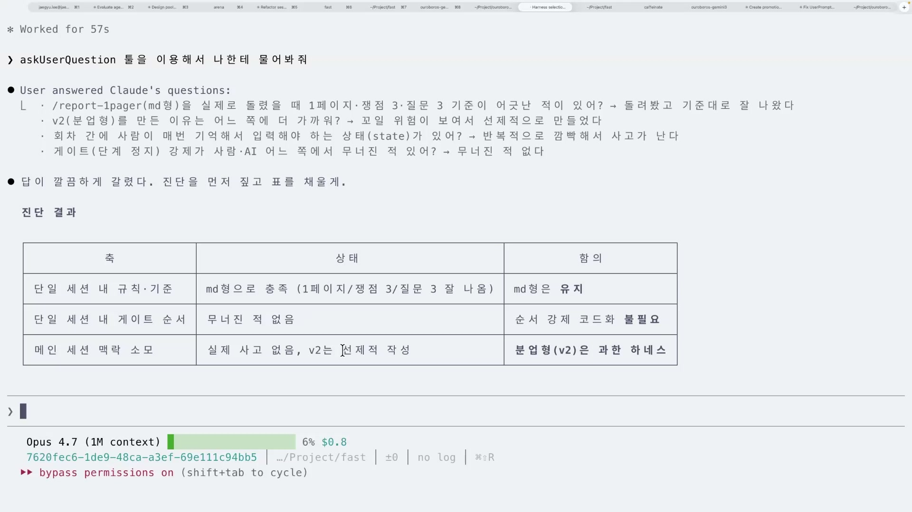
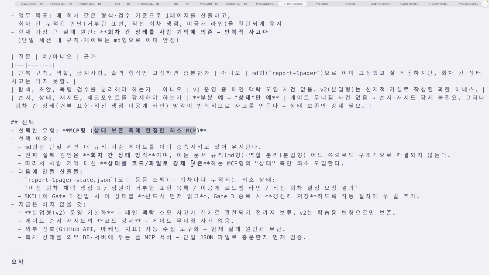

코드는 테스트를 돌리면 맞고 틀림이 갈린다. 그런데 마케팅 보고서를 한 장 쓰는 일은 그렇지 않다. 임원이 싫어하는 표현을 썼는지, 지난 회차에 거부당한 문구를 또 꺼냈는지, 비공개 로드맵 라인을 건드렸는지, 톤이 적절한지를 자동으로 채점할 방법이 없다. 강의에서는 이런 일을 "논 베리파이어블(verify 불가능)한 문제"라고 부른다. 정답표가 없는 일이다. 그리고 하네스란 결국 이렇게 정답이 명시되지 않은 일에 규칙, 역할, 금지사항, 상태저장 같은 구조를 씌워, AI가 매번 흔들리지 않고 사람이 원하는 방향으로 결과를 내게 잡아주는 장치다.

문제는 그 구조를 어느 정도까지 만들 것이냐다. 같은 업무를 두고 누구는 CLAUDE.md 한 장으로 끝내고, 누구는 서브에이전트를 여러 개 띄우고, 누구는 상태를 저장하는 코드까지 짠다. 이 글은 그 선택을 직관이나 취향이 아니라 증거로 내리는 방법을 정리한 것이다. 강의의 실습 주제이기도 한 "하네스 선택표"가 그 도구다.

## 세 유형: 무엇을 막는 도구인가

하네스에는 세 유형이 있다. 마크다운형(문서형), 분업형, MCP형이다. 이름만 보면 나란히 놓인 선택지 같지만, 실제로는 아래 단계로는 막을 수 없는 새로운 문제를 하나씩 메우며 쌓이는 구조다.

**마크다운형**은 가장 가벼운 단계다. 업무가 규칙, 역할, 금지사항, 출력 형식만 고정하면 충분한지를 본다. 실제로 하는 일은 단순하다. CLAUDE.md나 스킬 md 파일에 "이런 역할을 해라 / 이 원칙을 지켜라 / 이건 하지 마라 / 출력은 이 형식으로"를 텍스트로 박아두는 것이다. 그러면 AI가 매번 같은 지시를 다시 받지 않아도 그 문서를 읽고 동일하게 행동한다.

이게 생각보다 멀리 간다. 안드레이 카파시가 얘기한 글과 경험을 60줄 분량의 CLAUDE.md 하나로 정리해 GitHub에서 100K 스타를 받은 사람이 있었다. 거기엔 반복 규칙, 역할, 금지사항이 적혀 있었다. "스킬이 아니다 보니까 출력 형식은 없었"지만, 이 세 가지가 잘 적혀 있어서 큰 인기를 끌었다. 거창한 코드 한 줄 없이 텍스트 60줄로도 충분히 통하는 업무가 실재한다는 증거다.

마크다운형의 한계는 명확하다. 액션이 없고, 무엇보다 상태를 담을 수 없다. "상태가 필요한데 마크다운을 쓴다? 이것도 안 됩니다. 마크다운만으로는 재시도와 체크포인트를 가져갈 수가 굉장히 어려워요." DB 상태를 마크다운에 욱여넣으려 하면 데이터가 깨지거나 형식이 어긋난다.

**분업형**은 문서의 반복 규칙, 역할, 금지사항을 넘어 액션이 필요해질 때 올라가는 단계다. 판단 기준은 단 하나, "이 메인 세션의 맥락을 괴롭혀야 하는가"다. 탐색, 초안, 독립 검수, 이 셋을 메인 세션에서 돌리면 안 된다. 자료를 잔뜩 읽는 탐색, 초안 작성, 결과를 따로 들여다보는 검수는 토큰을 많이 먹고 메인 흐름과 무관한데, 이걸 메인에서 하면 그만큼 컨텍스트가 오염된다. 그래서 서브에이전트로 격리한다. 메인은 이들을 조율하고 사용자와 대화하는 역할만 남긴다.

분업형이 격리하는 것은 구체적이다. 탐색, 초안, 독립 검수. 이걸 별도 컨텍스트로 빼내면 메인 세션이 흔들리지 않는다. 다만 분업형도 상태는 들고 있지 못한다. "이쪽 체크포인트로 돌아가서 다시 하고 싶다"거나 회차 간 맥락을 이어가야 하면 분업형으로는 부족하다.

**MCP형**은 분업형에서 한 발 더 나가는 마지막 단계다. 강의가 꼽는 도입 순간은 두 가지다. 하나는 컨텍스트가 다 쓰이거나(런아웃) 너무 쌓여 오염되기 시작했을 때. 다른 하나는 이렇다. "점심을 먹고 왔다고 쳐요. 그 오래된 세션에서 '아 지금 내가 뭐 하고 있었지?' 이런 걸 기억하는 순간, 그 세션 자체가 인간의 맥락 속에서 오염됐다고 볼 수 있다." 상태를 사람의 기억에 의존하는 게 실패 원인이라는 뜻이다.

MCP형이 저장하는 것은 순서, 상태, 재시도, 체크포인트다. 이것들은 사람이 매번 기억하기 어려운, 상태가 저장되는 스테이트풀한 것들이고, 그래서 코드가 꼭 필요하다. 작동 방식은 이렇다. 인간의 기억이 마찰이 되지 않도록 MCP를 콜해두고, 사람은 다른 일을 하다 돌아와 스테이터스나 TUI로 "아 지금 여기까지 됐구나"를 확인하고 넘어간다. 사람이 기억하지 않아도 시스템이 진행 상태를 들고 있는 것이다. 대신 코드 기반이라 엔지니어링이 많이 필요한 분야다.

세 유형을 한 쌍씩 묶으면 이렇게 정리된다. 문서에 적는 것은 역할, 원칙, 금지사항, (스킬이면) 출력 형식. 서브에이전트가 격리하는 것은 탐색, 초안, 독립 검수. MCP가 저장하는 것은 순서, 상태, 재시도, 체크포인트. 그리고 셋은 결핍의 연쇄로 이어진다. 문서는 반복을 막지만 맥락 오염은 못 막고, 분업은 맥락을 격리하지만 상태는 못 들며, MCP가 그 상태를 든다. 그래서 순서대로 쌓인다.

## 하네스를 고르지 말고, 어디가 무너지는지를 봐라

선택의 출발점은 "어떤 하네스가 멋있나"가 아니다. "이 업무는 어디서 무너지나"다. 강의는 이걸 통제 지점이라고 부른다. 통제 지점이란 그 업무를 원래 사람이 통제하던 자리이고, 자동화했을 때 그게 무너지는 자리다. 방향 이탈, 맥락 소모, 검수 부재 같은 실패 원인이 곧 무너진 통제 지점이다.

검수 단계의 표현으로는 "무너진 통제 지점과 선택 유형이 같은 말이다". 통제 지점을 정확히 짚으면 하네스 유형이 자동으로 정해진다는 뜻이다. 그래서 이 프레임워크는 업무에서 하네스로 곧장 잇지 않는다. 반드시 업무 → 어디가 무너지나 → 증거 → 하네스 순으로 간다. 하네스를 고르는 게 아니라 진단명을 붙이는 작업이다.

진단에 쓰는 증거는 세 가지다. 표로 옮기면 이렇다.

| 증거 신호 | 있으면 체크할 구체적 신호 | 가리키는 유형 |
|---|---|---|
| **반복 규칙** | 같은 역할과 금지사항을 반복 설명했다 | 마크다운형 |
| **메인 피로** | 탐색, 초안, 검수가 한 세션에 섞였다 | 분업형 |
| **실행 강제** | 상태, 재시도, 단계 순서가 품질을 좌우했다 | MCP형 |

쓰는 법은 체크리스트와 같다. 내 업무를 펼쳐놓고 신호가 있는 줄에 체크하면, 체크된 줄이 곧 선택이다. 같은 말을 매번 다시 적고 있으면 첫 줄에 체크, 한 세션에서 탐색, 초안, 검수를 다 돌리다 컨텍스트가 터졌으면 둘째 줄에 체크, 회차가 나뉘고 상태가 품질을 좌우했으면 셋째 줄에 체크하는 식이다.

유형을 골랐으면 거기서 멈추지 않고 다음에 무엇을 만들지까지 한 묶음으로 정한다. 마크다운형을 골랐다면 다음 산출물은 md 규칙서이고, 어떤 규칙이 필요한지를 팀과 인터뷰해서 만든다. 분업형이라면 역할 분리표와 핸드오프 정의이고, 무엇을 메인에서 하고 무엇을 서브에이전트가 할지, 무엇을 넘길지를 정한다. MCP형이라면 더 많은 구조, 체크포인트와 상태 저장과 경우에 따라 데이터베이스까지 따져보는 필요성 판단표다. 유형만 고르고 끝나면 죽은 표가 되고, 다음 산출물까지 붙어야 진단이 행동으로 이어진다.

## 과함과 부족: 더 좋은 도구가 더 좋은 선택은 아니다

하네스를 골랐다고 끝이 아니다. 그 선택이 과한 설계도, 부족한 설계도 아닌지 한 번 더 검수해야 한다. 검수는 세 칸으로 갈린다.

**과함**은 "더 좋은 거 쓰면 좋잖아"라는 직관에서 나온다. 반복 규칙만 문서에 적으면 끝날 일에 서브에이전트, MCP, DB까지 끌어오는 것이다. MCP형은 코드와 상태저장과 DB가 깔리는, 엔지니어링이 많이 드는 분야다. 규칙 반복 설명만으로 풀릴 업무에 MCP를 얹으면 들인 코드만큼의 값이 나오지 않는다. 슬라이드의 한 줄로는 "반복 설명만 문제라면 md형으로 충분하다."

**부족**은 반대로 "마크다운으로도 그냥 되겠지"라는 안일함에서 나온다. 상태를 저장해야 하는 일에 마크다운만 쓰면 재시도와 복귀점을 못 가져가고, 데이터가 깨지고, 형식이 어긋난다. 사람이 매번 기억에 의존하다 까먹는 순간 사고가 난다. 이건 더 노력하면 되는 문제가 아니라 도구를 잘못 고른 문제다. 상태 저장은 코드(JSON · DB)가 꼭 필요하다. 슬라이드로는 "재시도와 복귀점이 핵심이면 문서만으로 약하다."

가운데 **적정**이 목표다. 증거와 선택이 같은 곳을 가리키는 것, 즉 무너진 통제 지점과 고른 유형이 같은 말이 되는 것이다. 둘이 같은 말이 아니면 둘 중 하나가 틀린 것이다. 여기서 과함만 강조하면 "그럼 무조건 작게"로 오해된다. 부족을 같은 비중으로 붙여야 메시지가 분명해진다. 작은 게 미덕이 아니라 맞는 게 미덕이다.

강의는 이 검수를 "AX(AI 전환)에서 제일 중요한 지점"이자 "AX의 첫 시작"이라고 못 박는다. 근거는 DX에 빗댄 순서다. "DX 전환이 되지 않은 상황에서 AX를 바로 들어간다고 했을 때, 바로 MCP를 들어가냐? 절대 아니죠." 업무 정리 없이 시스템부터 깔면 DX도 AX도 실패한다. 순서는 업무 → 증거 → 선택이고, 증거 없이 도구부터 들어가면 그게 과함이다. 그래서 강의는 AX의 첫걸음을 거창한 인프라 구축이 아니라 오버 엔지니어링을 피하는 절제로 정의한다.

## 가볍게 시작하고, 신호가 생기면 한 칸 올린다

세 유형을 시간순으로 배치하면 실천 지침이 된다. 먼저 마크다운형, 다음 분업형, 필요할 때 MCP형.

핵심은 단계를 미리 정해두는 게 아니라, 앞 단계가 실제로 무너지는 경험을 신호로 삼아 그때 올린다는 것이다. 새 업무는 일단 스킬이나 CLAUDE.md로 시작한다. 스킬로 해봤는데 드리프트가 생기거나 메인 세션이 너무 많이 쓰이면, 그때 분업형으로 올린다. 분업형에서 "이쪽 체크포인트로 돌아가서 다시 하면 좋겠다", "상태를 저장해야겠다"고 느끼는 순간, 그때 MCP형으로 올린다.

올려야 한다는 걸 어떻게 아느냐가 관건인데, 강의는 그 신호를 느낌이 아니라 관찰 가능한 사건으로 적는다. 분업형으로 올릴 신호는 "AI가 자꾸 딴 길로 새거나, 한 세션에서 탐색, 초안, 검수를 다 하다 컨텍스트가 터졌다." MCP형으로 올릴 신호는 "점심 먹고 와서 '내가 뭐 하고 있었지?'가 떠오른다." 이 정도로 구체적이라 자기 업무에 바로 대입된다.

강의가 어림한 분포는 80 대 10 대 10이다. 대다수 업무는 마크다운으로 끝나고, 10%가 분업형, 나머지 10%가 MCP형. 단 화자는 "아마 ~라고 생각을 합니다"라며 측정값이 아닌 추정으로 제시한다. 이 비율 자체가 메시지다. 10%밖에 안 되는 MCP형을 모든 업무에 먼저 적용하는 것이 바로 오버 엔지니어링이고, 새 업무를 만났을 때 통계적으로도 마크다운에 베팅하는 게 맞다는 뜻이다. 그래서 강의는 인간의 역할을 "자동화의 테이블 세터"로 본다. 한 업무를 끝까지 미는 사람이 아니라, 여러 업무 각각에 알맞은 하네스를 깔아두고 자동화가 굴러가게 판을 세팅하는 사람이다.

## 실물: 하나의 구조에 셋이 다 섞여 있다

세 유형이 배타적 선택지가 아니라는 건 강의에서 보여준 화자 본인의 구조에서 가장 분명하게 드러난다. 화자는 오픈소스 에이전트 헤르메스 위에 자기 하네스를 한 겹 더 입혀, 자기 자신이 오케스트레이터가 되고 그 아래 역할별 프로파일을 거느리는 멀티에이전트 구조를 직접 시연한다.

읽는 방향은 위에서 아래로 세 층이다. 맨 위는 사람이 말을 거는 입력 채널(JQ, Discord, CLI). 가운데는 오케스트레이터, 즉 대표 헤르메스이자 메인 세션이고 화자 본인이 이 자리에 앉는다. 들어온 일을 잘게 쪼개 아래 네 프로파일에 분배하고, 흩어진 결과를 합성하고, 검수한 결과가 부실하면 그 프로파일을 다시 호출한다. 그 아래 네 프로파일은 Secretary(일정 · 메일), Researcher(조사 · 출처), Executor(코드, 파일, PR), Critic(검증)으로 갈린다. 그리고 맨 아래에 Shared Brain / Task Store / Logs라는 공유 바닥이 있어, 네 프로파일이 갈라져 일하되 결과, 상태, 기록은 여기로 다시 모인다. 위에서 갈라졌다가 아래에서 다시 만나는 모래시계 형태다.

이 한 구조 안에 세 유형이 모두 들어 있다. 프로파일은 마크다운형이다. 화자의 정의로 "각각의 이런 프로파일들이 뭐냐, 이게 문서입니다. 역할, 원칙, 금지 사항들이 적혀 있겠죠." 그 문서들을 서브에이전트로 여러 개 부르는 것이 분업형이다. 바닥의 Shared Brain, Task Store, Logs는 상태가 저장되는 stateful 층이라 본질적으로 MCP형에 가깝다.

프로파일을 가르는 기준이 흥미롭다. "이건 똑똑한 모델, 저건 싼 모델" 같은 모델 고르기가 아니라, "이 에이전트는 무엇을 할 수 있고 무엇을 못 하게 막을 것인가"라는 권한 격리다.

| 프로파일 | 권한 경계 |
|---|---|
| **Researcher** | 읽기 중심, web, search, arxiv, browser 허용, terminal과 파일 쓰기 없음 |
| **Executor** | terminal, 파일, github 가능, 대신 confirmation과 checkpoint 필요 |
| **Secretary** | Gmail, Calendar, Drive 가능, 발송이나 삭제, 변경은 confirmation 필요 |
| **Critic** | read-only, 평가만 하고 아무것도 못 바꿈 |

Researcher가 파일을 못 쓰는 것, Critic이 read-only인 것, Executor와 Secretary가 위험하거나 외부로 나가는 행동에 확인 게이트를 끼우는 것은 전부 권한 경계다. 왜 모델 선택이 아니라 권한인가. 모델은 갈아끼울 수 있어도 "Researcher는 파일 못 씀"이라는 경계는 변하지 않기 때문이다. 모델은 바꿀 수 있어도 경계는 역할의 정체성이다. 그리고 이 경계가 바로 컨텍스트 오염을 막는 분업의 본질이다. research, executor, secretary, critic 네 개만 둬도 메인 세션에서 일어나는 일이 많아 컨텍스트가 오염될 수밖에 없는데, 역할을 권한으로 격리하면 메인은 조율만 하게 된다.

## 라이브 데모: 선택표를 끝까지 채워본다

강의는 이 프레임워크를 화자의 실제 업무에 클로드 코드로 직접 적용해 결론까지 간다. 다룬 업무는 우로보로스 프로젝트 진행 현황을 임원용 A4 한 장 보고서로 만드는 반복 회차 업무다. 앞 실습들에서 이미 `report-1pager`(마크다운형) 스킬과 분업형 v2(탐색→초안→독립 검수 분리)를 둘 다 만들어 둔 상태였다. 그러니 이번 실습은 "이 업무엔 어느 게 맞나"를 검증하는 자리다.

흐름은 이렇다. 챕터1의 실습 문서를 클로드 코드 터미널에 첨부하고 업무 상황, 제약, 기존 산출물을 붙인다. 클로드가 읽고 "md형 · 분업형을 둘 다 만들어놨으니 정합성을 검증하겠다"고 스스로 규정한다. 그러더니 결정에 필요한 질문 네 개를 너무 길게 쏟아내는데, 화자가 "AskUserQuestion 툴로 나한테 물어봐줘"라고 요청해 선택지 UI로 한 문항씩 답하게 만든다. 프롬프트에 걸어둔 "최종 책임 판단은 사람이 결정하게 분리한다"는 경계가 실제로 작동한 장면이다.

질문 네 개와 화자의 답이 결론을 갈랐다.

| 클로드의 질문 | 화자의 답 | 함의 |
|---|---|---|
| md형을 돌렸을 때 1페이지, 쟁점 3, 질문 3 기준이 어긋난 적 있어? | 돌려봤고 기준대로 잘 나왔다 | **마크다운형 유지** |
| v2를 만든 이유가 실제 사고 때문이야, 선제적이었어? | 꼬일 위험이 보여서 선제적으로 만들었다 | **분업형 v2는 과한 하네스** |
| 회차 간 정보를 사람이 매번 기억해 입력해야 해? | 반복적으로 깜빡해서 사고가 난다 | **상태축은 코드로 잡아야** |
| 게이트 순서가 사람이나 AI 쪽에서 무너진 적 있어? | 무너진 적 없다 | **순서 강제 코드화 불필요** |

분기점은 둘째와 셋째 질문의 답이 정반대로 갈린 데 있다. 맥락 소모는 실제 사고가 없었으니 분업형은 죽고, 회차 간 상태는 반복적으로 사고가 났으니 MCP가 살았다.

클로드가 내린 핵심 한 문장은 이렇다. "네 실패는 한 세션 안에서 무너지는 문제가 아니라, 세션과 세션 사이에서 사람 기억에 의존하다가 무너지는 문제야. md형은 한 세션 안의 규칙 고정이고 분업형은 한 세션 안의 역할 분리야. 둘 다 회차 간 사고를 못 막아. 이건 MCP형의 '상태' 축이 정확히 잡는 문제야. 다만 순서 · 재시도는 필요 없으니 전면 MCP화가 아니라 상태 보존 최소 MCP가 답이야."

결론은 전면 MCP가 아니라 상태 보존 축에 한정한 최소 MCP다. 나머지는 마크다운으로 간다. 산출물은 `report-1pager-state.json` 같은 단일 JSON 파일 하나다. 거기에 이전 회차 채택 쟁점, 임원이 거부한 표현 목록, 미공개 로드맵 라인, 직전 회차 결정 결과를 담고, 스킬이 Gate 1에서 이 상태를 먼저 읽고 Gate 3에서 갱신해 저장하게 두 줄을 추가하는 정도다. 그리고 지금 하지 않을 것까지 명시한다. 분업형 v2는 메인 맥락 소모 사고가 실제로 관찰되기 전까지 학습용 변형으로만 보존하고, 게이트 순서 · 재시도의 코드 강제는 무너진 적이 없으니 빼고, 단일 JSON 파일로 충분한지부터 먼저 검증한다. 이 절제가 "가볍게 시작하고 신호가 생기면 한 축만 올린다"는 메시지의 살아있는 증거다.

## 하네스의 지도

화자는 마무리에서 우로보로스조차 "냉정하게 보면 마크다운과 분업형, 서브에이전트와 MCP가 모두 섞여 있다"고 인정한다. 세 유형은 배타적 선택지가 아니라 레고 블록이다. 초심자는 하나를 고르는 연습부터 하되, 종착점은 필요한 만큼 섞는 것이다. 실습 진단이 "최소 MCP + 나머지 마크다운"이었던 것처럼.

그래서 강의가 회수하는 정의는 이렇다. 하네스란 유저의 모호한 부분, 즉 갭을 채우는 구조이고, "그 구조에 갭이 있냐 없냐"를 살피는 것이 하네스의 지도다. 갭이란 사람이 머릿속으로 대충 알고 있지만 AI에게 명시해주지 않은 부분이다. 마케팅 보고서 사례에서 그 갭은 "점심 먹고 오면 까먹는 회차 간 정보"였고, 채움은 그걸 상태 파일에 저장한 것이었다.

지도는 도구 카탈로그가 아니라 진단 도구다. "MCP가 멋있으니 쓴다"가 아니라 "이 업무의 어디에 무슨 갭이 있는가, 그 갭에 딱 맞는 가장 작은 구조는 무엇인가"를 묻는다. 반복 규칙이 갭이면 문서로, 맥락 소모가 갭이면 분업으로, 상태 망각이 갭이면 코드로 메운다. 강력한 하네스가 좋은 하네스가 아니다. 그 업무의 갭에 정확히 들어맞는 가장 작은 구조가 좋은 하네스다. 그리고 그 작은 구조를 고르는 절제, 오버 엔지니어링을 피하는 그 한 걸음이 강의가 말하는 AX의 첫 시작이다.
