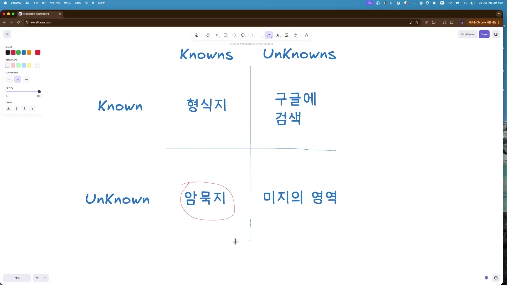
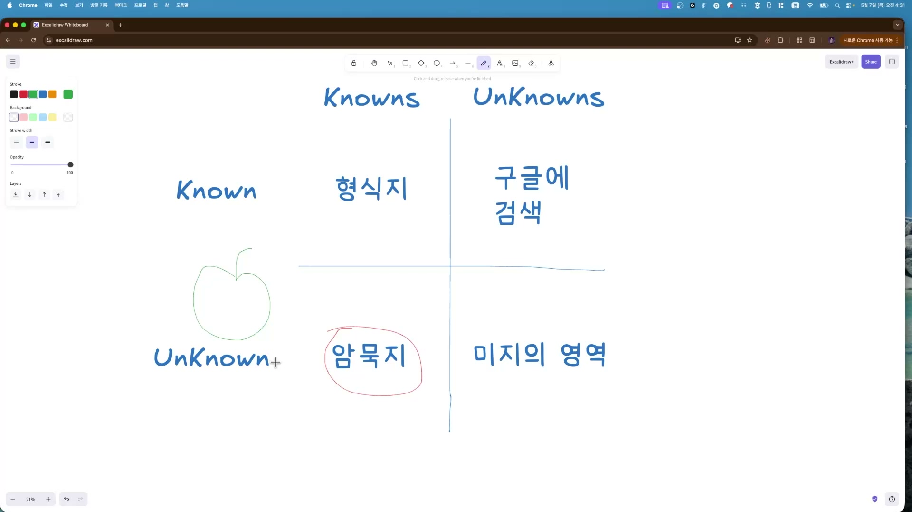
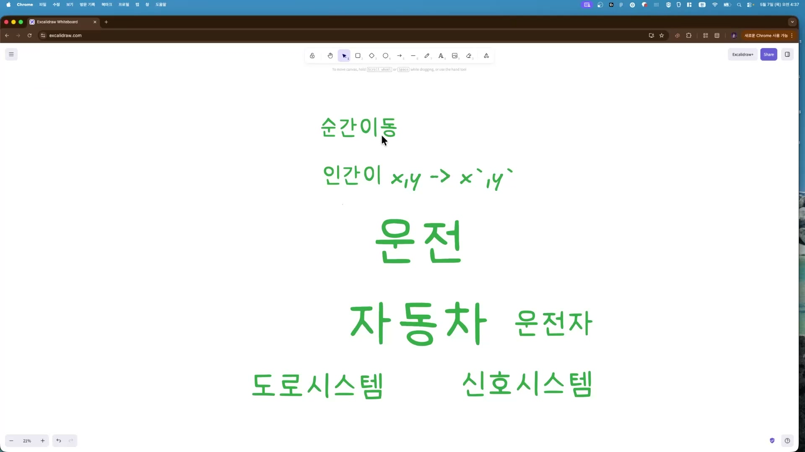
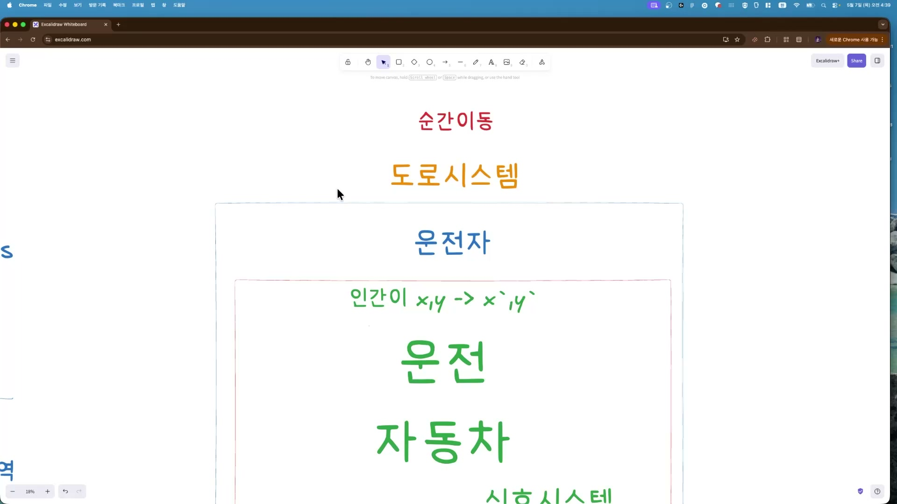
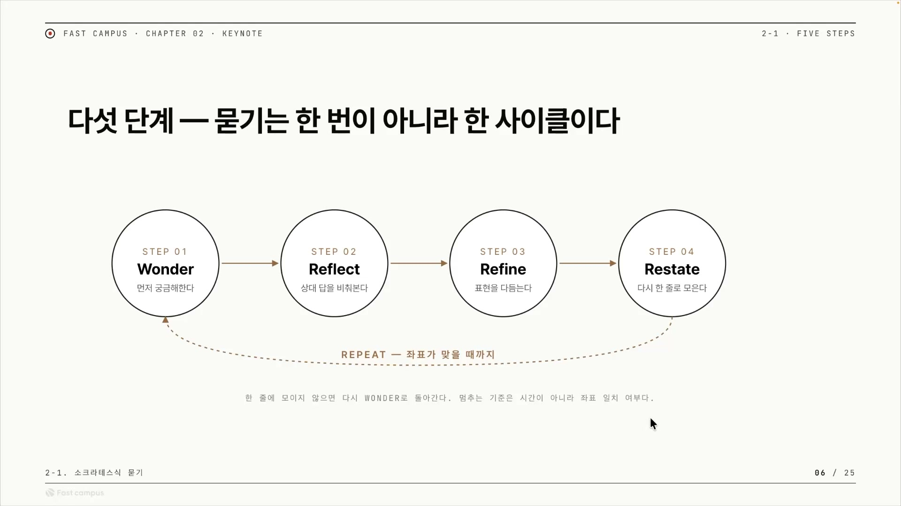

AI에게 "이거 해줘"라고 던지면, 십중팔구 마음에 안 드는 결과가 돌아온다. 도구가 멍청해서가 아니다. 내 머릿속에 있던 전제를 AI가 알 길이 없어서다. 패스트캠퍼스 강의의 이 클립은 **그 어긋남의 정체를 암묵지와 온톨로지라는 두 개념으로 짚고**, 소크라테스의 문답법을 본떠 그것을 메우는 절차를 만든다. 발표자 본인 말로 "철학적인 얘기"를 하는 편이고, 실제 AI 적용은 다음 클립으로 미뤄져 있다. 그래서 이 글도 도구 사용법이 아니라 개념을 정리하는 데 무게를 둔다.

강의 전체는 **AI를 원하는 대로 일하게 만드는 장치, 즉 하네스(harness)를 만드는 과정**이다. 앞 챕터에서 마크다운 하네스, 분업형 하네스, MCP를 가볍게 맛봤다. 이 챕터는 하네스를 짜기 전, 내 머릿속에 있는 것을 어떻게 타이핑으로 꺼낼 것인가를 다룬다. 클립 제목이 그 전부를 요약한다. 좋은 질문이 좋은 하네스를 만든다.

## "그냥 해줘"가 실패하는 이유

딸깍 한 번으로 결과를 받아보는 건 편하다. 그래서 우리는 자꾸 "그냥 해줘"라고 말한다. 문제는 그 한마디 안에 생략된 게 너무 많다는 데 있다. 나는 당연히 알고 있어서 말할 필요조차 못 느끼는 것들, 그게 빠져 있다. 발표자는 이걸 암묵지라고 부른다. **머릿속엔 분명히 있는데 표현하기 어렵거나, 너무 당연해서 말할 시도조차 안 하는 지식**이다. "나는 아는데 표현하기 어려운, 표현하는 걸 까먹은 것들"이라는 게 그의 정의다.

소크라테스는 소피스트들과 토론할 때 "인간은 어떻게 사나요?"라는 물음에 답을 주지 않았다고 한다. 답을 모르는 게 아니라, 그 답이 자기 머릿속에는 있지만 상대에게는 없다는 걸 알았기 때문이다. 상대는 그걸 말로 표현해야 하는 줄도 몰랐다. 그게 바로 암묵지의 모습이다. 있긴 한데, 꺼내야 할 줄을 모른다.

## 앎을 네 칸으로 나누면

발표자는 화이트보드에 가로세로 축을 긋고 앎을 네 칸으로 나눈다.

위아래는 내가 그것을 아느냐 모르느냐(Known / Unknown), 좌우는 그 사실 자체가 알려진 것이냐 아니냐(Knowns / Unknowns)다. 네 칸을 하나씩 보면 이렇다.

| 칸 | 상태 | 어떻게 다루나 |
|---|---|---|
| 형식지 | 아는 걸 안다 | 해가 동쪽에서 뜬다 같은 팩트. 말 · 문서로 쉽게 꺼낸다 |
| 암묵지 | 아는데 (의식)못 한다 | 머릿속엔 있으나 꺼낼 줄 모른다. 이 클립의 표적 |
| 구글에 검색 | 모르는 걸 안다 | 모른다는 걸 아니까 검색하면 나온다. 부지런하면 풀린다 |
| 미지의 영역 | 모른다는 걸 모른다 | 있는지조차 모르는 영역 |

마지막 칸, 모른다는 것조차 모르는 영역은 인간도 AI도 아직 잘 잡지 못한다. 발표자가 든 예가 이세돌이다. AI끼리 둔 바둑의 기보를 더는 알아볼 수 없게 됐을 때, 그는 은퇴를 결심했다고 한다. 인간이 인식조차 못 하는 패턴이 거기 있었던 셈이다. 이 영역은 우로보로스로도 아직 풀지 못했고, 지금으로선 사람을 직접 만나 "이런 게 있었는지도 몰랐다"고 깨닫는 순간에야 드러난다. 그래서 요즘은 사람과의 만남이 오히려 더 가치 있어졌다는 게 그의 관찰이다.

이 네 칸 중 이 챕터가 파고드는 곳은 두 번째, 암묵지다. 나머지는 풀 길이 비교적 분명하지만, 암묵지만은 내가 가졌으면서도 꺼낼 줄을 몰라 AI에게 전달되지 않는다.

## 사과 한 알의 함정

암묵지가 어떻게 어긋남을 만드는지, 사과 한 알로 보여준다. "사과"라고 말할 때 머릿속에 무엇이 떠오르는가. 발표자가 떠올린 건 아오리 사과, 초록색 사과다. **그런데 그냥 "사과"라고만 말해버리니, 듣는 쪽은 알 길이 없다.**

AI에게 "사과 그려줘"라고 하면 십중팔구 빨간 사과를 그린다. 머릿속의 초록 사과는 어디에도 전달되지 않았으니 당연한 일이다. 이런 작은 어긋남이 쌓이고 쌓이면, AI는 끝내 내가 원한 것과 다른 결과를 내놓는다.

묻지 않으면 빈칸이 추측으로 채워진다. AI가 게을러서가 아니라, 빈칸을 비워둘 수 없어서 자기가 가진 걸로 메우기 때문이다. 그렇게 메운 추측이 내 의도와 다를 뿐이다.

그래서 "성과를 잘 내는 팀을 만들고 싶어요"라는 한 문장을 가져온다. 별 문제 없어 보이지만 뜯어보면 모호함투성이다. 성과는 어떤 성과인가. 잘 낸다는 건 KPI를 통과한 것인가 달성한 것인가. 팀은 스쿼드를 말하는가 다른 단위인가. 만들고 싶다는 건 지금 회사에서 꾸리는 것인가, 새로 사람을 뽑는 것인가. 듣는 사람은 이 빈칸들을 각자 자기 기준으로 채우고, 그걸 정답이라 여긴다. 사과와 똑같은 일이 벌어진다.

## 단어는 점이 아니라 영역이다

발표자는 이 모호함을 온톨로지라는 말로 다시 본다. 소크라테스가 "당신에게 산다는 의미는 무엇인가요?"라고 되묻는 장면이 단서다. 그렇게 되물으면 상대는 "산다"의 의미를 처음부터 다시 생각하게 된다. live라는 동사가 워낙 방대한 뜻을 품고 있어서다. 발표자라면 "성취감을 느끼는 것이 잘 사는 것"이라고 답할 텐데, 그 순간 '산다'라는 단어의 경계가 '성취감'이라는 모양으로 좁혀진다.

**온톨로지를 정한다는 건, 그러니까 단어의 경계를 정하는 일이다.** "성과"라는 한 단어 안에는 매출, 학습 속도, 팀 분위기, 출시 속도, 채용 성공률, 고객 만족도가 다 들어간다. 단어 자체는 이 영역을 통째로 가리키지, 그 안의 어느 한 점을 가리키는 게 아니다. 그래서 한 사람은 매출을 떠올리고 다른 사람은 팀 분위기를 떠올린다. 같은 단어를 쓰면서 서로 다른 것을 본다. 이게 어긋남의 정체다. 묻는다는 건 결국 이 단어가 어디까지를 가리키고 어디부터는 아닌지, 그 경계를 함께 정하는 일이다.

## 한계가 온톨로지를 낳는다

경계가 어떻게 생겨나는지를, 이번엔 운전으로 설명한다. 운전이라는 시스템을 세우려면 무엇이 필요한가. 자동차가 있어야 하고, 도로 시스템이 있어야 하고, 신호 시스템과 운전자가 따라온다. 이 구성요소들이 모여 '운전'이라는 단어의 경계를 이룬다.

그런데 이 온톨로지는 왜 생겼을까. 인간이 한 지점(x, y)에서 다른 지점(x', y')으로 빨리 가고 싶은데, **순간이동을 못 하기 때문**이다. 순간이동이 됐다면 자동차도 도로도 필요 없었을 것이다. 순간이동이라는 능력이 막혀 있다는 바로 그 한계가, 운전이라는 온톨로지를 만들어냈다. 한계가 경계를 낳는다는 통찰이 여기 있다.

그렇다면 그 경계는 다시 그을 수 있다. 구성요소를 하나씩 빼면서 경계를 넓히는 것이다. 운전에서 운전자를 빼면 자율주행이 된다. 테슬라가 운전자를 빼는 방식으로 운전을 재정의했다. 거기서 한 발 더 나아가 도로 시스템까지 빼면, 땅 위를 달릴 필요가 없어진다.

도로 시스템을 빼버린 게 조비 에비에이션의 나르는 택시(eVTOL)다. 운전자를 빼고, 도로를 빼고, 한 겹씩 벗겨낼 때마다 경계가 넓어지면서 순간이동이라는 궁극의 골에 조금씩 가까워진다. 발표자는 인간이 원하는 그 궁극의 골을 이데아라 부른다. 현실에서 온전히 닿을 수는 없지만, 재정의를 거듭하며 그쪽으로 다가가려는 완벽한 이상을 말한다. **인간은 암묵지로 가득 찬 이데아를 바라보고, AI는 온톨로지를 통해 거기에 다가간다.** 재정의 루프를 돌수록 이데아에 닿을 확률이 커진다는 것, 이게 챕터6까지 관통하는 철학이라고 그는 말한다.

## 소크라틱 리즈닝, 다섯 단계의 루프

여기까지가 진단이라면, 해법은 결국 질문이다. 소크라테스가 되묻기로 상대의 암묵지를 끌어냈듯, 질문으로 단어의 경계를 함께 그려나간다. 발표자는 이 과정을 다섯 단계의 순환으로 짠다. 소크라틱 리즈닝이다.

- **Wonder(원더)**. 먼저 질문한다. 암묵지를 꺼내며 온톨로지를 정의하기 시작한다.
- **Reflect(리플렉트)**. "너 이렇게 생각했구나" 하고 되비춘다. 상대가 본 경계가 한 번 공유된다.
- **Refine(리파인)**. 서로의 온톨로지를 합치고 다듬는다. 주체와 대상이 좁혀진다.
- **Restate(리스테이트)**. 다듬어진 정의를 한 문장으로 다시 말한다. 여기서 한 줄로 못 말하면 아직 빠진 게 있다는 신호다.
- **Repeat(리핏)**. 빠진 게 보이면 다시 Wonder로 돌아간다. 좌표가 맞을 때까지 루프를 돈다.

멈추는 기준이 시간이 아니라 좌표 일치 여부라는 점이 이 루프의 핵심이다. 한 줄로 깔끔하게 정리되지 않는다면, 아직 맞춰야 할 경계가 남아 있다는 뜻이다. **이 루프 전체가 곧 서로의 경계를 포갠 공유 온톨로지(Shared Ontology)를 만드는 일**이고, 그게 소크라틱 리즈닝이다. 발표자는 이 루프를 AI로 옮겨 우로보로스(Ouroboros)라는 도구를 만들었다.

앞서 본 "성과를 잘 내는 팀을 만들고 싶다"는 문장에 이 다섯 단계를 실제로 적용하면 이렇게 굴러간다.

| 단계 | 꺼내는 질문 | 드러나는 좌표 |
|---|---|---|
| Wonder | "성과"라는 말이 매출인가요, 학습 속도인가요, 팀 분위기인가요? | 같은 단어 안의 후보 세 개 |
| Reflect | 방금 답하신 "출시 속도"는 몇 주를 줄이는 걸 의미하나요? | 상대가 본 좌표를 한 번 돌려준다 |
| Refine | 그 출시 속도를 책임지는 사람은 PM인가요, 엔지니어인가요? | 주체와 대상이 좁혀진다 |
| Restate | "분기마다 한 번씩 PM이 출시 주기를 1주 줄이는 팀"이 맞나요? | 한 줄로 모인 정의 후보 |
| Repeat | "1주 줄이는"이 정량인지 체감인지 다시 묻는다 | 잔여 빈칸이 보이면 사이클을 한 번 더 |

처음의 "성과 잘 내는 팀"이라는 흐릿한 한 문장이, 질문을 거듭하며 "분기마다 PM이 출시 주기를 1주 줄이는 팀"이라는 또렷한 좌표로 좁혀진다. 빈칸을 추측에 맡기는 대신 묻고, 되비추고, 다듬고, 다시 말하는 것이다.

정리하면 이 클립의 논리는 단순하다. AI가 어긋난 결과를 내는 건 내 암묵지를 모른 채 빈칸을 추측으로 메우기 때문이고, 그 빈칸의 정체는 단어가 품은 경계, 곧 온톨로지다. 그래서 질문으로 경계를 함께 그어 공유 온톨로지를 만드는 루프를 돌린다. 프롬프트를 잘 쓰자는 흔한 조언을, 소크라테스와 암묵지와 이데아까지 끌어와 한 겹 더 깊은 자리에 놓은 셈이다. 실제로 이걸 AI에 어떻게 태우는지는 다음 클립의 몫이다.

## 외우고 넘어갈 핵심

먼저 앎의 지도. 세로는 내가 그걸 의식하느냐, 가로는 그 사실이 세상에 알려졌느냐로 나뉜다. 이 강의의 표적은 못 꺼내는 **암묵지** 칸이다.

| | 아는 것 | 모르는 것 |
|---|---|---|
| **안다** | 형식지 | 구글에 검색 |
| **모른다** | 암묵지 | 미지의 영역 |

- **암묵지**: 머릿속엔 있지만 당연해서 말 안 하거나, 표현할 줄 몰라 못 꺼내는 지식. 안 물으면 AI가 그 빈칸을 추측으로 채운다.
- **온톨로지**: 단어의 경계. 단어는 점이 아니라 영역이라 같은 "성과"도 사람마다 다른 점을 본다. 구성요소를 빼며 경계를 넓히는 게 재정의다(자율주행, 나르는 택시).

이 둘을 맞춰가는 해법이 **소크라틱 리즈닝**이다. 질문으로 암묵지를 꺼내 온톨로지를 포개는 다섯 단계 루프로, 한 줄로 깔끔하게 정리될 때까지 돈다.

| 단계 | 하는 일 |
|---|---|
| Wonder (묻기) | 질문해서 암묵지를 꺼내고 온톨로지를 정의하기 시작한다 |
| Reflect (되비추기) | "이렇게 생각했구나" 하고 상대가 본 경계를 공유한다 |
| Refine (다듬기) | 서로의 온톨로지를 합치고 좁힌다 |
| Restate (다시 말하기) | 한 문장으로 다시 말한다. 한 줄로 안 되면 빠진 게 있다 |
| Repeat (반복) | 빠진 게 보이면 다시 Wonder로 돌아가 루프를 돈다 |

이 클립은 이 골격까지만 다룬다.
