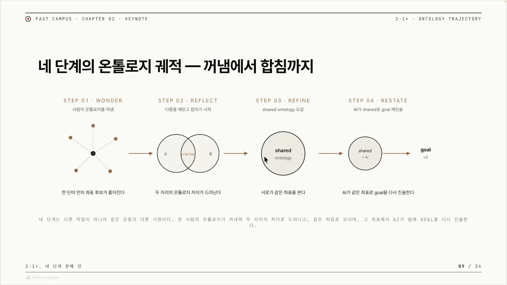

AI에게 "이거 해줘"라고 말하면, AI는 그 "이거"가 무엇인지 추측한다. 추측이 맞으면 다행이고, 어긋나면 "아니야, 그거 아니야, 다시 해"가 시작된다. 이 반복이 길어질수록 사람이 AI를 들여다보며 고쳐 세우는 데 드는 품, 곧 감시 비용이 올라간다. AI가 의도에서 점점 멀어져 엉뚱한 곳으로 흘러가는 것을 드리프트라고 부르는데, 이 강의의 목적은 한 가지로 모인다. 어떻게 하면 드리프트를 막을 것인가.

답은 말의 뜻을 사람과 AI가 같은 자리에 두는 것이다. 같은 단어를 듣고 같은 것을 떠올리게 만드는 작업이고, 그 도구가 소크라테스식 질문 4단계다. 그런데 이 4단계를 하나의 거대한 스킬로 통째로 묶으면 문제가 생긴다. 스킬이 너무 무거워지고, 무거우면 모델마다 결과가 달라지며, 똑같이 동작하는지 검증조차 어려워진다. 그래서 단계를 쪼갠다. 쪼개려면 각 단계가 왜 필요한지를 알아야 하고, 그것을 드러내는 두 개의 점검 질문이 이 글의 중심이다.

## 말의 좌표라는 것

먼저 깔아야 할 개념이 온톨로지다. 사전적 의미가 아니라, 이 사람이 또는 이 AI가 어떤 말을 어떤 자리로 이해하는가, 그 의미의 위치를 말한다. 같은 단어라도 사람마다 그 자리가 다르고, 그 각각의 후보를 좌표라고 부른다.

사과를 예로 들면 쉽다. "사과"라고 하면 보통 빨간색을 떠올린다. 그런데 아오리 사과는 초록색이다. 그러니 "사과"라는 단어 하나에도 빨강 좌표와 초록 좌표가, 품종에 따라 또 다른 좌표가 흩어져 있다. 단순한 명사 하나가 이렇다.

추상적인 말로 가면 좌표는 더 갈라진다. 소피스트가 "인간은 어떻게 살아야 하는가?"라고 물었다고 하자. 여기서 "산다"는 성취감을 느끼는 삶일 수도, 행복을 느끼는 삶일 수도, 도파민을 느끼는 삶일 수도 있다. 이 좌표는 묻는 사람의 머릿속에만 있다. 말로 꺼내지 않으면 아무도 모르고, AI는 그저 추측할 수밖에 없다. 추측이 빗나가면 다시 드리프트와 감시 비용으로 돌아온다.

사람 머릿속에만 있고 아직 말로 꺼내지 않은 이런 지식을 암묵지라고 한다. 4단계의 출발은 결국 이 암묵지를 질문으로 끄집어내는 일이다.

## 꺼냄에서 합침까지, 네 단계

화자가 정리한 큰 그림은 "4단계 온톨로지 궤적"이다. 인간의 암묵지를 꺼내서, AI의 온톨로지와 합쳐, AI가 그럴듯한 것으로 추측하지 못하게 만드는 흐름이다.

원더(Wonder)는 사람의 온톨로지를 질문으로 꺼내는 단계다. AI가 묻고 사람이 답하는 사이, 한 단어 안에서 여러 좌표 후보가 흩어진다. 위 그림의 첫 칸에서 점들이 사방으로 퍼지는 모습이 그것이다. 이때 재미있는 일이 벌어진다. AI가 제안한 좌표와 내가 원래 생각하던 좌표가 다르다는 것을 깨닫는다. "아, 나는 이렇게 생각했는데 AI는 저렇게 추측하고 있었구나." 사과 한 단어에서 빨강과 초록이 갈라지는 그 순간이다.

리플렉트(Reflect)는 그 차이를 마주보고 서로 반성하는 단계다. 두 사람의 벤다이어그램을 떠올리면 된다. 겹치는 교집합이 있고, 서로 못 본 차집합이 있다. B가 미처 생각하지 못한 부분과 A가 생각하지 못한 부분이 차집합에서 드러난다. 여기서 AI가 사람에게 거꾸로 제안할 수도 있다. "이렇게 생각하셨는데, 사실 이게 더 나을 것 같습니다." 자기 결정이 다 맞다고 믿는 대신, 여러 관점과 여러 질문을 받으며 "내가 틀렸구나"를 발견하는 과정이다.

리파인(Refine)은 드러난 차이를 합쳐 하나로 고정하는 단계다. 이렇게 합의된 의미 구조를 공유 온톨로지(Shared Ontology)라고 부르는데, 화자는 이것을 "고정된 데이터 스트럭처"라고도 한다. 이 순간 같은 말이 사람에게도 AI에게도 같은 좌표로 읽힌다. 발산했던 좌표가 한 점으로 모이는 수렴 지점이다. 화자는 이 발산에서 수렴으로 가는 흐름을 디자인 씽킹의 더블 다이아몬드(Double Diamond)와 겹쳐 볼 거라고 예고한다. 그 매핑은 다음 클립의 몫이다.

리스테이트(Restate)는 정제된 온톨로지를 AI가 제대로 이해했는지 스스로 다시 말하게 하는 단계다. 공유 온톨로지를 바탕으로 AI가 원래 목표(골)를 자기 말로 다시 진술하는데, 이렇게 갱신된 목표가 골 V2다. 처음 내가 말했던 문장과는 많이 달라진 문장이 나온다. 만약 AI가 제대로 진술하지 못하면, 아직 이해 못 한 것이 남아 있다는 뜻이므로 다시 원더로 돌아가 빠진 자리를 깐다.

강의에서 골은 사람이 AI에게 시키려는 목표를 뜻한다. 골 V2는 리스테이트를 거쳐 또렷해진 그 목표이고, 동시에 실행의 씨앗(seed)이 된다.

### 한 바퀴로 끝나지 않는다

골 V2가 나오면 끝이 아니다. 이걸 다시 리즈닝에 넣어 한 바퀴 더 도는 것을 화자는 리핏(Refit)이라 부른다. AI 출력은 매번 달라지고(Non-deterministic), 골 V2를 다시 넣으면 또 다른 주의 범위(Attention Window)로 인해 그동안 숨어 있던 가정이 새로 꺼내진다. 그래서 리핏을 거듭할수록 아이디어가 깎인다.

그럼 언제 멈추는가. 돌리다 보면 온톨로지가 점점 덜 바뀌는 때가 온다. 직전 온톨로지와 새로 만들어진 공유 온톨로지의 유사도가 충분히 높아지면, 거기서 수렴으로 보고 멈춘다.

이 반복은 화자가 만든 도구 오로보로스의 컴파운드 엔지니어링 철학과 맞닿아 있다. 한 번 결과물을 쉬핑하면, 그 결과물과 온톨로지가 다음 라운드의 골 V2가 되어 다시 루프를 돈다. 복리처럼 누적되는 개발이다. 오로보로스라는 이름 자체가 자기 꼬리를 무는 뱀이니, 스스로를 먹고 자라는 이 구조와 상징이 맞물린다.

온톨로지를 다시 정의한다는 것은 사실 굉장히 어려운 일이다. 자율주행을 보자. 웜홀은 지금 우리가 도달할 수 없는 궁극의 목표 같은 것이다. 테슬라나 조비 에비에이션 같은 회사들도 그 웜홀까지는 갈 수 없으니, 그 한계를 인정하고 온톨로지를 하나씩 다시 긋는다. 운전자를 없애거나, 도로 시스템을 넘어 하늘을 날거나. 이런 재정의는 위의 루프를 여러 번 거치고 나서야 가능하다.

## 첫 번째 점검, 못 얻으면 어떻게 되나요

4단계를 분리된 스킬로 만들려면 각 단계가 왜 필요한지를 알아야 하고, 그것을 드러내는 첫 번째 질문이 "이 단계의 산출을 못 얻으면 무엇이 막히나"다. 이것이 곧 그 단계의 효용이고, 화자의 표현으로는 "구조의 빈칸"을 드러내는 일이다.

| 단계 | 못 얻으면 무엇이 막히나 |
|---|---|
| 원더 | 단어 안의 좌표 후보가 안 꺼내진다. AI가 추측하고, 어긋나면 "다시 해"가 반복되며 감시 비용이 오른다. 다음 단계 전부가 처음 떠올린 한 좌표에 갇힌다. |
| 리플렉트 | 두 온톨로지가 다르다는 사실 자체가 드러나지 않는다. 공유 온톨로지로 가는 길이 닫힌다. |
| 리파인 | 공유 온톨로지가 안 만들어져 고정할 수 없다. 합의 없이 다음으로 넘어가니 드리프트가 쉬워지고 합의가 사라진다. |
| 리스테이트 | AI가 공유 관점으로 골을 다시 진술하지 못한다. 실행이 사람 한 명의 머릿속 좌표에만 의지하게 된다. |

원더가 빠졌을 때가 가장 선명하다. 앞의 소피스트 예시가 그대로 이 칸을 받친다. "산다"의 좌표를 못 꺼내면 AI는 추측하고, 그 결과는 "아니야, 다시 해"의 무한 반복이다.

최근에 나온 코덱스 골(Codex의 goal 모드)이 좋은 예다. 코덱스 골은 상태를 기반으로 사람이 원하는 것을 무조건 해준다고 광고한다. 그런데 원더가 없으면, 다시 말해 그 "원하는 것"을 명료화하지 않으면 골 프롬프트 자체를 제대로 넣을 수가 없다. 좋은 도구가 아니라 정렬이 먼저라는 뜻이다. 이걸 기술적으로 푸는 방법은 챕터 5의 오로보로스에서 다룬다고 화자는 예고한다.

## 두 번째 점검, 무엇을 가정하나요

같은 4단계를 이번엔 다른 질문으로 해부한다. "이 단계가 성립하려면 무엇이 미리 깔려 있어야 하나." 그 단계의 전제다. 그리고 이 전제가 깨지는 순간을 AI가 알아채고 말해줘야 한다.

| 단계 | 무엇을 가정하나 |
|---|---|
| 원더 | 한 단어 안에 좌표가 둘 이상 있다. 내가 처음 떠올린 답은 그중 한 좌표에 불과하다. |
| 리플렉트 | 두 자리의 온톨로지가 서로 다를 수 있다. 그 다름이 드러나는 것이 합치기의 출발이다. |
| 리파인 | 다른 좌표끼리도 합쳐지는 지점이 존재한다. 그 지점은 양쪽 모두에게 같은 의미를 가진다. |
| 리스테이트 | 앞 세 단계가 잘 완성돼 정제된 온톨로지가 있어야 한다. 그래야 AI가 그 좌표로 골을 더 또렷이 다시 진술할 수 있다. |

원더의 전제부터 보면, 답이 둘 이상이라고 무조건 깔고 들어가야 한다. "나는 게시판을 만들고 싶다"고 말했을 때, 화자조차 "오로보로스도 내가 만든 거지 신이 만든 게 아니라 완벽하지 않다"고 인정한다. 그러니 내가 떠올린 답은 여러 좌표 중 하나에 불과하다는 자각이 모든 것의 첫걸음이다. "이거 해줘"라고 할 때 "이거"가 도대체 무엇인지, "해"라는 한 글자가 무엇을 뜻하는지부터 다 풀어달라는 것이다.

이 전제 질문의 핵심은 단계들이 사슬로 묶여 있다는 데 있다. 원더가 완성돼야 리플렉트가 성립하고, 리플렉트가 돼야 리파인이, 리파인이 돼야 리스테이트가 성립한다. 그리고 어디서든 전제가 깨지면 다시 원더로 돌아간다. 이 회귀 규칙이 4단계를 단순한 체크리스트와 가르는 지점이다. 화자의 도구에는 이걸 실제로 검사하는 하위 스킬 '오로보로스 웰컴'이 있어서, 사람의 답변이 앞 단계와 질문의 가정을 깨뜨리지 않는지 확인한다.

## 둘을 한 번에, 스킬의 척추

두 점검을 네 단계에 동시에 적용하면, 각 단계의 효용과 전제가 한 묶음으로 보인다.

실제 디버깅 상황으로 묶으면 이렇다. 누군가 메인 페이지에서 구현한 기능을 AI에게 설명했는데, 사람도 까먹고 AI도 까먹은, 즉 서로 무엇을 했는지 모르는 상태로 드리프트가 났다. 어떻게 고정시킬까. 원더, 리플렉트, 리파인, 리스테이트의 모든 전제를 다 깔고 데이터 스트럭처를 고정해, 그때그때 무엇을 시켰는지 제대로 알려주는 것이다. 그 첫걸음은 다시 원더의 전제로 돌아온다. 내 답이 한 좌표에 불과함을 깨닫는 것.

리스테이트가 결과를 어떻게 가르는지는 이미지 생성에서 가장 잘 보인다. GPT 이미지 2가 나왔는데 정말 좋다. 그런데 제대로 리스테이트가 안 되면 그 좋은 모델에서도 제대로 동작하지 않는다.

사람 둘이 있고 한 명이 찻잔을 건넨다고 하자. "건네준다"는 시점에 따라 달라지는 모호한 단어다. 컵이 지금 A 근처에 있는지 B 근처에 있는지가 정해지지 않으면, 시점이 여러 개로 갈려 AI는 너무 어려워한다. 해법은 모호함을 좌표로 고정하는 진술이다. "건넬 때 팔은 130도일 것이다." 이렇게 진술하게 만드는 것이 결국 AI가 더 잘하게 만드는 방법이고, 이런 것들은 이미 논문으로 나와 있다.

<!-- IMG 🎨 "찻잔을 건네는 두 사람" 한 장 + "팔 130도"로 시점·각도가 고정된 같은 장면을 나란히 둔 비교 도식 (모호한 진술 대 또렷한 진술이 결과를 가르는 것을 한눈에) -->

흥미로운 건, 소크라틱 리즈닝이 AI 시대의 신기술이 아니라는 점이다. 소크라테스는 BC 469년, 예수가 태어나기도 전 사람이다. 2500년 된 대화법이 지금 AI와 상호작용할 때도 똑같이 필요하다. 애초에 소크라테스는 사람과 사람 사이에서 이 방법을 썼고, 화자는 그것을 AI에 적용한 것뿐이다. 그러니 이 방법은 사람과 사람 사이에서도 잘 통한다. 사람끼리 만나면 교집합을 합치는 것을 넘어, 내가 모른다는 것조차 몰랐던 부분까지 드러나기도 한다.

이 방법론은 말로만 좋은 것이 아니다. 오로보로스는 소크라틱 리즈닝(딥 인터뷰)으로 OpenAI가 후원한 해커톤 랄프톤(Ralphthon)에서 우승했고, 그 뒤로 자매 프로젝트인 OMC(oh-my-claudecode)와 OMX(oh-my-codex)가 이 딥 인터뷰 워크플로우를 받아들여 다시 만들어가고 있다. 점점 더 많은 프로젝트가 소크라틱 리즈닝 기반 도구를 내놓는 중이라, 인터뷰 프로세스 자체가 소크라틱 리즈닝으로 정해지고 있는 게 아닐까 싶을 정도다.

정리하면 이렇다. 각 단계마다 "못 얻으면 무엇이 막히나"와 "무엇을 가정하나" 두 답을 적어 두면, 그 둘이 그대로 그 스킬의 효용과 전제, 곧 척추가 된다. 여기에 그 스킬이 던지는 한 줄 질문과 출력 형식을 더하면 스킬 하나가 완성된다. 네 단계를 모두 만들면, 4단계 묻기가 네 개의 분리된 스킬이 된다. 이 글에서 한 일은 그 척추를 세운 데까지다. 실제로 스킬로 깎는 것은 그다음 몫이다.

## 외우고 넘어갈 핵심

흐름은 본문에 두고, 여기서는 외울 것만 개념 단위로 끊어 둔다.

### 핵심 용어

- 온톨로지: 어떤 말을 어떤 자리로 이해하는가, 그 의미의 위치다. 좌표는 그 자리의 후보 하나하나를 가리킨다(사과 = 빨강 좌표 · 초록 좌표).
- 드리프트: AI가 의도에서 벗어나 엉뚱하게 흘러가는 것. 좌표가 안 맞을 때 생기고, "아니야, 다시 해"의 반복이 곧 감시 비용으로 쌓인다.
- 암묵지: 머릿속에만 있고 아직 말로 꺼내지 않은 지식. 4단계의 출발은 이것을 질문으로 끄집어내는 일이다.
- 공유 온톨로지: 사람과 AI가 같은 말을 같은 좌표로 읽게 된 상태. 화자의 표현으로는 "고정된 데이터 스트럭처"다.
- 컴파운드 엔지니어링: 한 번 만든 결과물과 거기서 얻은 것을 다음 라운드의 입력으로 다시 굴려, 개발이 복리처럼 쌓이게 하는 방식이다. 각 작업이 다음 작업을 더 쉽게 만드는 것이 핵심이고, 오로보로스가 내세우는 철학이다.

### 4단계, 각각 무엇을 하나

| 단계 | 하는 일 |
|---|---|
| 원더(Wonder) | 사람의 암묵지를 질문으로 꺼낸다. 한 단어 안에서 좌표 후보가 사방으로 흩어지고, 내 좌표와 AI의 좌표가 다르다는 것을 깨닫는다. |
| 리플렉트(Reflect) | 그 차이를 마주보고 반성한다. 교집합과 차집합을 가르고, AI가 거꾸로 더 나은 좌표를 제안하기도 한다. |
| 리파인(Refine) | 차이를 합쳐 공유 온톨로지로 고정한다. 같은 말이 사람에게도 AI에게도 같은 좌표가 된다. |
| 리스테이트(Restate) | AI가 그 온톨로지로 목표(골)를 자기 말로 다시 진술한다. 갱신된 목표가 골 V2이자 실행의 씨앗이고, 제대로 진술하지 못하면 다시 원더로 돌아간다. |

### 루프와 멈추는 때

골 V2가 나와도 끝이 아니다. 그걸 다시 리즈닝에 넣어 한 바퀴 더 도는 것이 리핏(Refit)이다.

원더 → 리플렉트 → 리파인 → 리스테이트 → 골 V2 → 다시 원더

멈추는 신호는 하나다. 직전 온톨로지와 새로 만들어진 공유 온톨로지의 유사도가 충분히 높아져, 더 돌려도 거의 안 바뀔 때 수렴으로 보고 멈춘다. 한 번 만든 결과물을 다음 라운드의 입력으로 다시 먹는 이 누적이 컴파운드 엔지니어링이고, 자기 꼬리를 무는 뱀 오로보로스가 그 상징이다.

### 두 개의 점검

단계를 분리된 스킬로 만들 때, 각 단계에 두 질문을 던진다.

- 못 얻으면 무엇이 막히나: 그 단계의 효용. 산출을 못 얻으면 무엇이 깨지는가.
- 무엇을 가정하나: 그 단계의 전제. 무엇이 깔려 있어야 그 단계가 성립하는가.

이 두 답이 곧 그 스킬의 척추다. 그리고 어디서든 전제가 깨지면 다시 원더로 돌아간다.

### 한 줄로 남기면

좋은 도구가 아니라 정렬이 먼저다. 코덱스 골이든 GPT 이미지 2든, 원하는 것을 좌표로 또렷이 진술하지 못하면 그 좋은 도구도 제대로 동작하지 않는다.
