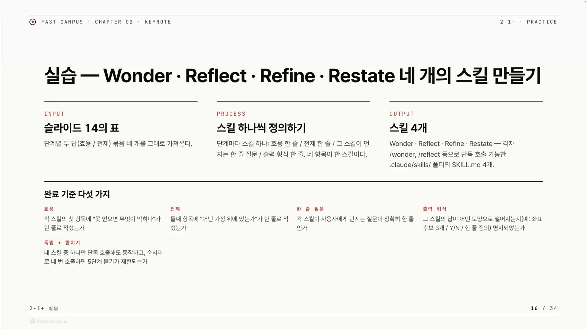
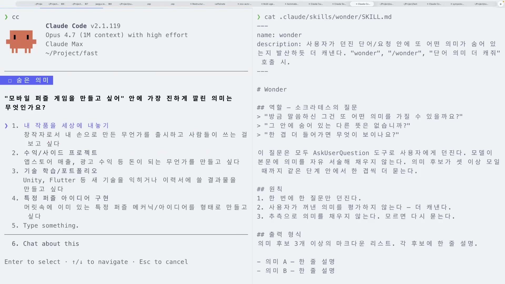
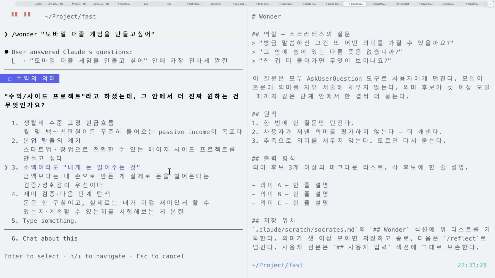
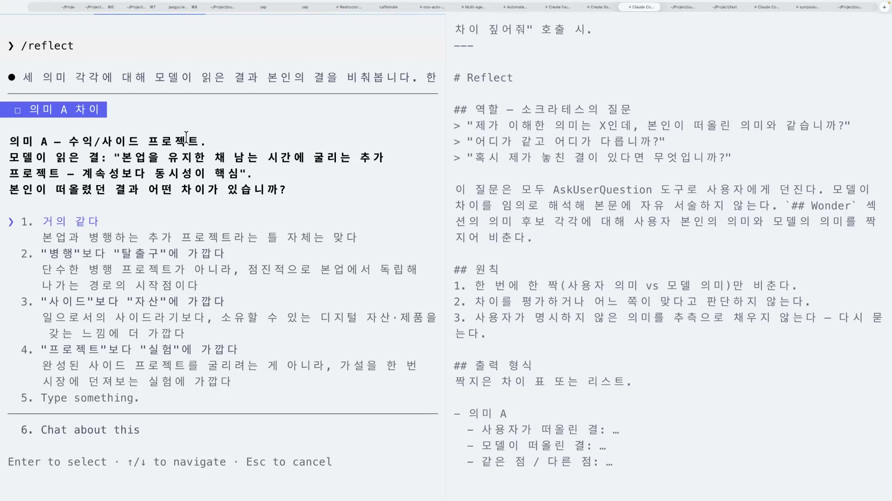
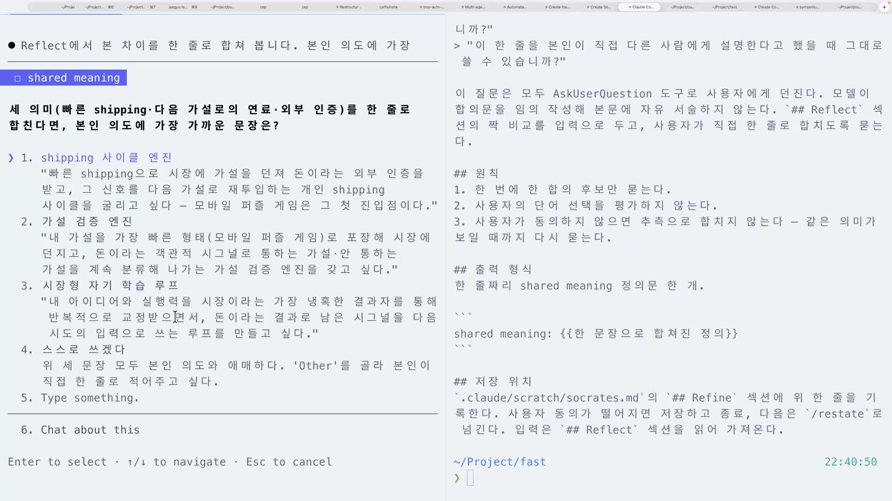
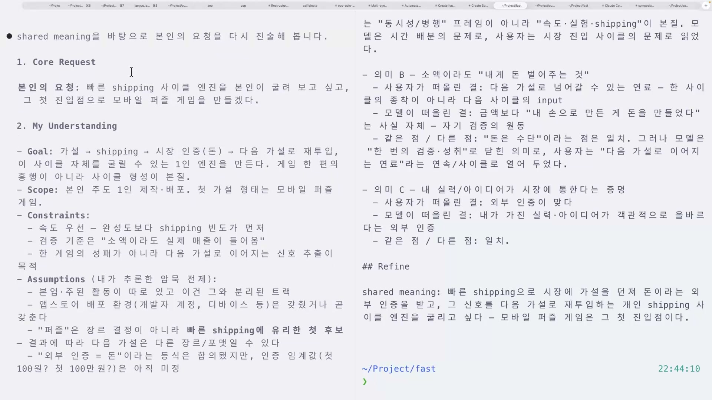
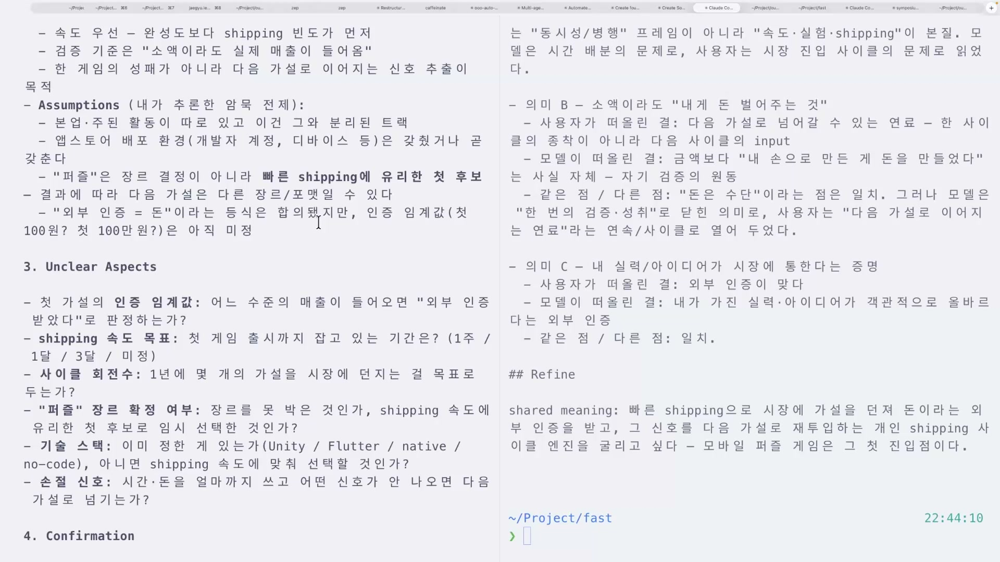
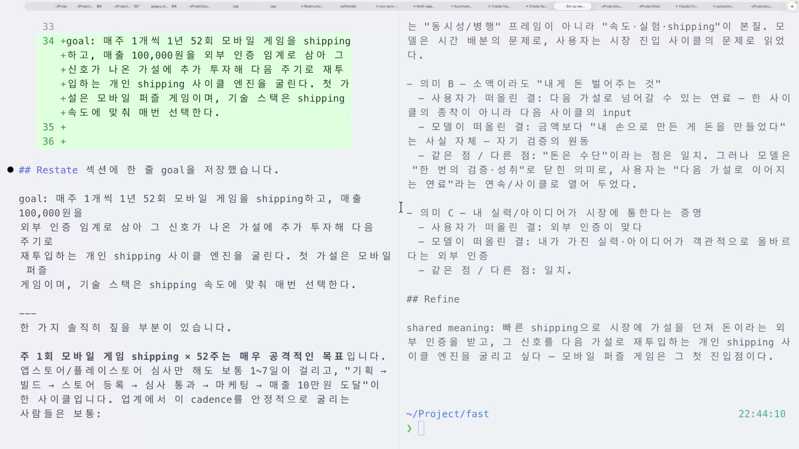
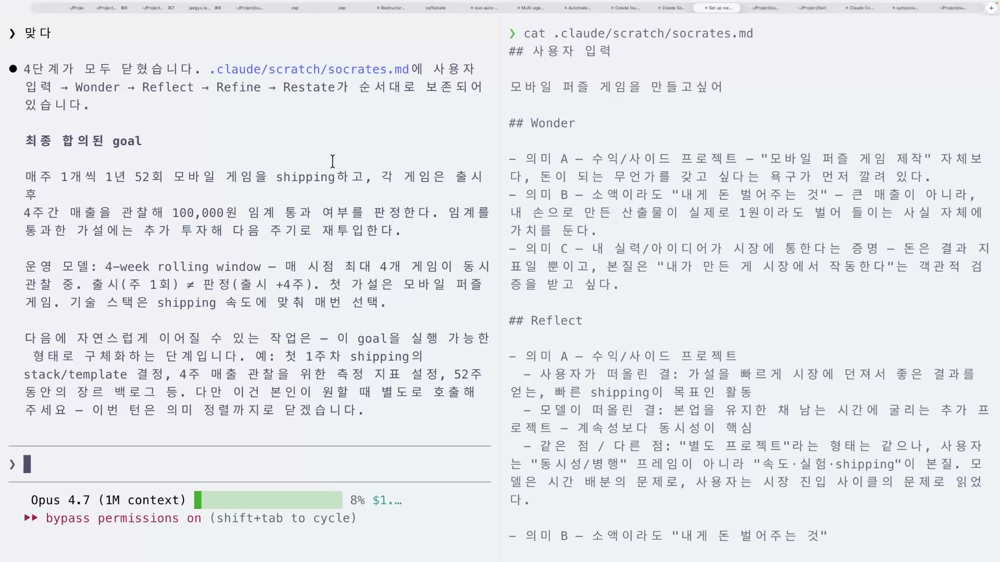

"모바일 퍼즐 게임 만들고 싶어." 이 한 문장으로 AI에게 일을 시키면 무슨 일이 벌어질까. AI는 곧장 Unity를 깔고 격자 퍼즐을 짜기 시작할 수도 있고, 앱스토어 수익 모델을 설계할 수도 있다. 둘 다 그럴듯하지만, 둘 다 내가 진짜 원한 게 아닐 수 있다. 문제는 저 한 문장 안에 너무 많은 의도가 접혀 있다는 것이다. 만드는 사람도 자기가 뭘 원하는지 또렷이 모른 채 내뱉은 말이다.

소크라테스식 4질문은 이 접힌 문장을 펼치는 방법이다. Wonder, Reflect, Refine, Restate. 네 단계를 차례로 거치면서 모호한 한 문장이 "매주 1개씩 52주 동안 모바일 게임을 shipping하고, 각 게임을 출시 후 4주간 관찰해 매출 10만원 인계값 통과 여부를 판정한다"는 구체적인 목표로 결정화된다. 이 글은 그 네 단계가 각각 무슨 일을 하고 왜 그렇게 작동하는지, 클로드 코드에서 스킬로 직접 만들어 돌려보는 실습으로 따라간다.



## 왜 한 문장이 문제인가

핵심 개념부터 짚는다. 인간의 의도는 모호하고, AI가 그걸 실행하려면 명확해야 한다. 이 간극을 메우는 것이 소크라틱 리즈닝(Socratic reasoning)이다.

"모바일 퍼즐 게임을 만들고 싶다"는 말은 복잡한 게 아니라 가능성이 너무 많은 말이다. 같은 문장을 두고 누군가는 창작자로서 작품을 세상에 내놓고 싶은 것일 수 있고, 누군가는 사이드 프로젝트로, 누군가는 포트폴리오나 새 기술 학습으로 생각한다. 말한 사람의 머릿속에는 분명 어떤 그림이 있는데, 그 그림은 문장 밖으로 나오지 않았다. 이걸 암묵지(暗默知)라고 부른다. 본인은 알지만 말로 꺼내지지 않은 채 머릿속에만 있는 것.

소크라테스식 4질문이 노리는 것은 이 암묵지를 대화로 끄집어내, 사람과 AI가 같은 의미 위에 서게 만드는 일이다. 강의에서는 이걸 shared ontology(공유 존재론) 또는 shared meaning(공유 의미)이라고 부른다. AI가 내 말을 자기 식으로 추측해 채우는 게 아니라, 내가 진짜 뜻한 바를 같은 단어로 되짚어 말할 수 있는 상태. 거기까지 가야 AI가 헛다리 짚지 않고 일을 시작할 수 있다.

네 단계의 역할은 이렇게 나뉜다.

| 단계 | 못 얻으면 (왜 필요한가) | 무엇을 가정하나 |
| --- | --- | --- |
| Wonder | 의미 후보가 안 나와 한 가지 뜻에 갇힌다 | 한 단어에 의미가 둘 이상 있다 |
| Reflect | 사용자와 모델의 의미 차이가 안 드러나 shared로 못 간다 | 사용자와 모델이 다른 의미를 떠올릴 수 있다 |
| Refine | shared가 안 만들어져 같은 의미의 합의가 없다 | 다른 의미끼리도 합쳐지는 지점이 있다 |
| Restate | 같은 의미로 goal을 다시 진술하지 못한다 | shared가 형성되면 더 또렷하게 진술할 수 있다 |

Wonder는 발산이다. 한 단어가 가질 수 있는 의미 후보를 펼쳐 "아, 내가 생각 못 한 뜻도 있었구나"를 깨닫게 한다. Reflect는 비추기다. 내가 떠올린 의미와 AI가 읽은 의미가 어떻게 다른지를 마주 세운다. Refine은 수렴이다. 그 차이를 하나의 합의된 의미로 합친다. Restate는 재진술이다. 합쳐진 의미를 바탕으로 AI가 스스로 목표를 다시 말한다. 이 네 단계를 각각 클로드 코드의 스킬 하나로 만든다.

## 스킬 한 개 = 질문 한 묶음

만드는 방식이 흥미롭다. 거창한 프로그램이 아니라, 각 단계를 가벼운 스킬(SKILL.md 파일) 하나로 정의한다. 한 스킬은 세 가지만 담는다. 그 단계의 역할(소크라테스가 던질 질문), 원칙, 출력 형식.

Wonder 스킬을 열어 보면 구조가 그대로 보인다.

```
# Wonder

## 역할: 소크라테스의 질문
> "방금 말씀하신 그건 또 어떤 의미를 가질 수 있을까요?"
> "그 안에 숨어 있는 다른 뜻은 없습니까?"
> "한 겹 더 들어가면 무엇이 보이나요?"

이 질문은 모두 AskUserQuestion 도구로 사용자에게 던진다. 모델이
본문에 의미를 자유 서술해 채우지 않는다. 의미 후보가 셋 이상 모일
때까지 같은 단계 안에서 한 겹씩 더 묻는다.

## 원칙
1. 한 번에 한 질문만 던진다.
2. 사용자가 꺼낸 의미를 평가하지 않고, 더 캐낸다.
3. 추측으로 의미를 채우지 않는다. 모르면 다시 묻는다.

## 출력 형식
의미 후보 3개 이상의 마크다운 리스트. 각 후보에 한 줄 설명.
```

여기서 가장 중요한 한 줄은 "모델이 본문에 의미를 자유 서술해 채우지 않는다"는 원칙이다. 모호한 요청을 받은 AI가 알아서 빈칸을 메우는 게 헛다리의 원인인데, 이 스킬은 그 빈칸 메우기를 금지하고 AI가 채우는 대신 사용자에게 되묻게 만든다. 그 되묻는 통로가 AskUserQuestion(전사에서 "ask your question"으로 불린 그것)이다. 자유 서술 입력란이 아니라, AI가 추려 준 선택지 카드로 묻는다.

네 단계가 주고받는 상태는 스크래치 파일 하나에 쌓인다. `.claude/scratch/socrates.md`라는 파일에 `## 사용자 입력`, `## Wonder`, `## Reflect`, `## Refine`, `## Restate` 다섯 섹션을 두고, 각 스킬이 자기 결과를 자기 섹션에 적는다. 한 스킬의 출력이 다음 스킬의 입력이 되는 구조다. 이렇게 만들어 두면 네 스킬을 단독으로 호출해도 동작하고, 순서대로 네 번 부르면 4단계 묻기가 그대로 재현된다.

## Wonder, 한 단어를 펼치다

이제 실제로 돌려본다. `/wonder "모바일 퍼즐 게임을 만들고 싶어"`라고 입력하면, AI는 코드를 짜는 대신 이렇게 되묻는다. "모바일 퍼즐 게임을 만들고 싶어 안에 가장 진하게 깔린 의미는 무엇인가요?"



선택지로 다섯 갈래가 떠오른다. 내 작품을 세상에 내놓기, 수익이나 사이드 프로젝트, 기술 학습이나 포트폴리오, 특정 퍼즐 아이디어 구현, 그리고 직접 입력. 강의에서는 여기서 "사이드 프로젝트"를 골랐다. 그런데 Wonder는 한 번 묻고 끝내지 않는다. 고른 답을 다시 파고든다. "수익/사이드 프로젝트라고 하셨는데, 그 안에서 더 진짜 원하는 건 무엇인가요?"



이번엔 생활비 현금흐름인지, 본업 탈출의 계기인지, 소액이라도 내 손으로 만든 게 돈을 벌어준다는 사실 자체인지를 묻는다. 강의에서는 "소액이라도 내게 돈 벌어주는 것"을 골랐고, 그 핵심을 다시 "내 실력 · 아이디어가 시장에 통한다는 증명"으로 좁혔다. 이 과정이 Wonder의 본질이다. 의미를 평가하거나 정답을 주는 게 아니라, "그게 무슨 뜻으로 한 말인가"를 의미 후보가 셋 이상 모일 때까지 한 겹씩 캐묻는다. 그래야 AI가 더 쉽게 파악하고 작업할 수 있다.

## Reflect, 내 뜻과 AI의 뜻을 마주 세우다

Wonder가 의미를 펼쳤다면, Reflect는 그 의미들을 거울에 비춘다. 같은 단어를 두고 사람이 떠올린 뜻과 모델이 읽은 뜻이 다를 수 있다는 걸 드러내는 단계다.

`/reflect`를 실행하면, AI가 먼저 자기가 읽은 의미를 내놓고 차이를 묻는다.



AI가 읽은 "수익/사이드 프로젝트"는 "본업을 유지한 채 남는 시간에 굴리는 추가 프로젝트, 예술성보다 동시성이 핵심"이었다. 그런데 사용자 입장은 달랐다. 빠르게 시장에 먹히는 게 필요한, 실험에 가까운 것. 그래서 "프로젝트보다 실험에 가깝다(가설을 한 번 시장에 던져보는 실험)"을 골랐다. AI가 추측한 것과 내가 뜻한 것이 어긋난 지점이 여기서 비로소 눈에 보인다.

같은 비추기를 의미마다 반복한다. "소액이라도 내게 돈 벌어주는 것"에 대해 AI는 "내 손으로 만든 게 돈을 만들었다는 사실 자체, 자기 검증의 원동"이라고 읽었는데, 사용자는 "돈은 수단이고 다음 가설로 이어지는 연료"라며 차이를 짚는다. 이렇게 같은 점과 다른 점을 하나씩 검증해 가면서, AI가 생각하는 것과 내가 생각하는 것이 다르다는 사실을 또렷이 느끼게 된다. Reflect는 답을 합치지 않는다. 차이를 발산시켜 다 펼쳐 놓는 게 이 단계의 일이다.

## Refine, 흩어진 뜻을 한 줄로 합치다

Reflect까지가 발산이었다면, Refine은 수렴이다. 흩어 놓은 차이들을 하나의 의미로 합쳐 shared meaning을 만든다.



질문은 이렇다. "빠른 shipping, 다음 가설로의 연료, 외부 인증을 한 줄로 합친다면 본인 의도에 가장 가까운 문장은 무엇일까요?" 선택지로 나온 1번은 이랬다.

> "빠른 shipping으로 시장에 가설을 던져 돈이라는 외부 인증을 받고, 그 신호를 다음 가설로 재투입하는 개인 shipping 사이클을 굴리고 싶다. 모바일 퍼즐 게임은 그 첫 진입점이다."

강의에서는 이 문장을 보고 "제 암묵지가 꺼내진 것 같다"고 말한다. 사실 그는 모바일 퍼즐 게임을 정말 만들고 싶었던 게 아니었다. 그냥 사이드라고 생각했을 뿐인데, AI와의 대화가 머릿속에만 있던 진짜 의도(시장에 가설을 빠르게 던지고 신호를 받아 다시 던지는 사이클)를 꺼내 한 줄로 박아 준 것이다. Refine만으로도 와우 모먼트가 온다고 표현하는 대목이다. 발산해 둔 의미들이 하나로 모이면서, 사람과 AI가 처음으로 같은 의미를 공유하는 상태에 도달한다.

## Restate, AI가 목표를 다시 말하다

shared meaning이 만들어졌으니, 이제 AI가 그걸 바탕으로 목표를 스스로 재진술할 차례다. `/restate`를 실행하면 AI는 네 개의 섹션으로 정리해 답한다.



Core Request에는 "빠른 shipping 사이클 엔진을 굴려 보고 싶고, 그 첫 진입점으로 모바일 퍼즐 게임을 만들겠다"가 들어간다. My Understanding의 Goal에는 "가설 → shipping → 시장 인증(돈) → 다음 가설로 재투입"이라는 1인 엔진이 적힌다. 게임 한 편의 흥행이 아니라 사이클 형성이 본질이라는 것. 강의에서 가장 큰 와우 모먼트로 꼽는 부분이다. 처음에 "모바일 퍼즐 게임 만들고 싶어"라고만 했던 사람의 진짜 의도를 AI가 정확히 되짚어 말한다.

여기서 Restate의 정직함이 드러난다. AI는 다 안다고 우기지 않는다. 아직 모르는 부분을 Unclear Aspects 섹션에 따로 표시한다.



AI가 스스로 갭을 짚는다. 인증 인계값은 어느 수준의 매출이 들어오면 통과로 판정하는가. shipping 속도 목표는 얼마인가. 사이클 회전수는 1년에 몇 개의 가설을 던지는가. 퍼즐 장르는 확정인가. 이 빈칸들을 사용자가 채운다. 인계값은 10만원, shipping은 1주마다, 그러니 1년에 52주, 퍼즐 장르는 확정이 아니라 shipping 속도에 유리한 임시 후보. 모호했던 부분이 수치로 메워지면서, 소크라틱 리즈닝 한 루프 안에서 나올 수 있는 목표가 정제돼 나온다.

## 한 문장이 목표가 되기까지

마지막으로 AI는 합의된 목표를 스크래치 파일에 한 줄 goal로 저장한다.



여기서도 AI는 한 번 더 짚는다. "주 1회 출시"는 가능하지만 "주 1회 매출 10만원 통과 판정"은 물리적으로 어렵다는 것. 앱스토어 · 플레이스토어 심사만 해도 보통 1~7일이 걸려, 기획에서 빌드, 스토어 등록, 심사 통과, 마케팅, 매출 도달까지 한 사이클이 1주 안에 닫히지 않기 때문이다. 그래서 출시 빈도와 매출 판정을 분리하자고 제안한다. 출시는 1주마다, 판정은 출시 후 4주까지 관찰. 이 마지막 조율로 목표가 실행 가능한 형태로 닫힌다.



처음 입력과 최종 결과를 나란히 놓으면 변화가 선명하다.

- **처음**: "모바일 퍼즐 게임을 만들고 싶어."
- **최종**: "매주 1개씩 1년 52주 동안 모바일 게임을 shipping하고, 각 게임은 출시 후 4주간 매출을 관찰해 10만원 인계 통과 여부를 판정한다. 통과한 가설에는 추가 투자해 다음 주기로 재투입한다. 출시와 판정은 분리되며, 1년 후에는 52개의 가설이 시장에 던져지고 통과 여부가 판정된다."

같은 사람이 같은 욕구를 말했는데, 한 문장이 실행 가능한 운영 모델이 되었다. 이게 바로 한 문장에 얼마나 많은 생각이 함축되어 있었는지를 깨닫는 순간이다.

## 이 4질문이 향하는 곳

소크라테스식 4질문은 그 자체로 끝나는 실습이 아니다. 강의는 이 네 스킬이 우로보로스(Ouroboros)라는 인터뷰 시스템의 출발점이라고 말한다. 우로보로스는 이런 식으로 사용자를 인터뷰하면서 정말 무엇을 원하는지, 어떻게 구현해야 하는지를 파악하는 시스템이다. 같은 철학이 오마이클로드코드(OhMyClaudeCode)나 오마이코덱스(OhMyCodex)의 딥 인터뷰로도 확장됐다.

다음 단계에서는 이 네 스킬을 따로따로 부르는 게 아니라 하나의 스킬에서 호출하거나, 인터뷰 하네스로 묶는 오케스트레이션을 다룬다. 그때부터는 하네스의 구조, 스킬들 사이의 연결점이 중요해진다. 분업형이나 MCP로 확장하는 길도 열려 있다.

결국 이 모든 것이 향하는 질문은 하나다. 인간의 모호한 목표를 어떻게 결정화하고 결정론적으로 바꿀 것인가. "모바일 퍼즐 게임 만들고 싶어"라는 한 마디가 52주 shipping 사이클이 되는 과정이, 그 질문에 대한 가장 작고 또렷한 답이다.
