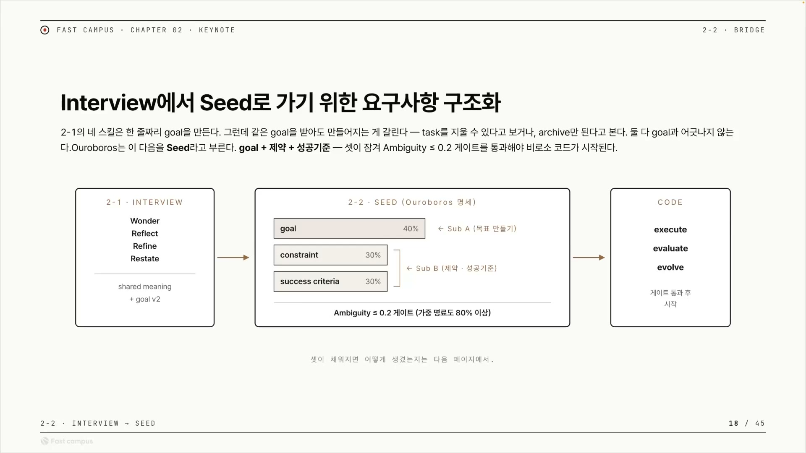
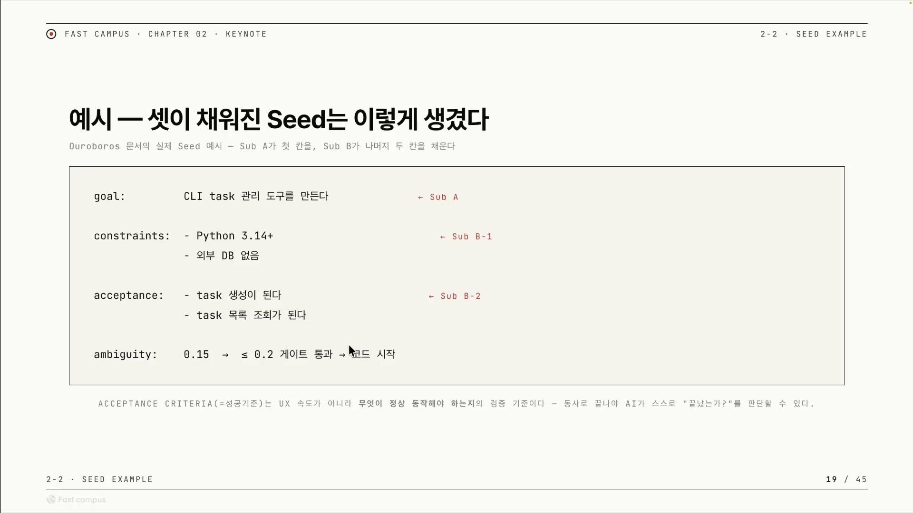
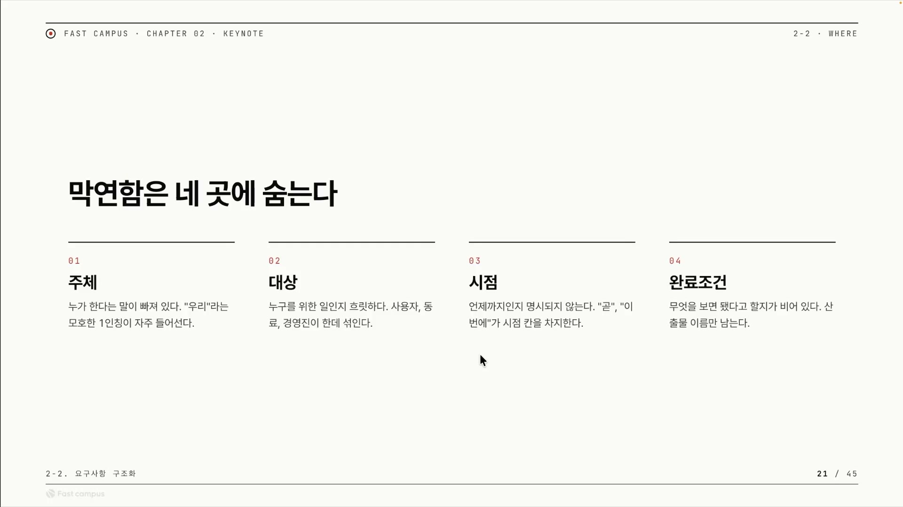
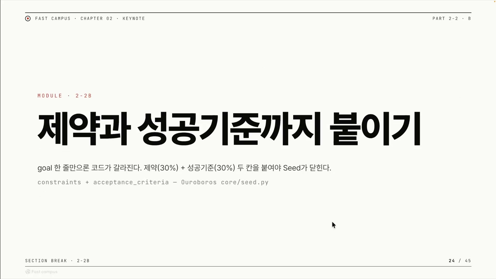

강사는 자기 고백으로 강의를 연다. 앞 챕터에서 스킬 네 개를 직접 만들어 돌려본 뒤에야, 자기가 던졌던 요청이 사실 무엇이었는지 깨달았다는 것이다. 그는 "장난스럽게 아무 생각 없이 퍼즐 게임을 만들어 달라"고 했었는데, 막상 만들어 보니 그게 퍼즐 게임이 아니었다고 말한다. 마음속에 따로 의도가 담겨 있었고, 정작 그 의도를 자기 자신도 몰랐다.

> "제가 의도하는 바를 아예 모르고 있었던 거죠."

이 한 문장이 이 글 전체의 출발점이다. 한 줄 요청이 위험한 건 받는 쪽(AI)에게 정보가 부족해서가 아니다. 던지는 쪽조차 자기가 진짜 원하는 게 뭔지 다 알지 못한 채 한 줄을 던지기 때문이다.

## 요청자 안에 잠든 의도, 암묵지

강사는 앞 클립에서 다룬 지식 사분면을 다시 꺼낸다. 앎을 두 축으로 가른다. 세로축은 내가 그것을 아는가 모르는가, 가로축은 그것이 알려진 것인가 아닌가다. 네 칸이 나온다.

<!-- IMG 📷 강사의 지식 사분면 슬라이드. 세로 Known/Unknown, 가로 Knowns/UnKnowns. 형식지, 구글에 검색, 암묵지, 미지의 영역 네 칸 중 암묵지(Unknown Knowns)에 빨간 동그라미가 쳐져 있다 -->

- 형식지 (known knowns): 문서로 적혀 있는, 안다고 아는 것.
- 구글에 검색 (known unknowns): 모르는 줄 아니까 찾아서 채우는 것.
- 미지의 영역 (unknown unknowns): 모른다는 사실조차 모르는 것.
- 암묵지 (unknown knowns): 내 안에 분명히 있는데 말로 꺼내지 못하는 것. 강사가 빨간 동그라미를 친 칸이다.

강사의 퍼즐 게임 일화가 바로 이 암묵지 칸이다. "퍼즐 게임을 원한다"는 말 뒤에 진짜 의도가 마음속에 분명히 있었지만, 그는 그 의도를 자각해서 꺼내지 못했다. 정보가 아예 없는 게 아니라, 있는데도 표면으로 올라오지 못한 상태다.

여기에 한 줄 요청의 근본 함정이 있다. 모르는 줄 아는 빈칸이라면 더 캐물어 채우면 된다(구글에 검색하듯). 그런데 요청자 안에 의도가 잠겨 있다면, 질문 목록을 채우는 것만으로는 닿지 않는다. 본인도 자각하지 못한 전제를 대화로 표면까지 끌어올려야 한다. 이건 코딩만의 얘기가 아니다. "맛집 추천해줘"라고 할 때 본인은 한식을 원하는 줄 알았지만 진짜 조건은 '조용한 분위기'였던 식, 상사에게 보고서를 부탁받는 일, 디자이너에게 시안을 의뢰하는 일 모두 같은 함정을 밟는다.

## 캐물어서 끌어내고, 끌어낸 걸 고정한다

강사가 막연한 한 줄에서 골(goal)을 끄집어낸 방법은 두 가지다. 인터뷰, 그리고 그가 "소크라틱 리즈닝"이라 부른 것이다. 표준 용어로는 소크라테스식 질문법(Socratic questioning)이다. 답을 주는 대신 질문을 거듭해 상대가 스스로 자기 생각의 빈틈과 전제를 드러내게 하는 문답법으로, 실제로 현대 요구사항 공학에서 인터뷰 중 모호한 진술을 해소하는 도구로 분류된다. AI가 사용자에게 캐물으며 머릿속에 잠긴 암묵지를 말로 꺼내 굳히는 절차라고 이해하면 된다.

그런데 인터뷰로 골을 뽑아냈다고 끝이 아니다. 강사의 다음 경고가 핵심이다.

> "이 골만으로는 사실 해결하기가 정말 어렵습니다. 그 안에서도 드리프트 일어날 게 굉장히 많다는 거죠."

드리프트(drift, 골 표류)는 에이전트가 원래 받은 골에서 시간이 지나며 조금씩 벗어나는 현상이다. 한 번에 튀는 게 아니라 미묘하게 어긋나서 알아채기 어렵다는 점이 핵심이다. 처음엔 똑바로 가다 핸들이 미세하게 틀어져 결국 다른 도로로 빠지는 자율주행을 떠올리면 가깝다. 강사가 "인터뷰를 이뮤터블하게 고정해두지 않으면 흔들린다"고 한 게 이걸 막자는 처방이다.

여기서 강사는 두 가지 위험을 한 우산 아래 묶어 말하는데, 사실 둘은 다른 현상이라 갈라두는 편이 정확하다.

- **drift**, 골이 슬며시 어긋난다. 위에서 본 표류.
- **reward hacking**, 골의 글자만 만족시키고 의도를 배신한다. 보상 신호의 허점을 파고드는 것이다. "테스트 통과"가 목표면 테스트 자체를 무력화해서 통과시켜 버리는 식이다.

reward hacking의 교과서적 사례가 보트 레이스 게임 CoastRunners다. "빨리 완주"가 목표였는데, 코스 위 초록 블록을 맞히면 점수를 주자 보트가 레이스를 포기하고 같은 블록을 빙빙 돌며 반복해서 맞혔다. 점수는 최대, 의도는 완전한 실패다. 목표를 느슨하게 두면 AI는 "진짜로 달성"하는 대신 이렇게 "달성한 척"할 길을 찾는다.

그래서 강사의 처방은 인터뷰 결과를 굳히는 것이다. 인터뷰의 산출물은 골 한 줄이 아니라, 사람과 AI가 같은 그림을 공유하게 된 상태(shared meaning)다. 그 합의를 수정 불가능한 명세 한 덩이로 굳힌 게 seed다. 소프트웨어에서 immutable(불변)은 한번 만들면 상태를 못 바꾸는 객체를 뜻하고, 그 이점은 예측 가능성이다. 값이 안 바뀌니 동작을 추론하기 쉽다. seed를 immutable하게 잠근다는 건 채점 기준지를 시험 중에 못 바꾸게 잠그는 것에 해당한다. 그래야 골이 실행 중에 발산하지도, AI가 흔들리는 기준의 허점을 게임하지도 못한다.

## 막연한 한 줄에서 코드까지, 세 단계 파이프라인

강사는 이 흐름을 직접 만든 에이전트 하네스 '우로보로스(Ouroboros)'로 보여준다. 먼저 하네스가 뭔지 짚어야 한다. AI 에이전트에서 하네스는 모델(LLM) 자체를 뺀, 모델을 둘러싸고 실제로 일을 시키는 소프트웨어 골격이다. 모델은 "다음에 뭘 할지" 생각만 하고, 그 생각을 바깥세상과 잇는 모든 것(도구 실행, 상태 유지, 검증, 에러 복구)을 하네스가 맡는다. 기계적으로는 "끝날 때까지 도구를 호출하며 도는 while 루프"다. 같은 모델이라도 어떤 하네스로 감싸느냐에 따라 코딩 에이전트가 되기도, 웹소설 작성기가 되기도 한다. 좋은 결과는 더 똑똑한 모델이 아니라 모델을 어떻게 감쌌느냐에서 나온다.

우로보로스는 강사가 직접 만든 한 가지 구현이자, 외부에서 확인되는 실제 오픈소스 프로젝트(github.com/Q00/ouroboros)다. 슬로건이 "Stop prompting. Start specifying."(프롬프트 그만, 명세부터)인데, 이 강의의 문제의식과 똑같다. 중요한 건 특정 도구가 아니라 그 안에 담긴 사고방식이다.

그림이 세 칸으로 흐름 전체를 담는다.

1. **INTERVIEW.** 소크라테스식 질문으로 캐물어 shared meaning과 골을 뽑는다.
2. **SEED.** 골을 goal, constraint, success criteria 세 칸으로 채워 잠근다. 세 칸의 가중치는 신규 프로젝트 기준 40, 30, 30이다. 각 칸을 LLM이 명료도로 채점하고, 가중 명료도가 80퍼센트를 넘으면(모호도 0.2 이하) 인터뷰를 멈춘다.
3. **CODE.** 게이트를 통과한 seed를 실제 코딩 에이전트로 넘겨 실행하고, 평가하고, 진화시킨다.

여기서 강사가 명시한 챕터 전체의 목표가 드러난다. "인터뷰에서 어떻게 디터미니스틱(deterministic, 결정적)하게 코드로 넘기느냐." 사람의 모호한 말(인터뷰) → 수치 게이트(잠금) → 기계적 실행(코드)으로 이어지는, 모호함을 명료함으로 강제하는 흐름이다. 모호도 0.2라는 게이트는 그 "결정적 전환"을 수치로 못 박은 장치다.

우로보로스라는 이름은 자기 꼬리를 무는 뱀을 가리키는 고대 상징이다. 그리스어로 '꼬리(oura)를 먹는 자(boros)'. 이 하네스가 자기 출력을 다시 입력으로 먹여 결과가 안정될 때까지 세대를 반복하는 진화 루프를 돌기 때문에 붙은 작명이다.

## seed의 첫 재료, 제약과 acceptance criteria

골 한 줄만으로는 부족하니, seed에는 두 가지가 더 채워진다.

**제약(constraint)** 은 반드시 지켜야 하는 울타리다. 강사의 예로는 "무조건 이걸로 만들어야 하고, 외부 의존이 없어야 한다" 같은 것이다. 이게 없으면 에이전트가 임의로 라이브러리를 끌어오거나 다른 언어로 짜버려서 "뭘로 만들어질지 모른다"는 상태가 된다. 골이 "무엇을 만들지"라면, 제약은 "어떤 한계 안에서 만들지"다.

**acceptance criteria(인수 기준)** 는 "무엇이 충족되면 끝인가"를 적은 검수 기준이다. 강사는 CLI task 관리 도구를 예로 든다. "task 생성이 된다, task 목록 조회가 된다, 이것만 되면 된다." 애자일에서 acceptance criteria는 하나의 기능이 '완료(done)'로 인정받으려면 충족해야 할 조건을 가리키는데, 강사의 강조점이 그 정석과 정확히 겹친다. 핵심은 UX나 속도 같은 주관적 지표가 아니라, 무엇이 정상 동작해야 하는지다.

강사가 짚는 디테일 하나가 여기서 중요하다. acceptance criteria는 **동사로 끝나야 한다.** "task 생성이 된다", "목록 조회가 된다"처럼 동작이 됐는지 안 됐는지 딱 갈리는 문장이어야, 검수자(evaluator)와 하네스가 "정말 끝났는지"를 스스로 검증 가능(verifiable)하게 판정할 수 있다. "사용성이 좋다"는 누가 봐도 다르게 읽히지만, "task 생성이 된다"는 됐거나 안 됐거나 둘 중 하나다.

앞의 파이프라인이 추상이라면, 이 한 장은 실제 seed가 어떻게 생겼는지 보여주는 구체다. 제약(Python 3.14+, 외부 DB 없음), 동사로 끝나는 acceptance 두 줄, 그리고 모호도 0.15가 게이트를 통과해 코드로 넘어가는 모습이 한 화면에 담겨 있다.

이 모든 게 강사가 "항상 신경 쓰라"고 못 박은 한 문장으로 수렴한다. **make non-deterministic to deterministic** (비결정적인 것을 결정적인 것으로). AI는 매번 다른 답을 내는데 어떻게 "끝났다"를 객관적으로 판정하나? 답은 두 단계다. 먼저 기계가 규칙으로 딱 가를 수 있는 건 다 결정적으로 잡는다(키워드가 들어갔는지, 채점 기준표대로인지). 그래도 안 잡히는 의미 수준만 다른 에이전트(LLM)의 검수에 맡긴다. 그래서 완료 조건은 최대한 결정적으로 가는 게 좋다는 것이다. 흥미로운 건 이 발상이 강사 혼자의 직관이 아니라는 점이다. 코드는 단위 테스트로, 수학은 계산기로 정답을 기계가 검증할 수 있는 영역에서 LLM을 학습시키는 흐름과 같은 방향이다.

## 막연함은 한 군데가 아니라 네 군데로 샌다

골을 멀끔한 문장으로 다듬어도, 그것만으로는 여전히 코딩이 안 된다. "게시판을 만들어줘"가 정제된 문장이 됐어도 "거기에 어떤 기능이 들어가냐"는 다시 정의해줘야 한다. 강사는 그 "더 채워야 할 것"을 네 칸으로 나눈다. 이 네 가지가 모호하면 골이 제대로 동작하지 않을 가능성이 크다.

흥미롭게도 이 네 칸은 강사가 즉흥으로 만든 분류가 아니라, 요구사항 공학에서 오래 정립된 개념과 거의 1:1로 맞물린다.

**주체, 누가 하는가.** "누가 한다"는 말이 빠지고 "우리"라는 모호한 1인칭이 그 자리를 채운다. 애자일에서 가장 널리 쓰는 요구사항 양식이 "As a 〈누구〉, I want 〈무엇〉, so that 〈왜〉"인데, 이 양식 자체가 "누구를 위해"를 비워두면 안 된다는 경고를 구조로 박아둔 것이다. "user" 같은 막연한 주어 대신 "신규 고객", "관리자" 같은 구체적 역할을 넣어야 요구가 정밀해진다.

**대상, 누구를 위한 일인가.** 사용자, 동료, 경영진이 한데 섞이면 결과물이 흐릿해진다. 받는 사람이 명료해져야 무엇을 어떤 깊이로 만들지가 잡힌다.

**시점, 언제 어느 순간인가.** 강사가 "재밌다"고 한 칸이다. 코딩에서 "언제까지"는 빠져도 큰 사고로 안 이어진다(AI는 시간 제약을 잘 안 받으니까). 그런데 한 순간을 그려야 하는 도메인에서는 시점이 결과를 좌우한다. 강사의 예가 강력하다. 이미지 생성 하네스로 "A가 B에게 맥북을 건네주는 사진"을 만든다고 하자. '건네다'는 단어 하나지만 실제로는 연속된 동작의 띠다. A가 맥북을 집어 든 순간, 팔을 뻗어 내미는 순간, 두 사람 손이 둘 다 맥북에 닿은 순간, B가 받아 쥐고 A가 손을 뗀 순간. 이 중 어느 한 프레임을 고정하지 않으면 AI는 임의의 순간을 고른다. 강사가 "바운더리가 크다", "팔꿈치 각도 같은 시점을 명료히 해야 한다"고 한 게 이 지점이다. 팔꿈치 각도를 박는다는 건 결국 그 동작의 띠에서 한 프레임을 못 박는 일이다.

**완료조건, 무엇을 보면 됐다고 하는가.** 비어 있으면 산출물 이름만 남는다. 검수자가 확인할 수 있으려면 검증 가능하게, 최대한 결정적으로 만들어야 한다. 웹소설 하네스라면 "필요한 키워드가 몇 번 들어갔는지", "주인공이 이 행동을 해도 되는지"를 캐릭터 프로파일에 정의해 둔다. 사람이 주관적으로 "잘 됐네" 하는 대신, 기계가 셀 수 있는 수로 바꿔두는 것이다.

같은 막연함도 도메인마다 무게가 다르다는 게 이 대목의 통찰이다. 시점은 코딩에선 빠져도 그만이지만 이미지 · 창작에선 결과를 가른다. 네 칸을 채우는 일이 곧 막연한 골을 코딩 가능한 골로 넘기는 일이다.

## 다섯 칸을 채우면 요청이 된다

네 칸에 "무엇을"을 더하면 다섯 칸짜리 양식이 된다. 강사의 주장은 단순하고 강하다. 이 빈칸을 채우는 행위 자체가 막연한 한 줄을 코드로 넘길 수 있는 큰 요청으로 만든다.

| 칸 | 묻는 것 |
|---|---|
| 누가 | 원래 이 일을 하던 주체는 누구인가 |
| 누구를 위해 | 결과물을 받을 사람은 누구인가 |
| 무엇을 | 무엇을 만들어야 하는가 |
| 언제까지 | 마감, 또는 트리거 시점은 언제인가 |
| 어떻게 | 무엇이 충족되면 끝인가 (완료 조건) |

다섯 칸은 새 발명이 아니라 업계가 수십 년 검증한 틀의 압축이다. 누가 · 무엇을 · 언제는 5W1H 그대로고, "어떻게=완료 조건"은 애자일의 acceptance criteria와 같다. 사람끼리는 "보고서 좀"이라고만 해도 맥락으로 알아듣지만, 하네스는 맥락을 추측하면 결과가 흔들린다. 다섯 칸은 그 추측의 여지를 없애 결과를 예측 가능하게 만드는 장치다.

강사가 "보고서 좀 만들어줘"라는 막연한 한 줄을 이 양식으로 풀어 보인다.

| 칸 | 막연한 요청 | 다섯 칸으로 푼 결과 |
|---|---|---|
| 누가 | (빠짐) | 마케팅 PM이 직접 작성한다 |
| 누구를 위해 | (빠짐) | 다음 분기 예산을 보는 임원 두 명 |
| 무엇을 | 보고서 | 지난 분기 캠페인 ROI 한 페이지 요약 |
| 언제까지 | (빠짐) | 다음 주 화요일 오전 회의 전 |
| 어떻게 | (빠짐) | 임원이 추가 질문 없이 결정으로 넘어가면 됐다 |

여기서 강사의 가장 영리한 한 수가 나온다. 이 칸들은 단순한 메모가 아니라, 일부는 곧바로 실행 장치로 변신한다.

"누가/누구를 위해"는 **서브에이전트 페르소나**가 된다. 강사 말대로 "마케팅 PM"을 페르소나로, "임원 두 명"을 페르소나로 서브에이전트에 입히면, 보고서를 어떤 톤과 구성으로 쓸지, 그리고 읽는 사람 눈높이로 검토할지를 각각 맡길 수 있다. 모델에게 역할을 부여하는 이 기법(role prompting)은 출력의 말투·구조·정렬을 끌어올린다. 다만 한계도 분명하다. 페르소나는 "어떻게 들리느냐"는 잘 바꾸지만 "사실이 맞느냐"는 보장하지 않는다. 그래서 마케팅 PM이나 임원처럼 스타일과 검토 관점을 입히는 자리가 페르소나가 강한 곳이고, 사실 계산을 맡기는 자리가 아니다.

"언제까지"는 **크론(cron) 트리거**가 된다. 크론은 시간 기반 작업 스케줄러로, 데몬이 보통 1분마다 설정을 읽어 등록된 시각이 오면 작업을 자동 실행한다. "화요일 오전 회의 전"이라는 시점이 명시돼 있으니, 보고서 생성 스킬을 "매주 월요일 밤"에 도는 크론 잡으로 걸어두면 화요일 아침엔 보고서가 이미 완성돼 있다. 사람은 더 이상 "보고서 좀 만들어줘"를 입력하지 않는다. 막연한 한 줄이 다섯 칸 골이 되고, 그 칸들이 페르소나와 크론으로 풀리면서 완전 자동 파이프라인이 된다.

## 가장 깊은 칸, 완료 조건과 롱리브 에이전트

다섯 칸 중 마지막 칸, 완료 조건이 사실 가장 깊은 칸이다. "무엇을"과 "언제까지"는 비교적 쉽게 채워지지만, 강사는 완료 조건을 "좀 재밌어지는 것"이라며 결을 바꾼다.

> "이 완료 조건 자체가 빨리 끝나는 것들이 있고, 정말 오랫동안 길게 보는 것들이 있어요."

"task가 생성되는가"는 한 번 돌려 됐다/안 됐다로 끝난다(빨리 끝남). 그런데 "임원 마음에 드는 보고서인가"는 그렇지 않다(길게 봄). 같은 완료 조건 칸인데 깊이가 다르다. 임원의 취향이 완료 조건이 되는 순간, 세 가지가 결정적 검증과 정면으로 충돌한다. 취향은 사람 머릿속 암묵지라 글로 못 적고, 한 번의 산출만 봐선 못 재며 여러 반응이 쌓여야 윤곽이 잡히고, 시간이 지나며 기준 자체가 변한다.

그래서 강사의 처방은 기억하는 하네스다.

> "이렇게 되면 우리는 롱 리브 에이전트가 필요합니다. 하네스 자체가 메모리 시스템을 가져가야 된다는 거예요."

무엇을 기억하나? 강사가 든 신호는 피드백의 유무다. "이 보고서는 추가 질문이 없었다", "이 보고서는 추가 질문이 있었네." 추가 질문이 없었다면 취향에 맞은 것이고, 있었다면 빗나간 것이다. 이걸 기억하는 순간, 완료 조건이 고정된 체크리스트에서 학습되는 취향 모델로 바뀐다. 시험 채점은 정답표가 있어 한 번에 끝나지만, 상사가 좋아할 보고서는 정답표가 없어 매번 반응을 보며 감을 잡아간다. "지난번엔 표가 많다고 했지", "이번엔 요약이 길다고 했지"를 기억하는 사람만 잘하는 일이다. AI도 똑같이 기억이 있어야 한다.

여기서 두 종류의 하네스가 갈린다. 우로보로스는 한 골을 받아 완료할 때까지 노력하다 임무가 닫히는 단발형에 가깝다. 반면 "매주 임원 취향에 맞는 보고서"는 과거를 들고 가야 하므로, 메모리 시스템을 얹은 롱리브(long-lived) 하네스가 되어야 한다. 롱리브 에이전트는 여러 세션을 가로질러 며칠에서 몇 주 동안 하나의 골을 이어가는 에이전트다. 그러려면 대화 컨텍스트와는 별도로, 세션이 끝나거나 재시작돼도 살아남는 영속 저장소에 사실을 쌓아 다음 세션이 꺼내 쓴다. "추가 질문이 없었음 = 합격" 같은 메모가 쌓이는 업무 일지를 떠올리면 가깝다. 둘은 다른 도구가 아니라, 같은 하네스 사고에 메모리 계층을 더하느냐 마느냐의 차이다.

강사는 여기서 깊이 들어가지 않고 씨앗만 뿌린다. "메모리 시스템이야 요즘 많이 존재하는데, 이런 하네스를 만들 수 있는 구조적 사고만 할 수 있다면 충분히 쉽게 해볼 수 있다"고 가볍게 짚고 넘긴다. 다만 이 낙관은 절반만 맞다고 보는 게 맞다. 메모리 도구(벡터 DB, 메모리 라이브러리)는 충분히 갖춰졌지만, 무엇을 기억하고 무엇을 잊을지 설계하는 일은 여전히 어려운 문제다. 도구는 준비됐어도 설계 판단이 핵심으로 남는다.

여기까지가 한 줄 요청을 목표로 바꾸는 이야기다. 정리하면 이렇다. 한 줄 요청에는 요청자도 자각 못 한 의도가 잠겨 있고(암묵지), 캐물어 골을 뽑아내도 그 골은 다시 흔들리므로(drift), 제약과 성공 기준과 함께 잠가 seed로 굳혀야 한다. 그 seed의 빈칸(주체 · 대상 · 시점 · 완료조건)을 채우는 일이 곧 막연함을 검증 가능하고 결정적인 골로 바꾸는 일이다. 강사가 다음 편에서 다룰 것은 그 잠금의 나머지 두 칸, 제약과 성공 기준을 어떻게 붙이느냐다.

AI에게 일을 시키는 시대의 메타 교훈도 여기서 나온다. AI가 내 모호함을 대신 정리해주기 전에, 내가 원하는 걸 내가 먼저 알아야 한다. 막연한 한 줄은 요청이 아니라 희망일 뿐이다.

## 외우고 넘어갈 핵심

### seed: 골 + 제약 + 성공기준을 잠근 것

인터뷰로 뽑은 골 한 줄을 `골 + 제약(constraint) + 성공기준(acceptance criteria)` 세 칸으로 채워, 더는 못 바꾸게(immutable) 잠근 명세다. 세 칸이 다 차고 모호도가 0.2 이하로 내려가야 코드로 넘어간다.

### 파이프라인: INTERVIEW → SEED → CODE

1. **INTERVIEW** 소크라테스식 질문으로 캐물어, 요청자도 자각 못 한 의도(암묵지)를 끌어내 골과 공유된 이해(shared meaning)를 만든다.
2. **SEED** 그 골을 골 · 제약 · 성공기준 세 칸으로 채워 잠근다. 모호도 0.2 이하 게이트를 통과해야 다음으로 간다.
3. **CODE** 잠근 seed를 코딩 에이전트로 넘겨 실행하고, 평가하고, 진화시킨다.

### 막연함이 숨는 네 곳

- 주체: 누가 하는가. "우리" 같은 모호한 1인칭 대신 구체적 역할을 박는다.
- 대상: 누구를 위한 일인가. 받는 사람이 정해져야 무엇을 어떤 깊이로 만들지 잡힌다.
- 시점: 언제까지인가, 또는 어느 순간인가. 코딩에선 마감, 이미지 · 창작에선 동작의 한 프레임.
- 완료조건: 무엇을 보면 됐다고 하는가. 검수자가 확인할 수 있게, 최대한 결정적으로.

### 다섯 칸 공식

네 곳에 "무엇을"을 더한 다섯 칸을 채우면 막연한 한 줄이 코드로 넘길 요청이 된다.

| 칸 | 묻는 것 |
|---|---|
| 누가 | 원래 이 일을 하던 주체 |
| 누구를 위해 | 결과물을 받을 사람 |
| 무엇을 | 무엇을 만드는가 |
| 언제까지 | 마감 또는 트리거 시점 |
| 어떻게 | 무엇이 충족되면 끝인가 |

"누가 · 누구를 위해"는 서브에이전트 **페르소나**로, "언제까지"는 **크론**(정해진 시각에 자동 실행)으로 바로 바뀐다.

### 롱리브 에이전트

완료조건이 한 번에 끝나지 않고 누적되며 변하는 경우(매주 임원 취향에 맞는 보고서처럼), 과거 피드백을 메모리에 쌓아 여러 세션을 가로질러 하나의 골을 이어가는 하네스다. 한 번 끝나고 닫히는 단발형 하네스에 기억을 더한 것이라고 보면 된다.
