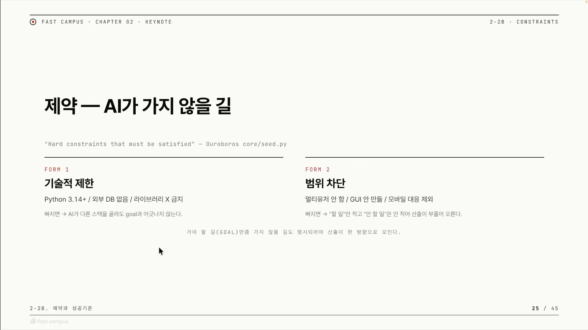
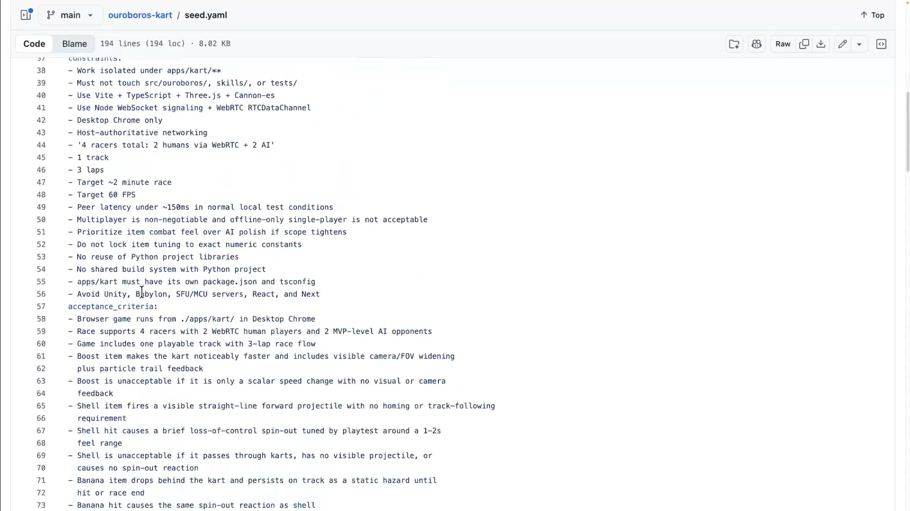
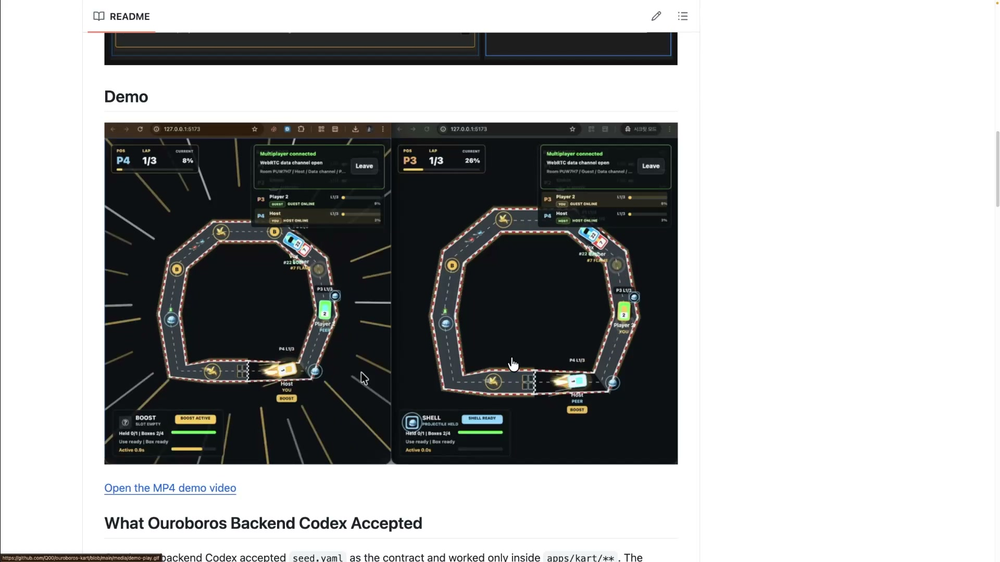
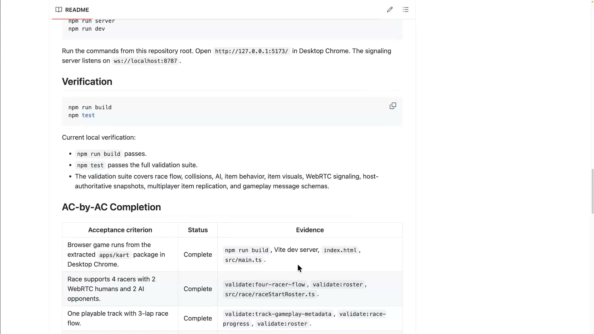
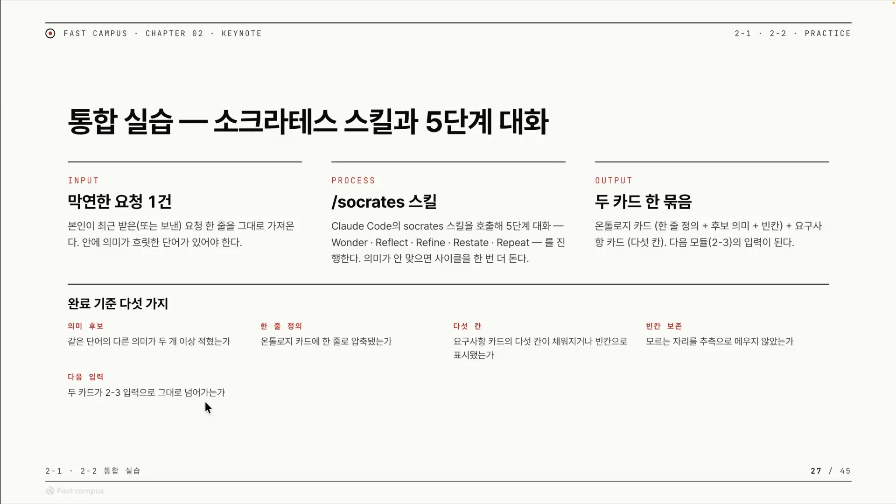
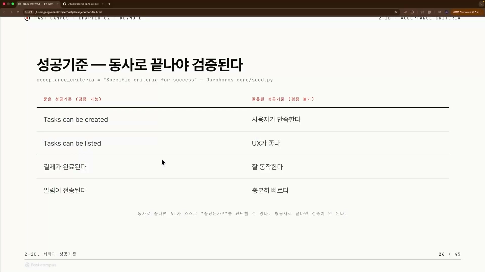

"마리오카트 게임을 만들어 줘." 이 한 줄을 AI 코딩 에이전트에게 던지면 무슨 일이 일어날까. 게임은 만들어진다. 문제는 어떤 게임이 만들어지는지를 내가 통제하지 못한다는 데 있다. 파이썬으로 만들길 바랐는데 Node.js로 나올 수 있고, 혼자 즐기는 게임을 원했는데 실시간 멀티플레이까지 붙어 나올 수 있다. 둘 다 "마리오카트 게임"이라는 목표(goal)는 만족한다. 그런데 내가 원한 건 아니다.

이게 목표만 주는 명세의 한계다. 목표는 절반의 명세에 지나지 않는다. 나머지 절반은 두 가지로 채워진다. 가지 말아야 할 길을 못 박는 제약(constraint), 그리고 도착했는지 판정하는 자(尺)인 성공 기준(acceptance criteria)이다. 이 글은 그 두 가지가 무엇이고, 왜 목표와 한 묶음으로 가야 하는지를 정리한다. 강연자가 만든 AI 코딩 하네스 오로보로스(Ouroboros)의 시드(seed) 파일과, 그것으로 실제 만든 마리오카트 데모가 내내 예시가 된다.

## 제약: AI가 가지 않을 길

제약은 "AI가 가서는 안 되는 길"을 미리 못 박는 것이다. 목표가 "도착지"라면 제약은 "이 길로는 가지 마"라고 세워둔 금지 표지판이다. 오로보로스 시드 안에서도 제약은 코드 주석으로 이렇게 정의돼 있다. `"Hard constraints that must be satisfied"`, 반드시 만족되어야 하는 하드 제약이라는 것이다.

왜 목표만으로는 안 되는가. 제약을 말하지 않으면 AI는 목표는 그대로 만족시키면서도 내가 원치 않은 방법을 고르기 때문이다. 회사 사정상 파이썬 3.14 이상으로만 만들어야 하는데 그 말을 빼면, AI는 Node.js와 TypeScript로 만들 수도 있고 고랭(Go)으로 만들 수도 있다. 외부 DB가 없어야 하는데 외부 DB를 쓸 수도 있고, 라이브러리를 쓰지 말라 했는데 라이브러리를 쓸 수도 있다. 이 결과물들도 "작동하는 앱"이라는 목표는 다 만족한다. 하지만 우리가 원한 건 아니어서 다시 만들어야 한다. 그래서 목표와 제약은 같이 가야 한다.

제약은 두 가지 형태로 나뉜다.



첫 번째는 **기술적 제한**이다. "이 기술, 이 환경 안에서만 만들어라"고 좁히는 것이다. 파이썬 3.14 이상, 외부 DB 없음, 라이브러리 금지 같은 조건들이 여기 든다. 이게 빠지면 AI가 엉뚱한 스택을 골라도 목표와는 어긋나지 않으니 거를 근거가 없다.

두 번째는 **범위 차단**(scope cut)이다. "이건 하지 마라, 여기까지만 해라"고 선을 긋는 것이다. 멀티유저 안 함, GUI 안 만듦, 모바일 대응 제외 같은 것들이다. 이게 빠지면 "할 일"만 적고 "안 할 일"은 안 적은 셈이 되어 산출이 부풀어 오른다. AI가 알아서 기능을 키운다.

여기서 요구사항을 보는 관점이 한 번 뒤집힌다. 우리는 보통 요구사항을 "해야 할 것"의 목록으로만 적는다. 그런데 강연자는 제약을 "금지 계약 사항, 금지 원칙"이라고 불렀다. 하지 말 것을 명시하는 일이 요구사항의 나머지 절반이라는 것이다. 가야 할 길만큼 가지 않을 길도 적혀야 산출이 한 방향으로 모인다.

## 범위 차단을 안 하면: 9시간짜리 마리오카트

범위 차단이 왜 중요한지는 강연자 본인의 실패담이 가장 잘 보여준다. 박진형(Sigrid Jin)과 엑스(X)에서 팟캐스트를 하던 중 마리오카트를 만들어야 하는 상황이 생겼다. 그런데 범위 차단을 제대로 하지 않았다. WebRTC(브라우저끼리 서버를 거의 거치지 않고 직접 데이터를 주고받는 기술)를 워낙 좋아한 나머지 멀티유저까지 욕심을 냈고, 범위를 한껏 키워버렸다. 결과는 9시간 동안 멈추지 않고 돌아간 끝에 실제로 만들어지긴 했다. 그리고 강연자는 후회했다. 멀티유저를 안 했다면 훨씬 빨리 끝났을 것이다.

이 9시간은 자랑이 아니라 반성 사례다. 데모부터 시작해 정말 필요한 기능을 만들어야 하는 상황에서, 무엇이 오버 엔지니어링이고 무엇이 아닌지는 결국 인간이 잡아줘야 한다. AI는 멀티유저를 넣지 말라고 하지 않으면 넣는다. "정말 원하는 게 뭔지"를 인간이 알고, 그걸 제약으로 줘야 한다.

그렇다면 이 제약도 결국 인터뷰에서 뽑아내 시드에 담아야 AI에게 정확히 넘길 수 있다. 목표뿐 아니라 제약과 성공 기준까지 인터뷰의 대상이 된다는 뜻이다.

## 시드 안에서 본 제약과 성공 기준

추상적인 원칙이 실제 명세 파일에서는 어떤 모습인지, 오로보로스 카트의 `seed.yaml`이 보여준다.



제약 섹션에는 두 형태가 섞여 있다.

```yaml
constraints:
  - Work isolated under apps/kart/**
  - Must not touch src/ouroboros/, skills/, or tests/
  - Use Vite + TypeScript + Three.js + Cannon-es
  - Desktop Chrome only
  - Multiplayer is non-negotiable and offline-only single-player is not acceptable
  - Prioritize item combat feel over AI polish if scope tightens
  - No reuse of Python project libraries
  - Avoid Unity, Babylon, SFU/MCU servers, React, and Next
```

`Use Vite + TypeScript + Three.js`는 기술 스택을 못 박은 기술적 제한이다. `Avoid Unity, Babylon … React, and Next`, `Must not touch …`, `No reuse …`는 "가지 않을 길"을 명시적으로 적은 범위 차단이다. 흥미로운 건 `Prioritize item combat feel over AI polish if scope tightens` 한 줄인데, 범위가 빡빡해지면 무엇을 양보할지 미리 정해둔 우선순위형 제약이다. 반드시 지켜야 하는 하드 제약과 달리, 상충하면 양보 가능한 소프트 제약이 함께 들어 있는 것이다.

성공 기준 섹션은 한층 더 정교하다.

```yaml
acceptance_criteria:
  - Browser game runs from ./apps/kart/ in Desktop Chrome
  - Race supports 4 racers with 2 WebRTC human players and 2 MVP-level AI opponents
  - Boost item makes the kart noticeably faster and includes visible camera/FOV widening plus particle trail feedback
  - Boost is unacceptable if it is only a scalar speed change with no visual or camera feedback
  - Shell item fires a visible straight-line forward projectile with no homing or track-following requirement
  - Shell is unacceptable if it passes through karts, has no visible projectile, or causes no spin-out reaction
```

모든 줄이 `runs`, `supports`, `makes`, `fires`처럼 동사로 끝나 "됐다, 안 됐다"를 기계적으로 확인할 수 있다. 여기서 한 발 더 나아간 것이 `X is unacceptable if …` 패턴이다. 부스트가 화면 효과 없이 속도 수치만 바뀌면 실패로 친다, 셸이 카트를 그냥 통과하거나 스핀아웃을 일으키지 못하면 실패로 친다. "성공"만 정의하는 게 아니라 "이건 실패다"까지 못 박아 검증의 빈틈을 막은 것이다.

## 성공 기준: 동사로 끝나야 검증된다

성공 기준의 핵심 규칙은 단 하나다. 동사로 끝나야 검증된다. 시드 안에서 성공 기준은 `"Specific criteria for success"`, 성공을 가르는 구체적 기준으로 정의돼 있다.

왜 하필 동사인가. AI가 스스로 "끝났는가?"를 판단할 수 있어야 하기 때문이다. 그러려면 성공 기준이 참인지 거짓인지 판정 가능한 동작이어야 한다. "X가 ~된다, ~한다"처럼 동사로 끝나면 됐는지 안 됐는지 확인할 수 있어 검증 가능(verifiable)하다. 반대로 "잘", "좋다", "빠르다"처럼 형용사로 끝나면 그 기준이 사람마다 달라 AI가 판정할 수 없다.

| 검증 가능한 성공 기준 | 검증 불가능한 성공 기준 |
| --------------------- | ----------------------- |
| Tasks can be created  | 사용자가 만족한다       |
| Tasks can be listed   | UX가 좋다               |
| 결제가 완료된다       | 잘 동작한다             |
| 알림이 전송된다       | 충분히 빠르다           |

왼쪽은 됐다, 안 됐다가 명확하다. 오른쪽은 "잘", "만족", "충분히"의 기준이 사람과 상황마다 갈려서 AI 입장에선 완료 여부를 정할 수 없다. AI는 "잘"이 무슨 뜻인지 모른다. 이렇게 판정이 갈리는 기준은 비결정적(non-deterministic)이고 검증 불가능(non-verifiable)해진다. "사용자가 만족한다"는 성공 기준으로 절대 쓸 수 없다.

동사로 끝나야 한다는 규칙에는 한 가지가 더 따라붙는다. 빠진 정보를 채우는 일이다. "알림이 전송된다"는 동사로 끝났지만 누가, 누구에게, 언제 보내는지가 빠져 여전히 모호하다. 여기에 주체와 대상과 시점을 채워 "오후 5시에 전체 유저에게 알림이 전송된다"가 되면, AI는 이 기준을 받아 기술적으로 풀어낼 수 있다.

## 모호함 0.2: 어디까지 인간이 정할 것인가

그렇다면 모든 빈칸을 인간이 다 채워야 할까. 강연자의 답은 "아니다"다. 그는 오로보로스에서 모호함의 임계값을 0.2로 설정해 두었다.

이게 무슨 뜻이냐면, 요구사항의 모든 빈칸을 인간이 메우려 하지 말고 어느 선까지만 채우자는 분업 기준이다. 기술적으로 모호한 것 중에는 굳이 인간이 몰라도 되는 것이 있다. 요즘 AI는 코딩을 (강연자 본인보다) 훨씬 잘하므로, 이미 추상화된 기술 디테일은 AI에게 맡기고 안으로 파고들 이유가 없다는 것이다.

"오후 5시에 전체 유저에게 알림이 전송된다"를 다시 보자. 인간이 정해야 할 것은 비즈니스 의도다. 언제 보낼지(오후 5시), 누구에게 보낼지(전체 유저). 반면 그 많은 유저에게 보낼 때 부하를 감당하는 로직 같은 것은 AI가 알아서 기술적으로 풀어내면 된다. 다만 5분을 기다리며 느리게 동작하는 건 누구도 원치 않으니, 그 정도의 품질 의도는 성공 기준으로 전달해야 한다.

왜 0이 아니라 0.2인가. 강연자는 모호함을 0까지 내리고 싶지 않았다. 그것까지 다 보면 인간이 굉장히 피로해지기 때문이다. 0은 모든 빈칸을 인간이 채운 완벽한 명세다. 이론상으로는 완벽하지만 인간이 지쳐 현실에선 지속되지 않는다. 0.2는 핵심 의도만 인간이 못 박고, 기술적으로 자명하거나 AI가 더 잘하는 부분은 모호한 채로 남겨 AI에 위임하는 선이다.

"명세는 자세할수록 좋다"는 통념이 여기서 깨진다. 과잉 명세도 비용이다. 인간의 인지 자원은 유한하므로 "어디까지 정할지"를 정하는 것 자체가 설계의 일부가 된다. 모호함 임계값은 하네스(AI 에이전트를 감싸 입력을 다듬고 출력을 검증하는 틀)가 "이 빈칸은 인간에게 물어볼까, AI에 맡길까"를 가르는 손잡이인 셈이다.

## 오로보로스 카트: 시드가 검증으로 되돌아온다

제약과 성공 기준, 모호함의 분업까지 갖춘 시드를 AI에 넘기면 무슨 일이 벌어지는가. 오로보로스 카트가 그 답이다. 인터뷰를 끝낸 뒤 `ooo run` 한 번의 실행으로 마리오카트가 만들어졌다. 저장소 설명문이 그대로 적고 있다. _"just one shot with ooo run, it takes about 9 hours, make a racing game that completely works well."_ 여기서 "원샷(one-shot)"은 한 번의 실행이라는 뜻이지 빠르다는 뜻이 아니다. 실제로 약 9시간이 걸렸다.



한 번의 실행으로 나온 것이 작지 않다. 두 브라우저 창이 같은 레이스를 렌더하는 WebRTC 실시간 멀티플레이, 트랙과 맵, 아이템 충돌 로직과 네트워크 충돌 로직, 바나나의 동작과 부스터와 투사체 발사까지. 시그널링 서버부터 프론트엔드의 물리, AI 주행, 렌더까지 한 덩어리로 만들어졌다. 이 규모가 바로 "9시간"의 정체이고, 범위를 키운 대가다. 동시에 시드의 제약과 성공 기준이 정교하면 이만한 것도 한 번에 나온다는 증거이기도 하다.

오로보로스라는 이름은 자기 꼬리를 무는 뱀을 뜻한다. 이름값을 하는 지점이 검증이다. 시드에 적어둔 성공 기준이 그대로 검증으로 되돌아온다.



성공 기준 한 줄마다 통과했는지(Status)와 무엇으로 그걸 확인했는지(Evidence)가 표로 붙는다. "Race supports 4 racers with 2 WebRTC humans and 2 AI opponents"라는 동사형 기준에는 `validate:four-racer-flow`, `validate:roster` 같은 검증 스크립트가 1:1로 매달린다. 동사로 끝나야 AI가 스스로 끝났는지 판단한다는 원칙이, 여기서 검증 스크립트로 자동화된 형태로 완성된다. 만약 성공 기준이 "잘 동작한다"였다면 이 표의 Evidence 칸을 채울 방법이 없다.

## 다음: 막연한 요청에서 두 카드 뽑기

지금까지 목표, 제약, 성공 기준 세 가지를 봤다. 남은 질문은 이것들을 실제로 어떻게 AI에게 넘길 인터뷰 결과물로 뽑아내느냐다.



다음 클립의 실습이 그 작업이다. 의미가 흐릿한 단어가 든 막연한 요청 한 줄을 입력으로 삼아, Claude Code의 `socrates` 스킬을 호출해 다섯 단계 대화(Wonder, Reflect, Refine, Restate, Repeat)를 돌린다. 의미가 안 맞으면 사이클을 한 번 더 돈다. 그 출력이 두 장의 카드다. 흐릿한 단어를 한 줄 정의와 의미 후보로 정리한 온톨로지 카드, 그리고 다섯 칸짜리 요구사항 카드. 이 두 카드가 다음 모듈의 입력이 된다.

실습이 끝났다고 인정하는 완료 기준 다섯 가지 중 가장 곱씹을 만한 것은 "빈칸 보존"이다. 모르는 자리를 추측으로 메우지 않았는가. 이건 이 강의 전체를 관통하는 윤리다. 모호함 0.2가 채우지 않을 여백을 의도적으로 남기는 일이라면, 빈칸 보존은 모르는 것을 아는 척 채우지 않겠다는 정직함이다. 목표만으로는 부족하다는 데서 출발해, 제약과 성공 기준으로 길을 좁히고, 끝에 가서는 "어디까지는 비워둔다"로 돌아온다. 좋은 명세는 다 채운 명세가 아니라, 무엇을 정하고 무엇을 비울지 아는 명세다.

## 외우고 넘어갈 핵심

### 목표는 절반이다

목표만 주면 AI는 그 목표는 채우면서도 내가 원치 않은 방법을 고른다. 명세는 세 조각이 모여야 완성된다.

> 완성된 명세 = 가야 할 길(목표) + 가지 않을 길(제약) + 도착 판정(성공 기준)

### 제약: AI가 가지 않을 길

제약은 두 형태로 나뉜다.


- 기술적 제한: 어떤 기술과 환경 안에서만 만들게 묶는 것이다(파이썬 3.14 이상, 외부 DB 없음). 이게 없으면 AI가 엉뚱한 스택을 골라도 목표는 맞으니 거를 근거가 없다.
- 범위 차단: 여기까지만 하고 이건 하지 말라고 선을 긋는 것이다(멀티유저 안 함, GUI 안 만듦). 이게 없으면 "할 일"만 적힌 셈이라 산출이 알아서 부풀어 오른다.

### 성공 기준: 동사로 끝나야 검증된다

동사로 끝나면 됐는지 안 됐는지 확인할 수 있고, 형용사로 끝나면 기준이 사람마다 갈려 AI가 판정하지 못한다.



"결제가 완료된다", "알림이 전송된다"는 검증되고, "잘 동작한다", "충분히 빠르다"는 검증되지 않는다. 동사 뒤에 빠진 주체와 시점을 채우면("오후 5시에 전체 유저에게 알림이 전송된다") 한층 단단해진다.

### 모호함은 0이 아니라 0.2

빈칸을 전부 인간이 채우려 들지 않는다. 무엇을 인간이 정하고 무엇을 AI에 맡길지 가르는 선이다.

- 인간이 정한다: 비즈니스 의도. 언제, 누구에게 보내는지 같은 것.
- AI에 맡긴다: 이미 추상화된 기술 디테일. 많은 유저에게 보낼 때 부하를 감당하는 로직 같은 것.

0까지 내리면 명세는 완벽해지지만 인간이 지쳐 현실에선 지속되지 않으니, 핵심만 정하고 0.2만큼은 비워 둔다.

### 빈칸 보존

> 모르는 자리를 추측으로 메우지 않는다. 모호함 0.2가 채우지 않을 여백을 남기는 일이라면, 빈칸 보존은 모르면 비워 두는 정직함이다.
