"모바일 게임 하나 만들어줘."

이 한 줄을 AI 에이전트에게 던지면 무슨 일이 벌어질까. 십중팔구 엉뚱한 결과가 나온다. 퍼즐 게임인지 액션 게임인지, 혼자 즐길 토이 프로젝트인지 돈을 벌 사업인지, 무엇을 만들면 "다 됐다"고 할 수 있는지 아무것도 정해져 있지 않기 때문이다. 사람끼리라면 되묻고 조율하며 빈칸을 메우겠지만, 에이전트는 그 막연함을 그대로 받아 자기 멋대로 채워버린다.

그래서 이 막연한 한 줄을 에이전트가 받아먹을 수 있는 구조로 먼저 바꿔야 한다. 강의에서는 이 구조화된 요구사항을 시드(seed)라 부른다. 시드는 세 칸으로 이뤄진다.

- goal (목표): 무엇을 이루려는가, 한 줄로
- constraint (제약): 무엇을 하면 안 되는가, 어떤 범위를 차단하는가
- acceptance criteria (성공 기준): 무엇이 충족되면 성공인가, 검증 가능한 형태로

강의자의 말을 빌리면, "모바일 게임 만들어줘" 같은 한 줄만으로는 안 되고 성공 기준(Acceptance Criteria)과 제약 조건(Constraint)까지 함께 갖춰져야만 AI 에이전트에게 넘겨줄 수 있다. 일을 위임하려면 위임받을 쪽이 읽을 수 있는 입력 포맷이 있어야 하니, 시드는 그 입력 포맷이다.

이 글은 그 시드를 사람이 손으로 채우는 게 아니라, AI와 질문을 주고받으며 자동으로 캐내는 도구 하나를 만들어가는 과정이다. 강의자는 그 도구를 소크라테스 스킬이라 부른다. 막연한 한 줄을 받아 질문을 던지고, 답을 들으며 세 칸을 채우고, 다 채워질 때까지 그 과정을 반복하는 인터뷰 도구다. 만드는 순서를 따라가다 보면 자연스럽게 그 안에 깔린 부품들, 즉 랄프 루프와 시드 게이트, 소크라테스 4단계가 하나씩 드러난다.

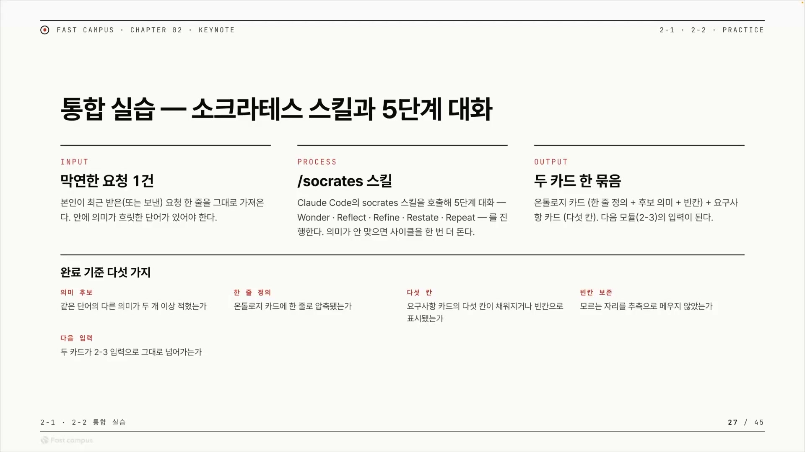

## 랄프 루프: while true로 LLM을 계속 부른다

소크라테스 스킬을 떠받치는 첫 번째 부품은 랄프(Ralph) 루프다. 강의자가 내린 정의는 군더더기가 없다.

> "랄프라는 게 결국에 while true 기반으로 계속 lrm을 콜해서, to do 리스트에 있던 이 queue 리스트를 길이가 0까지 돌리는 게 보통 랄프라고 보시면 되는데."

풀어 쓰면 이렇다. 무한 루프(`while true`) 안에서 LLM을 계속 호출하고, 처리할 일 목록(to-do)의 길이가 0이 될 때까지 돈다. 이 강의에서는 to-do가 0이 되는 시점이 곧 시드 세 칸이 다 채워지는 순간이다.

랄프는 정의는 하나지만 구현은 여럿이다. 강의자는 곧바로 "랄프의 구현은 굉장히 다양하게 진행이 될 수 있습니다"라고 덧붙인다. 크게 두 갈래다.

- 코드로 동작: 실제 프로그램의 `while true` 루프로 돌린다.
- 스킬로 동작: 별도 프로그램 없이, 마크다운으로 쓴 스킬(SKILL.md) 안에 루프 규칙을 적어 모델이 그 규칙을 읽고 반복하게 한다.

이번 실습은 후자를 택한다. "오늘은 간단하게 스킬 안에서 랄프를 진행을 해보려고 하고요." 코드를 짜는 대신, 모델이 읽고 따를 규칙을 스킬에 적어두는 방식이다. 강의자는 스킬만으로 돌리는 이 버전이 끝이 아님을 분명히 한다. 더 나아가려면 "훅을 이용하든지 코드를 이용해서 절대 끝나지 않을 수 있게끔 만드는 게 필요"하다고 말한다. 스킬만으로는 모델이 루프를 도중에 멈출 여지가 있으니, 종료 조건을 만족할 때까지 루프가 확실히 돌도록 강제하는 결정론적 장치가 다음 단계라는 뜻이다.

무한 루프인 이상 핵심은 무엇으로 멈추느냐다. 강의자는 종료 조건 두 개를 건다. 시드 게이트를 통과하면 정상 종료, 사이클이 5를 넘으면 빈 채로 안전 종료. 이 두 조건은 곧이어 시드 게이트에서 자세히 본다.

## 시드 게이트: 세 칸이 다 찼는지 묻는 마름모

시드 게이트(Seed Gate)는 한 사이클이 끝날 때마다 시드가 제대로 채워졌는지 점검하는 칸이다. 강의자의 말로는 "사이클이 끝날 때마다 시드 게이트 점검을 한다, 골이 있는지, 제약이 있는지, 성공 기준이 있는지 그런 것들을 체크한다." 즉 시드 게이트가 보는 건 시드의 세 칸 그대로다.

각 칸이 "채워졌다"고 인정받는 기준도 강의자가 템플릿을 읽으며 못 박는다.

| 칸                  | 채움 기준                                 |
| ------------------- | ----------------------------------------- |
| goal                | Restate된 한 줄이 있다                    |
| constraint          | 차단이나 제한이 한 개 이상 있다           |
| acceptance criteria | 동사로 끝나는 검증 기준이 한 개 이상 있다 |

acceptance criteria가 "동사로 끝나는" 형태여야 한다는 점이 눈에 띈다. "사용성이 좋다" 같은 모호한 상태가 아니라 "매월 매출을 측정한다"처럼 행동으로 검증할 수 있는 문장이어야 한다는 뜻이다.

시드 게이트는 단순 점검 칸이면서 동시에 루프의 종료 조건이다. 강의자는 다이어그램에서 이걸 마름모로 그린다. "마름모가 이제 yes or no를 할 수 있는 필터이기 때문에." 세 칸이 다 차서 게이트를 통과하면(yes) 곧장 리턴하고 루프가 끝난다. 한 칸이라도 비면(no) 다음 사이클로 흐른다. 강의자가 정리한 그대로다. "seed gate는 goal과 constraint, acceptance criteria가 잘 들어가 있는지도 체크합니다. 한 칸이라도 비어서 다음 사이클로 넘어가게 되죠."

여기에 안전장치가 하나 더 붙는다. 게이트를 통과하지 못한 경우, 무한히 돌지 않도록 사이클 상한선을 둔다. "최대 다섯 사이클이죠. cycle이 5보다 넘으면 여기도 empty로 명시한다니까 return empty라고 해보겠습니다." 다섯 바퀴를 돌고도 칸이 안 차면 빈 채로 끝낸다. 종료 경로가 둘인 셈이다.

- 통과 종료: 세 칸이 다 차면 채워진 시드를 반환한다.
- 안전 종료: 사이클이 5를 넘으면 빈 값으로 반환하고 멈춘다.

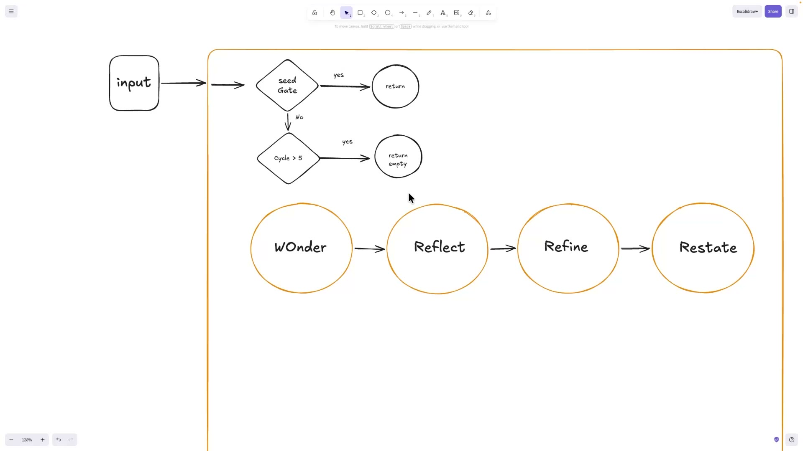

## 소크라테스 4단계: Wonder, Reflect, Refine, Restate

랄프 루프가 한 바퀴 돌 때 그 안에서 실제로 일하는 것이 소크라테스의 네 단계다. wonder, reflect, refine, restate. 이 넷은 각각 독립된 서브 스킬이고, 소크라테스 스킬은 이들을 사람이 손으로 네 번 호출하고 결과를 묶는 대신 자동으로 묶어 돌리는 오케스트레이터다. 강의자는 이 실습의 본질을 "스킬 4개를 오케스트레이션 하는 것"이라고 표현한다. "사람이 4번 호출하고서 결과를 손으로 이렇게 묶어버릴 수 있는데, 너무 귀찮죠. 번거롭고 실수도 있을 수 있고요."

**wonder**: 인간의 암묵지를 캐낸다. 진입점은 사람이 던진 한 줄짜리 요청이다. 이 입력을 받아 wonder는 "한 겹 더 캐겠다"며 사람이 말하지 않은 속내를 파고든다. 강의자의 말로는 "이 원더에서는 인간의 암묵지를 뽑아 냅니다. 단어에 대한 정의를 여러 관점으로." 같은 단어를 여러 관점(A, B, C)으로 펼쳐 보이는 단계다.

**reflect**: 관점들로 합치를 이뤄 Shared Ontology를 만든다. "공통점, 차이점 이 두 개를 기반으로 AI와 인간의 공통점 차이점을 뽑고, 그걸 기반으로 어떻게 우리가 하나로 만들지, Shared Ontology죠." wonder가 펼친 관점들에서 AI와 사람의 생각이 어디서 만나고 어디서 갈리는지를 추려, 하나로 합친 결과다.

**refine**: 빈칸 갭을 찾아 Shared Meaning 후보를 만들고 동의를 묻는다. 합쳐진 결과에서 아직 비어 있는 곳을 찾아내 "이런 뜻이 맞나요?" 하고 후보 문장으로 확인을 받는다.

**restate**: 이해한 걸 다시 말하고, 합의된 의미를 goal 한 줄로 붙인다. "이해한 걸 AI가 다시 얘기합니다." 그리고 "shared meaning을 골 한 줄로 붙여서 이 시드의 첫 번째 골을 붙여본다." 지금까지 캐낸 것을 시드의 goal 칸에 압축해 넣는 단계다.

| 단계    | 입력                             | 하는 일                                       | 산출                |
| ------- | -------------------------------- | --------------------------------------------- | ------------------- |
| wonder  | 한 줄 요청 (+직전 사이클의 빈칸) | 암묵지를 캐 단어 정의를 여러 관점으로 펼침    | 관점 A / B / C      |
| reflect | wonder의 관점들                  | AI와 인간의 공통점, 차이점을 추려 하나로 합침 | Shared Ontology     |
| refine  | 합쳐진 결과                      | 빈칸을 찾아 의미 후보를 만들고 동의를 물음    | Shared Meaning 후보 |
| restate | 합의된 의미                      | 다시 말해 확인하고 한 줄로 압축               | 시드의 goal 한 줄   |

여기서 강의자가 짚는 가장 중요한 관점은 층위 구분이다.

> "이 전체 소크라테스라는 스킬은 사실 저 밑에 랄프가 아니죠. 소크라테스란 스킬은 이 전체를 돌리는 랄프입니다."

다이어그램 한구석에 작게 그려진 루프(restate에서 이해가 덜 됐으면 다시 wonder로 돌아가는 화살표)가 랄프인 게 아니다. wonder→reflect→refine→restate 네 단계를 하나의 사이클로 묶어, 시드 게이트가 통과될 때까지 그 사이클 전체를 반복 호출하는 바깥 루프 자체가 소크라테스 스킬이다. 한 사이클이 끝나면 다시 시드 게이트로 돌아오고, 게이트가 막으면 다음 사이클이 또 돈다. 호출 구조도 단순하다. "스킬의 본부(본문)는 다시 적지 않고 호출만 한다." 소크라테스 스킬 안에 네 단계를 베껴 넣는 게 아니라, 네 개의 별도 스킬을 차례로 부르기만 한다.

## 코드 대신 수도코드, 그리고 그림

부품이 다 모였으니 이제 스킬을 만들 차례다. 그런데 강의자는 프로덕션 코드를 짜지 않는다. 대신 스킬 안에 수도코드를 직접 써넣는다. "여기다가 가볍게 AI가 잘 이해하는 게 수도코드거든요." 강의자가 화면에서 타이핑하며 말로 풀어낸 골격은 이렇다.

```python
while true:
    # 시드 게이트: 세 칸이 끝났는지 점검
    SeedGate = goal_done and constraint_done and acceptance_criteria_done

    if not SeedGate:
        # 게이트 미통과면 멈춘다(진행하지 않는다)
        # 단, 최대 5사이클, 넘으면 빈 값으로 반환
        if cycle > 5:
            return empty

    # 네 단계를 함수 부르듯 호출한다
    wonder()
    reflect()
    refine()
    restate()
    # 끝나면 다시 시드 게이트로
```

"코드를 우리가 이제 프로덕 코드를 읽지 않아도 되는데, 이런 식으로 가볍게 수도 코드를 써서 스킬을 이해시키는 것은 굉장히 효율적입니다." 왜 이게 통하는지를 강의자는 스킬의 정체로 설명한다. "스킬이라는 게 이제 결국 자연(어)으로 돼 있잖아요. 모델이 인터프리터로서 이 스킬을 이해하게 되는데." 스킬은 결국 자연어로 쓴 글이고, 모델이 그 글을 해석해 실행하는 인터프리터다. 그러니 수도코드로 또박또박 써주면 모델이 그걸 완전하게 이해한다는 것이다.

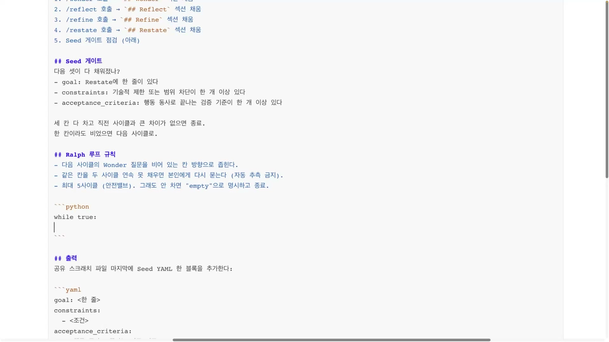

수도코드를 한 번 쓴 뒤, 강의자는 곧장 코드로 가지 않고 멈춰 그림을 그린다. "이렇게 하네스 엔지니어링이라는 것은 테이블 세터가 진행을 해주는 게 제일 좋습니다." 본문을 줄줄 쓰기 전에, 상을 차리듯 전체 구조를 먼저 잡으라는 것이다. 왜 굳이 그림인가. 이유는 인지 부하다. "스킬이 아무리 읽기 좋은 마크다운이더라도 2000줄이 넘어가면 사실 읽을 수 없죠. 지금 한 1994줄 정도 있었던 것 같은데." 마크다운이 아무리 깔끔해도 2000줄을 사람이 끝까지 읽어 머릿속에 구조를 세우는 건 불가능하다. 강의자는 전에 "개리 탄의 오피스 아워"라는 긴 글을 구조를 잡아 보여준 적이 있는데, 그 구조가 없었다면 그 글을 다 읽을 수 없었을 거라고 회상한다.

그래서 캔버스에 그림을 쌓아 올린다. 먼저 스킬 박스 안에 Wonder, Reflect, Refine, Restate 네 원을 나란히 그린다.

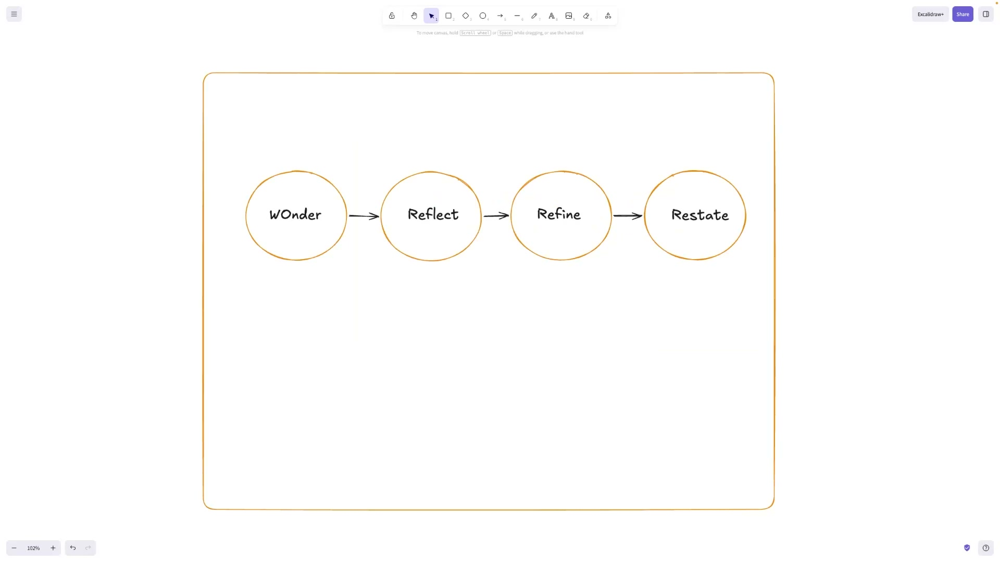

그 앞에 사람의 입력 박스를 붙이고, 입력과 첫 Wonder 사이에 시드 게이트를 마름모로 그려 넣는다. 마름모는 그림 위에서 예/아니오로 길을 가르는 약속, 즉 코드의 `if` 분기를 그림 언어로 옮긴 것이다. 게이트를 통과하면 yes 가지로 빠져 return, 통과하지 못하면 no 가지로 내려가는데, 그 아래에 두 번째 마름모 `Cycle > 5`를 두어 사이클이 5를 넘으면 return empty, 그게 아니면 비로소 Wonder로 들어가게 한다. 캔버스 하단에는 wonder가 캐낸 human tacit knowledge가 관점 A·B·C로 갈라지고, 공통점·차이점을 거쳐 shared ontology로 합쳐지는 흐름까지 그려 넣는다.

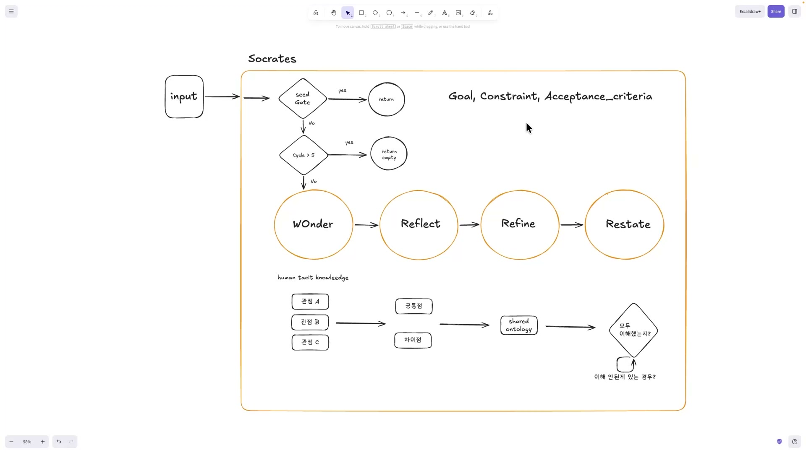

이렇게 그린 그림을 캡처해 실습 자료와 함께 AI(Claude Code)에 던지고 "그림과 같은 (랄프) 루프를 돌릴 수 있게 스킬을 만들어 달라"고 요청한다. 그러자 AI는 컨텍스트를 읽고 네 개의 하위 스킬을 확인한 뒤 이들을 묶는 오케스트레이터, 즉 소크라테스 SKILL.md를 만들어준다. 강의자가 여기서 던지는 메시지가 핵심이다.

> "그래서 사실 이런 스킬들은 이제는 인간이 만들 필요가 없다라는 거죠. 우리는 간단하게 구조를 짜주고, 그걸 기반으로 스스로 스킬 오케스트레이터라든지 스킬 크리에이터 이런 스킬들을 부르면서 스스로 스킬을 만들 수 있게 해주는 게 제일 좋습니다."

사람의 역할이 "스킬을 직접 쓰는 사람"에서 "구조를 짜주는 사람"으로 옮겨간 것이다. 그리고 같은 구조도는 AI를 향해서만이 아니라 다른 사람에게 스킬을 설명할 때도 똑같이 도구가 된다고 강의자는 덧붙인다. "이 스킬을 다른 인간들에게 설명할 때에도 제일 좋아요."

AI가 다시 그려준 결과를 보고 강의자는 만족한다. 자기가 "개떡같이" 쓴 거친 수도코드를 모델이 의도까지 이해해 더 정돈된 파이썬 의사코드로 다듬어준 것이다. 특히 `narrow to empty slot`이라는 표현을 보고 "굉장히 섹시한 구현"이라며 흡족해한다.

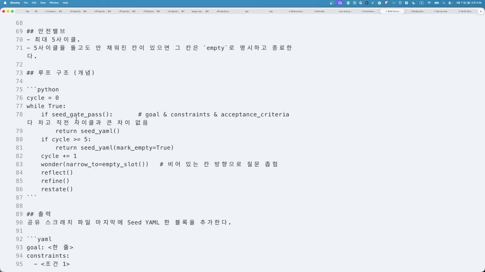

## 토큰 효율과 RLM: 곁가지지만 같은 줄기

`narrow to empty slot`이 왜 좋은 구현인지는 토큰 효율과 닿아 있다. 루프가 매 사이클마다 세 칸을 전부 다시 검사하면, 한 바퀴 두 바퀴 돌 때마다 같은 검사를 반복하게 되어 토큰이 낭비된다. 그래서 다음 사이클의 wonder 질문을 "비어 있는 칸 방향으로 좁힌다." 이미 채운 칸은 건드리지 않고 아직 빈 칸만 겨냥하는 것이다. 강의자는 이걸 시대의 화두로 끌어올린다.

> "토큰 맥싱보다는 이 토큰을 어떻게 효율적으로 쓸 것이냐에 대해서 우리가 생각해야 될 시기가 왔거든요."

토큰이 너무 비싸지고 있으니, 같은 결과를 더 적은 토큰으로 내는 구조를 짜야 한다는 것이다. 이 흐름에서 강의자는 "재밌는 개념 하나"로 RLM(Recursive Language Model)을 소개한다. 큰 입력을 잘게 쪼개서, 비싼 프론티어 모델이 아니라 더 싼 모델에게 줄 수 있게 만드는 패러다임이다. 강의자는 이걸 "어떤 논문이 소개했다"는 수준으로만 언급한다.

그리고 자기가 직접 만들어봤다는 구현체를 보여준다. RLM-Forge다. 랜딩 페이지에 적힌 표현은 Hermes-Backed Recursive Runtime. 강의자가 짚은 구조는 이렇다. 긴 유저 입력을 우로보로스(Ouroboros)가 쪼개고, 헤르메스(Hermes)가 그 안에서 LLM 콜을 하며, 그 결과를 TraceGuard에 넘겨 결정론적으로 검증한다. 핵심은 비프론티어 모델로도 동작한다는 점이다. "클로드와 코덱스는 프론티어 모델을 돌릴 수 있는 하네스"인데, "거기서 GLM까지 끼면서 프론티어 모델이 아니더라도 잘 동작할 수 있게끔 트레이스 가드를 두고 라이프를 돌리는 형태를 구축"했다는 것이다. 싼 모델을 끼워도 TraceGuard의 결정론적 검증 덕에 결과가 무너지지 않게 한 것이다. 앞의 RLM 동기와 같은 줄기다.

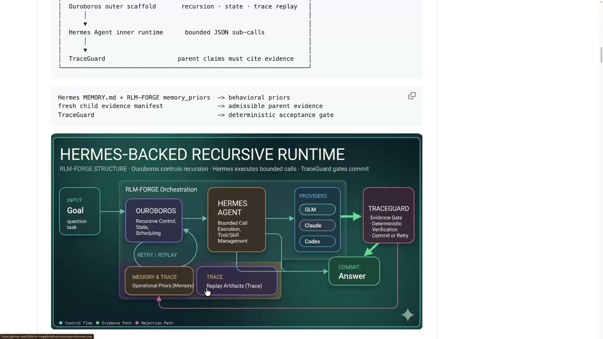

## 한 줄에서 시드까지: 모바일 게임 데모

스킬이 완성됐으니 실제로 돌려본다. 강의자는 소크라테스 스킬에 한 줄을 적어 넣는다. `/socrates 모바일 퍼즐 게임을 만들고싶어`. 소크라테스가 작동하자 가장 먼저 시드 게이트를 점검한다. 시드가 비어 있으니 게이트 미통과, 사이클은 5 미만, 따라서 Wonder가 실행된다.

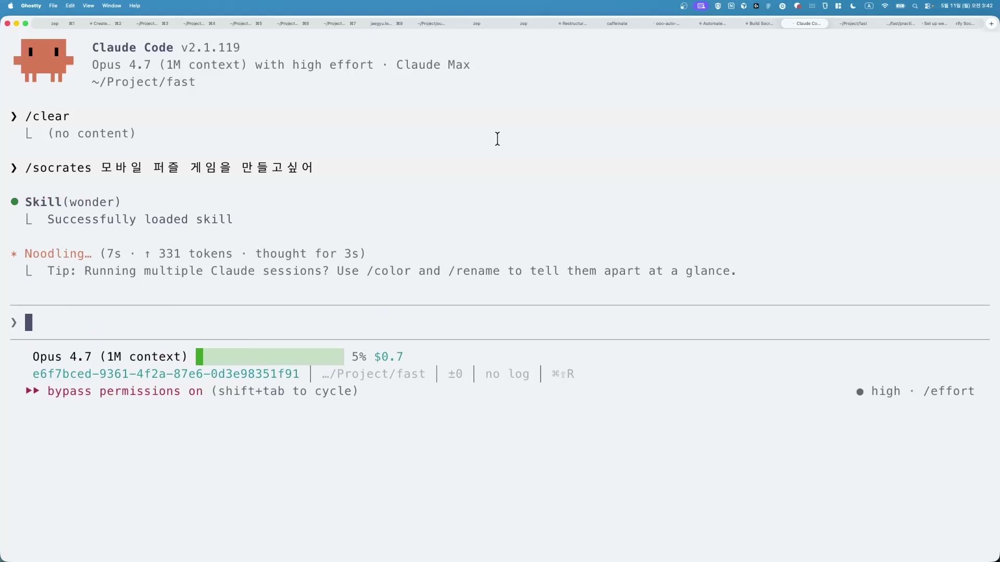

**사이클 1, goal 한 칸 채우기.** Wonder가 "한 겹 더 캐겠다"며 질문을 던진다. "가장 끌리는 부분은 어디입니까"라는 물음에 강의자는 '수익을 만든다'를 고른다. 이어 그 갈래의 본질적 의미를 좁히고, "그 부수입이 본인에게 원하는 문항은 무엇입니까"라는 추가 질문에는 '자동화'를 고른다. 이 시점에 화면에서는 관점 A·B·C 파일이 만들어진다. 여기서 강의자는 부수 관찰 하나를 가볍게 짚는다. 모델은 Attention Window 기반이라 "모든 게 완전하게 똑같이 작성되지는 않는다", 그래도 "비슷한 방향으로 가고 있다."

이어 Reflect가 로드된다. 화면에 `Skill(reflect) Successfully loaded`가 뜨면서, 한 스킬이 다른 스킬을 부르는 구조가 실제로 동작하는 게 확인된다. Reflect는 강의자와 모델의 생각을 맞대본다. 선택지 메뉴에서 강의자는 객관식 대신 주관식으로 답해야 추론이 입맛대로 된다며, "일주일 정도마다 배포하고, 새로운 앱으로 배포하고, 4주마다 매출을 체크해서 매출이 나오는 서비스에 좀 더 투자"라는 자기 생각을 직접 적는다. 이 대목에서 차이가 드러난다. 모델은 "한 게임을 운영하며 월 매출"을 떠올렸는데 강의자는 "포트폴리오"를 떠올린 것이다.

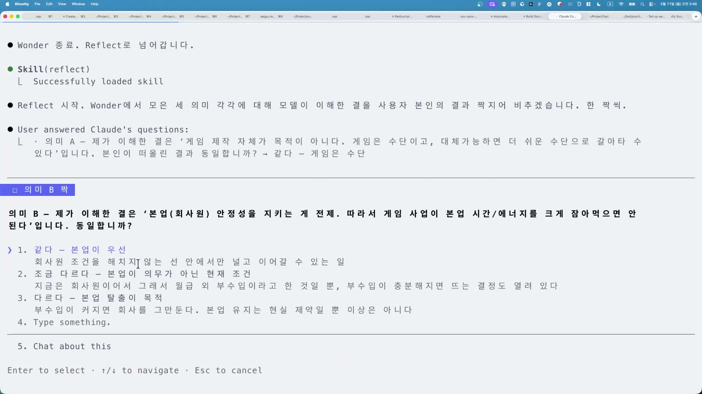

Refine이 시작되며 "SharedMeaning 후보를 만들어서 동의를 묻겠다"고 한다. 그 후보는 "본업을 유지한 채 1주 단위로 새 모바일 앱을 배포하고, 4주 단위로 매출을 체크해 매출이 나오는 것에만 자원을 추가 투입하는 식으로 단위 부업을 만든다." 이 내용은 `.claude/scratch/socrates.md`라는 파일에 저장된다. 강의자는 이 동작을 일반 원리로 끌어올린다. "이 하네스에서는 결국에 메인 컨텍스트를 벗어난 상태를 하나 만들어 두는 게 좋습니다. 그래야지만 다른 세션에서도 이 상태를 볼 수 있게 되는 거죠." 진행 상태를 대화 흐름 안에만 두지 말고 바깥 파일로 빼두라는 것이다. 그래야 지금 세션이 끝나도 다른 세션이 그 파일을 열어 이어받을 수 있다.

Restate가 이 shared meaning을 시드의 goal 한 줄로 붙인다. 그렇게 사이클 1이 닫히는데, 상태 파일에는 `Cycle 1 Seed: goal ✅ / constraints ❌ / acceptance_criteria ❌`가 찍힌다. goal 한 칸만 찼고 나머지 둘은 비었으니, 루프는 다음 사이클로 넘어간다.

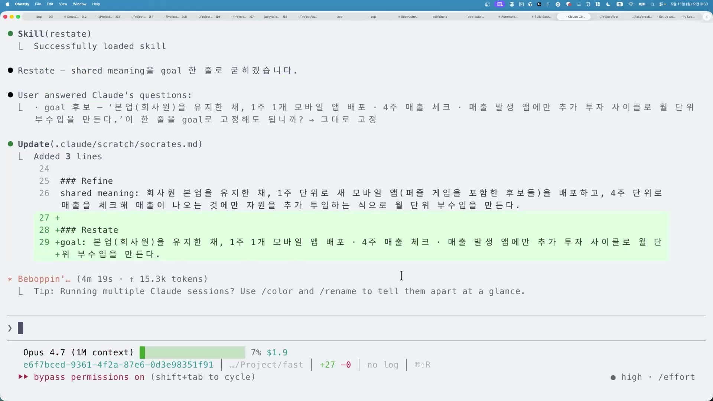

**사이클 2, constraint와 acceptance criteria 채우기.** 빈 칸이 있으니 Cycle 2의 Wonder가 다시 돈다. 다만 모든 걸 다시 묻지 않고 빈 칸 방향으로 좁혀, 이번엔 제약을 묻는다. 강의자는 '배포 일정 엄수' 쪽으로 2번과 4번을 고른다. 이어 acceptance criteria 방향으로 "지금 제대로 돌아가고 있다고 본인이 느끼는 신호는 무엇일까"를 묻는다. 이 대목에서 강의자가 구조 하나를 끌어낸다. 실패한 앱의 원인·특징을 사이클 끝에 기록해 다음 사이클의 판단 기준으로 삼는, "컴파운드 엔지니어링처럼 학습이 누적되는 구조"가 필요하다는 것이다. 장기 하네스라 "상태와 메모리를 잘 고도화"시켜야 한다고도 덧붙인다.

Reflect와 Refine을 거쳐 내용이 정리되면서 세 칸이 모두 찬다. 강의자는 마무리한다. "골이 완성됐고 컨스트레인이 있고 Acceptance Criteria가 있고, 이런 식으로 간단한 시드가 완성된 걸 볼 수 있었습니다." Seed 게이트가 통과되며 2사이클 만에 루프가 닫혔다. 5사이클 한도에 닿기 전에 정상 종료한 것이다.

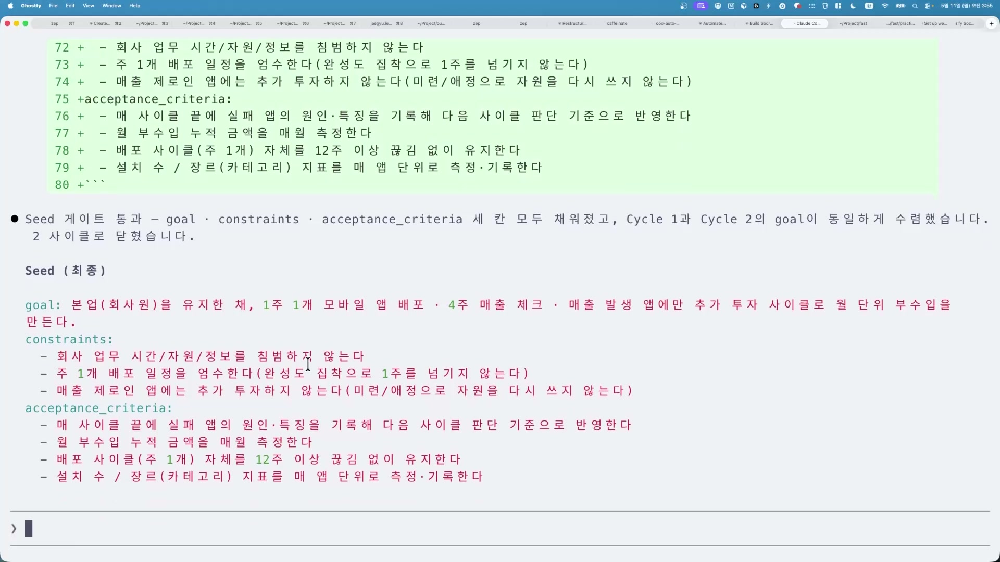

완성된 시드를 보면 처음의 막연한 한 줄이 무엇으로 바뀌었는지가 한눈에 들어온다. goal은 "본업(회사원)을 유지한 채, 1주 1개 모바일 앱 배포·4주 매출 체크·매출 발생 앱에만 추가 투자 사이클로 월 단위 부수입을 만든다"가 됐고, constraints에는 "회사 업무 시간·자원·정보를 침범하지 않는다", "주 1개 배포 일정을 엄수한다", "매출 제로인 앱에는 추가 투자하지 않는다"가, acceptance_criteria에는 "실패 앱의 원인·특징을 기록해 다음 사이클 판단 기준으로 반영한다", "월 부수입 누적 금액을 매월 측정한다" 같은 동사로 끝나는 항목들이 들어찼다.

강의자가 데모를 닫으며 던지는 결론이 이 글의 핵심이다.

> "모바일 (퍼즐) 게임을 만들어 줘라고 했을 때, 실제로 제 안에 숨겨져 있던 욕망, 그러니까 암묵지가 AI에게 타이핑이 된 걸 확인할 수 있습니다."

처음 쓴 건 정말 한 줄이었다. 그것이 사이클을 거치며 드러난 진짜 의도는 "퍼즐 게임을 완성하는 것"이 아니라 "1주 단위 배포와 4주 매출 체크로 굴리는 실험 모델"이었다. 강의자는 이 의도의 이동을 "핵심 이동"이라 부르고, 한 줄을 시드로 바꾸는 이 전 과정을 소크라테스식 변증법, 소크라테스식 reasoning이라 부른다.

## 비결정적 모델을 구조로 길들이기

데모를 두 번 돌려보면 같은 입력이라도 출력이 글자 단위로 똑같지는 않다. 강의자도 인정한다. "결국에 이 모델은 Attention Window 기반으로 답을 주기 때문에 모든 게 완전하게 똑같이 작성이 되지는 않습니다." 모델은 비결정적(Non-Deterministic)이다. 그런데 강의자가 곧바로 덧붙이는 게 중요하다. 그 다름이 제멋대로는 아니라는 것이다. "비슷하게 비슷한 방향으로 가고 있는 걸 확인할 수 있어요." 표면은 매번 다르지만 향하는 방향은 비슷하게 모인다.

이 다름 속의 비슷함을 만들어내는 것이 하네스다.

> "이런식으로 우리는 Deterministic한 구조를 통해서 모델의 Variant, Non Deterministic함에서도 비슷한 형태의 아이디어가 잘 깎이고 있는 것들을 확인할 수 있어요."

모델 자체의 비결정성을 없애는 게 아니라, 그 위에 결정론적 틀(하네스)을 씌워 출력을 한 방향으로 모은다는 발상이다. 정해진 형태의 질문 구조를 거치게 하면 매 사이클이 비슷한 꼴로 수렴한다. 강의자가 제시하는 도달점은 감각적이지만 분명하다. "우리가 이 정도까지는 예측 범위, 오차범위 안이라고 느낄 수 있을 만큼 하네스를 깎는 게 중요합니다." 하네스를 잘 다듬는다는 건 출력을 완전히 똑같게 만드는 게 아니라, '이 정도면 예측 가능한 오차 범위 안'이라고 느낄 만큼 흔들림을 줄이는 작업이다. 강의자가 '깎는다'는 말을 반복하는 이유가 여기 있다. 한 번에 완성하는 게 아니라 점점 다듬어 예측 가능성을 높여가는 과정이라는 것이다.

정리하면, 이번 실습은 막연한 한 줄을 받아 네 개의 스킬을 반복하는 랄프 루프로 goal·constraint·acceptance criteria 세 칸짜리 시드를 뽑아내는 인터뷰 하네스 하나를 만드는 데까지였다. 강의자는 다음 클립에서 이 인터뷰 하네스를 한층 더 정교하게 깎는 법을 다루겠다고 예고하며 마무리한다.

<!-- IMG 🎨 막연한 한 줄("모바일 게임 만들어줘")이 소크라테스 사이클을 거쳐 goal·constraint·acceptance criteria 세 칸짜리 시드로 구체화되는 before/after 대비를 한 장으로 보여주는 개념도 -->

## 외우고 넘어갈 핵심

이 클립의 흐름과 따로, 개념 자체로 들고 갈 만한 셋을 정리한다.

### 랄프(Ralph)와 랄프 루프

코딩 에이전트를 `while true` 루프에 넣고, 매 반복마다 같은 프롬프트를 다시 먹여 일이 끝날 때까지 돌리는 기법이다. Geoffrey Huntley가 2025년에 공개하고 이름 붙였는데, 심슨가족의 랄프 위검에서 따왔다. 어수룩하지만 될 때까지 같은 걸 끈질기게 반복하는 캐릭터라, 똑똑함이 아니라 끈질긴 반복이 핵심이라는 뜻을 이름에 담았다. 가장 순수한 형태는 한 줄짜리 bash다.

```bash
while :; do cat PROMPT.md | claude ; done
```

한 바퀴에서 실제로 벌어지는 일은 이렇다.

1. 루프가 에이전트를 **새 프로세스로** 띄우고 같은 프롬프트를 흘려넣는다.
2. 에이전트는 디스크의 현재 상태(소스 코드, git 이력, 진행 파일)를 읽는다. 직전 반복이 무슨 생각을 했는지에 대한 대화 기억은 하나도 없다.
3. 지금 가장 중요한 한 가지만 골라 구현하고, 테스트를 돌리고, git에 커밋한다.
4. 에이전트가 종료해 프로세스가 죽는다.
5. 루프가 즉시 다음 프로세스를 똑같은 프롬프트로 다시 시작한다(1번으로).

핵심은 **진행 상태가 LLM의 대화 기억이 아니라 파일과 git에 쌓인다**는 점이다. 매 반복이 빈 컨텍스트로 시작하니, 대화가 길어질수록 주의가 흩어지고 중요한 지시가 요약에 묻혀 사라지는 문제를 피한다. 막혔을 때도 실패한 시도의 찌꺼기 없이 깨끗하게 다시 시작한다. 이 강의의 소크라테스 스킬은 랄프를 코드가 아니라 스킬 안 수도코드로 돌린 버전이고, 할 일이 0이 되는 시점(시드 세 칸이 다 참)이 종료 신호다. 순수 bash 루프는 스스로 멈추지 않아 사람이 끊거나 반복과 비용에 상한을 걸어야 하고, 같은 걸 중복 구현하는 비결정성이 약점이라 만든 사람도 기존 코드베이스엔 쓰지 않고 신규 프로젝트를 빠르게 세울 때만 쓴다.


### 수도코드(pseudocode)

특정 프로그래밍 언어의 문법에 매이지 않고, 코드의 관습(대입, 조건, 반복)과 자연어를 섞어 알고리즘의 논리를 적은 것이다. 기계가 아니라 사람이 읽으라고 만든 표기라 실제로 실행되지는 않는다. 강의에서 스킬 안에 적은 `while true … if cycle > 5: return empty …`가 바로 수도코드다.

수도코드가 LLM에 잘 듣는 이유는 모호성에 있다. 자연어 지시는 본질적으로 흐릿한데, 수도코드는 순서, 분기, 반복 같은 제어 흐름을 코드 구조로 못박아 무엇을 어떤 순서로, 어떤 조건에서 갈라지고, 무엇을 반복하라를 또렷이 전한다. 요즘 모델이 코드로 많이 사전학습된 것도 한몫한다. 한 연구(Mishra 2023)에서는 자연어 프롬프트를 수도코드로 바꾸자 분류 정확도(F1)가 7\~16점, 생성 품질(ROUGE-L)이 12\~38% 올랐다.

언제 쓰면 좋은지는 강의가 보여준 한 경우보다 넓다.

- **스킬이나 프롬프트에 절차를 박을 때(강의의 경우).** 루프나 게이트 같은 로직을 수도코드로 적으면, 모델이 그 글을 인터프리터처럼 한 줄씩 따라 실행한다. 스킬은 결국 자연어로 쓴 글이고 모델이 그것을 해석해 돌리니, 또박또박 쓴 수도코드일수록 의도가 정확히 전달된다.
- **분기나 반복, 조건이 섞인 일을 시킬 때.** 순서와 IF, WHILE이 얽힌 절차를 자연어로만 적으면 어디까지가 한 묶음인지 범위가 흐려진다.
- **구조적 추론이나 분류, 검색, 알고리즘 과제.** 풀이 단계 자체를 순서와 분기, 반복 구조로 짜게 하면 일반적인 설명형 추론보다 결과가 낫다는 보고가 여럿 있다.

다만 만능은 아니다. 자유로운 글쓰기나 열린 생성처럼 정답 틀이 없는 일에는 수도코드가 오히려 과한 제약이 되어 효과가 사라지거나 떨어질 수 있다.


### RLM(Recursive Language Model)

긴 프롬프트를 모델의 컨텍스트 창에 통째로 밀어넣지 않고, 외부 환경(Python REPL 안의 변수 하나)에 빼둔 뒤, 모델이 코드를 써서 그 변수를 들여다보고 쪼개고 자기 자신을 다시 호출하며 답을 만드는 추론 방식이다. MIT CSAIL 연구진이 제안했다(arXiv 2512.24601). 모델 구조를 바꾸거나 다시 학습시키는 게 아니라, 기존 LLM을 감싸는 얇은 껍질에 가깝다.

작동을 한 장면으로 그리면 이렇다. 최상위 모델에게 처음엔 본문을 보여주지 않고 질문과 "본문이 변수에 들어 있다"는 사실만 알려준다. 그러면 모델이 프로그래머처럼 REPL에 코드를 써서, 앞부분만 엿보거나 정규식으로 특정 단어가 든 줄만 추리거나, 본문을 조각으로 잘라 각 조각마다 하위 모델을 불러 처리한다. 어떤 단일 호출도 거대한 본문을 통째로 받지 않으니 컨텍스트 창의 100배 가까운 입력도 다룬다. 실제로 600만~1100만 토큰을 넣는 벤치마크에서 일반 GPT-5는 창에 안 들어가 0점인데, RLM은 같은 모델로 91점을 받았다.

강의에서는 RLM을 "큰 입력을 잘게 쪼개 더 싼 모델에게 넘기는 것"이라 소개했는데, 절반만 맞다. 논문의 GPT-5 실험이 실제로 최상위는 큰 모델, 재귀 호출은 더 싼 모델을 쓰긴 한다. 하지만 그건 비용을 줄이려는 선택일 뿐 정의가 아니고, 최상위와 하위가 같은 모델인 변형도 있다. RLM의 정체는 **프롬프트를 외부 변수로 빼서 모델이 코드로 다루며 자기를 재귀 호출하는 것**이고, 비용이 싸지는 진짜 이유도 모델이 싸서가 아니라 본문을 다 읽지 않고 필요한 부분만 골라 보기 때문이다.


