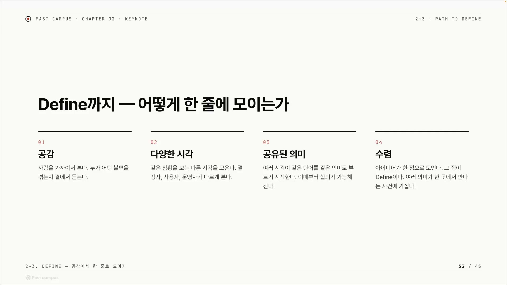
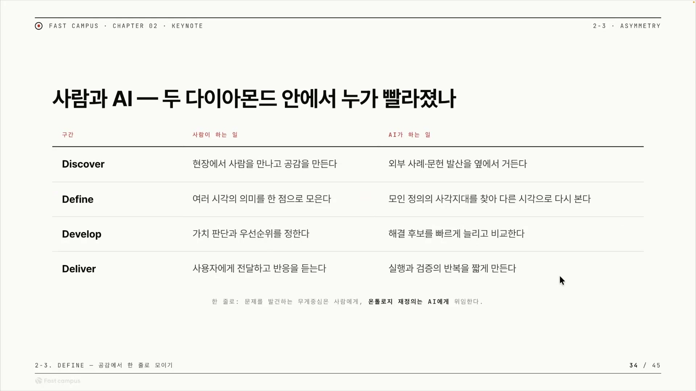
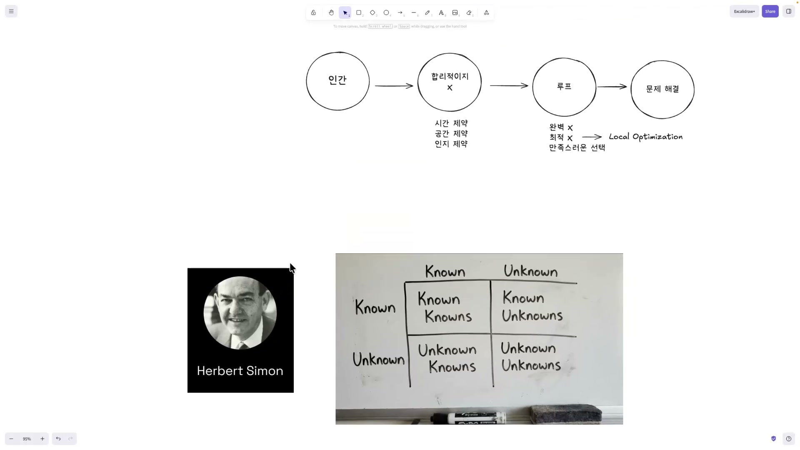
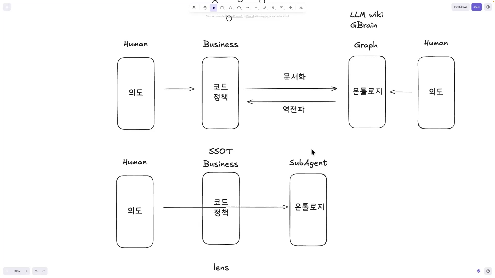
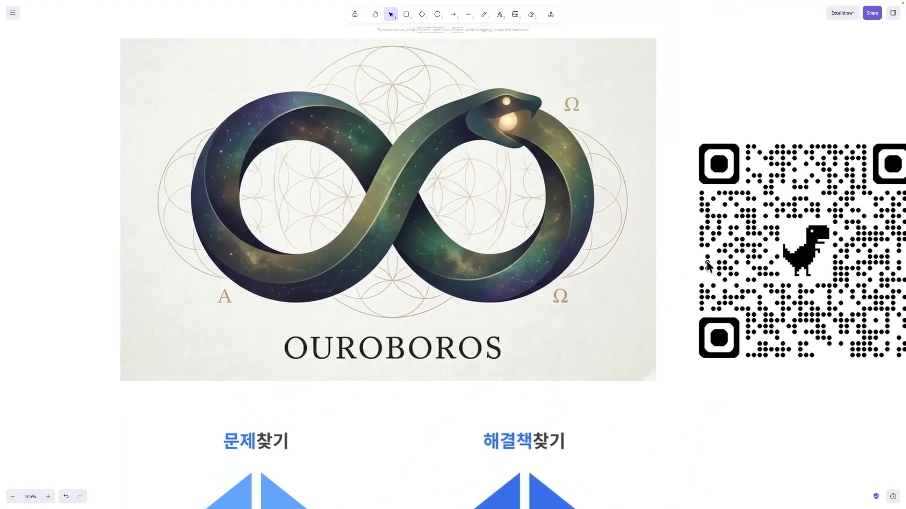
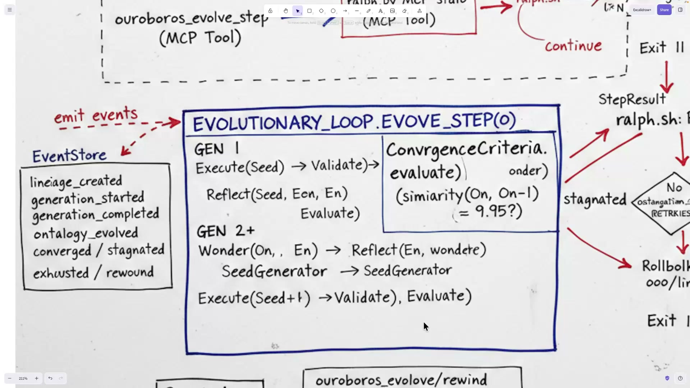
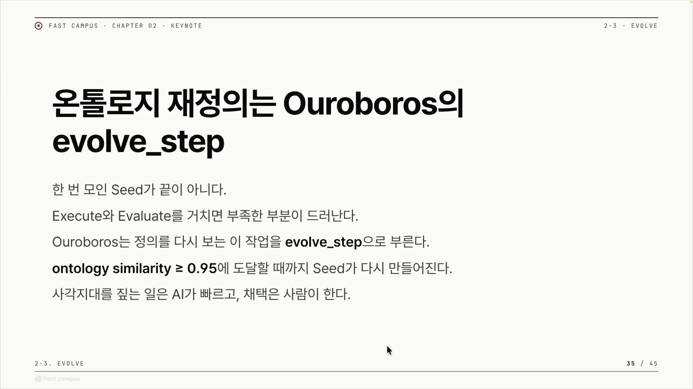
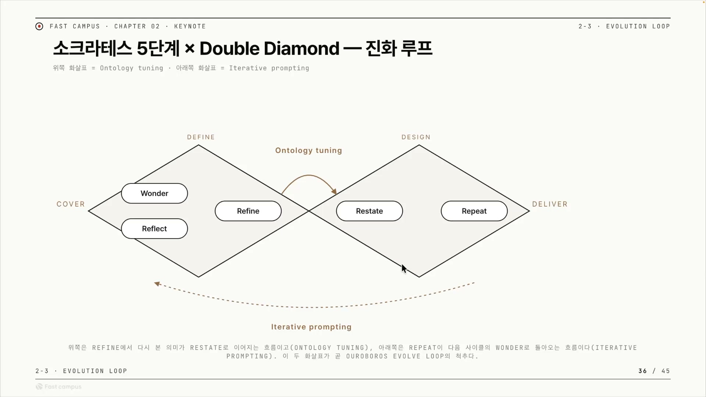
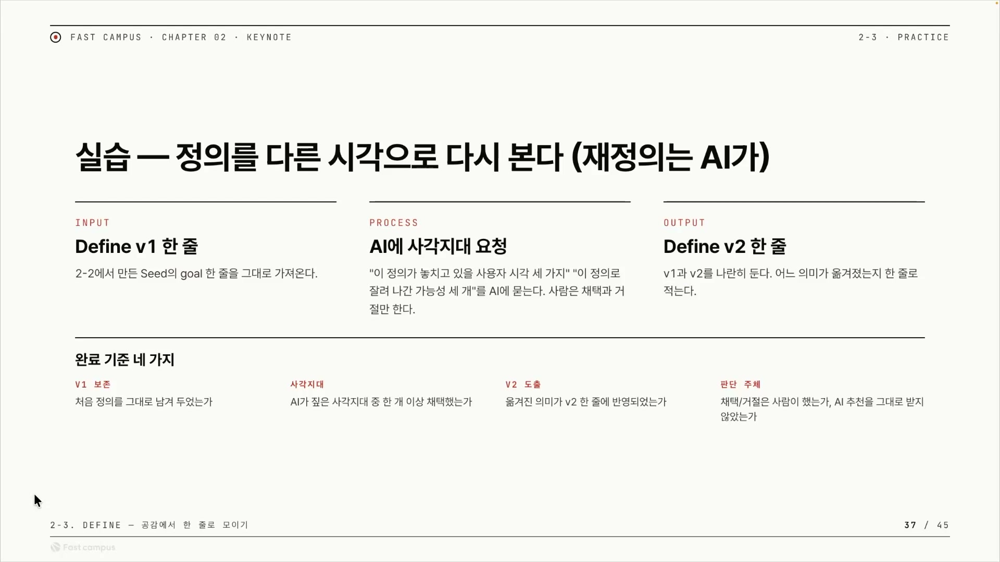

디자인씽킹에는 더블 다이아몬드라는 오래된 그림이 있다. 다이아몬드 두 개를 옆으로 붙여 놓은 모양인데, 각 다이아몬드는 넓게 벌어졌다가 한 점으로 좁아진다. 넓어지는 구간이 발산(diverge), 좁아지는 구간이 수렴(converge)이다. 첫 번째 다이아몬드는 "올바른 문제를 찾는" 구간이고, 두 번째는 "올바른 해결책을 찾는" 구간이다. 영국 Design Council이 2005년에 정리해 퍼뜨린 모델이고, 네 단계의 이름은 Discover, Define, Develop, Deliver다.

이 글이 파고드는 건 그중 두 번째 단계, Define(정의)다. 첫 번째 다이아몬드의 수렴 지점, 그러니까 발산하며 쏟아진 온갖 시각을 하나의 문제 정의로 좁히는 자리다. Define은 한 문장으로 추리면 "발산한 다양한 시각을 한 점으로 모으는 것"이다. 결정자와 사용자와 운영자가 같은 상황을 저마다 다르게 보는데, 그 여러 시각이 같은 단어를 같은 의미로 부르기 시작하는 순간이 Define이다.

그렇게 모인 "공유된 의미"가 곧 온톨로지(ontology)다. 온톨로지는 어떤 도메인의 개념들을 객체와 속성과 관계로 구조화한 의미 모델을 말한다. Define의 결과물이 공유된 의미이고, 그 공유된 의미를 구조로 떠낸 것이 온톨로지라면, Define은 곧 온톨로지를 만드는 일이 된다. 그러면 다음 질문은 자연스럽게 이렇게 이어진다. 이 온톨로지는 누가 만들고 누가 관리하는가.

## 인간의 일은 사라지는 게 아니라 앞으로 당겨진다

네 단계를 한 칸씩 짚으면 사람과 AI가 각각 무엇을 하는지 갈린다.

| 단계 | 사람이 하는 일 | AI가 하는 일 |
|---|---|---|
| Discover (발산) | 현장에서 사람을 만나고 공감을 쌓는다 | MCP 같은 통로로 Tavily 등으로 외부 자료를 검색하고, 인간이 원한 목표를 검증한다 |
| Define (수렴) | 여러 AI가 내놓은 안을 바탕으로 한 점으로 모은다 | 모인 정의의 사각지대를 찾아 다른 시각으로 다시 본다 |
| Develop (발산) | 가치 판단과 우선순위를 정한다 | 여러 갈래로 빠르게 만들어 A/B로 비교한다 |
| Deliver (수렴) | 사용자에게 전달하고 반응을 듣는다 | 실행과 검증의 반복을 짧게 만든다 |

표를 위에서 아래로 훑으면 한 가지 흐름이 보인다. 단계가 내려갈수록 AI 칸이 점점 무거워진다. 정점은 Define 칸이다. 사람은 여러 안을 받아 한 점으로 모으는데, AI는 그 모인 정의에서 "그럴듯한 추측으로 메워둔 빈틈"을 찾아 다른 시각으로 다시 본다. 어차피 실제 빌딩은 AI가 하니, 갭을 남겨두면 그 빈틈 위에서 AI가 잘못 짓는다. 그래서 여태 만들어 온, 인간의 암묵지를 캐묻는 소크라틱 리즈닝 도구가 이 자리에서 쓰인다.

표가 가리키는 건 무게중심의 이동이다. 인간의 역할은 사라지는 게 아니라 앞단으로 당겨진다. 문제를 발견하고, 목표(화자는 이걸 "이데아"라고 부른다)를 정의해 AI에게 넘기고, AI가 마음껏 발상하고 수렴하도록 판을 깔아주는 일이 사람 몫으로 남는다. 그 뒤의 온톨로지 구축은 AI 쪽으로 넘어간다. 화자는 "온톨로지 재정의는 AI에게 위임한다, 이게 꼭 필요하다"고 단언한다.

왜 꼭 위임해야 하는가. 그 근거가 다음 대목에 있다.

## 인간은 경계 안에서 깊이 파고, AI는 경계를 다시 긋는다

위임의 근거는 인간의 인지 구조에 있다. 화자는 허버트 사이먼의 얼굴을 화면에 띄운다. 사이먼은 1978년 노벨경제학상을 받은 학자로, 제한된 합리성(bounded rationality)이라는 개념으로 알려져 있다. 인간의 의사결정은 시간, 정보, 인지의 한계라는 경계 안에서 이뤄진다는 것이다. 그래서 인간은 최적해까지 가지 않고 "충분히 좋은" 지점에서 멈춘다. 이걸 만족화(satisficing)라고 부른다.

같은 화면에 또 하나의 그림이 있다. Known과 Unknown을 가로세로로 교차시킨 2×2 매트릭스다. 아는 걸 아는 것(known knowns), 모른다는 걸 아는 것(known unknowns), 모른다는 사실조차 모르는 것(unknown unknowns), 그리고 알면서도 인정하지 않는 것(unknown knowns). 인간은 주로 known knowns만 다루고, 나머지 사분면, 특히 모른다는 것조차 모르는 영역은 잘 보지 못한다.

다만 이 매트릭스는 사이먼이 만든 게 아니다. 화면에 사이먼 사진과 나란히 떠 있어 한 사람의 작품처럼 보이지만, known/unknown 분류로 유명한 건 2002년 도널드 럼스펠드의 발언이고, 구조 자체는 1955년 조하리 윈도(Johari Window)에서 왔다. 사이먼과 이 매트릭스는 같은 사람이 만든 한 프레임이 아니라, "인간 인지에는 사각지대가 있다"는 하나의 논점을 받치는 별개의 두 근거다. 사이먼은 경계에 갇힌 인간을, 매트릭스는 그 경계 밖에 인간이 못 보는 영역이 있음을 보여준다.

이 둘을 합치면 논리가 선명해진다. 인간은 경계를 정의하고, 그 경계를 인정한 뒤, 경계 안에서 더 깊이 판다. 화자가 든 예시는 운전이다. '운전'이라는 걸 정의하다 보니 자동차와 신호 시스템이라는 경계가 생겼다. 인간은 그 경계 안에서 더 좋은 자동차, 더 빠른 슈퍼카를 만드는 쪽으로 파고든다. 경계 자체를 의심하지는 않는다. 사이먼식으로 말하면 로컬 옵티마이제이션, 국소 최적해에 안착하는 것이다.

AI는 다르게 동작하도록 만들 수 있다. 한계를 마주하면 "왜 이게 필요하지?" 하고 경계 자체를 다시 긋게 프롬프팅하고 판을 깔아주면, AI는 로컬 최적에 머물기보다 한계를 없애는 쪽으로 움직인다. 화자는 이게 실제 산업에서 일어나는 일이라고 본다. 팔란티어조차 온톨로지 구축을 AI에게 맡기고, AI FDE를 만들어 진행한다는 것이다. 팔란티어의 온톨로지는 비즈니스를 객체와 속성과 링크로 디지털 트윈처럼 떠낸 의미 계층이고, FDE는 본래 고객 현장에 배치돼 전 과정을 책임지는 엔지니어를 가리킨다. AI FDE는 그 일을 자연어로 받아 처리하며 온톨로지 편집까지 AI가 수행하는 형태다.

화자는 여기서 아이작 아시모프의 단편 '최후의 질문(The Last Question)'을 끌어온다. 1956년 작이고, 화자가 자기 블로그(WPTI.dev)에 교육 도메인에 빗대 쓴 글에서 인용했다고 한다. 이야기 속에서 인간은 슈퍼컴퓨터에게 묻는다. 우주의 엔트로피를 되돌릴 수 있는가. 인간으로서는 풀 수 없는 질문이다. 물리 법칙이 허락하지 않으니, 인간이 할 수 있는 일이라곤 주어진 우주 안에서 어떻게 엔트로피와 타협할지 고민하는 것뿐이다. 그런데 우주가 다 끝난 뒤, 수십억 년의 연산을 거친 AI는 "빛이 있으라"며 새로운 우주를 창조한다.

이 비유는 인간과 AI의 차이를 같은 그림 위에 올려놓는다. 인간은 주어진 우주(엔트로피라는 경계) 안에서 최선을 찾는다. AI는 우주 자체를 새로 만든다. 인간은 새 우주를 탄생시킨다는 발상 자체를 하지 못했다. 로컬 옵티마이제이션과 경계 재정의의 차이가 그대로 드러나는 대목이다. 결론은 이렇게 정리된다. 매트릭스의 unknown unknowns, 모른다는 것조차 모르는 영역을 메우는 데는 AI가 경계를 깨기 유리하므로, 온톨로지는 AI가 더 잘 구축한다.

## 온톨로지를 자산으로 쌓으면 병이 든다

위임하라는 결론은 났다. 문제는 어떻게 구현하느냐다. 화자는 화이트보드에 그림을 한 겹씩 쌓아 올린다.

온톨로지는 보통 그래프 형태다. 한쪽에는 실제 비즈니스, 즉 코드와 정책이 있다. 정상적인 흐름은 단순하다. 비즈니스를 문서화하면 그래프(온톨로지)가 나온다. 코드 문서화 도구로 쌓인 코드 로직을 그래프로 옮기는 것까지는 잘 된다.

어려워지는 건 반대 방향이다. 온톨로지가 먼저 바뀌는 상황이 생긴다. 문서가 코드보다 앞서 나가는 것이다. 그러면 바뀐 온톨로지를 다시 코드로 거꾸로 반영해야 한다. 화자는 이걸 신경망 용어를 빌려 역전파(backpropagation)라고 부른다. 코드를 바꾸면 문서가 따라오고, 문서를 바꾸면 코드가 따라와야 하는 양방향 싱크가 생기는데, 이게 무척 어렵다.

문제는 더 있다. 온톨로지는 "어떤 관점으로 볼 것인가"가 정해져 있지 않으면 한없이 비대해진다. 화자의 표현으로는 "굉장히 뚱뚱해진다." 요즘 많이 거론되는 LLM Wiki나 지브레인(GBrain) 같은 지식 그래프가 그 사례다. 모든 게 모든 것과 연결돼 그래프가 거대해지는데, 정작 우리는 그중 일부 시야만 필요하다. 데이터는 넘치는데 쓸 건 한 조각이다. 게다가 한쪽에서 코드 정책이 바뀌는 동안 누군가 다른 데서 그래프를 손대면, 아직 싱크가 안 맞은 낡은(stale) 데이터를 보고 잘못된 판단을 하게 된다.

핵심은 진실의 근원이 둘로 쪼개진다는 데 있다. 코드는 라이브로 나가고 온톨로지는 내부에서 쓰인다. 정본이 둘이면 둘 사이를 계속 맞춰야 하고, 갱신은 어렵고, 낡은 데이터가 쌓인다. SSOT(Single Source of Truth), 즉 단일 진실 원천이라는 원칙은 모든 참조가 한 정본을 가리켜야 불일치가 없다고 말한다. 그런데 온톨로지를 자산처럼 영구 저장하는 순간, 정본이 둘이 되어 이 원칙이 깨진다.

## 렌즈, 쌓지 말고 그때그때 다시 그려라

처방은 온톨로지를 저장하지 않는 것이다.

화자가 제안하는 메커니즘은 이렇다. 필요할 때 불러와서(recall) 다시 고쳐 저장하는(reconsolidate) 방식으로, 시점마다 빠르게 갱신한다. 원래 기억 연구에서 쓰는 용어인데, 여기서는 메모리 시스템에 빗댄 표현이다. 그리고 그 갱신을 누가 하느냐. 서브에이전트다. 메인 세션을 건드리지 않고 따로 일하는 보조 AI의 성능이 좋아졌으니, 이 일을 맡길 수 있다.

그 갱신을 끌어가는 개념이 lens(렌즈)다. 같은 비즈니스, 즉 같은 코드와 정책이라도, 그때그때의 인간의 의도(intention)를 이해하면 그 의도로 온톨로지를 뽑아내기가 쉬워진다. 화자는 이 인간의 의도를 렌즈라고 부른다. 카메라 렌즈를 갈아 끼우면 같은 풍경이 다르게 찍히듯, 같은 코드와 정책 위에 어떤 의도라는 렌즈를 끼우느냐에 따라 그때그때 다른 온톨로지가 떠진다. 렌즈가 있으니 온톨로지를 미리 만들어 쌓아둘 필요가 없다. 필요한 순간에 필요한 시야만큼만 서브에이전트가 다시 그리면 된다.

그러면 SSOT가 깔끔하게 하나로 정리된다. 진실의 근원은 코드와 정책, 즉 비즈니스 그 자체 하나뿐이다. 온톨로지는 거기서 렌즈를 통해 매번 생성되는 파생물일 뿐, 따로 보관하는 정본이 아니다. 저장하지 않으니 비대해질 일도, 낡아서 어긋날 일도 없다. 앞서 본 함정(정본이 둘, 양방향 싱크 지옥)이 통째로 사라진다.

정리하면 여기서 갈리는 건 "온톨로지를 저장할 것인가, 재생성할 것인가"다. 저장하는 쪽(LLM Wiki, 지브레인, 영구 온톨로지)은 비대화와 싱크 문제를 안고, 재생성하는 쪽(렌즈 기반 즉석 생성)은 그 문제를 비껴간다. 화자는 후자를 민다. 그리고 이 관점을 만들기 시작하는 자리는 처음의 Discover, 발산 단계다. 거기서 만든 온톨로지가 공유된 온톨로지(shared ontology)가 되어 Develop과 Deliver까지 이어지고, 다음 루프가 돌아오면 새 온톨로지로 다시 정의된다.

## 우로보로스, 수렴을 수치로 자동화한 하네스

이론을 코드로 굳히면 어떻게 되는가. 화자는 자신이 직접 만든 하네스, 우로보로스(Ouroboros)를 보여준다. 우로보로스는 자기 꼬리를 무는 뱀이다. 끝이 곧 시작인 순환의 상징이라, 계속 도는 루프와 맞닿는다.

로고에는 의미가 여럿 겹쳐 있다. 화자는 먼저 이 로고로 더블 다이아몬드를 표현하고 싶었다고 한다. 무한대(∞) 모양은 계속 도는 랄프 루프(Ralph Loop)를, 로고 안의 O와 S 글자는 OS를 표현하려 했다는 것이다. 화자 스스로도 "최대한 의미를 꿰맞춰봤다"고 인정한다.

작동 방식은 진화 루프다. 한 번 모인 시드(seed)가 끝이 아니다. 실행하고 평가하면 부족한 부분이 드러나고, 정의를 다시 보는 이 한 스텝을 우로보로스는 `evolve_step`이라 부른다. 세대가 거듭되며 변이(mutation)하고, 세대를 거슬러 특정 시점으로 되돌아가는 되감기(Rewind)도 있다. 각 세대의 로그는 EventStore에 쌓인다.

진화 한 스텝마다 세대 간 온톨로지의 유사도를 잰다. 그 유사도가 0.95 이상에 닿으면 "더 이상 바뀔 게 없다"고 보고 시드를 멈춘다. 더 돌려봐야 새로운 의미가 나오지 않는다는 신호이기 때문이다. 디자인씽킹이 말하는 추상적인 '수렴'을, 세대 간 의미가 거의 같아지는 지점이라는 수치로 자동화한 셈이다. Define의 본질이 "한 점으로 모으기"였다면, 우로보로스는 그 한 점에 닿았는지를 0.95라는 숫자로 판정한다.

루프 안에서 도는 사이클은 더블 다이아몬드의 발산과 수렴에 그대로 매핑된다. 한 세대를 마치고 돌아올 때 소크라테스식으로 "우리가 뭘 놓쳤지(What did we miss?)"를 묻는 Wonder 단계를 거치고, Reflect로 돌아본 뒤, Refine으로 정의를 좁히고, AI가 그 결과를 다시 진술하는 Restate를 하고, 그걸로 해결책을 설계한다(이때 아키텍처 결정을 기록하는 ADR 같은 도구를 쓴다). 그리고 Repeat로 다시 돈다. 발산과 수렴이 끝없이 반복된다.

한 바퀴를 돌 때마다 입력이 바뀐다는 점이 이 루프를 진화하게 만든다. 첫 입력은 인간이 준 것이지만, 두 번째부터는 이전 결과물에 새 시드가 더해져 들어간다. 매 반복마다 자라는 입력, 그래서 화자는 이걸 반복적 프롬프팅(iterative prompting)이자 진화 루프(evolutionary loop)라고 부른다.

이 루프가 기대는 또 하나의 전제는 레이어 분리다. 밑에 깔린 모델은 갈아 끼울 수 있다. GPT를 쓰든 Opus를 쓰든 Kimi를 쓰든 상관없다. 모델이 바뀌어도 바뀌지 않는 건 그 위에 얹은 계약과 정책, 그리고 철학 레이어다. 디자인씽킹과 소크라틱 리즈닝으로 짠 사고의 프레임은 모델이 무엇이든 그대로 동작한다. 모델은 소모품이고, 사고 프레임은 자산이라는 관점이다. 실제로 이 철학을 본 OMC(oh-my-claudecode)와 OMX(oh-my-codex) 같은 도구도 소크라틱 요구사항 명확화 단계인 `deep-interview`를 만들기 시작했고, 우로보로스를 몇 번 소개해줬다고 한다.

다만 우로보로스 자체는 화자가 개인적으로 만든 하네스라, 공개 제품으로 검증된 시스템은 아니다. `evolve_step`, EventStore, 유사도 정지 조건 같은 내부 구성은 화자의 구현으로 받아들이면 된다. 검증된 건 그 밑에 깔린 사고, 즉 디자인씽킹과 사이먼의 인지 한계론과 아시모프의 비유 쪽이다.

## 한 줄로 모으기

처음의 질문으로 돌아오면 답은 이렇게 압축된다. AI 시대에 Define(수렴)의 산물인 온톨로지는 인간이 들고 있으면 비용도 한계도 크다. 인간은 경계 안에서 깊이 파는 존재라 경계 밖을 잘 못 보고, 온톨로지를 자산으로 쌓으면 비대해지고 싱크가 깨진다. 그러니 코드와 정책만 단일 진실 원천으로 두고, 온톨로지는 AI 서브에이전트가 인간의 의도라는 렌즈로 그때그때 다시 그리게 하라. 그 사고를 루프로 굳힌 것이 우로보로스이고, 수렴은 세대 간 유사도 0.95라는 숫자로 판정된다.

다음 클립은 이걸 손으로 해보는 실습이라고 한다. 한 줄짜리 문제 정의 v1을 써놓고, AI에게 그 정의의 사각지대를 짚어달라고 요청해, v2로 다시 좁히는 것이다. 표의 Define 칸에 적혀 있던 "모인 정의의 사각지대를 찾아 다른 시각으로 다시 본다"가 그대로 작업이 되는 셈이다. 이 글에서 정리한 사고가 한 줄 명세를 다듬는 실제 손놀림으로 이어진다.

## 외우고 넘어갈 핵심

논리 흐름은 위에서 다 풀었으니, 여기서는 머리에 남겨둘 개념만 따로 뽑는다.

**1. 더블 다이아몬드, 네 단계.** 발산과 수렴을 두 번 반복하는 디자인씽킹 모델이다. 첫 다이아몬드는 올바른 문제를, 둘째 다이아몬드는 올바른 해결책을 찾는다.

| 단계 | 발산/수렴 | 하는 일 |
|---|---|---|
| Discover | 발산 | 현장에서 사람을 만나 공감을 쌓으며 시각을 넓게 펼친다 |
| Define | 수렴 | 펼쳐진 여러 시각을 하나의 문제 정의로 좁힌다 |
| Develop | 발산 | 해결책을 여러 갈래로 빠르게 만들어 비교한다 |
| Deliver | 수렴 | 사용자에게 전달하고 반응을 들어 좁힌다 |

**2. Define = 온톨로지 만들기.** 등식으로 외우면 된다.

> Define의 산물 = 공유된 의미 = 온톨로지

결정자와 사용자와 운영자가 같은 단어를 같은 뜻으로 부르기 시작하는 순간이 Define이고, 그 공유된 의미를 객체와 속성과 관계로 구조화한 것이 온톨로지다. 그래서 Define은 곧 온톨로지를 만드는 일이다.

**3. 사이먼의 연쇄.** 인간이 왜 경계 안에 갇히는지를 세 칸으로 잇는다.

제한된 합리성(시간과 정보와 인지의 한계) → 만족화(최적해까지 안 가고 "충분히 좋은" 데서 멈춤) → **로컬 옵티마이제이션**(경계 자체는 의심하지 않고 그 안에서만 더 깊이 파고듦).

**4. 인간과 AI의 한 줄 대구.** 위 연쇄의 결론이자 이 글의 척추다.

- 인간은 경계 안에서 깊이 판다(로컬 최적).
- AI는 한계를 만나면 "왜 이게 필요하지?" 하며 경계 자체를 다시 긋는다(경계 재정의).

그래서 경계 밖을 메우는 온톨로지 구축은 AI에게 위임한다.

**5. SSOT 함정과 렌즈 처방.** 온톨로지를 어떻게 다룰지가 여기서 갈린다.

- 함정(저장하는 쪽): 온톨로지를 자산처럼 저장하면 정본이 둘(코드·정책 vs 저장된 온톨로지)이 되어 SSOT가 깨진다. 그 대가가 셋이다. 그래프가 한없이 비대해지고, 코드와 문서를 계속 양방향으로 맞춰야 하는 싱크 지옥(역전파)이 생기고, 낡은(stale) 데이터로 오판한다.
- 처방(재생성하는 쪽): 정본은 코드와 정책 하나로 두고 온톨로지는 저장하지 않는다. 서브에이전트가 그때그때 인간의 의도라는 렌즈로 필요한 시야만큼만 다시 그린다(불러와서 고쳐 저장, recall과 reconsolidate).

