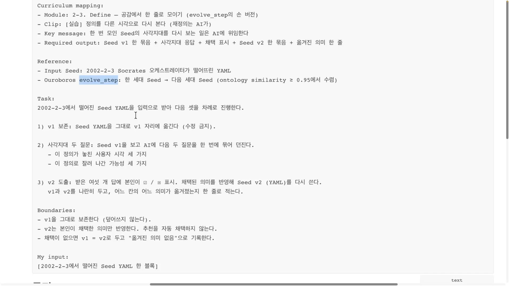
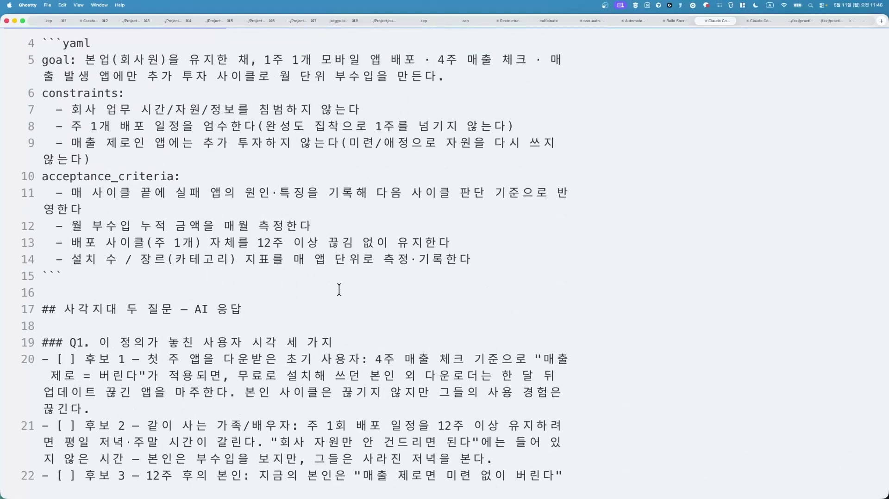
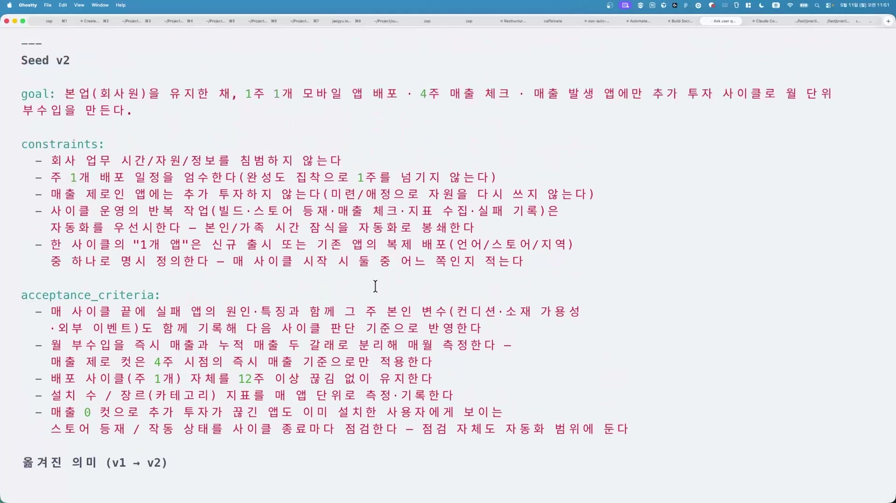

내가 만든 명세는 늘 완벽해 보인다. 빠진 게 안 보이기 때문에 완벽해 보인다.

이 강의(패스트캠퍼스 'Chapter 3. Define 고정하기'의 Ch03-03 실습)는 그 착각을 다룬다. 앞 클립에서 한 줄 명세(Seed)를 한 번 뽑아 봤다. 이 클립은 그 시드를 지우지 않고, 다른 시각으로 다시 보는 실습이다. 강사의 말로는 "여태까지 시드를 한 번만 만들었고, 이제 그 다음 시드를 어떻게 만드는지 봐야 된다". 한 번 뽑고 끝이 아니라, 만들고 놓친 걸 찾고 다음 버전으로 깎는 루프가 이 강의의 척추다.

## 시드, 일을 시키기 전에 의도를 잠그는 세 칸

시드는 AI에게 작업을 넘기기 전에 만들고 싶은 것을 짧게 못 박은 명세다. 화면에는 YAML이라는 텍스트 형식으로 세 칸이 출력된다.

- **goal(목표)**: 무엇을, 왜 만드는가. 예를 들어 "본업을 유지한 채, 추가 투자 사이클로 월 단위 부수입을 만든다."
- **constraints(제약)**: 지켜야 할 경계. "이 범위 안에서만 해라". 예를 들어 "회사 업무 시간 · 자원 · 정보를 침범하지 않는다."
- **acceptance_criteria(완료 기준)**: 무엇이 충족되면 "됐다"고 인정하는가. 여기가 핵심인데, "잘 되면"이 아니라 판정 가능한 문장이어야 한다. 예를 들어 "월 부수입 누적 금액을 매월 측정한다."

이 세 칸 구성은 강사 개인의 발명이 아니다. 소프트웨어 명세를 다루는 GitHub Spec Kit도 명세가 goal, constraints, acceptance criteria를 담아야 한다고 본다. 같은 골격이다.

왜 이걸 먼저 잠그느냐 하면, AI는 애매한 지시에서 결과가 들쭉날쭉해지기 때문이다. AI 명세 작성을 다룬 여러 정리에 따르면, 잘 제약된 프롬프트를 받은 약한 모델이 애매한 지시를 받은 강한 모델을 일관되게 이긴다. 여러 단계를 거치는 작업에서는 애매함이 단계마다 누적돼 더 크게 어긋난다. 그래서 의도를 먼저 한 점으로 굳혀 두면, 첫 시도에 맞게 나올 확률이 크게 오른다.

## 그런데 그 한 점은 내가 만든 한 점이다

문제는 시드가 "본인 시야에서 만들어진 한 점"이라는 데 있다. 강사의 표현이 정확하다. "어떤 의미가 잘려나가는지 혼자 보기가 어려워요. 완벽한 것 같아요 자기가 보긴. 하지만 완벽하지 않다."

이건 그냥 겸손한 말이 아니라 인간의 구조적 한계다. 경제학자 허버트 사이먼이 노벨상을 받은 개념인 제한된 합리성(bounded rationality)이 여기 맞물린다. 사람은 가진 정보가 불완전하고, 머리로 한 번에 처리할 수 있는 양에 한계가 있고, 시간도 부족하다. 그래서 모든 선택지를 끝까지 비교하지 못하고 "이만하면 충분하다" 싶은 데서 멈춘다. 사이먼은 이 멈춤을 만족화(satisficing)라 불렀다. satisfy(만족)와 suffice(충분)를 합친 말이다.

강의가 말하는 "만족스러운 선택"이 바로 이것이다. 내가 뽑은 시드 v1은 최적해가 아니라, 그 순간 내가 떠올릴 수 있던 범위에서 충분히 좋았던 한 점이다. 멈춘 지점이 곧 내 인지의 경계고, 그 경계 안에서는 아무리 들여다봐도 빠진 게 안 보인다. 빠진 게 안 보이는 것, 그게 정확히 문제다.

내 머리의 한계는 내 머리로 못 고친다. 그래서 경계 밖에서 다시 보는 일을 AI에게 맡긴다. 강사는 이걸 "AI FDE를 채용하는 것"이라 부른다. FDE(Forward Deployed Engineer)는 본사에 앉아 있지 않고 고객사 현장에 파견돼 그 회사의 실제 문제를 듣고 구현까지 책임지는 엔지니어다. 팔란티어가 이 모델로 유명하다. 내 옆에 현장 엔지니어를 한 명 두듯, 내 시드를 곁에서 다시 뜯어보고 내가 못 본 관점을 채우는 일꾼으로 AI를 위임한다는 비유다. 위임의 본질은 "더 똑똑한 답을 받는 것"이 아니라 "내가 못 보는 각도에서 다시 보게 하는 것"이다.

## AI에게 사각지대를 묻고, 사람이 고른다

실제 절차는 단순하다. 강사가 evolve_step이라는 이름으로 정리한 진행표가 화면에 펼쳐진다.

순서는 이렇다. 먼저 v1을 그대로 보존한다(수정 금지). 그다음 AI에게 두 가지를 묶어 묻는다. "이 정의가 놓친 사용자 시각 세 가지", "이 정의로 잘려 나간 가능성 세 가지". AI가 답을 내놓으면 사람이 채택할 것만 고르고, 채택한 의미만 반영해 v2를 다시 쓴다. 진행표의 경계(Boundaries)에 못 박힌 한 줄이 이 절차의 핵심이다. "v2는 본인이 채택한 의미만 반영한다. 추천을 자동 채택하지 않는다."

여기서 AI가 던지는 질문은 답을 가르쳐 주는 게 아니라 되묻는 방식이다. 강사는 이를 "소크라테스가 나와서 우리가 뭘 놓쳤지를 얘기한다"고 표현한다. 소크라테스식 질문법은 답을 주지 않고 질문만 던져 상대가 스스로 자기 가정과 빈틈을 드러내게 하는 방식이다. 사람이 AI에게 주는 요청은 거의 항상 빈칸투성이다. "할 일 앱 만들어줘"라고 하면 혼자 쓰는 건지 팀용인지, 항목을 삭제할 수 있는지 아무것도 안 정해져 있다. 보통 AI는 그 빈칸을 혼자 추측해서 메우고 코드를 쓴다. 소크라테스식 질문은 그 추측을 막고, AI가 먼저 "여기 빈칸이 있는데 뭘로 채울까요?"라고 되묻게 만든다.

강사는 이 되묻기를 객관식으로 띄우는 데 Claude Code의 AskUserQuestion 도구를 쓴다. 둘은 층위가 다르다. 소크라테스식 질문은 "무엇을 물을지"를 정하는 사고법이고, AskUserQuestion은 그 질문을 사용자에게 선택형으로 띄우는 실행 수단이다. AskUserQuestion은 한 번에 질문 1\~4개, 질문마다 선택지 2\~4개를 띄우고, 사용자는 그중 고르거나 직접 텍스트로 답한다. 선택지는 AI가 맥락을 보고 그럴듯하게 만들어 준다. 강의에서 "시드, 역할, 입력, 게이트를 AskUserQuestion으로 물어본다"는 말은, 각 항목을 질문 하나씩으로 만들어 사용자가 고르게 한다는 뜻이다.

## 실제로 AI가 짚은 것들

말로만 보면 추상적이다. 강의에서 실제로 나온 화면을 보면 손에 잡힌다.

시드 v1은 제약 3개, 완료 기준 4개였다. 그 아래로 AI가 "놓친 사용자 시각" 후보를 줄줄이 뽑았는데, 강사가 화면을 보며 가장 놀란 대목은 숫자 지표가 아니라 사람 이야기였다.

- **초기 사용자.** 4주 매출 체크 기준으로 "매출 제로 = 버린다"가 적용되면, 무료로 설치해 쓰던 사람들은 한 달 뒤 업데이트가 끊긴 앱을 마주한다. 본인 사이클은 안 끊겨도 그들의 사용 경험은 끊긴다는 지적이다.
- **같이 사는 가족, 배우자.** AI는 "사라진 저녁을 본다"고 적었다. 주 1회 배포를 12주 이상 유지하려면 평일 저녁과 주말 시간이 갈리는데, 본인은 부수입을 보지만 가족은 사라진 저녁을 본다. 강사의 반응이 그대로 남아 있다. "왜 이렇게 인간적이죠?", "오히려 너무 인간적으로 적어줬네요."
- **번아웃.** 사람이 갈려 나갈 수 있다는 변수.

지표를 캐는 질문도 날카로웠다. 매출이라고만 적었는데 그게 광고 매출이냐 실수익이냐, 누적이냐 즉시냐가 안 정해져 있었다. AI는 "수익이 0이지만 12주치 누적 설치가 광고 정가를 만들 수도 있다"며 매출과 수익을 구분하라고 짚었고, "4주 컷은 이 패턴을 전부 죽인다"며 너무 이른 평가 컷이 성공 패턴을 죽일 수 있다고 지적했다. 범위를 흔드는 질문도 있었다. 단위가 한 개 앱이 아니라 기존 앱을 다른 지역 스토어로 복제하는 길일 수도 있고, 실패 원인이 앱 자체 특징 바깥(시장이나 타이밍)에 있을 수도 있다는 것. 출시 시점이 만우절 같은 이벤트성 앱이라면 타이밍이 결과를 좌우할 수도 있다.

이 항목들의 공통점은 하나다. 혼자서는 잘 안 떠올리는 각도라는 것. 가족과 번아웃은 명세를 뽑을 때 내 시야 밖에 있었다. 빠뜨렸다는 사실조차 몰랐던 질문을 AI가 던진 셈이다.

## 한 바퀴 돌린 결과

채택은 사람이 했다. AI가 던진 후보를 전부 받지 않고, 강사가 골라 v2에 반영했다.

기존 시드는 제약 3개, 완료 기준 4개였다. v2는 제약 5개, 완료 기준 5개가 됐다. 늘어난 자리에 사각지대가 그대로 박혔다.

- **자동화 의무 한 줄.** 가족 시간과 번아웃 사각지대가 "본인 · 가족 시간 잠식을 자동화로 봉쇄한다"는 제약으로 들어왔다. 강사 말로는 "제 손을 타지 않게끔 만들어야겠죠".
- **"한 개 앱은 신규 또는 복제" 한 줄.** 단위가 1앱이 아니라는 지적이 "신규 출시 또는 기존 앱의 복제 배포 중 하나로 명시"라는 제약이 됐다.
- **매출을 두 갈래로 분리.** 모호하던 매출이 "월 부수입을 즉시 매출과 누적 매출 두 갈래로 분리해 매월 측정"으로 갈라졌다. 모호하면 v2에서 쪼개야 했던 이 장면이, 완료 기준은 판정 가능해야 한다는 원칙의 산 증거다.
- **실패 원인 기준을 넓힘.** "앱의 원인 · 특징"만 보던 기준이 "본인 변수(컨디션 · 소재 가용성) · 외부 이벤트"까지 함께 기록하도록 넓어졌다.
- **컷 이후에도 죽지 않는 구조.** "매출 0 컷으로 추가 투자가 끊긴 앱도 스토어 등재 · 작동 상태를 사이클 종료마다 점검한다". 4주 컷 사각지대가 기준으로 들어온 것.

한 바퀴 돌렸더니 명세가 더 촘촘해졌다. 그리고 이 v2는 끝이 아니다. 강사는 산출물을 가리켜 "이게 새롭게 입력이 될 겁니다"라고 말한다. v2가 다음 라운드의 입력이 되어 루프가 다시 돈다.

## 출력이 다시 입력이 되는 뱀

강사는 이 구조를 우로보로스(Ouroboros)와 컴파운드 엔지니어링으로 연결한다. "결국에 그 아웃풋을 인풋으로 먹여주는 거, 우로보로스 자기가 꼬리를 계속 먹는 뱀이다 보니까."

우로보로스는 자기 꼬리를 입에 문 뱀을 그린 고대 상징이다. 끝이 곧 시작으로 이어지는 무한 순환을 뜻한다. AI 맥락에서 이 상징은 출력을 입력으로 다시 삼키는 구조의 정확한 비유가 된다. 실제로 Q00이 만든 같은 이름의 오픈소스 Agent OS가 있고, 그 문서는 이 은유를 그대로 쓴다. "우로보로스가 제 꼬리를 먹는 지점이 여기다. 평가의 출력이 다음 세대 시드 명세의 입력이 된다." 강의의 실습 용어(시드, Evolve Step, 소크라테스 인터뷰)가 이 프로젝트 구조와 거의 일치한다. 강의 실습은 사실상 이 루프를 직접 손으로 돌려본 것에 가깝다.

컴파운드 엔지니어링은 AI 미디어 회사 Every의 Kieran Klaassen과 Dan Shipper가 만든 용어다. 정의는 단순하다. "만드는 기능 하나하나가 다음 기능을 더 쉽게 만들 것이라고 기대한다." 전통적 개발에서는 코드가 쌓일수록 복잡해져 다음 기능이 더 어려워지는데, 이쪽은 방향을 뒤집는다. 비결은 한 번 겪은 시행착오를 문서로 남겨 다음 작업의 밑천으로 삼는 데 있다.

왜 '복리(compound)'라는 말을 쓰는지는 숫자로 보면 분명하다. 복리는 작은 개선이 매번 직전 결과 위에 쌓이는 구조다. 매 루프 단 1%씩 나아진다고 하자. 더하기로만 쌓이면 100번 해도 2배에 그치지만, 곱하기로 쌓이면 1.01을 100번 곱해 약 2.7배가 된다. 매 루프 5%면 약 131배다. 시드도 마찬가지다. v2는 v1을 입력으로 깎였고, v3는 v2를 입력으로 깎인다. 한 바퀴의 이득은 작아 보여도(제약 3→5개), 그게 다음 바퀴의 출발점을 끌어올리기 때문에 누적되면 격차가 커진다.

## 같은 구조가 반대로도 작동한다

여기까지만 보면 반복은 만능처럼 들린다. 그렇지 않다. 출력을 입력으로 되먹이는 바로 그 구조 때문에, 오류도 복리로 쌓인다.

생성 모델을 그 모델 자신의 출력으로 반복 학습시키면 품질이 세대를 거쳐 퇴화하는 모델 붕괴(model collapse)가 알려져 있다. 한 의료 트리아지 예시에서는 AI가 만든 노트로 재학습을 반복하자 희귀질환 정확도가 85%에서 38%로 추락했다고 보고된다. 드문 케이스가 루프에서 점점 사라지기 때문이다. 입력 분포가 조금씩 바뀌며 판단이 의도에서 서서히 멀어지는 드리프트(drift)도 있다. 작은 편차가 매 루프 증폭돼, 모르는 사이 엉뚱한 방향으로 굳는다.

방어책의 핵심은 루프 안에 사람을 끼워, 검증된 것만 되먹이는 것이다. 강의가 "채택 결정은 인간의 gut feeling(직감)으로 해야 된다"고 못 박은 게 정확히 이 안전장치다. AI가 사각지대를 꺼내 주되, 무엇을 시드에 넣을지는 사람이 고른다. AI 제안을 무비판적으로 다 받으면 자동화 편향(automation bias)에 빠진다. 사람이 자기 판단보다 기계 출력을 무조건 신뢰해 오류를 놓치는 현상이다. 한 연구에서는 오히려 AI에 회의적인 사람이 오류를 더 잘 잡았다. 강의 전사("인간의 gut feeling으로 채택")와 리서치(사람의 채택 게이트가 붕괴를 막는다)가 같은 결론에서 만난다.

AI가 내놓는 사각지대 답이 늘 정답인 것도 아니다. 그럴듯하지만 틀린 항목을 섞어 내놓을 수 있고, 가장 깊은 사각지대는 AI도 못 짚을 수 있다. 그래서 AI 답은 후보 목록이지 정답이 아니다. 거름망 없이 자기 출력을 무비판으로 다시 먹이면, 복리 이득이 아니라 복리 오류가 된다.

## 누적이냐, 매번 새로 짜느냐

강사는 한 걸음 더 나간 주장을 던진다. 시드를 다시 보는 것을 넘어, 개념과 그 관계를 정형화한 지식 체계인 온톨로지(ontology) 자체를 AI에게 맡기자는 것이다. "인간의 안목과 여러 관점을 다 꺼내 보고, 결국 공유 온톨로지를 하나 만들기 시작하면, 그 이후부터는 AI에게 온톨로지 재정의를 맡기자."

이 대목에서 강사는 LLM Wiki와 GBrain을 거론하며 비판한다. 둘 다 AI가 지식을 누적 저장하고 관리하는 도구다. LLM Wiki는 안드레이 카파시가 2026년 4월 올린 패턴으로, 벡터DB 없이 마크다운 폴더를 AI가 직접 읽고 쓰며 유지하게 한다. GBrain은 Y Combinator의 개리 탄이 비슷한 시기에 공개한 메모리 시스템으로, 노트를 자동으로 엮어 시간이 갈수록 쌓이도록(덧붙이기 전용으로) 설계됐다. 강사는 이 둘을 "아웃데이티드한 정보가 너무 많이 쌓이고, 쓸데없는 데이터까지 과하게 저장된다"고 평한다. 그 대안으로, 온톨로지를 코드 기반으로 두고 관점마다 새로 짜서 AI가 관리하게 하는 편이 낫다고 본다.

여기는 사실과 의견을 갈라 읽어야 한다. LLM Wiki와 GBrain의 정의는 사실이다. 다만 강사 본인이 "어그레시브하게 말하면"이라는 단서를 달았고 "다음 무료 세미나에서 더 얘기하자"며 미뤄둔, 강사 개인의 관점이라는 점을 강사 스스로 밝혔다. 비판에 일리가 없지는 않다. GBrain은 설계상 누적과 보존이 핵심이라 오래된 페이지가 그대로 남고, LLM Wiki를 정리한 한 글도 "낡은 위키는 오히려 해롭다, 낡은 정보를 근거로 자신만만한 답을 내놓기 때문"이라고 인정한다. '낡으면 위험하다'는 약점 자체는 알려진 문제다. 다만 이 도구들은 보통 갱신 트리거나 신선도 관리 장치를 함께 권장하니, "쌓여서 낡는다"가 도구의 숙명이라기보다 운영 방식의 문제일 수도 있다. 코드 기반이 항상 더 우월하다는 외부 근거는 확인되지 않았다. 이 우열 판단은 강사 의견으로 남겨 두는 게 정확하다.

흥미로운 건, 이 클립 자체가 강사가 말한 '코드 기반으로 다시 짜기'의 실천이라는 점이다. 누적된 위키를 뒤지는 대신, 시드를 evolve_step 스킬(코드와 마크다운)로 v1에서 v2로 다시 굴렸다. 한 번 컴파일해 두고 빠르게 굴리는 게 아니라, 관점이 바뀔 때마다 정의 파일을 새로 짜는 쪽이다.

## 정리

한 번 잘 뽑았다고 느낀 시드도 내 시야의 한 점일 뿐이다. 빠진 게 안 보이기 때문에 완벽해 보인다. 그래서 AI에게 사각지대를 묻고(소크라테스식 되묻기), 사람이 채택할 것만 골라(human-in-the-loop), 더 촘촘한 v2로 키운다. 그 v2는 다음 작업의 입력이 되어 루프가 다시 돈다(우로보로스 · 컴파운드 엔지니어링). 한 바퀴의 이득은 작지만 직전 결과 위에 쌓이기에 누적되면 크다. 단, 같은 구조가 오류도 복리로 쌓으니, 되먹이기 전에 사람이 거르는 게 안전성의 전부다.

AI에게 잘 시키는 사람은 프롬프트를 길게 쓰는 사람이 아니라, 시작 전에 한 줄 명세를 잠그고, 그 한 줄을 한 점으로 의심해 다시 깎을 줄 아는 사람이다.
