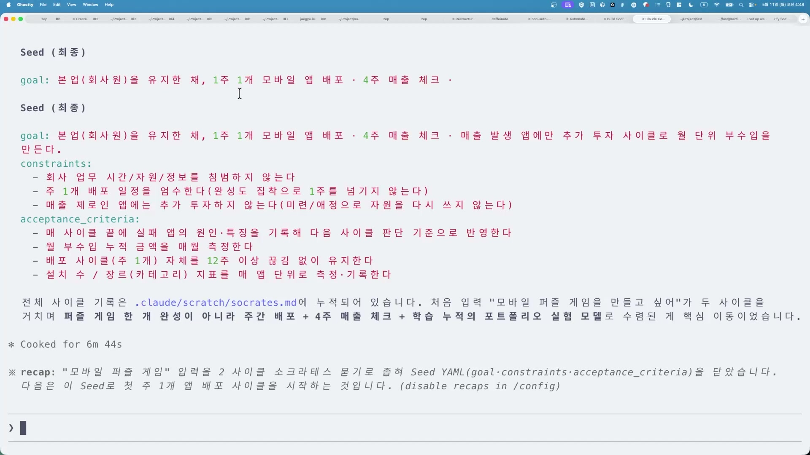
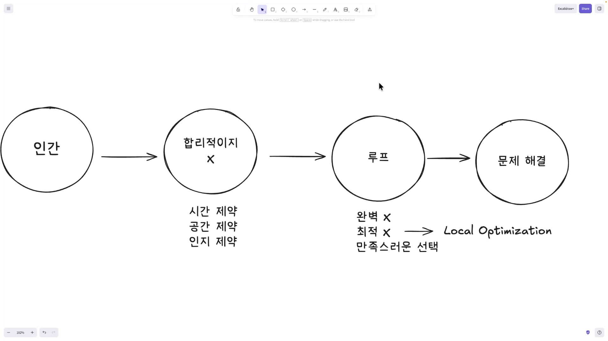
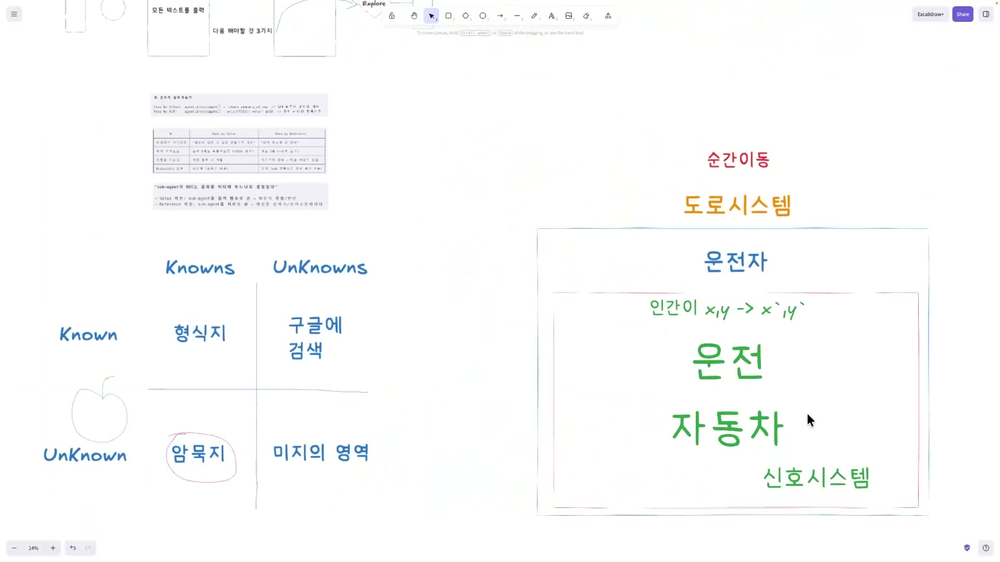
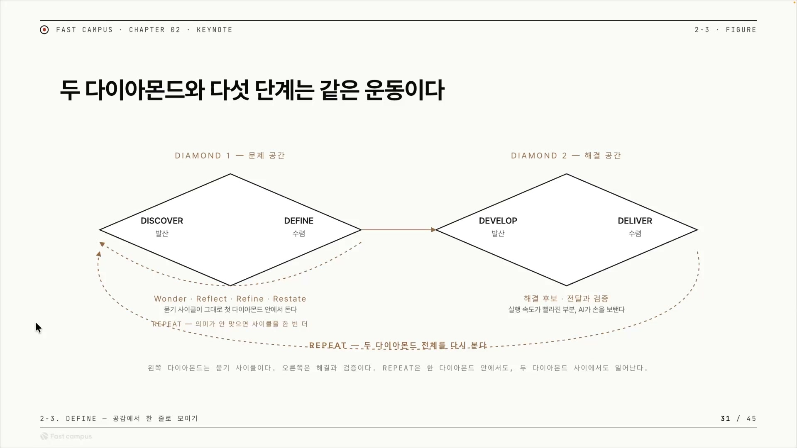
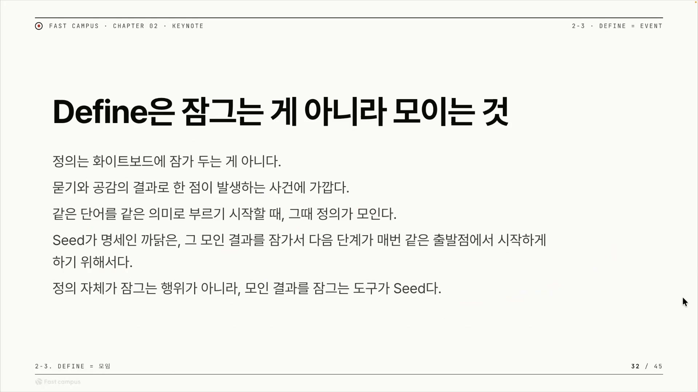

AI에게 일을 시켜본 사람이라면 한 번쯤 겪는 장면이 있다. 처음엔 척척 만들어내던 에이전트가, 작업이 길어질수록 슬슬 엉뚱한 방향으로 흘러간다. 분명 "이것만 고쳐"라고 했는데 회차를 거듭할수록 옆 폴더까지 손대고, 처음 의도와 점점 멀어진다. 이 강의는 그 문제의 뿌리를 앞단에서 찾는다. 무엇을 만들지(What)를 단단히 모으는 일, 그러니까 더블 다이아몬드에서 Define이라 부르는 단계가 흔들리면 그 뒤가 다 흔들린다는 것이다.

강의의 출발점은 앞 클립까지 써온 방법의 한계다. 거기서는 소크라틱 리즈닝, 즉 묻고 답하며 캐묻는 방식만으로 '시드(Seed)'를 만들어왔다. 시드는 이 강의 시리즈가 쓰는 고유한 말로, 더블 다이아몬드의 첫 다이아몬드(문제 공간)에서 발산과 수렴을 거쳐 응축된 결과물을 가리킨다. 외부의 표준 디자인 용어가 아니라 이 강의 안에서 정의된 개념이다. 아래는 실제로 만들어진 시드가 화면에 뜬 모습이다.

강사의 진단은, 소크라틱 리즈닝만으로는 부족했다는 것이다. 묻고 답하는 방식의 밑바닥에는 "충분히 캐물으면 인간이 완벽한 답에 도달할 수 있다"는 가정이 깔려 있다. 그런데 그 가정이 틀렸다면? 여기서 강사는 전혀 다른 전제에서 출발한 한 사람을 끌어온다.

## 인간은 완벽할 수 없다, 허버트 사이먼의 제한된 합리성

허버트 사이먼(Herbert A. Simon, 1916\~2001)은 한 분야에 가두기 어려운 인물이다. 1978년 노벨 경제학상을 받았고, 1975년에는 컴퓨터과학의 노벨상이라 불리는 튜링상을 앨런 뉴얼과 공동 수상했다. 흔히 "최초의 인공지능 프로그램"으로 불리는 Logic Theorist(1955\~56)도 그의 작품인데, 이것 역시 뉴얼, 클리프 쇼와 함께 만든 것이다. 강의가 사이먼을 "경제도 잘하고 최초의 AI도 만든 사람"으로 세운 것은 사실에 부합한다. 다만 튜링상과 최초의 AI 모두 단독이 아니라 공동 작업이었다는 점은 짚어둘 만하다.

흥미로운 건 그가 노벨상을 받은 이유 자체다. 수상 사유는 "경제 조직 내부의 의사결정 과정에 대한 선구적 연구"였다. 즉 이 강의가 지금 다루려는 개념, 제한된 합리성과 만족화가 바로 그 수상 업적이다. AI 시대의 방법론을 말하는데 그 뿌리를 AI를 처음 만든 사람에게서, 그것도 의사결정 연구로 노벨상을 받은 사람에게서 끌어오니 권위의 이전이 절묘하게 맞아떨어진다.

사이먼의 핵심 주장은 이렇다. 인간은 합리적이지 못하다. 전통 경제학이 가정하는, 모든 선택지를 따져 최선을 계산해내는 완벽한 행위자가 될 수 없다는 것이다. 왜냐하면 우리의 판단은 세 가지 제약 안에 갇혀(bounded) 있기 때문이다.

- **시간 제약**: 결정에 쓸 수 있는 시간은 한정돼 있다.
- **정보 제약**: 가진 정보가 늘 불완전하다.
- **인지 제약**: 머릿속에서 따질 수 있는 계산량에 한계가 있다.

(강의에서는 두 번째를 '정보'라 했다가 라이브 중에 '공간'으로 고치는 장면이 나오는데, 사이먼의 표준 세 제약은 정보 · 인지 · 시간이다. 강사가 든 "어디든 확확 돌아다닐 수는 없다"는 직관도 결국 '정보를 다 모으러 다닐 수 없다'는 뜻이니, 정보 제약으로 읽는 게 원전에 맞다.)

세 제약이 있으니 한 번에 완벽한 답을 못 낸다. 그럼 완벽 대신 '최적(optimal)'을 노리면 되지 않을까? 강사는 여기서도 고개를 젓는다. 최적도 답이 아니라는 것이다. 사이먼의 처방은 완벽도 최적도 아닌 제3의 길, <strong>만족스러운 선택(satisficing)</strong>이라는 것이다.

satisficing은 satisfy(만족시키다)와 suffice(충분하다)를 합친 사이먼의 조어다. 모든 대안을 소진해 최댓값을 찾는 대신, 미리 정해둔 기준선을 처음으로 넘는 선택지가 나오면 거기서 멈추고 채택하는 전략이다. "충분히 좋은(good enough)" 답에서 멈추는 것. 강의는 이걸 "만족스러운 선택"으로 옮겼는데 정확한 번역이다. 다만 '기준선을 넘으면 멈춘다'는 메커니즘까지 짚으면 개념이 또렷해진다. 완벽주의를 내려놓되 아무 데서나 멈추는 게 아니라, 넘어야 할 선이 있고 그 선을 넘은 첫 대안에서 멈춘다.

강사가 단계별로 완성해가는 이 다이어그램이 사이먼의 논리를 한 장에 압축한다. 인간은 합리적이지 못하니 루프를 돌고, 루프 안에서 만족스러운 선택을 반복하며 문제를 풀어간다. 이 루프가 곧 디자인 씽킹의 루프이자 문제 해결의 방법이라고 강사는 정리한다.

한 가지 덧붙이면, 사이먼이 '최적'을 거부한 1차 이유는 사실 다음에 나올 로컬 최적화 함정 때문이 아니라, 애초에 전역 최적을 계산할 정보와 시간과 인지가 없어서다. 강의는 로컬 최적화를 주된 이유처럼 끌어오는데, 이는 다음 예시(자율주행 온톨로지)로 자연스럽게 넘어가려는 편집상의 선택으로 보인다. 원전의 1차 논리는 '계산 불가능성'이고, 로컬 최적화는 그 위에 얹힌 보강 사례에 가깝다.

## 빨간 박스에 갇히는 일, 로컬 최적화의 함정

그렇다면 왜 최적을 노리는 게 위험한가. 강사는 "저번에 얘기했던 온톨로지 시스템"을 다시 띄운다. 여기서 온톨로지는 철학의 존재론이 아니라 컴퓨터과학 쪽 의미, 즉 '문제 세계에 어떤 것들이 있고 그것들이 어떻게 연결되는가를 구조로 적어둔 지도'에 가깝다. 화면에는 이동수단의 계층이 색깔별로 갈려 있다.

강사의 비유는 이렇다. 도식의 빨간 박스가 우리의 한계점, 지금 갇혀 있는 틀이다. 그리고 진짜 도달하려는 목적지를 그는 플라톤의 말을 빌려 '이데아'라 부른다. (엄밀히 플라톤의 이데아는 '도달하는 목표'라기보다 '이미 완전한 형태로 존재하는 실재'에 가까우니, 여기서는 '진짜 목적지'를 가리키는 느슨한 비유로 받아들이면 된다.)

사람은 이 빨간 박스 안에서 최적화를 한다. 강사가 든 예는 맥라렌이다. '자동차'라는 기존 틀 안에서 성능을 극한까지 끌어올리는 것. 실제로 맥라렌 F1 팀은 차 한 대에 10만 개 넘는 센서를 달고 주말마다 5천만 회 시뮬레이션을 돌리며 0.001초를 깎는다. 그야말로 한 틀 안에서의 완벽한 최적화다. 문제는, 진짜 목적지가 '잘 이동하는 것'이라면 자동차라는 박스 안의 최적화로는 거기 못 간다는 점이다. 도식 맨 위에 '순간이동'이 놓인 게 그 암시다. 테슬라의 자율주행이나 조비 에비에이션의 하늘을 나는 에어택시는 자동차라는 박스 자체를 다시 그리려는 시도다. (다만 강사가 조비나 테슬라를 '정답'이라고 못 박은 건 아니다. 도식 위 예시로 흘려 언급한 정도다.)

이걸 그림으로 떠올리면 더 쉽다. 여러 산골짜기가 있고, 한 골짜기에 서 있는 사람을 상상해보자. 그 골짜기 안에서는 어느 방향으로 가도 위로 올라갈 뿐이라 "여기가 제일 깊다"고 믿는다. 하지만 산 너머에 더 깊은 골짜기가 있을지 모른다. 더 좋은 곳(글로벌 최적)으로 가려면 일시적으로 더 나빠지는 길을 감수하고 산을 넘어야 하는데, 눈앞만 보는 최적화는 그걸 하지 않는다. 빨간 박스가 바로 그 한 골짜기다.

여기서 강사의 표현 하나는 다듬어 읽는 게 좋다. 그는 "최적은 로컬 옵티마이제이션 문제가 있다"고 말하는데, 엄밀히는 최적화 자체가 로컬에 빠지는 게 아니다. 글로벌 최적을 노리는 최적화도 엄연히 최적화다. 함수가 볼록(convex)하면 로컬 최적이 곧 글로벌 최적이라 함정도 없다. 문제가 되는 건 근시안적, 탐욕적으로 눈앞만 보고 최적화할 때다. 강사는 '최적'을 사실상 '근시안적 최적'으로 좁혀 쓴 셈이다. "최적화는 나쁘다"가 아니라 "목적지를 흐릿하게 둔 채 눈앞 최적화부터 달리면 박스에 갇힌다"가 정확한 메시지다. 이건 곧 강의 전체의 주장과도 통한다. 이데아(목적지, 곧 What)를 먼저 또렷이 잡지 않고 How부터 달리면 빨간 박스를 벗어나지 못한다.

## 디자인은 예쁘게 만드는 게 아니라 문제를 푸는 일

지금까지는 부정형의 명제들이 쌓였다. 완벽할 수 없고, 최적은 함정이고, 그래서 만족스러운 선택을 한다. 그런데 "그럼 구체적으로 뭘 하라는 거냐"는 빈칸이 남는다. 강사는 그 빈칸을 사이먼의 디자인 정의로 메운다.

사이먼은 디자인을 이렇게 정의했다.

> "Everyone designs who devises courses of action aimed at changing existing situations into preferred ones."
> (행동의 방향을 짜내어 현재의 상황을 더 선호되는 상황으로 바꾸려는 사람은 누구나 디자인을 하는 것이다.)

《The Sciences of the Artificial》(1969)에 나오는 문장이다. 강사가 옮긴 "디자인은 예쁘게 만드는 게 아니라 문제를 푸는 것, 현재 상태를 더 나은 상태로 옮기는 일"이 바로 이것이다. 사이먼은 디자인을 건축가나 제품 디자이너의 일로 좁히지 않았다. 다리를 놓는 엔지니어, 환자를 치료하는 의사, 조직을 개편하는 경영자가 모두 같은 의미에서 디자인을 한다. 한 가지 미묘한 지점은 원문의 'preferred(선호되는)'다. 강사는 이를 "더 나은"으로 옮겼는데, 사이먼이 말한 건 객관적 '최선'이 아니라 행위자가 '선호하는' 상태다. 이 미묘함이 앞의 satisficing과 정확히 짝을 이룬다. 최선이 아니라 충분히 만족스러운 쪽으로 옮겨가는 것.

이 정의는 두 가지를 동시에 한다. 첫째, 만족화와 결이 맞는다. '최선'이 아니라 '더 나은' 상태로의 이동이니까. 둘째, '한 번에 완벽'을 포기한 자리에 '여러 번 옮겨가기'를 자연스럽게 깔아준다. 그래서 강사는 "처음부터 문제를 정확히 알 수 없고, 한 번의 루프로 해결하는 건 불가능하다"로 넘어간다. 제한된 합리성의 직접적인 귀결이다. 문제 자체를 처음엔 모르니 단발에 끝낼 수가 없다.

그러니 여러 번 돌려야 한다. 강사는 여기서 "lean하게, agile하게 여러 번 돌리고, 쉬핑이 빨라야 한다는 것들이 옛날부터 소프트웨어 개발 방법론으로 나왔다"고 말한다. 한 가지 분명히 해둘 것은, lean과 agile은 사이먼이 말한 게 아니라는 점이다. 애자일 선언은 2001년, 린 스타트업은 2011년에 나왔다. 사이먼의 1969년 디자인관보다 한참 뒤의 별개 흐름이고, 사이먼의 정신을 후대가 소프트웨어 실무로 구체화한 후예에 가깝다. 강의가 "사이먼이 다 말한 것처럼" 압축한 부분은 계보로 풀어 읽는 게 맞다. 사이먼이 사상의 토대를 놓았고, lean과 agile이 그 위에 세워졌다.

그 계보의 종착점에서 강사는 사이먼의 말을 빌려 못을 박는다. 문제 해결은 직선이 아니라 발산과 수렴을 반복하는 곡선이어야 한다고. 그리고 그 곡선이 바로 더블 다이아몬드의 시초라고. ('곡선'이라는 그림 자체는 사이먼의 원문이라기보다 후대 디자인 씽킹의 시각 언어에 가깝다는 점은 염두에 두자.)

## 더블 다이아몬드, 문제 공간을 먼저 해결 공간을 나중에

더블 다이아몬드는 영국 Design Council이 2005년 정립한 디자인 프로세스 모델이다. LEGO, Sony, Starbucks 등 선도 기업들의 디자인 과정을 연구한 'Eleven Lessons'의 산물로, 다이아몬드 두 개가 각각 발산했다가 수렴하는 모양을 그린다. 네 단계는 Discover(발견) · Define(정의) · Develop(개발) · Deliver(전달)다.

강사는 첫 번째 다이아몬드를 문제 공간, 두 번째 다이아몬드를 해결 공간으로 정의한다. 모델의 핵심 규율이 "문제를 제대로 이해하기 전에 해결로 건너뛰지 마라"인데, 이게 강의 제목 'How 전에 What 잠그기'와 정확히 포개진다. 단계를 따라가 보자.

**Discover(첫 발산).** 인간이 "나 뭘 하고 싶다"는 트리거를 던지면서 시작된다. AI 이전의 더블 다이아몬드에서는 이 시간에 공감 쌓기(empathy building)를 한다. 사람들과 만나 유저 인터뷰를 하고, 어떤 문제가 있는지부터 넓게 발산하며 찾는다. 이건 표준 더블 다이아몬드의 Discover 활동과 정확히 일치한다. 문제를 단정하지 말고 그 문제의 영향을 받는 사람들과 시간을 보내라는 것.

**Define(첫 수렴).** 조사를 마치면 문제 하나를 집어 정의한다. 표준에서도 Define은 Discover의 발산을 종합(synthesis)해 도전 과제를 새롭게 재구성하는 수렴 지점이다. 발산으로 넓힌 것을 한 점으로 좁히는 자리. 강의 제목 'Define 고정하기'가 가리키는 바로 그 지점이며, 첫 다이아몬드의 끝점이자 두 번째 다이아몬드로 넘어가기 전의 관문이다.

**Develop(둘째 발산).** 문제를 인식하고 넘어와 다시 발산한다. "이 문제를 어떻게 풀까"를 여러 방법론으로 고민하는 시간이다. 여기서 강사는 AI를 끼워 넣는다. 다양한 페르소나를 도입해 시뮬레이션을 돌려, Define에서 잡은 아이디어가 정말 먹힐지 미리 검증하는 그림이다. 예로 든 도구가 MiroFish인데, 입력 자료와 질문을 넣으면 서로 다른 성격을 가진 수천 개의 AI 에이전트를 만들어 가상 환경에서 상호작용시키고 그 집단 반응을 관찰하는 군집 지능 엔진이다. 다만 MiroFish의 본래 용도는 여론이나 사건 전개 예측이지 제품 검증 전용 도구는 아니다. 강사는 '다양한 페르소나로 미리 돌려본다'는 발상의 예시로 끌어온 것이다.

**Deliver(둘째 수렴).** 해결책을 만들어 실제로 내보내는 단계, 쉬핑(shipping)이다. 강사가 가장 힘주어 말하는 부분이 여기다. AI가 들어오면서 이 단계가 굉장히 빨라졌다는 것. 다음 장에서 따로 볼 만한 변화다.

여기서 강사가 표준 위에 얹은 자기 해석을 구분해둘 필요가 있다. 슬라이드에 보이는 소크라틱 리즈닝 5단계(wonder, reflect 등)를 4D 단계에 대입한 것, 시드를 첫 다이아몬드의 정착점으로 본 것, AI 페르소나 시뮬레이션을 Develop에 배치한 것, 그리고 REPEAT 루프를 강조한 것은 모두 이 강의 시리즈 고유의 덧칠이다. 표준 더블 다이아몬드에는 이런 5단계 대입이 없다. 특히 강사는 "이 REPEAT은 한 다이아몬드 안에서도, 두 다이아몬드 사이에서도 일어난다"고 명시하는데, 이 이중 루프 강조가 강사가 표준 도식에 얹은 가장 분명한 추가다.

## How가 싸졌으니 What이 병목이 된다

두 번째 다이아몬드, 특히 Deliver에 AI가 들어오면서 무엇이 달라졌는가. 강사의 진단은 한 줄로 압축된다. 만드는 일(How)이 싸지고 빨라졌기 때문에, 무엇을 만들지(What)가 상대적으로 더 중요해졌다.

이제 우리는 툴 콜로 개발한다. 툴 콜은 LLM이 글만 쓰는 게 아니라 직접 파일을 고치고 명령을 실행하도록 손발을 달아주는 장치다. 그래서 개발자뿐 아니라 비개발자도, 충분히 적극적이라면 LLM과 대화해 코드를 짤 수 있는 상황이 됐다. 다만 이 대목은 균형을 잡아 읽어야 한다. 자연어로 지시해 작동하는 코드를 얻는 일이 실제로 가능해진 건 맞지만, 무엇을 만들지 정의하고 결과가 맞는지 판단하고 드리프트를 막는 일은 여전히 사람 몫이다. 쉬워진 건 코드 타이핑이지 판단이 아니다. 강사가 딜리버 설명 한가운데서 "여기서부터 여기까지 인간이 어떤 형태로 터치를 잡았는가, 어떤 인텐션을 가졌는가가 굉장히 중요해졌다"고 끼워 넣은 게 바로 이 전환점이다.

이 감각을 잘 전하는 인용이 제프리 헌틀리의 비유다. 지금 개발은 물레 위에 올라간 찰흙과 같다는 것. 마음에 안 들면 다시 뭉쳐 물레에 던지고 계속 돌린다. (강의 자막의 '물리'는 '물레(wheel)'의 받아쓰기 오류로 보인다.) 헌틀리는 같은 프롬프트를 AI 코딩 에이전트에 무한히 먹이는 'Ralph loop' 패턴으로 알려진 엔지니어인데, 그의 핵심 통찰은 "반복의 비용이 너무 싸져서, 벽돌 한 장씩 신중히 쌓던 옛 개발 모델이 더는 말이 안 된다"는 것이다. 만들기의 비용이 무너진 것이다.

비용이 무너진 작업은 더 이상 경쟁력의 원천이 아니다. 그러면 무엇을 만들지 정하는 일과 결과를 보고 방향을 잡는 판단이 병목이자 차별점으로 남는다. 그런데 강사는 여기서 한 걸음 더 나간다. Deliver로 얻은 결과(output)를 다시 첫 인풋(input)으로 넘겨야 한다는 것이다. 그래야 첫 다이아몬드부터 다시 시작하며 무엇을 놓쳤는지 찾는다. 이 output에서 input으로의 되먹임을 강사는 컴파운드 엔지니어링에 빗댄다. 무엇이 통하고 무엇이 실패했는지를 체계적으로 포착해 시스템에 다시 주입함으로써, 이후의 AI 출력이 시간이 갈수록 좋아지게 만드는 방식이다. 이 되먹임 루프를 실제로 굴려주는 틀이 하네스(harness)다. 하네스는 에이전트에서 모델을 뺀 나머지 실행 계층 전부를 가리킨다(에이전트 = 모델 + 하네스). 사람이 매번 개입하지 않아도 오래 자율로 도는 것이 롱 러닝 하네스다.

그런데 바로 여기서 역설이 생긴다. 루프가 돌수록, 자율로 오래 돌수록, 에이전트는 드리프트한다.

## Define은 잠그는 게 아니라 모이는 것

드리프트(drift)는 비유가 아니라 AI 업계의 측정된 현상이다. 에이전트가 긴 작업을 수행하는 동안 원래의 목표와 역할에서 점진적으로 벗어나는 행동 이탈을 말한다. 처음에 받은 지시문이 쌓여가는 맥락에 묻혀 비중이 줄어들고, 수백 수천 번의 상호작용을 거치며 작은 어긋남이 누적된다. 한 논문(Evaluating Goal Drift in Language Model Agents)은 가장 잘하는 모델조차 약 10만 토큰까지는 목표를 거의 완벽히 지키지만, 평가한 모든 모델이 어느 정도는 목표 드리프트를 보였다고 보고한다. 더 중요한 진단은 이것이다. 더 좋은 모델, 더 많은 도구, 더 큰 컨텍스트 창만으로는 해결되지 않는다. 드리프트는 모델을 키워서가 아니라 기준을 고정해서 막아야 한다.

그 기준이 바로 시드다. 강사는 시드를 에이전트에게 넘길 때 이뮤터블(immutable), 즉 불변으로 만들어야 한다고 말한다. 한 번 모인 시드는 작업 중간에 누구도 슬쩍 고치지 못하게 못 박아 두고, 그 고정된 시드를 기준으로 에이전트가 구현하게 한다. 내용을 바꿔야 하면 새 버전으로 통째로 다시 만들어 다시 못 박는다. 원본은 그 자리에서 수정되지 않는다. 이렇게 하면 작업이 길어져 맥락이 쌓여도 '원래 무엇을 만들기로 했는가'라는 닻이 흔들리지 않는다. 드리프트는 그 닻이 맥락에 묻혀 흐려질 때 생기니, 닻을 못 박아두는 게 가장 직접적인 방어다. 이 발상은 사양을 단일 진실의 출처로 두고 AI가 거기서 코드를 끌어내게 하는 스펙 주도 개발(spec-driven development)과 같은 줄기다.

여기서 강사가 말을 고치는 한 장면이 이 강의 전체의 핵심이다. "시드를 잘 잠그는 게 중요하고, 잠근다라는 거라기보다는, 우리가 발산하고 수정하면서 생긴 결과를 시드로 보는 겁니다." Define을 '잠그기'로 이해하면 마치 맨 앞에서 정답을 못 박고 시작하는 것처럼 들린다. 그건 사이먼의 제한된 합리성과 정면으로 충돌한다. 처음엔 완벽히 알 수 없으니까. 그래서 강사는 Define을 '모이기'로 다시 정의한다. 발산과 수정과 반복을 거친 끝에 자연스럽게 응축된 산물. 이게 더블 다이아몬드에서 Define이 본래 놓인 자리, 곧 첫 다이아몬드의 수렴점과 정확히 일치한다.

모순처럼 보이는 두 말, "잠그지 마라"와 "잠가라"는 사실 타이밍이 다르다. Define을 하는 동안은 잠그지 않고 모은다(발산과 수렴을 반복하며). Define이 끝나 에이전트에게 넘기는 순간부터는 불변으로 잠근다. 정리하면 "잠그지 말고 모아라, 그리고 다 모였으면 잠가라"가 정확한 메시지다. 제목의 '잠그기'는 이 두 박자를 압축한 슬로건이고, 본문의 정정은 그 '잠그기'가 첫 단계의 못 박기로 오해되지 않도록 보정하는 장치인 셈이다. 제목은 결과(잠긴 시드)를, 본문은 과정(모여서 잠기기까지)을 말한다.

그래서 강사는 좋은 시드를 모으는 도구로 챕터 2에서 만든 인터뷰 하네스가 중요해졌다고 마무리한다. 시드도 인터뷰 하네스도 이 강의 시리즈가 정의한 고유 개념이라는 점은 기억해두자. AI 덕분에 쉬핑이 쉬워졌으니 승부처는 앞단의 Define으로 옮겨갔고, 그 Define을 잘하는 일이 다음 클립의 과제로 남는다.

이 챕터를 한 줄로 모으면 이렇다. 인간은 처음부터 완벽한 정의를 못 하고(사이먼), 그래서 발산과 수렴으로 모아야 하며(더블 다이아몬드), 모으는 일의 가치는 만드는 비용이 무너진 AI 시대에 오히려 더 커졌다(딜리버 가속). 그렇게 모인 결과가 시드이고, 그 시드를 불변으로 고정해야 AI가 원래 의도에서 드리프트하지 않는다. Define은 못 박는 일이 아니라 모이는 일이다. 다만 다 모였으면, 그때는 단단히 잠가야 한다.

## 외우고 넘어갈 핵심

이 챕터에서 흐름을 걷어내고 남는 개념은 여섯 개다.

### 제한된 합리성 (bounded rationality)

인간은 완벽한 판단을 내릴 수 없다. 판단이 세 가지 제약 안에 갇혀 있기 때문이다.

- **시간 제약**: 결정에 쓸 수 있는 시간이 한정돼 있다.
- **정보 제약**: 가진 정보가 늘 불완전하다.
- **인지 제약**: 머릿속에서 따질 수 있는 계산량에 한계가 있다.

시간 · 정보 · 인지, 이 세 단어만 붙잡으면 된다.

### 만족화 (satisficing)

satisfy(만족)와 suffice(충분)를 합친 사이먼의 조어다. 모든 대안을 다 따져 최댓값을 찾는 대신, **미리 정해둔 기준선을 처음 넘는 선택지가 나오면 거기서 멈추고 채택한다.** 최고(optimal)가 아니라 "충분히 좋은(good enough)" 답에서 멈추는 전략이다. 완벽주의를 내려놓되, 아무 데서나 멈추는 게 아니라 넘어야 할 선이 있다는 게 핵심이다.

### 로컬 최적화의 함정 (local optimization)

눈앞에서 좋아지는 방향으로만 올라가다, 작은 언덕 하나에 갇혀 산 너머 진짜 정상을 못 보는 것. 도식의 빨간 박스가 그 작은 언덕이다. "자동차"라는 틀 안에서 성능을 극한까지 끌어올려도(맥라렌), 진짜 목적이 "잘 이동하기"라면 자동차 박스 바깥(순간이동, 하늘을 나는 에어택시)의 정상엔 닿지 못한다. 더 좋은 곳으로 가려면 일시적으로 더 나빠지는 길을 감수하고 산을 넘어야 하는데, 눈앞만 보는 최적화는 그걸 하지 않는다.

### 더블 다이아몬드 4단계 (double diamond)

발산과 수렴을 두 번 반복하는 디자인 프로세스. 첫 다이아몬드는 문제 공간, 둘째 다이아몬드는 해결 공간이다.

| 단계 | 무엇을 하나 |
|---|---|
| Discover (첫 발산) | 문제를 단정하지 않고 넓게 찾는다. 유저 인터뷰, 공감 쌓기. |
| Define (첫 수렴) | 발산한 것을 종합해 문제 하나로 좁혀 정의한다. |
| Develop (둘째 발산) | "어떻게 풀까"를 여러 방법으로 펼친다. AI 페르소나로 미리 검증하기 등. |
| Deliver (둘째 수렴) | 해결책을 만들어 실제로 내보낸다(쉬핑). |

규율은 하나다. **문제를 제대로 이해하기 전에 해결로 건너뛰지 마라.** 이게 'How 전에 What 잠그기'와 정확히 포개진다.

### How가 싸지니 What이 병목

AI로 만드는 일(How)이 싸지고 빨라졌다. 비용이 무너진 작업은 더 이상 경쟁력의 원천이 아니다. 그래서 무엇을 만들지(What) 정하는 일과, 결과를 보고 방향을 잡는 판단이 병목이자 차별점으로 남는다. 한 줄로, **How는 흔해졌고 What이 귀해졌다.**

### 드리프트와 그 처방 (drift)

드리프트는 에이전트가 긴 작업을 수행하는 동안 원래의 목표와 역할에서 조금씩 벗어나는 현상이다. 비유가 아니라 측정된 실제 현상이고, 더 좋은 모델이나 더 큰 컨텍스트 창만으로는 막히지 않는다. 처방은 기준을 고정하는 것이다. 다 모인 시드를 이뮤터블(immutable, 불변)로 못 박아 두고, 내용을 바꿔야 하면 새 버전으로 통째로 다시 만들어 다시 못 박는다. 그래서 이 챕터의 결론은 한 줄로 모인다. Define은 잠그는 게 아니라 모이는 것이고, **모으는 동안은 잠그지 않다가 다 모이면 그때 잠근다.**

