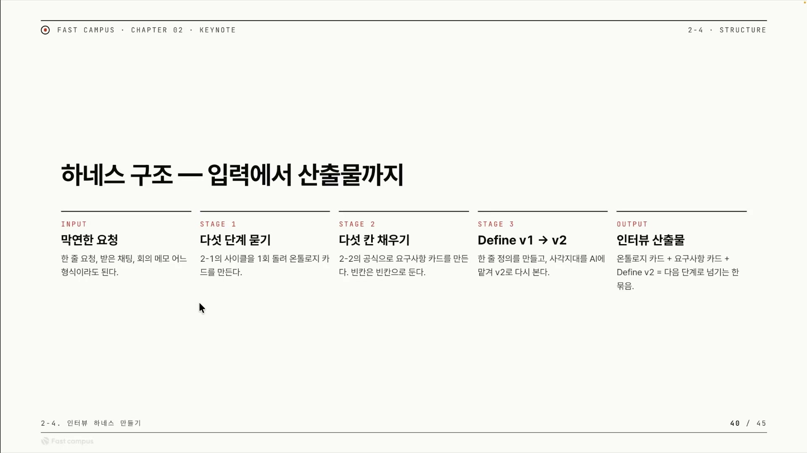
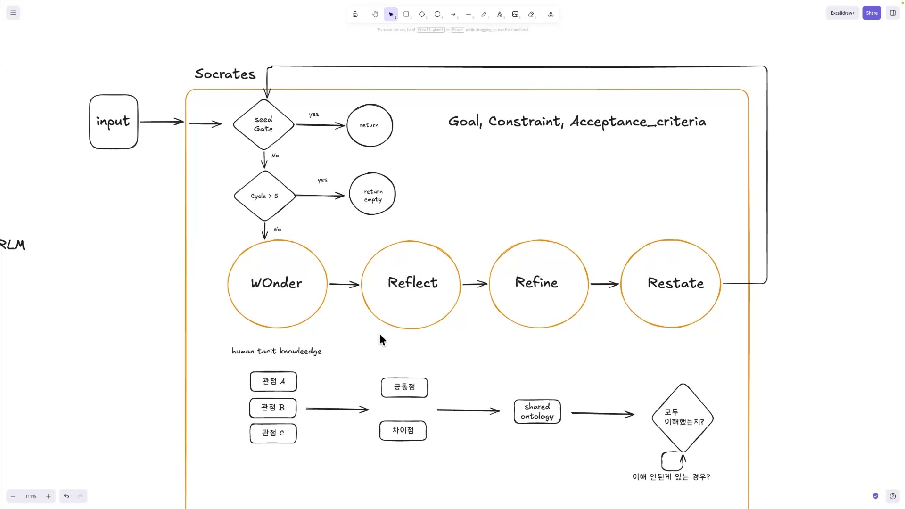
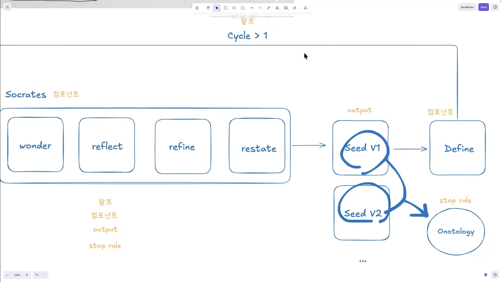
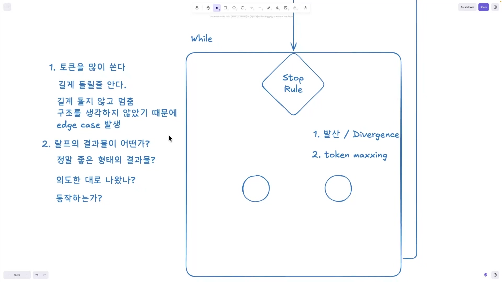
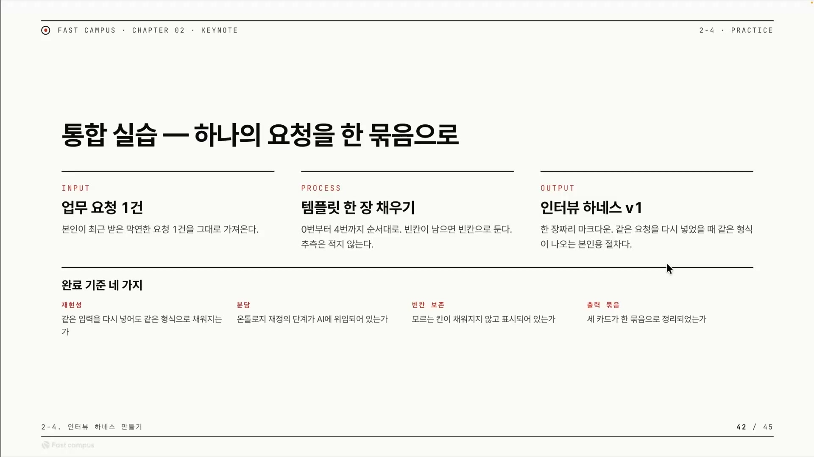

같은 질문을 두 번 던지면 LLM은 두 번 다른 답을 준다. 어제 GPT에게 "회원 가입 기능 만들어줘"라고 했을 때와 오늘 같은 문장을 넣었을 때, 돌아오는 설계는 미묘하게 다르다. 모델이 변덕스러워서가 아니다. 매 호출이 어텐션 윈도우 안에서 처음부터 새로 추론되는, 서로 독립된 사건이기 때문이다. 강의의 표현을 빌리면 LLM은 멱등(idempotent)하지 않다. 멱등성이란 같은 연산을 몇 번을 반복해도 결과가 같은 성질을 말하는데, LLM에는 그게 없다.

그렇다면 답을 똑같이 만들려는 시도는 애초에 방향이 틀렸다. 강의가 잡는 목표는 다르다. 답의 내용을 고정하는 게 아니라, 답이 담길 그릇 즉 형식을 고정하는 것. 같은 요청을 넣으면 매번 같은 모양의 산출물이 나오게 만드는 외부 구조, 그걸 이 강의는 하네스(harness)라고 부른다. 말 그대로 날뛰는 말에 씌우는 마구다. 모델의 추론 자체는 자유롭게 두되, 입력에서 출력까지의 절차와 출력의 형식만 단단히 묶는다.

이 글은 그 첫 단추인 인터뷰 하네스를 설계하는 강의를 정리한 것이다. 막연한 업무 요청을 캐물어 구조화된 요구사항으로 바꾸는 장치다. 강사가 분명히 못박는데, 이 클립은 도구 사용법 시연이 아니라 설계 사상 강의다. 코드는 한 줄도 안 나오고, 화이트보드에 그림만 그린다. 그래서 정리도 그림을 따라간다.

## 막연한 요청에서 산출물까지, 다섯 단계

인터뷰 하네스는 입력에서 출력까지 다섯 칸으로 나뉜다.



- **INPUT 막연한 요청** : 한 줄짜리 요청이든, 받은 채팅이든, 회의 메모든 어떤 형식이라도 들어온다. 정제되지 않은 날것 그대로다.
- **STAGE 1 다섯 단계 묻기** : 사람에게 캐묻듯 다섯 단계로 질문을 던져(소크라틱 리즈닝) 요청을 이해한다. 그 결과로 온톨로지 카드를 만든다.
- **STAGE 2 다섯 칸 채우기** : 정해진 공식으로 요구사항 카드를 만든다. 핵심 원칙 하나가 여기 박혀 있다. 빈칸은 빈칸으로 둔다.
- **STAGE 3 Define v1 → v2** : 한 줄 정의를 만든 뒤, 사람이 놓친 사각지대를 AI에게 맡겨 v2로 다시 본다.
- **OUTPUT 인터뷰 산출물** : 온톨로지 카드, 요구사항 카드, Define v2를 한 묶음으로 묶어 다음 단계로 넘긴다.

두 가지 설계 원칙이 이 슬라이드 안에 숨어 있다. 하나는 "빈칸은 빈칸으로 둔다"다. 모르는 항목을 AI가 그럴듯하게 지어내지 않고 비워 둔다는 뜻이다. 이게 환각을 막는 첫 번째 방어선이다. 다른 하나는 "사각지대를 AI에 맡긴다"다. 사람은 자기가 무엇을 모르는지 모른다. 그 사각지대(blind spot)를 v1에서 v2로 다시 보는 단계에서 AI가 메운다. 사람과 AI가 각자 잘하는 부분을 나눠 갖는 구조다.

## 묻는 기계, Socrates

다섯 단계 묻기를 실제로 굴리는 부품이 Socrates다. 강사가 앞 챕터에서 만든 네 개의 서브 스킬을 묶어 오케스트레이션하는 상위 스킬인데, 이름은 철학자가 아니라 소크라테스의 문답법에서 따왔다. 하나의 정답을 주입하는 게 아니라, 여러 각도에서 캐물어 이해를 끌어낸다는 뜻이다.



네 개의 서브 스킬은 순서가 있다.

```
Wonder → Reflect → Refine → Restate  ( → Repeat? 의미 안 맞으면 한 번 더)
```

Wonder는 묻는 단계, Reflect는 답을 비춰보는 단계, Refine는 다듬는 단계, Restate는 다시 진술하는 단계다. 그리고 의미가 맞지 않으면 한 번 더 돈다(Repeat). 마지막의 이 반복이 중요한데, 강의 전체를 관통하는 한 문장이 여기서 나온다. 정의는 한 번에 끝나지 않는다. 강사 본인도 시드를 한 번 더 돌려보고 나서야 골과 기준과 제약이 더 또렷이 보였고, 빠뜨렸던 것과 모호했던 부분을 다시 잡을 수 있었다고 회고한다.

Wonder 위에는 마름모가 두 개 박혀 있다. 묻기 루프로 들어가기 전에 두 번 거르는 관문이다.

- **seed Gate** : 입력이 이미 시드로 충분히 명확한지 본다. 충분하면 더 묻지 않고 곧장 return한다. 명확한 요청까지 다섯 단계 캐묻는 건 낭비니까.
- **Cycle > 5** : 다섯 번을 넘겨 돌면 빈 값을 반환하고(return empty) 빠져나온다. 무한 루프를 막는 안전장치, 즉 가드레일이 스킬 안에 이미 박혀 있는 셈이다.

오른쪽 위에 적힌 `Goal, Constraint, Acceptance_criteria`는 이 묻기 사이클이 채우려는 대상이다. 시드가 담아야 할 세 가지, 목표와 제약과 성공 기준이다.

다이어그램 아래쪽에는 별도의 흐름이 하나 더 그려져 있다. 여러 관점(A, B, C)을 모아 공통점과 차이점을 추리고, 그걸 shared ontology(공유 온톨로지)로 합의한 다음, "모두 이해했는가?"를 검증해 이해 못한 게 남으면 다시 도는 흐름이다. 이게 소크라틱이라는 이름의 진짜 핵심이다. 한 사람의 관점을 정답으로 못박지 않고, 여러 관점을 캐물어 합의된 이해에 도달시킨다. 강사가 이걸 "인간의 암묵지를 꺼내는 일"이라고 부르는데, 뒤에서 다시 나온다.

## 한 장으로 복사해 쓰는 템플릿

이론을 한 장의 양식으로 떨어뜨린 게 강사가 제공하는 템플릿이다. 그대로 복사해 채워 넣으면 된다.

```markdown
# Interview Harness v1

## 0. 입력
- 받은 요청 (원문 그대로):

## 1. 묻기 사이클 — 다섯 단계
- Wonder  :
- Reflect :
- Refine  :
- Restate :
- Repeat? : (의미 안 맞으면 한 번 더)

## 2. 요구사항 다섯 칸
- 누가                 :
- 누구를 위해          :
- 무엇을               :
- 언제까지             :
- 어떻게 다 됐다고 보나 :
```

1번 묻기 사이클은 Socrates가 끌어낸 질적 이해를 적는 칸이고, 2번 다섯 칸은 그 이해를 구조화된 명세로 굳히는 칸이다. 다섯 칸은 막연한 요청을 구체화하는 격자다. 누가(주체), 누구를 위해(수혜자), 무엇을(작업), 언제까지(기한), 그리고 어떻게 다 됐다고 보나.

마지막 칸이 유독 무겁다. 작업이 "끝났다"를 무엇으로 판정할지를 미리 못박는 칸이기 때문이다. 이게 곧 Definition of Done(완료 기준)이고, 뒤에 나올 Stop Rule과 그대로 이어진다. 끝의 기준을 시작에서 정하지 않으면 끝을 판정할 수 없다는 게 이 칸의 메시지다.

## 시드는 한 세대로 끝나지 않는다

여기서 시드(Seed)라는 개념이 본격적으로 등장한다. 시드는 요구사항의 씨앗이다. 앞서 본 목표와 제약과 성공 기준을 담는다. 그리고 한 번 만들고 끝이 아니라, V1에서 V2로, V2에서 V3로 세대를 거듭하며 진화한다. 이렇게 다시 먹여 다음 세대로 개선하는 걸 강의는 이볼브(evolve)라고 부른다.



사이클이 도는 방식은 첫 바퀴와 그 이후가 다르다. 첫 바퀴(Cycle 0)는 사람이 직접 입력을 넣어 시작한다. 두 번째 바퀴부터(Cycle ≥ 1)는 Define을 거친 결과가 다시 위로 올라가 Socrates로 재진입한다. 첫 바퀴는 사람이, 이후 바퀴는 시스템이 스스로 시드를 다시 먹여 돌리는 셈이다(self-feeding). 이게 강사가 말하는 "정의는 한 번에 안 끝난다"의 실제 메커니즘이다.

세대가 늘어나면 그저 쌓이기만 하는 게 아니다. 각 세대에서 온톨로지(ontology)를 따로 뽑는다. 온톨로지는 개념과 관계를 구조화한 지도라고 보면 된다. 그리고 세대 간 온톨로지를 비교한다. V1의 온톨로지와 V2의 온톨로지가 얼마나 같아졌는지를 본다는 뜻이다. 이 비교가 곧 "수렴했는가"의 판정 재료가 되고, 다음 절의 Stop Rule로 직결된다.

이 설계는 강사의 즉흥 발명이 아니다. 강사가 직접 인용한다. "우로보로스에서는 시드 유사도를 온톨로지를 따로 뽑아 체크했다." 우로보로스(Ouroboros)는 제 꼬리를 무는 뱀의 상징을 딴 자기개선형 AI 에이전트 기법으로, Do → Learn → Improve → Retry를 연속으로 돌리며 연속 세대의 온톨로지 유사도가 임계치(대표 구현에서는 0.95) 이상이면 수렴으로 보고 멈춘다. 평가 출력이 다음 세대 시드의 입력이 되는 구조까지 강의와 정확히 겹친다. 강의의 시드 진화는 이 패턴을 그대로 가져온 것이다.

## 무한 루프를 언제 끊을 것인가

시드를 계속 이볼브하는 구조는 본질적으로 `while` 무한 루프다. 그래서 가장 어려운 질문이 남는다. 언제 끝낼 것인가. 이 판정을 맡는 게 Stop Rule(정지 규칙)이고, 다이어그램에서 마름모(필터)로 들어간다.



정지 신호로 삼는 건 앞에서 뽑은 온톨로지의 수렴점이다. 세대별 온톨로지를 비교해 더 이상 변하지 않는 지점에 닿으면 멈춘다. 우로보로스의 "유사도가 임계치를 넘으면 수렴"과 같은 발상이다.

Stop Rule을 제대로 못 주면 두 가지로 망한다. 다이어그램 오른쪽에 적힌 두 실패다.

- **발산(Divergence)** : 규칙이 없거나 느슨하면 결과물이 수렴하지 못하고 계속 갈라져 끝나지 않는다.
- **token maxxing** : 진전은 없는데 토큰만 끝없이 태운다.

토큰을 많이 쓴다는 것 자체는 좋은 일도 나쁜 일도 아니다. 양면이 있다. 진전 없이 토큰만 쓰면 token maxxing이라는 실패다. 반대로 의미 있게 오래 돈다면 그건 길게 돌릴 줄 안다는 뜻이고, 사실 길게 돌리는 건 쉬운 일이 아니다. 우로보로스가 긴 목표에 8시간씩 도는 것처럼 말이다.

길게 못 돌고 중간에 멈추는 이유가 무엇인지를 강사는 콕 집는다. 자기가 생각한 구조를 충분히 안 짰기 때문이다. 화이트보드 글씨 그대로 옮기면 "길게 돌지 않고 멈춤, 구조를 생각하지 않았기 때문에 edge case 발생"이다. 구조의 빈칸에서 엣지 케이스가 터지고, 거기서 루프가 스턱(stuck) 된다. 그래서 외부 기법인 랄프(Ralph) 루프에서도 가드(guard)를 써서 너무 일찍 멈추는 걸 막는다.

랄프 루프는 Geoffrey Huntley가 2025년 제안한 기법으로, AI 코딩 에이전트를 `while` 루프로 감싸 작업이 끝날 때까지 반복하는 것이다. 이름은 심슨의 랄프 위검에서 왔다. 똑똑하지는 않아도 끈질김으로 끝내 해낸다는 뜻이다. 매 반복마다 컨텍스트를 새로 시작해 컨텍스트 고갈을 피하고, 진행 상태는 git 이력이나 파일 같은 외부 저장소에 남긴다. 강의의 "while 루프 + 외부 상태 + 가드"가 정확히 이 골격이다.

정리하면 강의의 무한 루프 설계는 두 외부 기법을 합친 모양이다. 루프를 끈질기게 굴리는 골격은 랄프 루프에서, 언제 멈출지를 온톨로지 수렴으로 판정하는 부분은 우로보로스에서 가져왔다.

루프를 멈춘 뒤에는 산출물이 쓸 만한지를 본다. 다이어그램 왼쪽에 세 질문이 적혀 있다.

1. 정말 좋은 형태의 결과물인가?
2. 의도한 대로 나왔나?
3. 동작하는가?

이 세 질문이 사실상 출력 품질의 완료 기준이다.

## 모든 하네스는 네 부분으로 환원된다

강사가 화이트보드 전체를 되짚으며 일반화하는 대목이 이 강의의 가장 재사용성 높은 부분이다. 인터뷰 하네스든 다른 어떤 하네스든, 결국 네 요소로 환원된다.

| 요소 | 다이어그램에서 가리키는 것 | 뜻 |
|---|---|---|
| **랄프** | 루프 전체(`while`) | 하네스가 도는 생명 주기. 언제 시작하고 언제 끝나는가 |
| **Component** | 각 스킬 박스(Socrates, Define 등) | 루프 안에서 엮이는 부품들 |
| **Output** | 시드와 산출물 노드 | 각 단계가 내놓는 결과물 |
| **Stop Rule** | 비교와 판정 로직(마름모) | 언제 멈출지 정하는 규칙 |

위 통합 다이어그램의 좌하단 색상 범례가 바로 이 네 요소를 그림 각 부분에 매핑한 것이다(랄프, 컴포넌트, output, stop rule). 강사는 Stop Rule을 곧 Definition of Done이라고 부른다. "이 랄프가 언제 종료하고, 랄프 안에서 무엇이 들어오고 무엇이 나오는지"를 정의하는 일이라는 뜻이다. 결국 하네스를 짠다는 건 네 가지 질문에 답하는 일이다. 무엇이 돌고(랄프), 무엇으로(Component), 무엇을 내고(Output), 언제 끝나는가(Stop Rule).

이 네 요소를 한 단계 더 밀고 나가면 4C 스택이 나온다고 강사는 예고하지만, 이 클립에서는 내용을 공개하지 않는다. 차기 무료 세미나와 앞으로의 문서형, 분업형, MCP형 하네스에서 다룰 예정이라고만 한다. 그러니 4C 스택이 곧 이 네 요소라고 단정할 수는 없다. 네 요소에서 더 나아간 무엇이고, 공개는 다음으로 미뤄졌다는 정도로만 알아 두면 된다. (강사가 덧붙이는 확장 하나는 입력이 무엇인지 검증하는 단계인데, 지금은 마크다운으로 진행하므로 AI가 스스로 인터프리터처럼 그 구조를 읽게 둔다.)

## 결국 빈칸을 채우는 건 사람이다

강사가 클립을 닫으며 못박는 결론이 있다. "저는 이런 하네스를 만드는 데 있어서 구조를 짜는 게 제일 중요하다고 봅니다." 도구도 프롬프트도 모델도 아니라 구조 설계가 본질이라는 것. 이 클립이 코드 한 줄 없이 화이트보드에만 매달린 이유이기도 하다.

그 결론이 가장 압축된 곳이 세 층위의 구분이다.

| 무엇을 | 무엇으로 메우나 |
|---|---|
| 인간의 암묵지를 꺼내는 일 | 하네스로 할 수 있다 |
| 그 모호함의 갭을 메우는 일 | 하네스로 할 수 있다 |
| 그러나 구조의 빈칸을 채우는 일 | 하네스를 세팅하는 사람의 몫 |

말로 표현되지 않은 지식과 모호함까지는 하네스가 자동으로 메운다. 그러나 어떤 구조를 짤지, 그 빈칸의 설계는 끝까지 사람의 책임이다. 앞에서 본 "구조의 빈칸에서 엣지 케이스가 터진다"와 정확히 호응한다. 구조를 잘못 짜면 그 빈틈에서 버그와 스턱이 난다. AI가 어디까지 하고 사람이 어디서부터 하는가, 그 경계를 강사는 여기에 그어 둔다.

마지막으로 강사가 청중에게 내주는 실습이 이 모든 걸 한 장으로 닫는다.



본인이 최근 받은 막연한 요청 한 건을 그대로 가져와(INPUT), 템플릿 한 장을 0번부터 4번까지 채우되 빈칸이 남으면 빈칸으로 두고 추측은 적지 않으며(PROCESS), 같은 요청을 다시 넣어도 같은 형식이 나오는 한 장짜리 마크다운을 만든다(OUTPUT). 그게 잘 됐는지 판정하는 완료 기준이 네 가지다.

| 기준 | 판정 질문 |
|---|---|
| **재현성** | 같은 입력을 다시 넣어도 같은 형식으로 채워지는가 |
| **분담** | 온톨로지 재정의 단계가 AI에 위임되어 있는가 |
| **빈칸 보존** | 모르는 칸이 지어내지 않고 빈칸으로 표시되어 있는가 |
| **출력 묶음** | 세 카드(온톨로지, 요구사항, Define)가 한 묶음으로 정리되었는가 |

네 기준의 첫머리가 재현성인 게 우연이 아니다. 글의 출발점이었던 그 문제, 같은 요청에 매번 다른 답을 내는 LLM의 비결정성으로 정확히 되돌아온 것이다. 인터뷰 하네스가 결국 풀려던 건 그 하나였다. 답을 똑같이 만들 수는 없어도, 답이 담길 형식만은 매번 똑같이 만든다.

이 클립은 여기까지가 설계다. 이 산출물을 기반으로 온톨로지를 실제로 뽑고 Stop Rule을 정하는 구현은 다음 클립으로 넘어간다. 어떻게 우아하게 루프를 종료할 것인가가 그 주제다.

## 외우고 넘어갈 핵심

### 하네스의 네 요소

어떤 하네스든 결국 이 네 가지로 환원된다. 이름만이 아니라 각자 맡는 일까지 묶어서 외운다.

| 요소 | 맡는 일 |
|---|---|
| 랄프 | 루프 전체(`while`). 무엇이 돌고, 언제 시작해 언제 끝나는가 |
| Component | 루프 안에서 엮이는 부품들. Socrates, Define 같은 스킬 박스 |
| Output | 각 단계가 내놓는 결과물. 시드와 산출물 노드 |
| Stop Rule | 언제 멈출지 정하는 규칙. 강사 말로는 Definition of Done |


### Stop Rule을 잘못 주면 생기는 두 실패

정지 규칙이 없거나 느슨하면 둘 중 하나로 망한다. 이 둘이 곧 Stop Rule이 왜 필요한지의 답이다.

- 발산(Divergence) : 결과물이 수렴하지 못하고 계속 갈라져 끝나지 않는다.
- token maxxing : 진전은 없는데 토큰만 끝없이 태운다.


---

**출처**

- Ralph 루프 (Ralph technique): [everything is a ralph loop (ghuntley.com)](https://ghuntley.com/loop/), [snarktank/ralph (GitHub)](https://github.com/snarktank/ralph), [Ship Features in Your Sleep with Ralph Loops (geocod.io)](https://www.geocod.io/code-and-coordinates/2026-01-27-ralph-loops)
- Ouroboros (자기개선 에이전트, 온톨로지 유사도 수렴): [Q00/ouroboros (GitHub)](https://github.com/Q00/ouroboros), [Ouroboros: An Autonomous Self-Improving AI Agent (tomrochette.com)](https://blog.tomrochette.com/agi/ouroboros-an-autonomous-self-improving-ai-agent/)
