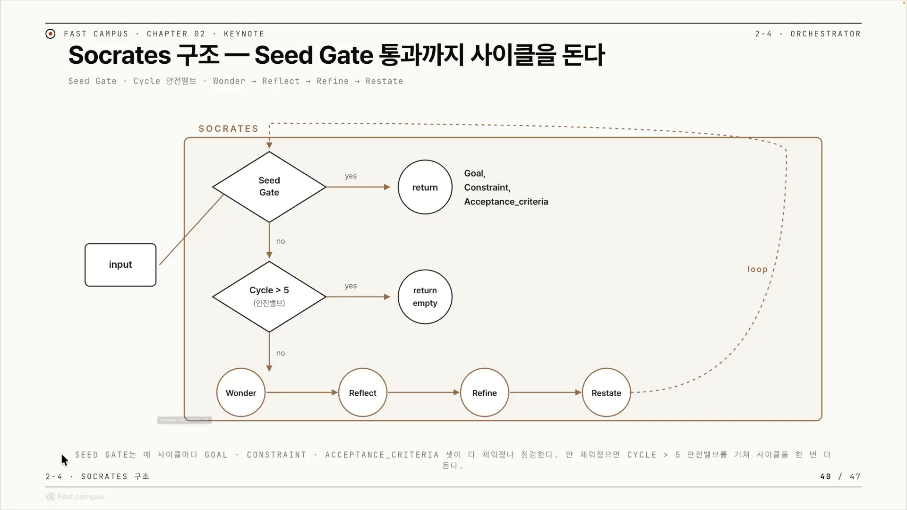
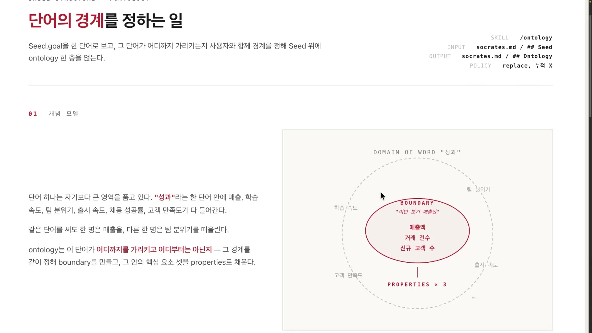
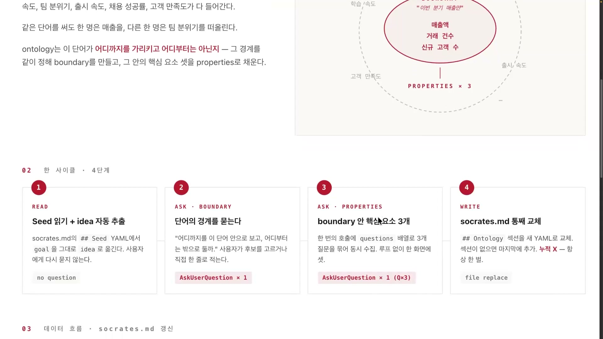
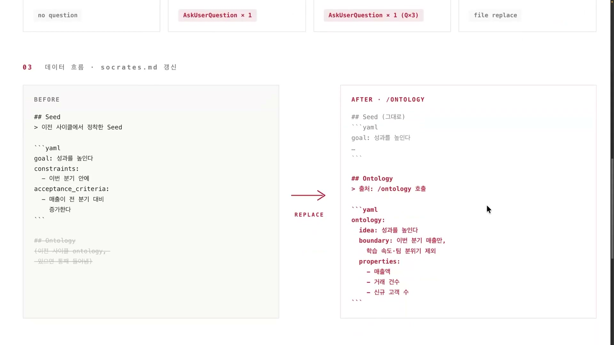
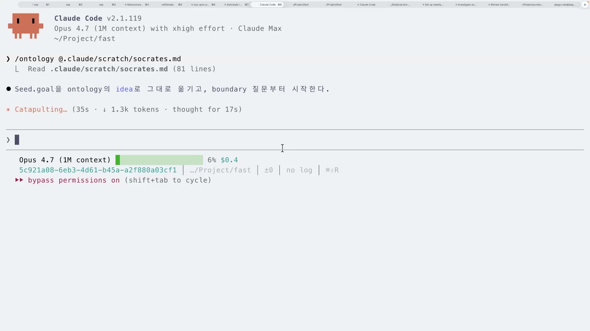
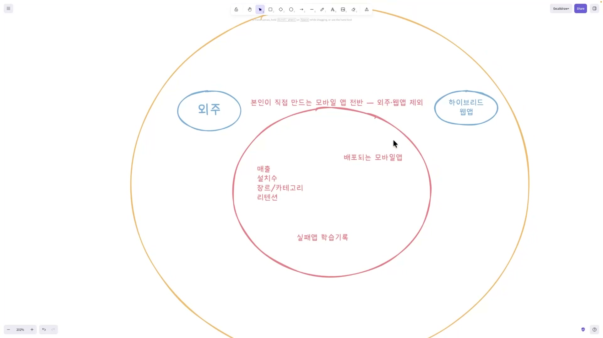
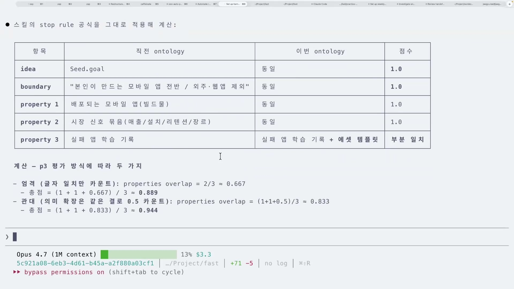

사람에게 무언가를 물어보는 AI를 만들 때 가장 답하기 어려운 질문은 "무엇을 물을까"가 아니다. "언제 그만 물을까"다. 질문을 던지는 규칙은 짜기 쉽다. 그런데 대화가 어디까지 가야 충분한지, 어느 지점에서 손을 떼야 하는지는 사람도 잘 모른다. 보통은 진행하던 사람이 "이만하면 됐다" 싶을 때 멈춘다. 이 강의(인터뷰 하네스 구축 시리즈 Chapter 4의 두 번째 클립)가 다루는 질문이 정확히 그것이다. 제목 그대로, 어디까지 묻고 어디서 멈출 것인가.

인터뷰 하네스는 AI가 사람에게 질문을 던져 막연한 아이디어를 구조화된 설계 씨앗(Seed)으로 뽑아내고, 그 씨앗을 반복해서 다듬어 가는 자동화 루프다. 사람이 인터뷰이, AI가 인터뷰어다. 루프인 이상 멈출 조건이 반드시 있어야 한다. 이 클립이 내놓는 멈춤 조건은 사람의 눈대중이 아니라 숫자다. 두 번 연속 뽑은 결과가 거의 같아지면 멈춘다.

전체 그림을 먼저 보면 부품은 셋이다. 사람의 아이디어를 질문으로 파고드는 소크라테스 스킬, 그 결과에서 단어의 경계를 잡아내는 온톨로지 스킬, 그리고 두 번 연속 뽑은 경계가 거의 같아지면 멈추라고 판정하는 스탑 룰. 앞의 둘이 인터뷰를 돌리고, 마지막 하나가 그 루프를 끝낸다.

## 소크라테스 스킬: 질문 루프, 그리고 맨 앞에 둔 멈춤 장치

소크라테스 스킬은 사람의 아이디어를 질문으로 파고들어 씨앗으로 정제하는 4단계 반복 루프다. 네 단계는 Wonder, Reflect, Refine, Restate. 이 네 개를 한 바퀴 도는 것이 한 사이클(강사는 이 루프를 "Ralph 루프"라고 부른다)이고, 한 바퀴를 돌면 씨앗 하나가 나온다.

구조에서 눈여겨볼 곳은 4단계 자체가 아니라, 그 4단계 앞에 놓인 마름모다. 그림에서 input이 들어오면 곧장 Wonder로 가지 않는다. 먼저 Seed Gate라는 검문소를 지난다.

Seed Gate는 루프의 종료 조건을 루프 맨 앞에 둔 장치다. 강사는 이걸 프로그래밍의 상식으로 설명한다. 무한 루프를 돌릴 때 종료 조건을 루프 뒤쪽에 두면, 조건이 충족돼 끝나야 할 상황에서도 본문이 한 번 더 실행돼 버린다. 그래서 검사를 맨 앞에 둔다. 조건이 충족됐으면 그 자리에서 바로 빠져나가고(return), 아니면 4단계로 들어간다.

여기에 안전밸브가 하나 더 있다. 그림의 아래쪽 마름모, Cycle > 5다. 멈출 조건이 끝내 충족되지 않아도, 사이클이 5번을 넘으면 빈 값을 돌려주고 강제로 끝낸다. 멈춤 조건(위)과 횟수 상한(아래)이 위아래로 루프를 가둔다. 이게 없으면 강사 표현으로 "그냥 삥삥 돈다", 토큰만 태우며 영원히 도는 것이다.

한 사이클이 만들어 내는 씨앗은 세 칸짜리다.

| 필드 | 뜻 |
|---|---|
| goal | 사람이 이루려는 목표 |
| constraints | 그 목표에 걸린 제약 |
| acceptance_criteria | 무엇을 충족하면 됐다고 볼지의 합격 기준 |

이 씨앗이 저장돼서, 다음 단계인 온톨로지 추출의 입력이 되고, 나중에 다른 씨앗과 비교하는 단위가 된다. 그리고 소크라테스 루프 하나는 그 자체로 더 큰 하네스 안에 부품으로 박힌다. 작은 루프를 엮어 큰 루프를 만드는 식이다. 다음 두 부품이 바로 이 위에 얹힌다.

## 온톨로지: 단어의 경계를 긋는 일

온톨로지라는 단어를 들으면 거창한 지식 그래프 같은 걸 떠올리기 쉽지만, 이 강의에서 쓰는 뜻은 훨씬 좁고 분명하다. 온톨로지는 한 단어가 어디까지를 가리키고 어디부터는 아닌지, 그 경계를 긋는 일이다.

왜 경계가 문제가 되는가. 한 단어는 사람마다 다른 그림을 떠올리게 하기 때문이다. 강사는 이전 클립에서 든 사과 예시를 다시 가져온다. 내가 "사과"라고 말하며 떠올린 건 초록 사과인데, 듣는 사람은 빨간 사과를 떠올린다. 같은 단어를 써도 머릿속 모습이 다르다. 그래서 경계를 그어야 뜻이 하나로 좁혀진다.

"성과"라는 단어를 예로 들어 보자. 이 단어 안에는 학습 속도, 고객 만족도, 팀 분위기, 출시 속도가 다 들어간다. 너무 넓어서 그대로는 다룰 수가 없다. 여기서 경계를 "이번 분기 매출만"으로 좁혔다고 하자. 그러면 그 안에서 매출액, 거래 건수, 신규 고객 수라는 구체적인 속성들이 따라 나온다.

핵심은 순서다. 경계가 먼저고, 속성은 그 다음이다. 경계가 바뀌면 속성도 바뀐다. 만약 "성과"를 매출이 아니라 학습 속도로 경계 지었다면, 따라 나오는 속성들도 전부 달라졌을 것이다. 속성은 경계에 매여 있다. 경계라는 한계를 인정하고 나서야 비로소 구체적인 속성이 나온다는 것, 이게 온톨로지가 말하는 인과다.

그래서 이 시스템에서 온톨로지는 세 칸으로 이루어진다.

| 요소 | 뜻 | "성과" 예시 |
|---|---|---|
| idea | 다루려는 대상 자체 | 성과를 높인다 |
| boundary | 그 대상의 포함과 제외 경계 | 이번 분기 매출만 |
| properties | 경계 안에서 나오는 핵심 속성들 | 매출액, 거래 건수, 신규 고객 수 |

여기서 idea는 철학에서 말하는 이데아가 아니라, 그냥 다루려는 대상을 담는 칸 이름이다. 인터뷰 하네스에 온톨로지가 필요한 이유도 여기서 분명해진다. 인터뷰가 결국 하려는 일은, 사람이 막연하게 던진 단어의 경계를 AI와 함께 좁혀 가는 것이기 때문이다. 그 좁히는 작업을 자동화하는 게 다음 부품, 온톨로지 스킬이다.

## 온톨로지 스킬: 경계 긋기를 파이프라인으로

온톨로지 스킬은 앞의 개념을 그대로 코드로 옮긴 것이다. 씨앗을 읽어서, 단어의 경계를 묻고, 그 안의 핵심 속성을 뽑은 뒤, 씨앗 문서의 온톨로지 부분을 갈아 끼운다.

흐름은 이렇다. 먼저 씨앗 문서(`socrates.md`)의 `## Seed`에서 사람의 목표(goal)를 읽어, 그대로 온톨로지의 idea로 옮긴다. 이 단계에선 사람에게 다시 묻지 않는다. 그 다음 "이 단어를 어디까지로 보고 어디부터는 밖으로 둘까"를 사람에게 묻고(boundary), 정해진 경계 안에서 핵심 속성을 묻는다(properties). 강사는 데모에서 속성을 3개로 잡지만, 이건 보여주려고 정한 숫자지 고정 규칙은 아니라고 분명히 말한다. 실무라면 더 많이 잡을 것이고, 유사도 임계값을 높이면 더 정교해진다.

마지막 단계는 사이클을 여러 번 돌릴 때를 대비한 장치다.

사이클이 여러 번 돌면 문제가 생긴다. 매번 온톨로지를 씨앗 문서에 덧붙이면(append), 같은 섹션이 계속 쌓여 문서가 부풀고 중복된다. 해결은 단순하다. 덧붙이지 말고 온톨로지 섹션을 통째로 갈아 끼운다(replace). 그림의 왼쪽(BEFORE)에서 기존 `## Ontology` 섹션은 취소선으로 지워지고, 오른쪽(AFTER)에는 idea, boundary, properties가 새로 채워진 YAML이 그 자리에 들어선다. AI가 같은 문서를 반복해서 건드릴 때 문서가 비대해지는 흔한 문제를, 누적 대신 교체로 막는 것이다.

뽑은 온톨로지를 누구를 위해 만드느냐도 짚어 둘 만하다. 강사는 이걸 사람이 읽을 산출물이 아니라, 다음 사이클의 AI에게 씌워 주는 렌즈로 본다. 온톨로지가 "AI가 무엇에 집중해야 하는지"를 결정하는 시야가 되는 것이다. 예를 들어 합격 기준에 "매출이 전 분기 대비 증가"가 들어오면, 이걸 받은 다음 AI는 온톨로지라는 렌즈를 통해 "도대체 무엇 때문에 증가하는지"를 들여다볼 수 있다. 강사는 이 렌즈 발상을 우로보로스(Ouroboros) 프로젝트에서 가져왔다고 밝힌다.

## 스탑 룰: 직관 대신 수치로 멈춘다

이제 처음의 질문으로 돌아온다. 어디까지 묻고 멈출 것인가. 답은 이렇다. 두 번 연속 뽑은 온톨로지의 유사도가 임계값을 넘으면 멈춰라.

논리는 명료하다. 인터뷰를 한 사이클 더 돌렸는데도 새로 뽑힌 온톨로지가 직전 것과 거의 같다면, 더 물어봐도 새 정보가 안 나온다는 뜻이다. 새 질문이 더 이상 새로운 경계나 속성을 만들지 못하는 순간, 그게 멈출 때다. 비교 대상은 씨앗 전체가 아니라 거기서 뽑은 온톨로지(idea, boundary, properties)의 유사도다.

임계값은 원래 0.95다. 강사가 우로보로스 룰에서 가져온 값이다. 다만 0.95로 두면 수렴까지 씨앗이 너무 많이 필요해 루프가 오래 돈다. 그래서 데모에서는 0.85로 낮췄다. 임계값이 원칙과 데모에서 갈린다는 건 강사가 솔직하게 밝힌 부분이고, 그만큼 이건 상황에 맞춰 조절하는 파라미터라는 뜻이다.

멈춤의 방식 자체도 들여다볼 대목이다. 강사의 말을 옮기면, 온톨로지 유사도로 수치화를 해 놓고 그걸 기반으로 디터미니스틱하게(deterministic, 같은 입력이면 같은 판정이 나오게) 이 루프를 멈출지 계속할지 정한다는 것이다. 사람이 보고 "이 정도면 멈춰야겠다" 하는 게 아니라, 그 판단을 AI에게 위임한다.

이게 이 클립의 중심 긴장이다. 한쪽엔 사람의 직관적 멈춤이 있다. 다른 한쪽엔 수치 수렴에 의한 자동 멈춤이 있다. "어디까지 물을까"라는 본래 주관적인 판단을, 유사도 수치와 임계값이라는 객관적 기준으로 바꿔 시스템에 넘긴 것이다. 그러면 사람이 지켜보지 않아도 자동 인터뷰 루프가 스스로 "충분히 물었는지"를 판정한다. 앞서 본 Seed Gate의 사이클 상한이 "최대 한도"로 위에서 막는다면, 스탑 룰은 "수렴하면 조기 종료"로 아래에서 끝낸다. 둘이 한 쌍이다.

## 모바일 앱 아이디어로 한 바퀴 돌려 보기

지금까지의 부품을 강사가 실제 아이디어 하나로 돌려 본다. 대상은 "본인이 직접 만드는 모바일 앱"이다.

먼저 터미널에서 온톨로지 스킬을 호출하면, 스킬이 씨앗 문서를 읽고 사람의 목표를 idea로 옮긴 뒤 경계 질문부터 시작한다.

사람이 하는 일은 AI가 던진 선택지에서 고르는 것뿐이다. 경계는 "본인이 직접 만드는 모바일 앱 전반"으로 잡고, 외주와 웹앱은 제외한다. 강사는 이걸 엑스칼리드로우에 그림으로 그려 가며 시각화한다.

바깥의 큰 원은 단어가 품은 전체 영역이고, 그 위쪽에 제외할 외주와 하이브리드 웹앱이 따로 떨어져 있다. 안쪽 원이 정해진 경계다. 그 안에 매출, 설치 수, 장르/카테고리, 리텐션 같은 속성과, 흥미로운 항목 하나인 "실패 앱 학습 기록"이 들어간다.

다음은 진화(Evolve) 단계다. 씨앗과 온톨로지를 입력으로 씨앗 v2를 만들고, 거기서 온톨로지 v2를 다시 뽑는다. 이 두 번째 라운드에서 경계 자체는 거의 그대로 유지되고, 안쪽 속성이 재배치되며 깊어진다. 실패 앱 기록이 단순히 원인을 적는 데서 그치지 않고 다음 사이클에서 재사용할 템플릿으로 저장하는 쪽으로 확장되고, 매출 이전 단계의 신호 같은 항목이 더 들어온다. 강사는 여기서 한 가지를 짚는다. 경계가 안 바뀌었으니 원을 줄일 필요가 없다는 것이다. 만약 경계가 바뀌었다면 그건 재정의, 즉 방향을 트는 피봇이나 확장이라는 뜻이 된다.

이제 마지막, 멈출지 말지를 판정할 차례다. 직전 온톨로지와 이번 온톨로지를 항목별로 비교한다.

| 항목 | 직전 | 이번 | 판정 |
|---|---|---|---|
| idea | 목표 그대로 | 동일 | 일치 |
| boundary | 모바일 앱 전반, 외주 · 웹앱 제외 | 동일 | 일치 |
| property 1 | 배포되는 모바일 앱 | 동일 | 일치 |
| property 2 | 시장 신호 묶음 | 동일 | 일치 |
| property 3 | 실패 앱 학습 기록 | 기록 + 에셋 템플릿화 | 부분 일치 (의미 확장) |

세 속성 중 둘은 그대로고 하나만 의미가 확장됐다. 이걸 어떻게 채점하느냐에 따라 유사도가 갈린다. 글자 그대로 일치만 세는 엄격한 방식으로는 약 0.89, 의미가 이어지는 걸 인정하는 관대한 방식으로는 약 0.94가 나온다.

임계값 0.85를 두 방식 모두 넘었다. 수렴으로 판정, 스탑 룰 통과, Ralph 루프 종료. 사람이 "이만하면 됐다"고 끼어들지 않았는데도, 시스템이 0.89와 0.94라는 숫자만 보고 스스로 멈춘 것이다. 이게 클립 제목의 답이다.

강사 본인도 이 한 번의 루프에 부족한 면이 있다고 인정한다. 이건 완성된 시스템을 발표하는 자리가 아니라 라이브로 만들며 보여 주는 실습이고, 강의 자료의 스킬로 누구나 똑같이 돌려 볼 수 있다. 그래서 이 클립에서 가져갈 것은 특정 수치나 코드가 아니라 사고방식이다. 대화형 AI에게 가장 애매했던 "언제 그만 물을까"를, 직관에서 떼어 내 측정 가능한 공학 문제로 바꿔 놓았다는 것. 온톨로지가 더 이상 안 변하면 멈춘다는 한 줄 규칙이 그 전환의 전부다.

## 외우고 넘어갈 핵심

### 루프의 멈춤 검사는 맨 앞에 둔다

무한 루프를 짤 때 종료 조건을 본문 뒤에 두면, 끝나야 할 상황에서도 본문이 한 번 더 실행된다. 그래서 **멈춤 검사(Seed Gate)를 4단계 본문보다 앞에 둔다**. 게이트의 판정은 세 갈래다.

- 멈출 조건 충족 → 그 자리에서 바로 빠져나간다(return).
- 조건은 미충족이지만 사이클이 상한(예: 5회)을 넘음 → 빈 값을 돌려주고 강제로 끝낸다(안전밸브).
- 둘 다 아니면 → 4단계 본문을 실행한다.

멈춤 조건(정상 종료)과 횟수 상한(강제 종료)이 위아래로 루프를 가둬, 토큰만 태우며 영원히 도는 일을 막는다.

### 온톨로지는 "단어의 경계를 긋는 일"이다

한 단어는 뜻이 여럿이다. '성과'만 해도 학습 속도, 고객 만족도, 팀 분위기, 출시 속도를 다 가리킬 수 있다. 먼저 경계(boundary)를 "2분기 매출"로 좁혀야, 그 안에서 매출액 · 거래 건수 · 신규 고객 수 같은 속성(properties)이 비로소 정해진다. 경계가 바뀌면 속성도 따라 바뀐다. 온톨로지는 이 세 칸으로 이뤄진다.

- idea: 다루려는 대상(예: 직접 만드는 모바일 앱)
- boundary: 그 대상의 포함과 제외 경계
- properties: 경계 안에서 나오는 핵심 속성

### 온톨로지 스킬은 다섯 단계로 돈다

스킬이 Seed를 받아 온톨로지를 채우는 순서다. 이름만이 아니라 각 단계가 하는 일이 핵심이다.

1. READ: 소크라테스가 만든 Seed를 읽는다.
2. 이데아 추출: Seed의 목표(goal)를 온톨로지의 idea로 옮긴다.
3. BOUNDARY: 소크라테스식 질문으로 그 단어의 경계를 묻는다.
4. PROPERTIES: 경계 안에서 핵심 속성을 정한다(데모에선 3개).
5. WRITE: Seed의 ontology 섹션을 통째로 갈아끼운다.

마지막 WRITE에 실전 교훈이 있다. 사이클을 여러 번 돌릴 때 매번 덧붙이는(append) 방식이면 Seed에 온톨로지가 계속 쌓여 지저분해진다. 그래서 자리를 하나 정해 두고 그 칸만 새것으로 통째 교체한다(replace).

### 멈출지는 숫자로 정한다

인터뷰를 한 사이클 더 돌린 뒤, 직전 온톨로지와 이번 온톨로지의 유사도를 잰다.

- 유사도 ≥ 임계값 → 수렴으로 보고 멈춘다(stop).
- 유사도 < 임계값 → 새 정보가 더 있다고 보고 한 번 더 돈다.

임계값은 조절 가능한 값이다(원칙 0.95, 데모에선 0.85). **멈춤 판정을 사람의 눈대중에서 떼어 내 수치로 위임한 것**이 이 클립의 핵심이다.

### 온톨로지는 사람이 아니라 다음 AI가 볼 렌즈다

뽑은 온톨로지는 사람이 읽는 보고서가 아니다. 다음 사이클의 AI에게 "무엇에 집중할지"를 알려 주는 시야로 되먹인다. 산출물을 사람용 문서가 아니라 다음 단계 AI의 입력 렌즈로 설계한다는 발상이, 강사가 우로보로스 프로젝트에서 가져온 부분이다.
