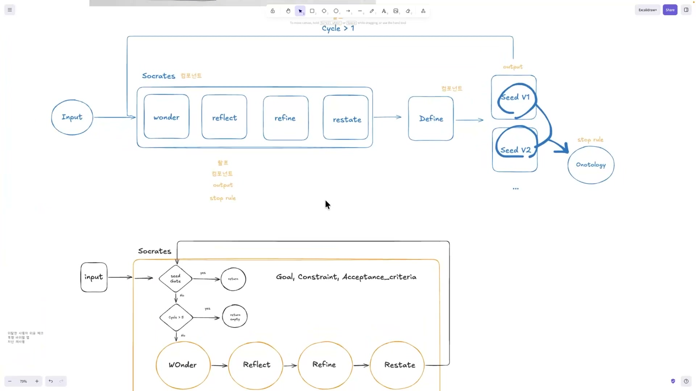
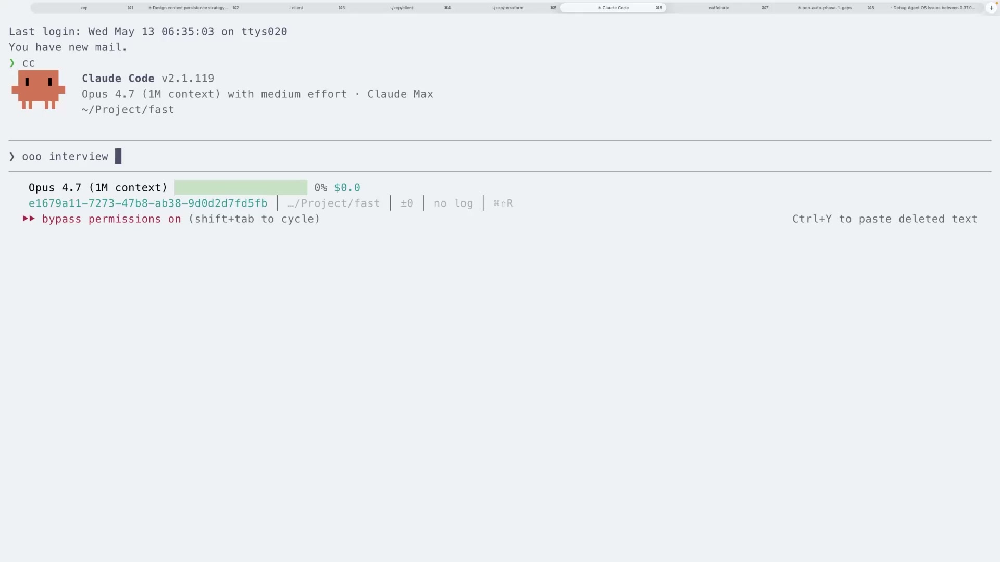
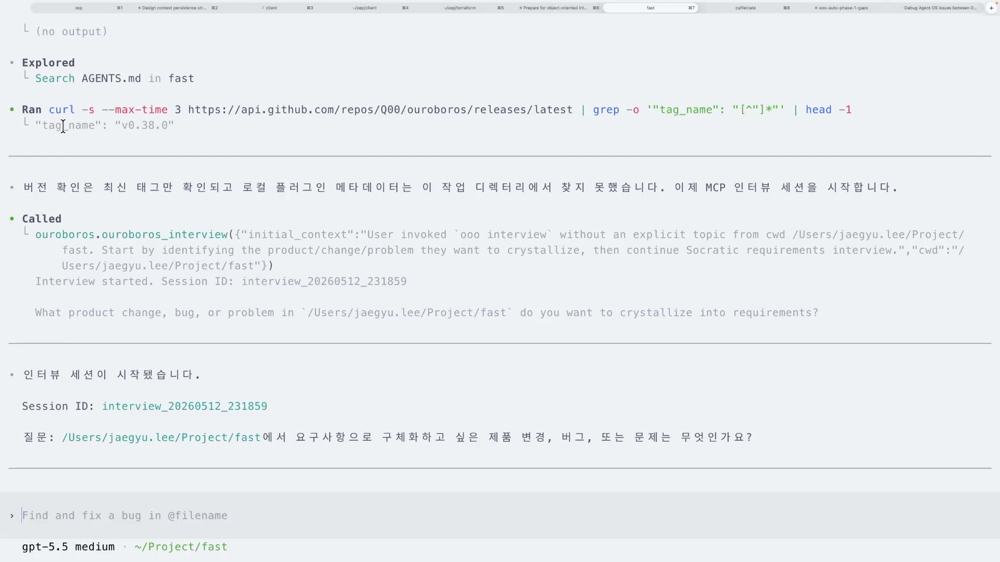
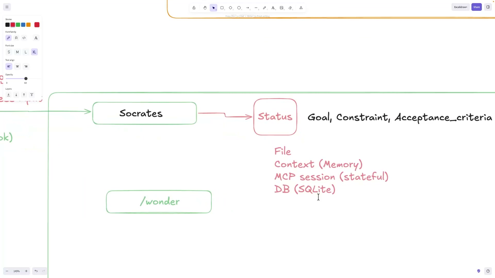
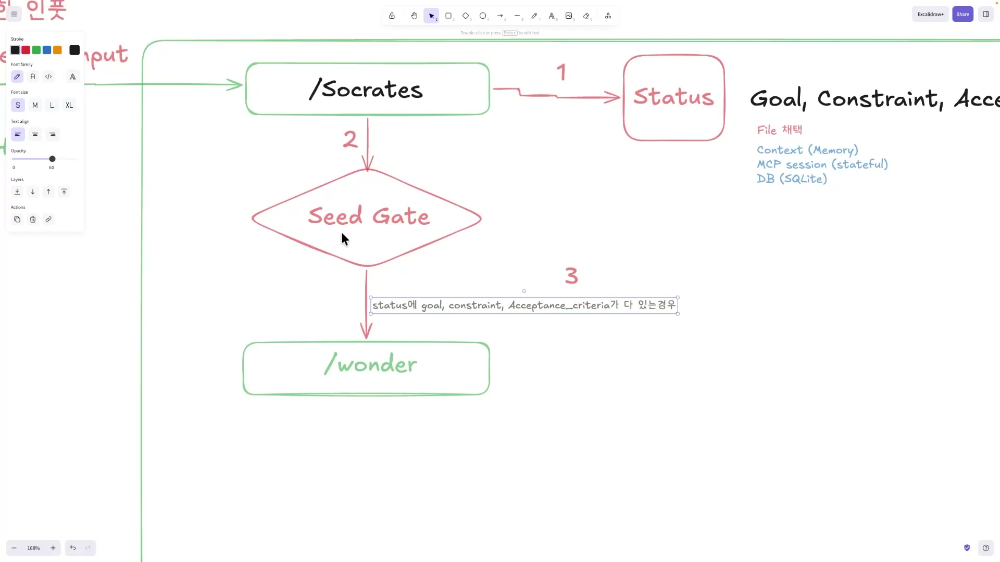
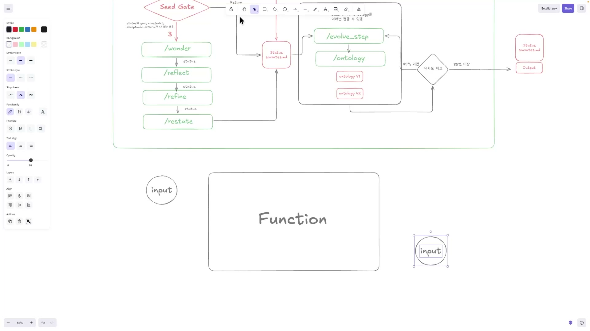
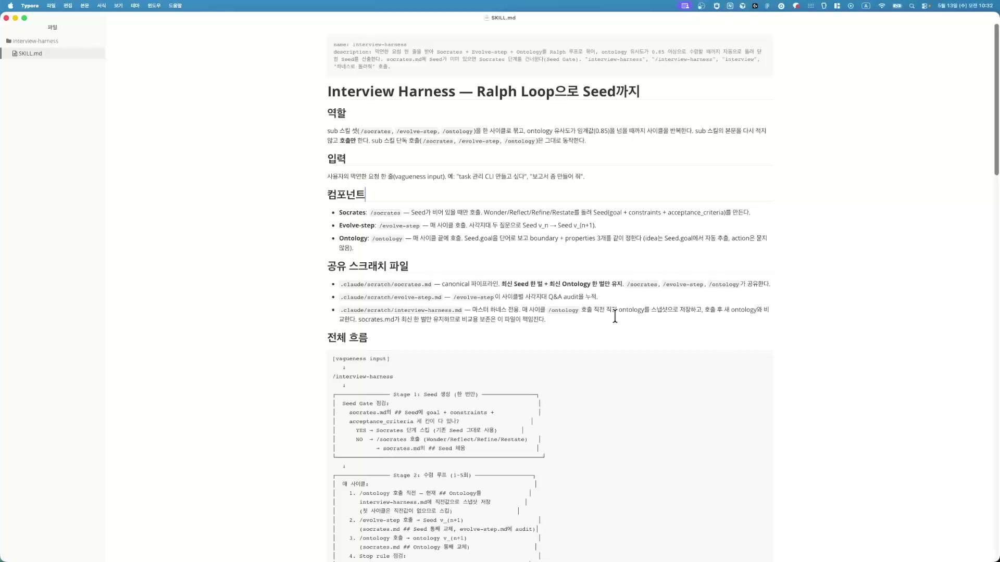

모호한 요청 하나를 또렷한 요구사항으로 바꾸는 일을, 지금까지는 사람이 손으로 했다. "퍼즐게임 만들어줘" 같은 두루뭉술한 말을 받아서, 질문하는 스킬을 한 번 부르고, 생각을 정리하는 스킬을 또 한 번 부르고, 그렇게 깎아낸 내용을 모아 요구사항의 씨앗을 만들고, 거기서 개념 지도를 뽑아 사람이 직접 유사도를 눈으로 확인했다. 강사가 앞 클립까지 보여준 방식이 정확히 이거였다. wonder, reflect, refine, restate를 한 번씩 손으로 돌리고, 더블 다이아몬드(Double Diamond)의 define 단계로 씨앗을 버전업해가며, 온톨로지를 뽑아 비교했다.

다 되긴 된다. 문제는 그게 사람이 매 순간 "지금은 뭘 불러야 하지"를 알고 있어야 굴러간다는 데 있다.

## 부품은 다 있는데, 지휘자가 사람이었다

강사가 직접 짚는 한계가 이거다. "이게 손으로 할 수 있죠. 근데 그것들은 사람이 언제 뭘 써야 될지를 다 알고 있어야 됩니다." 스킬(부품)이 아무리 잘 만들어져 있어도, 지금 단계에서 어느 부품을 호출할지 판단하는 책임이 사람한테 그대로 남아 있으면 부담이 사라지지 않는다. 매번 멈춰서 "다음에 뭐 부르지"를 결정해야 하고, 그 판단이 어긋나면 결과가 샌다.

그 부담을 강사는 비매드(BMAD)를 예로 들어 설명한다. "비매드가 안 좋아졌던 이유도 있어요. 지금 상황에서 누구를 불러야 되지? 어떤 스킬을 호출해야 되지? 이런 문제가 있었어요." 비매드는 역할별로 이름 붙은 에이전트 여섯 명(비즈니스 분석가 Mary, PM John, 아키텍트 Winston 등)을 자연어로 불러 쓰는 프레임워크다. 그런데 단계 전환이 자동이 아니다. 한 단계를 끝낼 때마다 사용자가 "방금 아키텍처 끝냈는데 다음 뭐 해?"라고 직접 물어 다음 에이전트를 확인하고, 그 이름으로 다시 호출해야 한다. 분석에서 계획, 설계, 구현으로 흐르는 제어권을 사람이 손에 쥐고 있어야 한다는 뜻이다. 비매드가 나쁜 도구라는 얘기가 아니라, 흐름을 사람이 들고 가야 하는 구조가 주는 피로의 예다.

그 피로가 어디까지 갔느냐면, 강사는 결국 소프트웨어공학의 애자일 프로세스나 스프린트까지 공부해야 하는 상황이 됐다고 토로한다. 모호한 요청 하나 다듬자고 개발 방법론을 파고들어야 했던 것이다. 러닝 커브가 분명히 있었다.

그래서 이번 클립의 목표는 이 오케스트레이션 자체를 골격에 박아넣는 것이다. 언제 무엇을 호출할지를 시스템이 정하게 만드는 골격, 그게 하네스(harness)다. 사람은 모호한 요청만 던지고, 하네스가 알아서 인터뷰를 돌려 요구사항을 수렴시킨다. 강사는 이 골격을 손으로 코드부터 짜지 않고, 엑스칼리드로(Excalidraw)에 한 컴포넌트씩 그려가며 설계한다. 부품마다 입력과 출력을 따져보고, 그것들을 어떻게 이을지를 그림으로 먼저 잡는 방식이다.



## 어떻게 부를까, 키워드 하나로 통일하기

골격을 그리기 전에 먼저 정할 게 있다. 이 하네스를 무슨 말로 부를 것인가.

문제는 같은 하네스를 부르는 방법이 도구마다 다르다는 점이다. 클로드(Claude)에선 슬래시 커맨드, 코덱스(Codex)에선 달러 표시($), 스킬 자동 호출 등 방식이 제각각이다. 사용자가 도구를 옮길 때마다 "여기선 어떻게 부르더라"를 기억해야 하면 그만큼 마찰이 쌓인다.

강사의 해법은 단순하다. 공통 키워드 하나를 정한다. 강사가 고른 건 `ooo interview`다. 뭔가 직관적이고 입에 붙어서, ooo interview를 치면 인터뷰가 시작되게끔 했다. 이 키워드가 입력에 들어오면 인터뷰 하네스가 시작되도록 가로채는 것이다. 그러면 클로드든 코덱스든 같은 말 한마디로 동일한 하네스가 돈다.



가로채는 장치는 프롬프트 훅(prompt hook)이다. 정확히는 UserPromptSubmit 훅으로, 사용자가 프롬프트를 제출하면 AI가 그 입력을 처리하기 전에 등록된 스크립트가 먼저 실행된다. 이 훅은 클로드 코드와 코덱스 양쪽에 실재한다. 다만 한 가지는 짚어둘 필요가 있다. 강사는 "프롬프트 훅에서 키워드를 잡는다"고 말하지만, 훅 자체에 키워드를 알아서 걸러주는 기능이 있는 건 아니다. 훅은 모든 입력에 무조건 실행되고, "이 프롬프트에 ooo interview가 들어 있나"를 검사하는 부분은 스크립트 안에서 직접 짜야 한다. 키워드를 잡고 나면 "지금부터 인터뷰를 시작하라"는 지침을 컨텍스트에 주입하는 식으로 동작한다.

키워드가 양쪽 도구에서 똑같이 먹히는 데는 이유가 있다. 클로드와 코덱스가 같은 SKILL.md 표준(Agent Skills 오픈 스탠다드)을 공유하기 때문이다. 그래서 한 번 정의한 스킬이 두 환경에서 그대로 작동한다. 아래는 코덱스 계열 터미널에서 같은 흐름으로 인터뷰가 실제로 시작된 장면이다. 세션이 열리고 "어떤 제품 변경, 버그, 또는 문제를 요구사항으로 구체화하고 싶은가"라는 첫 질문이 떨어진다.



훅을 직접 만드는 일도 어렵지 않다. 강사 말로는 "클로드나 코덱스한테 키워드 넣어서 훅으로 만들어 달라고 하면 쉽게 만들어준다." 훅은 결국 범용 스크립트라 AI에게 생성을 맡길 수 있다. 그러니 자기만의 하네스를 만든다면 트리거 키워드부터 자기 취향대로 골라도 된다. 남들과 똑같이 만들면 경쟁력이 없다는 게 강사의 조언이다.

## 무엇이 들어오나, 모호함을 정식으로 받기

트리거를 정했으면 다음은 입력이다. 하네스가 호출됐을 때 무엇이 들어오고, 그 입력을 어떻게 분류할 것인가.

강사가 드는 입력 예시가 "퍼즐게임 만들어줘" 같은 모호한 요청이다. 그림에서는 이걸 "모호한 인풋(vagueness input)"이라고 색깔을 달리해 따로 표시한다. 목표도, 제약도, 성공 기준도 불명확한 요청. 바로 이런 입력이야말로 인터뷰 하네스가 존재하는 이유다. 모호함을 인터뷰로 깎아 또렷하게 만드는 게 이 하네스의 일이니까.

"이제 이 인풋을 어떻게 타입을 잘 설정을 하는 게 하네스 입장에서 제일 좋습니다." 입력을 타입으로 나눈다는 건, 들어온 요청이 어떤 종류인지(모호한가, 이미 구체적인가, 거의 비어 있는가)에 따라 다음에 무엇을 호출할지를 가르기 위해서다. 모호하면 소크라테스 인터뷰로 보내고, 아무것도 안 들어왔으면 wonder에서 시작하는 식이다. 좋은 하네스는 화려한 출력이 아니라 입력 설계에서 갈린다. 모호함을 정식 입력으로 받아들이고 타입을 매기는 것, 그게 출발점이다.

이 대목은 앞서 나온 더블 다이아몬드의 첫 번째 다이아몬드와 맞물린다. 모호한 입력을 받아 인터뷰로 가능성을 넓게 탐색하는 게 발산(Discover), 그렇게 탐색한 답을 진짜 요구사항으로 좁히는 게 수렴(Define)이다. 모호한 인풋에서 시작해 요구사항을 확정하기까지가 첫 다이아몬드 한 바퀴인 셈이다.

## 소크라테스 스킬, 상태를 담는 Status와 문지기 Seed Gate

모호한 입력이 들어오면 가장 먼저 소크라테스 스킬이 호출된다. 이름이 소크라테스인 건 소크라테스 문답법에서 왔다. 답을 던져주는 대신 질문을 반복해 상대가 스스로 요구사항을 구체화하게 만드는 방식이다.

이 스킬 안으로 들어가면 두 개의 핵심 부품이 등장한다. 하나는 상태를 담는 그릇 Status, 다른 하나는 진행과 종료를 가르는 문지기 Seed Gate다.



Status는 인터뷰가 채워가는 "현재까지 파악된 요구사항"의 구조화된 그릇이다. 세 칸으로 되어 있다.

- **Goal(목표)**: 사용자가 진짜 원하는 것.
- **Constraint(제약)**: 지켜야 할 조건과 한계.
- **Acceptance Criteria(성공 기준)**: "이게 되면 완성"이라고 판단할 기준.

이 세 칸은 이 강의에서 가장 실용적으로 남는 부분이다. "요구사항이 다 모였다"는 막연한 감을, "이 세 칸이 다 찼다"는 명료한 조건으로 바꿔놓기 때문이다. 강의 후반 정리에서도 강사는 "시드에는 인간의 골뿐만 아니라 성공 기준 그리고 제약(Constraint)이 같이 추가가 돼야 된다"며 이 세 칸을 다시 확인한다.

Status는 소크라테스 스킬이 호출될 때 생성된다. 처음엔 그릇이 없으니 "없었네, 파일 생성해야지" 하면서 만들어내는 식이다.

Seed Gate는 그 Status를 들여다보고 인터뷰를 더 할지 끝낼지를 결정하는 게이트다. 그림에서 마름모로 그리는데, 마름모는 조건 분기(if)를 뜻한다. 동작은 단순하다. Status의 세 칸이 하나라도 비어 있으면 인터뷰를 계속하고(wonder 쪽으로 넘긴다), 세 칸이 다 차 있으면 Status를 그대로 리턴하고 끝낸다. 씨앗(seed), 곧 요구사항의 핵심이 충분히 여물었는지를 검사하는 문지기인 셈이다.



흥미로운 건 이 3칸 구조가 강사 혼자만의 발상이 아니라는 점이다. 트리거 맥락에서 강사가 잠깐 언급한 우로보로스(ouroboros)라는 도구도 똑같이 소크라테스식 인터뷰에서 시작해, 요구사항 완성도를 "목표 명확성 40% + 제약 30% + 성공 기준 30%" 가중치로 점수화한다. 강사의 Goal, Constraint, Acceptance 세 칸과 정확히 대응하는 구조다. 이 강의의 설계가 즉흥이 아니라 업계에 이미 도는 패턴 위에 서 있다는 신호로 읽힌다.

## 상태를 어디에 둘까, 파일을 고른 이유

Status를 만들었으면 곧바로 따라오는 질문이 있다. 이 상태를 무엇으로 관리할 것인가. 사람이 손으로 오케스트레이션할 때는 Status도 온톨로지도 그냥 대화 컨텍스트에 들고 다녔다. 하지만 하네스로 자동화하려면 어디에 저장할지를 정해야 한다.

강사가 꼽은 선택지는 네 가지다.

| 방법 | 특징 | 트레이드오프 |
|---|---|---|
| **File** (오늘 채택) | `.md` 같은 파일에 상태를 기록 | 가장 단순하고 투명. 중단과 재시작에 강하다 |
| **Context(메모리)** | 대화 컨텍스트에 들고 감 | 따로 저장할 필요는 없지만 토큰을 많이 먹고 휘발성이다 |
| **MCP session** | MCP 서버가 세션 ID로 상태를 유지 | 상태 유지는 되지만 서버 인프라가 필요하다 |
| **DB(SQLite)** | DB에 구조화해 저장 | 질의와 확장에 강하지만 설정 부담이 있다 |

강사는 "제일 간단한 파일"을 먼저 쓴다고 정한다. 단순해서 고른 것만은 아니다. 파일을 고르는 진짜 이유는 두 개념과 맞닿아 있다.

첫째는 멱등성(idempotency)이다. 같은 작업을 한 번 하든 열 번 하든 결과가 같은 성질을 말한다. 상태를 파일에 박아두면 에이전트가 중간에 끊겼다 다시 시작해도 그 파일을 읽어 직전 상태를 복원한다. "중단 후 재실행"이 "처음부터 한 번 실행"과 같은 결과를 낸다는 뜻이다. 상태를 메모리에만 두면 세션이 끊기는 순간 다 날아가니 이 성질이 깨진다. 강사가 "마크다운을 많이 쓰는 슈퍼파워스(Superpowers) 같은 경우에도 멱등성이 존재하려면 파일을 많이 쓰는 게 좋다"고 한 것도 같은 맥락이다.

둘째는 싱글 소스 오브 트루스(Single Source of Truth)다. 흩어진 상태들을 파일 하나로 통합해, 후속 스킬 전부가 그 파일 하나만 바라보게 만드는 원칙이다. 강사는 인터뷰가 만들어내는 여러 상태를 `socrates.md` 한 파일로 묶는다. 그러면 "지금 요구사항의 정본이 무엇인가"가 늘 한 곳에 있어 충돌이나 불일치가 생기지 않는다.

정리하면 파일을 고른 건, 멱등성으로 재현 가능하고 싱글 소스 오브 트루스로 정본이 명확한 상태 관리를 한 번에 얻기 위해서다. 가장 단순한 선택이 가장 튼튼한 토대가 된 셈이다.

## 수렴 루프, 한 번에 못 뽑으니 버전을 올린다

이제 Seed Gate가 "아직 덜 찼다"고 판단해 인터뷰를 계속하기로 했다고 하자. 여기서부터가 의미를 다듬어 수렴시키는 루프다.

먼저 네 개의 스킬이 직렬로 엮여 돈다. wonder, reflect, refine, restate. 강사는 이 네 개의 정확한 내부 동작을 따로 설명하진 않는다. 다만 후반 정리에서 "이것들을 통해서 같은 의미를 만드는 것들을 배웠다"고 말한다. 이름에서 미루어 보면 질문하고(wonder), 되짚고(reflect), 정제하고(refine), 다시 진술하는(restate) 흐름이지만, 강의가 방점을 찍는 건 개별 정의가 아니라 이 네 개가 엮여 의미를 수렴시킨다는 구조 쪽이다. 각 스킬은 공유 상태인 `socrates.md`를 참조하고 갱신한다.

이 네 스킬을 거치며 관점, 공통점, 차이점, 그리고 공유 온톨로지(shared ontology)를 모두 이해했는지 점검하고 나면, 결과가 Status로 뽑힌다. 여기서 Define을 한다. 그 출력을 옮겨받는 스킬의 이름이 Evolve Step이다. 요구사항을 한 세대 진화시키는 단계로, 더블 다이아몬드의 Define(수렴)에 대응한다.

Evolve Step에서 시드(seed)가 하나씩 나오기 시작하고, 그게 `socrates.md`에 저장된다. 시드가 쌓이면 거기서 온톨로지가 추출된다. 온톨로지는 요구사항에 등장하는 개념들과 그 사이 관계를 구조화한 "지식 지도"다. 정보과학에서 한 분야의 용어와 관계를 형식적으로 표현한 것을 가리키는데, 여기서는 인터뷰로 모은 요구사항을 그렇게 지도로 그려낸 것이라 보면 된다.

핵심은 이 지도를 한 번에 완성하지 않는다는 데 있다. 시드에서 온톨로지 초안 V1을 뽑고, 인터뷰가 더 돌면 V2로 다시 정의하고, 그렇게 버전을 올리며 점점 정밀해진다. 강사 표현으로는 "재귀를 돌려서 온톨로지를 여러 번 뽑는" 것이다. 한 방에 요구사항을 못 뽑으니, 온톨로지를 버전업하며 수렴시키는 구조다.

## Stop Rule, 언제 멈출 것인가

버전을 계속 올린다면 자연히 다음 질문이 생긴다. 언제 멈추나. 영원히 돌 수는 없다. 강사의 Stop Rule은 두 겹의 안전장치로 이 문제를 푼다.

첫 번째 겹은 품질 기준이다. 유사도가 85%(0.85) 이상인지를 본다. 새로 뽑은 온톨로지(V2)가 직전 버전(V1)과 85% 이상 비슷하면, 더 돌려도 거의 안 변한다는 뜻이니 수렴했다고 보고 종료한다. 85%에 못 미치면 아직 변동이 크다는 신호라 한 번 더 돌린다. 사람이 "이만하면 됐다"를 감으로 정하던 걸 수치 기준으로 자동화한 것이다.

한 가지 분명히 해둘 건, 0.85라는 숫자가 정답은 아니라는 점이다. 강사가 이 강의에서 택한 값일 뿐 조절 가능한 파라미터다. 앞서 나온 우로보로스는 같은 패턴을 쓰되 유사도 임계값을 0.95로 잡는다. 임계값을 어디에 두느냐는 설계자가 정하는 튜닝 포인트이고, 본질은 "안정될 때까지 반복하고 안정되면 출력한다"는 아이디어 자체에 있다.

두 번째 겹은 비용 기준이다. 만에 하나 영원히 85%에 닿지 못하면 무한루프가 되고 토큰이 폭주한다. 그래서 최대 반복 횟수, 맥스 사이클(max cycle)을 둔다. 그 횟수에 닿으면 강제로 종료한다. 강사 말로는 "맥스 사이클을 둠으로써 토큰을 안전하게 아낄 수 있는" 장치다.

두 겹을 합치면 이렇게 된다. 수렴하면 멈춘다(품질), 너무 오래 돌면 멈춘다(비용). 그리고 종료될 때 나오는 최종 출력도 다시 `socrates.md`로 떨어진다. 입력부터 중간 상태, 최종 출력까지 전부 이 파일 하나를 중심으로 움직이는 하네스가 완성된 것이다.

## 멀리서 보니, 이게 다 함수였다

여기까지 부품을 하나씩 그려놓고 강사가 던지는 질문이 있다. "어디서 많이 본 그림 같지 않나요? 이게 펑션(function)이죠. 인풋, 인풋과 아웃풋."



지금까지 그린 인터뷰 하네스는, 입력(모호한 요청)을 받아 내부 컴포넌트(소크라테스, Seed Gate, Evolve Step, 온톨로지, Stop Rule)를 거쳐 출력(확정된 요구사항)을 내는 구조다. 멀찍이서 보면 이건 결국 하나의 함수다.

```
요구사항 = 인터뷰_하네스(모호한 요청)
   입력  ─────▶  [ function ]  ─────▶  출력
```

비개발자에게는 함수를 자판기로 옮겨 생각해도 된다. 동전을 넣으면(입력) 정해진 음료가 나오는(출력) 상자. 인터뷰 하네스도 모호한 요청을 넣으면 또렷한 요구사항이 나오는 상자다.

함수의 눈으로 보면 하네스 설계는 네 가지 질문으로 줄어든다. 무엇이 들어오나(입력), 안에 어떤 부품이 어떤 순서로 이어지나(컴포넌트와 연결), 무엇이 나오나(출력), 중간 상태를 어떻게 들고 가나(상태 관리). 앞에서 한 챕터 내내 했던 일이 정확히 이 네 가지였다.

"저는 하네스가 처음 나왔을 때 무슨 생각을 했냐면, 아 이거 완전 컴퓨터 과학에서 배웠던 펑션 구조를 구현하는 거랑 똑같구나, 라고 생각이 들었어요." 거창해 보이던 "AI 하네스 만들기"가, 실은 함수를 설계하는 익숙한 엔지니어링과 같다는 것이다. 컴포넌트가 아무리 늘어나도 "이건 결국 함수"라는 렌즈가 있으면 길을 잃지 않는다. 그리고 함수는 다른 함수를 부를 수 있다. 강사가 "큰 스킬이 여러 스킬을 출력한다"고 한 건, 하네스가 함수들의 합성으로 점점 커진다는 뜻이다.

이 추상화 위에서 강사는 캡처한 다이어그램과 실습 자료를 던져 실제 스킬로 구현하게 한다. 완성된 SKILL.md를 보면 역할, 입력, 컴포넌트(소크라테스, Evolve Step, 온톨로지, Stop Rule), 공유 파일, 전체 흐름이 그대로 적혀 있다. 그림으로 그린 함수가 그 명세서로 옮겨진 모습이다.



## 남는 것

이 인터뷰 하네스를 처음 만든 이유를 강사는 마지막에 다시 짚는다. 앞으로 배울 마크다운형 하네스, 분업형 하네스, MCP형 하네스가 모두 인터뷰 하네스에서 시작해야 AI가 드리프트(주제 이탈)하지 않기 때문이다. 요구사항을 또렷이 굳혀두는 이 첫 단계가 뒤에 오는 모든 하네스의 토대가 된다.

그리고 강사가 남기는 한 문장이 있다. "온톨로지의 재정의는 항상 AI에게 맡겨야 한다고 생각합니다. 결국 우리는 이데아를 주는 존재고, 온톨로지는 AI가 렌즈처럼 관점을 기반으로 이데아에 다가가는 것이죠." 다소 철학적으로 들리지만 앞에서 본 구체와 묶으면 착지한다. 우리가 던지는 모호한 요청이 이데아라면, 온톨로지를 V1에서 V2로 버전업하며 수렴시키는 과정이 그 이데아에 여러 관점으로 다가가는 일이다. 사람이 감으로 멈추던 걸 수치로 자동화하고, 흐름의 제어권을 골격에 넘긴 끝에 남는 건, 좋은 질문이 좋은 하네스를 만든다는 단순한 사실이다.

## 외우고 넘어갈 핵심

앞의 논리 흐름은 잊어도 좋다. 여기 모은 개념만 따로 떼어 손에 쥐면 된다.

### 하네스 한 줄 정의

> 언제 무엇을 호출할지(오케스트레이션)를 사람이 아니라 골격에 박아넣은 것. 사람은 모호한 요청만 던지고, 하네스가 알아서 인터뷰를 돌려 요구사항을 수렴시킨다.

### 하네스는 결국 함수다, 그래서 설계는 네 가지뿐

복잡해 보여도 멀리서 보면 input에서 function을 거쳐 output으로 가는 함수 하나다. 그래서 무엇을 설계하든 질문은 네 개로 줄어든다.

1. 입력: 무엇이 들어오나 (모호한 요청)
2. 연결: 안에서 어떤 부품이 어떤 순서로 이어지나
3. 출력: 무엇이 나오나 (확정된 요구사항)
4. 상태 관리: 중간 상태를 어디에 어떻게 들고 가나

함수는 다른 함수를 부를 수 있다. 큰 스킬이 여러 스킬을 출력하는 식으로, 하네스는 함수들의 합성으로 커진다.


### 상태(state)를 어디에 둘까, 네 가지

| 방식 | 무엇 | 성격 |
|---|---|---|
| 파일(File) | `.md` 같은 파일에 기록 | 가장 단순, 끊겨도 복원 가능 (강사 채택) |
| 컨텍스트(Context) | 대화 메모리에 들고 감 | 따로 저장 불필요하나 토큰 소모 · 휘발성 |
| MCP 세션 | 서버가 세션 ID로 유지 | 상태 유지되나 서버 인프라 필요 |
| DB(SQLite 등) | DB에 구조화 저장 | 질의 · 확장 강하나 설정 부담 |


### 강사가 파일을 고른 이유, 두 단어

- 멱등성: 끊겼다 다시 시작해도 파일을 읽어 직전 상태를 복원한다. "중단 후 재실행"이 "처음부터 한 번 실행"과 같은 결과가 된다.
- 싱글 소스 오브 트루스: 흩어진 상태를 `socrates.md` 한 파일로 묶어, 후속 스킬 전부가 그 하나만 본다. 정본이 늘 한 곳에 있다.

### 트리거는 키워드 더하기 프롬프트 훅

`ooo interview` 같은 공통 키워드를 정하고, UserPromptSubmit 훅이 입력을 가로채 인터뷰를 시작한다. 단 훅이 키워드를 알아서 걸러주진 않는다. "이 입력에 키워드가 있나"를 검사하는 코드는 직접 짠다. 같은 SKILL.md 표준을 쓰는 클로드와 코덱스 양쪽에서 똑같이 먹힌다.

### Status 세 칸이 곧 "요구사항 완성"의 정의

- Goal: 사용자가 진짜 원하는 것
- Constraint: 지켜야 할 조건과 한계
- Acceptance Criteria: "이게 되면 완성"이라 판단할 기준

세 칸이 다 차면 완성, 하나라도 비면 미완성이다.

### Seed Gate는 문지기 (마름모 = if 분기)

Status를 들여다보고 가른다. 세 칸이 하나라도 비면 인터뷰를 계속하고(수렴 루프로 넘김), 다 차면 Status를 그대로 리턴하고 끝낸다.


### 수렴 루프 (각 단계가 하는 일)

1. wonder, reflect, refine, restate: 모호한 의미를 다듬어 같은 뜻으로 모은다. 공유 파일 `socrates.md`를 참조하고 갱신한다. (네 스킬의 정확한 내부 동작은 강의가 따로 설명하지 않는다.)
2. Evolve Step(= Define): 다듬은 결과에서 시드(seed)와 온톨로지를 뽑아 요구사항을 한 세대 진화시킨다.
3. 온톨로지 V1에서 V2로: 한 번에 완성하지 않고 버전을 올리며 다시 정의해 정밀하게 만든다.

### Stop Rule은 두 겹

- 품질: 새 온톨로지가 직전 버전과 유사도 0.85 이상이면 더 돌려도 안 변한다고 보고 종료한다. (0.85는 강사가 택한 값이고 조절 가능한 파라미터다.)
- 비용: 맥스 사이클(최대 반복 횟수)을 둬서 영원히 수렴 못 해도 강제 종료한다. 무한루프와 토큰 폭주를 막는 장치다.

### 강사가 남긴 원칙

> 온톨로지의 재정의는 항상 AI에게 맡긴다. 우리는 이데아(방향)를 주는 존재고, 온톨로지는 AI가 렌즈처럼 여러 관점으로 그 이데아에 다가가는 일이다.
