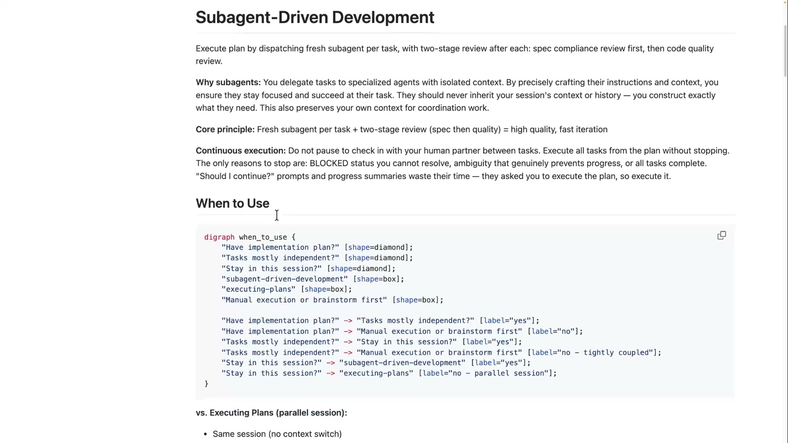
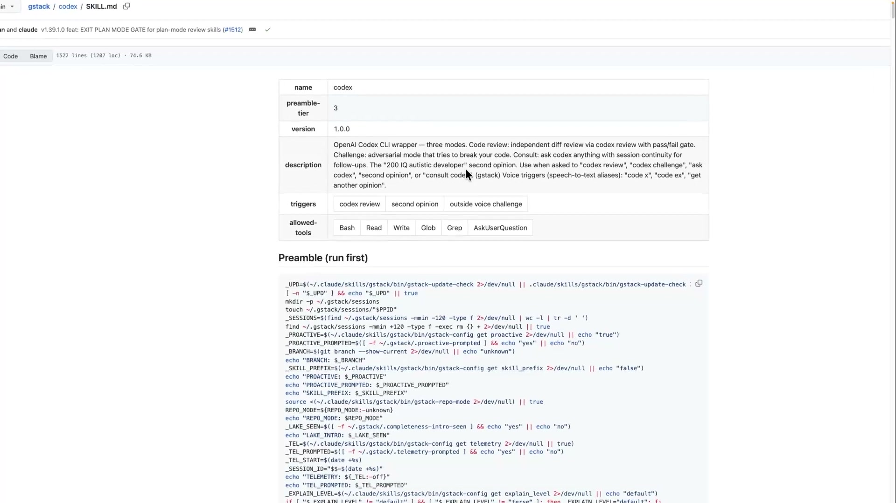
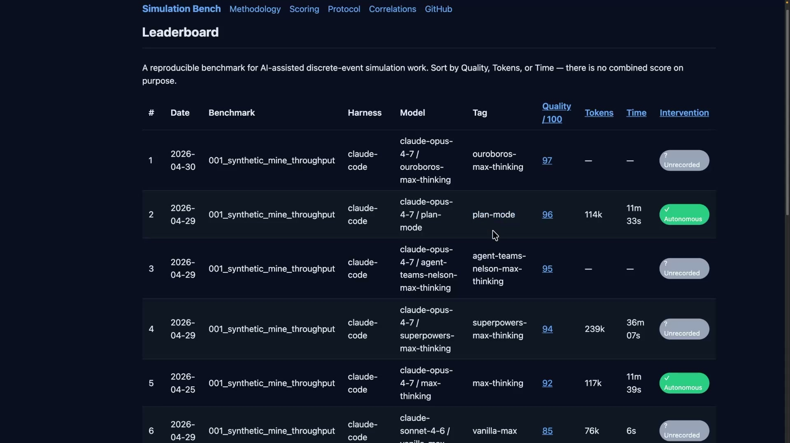
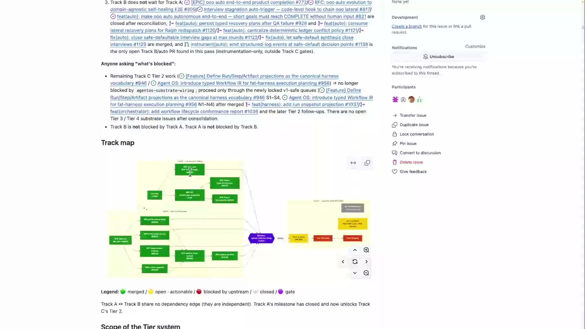
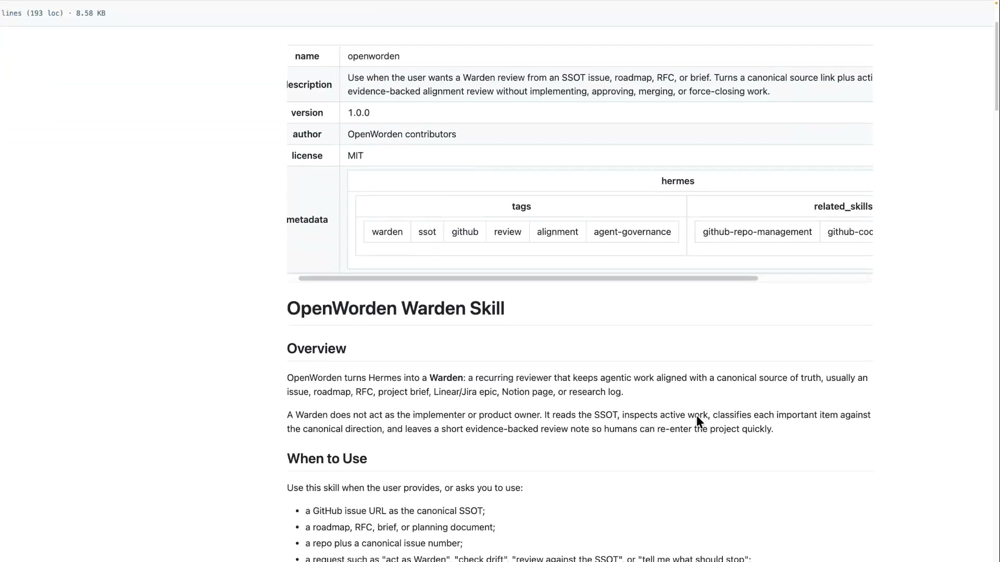
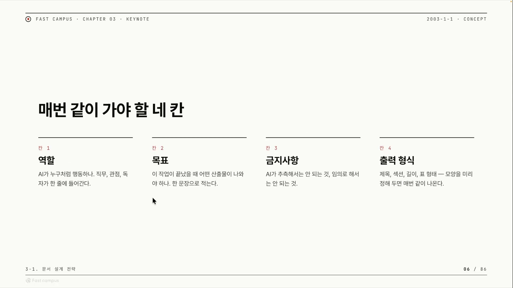
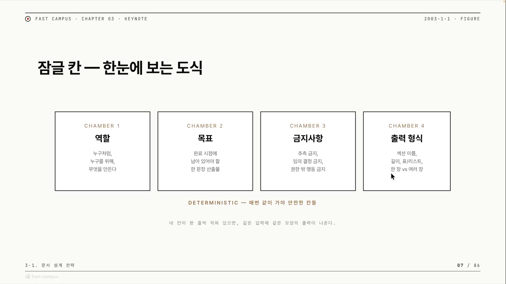
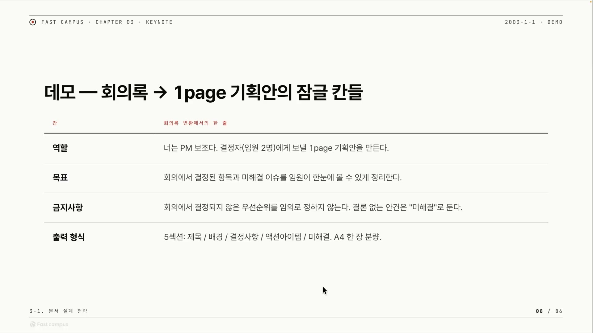

마크다운 한 장으로 AI 에이전트를 부릴 수 있다. 좋은 문서형 하네스는 지시를 길고 촘촘하게 쓰는 일이 아니라, 어디를 잠그고 어디를 열어둘지 경계를 긋는 일이다. 그 잠그는 자리가 딱 네 칸 있다.

여기서 말하는 문서형 하네스란, 별도의 코드나 외부 도구 없이 마크다운(.md) 문서만으로 AI 에이전트의 행동을 제약하고 유도하는 장치를 가리킨다. 역할, 원칙, 금지사항, 출력 구조를 글로 적어두면, 모델은 그 글을 먼저 읽고 그 테두리 안에서 움직인다. 이 강의의 직전 흐름은 이랬다. 앞 챕터에서 사람의 암묵지(말로 적히지 않은 노하우)를 데이터로 구조화하면서, 평소 못 보던 빈칸과 모호함을 찾아냈다. 빈칸을 찾았으니 이제 그걸 채워 잠가야 한다. 잠가야 디터미니스틱하게, 즉 같은 입력에 같은 모양으로 실행된다. 그 잠그는 첫 수단이 바로 문서형 하네스다.

## 가장 유명한 두 하네스, 정반대 철학

마크다운만으로 정상급 하네스가 만들어진다는 걸, 강의는 실물 사례 두 개로 보여준다. 둘은 정확히 반대 방향을 향한다.

하나는 슈퍼파워스(Superpowers)다. 강의에서 소개된 바로는 깃허브 스타 20만(200K)을 받은, 거의 1등처럼 보이는 하네스다. 순수하게 마크다운만으로 짜여 있고, 플러그인 형태라 Claude Code나 코덱스 같은 데 붙여 쓴다. 구성은 브레인스토밍, Git 워크트리, 라이팅 플랜, 서브에이전트 드리븐 개발, TDD, 코드 리뷰 요청, 디벨롭먼트 브랜치로 이어지는 기본 워크플로우 한 벌이 사실상 전부다. 재미있는 건 개별 스킬이 그렇게 크지 않다는 점이다. 예를 들어 '서브에이전트 드리븐 디벨롭먼트' 스킬은 문서 4개로 나뉜 279라인짜리다. 내부는 언제 써야 하는지(When to Use), 어떻게 써야 하는지(프로세스), 모델 셀렉션 순으로 짧게 정리돼 있다.

슈퍼파워스가 얇게 가는 건 스킬이 군더더기 없이 다듬여 있어 누구나 쉽게 쓸 수 있고, 모델 성능이 비약적으로 올라간 지금은 자유도를 크게 열어줄수록 오히려 결과가 잘 나오기 때문이다. 적게 지시하고 많이 맡기는 쪽이다. 이걸 보통 Thin Harness(얇은 하네스)라 부른다.

반대편이 gstack이다. 슬로건부터 "Thin Harness, Fat Skills". 게리 탄(Garry Tan)이 카파시(Karpathy)에게 영감을 받아, Y Combinator에서 일하는 방식을 Claude Code로 옮긴 것이라고 강의는 설명한다. 여기서는 한 스킬이 1,500라인에 달한다. 코덱스를 쓸 때 "이 스크립트를 먼저 실행시켜라"로 시작해, 안전 작동 원칙들을 줄줄이 나열하면서 1,500줄을 다 읽히고 작업을 시작한다. 시작하는 순간 이미 방대한 맥락이 컨텍스트에 들어가 있는 셈이다.

두꺼운 쪽은 1M(원밀리언) 토큰 컨텍스트가 나오면서부터 각광받았다. 1M이 아니었다면 1,500줄을 선주입하는 순간 컨텍스트가 꽉 차서 못 썼을 것이다. 특정 도메인을 깊게 파는 버티컬 작업에서 잘 먹히고, gstack 역시 스타 10만(100K) 가까이 받고 있다고 강의는 전한다.

정리하면 두 철학은 이렇게 갈린다.

| | 슈퍼파워스 (Thin) | gstack (Fat Skills) |
|---|---|---|
| 스킬 길이 | 짧다 (약 279라인) | 길다 (약 1,500라인) |
| 모델에 주는 것 | 자유도 | 맥락(컨텍스트) |
| 전제가 된 기술 | 모델 성능 향상 | 1M 토큰 컨텍스트 |
| 강한 영역 | 범용, 쉬운 채택 | 버티컬, 깊은 도메인 |
| 시작 부담 | 가볍다 | 무겁다(1,500줄 선주입) |

여기서 강의가 못 박는 한마디가 이 글의 척추다. **긴 스킬과 짧은 스킬이 둘 다 존재하지만, 문서가 길다고 좋아지는 건 전혀 아니다. 팻스킬 자체가 좋은 게 아니라 경계가 있는 게 중요하다.** Thin이냐 Fat이냐, 길이를 두고 벌이는 논쟁의 진짜 답은 길이가 아니라 "경계를 제대로 그었는가"에 있다는 것이다.

## 두 하네스가 공유하는 약점

그렇다고 마크다운 하네스가 만능이라는 얘기는 아니다. 강의는 그 한계까지 정직하게 짚는다. 슈퍼파워스든 gstack이든 둘 다 하나의 메인 세션 안에서 모든 걸 진행한다는 공통점이 있고, 바로 거기서 문제가 생긴다.

긴 맥락 한가운데 둔 지시를 모델이 흘리는 Lost in the middle, 대화가 길어지면 앞서 준 지시를 잊는 instruction forgetting, 그리고 한 세션에 모든 걸 욱여넣다 결과가 표류하는 드리프트(drift). 한 세션에 정보가 쌓일수록 맥락이 오염된다. 이 현상들은 학계에서도 보고된 실재하는 한계이고, 강의는 이를 직관적 설명으로 끌어온다.

말로만 짚고 넘어가지 않는다. AI-Assisted Discrete-Event Simulation 벤치마크(Simulation Bench)의 실측 결과가 근거로 등장한다. 과제는 광산 운송 시스템을 만드는 것이었다. 광산 트럭의 적재 지점, 하역 지점, 경로, 대기열 같은 시스템 구조를 이해하고, 복잡한 과정을 추상화하고, 이벤트와 상태 지표를 설계하고, 시뮬레이션 코드를 구현해 결과를 해석하고 산출물까지 만들어내는 미션이다.

발화자가 제시한 이 리더보드는 모든 행이 동일한 Claude Code 하네스로 돌린 결과인데, 슈퍼파워스는 품질 94점으로 4위에 머문다. 특별한 하네스 없이 모델에 맞는 Claude Code의 플랫모드(plan-mode)만 쓴 쪽이 96점으로 2위에 올라 있다. 즉 거창한 하네스를 얹지 않고 플랫모드만 써도 복잡한 작업에서는 슈퍼파워스를 이긴다는 것이다.

표가 말없이 던지는 메시지는 점수만이 아니다. 슈퍼파워스는 94점을 내는 데 23만9천(239k) 토큰과 36분을 썼는데, 그보다 높은 96점을 낸 플랫모드는 11만4천(114k) 토큰에 11분 33초로 끝냈다. 절반도 안 되는 토큰과 3분의 1 시간으로 더 높은 품질이 나왔다. 두껍게 깐다고 좋아지는 게 아니라는 주장의 정량적 증거인 셈이다. 1위는 97점의 우로보로스인데, 이건 발화자 본인이 관여한 진영의 분업형 하네스다. 발화자의 해석은 이렇다. 플랫모드든 슈퍼파워스든 하나의 메인 세션에서 모든 걸 진행하니 드리프트가 일어나고, 그래서 분업형인 우로보로스가 한 수 앞섰다는 것이다.

(여기서 우로보로스 1위는 발화자 본인 진영의 사례라는 이해상충이 있으니, 점수 자체보다 "단일 세션은 복잡해질수록 표류한다"는 구조적 관찰로 읽는 편이 안전하다.)

그렇다면 마크다운의 몫은 어디까지일까. 발화자의 선 긋기는 분명하다. 너무 복잡한 작업이 아니면 웬만한 일은 거의 마크다운 하네스에서 끝낼 수 있다. 다만 컨텍스트가 정말 많이 쌓이고 파일이 무수히 많은 코드베이스라면 한 메인 세션으로는 부족할 수 있고, 그때는 마크다운을 넘어 분업형이나 MCP를 도입한다. 처음부터 무겁게 가지 말고, 일단 마크다운으로 많은 걸 해결할 수 있다는 믿음을 가지고 가볍게 시작하라는 단계적 사고다.

## 마크다운 하나로 100개의 PR을 관리한 워든

이 "마크다운만으로 충분하다"를 발화자가 자기 손으로 증명한 사례가 워든(Warden)이다.

발단은 인지 부하의 폭발이었다. 발화자 진영의 오픈소스 우로보로스에서, 한 메인테이너가 커밋을 엄청나게 쏟아내며 한 버전에 커밋 100개 이상이 들어왔다. 에이전트 OS로 가는 트랙이 여러 갈래로 너무 많아지면서, 이걸 사람 머리로 따라가기엔 부하가 감당이 안 됐다. 너무 많은 이슈와 PR이 한꺼번에 굴러가는 상황이었다.

해결책의 뼈대는 두 가지다. 먼저 메타 이슈 하나를 single source of truth(SSOT), 진실의 단일 출처로 잡는다. 전체 흐름을 이 하나로 관리하는 것이다. 그 위에 감시자 역할의 에이전트를 둔다. 이 감시자가 전체 흐름을 파악하고, 흐름에 맞지 않는 이슈나 PR은 닫아주고, 상태를 갱신해 보고한다.

워든이 실제로 하는 일은 위 그림처럼 시각적이다. 이슈들을 시퀀싱 그래프로 그려, 초록은 머지됨, 노랑(오픈)은 지금 액션 가능, 빨강은 블록됨으로 색을 입히고, 티어 구조로 "지금 무엇을 해야 하는지"를 표시한다. 흐름과 맞지 않는 이슈는 스스로 닫고 그 이유를 표로 남긴다. 그리고 디스코드로 보고서를 꾸준히 보내준다.

워든의 정체는 거창한 시스템이 아니라 그냥 마크다운 스킬 한 장이다.

문서 구조를 뜯어보면 프론트매터에 설명 같은 메타데이터를 담고, Overview에서 언제 쓰는지(When to Use)를 밝히고, 입력과 출력 형식을 정의하고, 어떻게 움직일지를 원칙(프로토콜)으로 서술한다. canonical source, 곧 SSOT로 잡아둔 그 메타 이슈를 읽게 하고, 지금 진행 중인 작업이 그 단일 출처와 일치하는지를 체크한다. 가능한 액션은 요약(Summary), 취소(Cancellation), 코멘트(Comment). 마크다운 한 장에 역할(감시자), 목표(단일 출처와의 정합성 유지), 판단 기준(흐름 밖이면 닫기), 출력(요약 · 취소 · 코멘트)이 다 들어 있는 셈이다.

성과에 대해 발화자는 이렇게 말한다. 2\~3일 만에 100개의 PR이 쏟아졌는데도 워든이 디스코드로 보고를 해주니 사람의 인지 부하가 크게 줄었다고. 자기 회사에도 도입해, 여러 트랙과 스쿼드가 각각 뭘 하는지 한눈에 파악하기 어려웠던 걸 보고서로 받아 보며 운영 중이라고도 한다. 이 수치들은 발화자 본인의 구술이라 외부에서 검증할 수는 없지만, 요점은 분명하다. 마크다운 하나로 이런 루프가 돌아간다면, 마크다운 하네스만으로도 많은 것이 해결된다는 것이다.

## 왜 잠가야 하나, 비결정성이라는 본성

여기까지가 "마크다운이 어디까지 가능한가"였다면, 이제 "왜 굳이 잠가야 하는가"라는 더 근본적인 질문이 남는다. 답은 LLM의 본성에 있다.

LLM은 트랜스포머(Transformer)를 아키텍처로 채택했고, 그래서 컨텍스트라는 개념이 존재한다. 쌓인 컨텍스트를 기반으로 확률적 추론으로 다음 토큰을 골라 내뱉는다. 여기서 핵심은 "확률적"이라는 단어다. 모델은 정해진 답을 꺼내는 사전이 아니라, 다음에 올 단어로 가장 그럴듯한 후보를 확률로 뽑는 기계다. 주사위를 굴리듯 확률로 고르니, 같은 프롬프트를 넣어도 매번 미세하게 다른 답이 나온다. 이게 비결정성(non-determinism)이다.

그래서 마크다운의 일은 이 비결정성을 다루는 것이 된다. 발화자의 표현을 빌리면, 우리는 "무엇부터 미리 컨텍스트에 넣어 줄지"를 생각해야 한다. 원칙이든 횟수든, 매번 흔들리면 안 되는 것들을 앞단에 박아둔다. 같은 프롬프트에 매번 다른 답을 주는 이 non-deterministic한 출력을, 어떻게 하면 조금 더 좁혀(narrow down) 예상 범위 안으로 줄일까. 그게 마크다운이 할 수 있는 일이다.

말하자면 마크다운 하네스는 출력의 분산을 좁히는 깔때기다. 프롬프트만 던지면 출력이 넓게 퍼져 매번 제각각이지만, 잠글 칸을 함께 박아두면 좁은 범위로 수렴해 매번 비슷한 모양이 나온다. 그래서 좋은 마크다운은 두 공간을 가른다. AI 에이전트에게 창의성을 남겨주는 공간과, "이건 무조건 지켜야 돼" 하고 잠가야 하는 공간이 나뉘어 있어야 한다는 것이다. 잠근 부분은 매번 같아야 하는 뼈대가 되고, 잠그지 않은 부분은 모델의 창의성과 방대한 학습 데이터를 끌어 쓸 자유 공간이 된다.

## 잠글 네 칸, 역할과 목표와 금지사항과 출력 형식

그래서 무엇을 잠그는가. 발화자가 계속 강조해 온 답이 네 칸이다.

**역할**은 AI가 누구처럼 행동하는지다. 직무와 관점, 그리고 누구를 위한 작업인지가 한 줄에 들어간다. 발화자는 이 칸을 "진짜 꼭 필요하다"고 못 박는다. 우로보로스에서 하나의 일을 여러 갈래로 쪼갤 때, 누구처럼 행동하는지를 안 넣었더니 분해가 제대로 안 됐다. 코드 작업이면 개발자가, 리서치 작업이면 리서처가 쪼개게 역할을 박아주니 그제야 더 효율적으로 돌아갔다. 역할은 장식이 아니라 작업을 어떻게 나눌지를 정하는 기준점인 셈이다.

**목표**는 이 작업이 끝났을 때 손에 무엇이 남아야 하는지를 한 문장으로 적는 칸이다. 결국 이 스킬이 왜 존재하는지를 알려주는 자리다.

**금지사항**은 AI가 추측해서는 안 되는 것, 임의로 결정해서는 안 되는 것을 적는다. 슈퍼파워스에는 "절대 하지 말아라"를 모아둔 레드 플래그(Red Flag)라는 게 있는데, 그것과 같은 결의 칸이다.

**출력 형식**은 산출물의 모양, 곧 제목과 섹션, 길이, 표 형태를 미리 정해 두는 칸이다. 발화자가 이 칸을 특히 중요하게 짚는 건 스킬의 연계 때문이다. 슈퍼파워스가 여러 워크플로우를 이어 붙이듯, 한 스킬에서 다음 스킬로 넘어가려면 앞 스킬이 이미 정해진 모양의 결과를 내놓아야 한다. 앞 스킬의 출력 형식이 곧 뒤 스킬의 입력 계약이 되는 것이다. 그래서 출력 형식을 못 박지 않으면 파이프라인 자체가 어긋난다.

이 네 칸을 잠그면 같은 입력에 같은 모양의 출력을 보장받을 수 있다. 비결정적인 것을 조금 더 결정적인 쪽으로 끌어오는 작업이, 결국 이 네 칸을 채우는 일이다.

## 네 칸을 실제로 채워보면

회의록을 1page 기획안으로 바꾸는 하네스에 네 칸을 실제로 채우면 이렇게 된다.

역할 칸에는 "너는 PM 보조다. 결정자(임원 2명)에게 보낼 1page 기획안을 만든다"가 들어간다. 누구처럼, 누구를 위해, 무엇을 만드는지가 한 줄에 담긴다. 목표 칸에는 "회의에서 결정된 항목과 미해결 이슈를 임원이 한눈에 볼 수 있게 정리한다". 출력 형식 칸에는 제목, 배경, 결정사항, 액션아이템, 미해결의 5개 섹션과 A4 한 장 분량이 명시된다.

금지사항 칸에는 "회의에서 결정되지 않은 우선순위를 임의로 정하지 않는다. 결론 없는 안건은 '미해결'로 둔다"가 들어간다. 발화자는 이걸 한마디로 "average answer로 채우지 말라"고 정리한다. 모델이 모르는 칸을 평균적이고 그럴듯한 말로 메우지 말고, 모르면 모른다고 비워 두라는 것이다. LLM의 가장 흔한 실패, 즉 빈칸을 그럴듯한 거짓으로 채우는 버릇을 정확히 겨냥한 지시다.

출력 형식을 이렇게 못 박는 건 모양이 매번 같게 나와야 사람의 감시병과 후처리가 사라지기 때문이다. 형식을 고정하는 일이 곧 사람 손이 덜 가는 자동화로 이어진다. 이렇게 네 칸을 잠그면 매번 똑같은 결과를 보장받고, 잠그지 않은 나머지 공간에서는 모델이 자기 창의성과 학습 데이터를 마음껏 끌어 쓴다.

결국 좋은 마크다운이 고정하는 것은 분량이 아니라 이 네 칸이다. 역할로 누가 일하는지를, 목표로 무엇이 남아야 하는지를, 금지사항으로 무엇을 추측하면 안 되는지를, 출력 형식으로 어떤 모양이 나와야 하는지를 잠근다. 그 잠근 테두리 안에서 모델은 비로소 매번 같은 모양으로 일하고, 테두리 밖에서는 자유롭게 헤맬 수 있다. 긴 문서가 좋은 게 아니라, 경계가 있는 문서가 좋은 이유가 여기에 있다.
