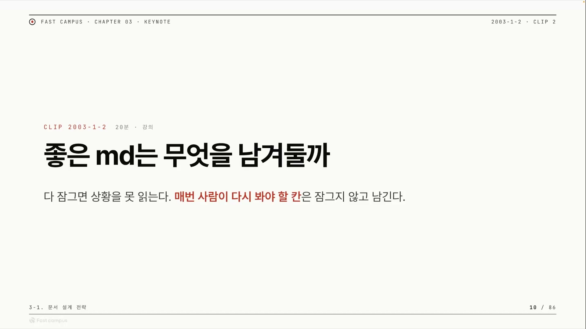
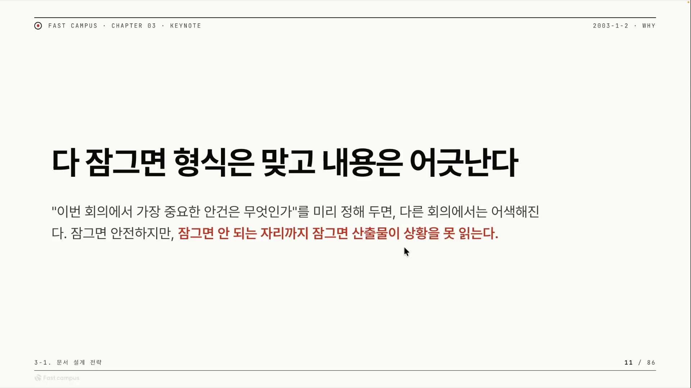
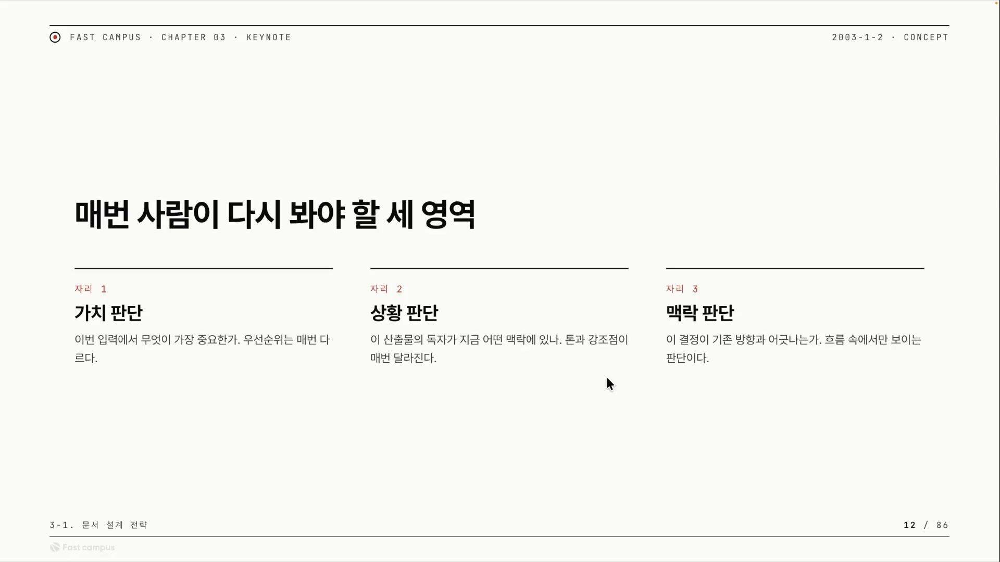
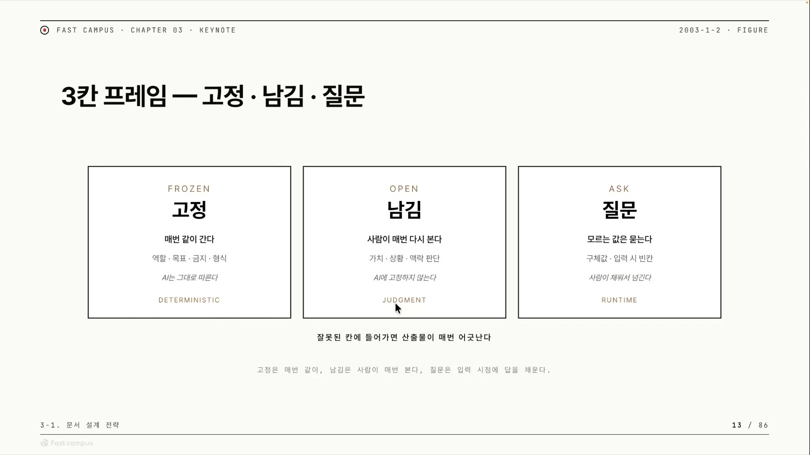
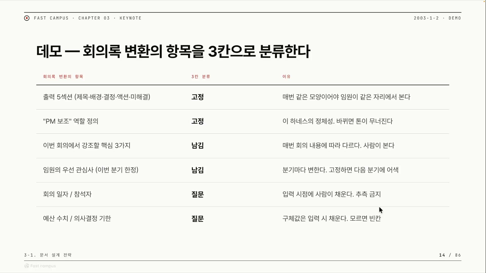
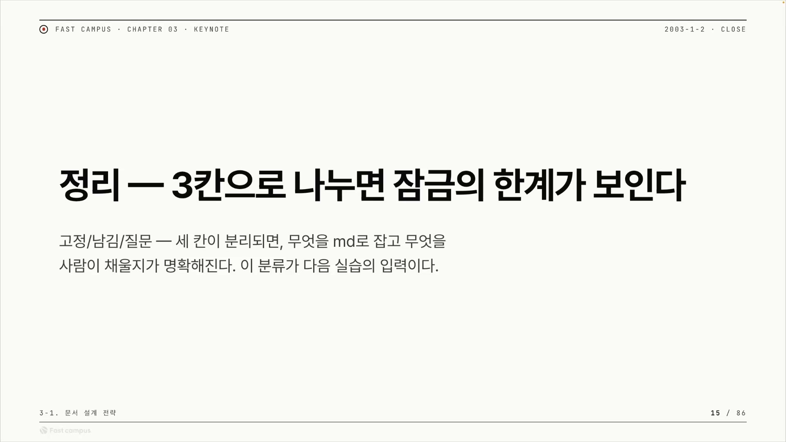

문서를 잘 쓴다고 하면 보통은 빈틈없이 채운 문서를 떠올린다. 항목이 다 있고, 빈칸이 없고, 형식이 단정한 문서. 그런데 AI에게 일을 시키는 문서, 그러니까 스킬이나 마크다운 하네스를 두고 보면 이야기가 반대로 뒤집힌다. 좋은 마크다운은 다 채운 문서가 아니라, 사람이 다시 봐야 할 칸을 일부러 비워 둔 문서다.

여기서 잠근다는 말부터 풀어 두자. 마크다운 하네스는 마크다운 문서로 AI의 동작을 틀 지우는 장치다. 강사는 스킬을 곧 마크다운 하네스로 본다. 그 문서 안에는 칸이 여럿 있는데, 어떤 칸은 AI가 매번 똑같이 따라야 하고(고정·잠금), 어떤 칸은 상황마다 달라져야 한다(비움·남김). 직전 강의에서는 무엇을 고정할지, 그러니까 역할이나 형식 같은 원칙을 어떻게 잠글지를 봤다. 이번에는 그 반대편이다. 그러면 무엇을 남겨야 하나. 잠그지 말고 무엇을 비워 둬야 하나.

답은 한 문장으로 압축된다. 사람이 다시 봐야 할 공간은 잠그지 않는다. 좋은 마크다운 하네스의 특징이 바로 여기 있다. 그 안에는 사람이 다시 볼 공간이 있다. AI가 멋대로 채우면 안 되는 칸을 일부러 남겨 둬서, AI가 그 칸을 채우는 대신 사람에게 물어보게 만드는 것. 그게 문서 설계의 핵심이다.

## 사람이 끼어드는 자리를 남긴다

이 비워 둔 칸을 다른 말로 휴먼 인 더 룹(HITL)이라고 부른다. AI가 자동으로 일을 처리하는 흐름 사이사이에 사람이 끼어들어 확인하고 교정하고 결정하는 지점을 두는 설계다. 좋은 마크다운 하네스에는 이 HITL 지점이 많다.

Claude Code용 스킬 프레임워크인 Superpowers를 보면 그림이 잡힌다. 메인 세션에서 여러 워크플로우를 명령으로 하나씩 쳐 가며 일을 해결하는데, 그 과정에서 사람이 매 단계 개입한다. AI가 틀린 방향으로 가면 esc를 눌러 멈추고 이렇게 해야 한다고 일러 주는 식이다. 이렇게 사람이 멈추고 교정하는 자리가 HITL의 가장 구체적인 모습이다.

그러니까 비워 둔 칸과 HITL은 같은 것의 양면이다. 사람이 다시 봐야 할 칸을 비워 두면, 그 칸이 곧 사람이 끼어드는 자리가 된다. 어디를 비울지 정하는 일이 곧 어디에 사람을 끼워 넣을지 정하는 일이다.

## 다 잠그면 형식은 맞고 내용은 어긋난다

그렇다면 반대로, 비워야 할 칸까지 다 잠가 버리면 어떻게 될까.

다 잠그면 결과는 늘 똑같이 나온다. 형식은 매번 완벽하다. 문제는 상황이 바뀌어도 똑같은 결과만 낸다는 데 있다. 강사는 자신이 만든 스킬 워든을 이 함정의 예로 든다. 워든은 빈칸을 사람에게 묻지 않고 다 잠가 둔 스킬이었다. 그러다 보니 형식에 맞춰 똑같은 일만 할 수 있게 됐다.

회의록을 기반으로 기획안을 만드는 스킬을 떠올려 보자. 만약 가장 중요한 안건을 문서 안에 미리 박아 둔다면, 그 안건이 중요한 회의에서는 잘 돌아가도 다른 회의에서는 어색해진다. 이번 회의의 핵심을 고정해 버렸으니 다음 회의에는 들어맞지 않는다. 추상화가 안 된 스킬이라 다른 맥락에서 다시 쓸 수가 없고, 쓰려면 매번 내용을 손으로 바꿔 줘야 한다.

그렇게 매번 고쳐 써야 하는 스킬은 사실 쓸모가 없다. 프롬프트와 다를 게 없기 때문이다. 스킬의 존재 이유는 재사용성인데, 매번 내용을 갈아 끼워야 한다면 그냥 그때그때 쓰는 프롬프트를 쓰는 것과 같다. Y Combinator의 CEO 개리 탄(Garry Tan)도 세 번 이상 반복되는 일이라면 스킬을 쓰라고 말한다. 반복되는 작업을 재사용 가능한 형태로 캡슐화하라는 원칙이다. 그런데 반복되는 작업 중에서도 잠근 부분은 매번 똑같으니 잠가 둬도 되지만, 안건처럼 그때마다 달라지는 내용은 비워 둬서 사람이 채울 수 있게 해야 한다.

흥미로운 건, 워든조차도 사실은 모든 걸 다 잠그지는 않았다는 점이다. 변수를 어떻게 받을지는 고정하지 않았고, 그렇게 비워 둔 덕에 스킬이 상황을 읽어 더 나은 산출물을 냈다. 잠글 것과 안 잠글 것을 가른 만큼만 결과가 좋아진 셈이다.

## 사람이 더 잘하는 세 가지 판단

그럼 구체적으로 어떤 칸을 비워 사람에게 맡겨야 할까. 사람이 AI보다 아직 더 잘하는 세 가지 판단 영역이 그 답이다.

요즘은 사람을 복제해 사람 대신 판단하게 하려는 시도도 있다. 슈퍼메모리(Supermemory, 표기 미확인) 같은 메모리 시스템이 그렇다. 대화에서 사실을 뽑아 사람의 온톨로지를 쌓고, 내가 나였다면 어떤 결정을 했을까를 세컨브레인(second brain)으로 재현하려 한다. 하지만 아직은 메모리 시스템으로 사람을 복제하는 일이 기술적으로 어렵다. 그래서 당분간 다음 세 판단은 사람 몫이다.

**첫째는 가치 판단이다.** 무엇이 제일 중요한가, 우선순위를 정하는 일이다. 우선순위는 비즈니스 사정부터 그 시기가 주는 여러 맥락까지 다 들어와야 정해진다. 지금은 사람이 가장 효율적으로 고를 수 있는 영역이다.

**둘째는 상황 판단이다.** 이 스킬로 나온 산출물을 누가 보는지, 어떤 상황에서 쓰이는지에 따라 사람이 판단을 달리한다. 기획안을 빠르게 쳐내야 하는 상황인지, 여유가 있어 완벽하게 다듬어야 하는 상황인지에 따라 강조점과 톤이 달라진다. 이런 상황을 사람에게 물을 때 쓰는 도구가 애스크유저퀘스천(AskUserQuestion)이다. 두서너 개 선택지를 띄워 사용자가 고르게 하는 방식이다.

**셋째는 맥락 판단이다.** 지금 나온 결정이 여태까지의 결정들, 지금 가고 있는 방향과 어긋나지는 않는지를 본다. 사람은 수많은 맥락을 이해하고 있고 그것을 꿰는 안목이 있어서 이런 판단을 한다.

다만 이 셋이 영영 사람 몫인 건 아니다. AI 네이티브하게 더 나아가서 점점 더 많은 데이터를 에이전트에게 줄 수 있게 되면, 맥락 판단부터 시작해 상황 판단까지는 어느 정도 에이전트가 해 볼 수 있다. 순서가 있다. 처음에는 이 세 가지를 스킬에 녹여 두고, 이후 데이터가 쌓이고 메모리 시스템이 발전하면 하나씩 빼 가며 AI가 사람 대신 결정하는 쪽으로 옮겨 간다. 우선순위를 가르는 가치 판단이 가장 오래 사람 곁에 남을 것이다.

## 고정, 남김, 질문 세 칸으로 가른다

지금까지의 이야기, 그러니까 무엇을 남길지, HITL은 어디에 두는지, 워든은 왜 실패했는지, 사람이 봐야 할 세 판단이 무엇인지가 하나의 틀로 정리된다. 마크다운의 모든 칸을 고정, 남김, 질문 세 칸으로 가르는 것이다.

| 칸 | 무엇을 담나 | 왜 |
|---|---|---|
| **고정 (FROZEN)** | 역할 · 목표 · 금지 · 형식 | AI가 매번 그대로 따라야 한다. 결정적(디터미니스틱)으로 굳히는 뼈대 |
| **남김 (OPEN)** | 상황마다 바뀌는 내용 | 고정하면 상황·맥락 판단을 못 한다. 비워 두면 외부 데이터나 사람이 채운다 |
| **질문 (ASK)** | 빠지면 안 되는데 비어 있는 값 | 모호하게 두면 AI가 지어낸다. 사람에게 물어 채운다 |

고정 칸에는 역할, 목표, 금지, 형식 네 가지가 들어간다. AI가 그대로 따라야 할 것들이다. 마크다운 하네스를 결정적으로, 그러니까 같은 입력이면 같은 출력이 나오게 만들려면 이 네 가지를 고정해야 한다. 스킬이 매번 흔들리지 않게 하는 뼈대가 이 넷이다.

남김 칸은 그 반대다. 고정해 둔 뼈대 위에서 상황 판단과 맥락 판단까지 시키려면 이 부분은 절대 고정하면 안 된다. 여기는 입력에 따라 매번 달라지는 칸이라, AI가 그 입력에서 추론해 1차로 채우고 사람이 그 결과를 다시 검토한다. 슬라이드가 남김을 '사람이 보는 칸'이라 부르는 이유가 이 검토에 있다. 사람의 몫은 그 값을 직접 적는 게 아니라, HITL 안에서 여러 스킬을 오케스트레이션하며 원천 데이터를 넣어 주고 AI가 채운 결과를 가르는 일이다.

요점은 세 칸을 섞지 않는 것이다. 남김이나 질문에 해당하는 칸까지 고정해 버리면 워든의 실패를 그대로 반복한다. 무엇을 어느 칸에 넣을지를 가르는 일, 그게 문서 설계의 전부다.

## 안 물어보면 그럴듯한 답이 채워진다

세 칸 중에서도 강사가 따로 무게를 싣는 칸이 질문이다. 이유는 비워 두는 것만으로는 부족하기 때문이다.

비워 둔 칸을 사람에게 묻지 않고 모호하게 두면, AI는 그 칸을 빈칸으로 남겨 두지 않는다. 그럴듯한 답으로 메워 버린다. 그럴듯한 답은 형식상으로는 그럴싸하지만 실제로는 틀렸거나 내가 원한 게 아닌 답이다. 예산 수치나 의사결정 기한 같은 칸을 비워만 두면, AI는 적당히 말이 되는 숫자와 날짜를 슬쩍 채워 넣는다. 그게 사실인지 아닌지는 따지지 않는다.

그래서 비운 칸에는 사람에게 물어보라고 명시해야 한다. 그래야 AI가 멋대로 채우는 대신 사람을 한 번 더 끌어들인다. 모르는 값은 최대한 물어보고 사람이 다시 한번 볼 수 있게 만드는 것이 중요하다.

여기 미묘한 점이 하나 있다. 질문 자체도 어떤 면에서는 고정이다. 이 칸이 비면 반드시 물어보라는 규칙 자체는 매번 똑같이 작동하기 때문이다. 채워질 값은 그때그때 달라지지만, 묻는 행위는 결정적으로 굳어 있다. 질문은 남김과 고정의 성질을 함께 가진다.

질문에는 다른 효능도 있다. 사람은 늘 실수하는 존재라, 회의 일자나 참석자처럼 빠뜨리기 쉬운 항목을 스킬이 되물어 챙기게 하면 좋다. 질문이 곧 리마인드가 되는 것이다.

그렇다면 물어봤는데도 값이 없으면 어떻게 하나. 규칙은 간단하다. 모르면 빈칸이다. 모르는 값은 지어내지 말고 빈칸으로 명시해 둔다. 그래야 다음 단계에서 채울 수 있다. 빈칸을 그럴듯한 값으로 메우는 순간, 그 거짓이 다음 단계로 그대로 전파된다.

## 데모, 회의록을 기획안으로 바꾸는 스킬

추상적인 틀을 손에 잡히는 사례로 내려 보자. 과제는 회의록을 기반으로 기획안을 만드는 스킬이다. 입력은 직접 적은 아이디어나 안건일 수도 있고, 회의록 노트테이킹 앱이 회의 음성을 받아쓴 STT(Speech-to-Text) 데이터일 수도 있다. 이 스킬의 기획안 템플릿에서 각 항목이 어느 칸에 들어가는지를 갈라 본다.

| 항목 | 칸 | 왜 |
|---|---|---|
| 출력 5섹션 (제목 · 배경 · 결정 · 액션 · 미해결) | 고정 | 매번 같은 모양이어야 임원이 같은 자리에서 읽는다 |
| "PM 보조" 역할 정의 | 고정 | 이 하네스의 정체성. 바뀌면 톤이 무너진다 |
| 이번 회의에서 강조할 핵심 3가지 | 남김 | 매번 회의 내용에 따라 다르다. AI가 회의록에서 뽑고 사람이 본다 |
| 임원의 우선 관심사 (이번 분기 한정) | 남김 | 분기마다 변한다. 고정하면 다음 분기에 어색 |
| 회의 일자 / 참석자 | 질문 | 입력 시점에 사람이 채운다. 추측 금지 |
| 예산 수치 / 의사결정 기한 | 질문 | 구체값은 입력 시 채운다. 모르면 빈칸 |

출력 섹션 구조와 형식은 템플릿이니 매번 같아야 한다. 그래야 기획안을 받는 사람이 늘 같은 자리에서 같은 정보를 찾는다. PM 보조라는 역할 정의도 스킬의 정체성이라 흔들리면 안 된다. 둘 다 고정 칸이다.

이번 회의에서 강조할 핵심 세 가지는 회의마다 다르다. 임원의 우선 관심사도 이번 분기 한정으로 정해지는 것이라 분기마다 변한다. 이런 칸을 고정해 버리면 다음 회의, 다음 분기에 어긋난다. 그래서 비워 둔다.

회의 일자와 참석자는 비면 안 되는 사실이라 사람이 채워야 한다. 그래서 누가 참석했나요 하고 묻게 만든다. 예산 수치나 의사결정 기한도 마찬가지다. 비워만 두면 AI가 그럴듯한 값을 지어내니 꼭 묻게 시킨다. 물어도 모르면 그때는 빈칸으로 남겨 다음 단계로 넘긴다.

이렇게 갈라 두면 같은 기획안 스킬이 회의마다 다른 결과를 내면서도(남김·질문) 형식은 일정하게 유지된다(고정). 이게 바로 워든이 못 했던, 재사용 가능한 스킬의 모습이다.

## 정리하면, 세 칸으로 나눌 때 잠금의 한계가 보인다

좋은 마크다운은 무엇을 고정하고, 무엇을 비우고, 무엇을 물을지를 가른 문서다. 어떤 것을 AI에게 그대로 시킬지, 어떤 것을 비워 위임할지, 어떤 것을 사람에게 물을지. 이 셋을 분리해야 마크다운 하네스에서 역할이 또렷이 나뉘고, 무엇을 잠그고 무엇을 잠그지 않을지가 잡힌다.

이 분류가 그저 개념에 그치지 않는다는 점이 중요하다. 고정, 남김, 질문으로 한번 갈라 둔 결과가 곧 다음 실습의 입력이 된다. 여기서 한 걸음 더 나아가면 이 세 칸 말고도 여러 가지를 더 붙여 보게 된다. 마크다운 하나가 어떻게 동작하는지를 충분히 본 다음에야, 스킬을 오케스트레이션하고 여러 스킬을 하나로 묶어 돌리는 단계로, 그리고 왜 마크다운 하네스를 넘어 다른 하네스가 필요한지로 이야기가 이어진다.
