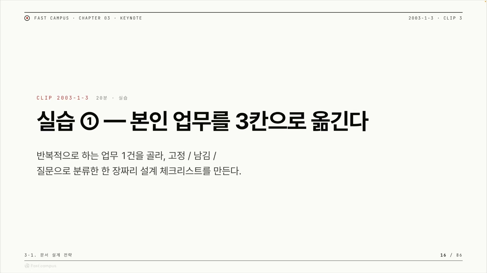
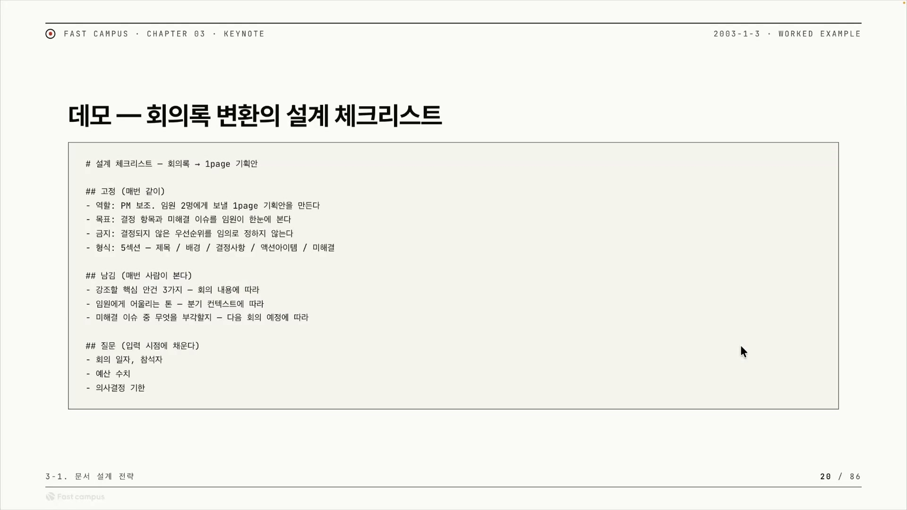
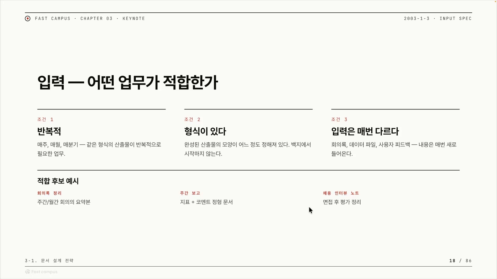
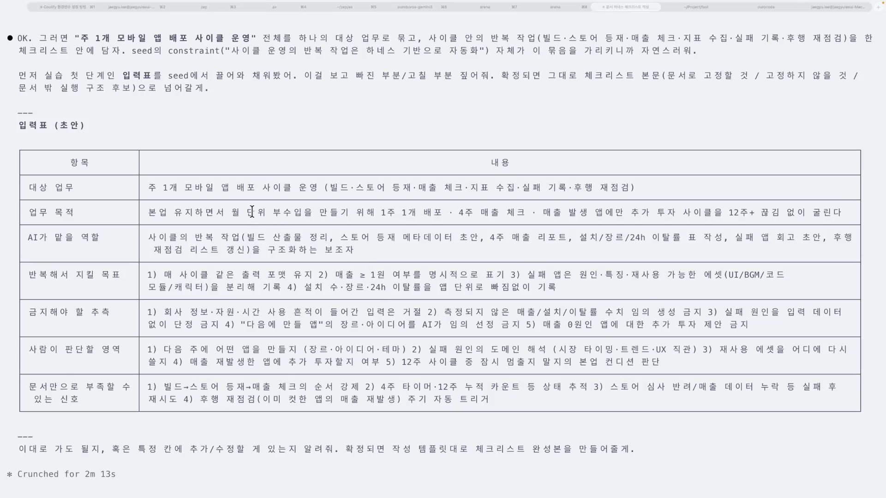
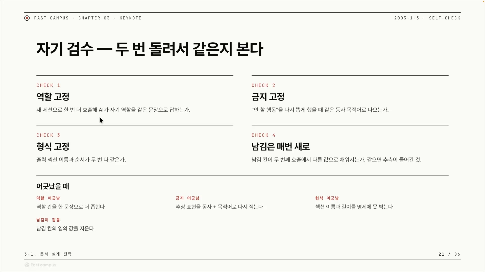
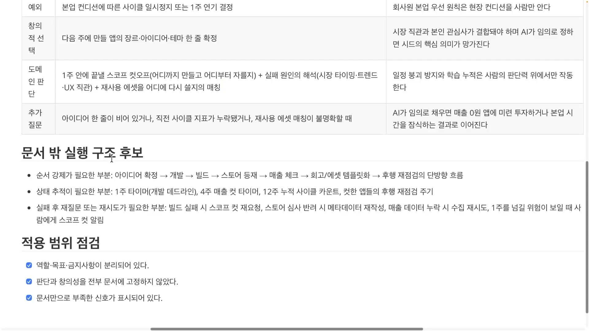

예전에는 AI에게 "이렇게 일해라"를 시킬 때 프롬프트를 직접 짜거나, 코드에서 API를 호출하며 그 안에 지시를 욱여넣었다. 페르소나를 입히고, 금지사항을 적고, 작업 순서를 흘려보내는 일을 전부 프롬프트 엔지니어링으로 해온 것이다. 지금은 그 자리에 마크다운 문서 한 장이 들어선다. 클로드 코드, 코덱스, 헤르메스 같은 에이전트에 `.md` 파일을 넣어주면, 그 문서가 곧 '스킬'처럼 동작한다. 스킬로 호출하든, 컨텍스트로 주입하든, 입력 통로만 다를 뿐 결국 같은 마크다운을 받는다.

이게 '문서형 하네스(harness)'다. 하네스는 원래 말이나 낙하산을 붙들어 매는 마구, 결박 장치를 뜻한다. AI를 풀어놓지 않고 정해진 궤도 안에서만 움직이게 고정한다는 비유다. 그 결박을 코드가 아니라 마크다운 문서로 한다는 점에서 '문서형'이고, 마크다운을 쓸 줄 아는 것은 이제 선택이 아니라 기본기가 됐다. 분업형 서브에이전트를 쓰든 MCP로 가든, 출발점은 똑같이 "페르소나와 규칙을 문서로 정의하는 것"이기 때문이다.

그래서 이 글에서 만들 것은 거창한 시스템이 아니라 한 장짜리 종이다. 반복적으로 하는 업무 한 건을 골라, 그 안의 모든 요소를 세 칸으로 갈라 적는다. 매번 똑같아야 하는 것은 '고정', 회마다 달라져 문서에 못 박지 않고 사람의 판단으로 열어두는 것은 '남김', 입력 시점에 사람이 직접 줘야 정해지는 구체적 값은 '질문'. 이 분류표를 '설계 체크리스트'라 부르고, 클로드 코드에 실제로 넣어 돌려보면서 마크다운 하네스가 어디까지 되고 어디서 막히는지를 본다.

## 설계의 본질은 분류다

체크리스트의 전부는 결국 세 칸을 가르는 판단이다.

| 칸 | 무엇을 담나 | 누가 담당하나 |
|---|---|---|
| 고정할 것 | 매번 똑같아야 하는 것: 역할, 출력 형식, 금지사항, 규칙 | 마크다운 문서 |
| 남길 것 | 회마다 달라지는 판단과 방향: 무엇을 강조할지, 보고서 톤, 도메인 판단 | 사람이 그때 판단 |
| 질문할 것 | 입력 시점에 받아야 정해지는 구체적 값: 날짜, 예산, 기한 | 사람이 입력 때 직접 |

말로만 보면 추상적이니, 강사가 견본으로 보여준 '회의록을 임원용 한 장짜리 기획안으로 바꾸는' 하네스를 보면 칸이 어떻게 채워지는지 단번에 보인다.

고정 칸에는 역할("PM 보조"), 출력 형식("임원 2명에게 보낼 한 장짜리 기획안, 5섹션 구조"), 금지("결정되지 않은 우선순위를 임의로 정하지 않는다")가 들어간다. 회의가 바뀌어도 변하지 않을 것들이다. 남김 칸에는 강조할 핵심 안건 세 가지가 들어가는데, 이건 회의 내용에 따라 달라지니 사람이 결정한다. 임원에게 어울리는 보고서 톤도 마찬가지다. 분기 상황에 따라 마케팅 쪽으로 강하게 갈 수도, 기술 쪽으로 갈 수도 있어서 매번 사람이 방향을 줘야 한다. 미해결 이슈 중 무엇을 부각할지도 다음 회의 예정에 따라 사람이 골라 남김 칸으로 들어간다. 질문 칸에는 회의 일자, 예산 수치, 의사결정 기한처럼 그날그날 정해지는 값이 들어간다. 작업을 시작하는 입력 시점에 받아서 채우면 된다.

여기서 한 가지 짚을 게 있다. 아무 업무나 이렇게 만들면 안 된다. 마크다운 하네스가 맞는 업무에는 세 가지 조건이 있다.

첫째, 반복적이어야 한다. 매주, 매월, 매분기처럼 같은 형식의 산출물이 주기적으로 필요한 일. 둘째, 형식이 정해져 있어야 한다. 결과물의 모양이 백지에서 시작하지 않고 어느 정도 틀이 있어야 한다. 형식이 없으면 AI가 무엇을 만들어낼지 몰라 사람이 일일이 감시해야 하고, 그 감시 비용이 걷잡을 수 없이 커진다. 셋째, 입력은 매번 달라야 한다. 회의록도 데이터 파일도 회마다 내용이 새로 들어오는, 그래서 AI의 추론이 필요한 일이어야 한다.

세 번째 조건이 특히 중요하다. 만약 입력이 늘 똑같아서 복사-붙여넣기로 끝나는 작업이라면, 굳이 AI를 붙일 이유가 없다. 그런 건 코드나 n8n 같은 자동화 스크립트로 만드는 편이 더 확실하고 싸다. AI의 추론 능력은 입력이 매번 달라지는 자리, 즉 정해진 규칙만으로는 답이 안 나오는 자리에서만 값을 한다. 회의록 정리, 주간 보고, 수백 명 지원자가 몰리는 채용 정리나 과제 평가 같은 일이 시작하기 좋은 후보다.

이 체크리스트는 무에서 짜내는 게 아니라 앞 단계에서 뽑아둔 '시드(seed)'에서 풀어낸다. 시드는 업무 명세의 씨앗으로, 목표(goal)와 성공 기준(success criteria), 그리고 제약(constraint) 세 가지로 압축돼 있다. 이 압축된 의도를 펼쳐 세 칸으로 흘려보내는 과정이 곧 설계다.

## 무엇으로 칸을 채우나

칸을 채우는 작업은 대략 다섯 단계를 따른다. 산출물 형식을 고정하고, 시드에 적힌 규칙을 옮겨 적고, 사람이 판단할 자리를 표시하고, 모르는 값을 처리하고, 마지막으로 예시를 붙인다.

### 역할을 안 박으면 결과가 흔들린다

가장 먼저 고정해야 할 것이 역할이다. 강사는 자기 업무에 "창업자처럼" 역할을 줬다. 왜 역할을 박는 게 그렇게 중요할까. 근거는 요즘 LLM이 답을 만드는 방식 자체에 있다.

요즘 큰 모델은 내부에 여러 개의 '전문가(expert)' 신경망을 두고, 토큰을 하나 만들 때마다 그중 일부만 골라 켠다. 이걸 믹스처 오브 엑스퍼트(Mixture of Experts, MoE)라 한다. 문제는 매번 어떤 전문가가 켜질지 우리가 통제할 수 없다는 점이다. AI에게 무언가를 시킬 때마다 전문가가 사실상 무작위로 배정된다.

비유하자면 질문할 때마다 창구 직원이 무작위로 바뀌는 민원실과 같다. 누가 받을지 모르니 답의 톤도 품질도 매번 들쭉날쭉하다. 그래서 문서 첫머리에 "너는 ○○다"라고 직책을 박아두면, 어떤 전문가가 켜지든 출력이 그 역할 쪽으로 쏠려 일관성이 생긴다. 역할을 비워두면 우리가 원하는 만큼의 결과가 안 나올 수 있다는 말은, 이 무작위성을 묶어두지 못한다는 뜻이다.

목표와 금지사항은 이미 시드에 적어둔 것을 그대로 고정 칸으로 옮긴다. 시드의 goal과 constraint가 곧 체크리스트의 고정 칸으로 직결되는 셈이다.

### 모르는 값은 추측시키지 말고 빈칸으로 둔다

다음은 사람이 판단할 자리, 즉 휴먼 인 더 루프(human-in-the-loop)다. 마크다운 하네스에는 AI가 작업을 끝낸 뒤 사람이 한 번 보고 통과시키는 검수 관문이 반드시 들어간다. 요즘은 이 관문에서 사람을 아예 빼는 휴먼 아웃 오브 더 루프(human-out-of-the-loop)도 연구되지만, 실전에서 쓰는 하네스는 아직 사람이 한 번 검수하는 쪽을 기본으로 둔다.

그런데 사람의 판단이 필요한 지점에서 정작 더 중요한 교훈은 따로 있다. 아직 정해지지 않은 값을 어떻게 다루느냐다. 강사는 멀티에이전트 하네스인 오로보로스(Ouroboros)를 다루다 겪은 일을 든다. 그 안에는 PRD(제품 요구사항 문서)를 작성하는 PM 기능이 있는데, PRD를 쓰다 보면 기술뿐 아니라 비즈니스적으로도 아직 결정되지 않은 항목이 남는다.

이때 AI에게 그냥 맡기면 사달이 난다. AI는 "인간의 응답이 없으니, 이 모호한 빈칸은 내가 채워야겠다"고 판단해 그럴듯한 거짓으로 메워버린다. 이것이 환각(할루시네이션)의 출발점이다. 그래서 강사의 처방은 분명하다. PRD가 나온 뒤 기술적인 것을 묻는 인터뷰로 넘어가더라도, 아직 안 정해진 비즈니스 값까지 거기서 답하게 하지 말고 "일단 빈칸으로 두고 나중에 채워라"라고 명시한다.

> 모르는 값들은 일단 빈칸으로 두자, 나중에 채워 놓으면 되니까.

AI는 빈칸을 싫어해 그럴듯한 거짓으로 메우는 습성이 있어서, 비워둘 자리는 명시적으로 비워두라고 지시해야 한다. 이 철학은 뒤에서 볼 데모의 금지사항, 즉 "측정되지 않은 수치를 지어내지 마라"로 그대로 이어진다.

마지막 단계는 예시 붙이기다. 프롬프트 엔지니어링에서 말하는 원샷과 퓨샷의 차이인데, 원샷은 예시 없이 지시 하나만 주는 것이고, 퓨샷은 몇 개의 예시를 함께 주는 것이다. 예시를 붙이면 컨텍스트가 풍부해져 더 나은 결과가 나온다. 그래서 체크리스트의 마지막 칸은 '예시 기준'으로 채워진다.

## 실제로 돌려보기, 모바일 라이브옵스

이론을 자기 업무에 직접 통과시켜 보는 게 이 실습의 핵심이다. 강사의 시드는 모바일 퍼즐 게임의 주(週)단위 배포와 운영을 자동화하는 것이다. 클로드 내부에 저장해 둔 시드를 불러와 "이 시드 기반으로 함께 체크리스트를 작성하자"고 클로드 코드에 지시한다.

클로드는 곧장 답을 내놓지 않고 먼저 되묻는다. 시드에 "반복 업무"라고만 적혀 있어 후보가 여럿이기 때문이다. 빌드 산출물 정리부터 4주 매출 리포트, 사이클 전 점검, 후행 재점검까지 후보를 나열하며 "어느 걸 만들까"라고 물어온다. 여기서는 시드에 있는 것을 모두 진행하기로 하고, 모바일 라이브옵스 운영 전체를 하나의 대상 업무로 묶는다. 일부러 큰 덩어리로 묶어, 마크다운만으로 어디까지 가능하고 어디서 한계가 오는지를 보려는 의도다.

생성된 체크리스트를 보면 세 칸이 그대로 채워져 있다. AI가 맡을 역할은 반복 정리다. 빌드 산출물 정리, 스토어 등재 메타데이터 초안, 4주 매출 리포트, 설치 · 이탈률 표, 회고 초안 같은 것을 자동으로 정리한다. 여기서 한 발 더 나가 주 1회 앱 개발 자체까지 AI에게 위임해 본다. 그러자 클로드는 "사람은 방향만 잡고 AI가 개발과 운영을 다 돌리는" 모양으로 체크리스트를 다시 다듬고, 일정을 넘기면서까지 기능을 더 욱여넣는 것이나 스스로 판단해 오버 엔지니어링을 추가하는 것을 금지 항목에 새로 넣는다.

가장 눈여겨볼 곳은 금지 칸이다. 회사 정보 없이 단정하지 말 것, 측정되지 않은 매출, 설치, 이탈률 수치를 생성하지 말 것, 실패 원인을 입력 데이터 없이 단정하지 말 것. 이 금지사항들은 앞서 본 '빈칸 철학'이 구체적인 규칙으로 굳어진 형태다. 데이터 없이 수치를 지어내지 말라는 한 줄이 곧 환각 방지 장치이며, 막아두지 않으면 측정되지 않은 가짜 숫자가 섞인 더러운 데이터가 쌓이게 된다.

## 검증과 한계

체크리스트를 다 만들고 나면 "이게 잘 만들어졌는지 어떻게 아느냐"가 남는다. 강사의 방법은 명쾌하다. 같은 시드를 두 번 돌려서, 결과가 같게 나오는지 본다.

이게 멱등성(idempotency) 검증이다. 멱등성은 몇 번을 해도 결과가 같은 성질을 가리키는 말이다. 전등 스위치를 'OFF'로 누르는 건 몇 번을 눌러도 결과가 똑같이 'OFF'인 것과 같다. 여기에 대입하면 이렇다. 같은 시드를 넣었는데 매번 다른 체크리스트가 나온다면, 그건 목표가 모호하다는 신호다. 잘 설계된 시드라면 두 번 돌려도 역할 · 출력 형식 · 금지사항이 거의 같게 나와야 한다.

검수는 네 가지를 본다. 역할이 같은 문장으로 다시 나오는가, 금지할 행동이 같은 동사로 나오는가, 출력 섹션의 이름과 순서가 두 번 다 같은가, 그리고 사람에게 남겨둔 '남김' 칸이 두 번째 호출에서 다른 값으로 채워지는가. 남김 칸은 두 번째 호출에서 오히려 달라져야 정상이다. 같은 값으로 채워졌다면 AI가 거기에 추측을 집어넣었다는 뜻이기 때문이다. 만약 검수에서 어긋난다면, 체크리스트를 손보기 전에 앞 단계로 돌아가 인터뷰 하네스를 한 번 더 돌려 시드 자체를 더 날카롭게 깎아야 한다. 도입부에서 말한 '같은 입력에 같은 출력(디터미니스틱)'이라는 목표가 여기서 구체적인 합격 기준이 된다.

완성된 체크리스트는 두 묶음으로 갈린다. 문서로 고정할 것은 역할, 목표, 금지사항, 출력 형식, 예시 기준의 다섯 가지다. 반면 문서로 고정하지 않을 것이 따로 있다. 본업이 바빠 사이클을 일주일 미루는 것 같은 예외 상황, 다음 주에 만들 앱의 장르나 아이디어 같은 창의적 선택, 그리고 도메인 판단이다. 이런 것까지 문서에 박아버리면 오히려 망가진다. AI가 장르나 아이디어를 임의로 정해버리면, 시장 직관과 본인 관심사가 결합돼야 할 자리를 가짜로 메우게 되고, 매출 0원짜리 앱에 헛돈을 쏟는 결과로 이어진다.

그리고 마크다운으로는 끝내 안 되는 영역이 있다.

세 가지가 문서 밖으로 나가야 한다. 첫째는 순서 강제다. "아이디어 확정 → 개발 → 빌드 → 스토어 등재 → 매출 체크"처럼 단계를 반드시 이 순서로 밟아야 하는 일은 마크다운만으로 강제하기 어렵다. 둘째는 상태 추적이다. 1주 개발 데드라인 타이머, 4주 매출 집계, 12주 누적 사이클 카운트처럼 오래 들고 가야 하는 상태는 DB로 관리해야 한다. 셋째는 액션과 시간이 많이 드는 작업이다. 이런 일은 100만 토큰짜리 컨텍스트 윈도우조차 부족할 수 있고, 외부 도구를 붙이는 MCP가 어울린다. 강사의 데모에서도 일부 항목은 "문서만으로 부족할 수 있는 신호"로 따로 표시됐는데, 이를테면 아이디어 확장 같은 일은 시뮬레이션이나 페르소나가 필요한 자리라 별도의 하네스가 따로 있어야 한다.

마지막 경고는 덜어내기에 관한 것이다. 재작성이나 심사 반려 처리 같은 세세한 예외까지 문서에 다 적고 싶은 유혹이 든다. 하지만 그런 디테일을 먼저 떠올려 문서에 욱여넣으면, 그 쓸데없는 내용이 컨텍스트를 차지해 오히려 AI를 흐트러뜨린다. 복잡한 분기는 문서 밖 실행 구조로 빼고, 문서는 핵심만 남겨 간결하게 둬야 한다.

정리하면 좋은 문서형 하네스는 세 가지 규율 위에 선다. 두 번 돌려 같은지 검증하고, 고정할 것과 사람에게 맡길 것을 분명히 가르고, 모르는 값과 과잉 디테일은 비워둔다. 불확실한 값은 빈칸으로, 사소한 분기는 문서 밖으로. 결국 문서는 적을수록 강하다.
