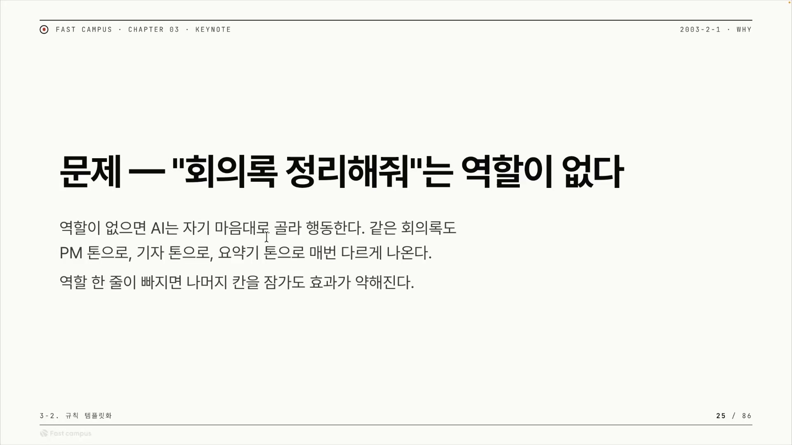
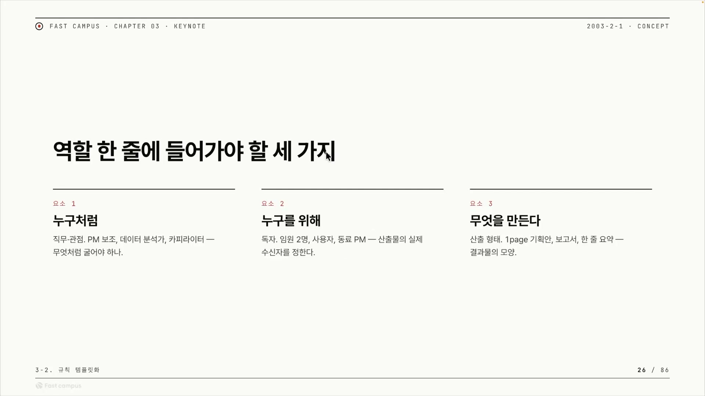
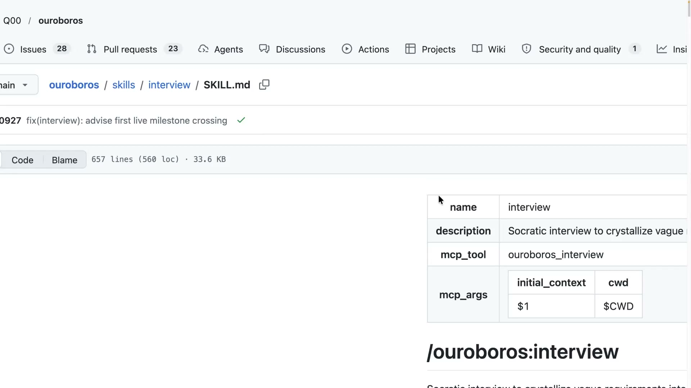
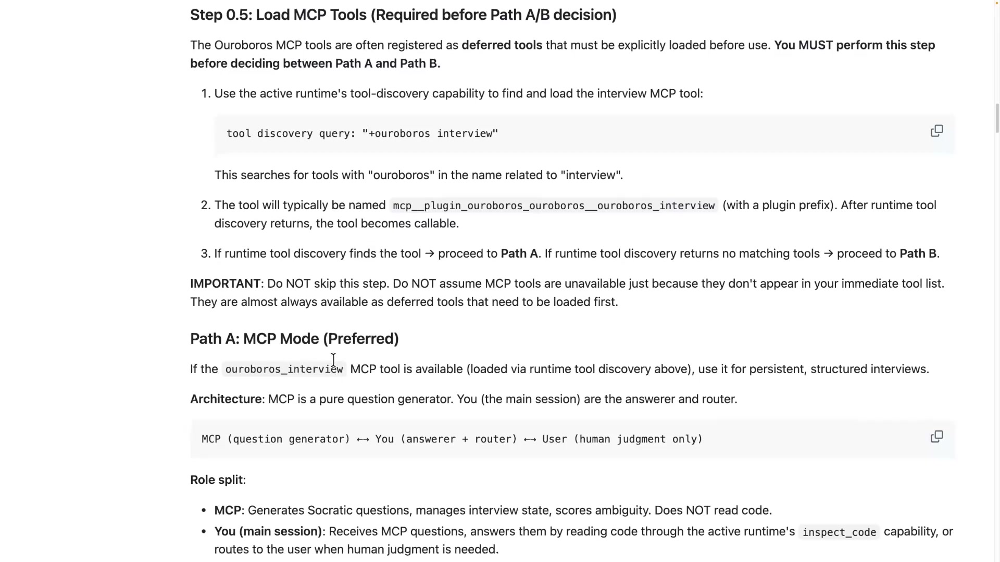
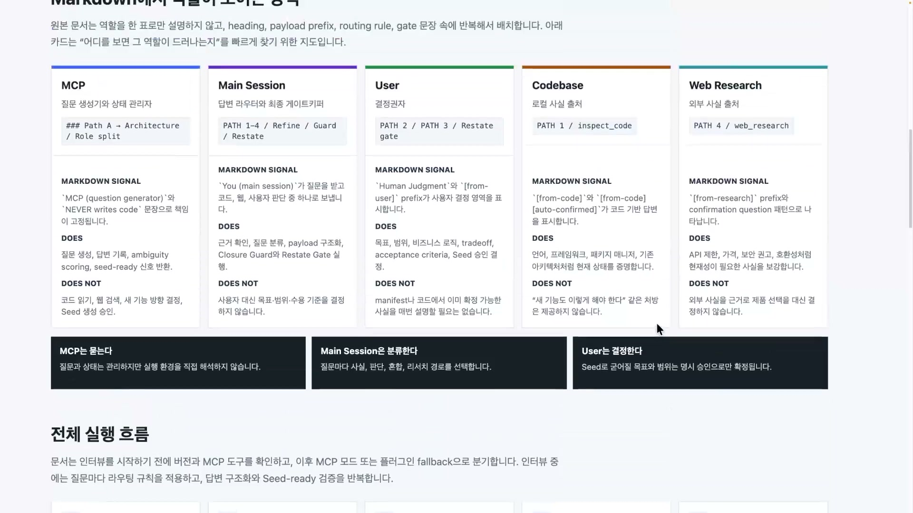
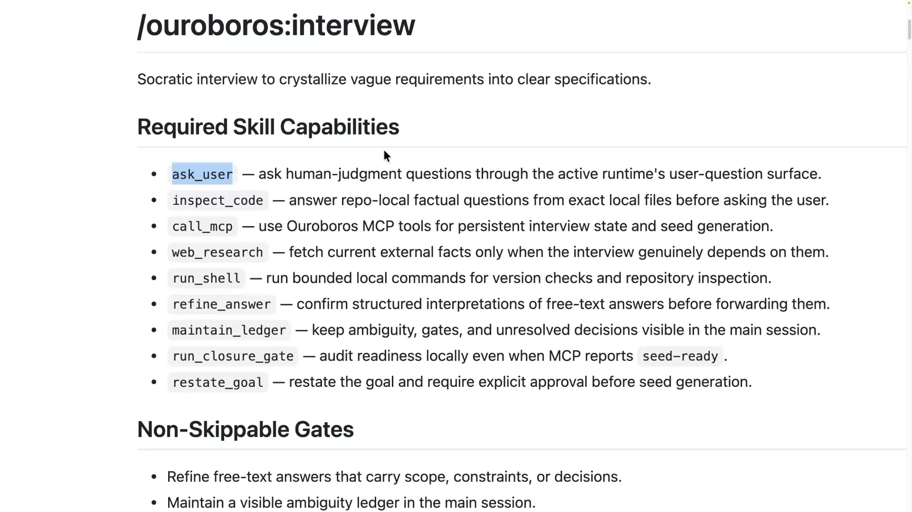
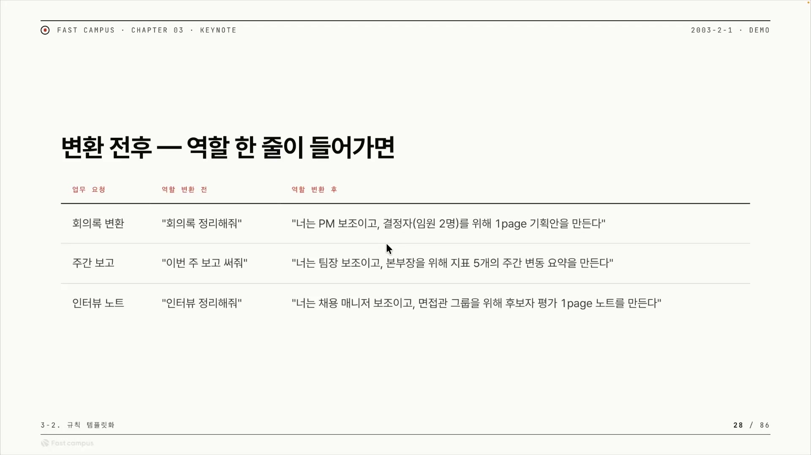

AI에게 "회의록 정리해줘"라고 같은 말로 시켰는데 결과가 매번 딴판이다. 어떤 날은 깔끔한 불릿 요약이 나오고, 어떤 날은 줄글 보고서가, 또 어떤 날은 액션 아이템 표가 나온다. 셋 다 틀린 답은 아니지만, 업무에 쓰려면 곤란하다. 오늘 받은 형식과 내일 받은 형식이 다르면 그걸 다시 손봐야 하니까.

이 들쭉날쭉함의 원인은 의외로 단순하다. 지시에 역할(Role)이 빠져 있어서다. "누구로서, 누구에게, 무엇을" 만들지를 안 알려줬으니, AI는 매번 자기 마음대로 고른다. 이 글은 AI에게 마크다운으로 일을 시킬 때 왜 이 역할 한 줄이 가장 먼저 와야 하는지, 그리고 그 한 줄에 무엇을 어떻게 박아야 하는지를 정리한 것이다. 패스트캠퍼스 강의 "역할이 잘 보이는 md 작성법"을 따라가며, 발표자가 직접 만든 오픈소스 우로보로스(Ouroboros)의 실제 스킬 파일을 열어 "역할을 잘 준다는 게 실제로 어떻게 생겼는지"까지 들여다본다.

## 마크다운으로 AI에게 일을 시킨다는 것

먼저 용어부터 짚는다. 프롬프트는 써봤지만 "스킬"이니 "하네스"니 하는 말이 생소할 수 있다.

하네스(harness)는 AI가 일하도록 감싸는 틀이다. 그냥 채팅창에 즉흥적으로 말을 거는 게 아니라, 규칙과 도구와 순서를 미리 갖춰둔 작업대라고 보면 된다. 스킬(skill)은 그 작업대에서 부르는 정해진 작업 단위다. 클로드 코드에서는 `/이름`으로, 코덱스에서는 `$이름`으로 호출한다. 그리고 이 스킬을 적는 형식이 마크다운(md)이다. `#`이나 `-` 같은 기호로 구조를 잡는 평범한 텍스트 문서다.

핵심은 이거다. 프롬프트 엔지니어링을 매번 새로 하는 대신, 일을 시키는 규칙을 마크다운 문서 한 장에 박아두면 처음부터 똑같은 품질로 시작할 수 있다. 강의는 앞 챕터에서 그 문서에 넣을 칸 네 개를 다뤘다. 역할, 목표, 금지, 출력. 여기에 예시와 검수를 더해 여섯 칸짜리 템플릿을 만드는 게 이 챕터의 목표인데, 그중에서도 이번 클립은 첫 칸인 '역할' 하나에 집중한다.

## 역할이 흐려지면 그 아래가 다 흐려진다

발표자의 주장은 분명하다. 스킬과 마크다운에서 제일 중요한 건 역할이다. 역할이 흐려지면 나머지가 다 별로가 된다.

근거로 세 가지를 든다. 첫째는 책임의 경계다. 역할을 정한다는 건 그 AI가 무엇을 하고 무엇을 하지 않을지의 테두리를 긋는 일이다. 그래서 역할은 금지나 출력 형식 같은 아래 칸들의 기준점이 된다. "꼼꼼한 PM처럼" 행동하라고 정해두면, 그 아래 금지 사항도 출력 형식도 PM의 일에 맞춰 자연히 정렬된다. 역할이 모호하면 그 아래 칸을 아무리 잘 써도 기준점이 없으니 효과가 약해진다.

둘째는 강의가 MoE 비유로 설명한 부분인데, 여기는 조심해서 받아들일 필요가 있다. MoE(Mixture of Experts)는 LLM을 여러 하위망으로 쪼개고 라우터가 토큰마다 그중 일부만 켜는 효율 구조다. 발표자는 이걸 "콜할 때마다 어떤 전문가가 배정될지 모르니, 역할을 제대로 줘야 다음 토큰 추론이 잘 된다"고 풀었다.

직관을 주는 그림으로는 좋다. 다만 기술적으로는 두 가지를 구분해야 한다. 하나, MoE의 라우팅은 API 콜 단위가 아니라 토큰 단위이고, 매 MoE 레이어마다 매번 일어난다. 둘, 여기서 켜지는 expert는 사람이 아는 '의료 전문가, 법률 전문가' 같은 게 아니라 학습으로 갈린 통계적 하위망이다. 그래서 우리가 부여하는 역할과 1:1로 대응하지 않는다.

그러니까 "역할을 주면 답이 좋아진다"는 효과는 MoE가 알맞은 전문가를 켜줘서가 아니다. 역할을 지정하면 모델이 관련된 문맥과 문체를 끌어내기 때문에 출력이 좋아지는, 프롬프트(인컨텍스트) 효과다. MoE 게이팅과 프롬프트 효과는 별개의 메커니즘이다. 강의는 둘을 인과로 이었지만 엄밀히는 구분하는 게 맞다.

셋째는 컨텍스트에서 컨트랙트로 넘어가는 첫 단추라는 점이다. 단순히 맥락(context)을 많이 던져주는 단계를 넘어, AI가 지켜야 할 규칙을 계약(contract)처럼 박아두는 단계로 가는데, 역할 정의가 그 첫 디딤돌이라는 것이다. 이 강의 자체는 컨트랙트를 깊게 다루지 않고, 다음 이야기로 넘긴다.

세 근거를 한 장면으로 모으면 앞에서 본 회의록 문제다. "회의록 정리해줘"에는 역할이 아예 없다. 그래서 AI가 매번 마음대로 고르고, 같은 회의록이 PM 톤, 기자 톤, 요약기 톤으로 들쭉날쭉 나온다. 여기서 진짜 손해는 "품질이 낮다"가 아니라 **"결과가 일정하지 않다"** 는 데 있다. 업무에 쓰려면 같은 입력에 같은 출력이 나오는 재현성이 필요한데, 역할이 없으면 그게 깨진다. 역할이 빠지면 다른 칸을 제대로 채워도, 체크리스트로 템플릿을 잘 만들어도 효과가 약해진다는 발표자의 말은 이 뜻이다.

## 역할 한 줄에 들어가는 세 가지

그럼 역할을 어떻게 적나. 강의가 제시하는 공식은 한 줄에 세 가지를 넣는 것이다.

| 요소 | 던지는 질문 | 회의록 예시 |
|---|---|---|
| 누구처럼 (페르소나) | 어떤 입장 · 전문성으로 굴어야 하나 | 꼼꼼한 PM처럼 |
| 누구를 위해 (수신자) | 이 결과물을 누가 받나 | 다음 주 합류할 신입을 위해 |
| 무엇을 (산출 · 액션) | 무엇을 내놓거나 어떤 행동을 하나 | 결정사항 · 담당 · 기한 표를 만든다 |

세 칸을 합치면 한 문장이 된다. "너는 꼼꼼한 PM처럼, 신입을 위해, 결정사항 · 담당 · 기한 표를 만든다." 앞의 맨몸 지시 "회의록 정리해줘"와 나란히 두면 차이가 분명하다. 같은 일을 시키는데 한쪽은 AI가 고를 여지를 통째로 열어두고, 다른 쪽은 세 가지를 다 닫아둔다.

발표자의 주장은 이 한 줄을 스킬 맨 앞에 두면 그 자체가 LLM에게 좋은 인스트럭션이 되고, 마크다운 스킬 하나만으로도 잘 동작한다는 것이다. 이 세 요소가 이 글에서 가져갈 단 하나의 실용 골자다.

## 잘 만든 실물을 열어본다: 우로보로스 인터뷰 스킬

공식만 보면 추상적이다. 그래서 강의는 잘 만든 실제 사례를 연다. 발표자 본인이 만든 오픈소스 우로보로스(Ouroboros, GitHub `Q00/ouroboros`)다.

우로보로스는 막연한 아이디어를 즉흥 프롬프트 대신 명세 우선(specification-first) 워크플로로 검증된 코드까지 끌고 가는 시스템이다. 슬로건이 "Stop prompting. Start specifying"(프롬프트를 멈추고 명세를 시작하라)이다. 이름값도 한다. 우로보로스는 자기 꼬리를 무는 뱀인데, 이 시스템도 Interview에서 Seed, Execute, Evaluate, Evolve로 이어지며 스스로를 먹고 도는 루프 구조다. 그중 강의가 여는 건 첫 단계인 인터뷰(interview) 스킬이다. 소크라테스식 문답으로, 답을 바로 주는 대신 연쇄 질문을 던져 사용자가 숨겨둔 가정과 모순을 스스로 드러내게 하는 단계다. 모호한 요구사항을 또렷한 명세로 깎아내는 입구인 셈이다.

이 스킬 파일을 위에서 아래로 따라 읽으면, "역할을 잘 준다"가 코드로 어떻게 생겼는지 보인다.

### 머리: 무슨 스킬인지, 그리고 절대 건너뛰면 안 되는 것

파일 맨 위에는 이름(`interview`)과 한 줄 설명이 붙어 있다. "Socratic interview to crystallize vague requirements into clear specifications"(소크라테스 인터뷰로 모호한 요구를 또렷한 명세로 결정화한다). 가볍게 시작하지만, 곧바로 무게가 실린다. 그다음에 오는 게 **절대 스킵하면 안 되는 게이트(Non-Skippable Gates)** 와 금지 원칙이기 때문이다. 발표자의 설명은 이렇다. 인터뷰는 우로보로스에서 굉장히 중요한 단계라, 확실하게 금지 원칙을 머리에 박고 들어간다.

repo를 직접 열어보면 이 게이트가 인상적이다. 핵심은 끝나는 시점을 감이 아니라 숫자로 잠가뒀다는 데 있다. "준비됐다고 느낄 때가 아니라 계산이 준비됐다고 할 때 끝난다"는 식이다. 모호도(ambiguity)가 0.2 이하로 내려가야 다음 단계로 넘어가고, 온톨로지 유사도가 0.95 이상이어야 루프를 종료한다. 역할과 규칙을 사람의 직감이 아니라 측정값으로 잠근 것이다.

### 몸통: 환경이 바뀌어도 역할은 안 흔들린다

스킬 본문은 경로를 둘로 가른다. Path A는 MCP 모드(Preferred)다. MCP는 AI를 외부 도구 · 데이터에 잇는 오픈 표준(Anthropic, 2024.11)인데, 우로보로스에서는 이게 메인이다. MCP가 잘 돌면 이 경로로 간다. MCP가 안 되면 Path B인 플러그인 폴백으로 넘어간다.

흥미로운 건 폴백 쪽이다. Path B 화면에는 "소크라테스 인터뷰 MD / Adopted role"이라 적혀 있다. MCP 도구가 없는 환경으로 떨어져도, 스킬이 소크라테스 인터뷰어라는 에이전트의 역할을 스스로 입어버린다. 경로가 둘로 갈려도 역할(소크라테스 인터뷰어)은 양쪽에서 그대로 유지된다는 뜻이다. 이게 이 대목의 교훈이다. 환경이 바뀌어도 역할은 흔들리지 않게 설계해뒀다.

그 역할이 누구에게 어떻게 나뉘는지는 스킬이 표로 정리해뒀다. 강의가 짚은 세 주체가 골격이다.

- **MCP는 질문 생성기이자 상태 관리자다.** 소크라테스식 질문을 만들고 인터뷰 상태를 관리하고 모호도를 채점한다. 코드는 읽지 않는다.
- **메인 세션은 답변 라우터이자 최종 게이트키퍼다.** MCP가 던진 질문을 받아, 코드를 직접 읽어 답하거나, 사람의 판단이 필요하면 사용자에게 라우팅한다.
- **유저는 결정권자다.** 목표, 수용 기준, 비즈니스 로직처럼 인간만 정할 수 있는 것만 받는다.

스킬 원문은 이걸 한 줄로 못박는다. "MCP (question generator) ←→ You (answerer + router) ←→ User (human judgment only)." 각 주체가 무엇을 하고(DOES) 무엇을 하지 않는지(DOES NOT)까지 명시돼 있다. 앞서 말한 "역할은 책임의 경계"가 문서 안에서 실제로 이렇게 생겼다. 누가 무엇까지 책임지고, 어디서부터는 손대지 않는지가 칸칸이 박혀 있다.

## 같은 기능을 런타임마다 다른 도구로 잇기

방금 표에서 메인 세션이 "코드를 읽는다"고 했는데, 여기에 숨은 설계가 하나 있다. 스킬은 그걸 "코드를 읽어라"라고 직접 적지 않는다. inspect code라는 추상 기능으로 적어두고, "그 런타임에서 inspect code에 해당하는 실제 도구를 찾아 읽어라"라고 한 단계 띄워 적는다. 왜 굳이 이렇게 하나.

같은 마크다운 스킬이라도 돌아가는 런타임이 다르다. 클로드 코드에서 도는 스킬이 있고 코덱스에서 도는 스킬이 있는데, 작동 방식부터 갈린다. 클로드는 `/`(슬래시)를 쳐야 스킬이 돌고, 코덱스는 `$`(달러)를 쳐야 쓴다. 더 큰 문제는 도구 자체가 다르다는 것이다. 클로드 코드에는 사용자에게 객관식으로 물어보는 `AskUserQuestion` 툴이 내장돼 있는데, 코덱스에는 그런 게 없다. 같은 "사용자에게 물어보기"를 하려는데 한쪽엔 그 도구가 아예 없는 것이다. 실제로 코덱스 쪽에는 이걸 클로드처럼 만들어달라는 기능요청 이슈(openai/codex #23623)가 미구현 상태로 올라와 있다.

발표자의 해법은 스킬 안에 공용어를 정해두는 것이다. `ask_user`나 `inspect_code` 같은 추상 이름을 스킬의 표준어로 삼고, 이 표준어를 각 런타임의 실제 도구에 맵핑한다. "이 `ask_user`는 클로드에서는 클로드의 `AskUserQuestion`에 연결한다"는 식으로, 런타임별 변환을 따로 적어둔다.

전원 플러그 어댑터를 떠올리면 된다. "사용자에게 물어보기"라는 전기는 어디서나 똑같이 필요한데 나라(런타임)마다 콘센트 모양이 다르니, 스킬은 표준 표기로 한 번 써두고 런타임마다 변환 플러그를 끼워 꽂는다.

다만 용어 하나는 정확히 짚어야 한다. 발표자는 이 구조를 "공용어(Ubiquitous Language)", "Capability Graph", "프로바이더 어댑터(provider adapter)"라고 부른다. 그런데 이 세 표현은 우로보로스 repo 어디에도 공식 용어로 등장하지 않는다. repo가 실제 쓰는 말은 `AgentRuntime` 프로토콜, 어댑터를 등록하는 `runtime_factory`, 그리고 ontology 같은 것이다. 특히 "Ubiquitous Language"는 원래 DDD(도메인 주도 설계)에서 빌려온 표현이다. 그러니까 이 세 단어는 발표자가 개념을 설명하려고 붙인 자기 명명이지 우로보로스의 공식 기능 이름이 아니다. 이름은 빌려온 것이되, 가리키는 설계 자체는 실재한다. 우로보로스는 `AgentRuntime` 프로토콜로 클로드, 코덱스, 오픈코드, 헤르메스, 제미나이 같은 런타임을 지원하고, 런타임마다 설치 산출물이 다르다. 클로드는 MCP 서버를 등록하고, 코덱스는 자기 규칙 · 스킬 폴더에, 제미나이는 `GEMINI.md`에 푸는 식이다. 같은 추상 기능을 런타임별 실제 산출물로 푼다는 강의의 취지 자체는 정확하다.

## 한 단계 위에서: 스킬을 무엇에 의존하게 둘 것인가

이 매핑 이야기는 "특정 도구에 안 묶이게 만드는 팁"으로 끝나지 않는다. 강의는 여기서 한 번 시야를 넓힌다. 마크다운 스킬을 쓴다는 건 곧 어떤 모델이나 런타임에 의존성(dependency)이 걸리기 쉽다는 뜻이고, 잘 알려진 세 프로젝트가 이 의존성을 서로 다르게 설계했다는 것이다. 강의에선 십여 초 만에 스쳐 가지만, 표로 정리하면 역할 설계라는 주제가 한 층 위에서 묶인다.

| 프레임워크 | 만든 곳 | 의존성을 어디에 거나 | 한 줄 성격 |
|---|---|---|---|
| gstack | Garry Tan | 클로드 코드에 묶음. 스킬이 클로드의 슬래시커맨드 인프라와 네이티브 기능에 의존 | 역할 거버넌스 |
| Superpowers | obra (Jesse Vincent) | 짧은 마크다운 스킬을 모델이 직접 읽게 함. 더불어 실행 규율용 런타임 훅도 일부 씀 | 실행 규율 |
| 우로보로스 | Q00 | 런타임 이식성. 추상 기능을 런타임마다 다른 산출물로 매핑 | 명세 우선 + 런타임 중립 |

gstack은 모든 스킬이 순수 마크다운인데 클로드 코드의 슬래시커맨드에 끼워져 동작한다. 그래서 클로드에 의존이 걸린다. Superpowers는 스킬을 짧게 써서 어느 런타임이든 모델이 그 짧은 스킬을 직접 읽고 이해하게 만든다. 다만 이걸 "순수 모델 의존만"이라고 적으면 정확하지 않다. 서브에이전트 디스패치처럼 마크다운만으로는 줄 수 없는 실행 기능을 위해 런타임 훅도 함께 쓰기 때문이다. 우로보로스는 앞에서 본 대로 스킬에 추상 기능을 걸어두고 각 런타임이 그걸 어떻게 해석하는지를 적어, 스킬에 등장하는 주체들에게 역할을 부여하는 쪽이다.

세 방식의 메시지는 결국 하나로 모인다. 역할을 잘 박는다는 건, 이 스킬이 무엇에 의존하게 둘 것인가를 정하는 일이기도 하다. 클로드에 묶을지, 모델의 독해력에 맡길지, 런타임에 중립으로 둘지. 역할 한 줄을 정하는 일이 실은 이 큰 선택의 입구다.

## 그래서 내 손으로는 이렇게 적는다

다시 처음의 회의록으로 돌아온다. 가진 도구가 우로보로스 같은 큰 시스템이 아니어도, 마크다운 스킬 한 장을 잡을 때 역할 한 줄에 세 가지를 채우면 된다.

1. **페르소나를 넣는다.** 누구처럼 굴어야 하나. 발표자는 인터뷰 스킬에 소크라테스 인터뷰어를 넣었다. 내가 시키는 일에는 어떤 입장과 전문성을 입힐지 적는다.
2. **받을 액터를 적는다.** 이 결과물을 누가 받나. 임원인지, 신입인지, 옆 팀 PM인지에 따라 같은 내용도 다르게 정리돼야 한다.
3. **무엇을 만들지 적는다.** 어떤 산출물을 내놓거나 어떤 행동을 해야 하는지. 이게 또렷해야 스킬이 제대로 동작한다.

맨몸 지시와 역할 한 줄을 더한 지시를 나란히 두면 차이가 손에 잡힌다. "회의록 정리해줘"는 "너는 PM 보조이고, 결정자(임원 2명)를 위해 1page 기획안을 만든다"가 되고, "이번 주 보고 써줘"는 "너는 팀장 보조이고, 본부장을 위해 지표 5개의 주간 변동 요약을 만든다"가 된다. "인터뷰 정리해줘"는 "너는 채용 매니저 보조이고, 면접관 그룹을 위해 후보자 평가 1page 노트를 만든다"가 된다. 추가된 건 역할 한 줄뿐인데, AI가 고를 여지가 사라지면서 결과가 안정된다.

## 역할이 잠기면 그 아래가 따라 잠긴다

글을 닫는 한 문장은 시작에서 본 원리로 돌아온다. 역할을 잘 잠가두면 그 흐름 자체를 만들어낼 수 있다. 역할이 잠기면, 그 아래 나올 금지 원칙도 출력 형식도 그 역할에 맞춰 따라 잠긴다.

건물에 비유하면 역할 한 줄은 1층 기둥이다. 기둥을 똑바로 세우면 그 위의 금지 층, 형식 층이 알아서 정렬된다. 기둥이 비뚤면 위층이 전부 비뚤어진다. 우로보로스 인터뷰가 특이했던 건, 이 인터뷰가 결정론적으로 프로그램에 들어가다 보니 스킬 자체가 하나의 객체처럼 되어 있다는 점이다. 그래서 인터뷰가 시작되면 무조건 해야 할 것부터 먼저 보여주고, 주체가 워낙 많아 단계별로 역할을 쪼개 설명해뒀다. 규모가 큰 만큼 역할을 더 촘촘히 잠가둔 사례인 셈이다.

여기서부터는 다음 이야기다. 역할이 왜 먼저인지를 알고 나면, 마크다운 한 장으로 끝나는 하네스를 넘어 분업형 하네스, 나아가 MCP형 하네스로 갈 때도 마크다운을 어떻게 써야 할지 감이 잡힌다. 그 단계가 아무리 복잡해져도, 출발점은 같다. 역할 한 줄을 어떻게 정했느냐.
