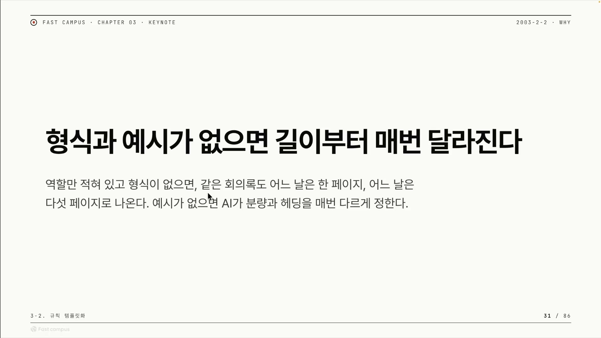
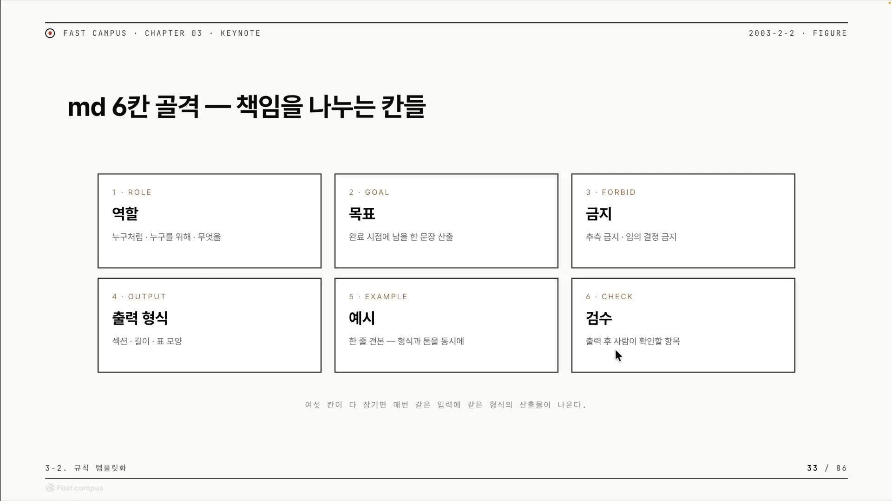
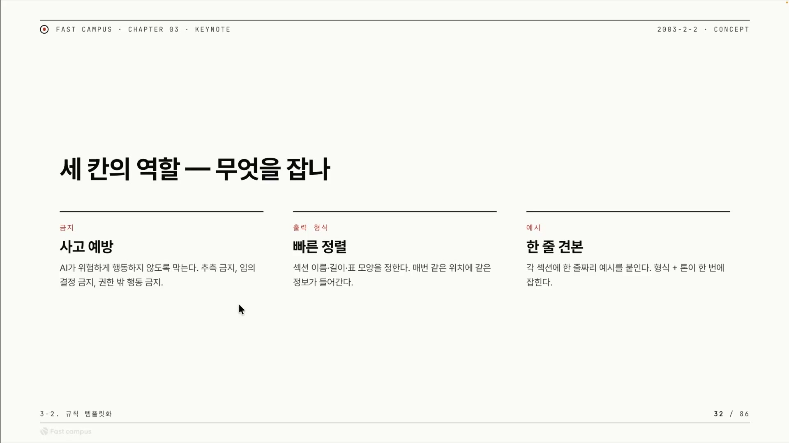
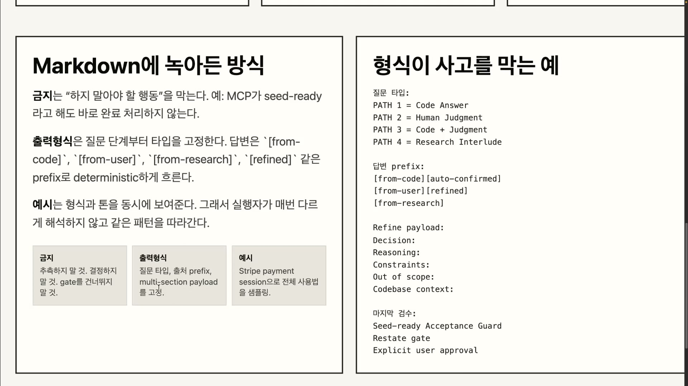
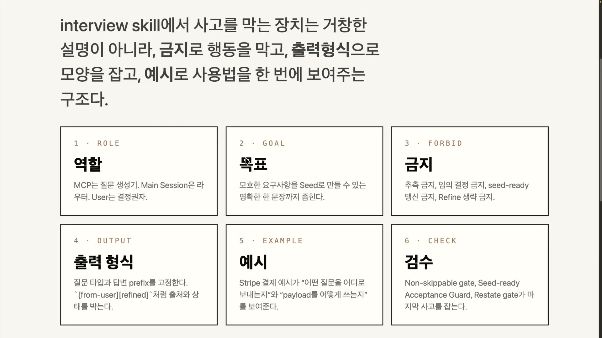
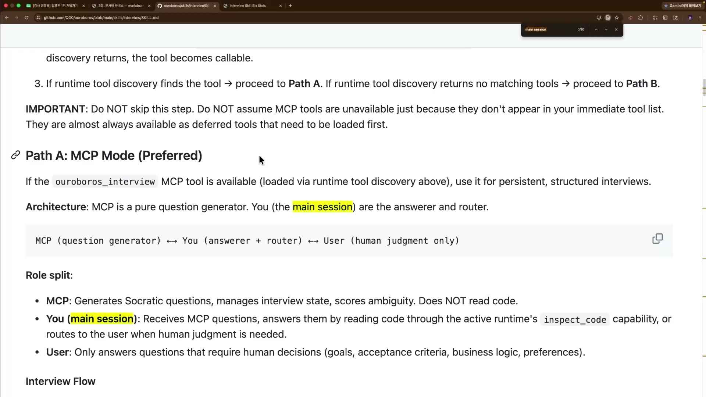
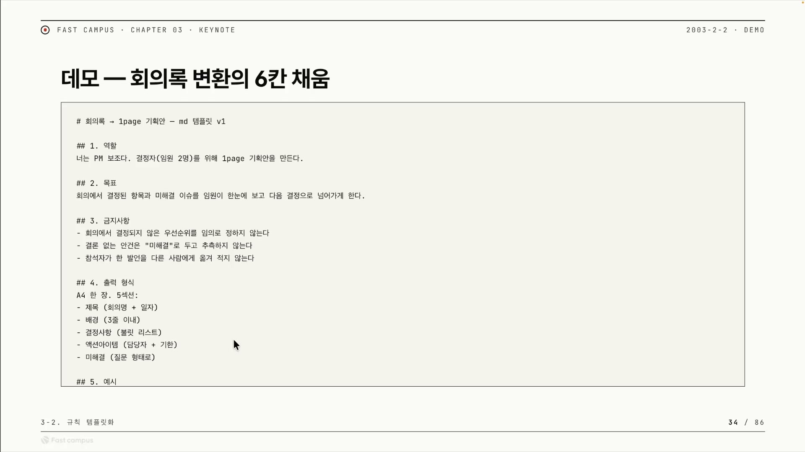
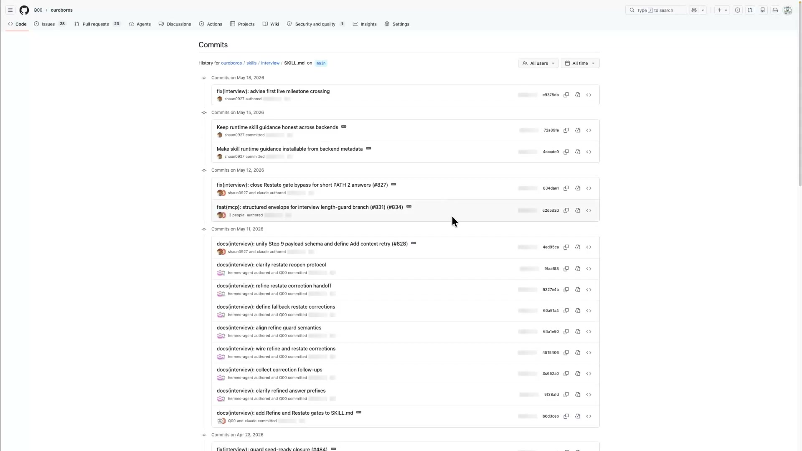

같은 스킬을 같은 입력으로 두 번 돌렸는데, 한 번은 한 페이지가 나오고 한 번은 다섯 페이지가 나온다. 어떤 날은 AI가 "이건 백서로 써야겠다"며 장문을 쏟아낸다. 강의자가 든 이 장면이 마크다운 하네스를 이해하는 출발점이다. 역할(role)만 적어 두고 출력의 모양을 정해 주지 않으면, AI는 "이 작업을 어떻게 해야 하는지"를 들은 적이 없으니 매번 다르게 짐작한다. 분량이 흔들리면 그에 딸린 헤딩 깊이, 섹션 구성까지 같이 흔들린다.

이 들쭉날쭉함을 없애려고 만드는 것이 마크다운 하네스다. 여기서 하네스(harness)는 말이나 낙하산에 채우는 고정 장구를 뜻한다. 강한 힘을 풀어 두지 않고 정해진 궤도로만 움직이게 묶는 틀이다. 강의에서 하네스는 추상 개념이 아니라 Skill을 구성하는 한 개의 마크다운 규칙 문서를 가리킨다. 사람이 매번 자연어로 "이렇게 해줘"라고 부탁하는 대신, AI가 어떤 역할로 무엇을 어떻게 해야 하는지를 마크다운 파일에 항목으로 미리 적어 둔 것이다. 그리고 이 강의가 다루는 하네스는 머릿속 모델이 아니라, 강의자가 운영 중인 `ouroboros/interview` 스킬의 SKILL.md 파일 하나로 실제로 존재한다.

## 잠근다는 말의 뜻

강의 전체를 관통하는 동사가 "잠근다(lock)"다. 비유로 흘려보내면 오해하기 쉬우니 무엇을 어떻게 고정하는지 풀어 보자.

강의자는 "왜 이걸 미리 적어 놔야 되냐, AI한테 맡기면 안 되냐"고 스스로 묻고 답한다. "당연히 금지해야 될 것들은 우리가 디터미니스틱하게 막아놔야겠죠. 그래야지만 우리가 AI에게 위임할 수 있을 거라고 생각을 하고요." 여기서 잠근다의 반대말은 "AI의 런타임 판단에 맡긴다"다. 같은 결정을 매 호출마다 AI가 즉석에서 추론하면 결과가 흔들리고, 그 추론에 토큰이 낭비된다. 그래서 변하지 않을 것들은 마크다운 항목으로 박아 둔다.

핵심은 잠근다가 "AI를 더 똑똑하게 만든다"가 아니라는 점이다. AI가 즉석에서 결정할 자유를 미리 빼앗아 한 곳에 못 박는 일이다. 결정권이 런타임의 AI에서, 설계 시점에 사람이 쓴 마크다운으로 옮겨 간다.

왜 굳이 미리 잠그느냐는 결국 비용 계산이다. AI에게 일을 맡겼는데 하지 말아야 할 짓을 하면 "감시비용 플러스 복구비용이 더 들게 되잖아요"라고 강의자는 말한다. 트레이드오프를 펼치면 이렇다. 미리 잠그는 비용은 설계 시점에 사람이 마크다운을 한 번 잘 쓰는 노력이다. 일회성 선불이다. 안 잠갔을 때의 비용은 AI가 매번 제대로 했는지 지켜보는 감시비용과, 잘못한 걸 되돌리는 복구비용이다. 이건 호출할 때마다 반복되는 후불이다. **선불 한 번이 매번 반복되는 감시와 복구보다 싸기 때문에, 위임이 성립하려면 먼저 잠가야 한다.** 위임은 신뢰의 문제가 아니라 비용의 문제다.

## 여섯 칸으로 나눈 책임

강의자는 하네스를 떠받치는 기둥을 여섯 개로 정리한다. 역할, 목표, 금지, 출력형식, 예시, 검수다.

| # | 기둥 | 한 줄 책임 |
|---|---|---|
| 1 | 역할 (role) | 누구처럼 · 누구를 위해 · 무엇을. AI에 페르소나를 입힌다 |
| 2 | 목표 (goal) | 완료 시점에 남을 한 문장 산출. 무엇을 해야 하는지 |
| 3 | 금지 (forbid) | 추측 금지 · 임의 결정 금지 · 권한 밖 행동 금지. 사고를 예방한다 |
| 4 | 출력형식 (output) | 섹션 · 길이 · 표 모양을 정해 데이터 타입을 고정한다 |
| 5 | 예시 (example) | 한 줄 견본으로 형식과 톤을 동시에 잡는다 |
| 6 | 검수 (check) | 출력 후 사람이 앞 다섯 칸을 잘 지켰는지 확인한다 |

앞 두 칸인 역할과 목표는 이전 강의에서 다뤘다. 이번 클립의 무게중심은 가운데 세 칸, 금지와 출력형식과 예시다. 강의자는 이 셋을 각각 한 단어 슬로건으로도 정리한다. 금지는 사고 예방, 출력형식은 빠른 정렬, 예시는 한 줄 견본이다.

## 금지, 내가 시키지 않은 위험을 막는 칸

금지에 대한 강의자의 정의는 이렇다. "금지해야 될 것, 하지 말아야 될 것들은 우리가 상상하지 못한 것들, 그리고 우리가 AI에게 위임을 하는 데 있어서 하지 말아야 될 것들을 리스트업 해준다고 보면 됩니다." 여기서 핵심 단어가 "우리가 상상하지 못한 것들"이다. 역할과 목표 칸이 "무엇을 하라"라면, 금지 칸은 내가 시키지 않았는데 AI가 알아서 해 버릴 위험한 행동을 미리 차단하는 울타리다. 금지는 시킨 일을 잘하게 만드는 칸이 아니라, 안 시킨 위험을 막는 칸이다.

보고서를 쓰는 일반 작업이라면 금지의 표준 세트는 셋이다. 추측 금지는 모르면 지어내지 말고 비워 두거나 물으라는 것이고, 임의 결정 금지는 사람이 정할 범위나 해석을 AI가 멋대로 확정하지 말라는 것이며, 권한 넘는 행동 금지는 위임받은 범위 밖으로(삭제, 전송, 외부 호출 같은) 나가지 말라는 것이다. 이 셋이 "사고 예방"을 구체적 항목으로 떨어뜨린 모양이다.

### 분홍 코끼리 효과, 함정이자 도구

그런데 금지에는 함정이 있다. 강의자는 이걸 직접 실연한다. "여러분들한테 제가 이제 분홍코끼리라고 얘기하면 분홍코끼리가 갑자기 이제 머릿속에 떠오른다는 거죠." 어떤 생각을 일부러 안 하려고 누르면 오히려 그 생각이 더 자주, 더 강하게 떠오른다. 사회심리학에서는 이를 아이러니 과정 이론(Ironic Process Theory)이라 부른다. 머릿속에서 "그 생각을 안 하려 주의를 돌리는 과정"과 "그 생각이 떠올랐나를 자동으로 스캔하는 감시 과정"이 동시에 도는데, 그 감시 과정이 역설적으로 금지된 대상을 계속 의식 위로 끌어올린다. [학습 지식]

마크다운 금지 칸에 "X 하지 마"라고 쓰면, AI는 그 토큰 X를 컨텍스트에 계속 들고 있어야 하므로 사람 머릿속의 분홍 코끼리처럼 X가 계속 활성화된다. 이게 역효과다.

강의자의 전환은 여기서 일어난다. 떠오르게 만드는 그 성질을, 나쁜 걸 막는 데가 아니라 좋은 걸 계속 시키는 데로 돌려쓴다. "오히려 아까처럼 가장 맨 위로 올려서 진행을 하되 이것을 꼭 하게끔 만드는 형태로도 AI 움직임을 제한할 수 있다는 거죠." 실제 마크다운에서는 두 동작으로 떨어진다. 하나는 금지 항목을 하네스 맨 위에 두는 것이다. AI가 매 턴 가장 먼저 읽는 자리라, 분홍 코끼리처럼 그 항목이 컨텍스트 내내 활성 상태로 남는다. 다른 하나는 "하지 마"를 "반드시 하라"로 적는 것이다.

### 드모르간과 대우, 부정을 긍정으로 뒤집기

강의자는 이 뒤집기를 집합론의 언어로 설명한다. "이것들을 이제 이 드모르간의 법칙을 이용해서, 그 있죠 우리 집합 얘기할 때 하는 것처럼, 이것들을 대우로 해둔다면 결국에는 AI가 올바르게 하게끔 한다 하잖아요."

엄밀히 따지면 드모르간 법칙과 대우는 다른 개념이다. 드모르간 법칙은 부정을 괄호 안으로 분배하면 AND와 OR가 뒤집히는 규칙이고(`NOT (A AND B)`는 `(NOT A) OR (NOT B)`와 같다), 대우는 조건문 "P이면 Q"를 "Q가 아니면 P가 아니다"로 뒤집어도 원래 명제와 항상 같다는 동치 변환이다. [학습 지식] 강의자는 이 둘을 묶어 "금지(부정)를 뒤집어 같은 내용을 긍정형으로 다시 쓴다"는 직관으로 느슨하게 쓴다. 수학적으로 정밀한 대응이라기보다, 부정을 긍정으로 바꿔도 같은 걸 강제한다는 비유로 받는 게 맞다.

변환의 모양은 이렇다. 강의에서 실제로 못 박힌 표현은 오른쪽 긍정형(예: "refine을 무조건 하도록")이다. 왼쪽 부정형은 그 긍정형이 무엇을 막으려던 것인지 짝을 맞춰 거꾸로 적어 본 것이다.

| 금지형 (부정, 짝 맞춤) | 강제형 (긍정, 강의 원문) |
|---|---|
| shared ontology 없이 인터뷰 끝내지 마 | refine을 무조건 하라 |
| 추측하지 마 | 근거(from 코드 · 리서치 · 유저)를 반드시 명시하라 |
| seed ready를 맹신하지 마 | seed ready가 와도 다시 한번 검토하라 |

논리적 내용은 같은데, 표현이 부정에서 긍정으로 바뀐 순간 분홍 코끼리 효과의 방향이 뒤집힌다. "하지 마"는 막으려는 대상을 떠올리게 하지만, "반드시 하라"는 해야 할 행동을 떠올리게 만든다. 그래서 AI가 그 행동을 계속 생각하게 되고, 결국 그렇게 할 수밖에 없게 된다. 신비한 일은 없다. 앞서 본 그대로, 금지든 강제든 그 토큰이 컨텍스트에 계속 살아 있어 AI가 매 턴 의식한다는 한 가지 사실이 맨 위 배치와 긍정형 표현이라는 구체 기법으로 떨어질 뿐이다.

## 출력형식, 주고받는 데이터의 모양을 고정한다

출력형식은 아웃풋과 액터(actor)들이 주고받는 데이터의 타입을 미리 못 박아 두는 것이다. 강의자의 정의로는 "아웃풋을 우리가 정해주고, 각각의 그런 주고받을 때, 이 액터들과 주고받을 때 데이터 타입들을 정해주는" 것이다. 여기서 액터는 스킬 안에서 데이터를 주고받는 주체들이다. 우로보로스 인터뷰라면 질문을 만드는 MCP, 그 질문과 답을 라우팅하는 메인 세션, 최종 결정권을 쥔 유저가 액터다. 데이터 타입은 그 액터들 사이를 오가는 데이터가 어떤 모양인지를 가리킨다.

왜 미리 정하느냐. "출력 형식 같은 경우에도 매번 바뀌지 않잖아요." 변하지 않는 약속이기 때문에 한 번 박아 두면 AI는 매번 새로 해석할 필요가 없다. 일반 소프트웨어에서 함수의 입력과 출력 타입을 미리 선언해 두면 호출하는 쪽이 변환 로직을 추측하지 않아도 되는 것과 같은 발상이다. [학습 지식]

### 형식이 없으면 토큰이 새는 자리

형식을 정해 두지 않으면 AI는 매 턴마다 같은 세 단계를 처음부터 밟는다. 먼저 데이터를 이해하는 것부터 시작한다("이번엔 데이터가 이렇게 왔네?"). 다음에 어떻게 써야 할지 추론한다("내가 이걸 어떻게 써야지"). 그리고 어떻게 변환할지 추론한다("이걸 어떻게 변환해야지"). 이 세 단계는 전부 사용자가 원하는 최종 결과물과는 무관한 준비 작업이다. 그런데 LLM은 이 준비 작업도 토큰을 쓰는 추론으로 처리한다. 형식이 고정돼 있으면 AI는 "아, 답변은 항상 정해진 prefix로 시작하지" 하고 바로 알기 때문에 이해와 변환 단계를 통째로 건너뛴다. 형식이 없으면 그 건너뛰기가 불가능해, 매 턴마다 같은 해석 비용을 다시 낸다.

강의자는 형식이 만드는 효과를 "빠른 정렬"이라 부른다. 효과는 두 갈래다. AI 쪽에서는 속도다. 데이터 타입을 이미 아니까 이해와 변환 리즈닝을 건너뛰고 다음 단계로 바로 넘어간다. 인간 쪽에서는 검수 비용 절감이다. "그렇게 되면 결국 인간의 건수 비용도 줄어들게 되겠죠." 출력이 매번 같은 자리에 같은 모양으로 나오면, 사람은 "이번엔 어떤 형식으로 왔지?"를 다시 파악할 필요 없이 정해진 자리만 확인하면 된다. 형식 고정은 AI의 토큰만 아끼는 게 아니라 사람의 확인 노동까지 줄인다.

### 우로보로스의 prefix, 어디서 왔고 지금 어떤 상태인가

강의자는 자기 인터뷰 스킬에서 출력형식을 어떻게 잠갔는지 보여 준다. 두 축이다. 질문 타입을 정해 두고, 답변에 prefix를 붙여 상태와 출처를 표시한다.

prefix가 구별하는 출처는 네 갈래다. 답변이 코드(파일)에서 길어 올려진 것인지, AI가 조사하고 추론한 리서치인지, 메인 세션이 직접 말한 것인지, 유저가 준 답변이고 지금 다듬어지는 중인지를 표시한다. 강의에서 그대로 인용된 표지는 `from 코드` 하나지만, 실제 스킬 화면에는 더 구체적인 문자열이 비친다.

이 화면에서 형식이 패스(path) 단위로도 잡혀 있는 게 보인다. 같은 인터뷰 안에서도 단계마다 채워야 할 페이로드(payload, 포장을 뺀 알맹이 데이터)의 모양이 따로 지정돼 있다. prefix 단계, refine 단계, 검수 단계가 각각 다른 페이로드 형식을 갖는다. 강의자의 말로는 "prefix부터 refine 했을 때는 이러한 페이로드를 써야 해, 검수일 때는 이런 것들을 써야 돼, 이런 식으로 형식을 잡아둠으로써 예측 가능하게 만드는 것"이다.

prefix로 상태와 출처를 박아 둔 덕에 따라오는 효과가 셋이다. 모두 별개 항목이 아니라 "출처와 상태를 답변에 새겨 두니 따라온 것"이다. 첫째, 재현이 된다(replayable). 답변마다 출처와 상태가 찍혀 있으니, 인터뷰 전체를 나중에 되짚으면 "이 답은 코드에서, 저 답은 유저에게서, 그 다음은 refine 단계에서" 하고 흐름을 그대로 재생할 수 있다. 둘째, 디버깅이 쉬워진다. 어디서 어긋났는지를 prefix만 보고 짚는다. 셋째, 다음 액터가 답변의 무게를 안다. MCP는 들어온 답변의 prefix를 보고 "아, 이건 유저한테 받은 답변이구나, 중요하구나"를 즉시 안다. 형식이 곧 액터 사이의 신호 체계가 되는 셈이다.

## 예시, 마크다운에 영속화한 퓨샷

예시는 마크다운 하네스에 박아 두는 퓨샷(few-shot)이다. 강의자는 예시를 프롬프트 엔지니어링의 용어로 곧장 번역한다. "예시 같은 경우에는 그 둘을 이제 원샷이 아니라 프롬프트 엔지니어링으로 치자면 퓨샷! 퓨샷으로 얘기하면서 금지, 이런 출력 형식, 예시 이런 것들을 우리가 잠가볼 수 있다고 생각합니다."

용어를 정리하면 이렇다. 제로샷(zero-shot)은 예시 없이 지시만 준다. 원샷(one-shot)은 견본 한 개를 보여준 뒤 작업을 시킨다. 퓨샷(few-shot)은 견본 여러 개(보통 두셋에서 다섯)를 보여준 뒤 작업을 시킨다. 이것은 인컨텍스트 러닝(in-context learning)의 대표 형태다. 모델의 가중치를 재학습으로 고치는 게 아니라, 프롬프트 안에 넣은 입력과 출력 쌍만으로 모델이 "아, 이 작업은 입력을 이렇게 받아 출력을 이렇게 내는 거구나"를 그 자리에서 추론하게 만드는 방식이다. [학습 지식]

강의자가 말하는 "예시를 마크다운에 미리 적어 둔다"는 것은, 채팅창에 매번 예시를 붙여넣는 대신 스킬 파일 안에 퓨샷 견본을 고정해 두는 일이다. 일회성 대화로 쓰던 퓨샷을 재사용 가능한 규칙으로 영속화한 형태다.

### 왜 예시가 다음 토큰을 잡는가

LLM은 근본적으로 지금까지의 문맥을 보고 그 다음에 올 가장 그럴듯한 토큰을 확률로 고르는 기계다. 매 순간 "앞에 있던 모든 토큰을 봤을 때 다음 토큰이 무엇일 확률"을 계산해 한 토큰씩 뱉는다. [학습 지식] 그래서 앞에 무엇을 넣어 두느냐가 다음에 나올 것을 통째로 바꾼다. 예시를 컨텍스트에 넣으면, 모델 입장에서 "방금 본 예시와 비슷한 흐름, 형식, 어투로 이어가는 것"이 확률적으로 가장 자연스러운 다음 토큰이 된다. 강의자의 표현 그대로다. "그 컨텍스트 기반으로 다음 토큰을 굉장히 잘 추론하게 됩니다. 이 퓨샷을 통해서 AI의 그 다음 토큰을 우리가 제어할 수 있다는 거예요."

여기서 예시의 강점이 나온다. 지시문으로 "JSON으로 답해라, 어투는 간결하게 해라"를 따로따로 풀어 쓰는 것보다, 완성된 예시 한 개가 형식과 톤과 구조를 동시에 담는다. 예시는 규칙을 설명하는 게 아니라 결과물 자체를 보여주기 때문이다. 그래서 "퓨샷을 몇 번 넣어주면 형식과 톤이 한 번에 잡힌다."

### 스트라이프 결제 예시

추상 원리를 강의자는 자기 스킬의 코드로 내린다. 예시 칸에 박아 둔 것이 스트라이프(Stripe) 결제 예시다. "이런 식으로 스트라이프 질문이 들어왔을 때 어떠한 식으로 진행을 해야 되는지 이런 것들을 적어둔 거죠." 이 예시가 시범 보이는 것은 셋이다. 어떤 질문이 들어왔을 때라는 입력 트리거, 그 질문을 어떤 액터에게 어떻게 보내고 진행하는지라는 처리 흐름, 주고받는 페이로드를 어떻게 쓰는지라는 데이터의 실제 모양이다. 이 셋을 말로 설명하는 대신 작동하는 한 판으로 박아 두니, AI는 결제 비슷한 새 상황에서 같은 진행, 같은 페이로드 모양을 재현한다.

스트라이프 예시의 실제 코드 텍스트는 강의 전사에 나오지 않는다. 슬라이드 화면에만 비친다. 그래서 여기서는 "무엇을 시범 보이는가"까지만 다루고, 없는 코드를 지어내지 않는다. 강의자가 이 효과를 못 박은 한 문장은 이렇다. "이렇게 쓰면 된다를 보여주니까 다음에도 쓸 때도 계속 같은 모양을 보여주는 형태가 됐습니다." 예시는 결국 일관성 장치다. 한 번 좋은 모양을 견본으로 박아 두면 그다음부터 출력이 그 모양으로 수렴한다.

## 우로보로스 인터뷰, 여섯 칸이 실제 값으로 채워진 모습

세 칸을 따로 보았으니, 이제 한 스킬 안에서 여섯 칸이 어떻게 맞물리는지 본다. 우로보로스 인터뷰 스킬이 푸는 문제는 단순하다. 모호한 요구사항을, seed(씨앗)로 만들 수 있는 명확한 한 문장까지 좁히는 인터뷰다. 사람이 처음 던지는 요구는 "회의록 좀 정리해줘"처럼 해석의 여지가 많다. 이 모호함을 그대로 두고 작업을 시작하면 AI가 빈칸을 추측으로 메운다. 우로보로스는 그 추측을 막고, 질문을 던져 모호함을 한 문장으로 압축할 때까지 사람과 대화한다.

| 기둥 | 우로보로스에서 채워진 값 |
|---|---|
| 역할 | MCP는 질문 생성기 · 메인 세션은 라우터 · 유저는 결정권자 |
| 목표 | 모호한 요구사항을 seed로 만들 수 있는 명확한 한 문장까지 좁힌다 |
| 금지 | 추측 금지 · 임의 결정 금지 · seed ready 맹신 금지 · refine 생략 금지 |
| 출력형식 | 질문 타입 지정 + 답변 prefix 고정(상태와 출처를 박음) |
| 예시 | 스트라이프 결제 예시 한 판 |
| 검수 | 금지 따랐나 · seed ready 진짜 됐나 · refine 끝나 restate 되나 |

역할의 3자 구조가 의미 있는 이유는, 질문을 만드는 자와 결정하는 자를 떼어 놓기 때문이다. MCP는 묻기만 하고, 의미를 확정하는 권한은 사람에게 남는다. 그래서 금지의 "의미 결정 금지"가 자연스럽게 따라온다. 역할 한 칸을 잘 정하면 나머지 칸이 따라온다는 게 첫 클립의 교훈이었고, 우로보로스가 그 산 증거다.

금지 네 줄은 그대로 분홍 코끼리의 역이용 사례다. "seed ready 맹신 금지"를 보자. 질문 생성기 MCP가 "이제 seed 만들 준비 됐어요(seed ready)"라고 신호를 보내도, 메인 세션이 보기에 아직 부족하면 그 신호를 믿지 말라는 것이다. 강의자가 직접 짚는다. "맹신 금지라고 얘기를 한다는 것 자체는 이 분홍 코끼리의 역효과를 얘기하는 거죠. seed ready가 오는 그 순간을 기다리게 만드는 거죠. 기다리게 만들어서 seed ready가 왔을 때 '어? 이거 내가 지금 해야 되나 말아야 되나' 계속 생각하게 만드는 겁니다." 맹신하지 말라는 금지가, seed ready 순간을 AI가 계속 의식하며 기다리게 만든다.

### refine 생략 금지, 실패에서 나온 규칙

우로보로스에서 강의자가 가장 공들여 들려주는 대목은, refine 생략 금지가 어떻게 금지 칸에 들어가게 됐는가다. 이건 추상 규칙이 아니라 그가 직접 겪은 실패에서 나왔다.

인터뷰는 소크라테스식 세 단계로 돈다. wonder(궁금해하며 질문)에서 reflect(서로 다른 점을 깨달음)을 거쳐 refine(그 차이를 좁혀 합의)에 이른다. 이 과정에서 만들어지는 것이 shared ontology, 곧 AI와 사람이 "이 단어를 같은 뜻으로 쓰고 있다"고 합의한 어휘 지도다. refine은 그 지도에 찍는 마지막 합의 도장이다.

그런데 강의자가 만든 툴들은 원래 클로드 코드(Claude Code)에서 시작했는데, 우로보로스가 다른 런타임으로 옮겨가자 스케일을 훌쩍 건너뛰는 경우가 생겼다. 그 과정에서 refine 단계가 통째로 건너뛰어졌다. shared ontology를 만들지 못한 채 인터뷰가 끝났고, 유저 입장에서 "이거 조금 큰 작업이면 제대로 안 되네"라는 피드백이 돌아왔다. 작은 작업이면 어휘 차이가 적어 그럭저럭 넘어가지만, 큰 작업일수록 합의되지 않은 개념의 어긋남이 누적돼 터진다. refine 생략이 위험한 진짜 이유는 규모가 커질 때 비로소 드러나는, 합의 부재의 비용이다.

강의자는 이 실패를 받아 "refine을 무조건 하도록" 금지 사항에 못 박았다. 앞서 본 긍정 강제형 그대로다. 막으려는 행동(생략)을 적는 대신 시키려는 행동(실행)을 적어, 분홍 코끼리 효과를 정방향으로 쓴 것이다. 금지 항목 한 줄이 디버깅 이력의 산물이라는 가장 또렷한 예다.

## 검수와 멱등성, 여섯 칸이 다 맞물려야 하는 이유

검수는 여섯 번째 칸이다. 앞 다섯 칸이 "AI에게 무엇을 시킬지"를 정한다면, 검수는 "그 다섯 가지를 정말 잘 시켰는지"를 사후에 확인한다. 강의자가 쓰는 검수 항목은 셋이다. 금지를 제대로 따랐는가, seed ready가 정말 됐는가, refine이 다 끝나 restate(다시 한 문장으로 진술)를 할 수 있는가.

여기서 핵심은 검수 항목이 앞 기둥들과 1:1로 맞물린다는 점이다. 금지 칸은 "금지 따랐나" 검수로, 목표 칸은 "seed ready 됐나" 검수로, refine을 강제한 규칙은 "refine 됐나" 검수로 되비친다. 검수는 새로운 잣대를 만드는 게 아니라, 이미 정해 둔 다섯 칸을 거울처럼 되비추는 칸이다. 그리고 그 검수를 가능하게 하는 숨은 장치가 출력형식이다. 답변 prefix에 상태가 찍혀 있으니, 검수가 그 기록을 읽어 "제대로 돌았는지"를 판정할 수 있다. 출력형식이 상태를 기록하고, 검수가 그 기록을 읽는다.

여섯 칸을 다 채우면 무엇이 되는가. 강의자의 핵심 주장은 "어떠한 인풋이 들어왔을 때 멱등성 있게 그 아웃풋을 낼 수 있는 마크다운이 됩니다"이다. 멱등성(idempotency)은 "같은 연산을 여러 번 해도 한 번 한 것과 결과가 같은" 성질이다. 절댓값 함수가 그렇고(`abs(abs(x))`는 `abs(x)`와 같다), HTTP의 GET이 그렇다(같은 요청을 몇 번 보내도 같은 응답). [학습 지식] 다만 강의자가 말하는 것은 엄밀한 `f(f(x))=f(x)`보다는 "어떤 입력이 와도 출력 형식이 일정하다"는 일관성에 가깝다. 같은 입력에 같은 형식의 산출물이 나온다는, 하네스의 목표이자 합격 기준이다.

그리고 강의자가 강조하는 두 번째 성질이 전부 아니면 무(all-or-nothing)다. "이게 만약에 하나라도 깨진다면 문제가 생겨요. 제대로 동작하지 않을 거고, 그렇게 되면 결국에 하네스로서 존재 가치가 많이 사라지게 되겠죠." 여섯 칸은 더하기가 아니라 곱하기에 가깝다. 역할만 있고 출력형식이 없으면 분량이 들쭉날쭉해지고, 금지가 없으면 감시와 복구 비용이 더 들고, 검수가 없으면 앞의 다섯이 지켜졌는지조차 모른다. 한 칸이라도 비면 "같은 입력에 같은 출력"이 깨지고, 그 순간 마크다운은 신뢰할 수 있는 하네스가 아니라 그냥 메모가 된다.

## 시드에서 하네스까지, 그리고 발견이라는 고백

강의자는 마지막에 시리즈 전체의 큰 줄기를 한 문장으로 정리한다. 시드를 만들고, 그걸 기반으로 체크리스트를 구성하고, 체크리스트 기반으로 스캐폴딩을 한다. 여섯 가지 기둥이 다 만들어지면 마크다운 하네스를 만들 준비가 끝난다. 각 단계가 무엇을 만들어 다음에 넘기는지 보면 이렇다. 시드는 모호한 요구를 좁힌 한 문장을 내고, 체크리스트는 그 한 문장을 점검할 항목 목록으로 풀고, 스캐폴딩은 그 항목을 헤더와 서브헤더만 세운 빈 마크다운 틀로 옮긴다. 그 빈 칸을 값으로 채우면 하네스가 된다. 앞 단계의 산출물이 뒤 단계의 입력이 되는 사슬이다.

강의 내내 든 예시인 회의록 변환을 6기둥으로 뽑으면 위 화면처럼 된다. 6기둥 각각이 큰 헤더가 되고, 세부 규칙과 값이 서브헤더로 들어가, 회의록 변환용 하네스 한 편이 텍스트로 만들어진다. 이 클립은 6칸이 무엇이고 왜 다 필요한지까지를 다루고, 그 6칸을 실제 마크다운으로 조립하는 실습은 다음 클립으로 이어진다.

끝으로 강의자는 솔직한 고백을 덧붙인다. "저도 사실은 이 여섯 가지를 처음부터 알고 스킬을 만든 건 아니었고요." 증거는 GitHub 커밋 히스토리다.

"계속 깎다 보니까 '아 이 스킬은 이런 식으로 동작을 해야 되겠네?'라고 깨닫게 됐다." 6기둥은 설계도를 먼저 그리고 거기 맞춰 만든 게 아니라, 반복 개선의 부산물을 사후에 정리한 결과다. 앞에서 본 refine 생략 금지가 한 커밋으로 들어간 그 과정이다. 그러니 6기둥은 발명(invention)이 아니라 발견(discovery)이다. 좋은 하네스 구조는 머리로 미리 짜는 게 아니라, 만들고 깨지고 고치는 과정에서 드러난다. 처음부터 완벽한 여섯 칸을 못 채운다고 좌절할 일이 아니다. 만든 사람조차 깎으며 알았다.
