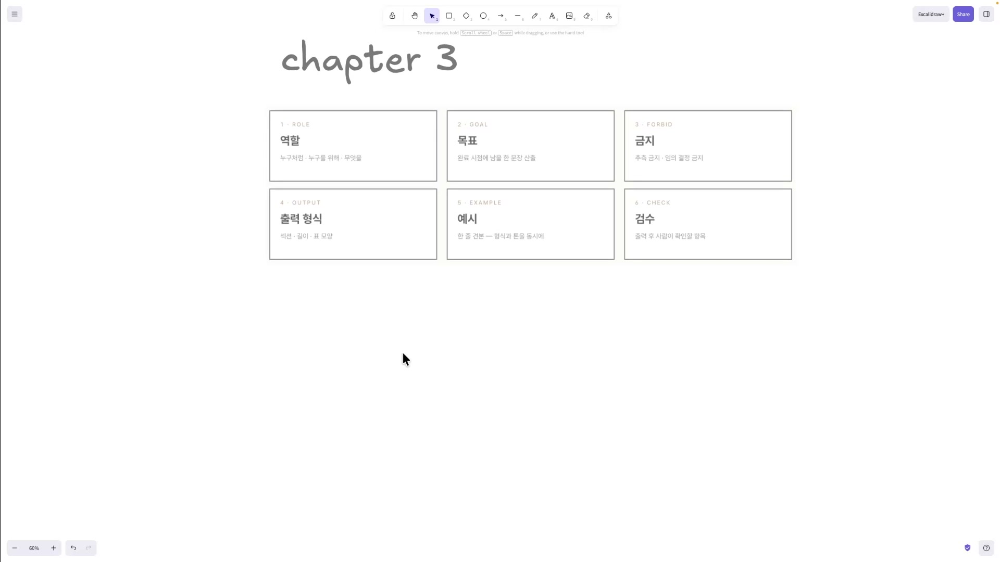
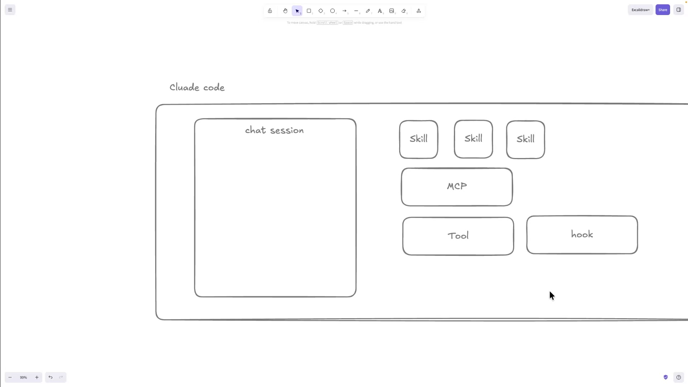
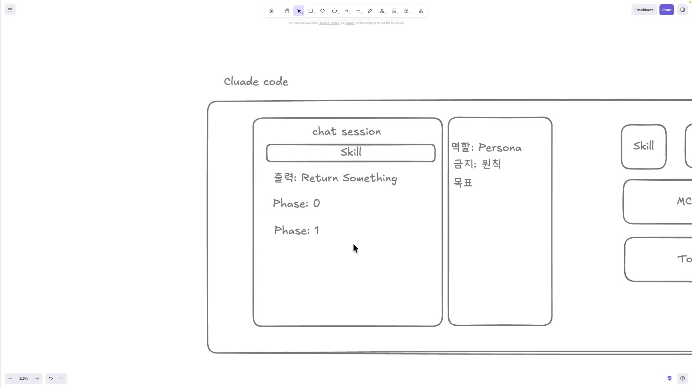
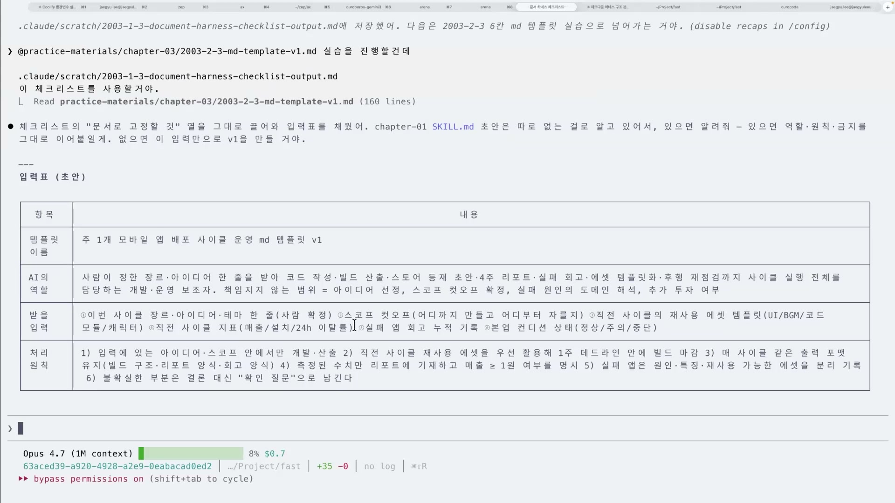
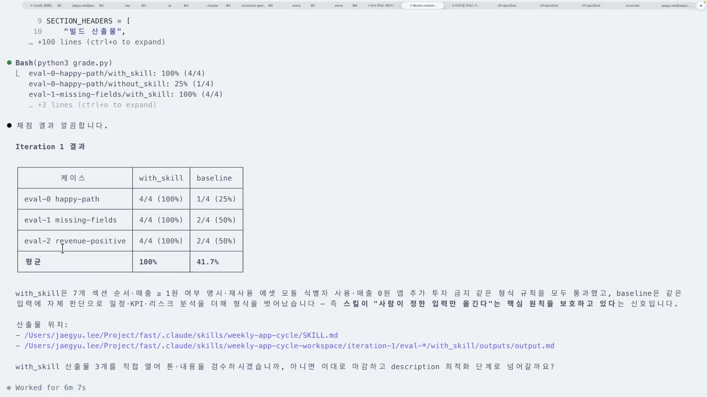
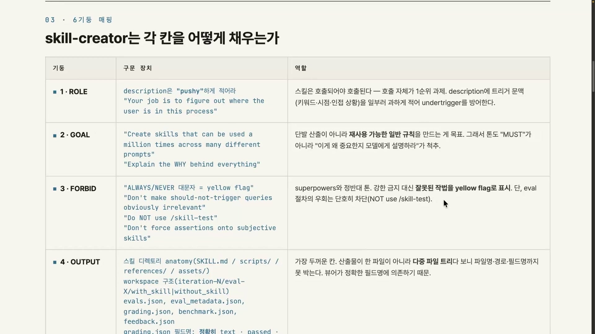
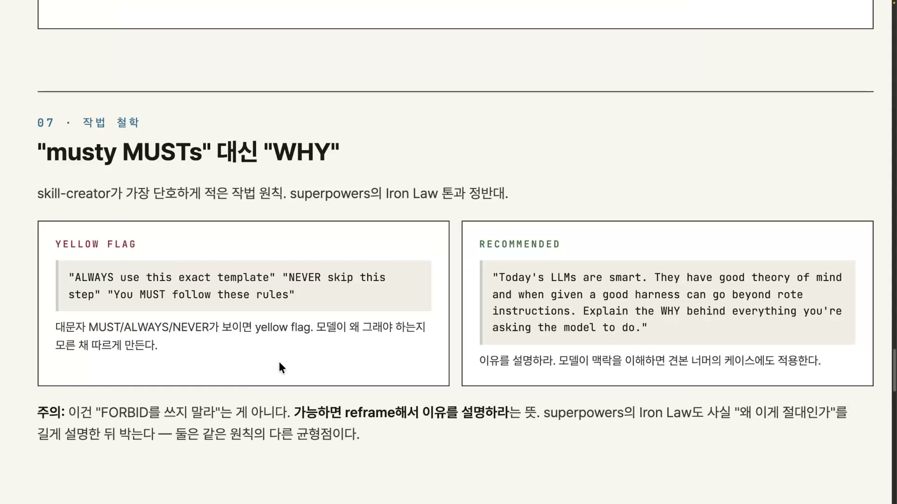
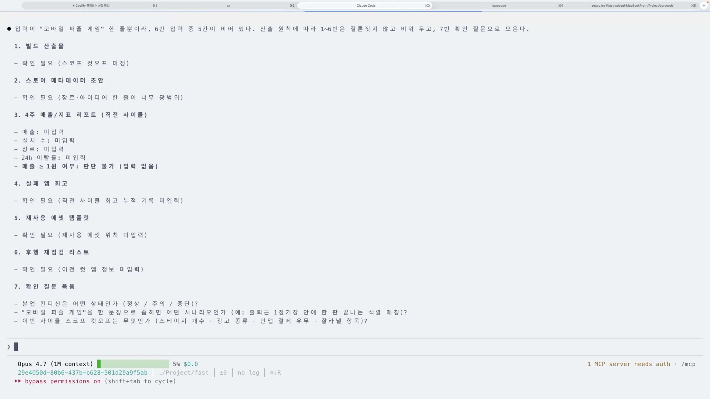

같은 작업을 AI에게 두 번 시키면 두 번 다른 결과가 나온다. "모바일 앱 운영을 정리해줘"라고 던지면 어떤 날은 표가 나오고 어떤 날은 줄글이 나오고, 어떤 날은 묻지도 않고 혼자 범위를 정해버린다. 시키는 사람 입장에서는 매번 도박이다.

이 강의는 그 도박을 없애는 방법을 다룬다. 핵심은 한 문장으로 요약된다. **AI에게 일을 시킬 때, 그 일의 규칙을 하나의 마크다운 파일에 박아두고 매번 그 파일에서 시작하게 만든다.** 강의는 이 파일을 마크다운 하네스(Markdown Harness)라 부르고, 그 골격을 여섯 칸으로 정리한다. 체크리스트로 뽑은 업무 규칙을 그 여섯 칸에 채워 템플릿을 만들고, 그것을 스킬로 굳히고, 정말 효과가 있는지 수치로 검증하는 과정 전체를 손으로 따라 만든다.

## 마크다운 하네스란, 그리고 여섯 가지 기둥

하네스(harness)는 말에 채우는 마구(馬具)다. 말의 힘을 죽이지 않으면서 방향만 잡아주는 장치. 마크다운 하네스도 똑같은 일을 한다. 모델의 능력은 그대로 쓰되, 그 능력이 엉뚱한 데로 새지 않게 규칙으로 묶는다. 강의 표현으로는 "인터뷰 하네스를 넘어 마크다운 하네스를 만든다" 인데, 대화로 요구사항을 캐묻던 단계에서 그 결과를 고정된 규칙서로 굳히는 단계로 넘어간다는 뜻이다. 한 번 잘 만들어두면 "웬만한 업무 자동화는 많이 해결된다"고 강의자는 말한다.

그 규칙서의 골격이 여섯 가지 기둥이다. 역할, 목표, 금지, 출력 형식, 예시, 검수. 강의는 이걸 카드 여섯 장이 깔린 격자로 보여준다.

각 칸이 무엇을 채우는지는 이렇게 정리된다.

| 기둥 | 영어 라벨 | 무엇을 적나 |
|---|---|---|
| 역할 | ROLE / Persona | 스킬이 시작되면 세션에 먼저 입혀지는 페르소나. 누구처럼, 누구를 위해, 무엇을 하는가. |
| 목표 | GOAL | 무엇을 이뤄야 하는가. 완료 시점에 남을 한 문장. |
| 금지 | FORBID | 하지 말아야 할 것과 원칙. 추측 금지, 임의 결정 금지 같은 것. |
| 출력 형식 | OUTPUT | 무엇을, 어떤 모양으로 내놓을지. 섹션, 길이, 표 모양까지. |
| 예시 | EXAMPLE | 한 줄 견본. 형식과 톤을 동시에 보여준다. |
| 검수 | CHECK | 끝났는지 확인하는 항목. 출력 후 사람이 확인할 것. |

이 여섯 칸을 왜 굳이 다 채워야 하는지는, 강의 전체를 관통하는 한 마디로 설명된다. **마크다운 하네스에서 제일 중요한 건 잠가둔 걸 기반으로 첫 시작을 항상 똑같이 가져가는 것이다.** 같은 일을 시켜도 매번 결과가 다른 까닭은, 모델이 비어 있는 칸을 자기 해석으로 메우기 때문이다. 여섯 칸을 미리 채워 시작점을 고정하면 모델이 추측할 여지가 그만큼 사라진다. 반대로 이 구조 없이 AI에 통째로 맡기면 결과물은 산만해지고, 나중에 그걸 어떻게 고쳐야 할지 몰라 또 AI에 의존하게 된다. 강의는 이 상태를 AI 슬롭(slop)이라 부른다.

## 왜 구조여야 하나, 클로드 코드 안을 들여다보면

"머릿속에 구조를 잡고 있어야 한다"는 말은 자칫 정신론처럼 들린다. 그래서 강의자는 클로드 코드 같은 하네스가 내부적으로 어떻게 도는지를 화이트보드에 직접 그려 보여준다.

한 판을 그리면 이렇다. 가운데에 채팅 세션이 있다. 유저가 채팅을 날리는 메인 무대고, 모든 일이 여기서 벌어진다. 그 위에 스킬이 여러 개 떠 있고, 옆에는 MCP와 툴이, 그리고 훅이 붙어 있다. 여기서 스킬의 동작 방식이 결정적이다. 클로드 코드가 켜질 때 모든 스킬의 본문이 다 로드되는 게 아니다. 항상 떠 있는 건 이름(name)과 설명(description) 둘뿐이고, 이 둘을 묶어 프론트매터(frontmatter)라 부른다. 모델은 평소엔 이 이름과 설명만 들고 있다가, 필요한 상황이 오면 그제서야 해당 스킬의 본문을 불러 동작시킨다. 유저가 슬래시(/)로 직접 부를 수도 있다.

여기서 한 가지가 따라 나온다. 스킬 본문을 아무리 잘 써도 description이 약하면 그 스킬은 아예 안 불려진다. 모델이 이름·설명만 보고 트리거 판단을 하기 때문이다. 강의 뒷부분에서 "트리거가 잘 되는 문장을 써라"가 비중 있게 나오는 이유가 여기 있다.

훅은 세션에서 어떤 이벤트가 일어났을 때 발동하는 장치다. 가장 많이 쓰는 건 유저 프롬프트 훅인데, 유저가 "Please make something"이라고 채팅을 보낸 그 순간 그 프롬프트를 그대로 가져와 훅으로 당겨올 수 있다. 더 고도화하면 스킬이 끝나거나 특정 이벤트가 발생할 때 훅을 발동시킬 수도 있다. 여섯 기둥의 검수와 연결되는 지점이 바로 여기다. 사람이 일일이 확인하는 대신, 단계가 끝날 때마다 훅으로 검수를 자동화해볼 수 있다.

스킬이 이 모든 걸 쉽게 부를 수 있는 까닭은, 스킬이 세션에 녹아드는 존재이기 때문이다. 세션 안에 녹아 있으니 그 안에서 MCP를 호출하는 것도 스킬에서 할 수 있다. 강의자는 우로보로스(Ouroboros) 인터뷰에서도 스킬이 MCP 툴을 다루는 얘기가 나온다며 이를 근거로 든다. 훅도 같은 맥락에서 묶어 말하지만, 엄밀히는 스킬이 훅을 직접 부르는 것이 아니다. 스킬이 도구를 쓰면 그 실행을 계기로 런타임이 훅을 자동으로 발동시킨다.

마크다운 하네스가 "만들기 쉽다"고 말하는 진짜 이유도 이 구조에서 나온다. 스킬은 절차대로 실행된다. 스킬이 세션을 점유하면 먼저 역할(페르소나)이 입혀지고, 인스트럭션을 따라가며 목표를 인식하고, 진행 중에 금지와 원칙이 컨텍스트로 쌓이고, 출력 지시를 받고, 예시를 참고로 기억하면서, Phase 0 · Phase 1 같은 단계를 순서대로 밟는다.

모델은 마크다운을 읽으며 "아 이런 게 있었구나, 이건 기억해둬야지" 하면서 이 단계를 따라간다. 각 Phase가 끝날 때마다 훅을 호출할 수도 있다. 결국 마크다운 하네스란 읽으면 순서대로 실행되는 절차서다. 이 절차성 덕분에 동작이 예측 가능해져 만들기 쉽다.

## 실습, 체크리스트가 템플릿이 되기까지

개념은 여기까지. 강의는 이제 실제로 손을 움직인다. 입력으로 쓰는 건 앞서 만들어둔 체크리스트다. 강의자는 "예전에 만든 SKILL.md는 너무 옛날 거라, 체크리스트만으로도 진행해볼 수 있다"며 체크리스트 하나를 규칙서 입력으로 삼는다. 클로드 코드를 돌려 `checklist-output.md`를 생성하고, 그걸 바탕으로 "주 1개 모바일 앱 배포 사이클 운영" 템플릿을 뽑는다.

생성된 입력표를 보면, 체크리스트가 어떻게 구조화되는지가 한눈에 들어온다.

표는 네 행으로 채워진다. 템플릿 이름은 "주 1개 모바일 앱 배포 사이클 운영 md 템플릿 v1". AI의 역할은 한 줄로 정확히 박혀 있다. "사람이 정한 장르·아이디어를 받아 코드 작성부터 빌드 산출, 스토어 등재 초안, 4주 차 리포트와 실패 회고까지 사이클 실행 전체를 담당하는 개발·운영 보조자." 받을 입력에는 이번 사이클 장르·아이디어, 직전 사이클의 재사용 에셋 템플릿, 직전 지표 같은 것이 들어간다. 처리 원칙에는 여섯 가지가 적힌다. 정해진 범위 안에서만 개발하고, 일주일 안에 빌드를 마감하고, 매출 1원 이상 여부를 명시해 리포트에 쓰고, 실패한 앱은 원인과 특징과 재사용 가능한 에셋을 분리 기록하고, 불확실한 부분은 결론을 내지 말고 "확인 질문"으로 남긴다.

이 처리 원칙에 강의의 중요한 설계가 하나 박혀 있다. 실패한 앱의 원인과 재사용 가능한 것을 분리 기록한다는 항목이다. 이건 컴파운드 엔지니어링(compound engineering)이라 부르는 구조로, 매 사이클이 끝날 때 실패와 학습을 시스템에 남겨 다음 사이클이 더 나아지게 만드는 피드백 루프다. 한 번 쓰고 버리는 규칙이 아니라, 돌릴수록 똑똑해지는 규칙을 의도한 것이다.

여기에 "책임지지 않는 범위"(아이디어 선정·스코프 컷오프는 스스로 정하지 않음)와 금지사항 여섯 가지, 출력 형식과 예시까지 채워지면 템플릿 v1이 완성된다. 강의자는 "괜찮은 것 같다, 확정"으로 1차 확정을 짓는다.

다음은 이 템플릿을 스킬로 굳히는 단계다. 만든 템플릿을 그냥 스킬 폴더에 넣어 시작할 수도 있지만, 강의자는 클로드 코드 내부에 들어 있는 skill-creator를 쓴다. "skill-creator를 쓰면 간단하게 템플릿을 스킬화할 수 있고, 아니면 그냥 스킬 만들어달라고 해도 된다." 진입 장벽은 낮다. 실행 중에는 트리거 시점을 정할지, 슬래시로 직접 호출하는 경우를 정의할지, 테스트 기반 평가 루프(eval)를 돌릴지 고르게 되는데, 강의자는 평가 루프를 직접 돌려보는 쪽을 택한다. 만들 스킬의 이름은 위클리 앱 사이클(weekly-app-cycle)로 확정된다.

## 검증, 스킬은 정말 효과가 있나

스킬이 정말 효과가 있는지를 말이 아니라 수치로 증명한다. 방법은 단순하다. 똑같은 프롬프트(same prompt)를 두 가지로 돌려 비교한다. 하나는 스킬을 붙여(`--skill_path`) 돌린 with_skill, 다른 하나는 스킬 없는 서브에이전트로 돌린 baseline이다. 스킬이 없으면 모델은 기댈 시작점이 없어 자기 해석을 하게 된다.

세 가지 케이스를 각각 채점한 결과는 이렇다.

| 케이스 | with_skill | baseline |
|---|---|---|
| eval-0 happy-path | 4/4 (100%) | 1/4 (25%) |
| eval-1 missing-fields | 4/4 (100%) | 2/4 (50%) |
| eval-2 revenue-positive | 4/4 (100%) | 2/4 (50%) |
| 평균 | 100% | 41.7% |

스킬을 붙이면 평균 100%, 그냥 프롬프트로만 넣으면 41.7%. 특히 가장 기본인 happy-path에서 baseline은 네 번 중 한 번(25%)밖에 통과하지 못한다. with_skill이 통과한 기준은 일곱 개 섹션이 순서대로 진행됐는가, 재사용 에셋 모듈 식별자를 제대로 썼는가, 매출 0원 앱에 추가 투자를 금지하는 규칙을 지켰는가 같은 것들이다. baseline은 이 기준을 자체 판단으로 벗어나 자작 프레임을 만들어냈다.

강의자가 이 표에서 끌어내는 결론은 처음의 원리를 그대로 되짚는다. **스킬이 "사람이 정한 입력만 옮긴다"는 핵심 원칙을 보호하고 있다.** 시작을 계속 잠가두니 모델이 추측할 부분이 없어졌다는 것이다. 첫 시작을 잠근다는 추상적인 말이, 100% 대 41.7%라는 숫자로 손에 잡히는 순간이다.

## 앤트로픽은 같은 여섯 기둥을 어떻게 구현했나

스킬을 만드는 데 쓴 skill-creator는 앤트로픽이 만든 클로드 코드 내부 스킬이다. 스킬을 만들어주는 스킬, 곧 메타 스킬이다. 강의자는 여기서 흥미로운 질문을 던진다. 우리가 만든 스킬은 마크다운 하네스인데, 그 스킬을 만드는 스킬은 도대체 어떻게 구성돼 있을까. 권위 있는 구현을 역으로 뜯어 같은 여섯 기둥이 어떻게 박혀 있는지 확인하는 셈이다.

뜯어보기 전에 강의는 두 가지 철학을 대비시킨다. 한쪽은 슈퍼파워스(Superpowers)로 대표되는 결정적 잠금(deterministic lock). 규칙으로 단단히 잠그는 방식이다. 다른 쪽이 skill-creator의 실증 루프(empirical loop). 어떻게 쓰면 이 스킬이 제대로 도는가를, 방금 본 baseline 대 with_skill 비교처럼 두 줄로 계속 돌려보며 실증으로 찾아가는 방식이다. 둘은 서로 적이 아니라, 같은 목표를 다른 균형점에서 푸는 짝이다.

그러면 skill-creator는 여섯 칸을 각각 어떻게 채웠을까.

- **역할(ROLE)**. "스킬은 호출되어야 호출된다. 호출 자체가 1순위 과제다." description에 트리거 문맥(키워드·시점·인접 상황)을 일부러 과하게 적어, 불려야 할 때 안 불리는 사태를 막는다.
- **목표(GOAL)**. "수백만 번 재사용 가능한 일반 규칙을 만드는 게 목표"라고 적는다. 그리고 톤은 "MUST"가 아니라 "이게 왜 중요한지 모델에게 설명하라(Explain the WHY behind everything)"가 척추다.
- **금지(FORBID)**. 강한 금지 대신 잘못된 작법을 옐로우 플래그로 표시한다. 단 eval 절차를 우회하는 것 같은 진짜 위반은 단호히 차단한다("Do NOT use /skill-test").
- **출력(OUTPUT)**. 강의자가 "제일 두꺼운 칸, 제일 중요한 칸"이라 부르는 자리. 산출물이 한 파일이 아니라 다중 파일 트리이다 보니, 폴더 구조(SKILL.md / scripts / references / assets)와 JSON 필드명(evals.json, grading.json 등)까지 못박는다. 검수하는 쪽이 정확한 필드명에 기댈 수 있어야 하기 때문이다.
- **예시(EXAMPLE)**. 그냥 좋은 예 하나가 아니라 비포/애프터 페어로 보여줘야 모델이 톤을 학습한다.
- **검수(CHECK)**. 4겹 레이어로 검수하고, 그 위에 사람 리뷰가 들어간다. skill-creator도 "이걸 더 할지 말지"를 사용자에게 물으며 닫힌 검수 체계를 만든다.

여섯 기둥이 메타 스킬에도 고스란히 들어 있다. 내가 배운 골격과, 앤트로픽이 실제로 박아둔 골격이 같은 모양이라는 걸 확인하는 대목이다.

## AI에게 "하지 마"라고 하면 안 되는 이유

금지 칸을 채우는 데는 한 가지 함정이 있다. 강의는 이걸 핑크 엘리펀트(pink elephant)에 빗댄다. "분홍 코끼리를 생각하지 마"라고 하면 오히려 분홍 코끼리가 떠오른다. 모델도 마찬가지다. 잘못된 작법을 강하게 금지하면 모델이 그걸 계속 떠올리게 된다. 그래서 skill-creator는 강한 금지 대신 옐로우 플래그로 "표시"만 한다.

슬라이드는 이 원칙을 두 칸으로 나란히 보여준다. 왼쪽 옐로우 플래그 칸에는 "ALWAYS use this exact template", "NEVER skip this step", "You MUST follow these rules" 같은 문장이 놓인다. 대문자 MUST·ALWAYS·NEVER가 보이면 경고 신호다. 왜 그래야 하는지 모른 채 따르게 만들기 때문이다. 오른쪽 권장 칸에는 다른 톤이 적힌다. "오늘날의 LLM은 똑똑하다. 좋은 하네스를 주면 기계적 지시 너머로 갈 수 있다. 시키는 모든 것의 이유를 설명하라(Explain the WHY behind everything you're asking the model to do)." 모델이 맥락을 이해하면 견본에 없던 케이스에도 그 원칙을 적용한다.

주의할 게 있다. 이건 "금지를 쓰지 말라"는 뜻이 아니다. 가능하면 명령을 reframe해서 이유로 풀어 설명하라는 뜻이고, 정말 막아야 할 것은 오히려 핑크 엘리펀트 효과를 역이용해 단호히 차단한다. 꼭 막을 건 강하게, 사소한 건 부드럽게. 이건 목표 기둥의 "MUST가 아니라 WHY"와 같은 줄기다. 명령보다 이유가 더 멀리 간다.

나머지 세 기법도 각각 어느 기둥에 붙는지가 분명하다.

푸시(pushy) 디스크립션은 역할에 붙는다. description을 밋밋하게 한 줄 적으면, 이를테면 "대시보드"라는 단어조차 안 쓰면 모델이 그 스킬을 호출하지 않는다. 모델이 더 잘 이해하도록 트리거 문맥을 밀어넣은 description을 써야 스킬이 제대로 불려진다. skill-creator는 한 발 더 나아가 "이건 트리거돼야 한다 / 이건 트리거되면 안 된다"(Should Trigger / Should NOT Trigger)를 따로 정리해두기까지 한다.

휴먼인더루프(human-in-the-loop)는 검수에 붙는다. 마지막 description 최적화 단계도 사람이 "트리거가 잘 되게 넘겨달라"고 하면 최적화 루프를 도는, 사람 확인이 끼는 자리다. 컴파운드 엔지니어링은 앞서 본 처리 원칙에 박혀 있다.

기법과 기둥이 따로 노는 게 아니라, 기둥마다 그 칸을 잘 채우는 기법이 하나씩 물려 있는 셈이다.

## 돌려보니 보이는 한계, 컨텍스트에 사는 스킬

완성된 위클리 앱 사이클 스킬을 실제로 돌려본다. "모바일 퍼즐 게임 만들어줘"라고 넣자, 입력이 비어 있으니 스킬이 확인 질문을 쏟아낸다.

비어 있는 6개 입력은 일단 "확인 필요"로 표시해두고, 마지막 7번 "확인 질문 묶음"에 진짜 물어야 할 것을 모은다. 본업 컨디션이 정상인지 주의인지, "모바일 퍼즐 게임"을 한 문장으로 좁히면 어떤 시나리오인지, 이번 사이클의 스코프 컷오프는 무엇인지를 사람에게 되묻는다. 앞서 처리 원칙에 박아둔 "불확실하면 결론 대신 확인 질문으로 남긴다"가 그대로 작동하는 장면이다. 즉흥으로 색깔 매칭 게임을 채워나가자, 스킬은 빌드 산출물 계획 → 스토어 메타데이터 초안 → 사이클 리포트를 단계적으로 뽑아낸다. 결과적으로 만들어진 건 오케스트레이터다. 이 스킬의 역할은 직접 게임을 만드는 게 아니라, 각 산출물을 기반으로 다른 서브 스킬을 호출하고 상태를 조율하는 운영자가 됐다.

여기서 강의는 결정적인 한계를 하나 던지고 다음 편으로 넘긴다. 이 스킬은 여섯 가지를 다 물어보고 4주 시점에 결과를 뽑아야 한다. 그게 지속 가능한가. 아니다. **이 스킬은 컨텍스트 안에 살고 있기 때문이다.** 4주 내내 클로드 코드 세션을 끄지 말아야 하는데, 그건 사실상 불가능하다.

앞에서 스킬이 세션에 녹아들어 훅도 MCP도 쉽게 부른다고 했다. 그 녹아듦이 양날의 검이라는 게 여기서 드러난다. 세션에 녹아 있어 편하지만, 세션이 끝나면 함께 사라진다. 마크다운 하네스는 결국 단일 세션에 갇힌 구조다. 이 한계, 곧 컨텍스트 의존과 세션 지속성 문제를 어떻게 장점·단점으로 분석하고 어떻게 넘어설지가 다음 클립의 몫으로 남는다.

여기까지가 이번 실습이다. 체크리스트 한 장에서 출발해 여섯 칸 골격을 채우고, skill-creator로 스킬화하고, 평가 루프로 100% 대 41.7%를 확인하고, 실제로 돌려 운영자가 만들어지는 것까지 봤다. 그리고 그 끝에서, 잘 만든 하네스도 세션이라는 그릇 밖으로는 못 나간다는 사실에 부딪힌다.
