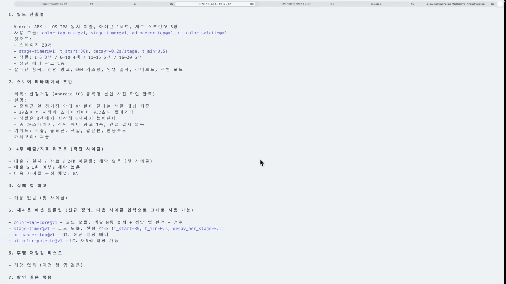
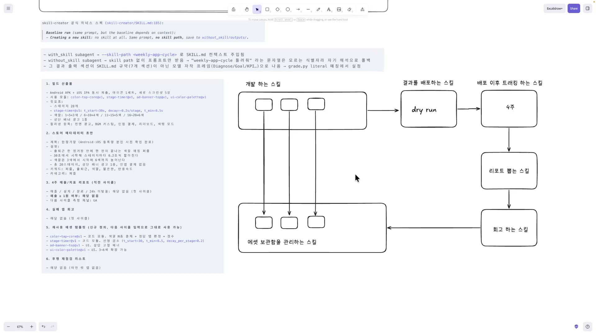
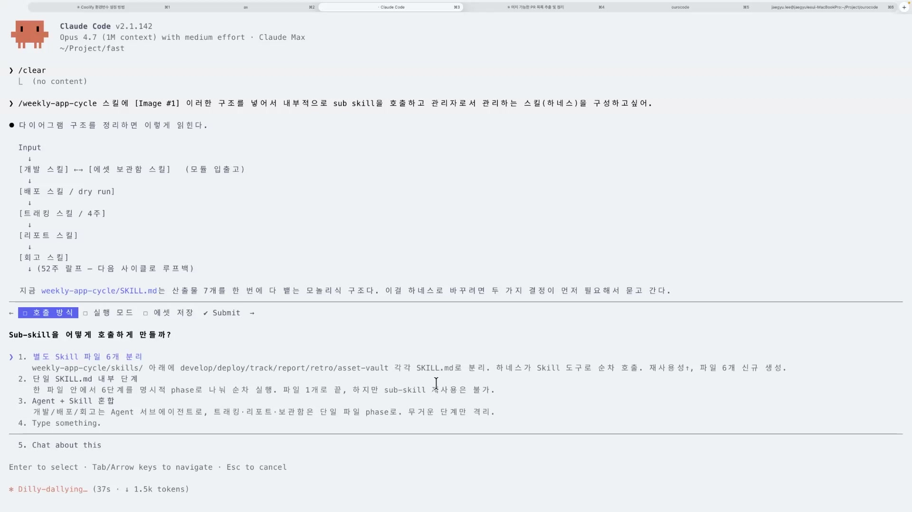
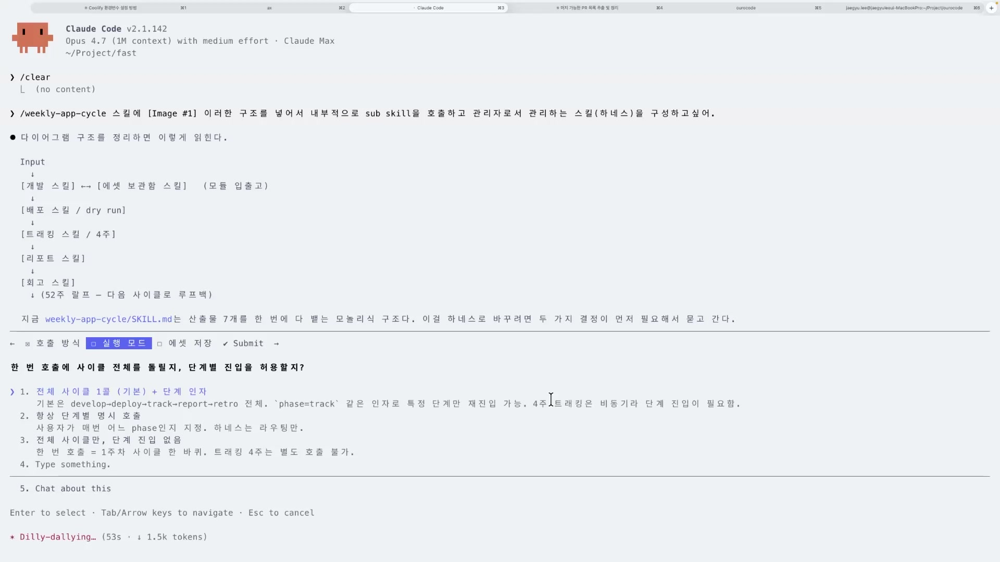
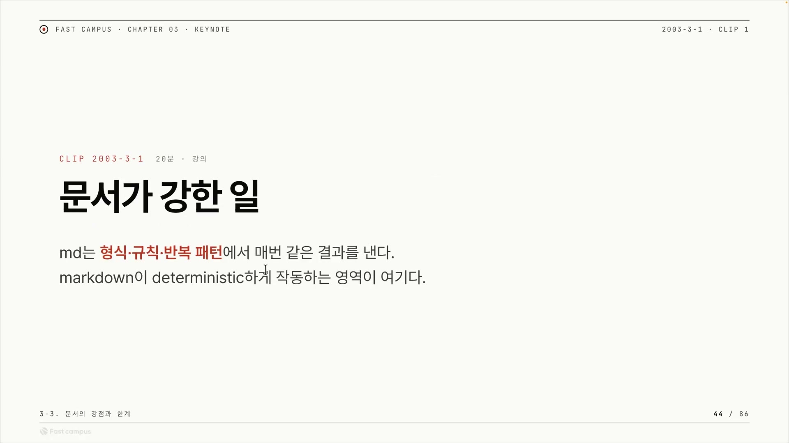
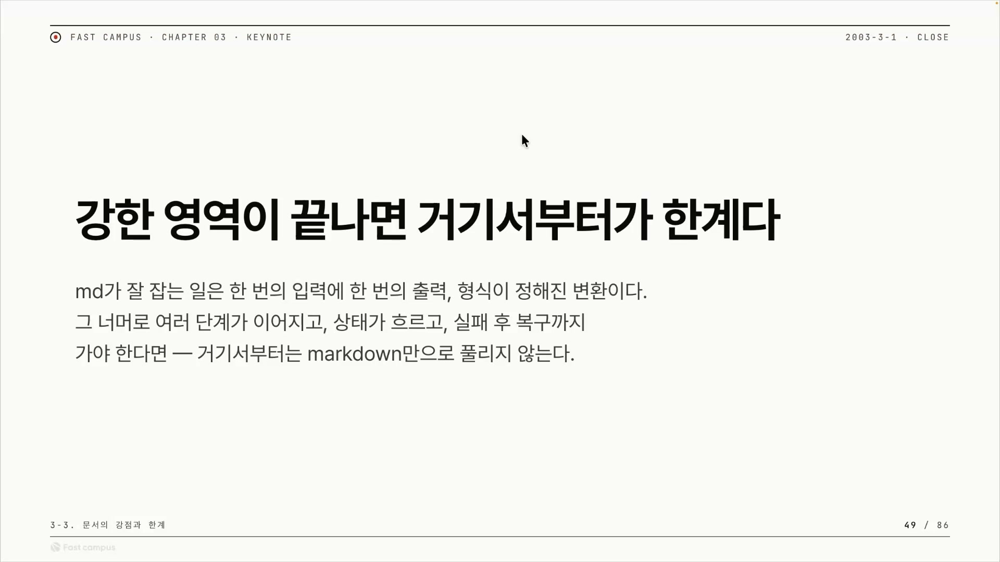
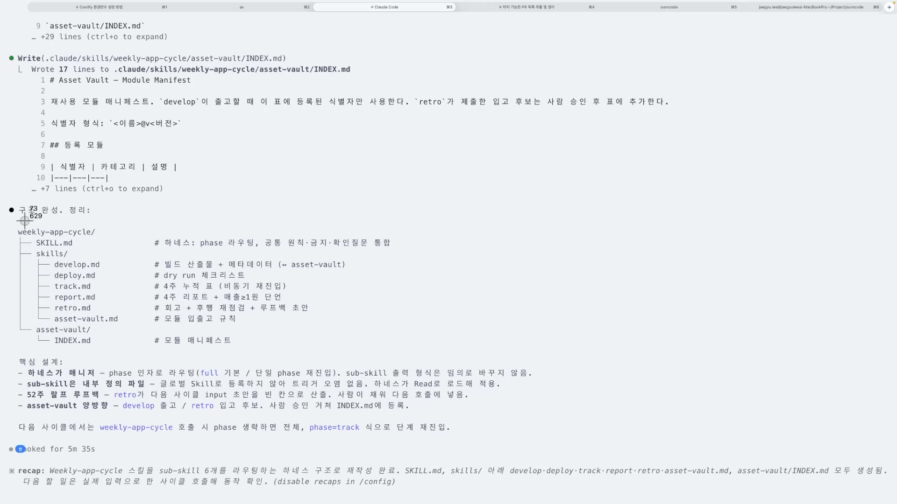
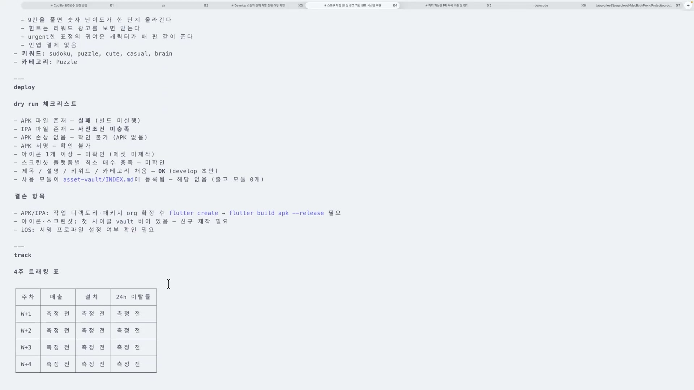
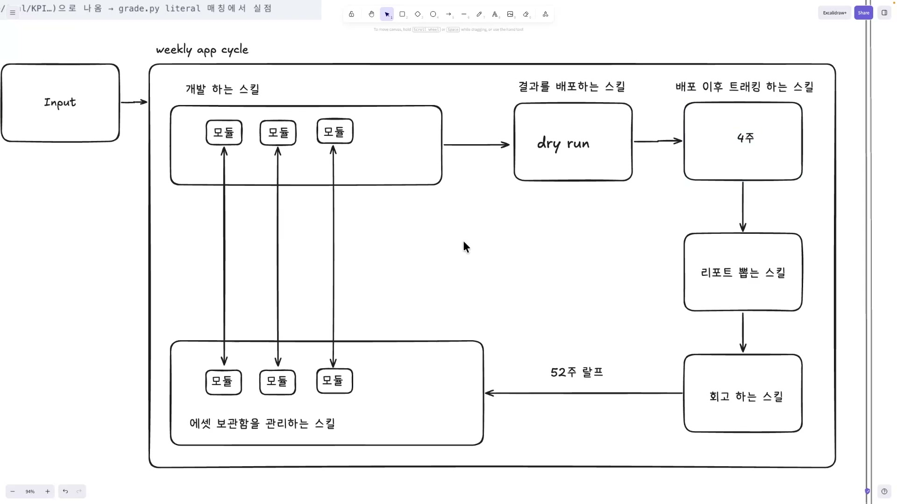

"하네스(harness)"라는 말부터 풀고 가자. 강의에서 쓰는 뜻은 단순하다. 내가 원하는 결과물을 안정적으로 얻어내려고 LLM을 감싸 돌리는 틀이다. 강사의 표현으로는 "내가 원했던 걸 얻어내는 데 쓰는 것". 모델 자체는 그대로 두고, 그 주위에 출력 형식, 지켜야 할 규칙, 역할 같은 걸 깔아서 매번 비슷한 결과가 나오게 만드는 주변 장치인 셈이다. 그중에서 가장 가벼운 형태가 마크다운 하네스다. 거창한 코드가 아니라 폴더 하나에 `.md` 문서 몇 개를 묶어, 그 문서에 적힌 지시 · 규칙 · 형식으로 모델을 붙잡는다.

이 글은 그 마크다운 하네스가 정확히 무엇을 잘하고, 어디서부터 무너지는지를 정리한다.

## 산출물에서 거꾸로 스킬을 길어 올린다

강의는 추상적인 "업무 자동화"로 시작하지 않는다. 출발점은 구체적인 산출물 여섯 가지다. 이건 강사가 이번에 새로 적은 게 아니라 앞선 강의에서 이미 뽑아 둔 목록을 화면에 캡처해 가져온 것이다. 빌드 산출물(앱 APK · IPA, 아이콘, 스크린샷, 재사용 모듈), 스토어 메타데이터 초안, 4주 매출 · 지표 리포트, 실패 앱 회고, 재사용 에셋 템플릿, 후행 재점검 리스트. 이 여섯 개를 합치면 "한 주에 앱 하나를 만들어 출시하고 4주간 성과를 추적하는 한 사이클"이라는 그림이 이미 보인다.

강사는 "이런 기능이 있으면 좋겠다"를 나열하지 않는다. 산출물 목록을 보며 "이걸 만들려면 무엇이 필요한가"를 한 항목씩 거꾸로 캐묻고, 그때마다 다이어그램에 노드를 하나씩 그려 넣는다. 기능부터 늘어놓으면 "있으면 좋은 것"이 끝없이 불어나고 정작 원하는 결과와 무관한 기능이 섞인다. 반대로 산출물을 고정해 두고 거꾸로 물으면, 추가되는 스킬마다 "이 산출물의 어느 부분을 책임지는가"라는 존재 이유가 분명해진다.

빌드 산출물이 있으려면 그걸 만드는 개발 스킬이 필요하다(첫 노드). 산출물 안에는 재사용되는 것들이 있고, 재사용되려면 어딘가에 보관돼 있어야 하니 에셋 보관함이 붙는다. 강사는 이 보관함을 싱글소스 오브 트루스, 즉 다음 사이클부터 "여기서 빼와서 쓰는" 단 하나의 권위 있는 출처로 규정한다. 개발한 결과를 배포하는 스킬, 배포 이후 4주간 추적하는 트래킹 스킬, 그 결과로 리포트를 뽑는 스킬이 시간축을 따라 오른쪽으로 뻗는다. 마지막으로 실패했을 때 돌아보는 회고 스킬이 붙는다. 강사는 여기서 이 흐름이 "빙빙 돌면서 멈추지 않는" 사이클이 돼야 한다고 말한다.

개발에서 리포트까지만 두면 그건 시작과 끝이 있는 일회성 직선이다. 회고가 한 사이클의 교훈을 다음 사이클 입력으로 되돌리고, 에셋 보관함이 산출물(물건)을 되돌린다. 이 둘이 맞물려야 비로소 다음 바퀴가 이전 바퀴보다 가벼워진다. 강사는 이 사고방식을 직접 컴파운드 엔지니어링이라고 부른다. 일할수록 시스템이 무거워지는 게 아니라, 한 단위의 작업이 다음 단위를 더 쉽게 만들어 복리처럼 쌓이는 구조를 가리키는 방법론이다.

여섯 노드가 다 모이자 강사는 이 그림을 캡처해 Claude Code에 던지고, `weekly-app-cycle`이라는 상위 스킬 하나에 이 구조를 넣어 내부적으로 서브 스킬들을 호출하고 관리하게 시킨다. 종이 위 다이어그램이 그대로 스킬 명세가 되는 전환점이다. 여기서 메타 스킬과 서브 스킬이라는 두 개념이 자리를 잡는다. 메타 스킬은 직접 일하지 않고 여러 서브 스킬을 정해진 순서로 불러 한 묶음으로 돌리는 관리자(오케스트레이터)이고, 서브 스킬은 개발이나 배포처럼 한 가지 일만 맡는 실무자다.

## 두 개의 설계 결정, 그리고 그 안에 숨은 한계

메타 스킬을 만들라고 지시하자 Claude가 "두 가지 결정이 필요하다"고 되묻는다. 강사가 화면에서 직접 고르는 이 두 선택이, 사실은 마크다운 하네스의 능력 경계선을 긋는 행위다.

첫째, 모놀리식이냐 분업형이냐. 사이클 전체를 SKILL.md 한 파일에 다 적을지(모놀리식), 기능을 완전히 독립한 별개 에이전트로 갈라놓을지(분업형)의 문제다. 강사는 둘 다 택하지 않고 중간을 고른다. 하나의 메타 스킬 안에서 기능을 서브 스킬로 쪼개 조율하는 형태다. 근거는 사람이다. 스킬 하나가 너무 길어지면 사람이 파악하기 어렵기 때문에, 소프트웨어 설계 원칙인 SOLID 중 단일 책임 원칙을 끌어온다. 원래 정의는 "클래스는 변경되어야 할 이유가 단 하나여야 한다"는 코드 유지보수 원칙이다. 강사는 그중 "하나의 책임"이라는 개념을 끌어와, 거대한 단일 스킬을 책임 단위로 쪼개는 데 적용한다. 코드든 스킬이든 결국 사람이 읽고 고치는 것이라는 관점이 깔려 있다.

둘째, 한 번 호출에 사이클 전체를 돌릴지, 단계별 진입을 허용할지. 강사는 또 절충한다. 기본은 전체를 돌리되, `phase`라는 인자 하나를 둬서 `phase=track`처럼 원하는 단계로 바로 들어갈 수 있게 한다. 4주짜리 작업을 매번 처음부터 다 돌릴 필요 없이 끊긴 지점으로 재진입하는 장치다.

이 두 번째 결정의 이유가 이 챕터 전체의 복선이다. 강사는 이 선택 자체가 "강점과 약점을 얘기하는 상황"이라고 말한다. 왜 절충했나. 양 극단이 모두 사람을 배신하기 때문이다.

> "스킬은 전체적인 상태를 파악하기 굉장히 어려워요. 그래서 여기서도 인자를 받는다고 했는데, 결국 이건 인간이 이해를 하고 있어야 되고, 사용자도 항상 어느 페이지인지 알고 있어야 된다는 거죠. 4주 트래킹이 너무 긴 시간이다 보니까 이 단계를 알기가 너무 어렵다."

여기서 상태(state)란 "지금 어느 단계까지 왔고 중간 결과가 뭔지"라는 정보다. 마크다운 하네스는 본질적으로 프롬프트에 매번 주입되는 정적 텍스트라, 호출이 끝나면 진행 상황을 어디에도 자동으로 남기지 못한다. 그래서 단계 인자를 줘도 그건 "어디서 시작할지"를 정해 줄 뿐 "어디까지 왔는지"를 저장하진 않는다. 진입점 제어는 상태 영속화가 아니다. 4주처럼 긴 작업은 진행 상태를 둘 곳이 없어 결국 사람의 뇌에 의존하게 된다. 이게 한계의 씨앗이다.

## 마크다운이 강한 단 하나의 이유

설계를 마친 강사는 강점을 한 줄로 말한다. 문서가 강한 건, 처음 시작했을 때 무언가를 고정시킬 수 있다는 것이다.

이 "고정"이 왜 가치 있는지는 LLM의 동작 방식에서 나온다. LLM은 다음에 올 단어를 확률에서 골라 문장을 만든다. 그래서 같은 질문을 두 번 던져도 답 문장이 매번 조금씩 달라진다. 이걸 비결정론적(non-deterministic)이라고 한다. 계산기에 2 더하기 2를 치면 언제나 4가 나오는 것(결정론적)과 정반대다. 무작위성을 0으로 줄여도 LLM은 완벽하게 똑같아지지 않는다. GPU가 여러 계산을 동시에 처리하면서 연산 순서가 미세하게 달라지고, 그 차이가 쌓여 다른 단어가 선택될 수 있기 때문이다. 다만 실제 결정성은 입력에 따라 크게 갈린다. 짧고 제약이 강한 프롬프트에서는 100%에 가깝고, 길고 열린 프롬프트에서는 0%까지 떨어진다.

짧고 제약이 강하면 결정적, 길고 열려 있으면 비결정적. 강사가 말하는 "문서로 첫 시작을 고정한다"는 건 바로 이 제약을 거는 행위다. 마크다운 문서가 매 실행마다 똑같이 박아 넣는 것은 세 가지다. 출력 형식(결과가 어떤 모양일지), 지시 · 금지 규칙(뭘 하면 안 되는지), 롤(역할). 이것들이 시작될 때마다 다시 걸리니, 모델이 매번 다른 곳에서 출발하지 않는다. 흔들리는 출발점을 문서가 닻처럼 잡아 주는 것이다.

강사는 마크다운이 강한 영역을 형식 · 규칙 · 패턴 셋으로 정리한다. 첫째는 출력 형식 고정이다. 강사는 이걸 "리즈닝(reasoning, 추론) 없이 빠르게 동작한다"고 표현하는데, 오해하기 쉬운 말이다. 모델이 멍청해진다는 뜻이 아니다. 형식이 비어 있으면 모델은 매번 "이 답을 어떤 구조로 보여줄까"부터 새로 추론해야 하고, 그 추론 자체가 매번 조금씩 다른 선택을 낳는다. 형식을 미리 정해 주면 모델은 "무엇을 쓸지"에만 집중하고 "어떻게 배치할지"는 고민하지 않는다. 이미 정해진 부분을 매번 새로 고민하지 않아도 된다는 뜻이다. 둘째는 반복 규칙과 금지 원칙을 매번 적용하는 것이다. 사람은 같은 주의사항을 매번 기억해 일러줄 수 없지만, 문서에 적어 두면 스킬이 시작될 때마다 그 규칙이 그대로 다시 걸린다. 셋째는 같은 입력 패턴 기반 동작이다. 들어오는 입력이 매번 비슷한 모양이면 앞서 말한 "짧고 제약이 강한" 상황에 가까워져 결정성이 올라간다.

그럼 이 정도 하네스로 어떤 일을 할 수 있나. 강사가 든 네 가지는 모두 "충분"이다.

| 작업 | md만으로? | 왜 충분한가 |
|---|---|---|
| 회의록 → 1page 기획안 | 충분 | 입력 형식이 일정하고, 출력 형식이 고정되며, 한 번에 끝난다 |
| 인터뷰 노트 정리 | 충분 | 같은 평가 항목을 매번 같은 양식으로 채운다 |
| 주간 보고 작성 | 충분 | 지표 · 코멘트 형식이 정해져 있고 매주 같은 규칙을 반복 적용한다 |
| 채팅 문의 자동 분류 | 충분 | 분류 카테고리가 고정된 규칙이다 |

네 작업은 모두 "한 번 호출, 정해진 틀, 끝"이다. 길게 끌거나 중간 상태를 며칠씩 들고 있을 필요가 없다. 그래서 짧고 제약이 강한 영역에 들어가고, 마크다운으로 충분하다. 강사는 이를 사무직 반복 업무 자동화로 일반화한다.

다만 여기서 한 가지는 과장하면 안 된다. 결정성은 "높이는" 것이지 "100% 보장"이 아니다. 마크다운을 잘 써도 LLM은 완전히 똑같아지지 않는다. 정확히 말하면 흔들림을 크게 줄이는 것이다.

## 강한 영역이 끝나는 곳

강사는 강점을 자랑하고 곧바로 그 그림자를 보여준다. 슬라이드 한 장이 챕터의 축을 못 박는다.

디터미니스틱하다는 강점, 즉 "첫 시작을 고정한다"를 뒤집으면 "첫 시작만 고정할 수 있다"는 한계가 된다. 마크다운은 매 호출의 시작점을 완벽히 재현하지만, 호출과 호출 사이에 흐르는 상태를 담을 그릇이 없다. 고정된 시작과 흐르는 상태를 못 잡음은 같은 성질의 앞뒷면이다.

> "강점이 결국에는 디터미니스틱하게 처음에 계속 뭔가를 시작했을 때 (…) 마크다운을 만들어 놨는데, 이걸 넘어서서 시간이 들어가다 보니까 '이런 상태를 어디로 넣어야 되지' 보다 보니까 인간의 뇌에 의존해야 된다는 거죠."

강사는 추상적으로 말하지 않고, 방금 자기가 만든 위클리 앱 사이클 스킬이 무너지는 걸 실시간으로 보여준다. 그 데모를 통해 한계 네 가지가 하나의 도미노로 이어진다.

첫째, 오래 걸리는 비동기 작업에서 상태를 못 들고 간다. 사이클에 4주짜리 트래킹 단계가 있으니 전체가 4주 이상 걸리는 비동기 작업이 된다. 그런데 마크다운에는 "지금 어느 단계인가"를 담을 자리가 없다. 강사의 시나리오가 생생하다. 바빠서 결과까지만 배포하고 트래킹을 까먹으면, 4주 동안 추적해야 하는데 그걸 잊으면, 거기서부터 파이프라인이 끊긴다. 상태가 사람 머릿속에만 있으니 사람이 까먹는 순간 흐름이 멈춘다.

둘째, 사람이 흐름에 계속 붙어 있어야 한다. 이건 양날이다. 마크다운 하네스는 금지 조항과 확인 질문으로 인간의 의도를 확실히 반영하게 만들 수 있다. 강사의 말로는 "인간이 원하는 것들을 휴먼인더루프로 확실하게 적어낼 수 있게" 구성된다. 휴먼인더루프란 자동 흐름 중간에 사람의 판단이 끼어드는 구조인데, 이 자체는 통제 수단이다. 문제는 대가다. 데모에서 develop을 돌리자 스킬이 스택을 뭘로 할지 묻고, 금지 조항 때문에 매번 사람의 확인을 받는다. 사람이 매번 답해 줘야 하니 강사는 "이게 좀 피로하다"고 말한다. 그래서 그 피로를 덜려고 슈퍼메모리 같은 메모리 시스템을 붙여 확인에 자동으로 답하게 만드는 움직임도 있다고 짚는다. 다만 그건 다음 주제로 넘긴다.

셋째, 메인 세션 오염이다. 메타 스킬이 6개 서브 스킬을 부를 때, 전부 메인 세션 하나 안에서 호출된다. 마크다운 하네스에는 서브 스킬을 격리할 별도 컨텍스트가 없어서, develop, deploy, track의 모든 중간 산출물과 대화가 한 컨텍스트 윈도우에 차곡차곡 쌓인다. 컨텍스트는 모든 도구 응답과 중간 결론이 계속 누적되는 버퍼라, 잘못된 응답 하나가 세션 전체 추론을 오염시킬 수 있다. 강사의 결정타. 데모로 만든 수도쿠 게임에 버그가 생겼다고 하면, 그 디버깅까지 같은 오염된 세션 안에서 해야 하니 점점 꼬인다.

넷째, 컨텍스트 컴팩트로 흐름을 망각한다. 긴 사이클이 컨텍스트를 다 채우면, 한계에 다다라 자동 압축(컴팩트)이 일어난다. 컴팩트는 컨텍스트 초과를 막으려 오래된 이력을 요약해 압축하는 메커니즘인데, 압축은 곧 손실이다.

> "99%가 되고 컴팩트하기 시작하는 순간, 오케스트레이터도 까먹게 되겠죠 이 흐름을. 결국에는 이 마크다운만으로 풀리지 않는 걸 어떻게 풀어야 되냐, 이것들을 다음 클립에서 보겠습니다."

이 네 가지는 따로 노는 결함이 아니다. 긴 비동기 작업이라서(1) 상태를 사람 뇌에 의존하게 되고, 그래서 사람이 매번 붙어 확인에 답해야 하고(2), 모든 걸 한 세션에 몰아넣어 오염되고(3), 세션이 비대해져 컴팩트가 터지며 흐름을 잊는다(4). 하나의 연쇄다.

마크다운 하네스가 실제로 무엇인지는 데모 화면에 그대로 드러난다. "AI 자동화"라는 추상어가 SKILL.md 하나와 그 아래 여섯 개의 `.md` 파일로 손에 잡힌다.

그리고 이 한계가 "추론한 위험"이 아니라 실물이라는 증거. 트래킹 단계가 만든 4주 누적 표를 보면 매출 · 설치 · 이탈률 칸이 전부 "측정 전"으로 비어 있다. 마크다운은 표의 틀(형식)은 완벽히 고정해 냈지만, 그 칸을 4주에 걸쳐 채워 가려면 매 주차 값을 어딘가에 들고 있어야 한다. 그 자리가 없으니, 칸을 메우는 일은 결국 사람 몫으로 남는다. 강점과 한계가 한 화면 안에 같이 있다.

## 폐기가 아니라 토대

그래서 마크다운은 버려야 하나. 강사의 답은 단호하게 아니오다.

> "우리가 마크다운 하네스가 안 좋다라기보다는, 마크다운 하네스는 어느 하네스의 토대가 될 수밖에 없다라고 이해하시면 될 것 같아요."

전체 흐름을 만들고 그 흐름의 첫 시작을 똑같이 고정하는 일, 이건 마크다운이 가장 잘하는 영역이다. 마크다운이 감당 못 하는 부분만 더 강한 도구로 갈아 끼우면 된다. 골격은 마크다운으로 남고, 그 위에서 분업형이나 MCP 같은 걸로 업그레이드한다. MCP(Model Context Protocol)는 LLM을 외부 데이터 · 도구에 연결하는 공통 규격으로, 흔히 "AI를 위한 USB-C 포트"에 비유된다. 마크다운이 텍스트로 부탁하던 것을 구조화된 인터페이스로 더 단단하게 강제하는 방향이다. 결정성을 거는 수단을 문서보다 강한 한 겹으로 바꾸는 셈이라고 봐도 될 것이다.

강의는 한계만 던지고 끝내지 않고, 무엇이 대안이 되는지를 한 문단으로 미리 보여준다. 다음 클립의 예고편이다. 셋을 한계와 짝지으면 다음 단계의 지도가 깔끔하게 선다.

| 마크다운의 한계 | 넘어서는 방법 | 왜 그게 답인가 |
|---|---|---|
| 메인 세션 오염 | 서브에이전트 팀으로 개발을 격리 | 서브에이전트는 별도 컨텍스트를 가져 메인 세션 오염을 막고, 오케스트레이터는 결과만 받는다 |
| 상태를 못 들고 감 | 산출물을 DB에 저장하고 불러옴 | 영속 상태를 컨텍스트 안이 아니라 외부 저장소에 둔다 |
| 긴 동기 사이클이 세션을 잡아먹음 | 비동기 백그라운드 실행 | 작업을 띄우고 결과만 폴링하니, 4주를 한 세션이 들고 있을 필요가 사라진다 |

다만 이 클립은 이 대안들을 실제로 구현하지 않는다. 전부 "예고"일 뿐이다.

정리하면, 마크다운 하네스의 힘은 "첫 시작을 매번 똑같이 고정한다 = 결정성을 끌어올린다"에서 나온다. 그리고 그 힘의 끝, 첫 시작 너머로 상태가 흐르고 시간이 길어지는 곳에서 한계가 시작된다. 강점과 한계가 같은 경계선의 양면이라는 것, 그래서 마크다운을 폐기하는 게 아니라 그 위에 무엇을 더 얹을지를 묻는 것. 컴팩트되는 순간 오케스트레이터마저 흐름을 까먹는다는 그 지점부터가, 마크다운을 넘어선 하네스 이야기의 출발선이다.
