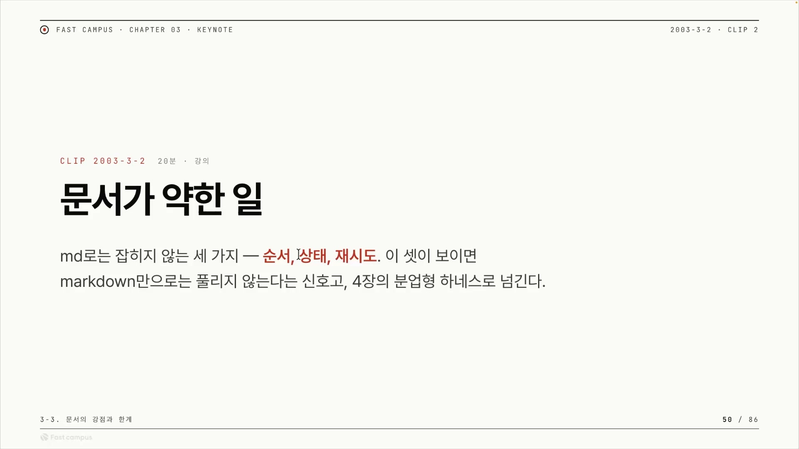
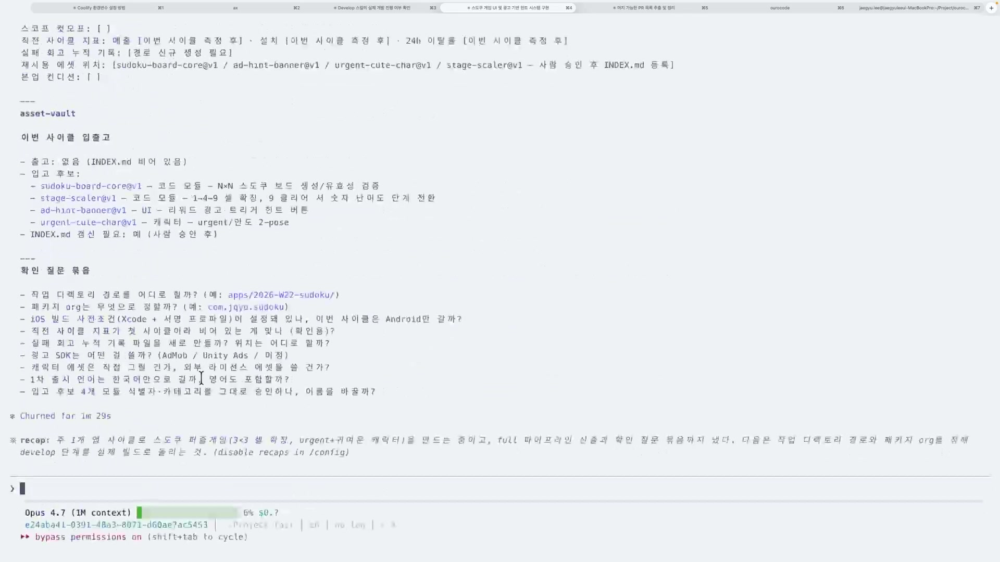
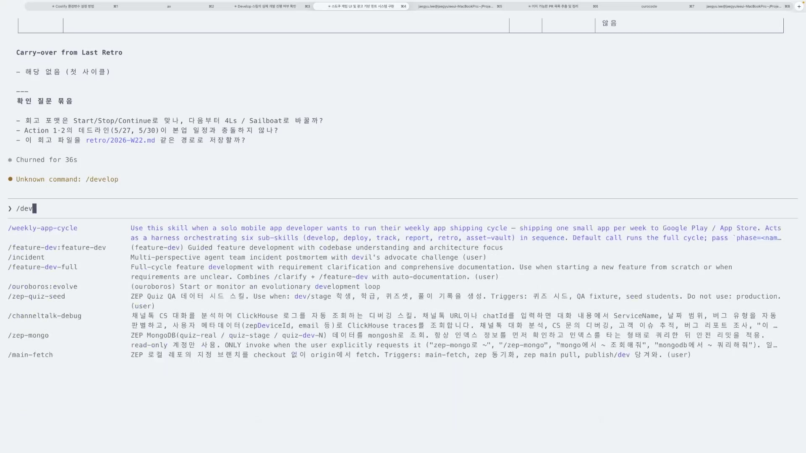
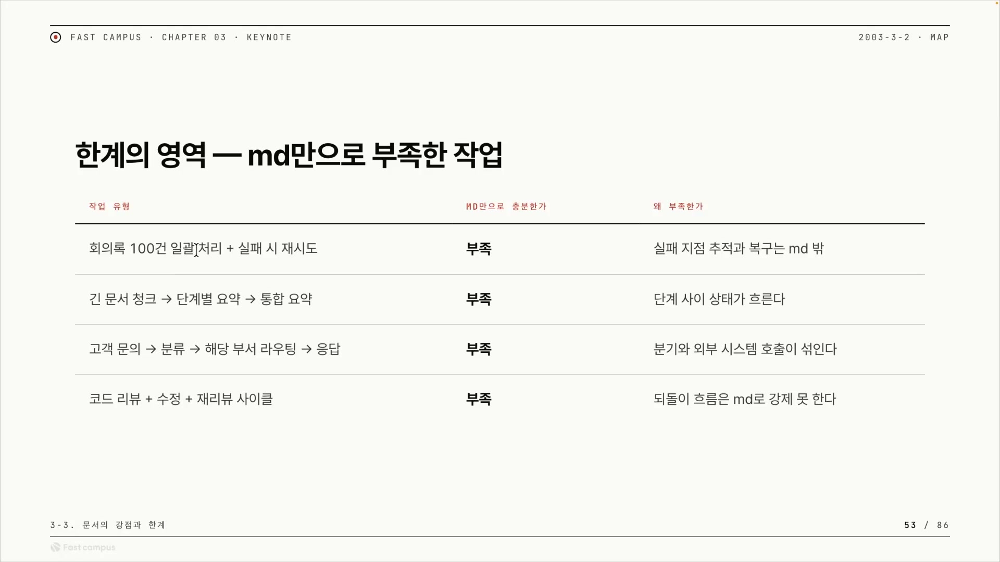
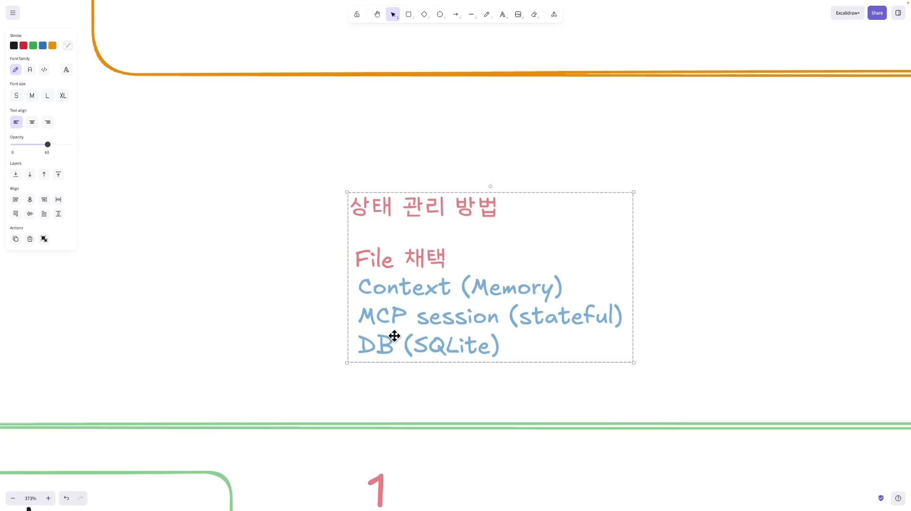
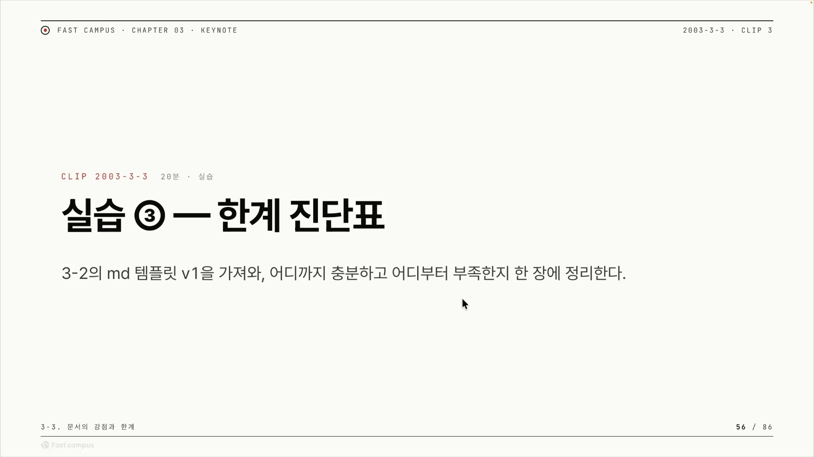

마크다운으로 절차를 적어 에이전트를 굴리는 방식이 있다. SKILL.md 같은 파일에 "이런 순서로 이걸 해라"를 적어두면, 모델이 그 문서를 읽고 따라 움직인다. 이 강의는 그런 방식을 문서형 하네스라 부른다. 하네스(harness)는 모델 바깥에서 에이전트를 실제로 굴리는 작업 틀을 가리키는 말이고, 그중 마크다운 문서를 틀로 쓰는 게 문서형이다. (마크다운을 하네스의 한 종류로 보는 분류 자체는 이 강의 고유의 프레이밍이다. 업계 표준 용어라고 단정할 건 아니다.)

직전 클립에서 강사는 이 문서형 하네스가 잘하는 일을 짚었다. 한 번 입력하면 한 번 출력하는 작업, 그것도 데터미니스틱하게(입력이 같으면 결과도 같게) 가져가는 일이다. 이번 클립은 그 짝의 뒷면이다. 같은 도구가 어디서 무너지는지를 본다.

강사의 정리는 깔끔하다. 마크다운이 닿지 못하는 영역은 세 가지, 순서와 상태와 재시도다. 그런데 이 약점은 한 번에 드러나지 않는다는 게 핵심이다. 한 사이클이면 멀쩡하다. 여러 사이클이 돌고 며칠, 몇 주가 지나면서 결과가 누적되고 단계들이 엮여야 비로소 터진다. 무너지는 진짜 원인도 마크다운 문법이 아니다. 메인 세션 하나에 모든 걸 다 몰아넣기 때문이다. 강사는 다 한곳에서 처리하려 하면 인스트럭션 블리딩과 컨태미네이션이 일어나 드리프트가 생긴다고 세 단어를 한 묶음으로 짚는다. 강의가 각각의 정의를 따로 풀지는 않지만, 흔히 인스트럭션 블리딩은 한 작업의 지시가 다른 작업으로 새어드는 것, 컨태미네이션은 앞 단계의 출력이 다음 추론을 오염시키는 것, 드리프트는 그 결과 원래 의도에서 점점 벗어나는 것으로 설명된다. 강사는 "오케스트레이션 자체도 점점 컨텍스트가 쌓이면서 밀려나" 나중엔 "뭐 하는지를 모르는 상황"이 된다고 말한다. 사람의 컨텍스트도 같이 쌓여 망가진다는 점까지 인정한다. 이게 모델만의 문제가 아니라는 신호다.

## 순서: 틀린 순서가 그냥 통과해버린다

첫 번째 한계는 순서다. A 다음에 B를 하느냐, B 다음에 A를 하느냐가 결과를 바꾸는데, 마크다운 문서 자체에는 그 순서를 강제하는 장치가 없다. 그래서 개발을 해야 할 자리에서 똑같은 걸 한 번 더 하거나, 회고를 먼저 해버려도 문서는 그걸 막지 못한다.

여기서 직관에 어긋나는 지점이 하나 있다. 보통은 순서가 틀리면 에러가 날 거라고 생각한다. 컴파일러가 그렇듯이. 그런데 마크다운 하네스에서는 틀린 순서가 에러 없이 그냥 통과해버린다. 이유는 실행 주체가 프로그램이 아니라 모델이기 때문이다. 모델은 컴파일러처럼 "이 입력은 규칙 위반"이라며 멈추는 게 아니라, 인터프리터처럼 지금 상황에서 스킬을 어떻게든 돌려보려 한다. 강사의 표현으로는 "프로그램이 아니라는 거죠". 그래서 막혔어야 할 자리에서 막히지 않고 그럴듯하게 진행된다.

강의에서는 이걸 라이브 데모로 보여준다. 원래 흐름은 개발 다음에 배포인데, 강사가 배포 차례에서 회고(레트로)로 넘어가버린다. 프로그램이라면 여기서 "살짝 오류를 뿌렸어야" 정상이다. 그런데 화면에서는 오히려 뭔가가 실행된다. 강사 본인도 무엇이 된 건지 모른다.

> "이러면 원래 살짝 오류를 뿌렸어야 되는 거죠. 근데 지금 뭔가 됩니다. 뭐가 되는지 모르겠어요. 됩니다, 됐어요. 뭐가 된 거죠? 네, 모르죠."
> (에러가 났어야 정상인데 통과해버린 장면)

강사가 라이브로 실수를 저지르고 "뭐가 된 거죠? 모르죠"라며 당황하는 이 장면이, 추상적 주장("순서를 못 막는다")을 손에 잡히게 한다. 그리고 혼란이 커진 건 순서가 섞인 것만이 아니라 강사 자신의 컨텍스트, 즉 사람의 기억까지 같이 흐트러졌기 때문이다. 강사는 데모 중에 "지금 굉장히 인간의 컨텍스트가, 제 컨텍스트가 망가지면서"라고 실시간으로 토로한다. 마크다운 하네스는 사람이 순서를 완벽히 기억해줄 때만 버티는 구조라서, 사람의 기억에 기대는 설계 자체가 취약하다. 결국 강사의 결론은 "막았어야 되는데 순서를 우리가 제대로 완전하게 강제할 수 없다"는 것이다.

## 상태: 단계 사이의 결과를 어디에 둘 것인가

두 번째 한계는 상태다. 파이프라인은 한 단계의 출력이 다음 단계의 입력으로 흘러가는 구조다. 그런데 이 단계 사이에 흐르는 상태를 마크다운이 자동으로 챙겨주지 않는다. 사람이나 스킬이 따로 관리해줘야 하는데, 마크다운에는 "이 상태를 저장하고 다음 단계로 넘기는" 장치가 없다.

상태를 둘 가장 손쉬운 자리는 그냥 대화 컨텍스트다. 하지만 컨텍스트는 작업이 진행될수록 쌓이기만 한다. 상태를 그 누적 속에 얹어두면 묻히고 오염돼, 지금이 제대로 된 상태인지 체크할 수가 없다. 강사는 이걸 직접 겪고 한 칸 위로 올라간다.

> "파일이 있을 거고 컨텍스트, 그리고 지금 컨텍스트로 절대 안 된다는 걸 깨달았어요. 파일을 써야 되는데."

이건 이론이 아니라 "해보니 안 되더라"의 서사다. 그래서 파일로 옮긴다. 그런데 파일도 만능이 아니다. 한 사이클이면 괜찮지만 여러 사이클이 돌고 며칠, 몇 주가 지나면 파일을 넘어선 상태관리가 필요해진다. 결정적인 약점은 재진입이다. 같은 경로에서 스킬을 또 켜면 이전에 만든 파일을 그대로 다시 쓰게 되어 상태가 겹친다. 흔히 이런 중복 실행은 "이 작업이 어디까지 끝났는지"를 안전하게 기록하고 동시 접근을 막는 잠금 같은 장치로 다루는데, 파일을 그냥 쓰는 방식에는 그런 장치가 따로 없다.

상태 약점이 가장 아프게 드러나는 건 복구 지점이 없을 때다. 강의 데모에서 강사는 회고를 잘못 쳤음을 깨닫고, 원래 가려던 develop 단계로 되돌아가려 한다. 그런데 develop은 숨겨져 있고, 막상 부르니 제대로 돌지 않는다.

강사의 결론은 "복구 지점이 없다"는 것이다. 상태가 어딘가 저장돼 있어야 특정 지점으로 되돌아가 거기서부터 다시 시작할 수 있는데, 마크다운 하네스에는 되돌아갈 지점 자체가 없다. git이라면 커밋이나 체크포인트가 있어 언제든 특정 지점으로 reset하거나 거기서부터 다시 갈 수 있는데, 마크다운에는 그런 커밋이 없는 셈이다. "잘못 쳤으니 한 단계 전으로 돌아가자"는 지극히 평범한 욕구가, 상태가 저장돼 있지 않으면 그냥 불가능해진다.

## 재시도: 누적된 상태 위에서는 깨끗이 다시 못 한다

세 번째 한계는 재시도다. 그런데 이건 앞의 둘과 별개가 아니라, 앞의 둘이 맞물린 결과다. 마크다운은 입력 하나가 처음부터 시작되면 출력 하나를 안정적으로 만든다. 문제는 그 실행들이 엮이고 오케스트레이션되면서 결과가 누적된 다음이다. 중간에 실패해 다시 하려 하면, 이미 쌓인 결과 위에서 하게 되므로 순수한 재시도가 성립하지 않는다.

> "그 결과가 누적되고 만약 중간에 실패하게 되면 이걸 다시 해야 되는데, 이미 결과가 누적된 상태에서 Replay를 하지 못한다라는 거죠."

여기서 두 단어를 갈라둘 필요가 있다. 리플레이(replay)는 처음 상태에서 누적된 찌꺼기 없이 깨끗이 다시 돌리는 것이고, 리줌(resume)은 멈춘 지점부터 이어서 재개하는 것이다. 강사가 "퓨어하게 리플레이를 하냐"라고 강조하는 이유가 여기 있다. 재시도가 안 되는 건 모델이 멍청해서가 아니라, 이미 컨텍스트와 파일이 만들어진 오염된 상태 위에서 다시 하기 때문이다. 재시도 시점에 이미 메인 오케스트레이터가 흐름을 붙잡고 있고, 그 시도는 새 세션에서 시작되는 게 아니다.

그럼 무엇이 있어야 하나. 복구 지점이 있어야 하고, 실행 환경이나 코드가 리플레이와 리줌을 쥐고 있어야 한다. 강사가 드는 예가 직관적이다. 긴 문서를 청크로 나눠 처리하는데 컨텍스트가 99%까지 차면 거기서 그냥 끝난다. 그런데 "이 청크는 이미 완료됐다"를 DB가 들고 있으면, 흐름을 한 번에 호출했을 때 "너 지금 여기야"라고 알려주고 멈춘 데서 이어갈 수 있다. 어디까지 했는지 기억하는 외부 장부가 코드와 DB로 있어야 가능한 일이고, 마크다운만으로는 부족하다.

## 추상적 한계를 실제 업무로 번역하면

여기까지가 순서, 상태, 재시도라는 추상적 세 한계다. 강사는 이걸 독자가 매일 겪는 업무로 하나씩 번역해 보여준다.

회의록 100건을 요약하는 일을 보자. 건수가 쌓이는 동안 컨텍스트가 밀려 절반쯤에서 드리프트가 나고, 각 건이 어디까지 됐는지를 문서가 추적하지 못한다. 그래서 강사는 이런 대량 처리는 마크다운이 아니라 확실하게 데터미니스틱한 코드로 돌려야 한다고 본다. 그다음이 실패 지점 추적이다. 100건 중 어느 건이 실패했는지(상태)를 남겨야 그 건만 골라 다시 돌릴(복구) 수 있는데, 문서는 둘 다 못 한다. 강사는 이런 건 마크다운 밖에서 DB나 MCP로 처리하는 게 깔끔하다고 말한다. 긴 문서 청크도 같은 줄기다. 완료된 청크를 DB에 보관하고 코드로 된 리줌 기능이 있어야 "지금 여기"부터 이어갈 수 있다.

고객 문의 처리는 결이 조금 다르다. 문의가 오면 분류하고 담당 부서로 라우팅한 뒤 응답을 받아야 하는데, 외부 시스템 호출이 섞이는 순간 응답이 언제 올지 모르는 비동기 흐름이 된다. 마크다운은 이 대기와 재개를 다루지 못한다. 그래서 MCP나 서버를 직접 띄우고, DB를 관리하면서 그 DB를 폴링해(주기적으로 들여다봐) 상태를 확인하는 형태가 되어야 한다.

가장 흥미로운 건 코드 리뷰 사이클이다. 리뷰하고 수정하고 다시 리뷰하는 반복은 그 자체로 컨텍스트를 많이 먹어 오염이 누적된다. 그런데 강사는 여기에 한 겹을 더 얹는다. 사람이 자기가 쓴 글이나 그린 그림을 너그럽게(보정해서) 보듯, LLM도 "내가 이걸 수정했다"는 사실이 토큰으로 쌓이면 그다음 추론을 근거 없이 더 자신 있게 가져간다는 것이다.

> "내가 이걸 수정했다라는 컨텍스트가 토큰으로 쌓여 있으면 (...) 좀 더 자신 있는 결과가 나오게 됩니다. (...) 좀 더 잘못된 추론이 나올 수 있다라는 거죠."

자기 수정 이력이 객관적 재평가를 방해한다는 이야기다. 학계에 자기 선호 편향(self-preference bias)이라는, LLM이 자기 출력을 더 높게 평가하는 현상이 보고돼 있어 통하는 데가 있다. 다만 그쪽은 주로 "평가자로서 자기 출력을 선호"하는 것을 가리키니, 강사가 말하는 "자기 수정 사실이 다음 추론을 과신시킨다"와 정확히 같은 학술 정의는 아니고, 사람의 "내 글 콩깍지"에 빗댄 설명에 가깝다. 처방은 분명하다. 리뷰와 수정의 컨텍스트를 한곳에 쌓지 말고 섹션을 분리하라는 것. 이 "분리"가 다음 장으로 가는 다리가 된다.

## 해결은 버리는 게 아니라 하나씩 올라가는 것

이 한계들 앞에서 강사가 내놓는 처방은 한 문장이다. "여기서 해결이 안 되면 하나씩 올라가는 겁니다." 마크다운에서 막히는 건 실패가 아니라 다음 칸으로 올라가라는 신호라는 것이다. 마크다운을 버리는 게 아니라, 잘하는 범위까지 쓰고 그 천장에서 한 칸 올린다.

올라가는 사다리는 사실 두 개다. 헷갈리기 쉬운데 둘은 가리키는 게 다르다. 하나는 상태를 어디에 둘 것인가, 곧 데이터를 두는 자리의 사다리다. 컨텍스트로 버티다가 깨지면 파일로, 파일이 며칠·몇 주를 못 버티면 MCP나 DB로 올라간다. 각 칸이 그 위 칸의 필요성을 스스로 증명한다. 컨텍스트가 망가져서 파일이 필요해지고, 파일이 겹쳐서 DB가 필요해진다.

다른 하나는 하네스 자체의 계층이다. 문서형 하네스가 맨 아래, 그 위에 분업형 하네스, 다시 그 위에 MCP 하네스가 있다(4장과 5장). 이 클립은 맨 아래 칸의 천장을 보여주고 위 칸들의 필요성을 동기화하는 자리인 셈이다.

분업형으로 올라가면 무엇이 풀리나. 강사가 드는 이점은 컨텍스트 초기화, 세션 분리(아이솔레이션), 비동기, 병렬 네 가지다. 그리고 이 넷은 공교롭게도 앞에서 본 한계들을 거꾸로 푸는 수단이다. 세션을 새로 시작하면 누적된 오염을 털어낼 수 있으니 컨텍스트 오염이 풀리고(앞의 리뷰 사이클 문제가 여기 정확히 걸린다), 세션을 격리하면 분리된 자리에서 깨끗이 돌아올 수 있으니 순수 재시도에 가까워지며, 비동기로 받으면 외부 호출이 섞여도 처리할 수 있고, 병렬로 돌리면 대량·긴 작업이 한 흐름에서 막히지 않는다. (강의가 이 한계와 이점을 한 줄씩 맞대어 발언한 건 아니다. 두 대목을 잇는 건 이 글의 정리다.)

정리하면 이 클립은 한계의 나열이 아니다. 마크다운은 한 번 입력에 한 번 출력을 데터미니스틱하게 아주 잘한다. 다만 단계가 엮이고 결과가 누적되는 순간, 순서를 강제하지 못하고(순서) 단계 사이 상태를 안정적으로 저장하지 못하며(상태) 그래서 실패 후 깨끗한 지점으로 되감지 못한다(재시도). 이 셋은 별개의 약점이 아니라 "한 세션에 다 몰아넣어 길을 잃는다"는 한 문제의 세 얼굴이고, 강사가 데모에서 직접 "뭐가 된 거죠? 모르죠"라며 길을 잃는 장면이 그 증거다. 천장이 보이면 버리는 게 아니라 한 칸 올린다. 그게 4장과 5장으로 이어지는 출발점이다.
