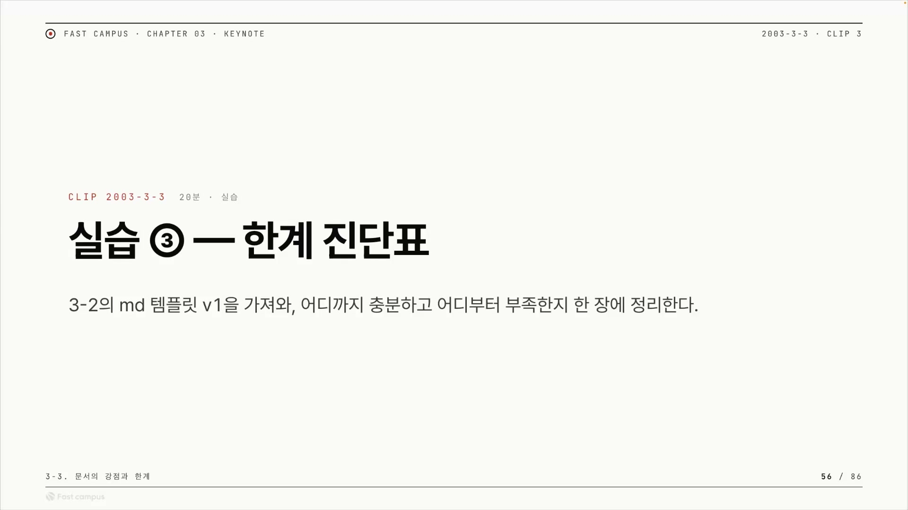
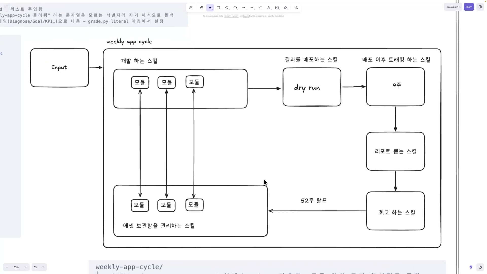
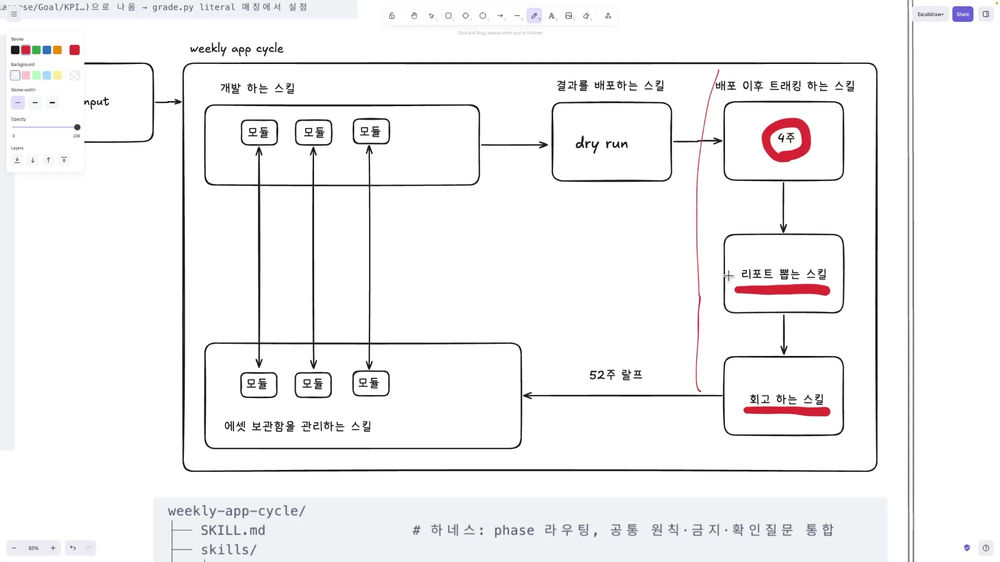
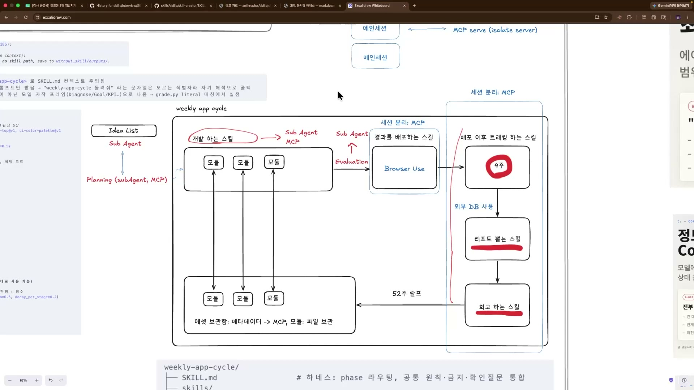
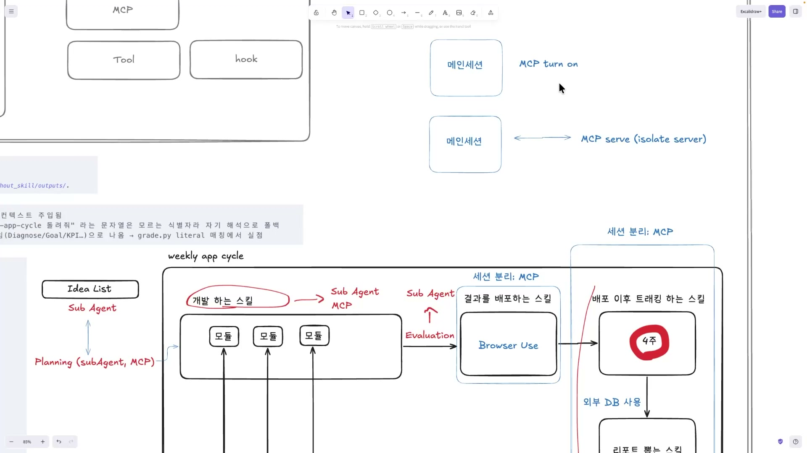
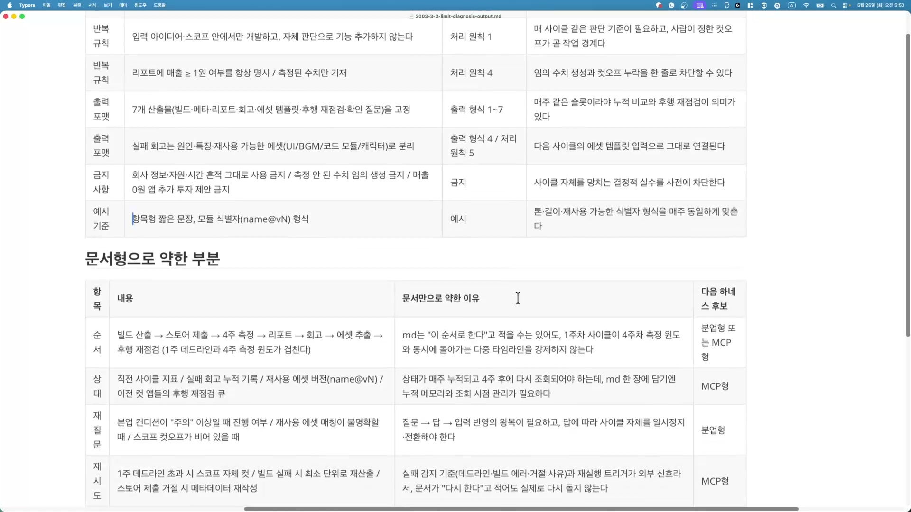

마크다운 한 장에 일을 다 적어두면, 클로드는 그 문서를 읽고 시키는 대로 움직인다. 산출물 포맷은 이렇게, 규칙은 이걸 지키고, 이건 하지 마라. 이렇게 글로만 짜둔 자동화 골격을 강의는 "문서형 하네스"라고 부른다. 하네스(harness)는 LLM에게 일을 시키는 틀이고, 그 틀을 무엇으로 짜느냐가 문제다. `SKILL.md` 한 장으로 짜면 문서형, 일을 다른 세션에 떼어 맡기면 분업형(서브에이전트), 외부 서버를 툴콜로 부르면 MCP형이다.

이번 실습은 새 개념을 배우는 시간이 아니다. 앞 클립(3-2)에서 직접 만든 자기 업무용 마크다운 템플릿 v1을 다시 펼쳐서, 그 한 장이 내 업무를 끝까지 감당할 수 있는지를 따져보는 자리다. 산출물은 딱 한 장, "한계 진단표"다.

## 그려보면 무너지는 자리가 보인다

진단은 분석으로 시작하지 않고 그리기로 시작한다. 강사는 자기 업무인 weekly app cycle, 주 1회 모바일 앱을 만들어 배포하고 운영하는 사이클을 화이트보드에 다이어그램으로 펼친다. 처음엔 모든 단계가 그냥 "\~하는 스킬" 박스다.

흐름을 따라가면 이렇다. Input이 들어오면 개발 하는 스킬이 모듈을 조립해 앱을 만들고, 결과를 배포하는 스킬이 dry run(시험 배포)으로 내보낸다. 그다음 배포 이후 트래킹 하는 스킬이 4주간 지표를 추적하고, 리포트 뽑는 스킬이 결과를 정리하고, 회고 하는 스킬이 그걸 돌아본다. 회고 결과는 다시 왼쪽 에셋 보관함으로 흘러가 다음 사이클의 재료가 되는데, 그 긴 화살표에는 "52주 랄프"라고 적혀 있다. 손글씨라 정확히 읽히진 않지만 이 주간 사이클을 장기로 반복 돌리는 루프를 가리키는 것으로 보인다.

강사는 이 그림을 다 그린 직후 이렇게 말한다. 여섯 가지 기둥을 그려놓고 보니 "아 여기선 안 되겠네" 하는 칸이 보였어야 한다는 것. 어디서부터 안 되는지는 하나씩 짚어보면 된다.

## 빨간색으로 칠해지는 칸

강사는 펜을 빨강으로 바꾸고 세 곳을 칠한다. 트래킹의 4주에 빨간 동그라미, 리포트 뽑는 스킬과 회고 하는 스킬에 빨간 밑줄. 그리고 이 묶음 왼쪽에 세로로 긴 빨간 선을 그어 따로 떼어낸다.

빨간색의 의미는 세 가지 성질이 겹친 칸이다. 비동기, 긴 시간, 그리고 두꺼움(무거움). 마크다운 스킬은 한 세션 안에서 한 번에 도는 텍스트 규약이라 이 성질을 감당하지 못한다. 트래킹은 결과가 4주 뒤에야 나오는데 한 세션이 4주를 기다릴 수 없다. 리포트는 트래킹이 끝나야 나오고, 회고는 리포트가 나와야 한다. 셋 다 메인 흐름과 따로 돌아야 하는 일이다. 강사가 챕터를 닫으며 못 박는 한 문장이 이걸 한마디로 정리한다. **"가장 큰 약점은 결국에 이렇게 긴 시간은 스킬로 쓰기가 정말 어렵다"** 라는 것.

처방은 두 갈래다. 4주짜리 측정값은 사람이 입력하거나 스토어 콘솔 같은 외부에서 가져와야 하는 상태값이라, 마크다운 텍스트가 아니라 외부 DB에 쌓고 꺼내 써야 한다. 그리고 이 비동기 칸들은 메인 세션이 아니라 아예 다른 세션, 즉 서브에이전트나 MCP로 돌렸어야 한다.

## 칸마다 도구가 갈린다

빨간 칸만 문제가 아니다. 강사는 다이어그램을 한 칸씩 다시 돌며 각 단계에 맞는 도구를 붙여나간다. 진단을 다 거친 뒤의 완성도가 이 한 장이다.

배정의 논리를 따라가 보면 도구 선택의 직관이 잡힌다.

개발 하는 스킬은 무겁고 별도 세션이 필요해서 Sub Agent 또는 MCP로 보낸다. 개발이 끝난 산출물을 곧장 배포할 수는 없으니 그 사이에 Evaluation(검수) 게이트를 새로 그려 넣는데, 이 검수도 또 다른 세션이라 서브에이전트가 맡는다.

배포는 흥미로운 예외다. 강사는 결과를 배포하는 스킬 박스 안에 Browser Use를 적으며, 여기는 스킬로 해도 된다고 한다. 배포란 뭔가를 클릭하고 산출물을 업로드하며 플랫폼마다 다른 화면을 LLM에게 이해시키는 일인데, 애플이나 안드로이드 플랫폼이 언제 어떻게 바뀔지 모르는 상황에선 코드로 단단히 짜기보다 LLM에 의존해 플랫폼별로 처리하는 쪽이 낫기 때문이다. 다만 배포 로직 자체는 스킬(Browser Use)이어도, 그 스킬을 메인과 분리된 백엔드 세션에서 돌리는 방식은 MCP다. 그래서 배포 영역 위에 "세션 분리: MCP"가 붙는다.

에셋 보관함은 가장 까다로운 칸이다. 여기서 강사는 보관함을 두 갈래로 쪼갠다.

| 대상 | 보관 방식 | 왜 |
|---|---|---|
| 메타데이터 (어떤 모듈이 있는지 목록) | MCP 툴콜 | 메인이 "지금 보관함에 무슨 모듈이 있지?"를 물을 때, 텍스트로 다 읽는 게 아니라 툴콜 한 번으로 조회해야 한다 |
| 모듈 본체 | 파일 보관 | 실제 코드 덩어리는 그냥 파일로 두면 된다 |

조회 성격의 메타데이터는 MCP 툴콜로, 덩어리 자산은 파일로. 모든 걸 마크다운 한 장에 적으려 들지 말라는 판단 기준이 여기서 나온다.

파이프라인 앞단에는 아이디어 발굴 묶음이 새로 붙는다. 아이디어를 모으는 Idea List에서 서브에이전트로 여러 Persona(가상 사용자 관점)를 뽑아내고, 각 Persona로 아이디어를 테스트해 후보를 추린다. 여러 후보를 병렬로 돌려 결과만 받아오는 일이라 메인 세션을 더럽히지 않는 서브에이전트가 잘 맞는다. 추려낸 아이디어를 하나씩 구체화하는 Planning 단계도 같은 이유로 서브에이전트나 MCP로 간다.

## MCP를 켜는 두 가지 방식

여기서 강사는 화면을 따로 띄워 MCP가 어떻게 켜지는지를 두 갈래로 나눈다. 이 클립에서 기술적으로 가장 또렷한 대목이다.

첫 번째는 메인 세션과 함께 켜지는 MCP다. 클로드를 켜면 `/mcp` 목록에 channeltalk, posthog, slack-agent 같은 서버들이 connected로 붙어 있는데, 이게 바로 메인이 켜질 때 같이 켜지는 형태다. 다이어그램 라벨로는 "MCP turn on". 특징은 메인 세션과 한 몸이라는 것이다. **"메인 세션이 죽으면 같이 죽어요."**

두 번째는 `mcp serve` 명령으로 따로 띄우는 isolate server(격리 서버)다. 이건 메인 세션과 라이프사이클이 분리된다. 메인이 죽어도 계속 살아 있고, 양방향으로 소통하며, 여러 세션이 동시에 한 서버를 호출할 수 있다.

| | MCP turn on (함께 켜짐) | MCP serve / isolate server (격리) |
|---|---|---|
| 켜지는 시점 | 메인 세션이 켜질 때 함께 | `mcp serve` 명령으로 따로 |
| 라이프사이클 | 메인과 한 몸, 메인 죽으면 같이 죽음 | 메인과 분리, 메인 죽어도 생존 |
| 호출 주체 | 그 메인 세션 | 여러 세션이 동시에 호출 |

이 두 갈래가 앞의 다이어그램을 진짜로 설명한다. 늘 떠 있어야 하고 여러 흐름이 공유하는 백엔드, 가령 4주 동안 돌아야 하는 트래킹이나 항상 조회 가능해야 하는 에셋 보관함은 두 번째 방식(isolate server)으로 띄워야 한다. 비동기 칸들을 "세션 분리: MCP"로 보낸 진짜 메커니즘이 이것이다.

강사 본인도 "약간 범위를 넘었다"고 할 만큼 깊이 들어간 부분이지만, 챕터 1에서 다룬 Pass by Value / Pass by Reference, 즉 서브에이전트와 메인 세션 사이에 무엇을 주고받느냐의 감각이 결국 언제 서브에이전트를 쓰고 언제 MCP를 쓰고 언제 스킬을 쓸지를 가르는 토대라고 연결한다.

## 진단표 만드는 법

여기까지가 강사가 자기 예시로 보여준 데모, 즉 강한 칸과 약한 칸을 가르는 근거다. 이제 실습은 학습자가 자기 템플릿으로 같은 진단을 돌리는 단계로 넘어간다. 방법은 표 세 칸을 채우는 일이다. 슬라이드 제목은 "세 칸을 채운다"지만 실제 단계는 4개로, 충분과 부족과 이유가 핵심 세 칸이고 4장 연결은 부족 칸에 덧붙이는 표시다.

| STEP | 열 | 무엇을 적는가 |
|---|---|---|
| 1 | 충분 | md 템플릿이 매번 같은 결과를 낸 곳. 형식 · 금지 · 규칙이 잘 적혀 있다 |
| 2 | 부족 | 입력에 따라 결과가 달라지거나, 단계가 길어지면 무너지는 곳 |
| 3 | 이유 | 왜 부족한지, 순서인지 상태인지 재시도인지 적는다 |
| 4 | 4장 연결 | "부족" 칸 옆에 분업형으로 넘길 항목이라고 표시한다 |

실제로 돌리면 하네스는 곧장 표를 뱉지 않는다. 무엇을 진단할지(업무명 · 입력 · 출력)를 먼저 되묻고, 거기에 답을 넣으면 각 칸을 충분과 부족으로 판정하기 시작한다.

부족 사유는 세 가지로만 분류한다. 순서 · 상태 · 재시도다. 이 셋 밖의 이유가 나오면 분류가 흐려진다. 강사가 덧붙이는 재질문과 왕복도 결국 이 셋으로 흡수된다.

- **순서**: 정해진 순서로 흘러야 하는데 단계끼리 겹치거나 여러 타임라인이 동시에 도는 경우. md는 "이 순서로 한다"고 적을 수는 있어도 동시 진행을 강제하지 못한다.
- **상태**: 값이 매주 누적되고 나중에 다시 조회돼야 하는데, md 한 장에는 누적과 조회 시점 관리가 안 되는 경우. 외부 DB(MCP)로 간다.
- **재시도**: 실패를 감지하고 실제로 다시 돌려야 하는데, 문서에 "다시 한다"고 적어도 실제로 다시 돌지는 않는 경우.

매칭의 직관도 분명하다. 왔다 갔다 주고받는 왕복과 실패 후 다시 돌리는 재시도는 서브에이전트가 굉장히 잘하는 형태다. 누적과 조회가 걸린 상태는 외부 DB를 MCP로 다룬다. 슬랙 자동 전송 같은 외부 서비스 호출은 스킬에서 슬랙 MCP를 툴콜해도 된다.

표를 다 채웠는지는 네 가지로 검수한다.

| CHECK | 무엇을 보나 |
|---|---|
| 1 | "부족"마다 "왜"가 한 줄로 붙어 있다 |
| 2 | 이유가 순서 / 상태 / 재시도 안에 든다. 이 셋 밖이면 분류 미달 |
| 3 | 충분 항목이 존재한다. 전부 "부족"이면 템플릿이 너무 많은 걸 담으려 한 것 |
| 4 | "부족" 항목마다 분업형으로 넘길 표시가 붙어 있다 |

## 한 장으로 떨어진 결과

실습을 돌리면 클로드가 진단표 한 장을 뽑는다. 구성은 진단 대상(업무명 · 입력 · 출력), 문서형으로 강한 부분 표, 그리고 문서형으로 약한 부분 표다. 강사 예시에서 그 약한 부분 표는 네 칸으로 채워졌다.

| 항목 | 문서만으로 약한 이유 | 다음 하네스 후보 |
|---|---|---|
| 순서 | 1주차 사이클과 4주차 측정 윈도우가 동시에 도는 다중 타임라인을 md가 강제하지 못한다 | 분업형 또는 MCP형 |
| 상태 | 직전 지표 · 회고 누적 · 에셋 버전이 매주 쌓이고 4주 후 다시 조회돼야 하는데, md 한 장엔 누적 메모리와 조회 시점 관리가 안 된다 | MCP형 |
| 재질문 | 컨디션 · 에셋 매칭 · 스코프 컷오프에 질문→답→반영의 왕복이 필요하고, 답에 따라 사이클을 일시정지 · 전환해야 한다 | 분업형 |
| 재시도 | 데드라인 초과 · 빌드 실패 · 제출 거절의 감지 기준과 재실행 트리거가 외부 신호라서, 문서가 "다시 한다"고 적어도 실제로 다시 돌지 않는다 | MCP형 |

네 칸이 전부 분업형이나 MCP형으로 떨어졌다. 즉 이 업무는 마크다운 단독으로는 안 되고 분업형으로 넘어가야 한다는 결론이다. 강사 본인의 자평이 이 대목에서 솔직하다. **"저는 너무 많은 걸 담으려고 했던 것 같습니다."** 한 템플릿에 욕심내 다 담으면 전부 부족으로 찍힌다는, 흔한 초보 실수의 자백이다. 검수 3번에 정확히 걸린 셈이다.

그렇다고 마크다운이 무능하다는 뜻은 아니다. 강사는 인터뷰 하네스처럼 범위가 좁은 템플릿을 넣었으면 모두 충분으로 나왔을 거라고 본다. 마크다운이 약한 게 아니라 이 업무와 마크다운의 궁합이 안 맞았을 뿐이다. 실제로 산출물 포맷, 모드 식별자 형식, 작업 규칙, 금지사항, 특정 규칙은 진단표에서 충분으로 남았다.

그리고 이 충분 칸들은 버리는 게 아니다. 강사가 분명히 한다. 이런 규칙과 포맷은 앞으로 서브에이전트나 MCP를 쓸 때도 그대로 가져간다고. 문서형은 한계가 있을 뿐, 더 큰 하네스 안에서도 골격으로 계속 재활용된다.

## 진단표가 가리키는 곳

이 한 장은 보고서가 아니라 의사결정 도구다. 약한 칸마다 "다음 하네스 후보"를 붙여 다음 행동을 지정해주기 때문이다. 같은 잣대는 다른 업무에도 그대로 통한다. 회의록 100건 일괄 처리처럼 양이 많은 일은 마크다운으로 어렵고, 슬랙 자동 전송은 분업형이나 스킬에서 MCP 툴콜로 풀린다.

결국 진단의 진짜 효과는 표 자체가 아니라 그리는 행위에 있다. 내 손으로 업무를 다이어그램으로 펼치고 칸을 나눠보면, 마크다운 한 장으로 안 되는 자리가 스스로 드러난다. 그 드러난 칸이 곧 서브에이전트와 MCP로 넘어가야 할 칸이고, 그게 다음 챕터에서 분업형을 배우는 출발점이다. 다음 클립에서는 Superpowers 같은 실제 사례를 펼쳐, 마크다운만이 아니라 그 안에서 서브에이전트와 훅(hook)이 어떻게 엮이는지를 들여다본다.
