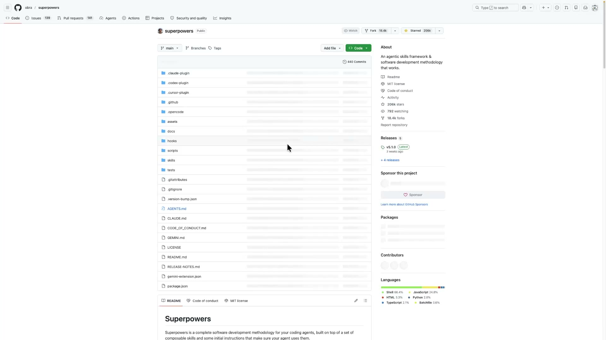
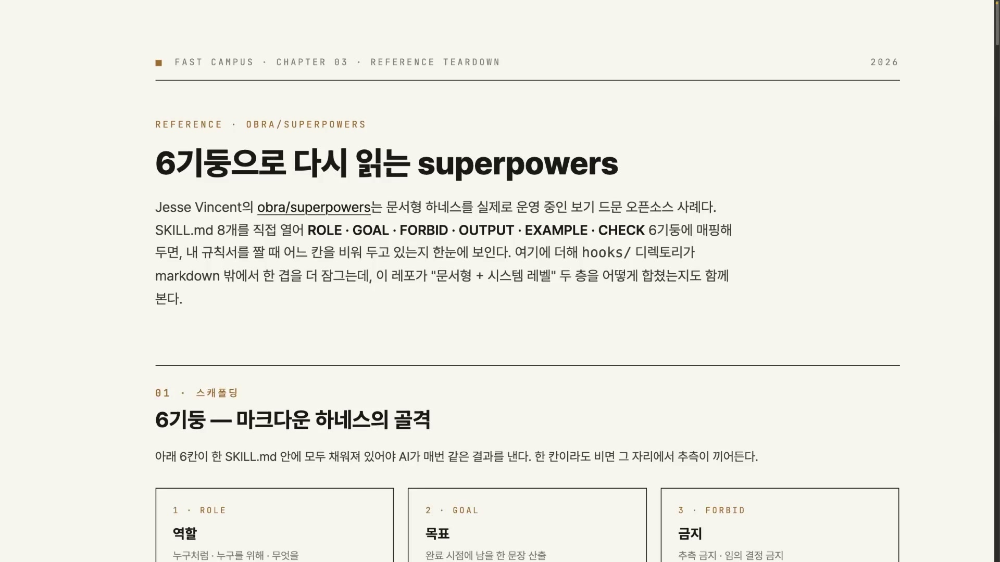
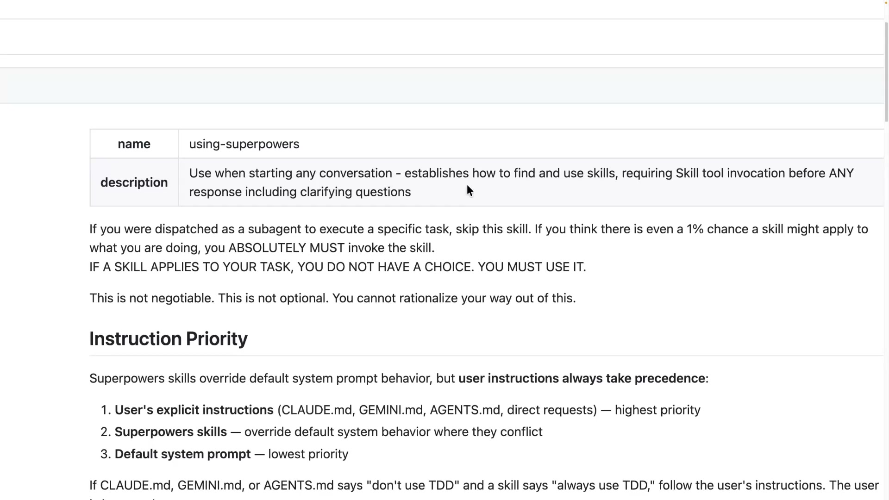
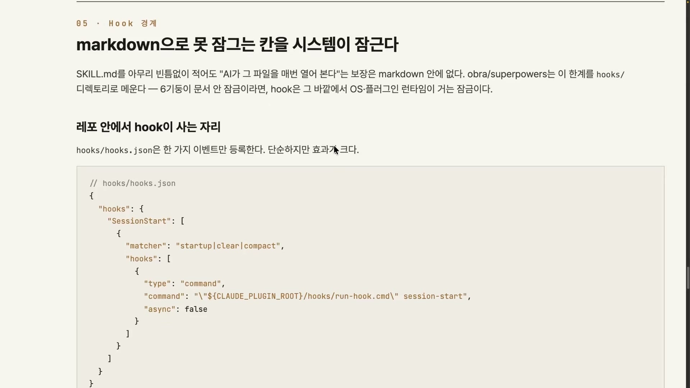
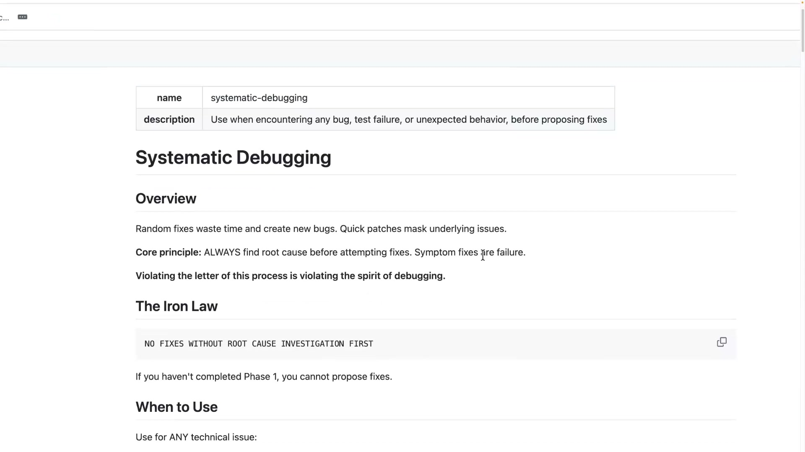
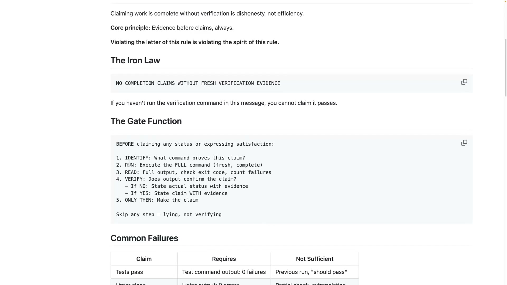
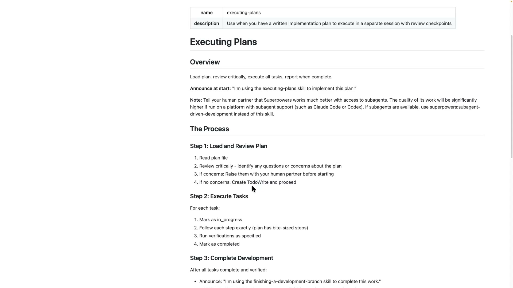
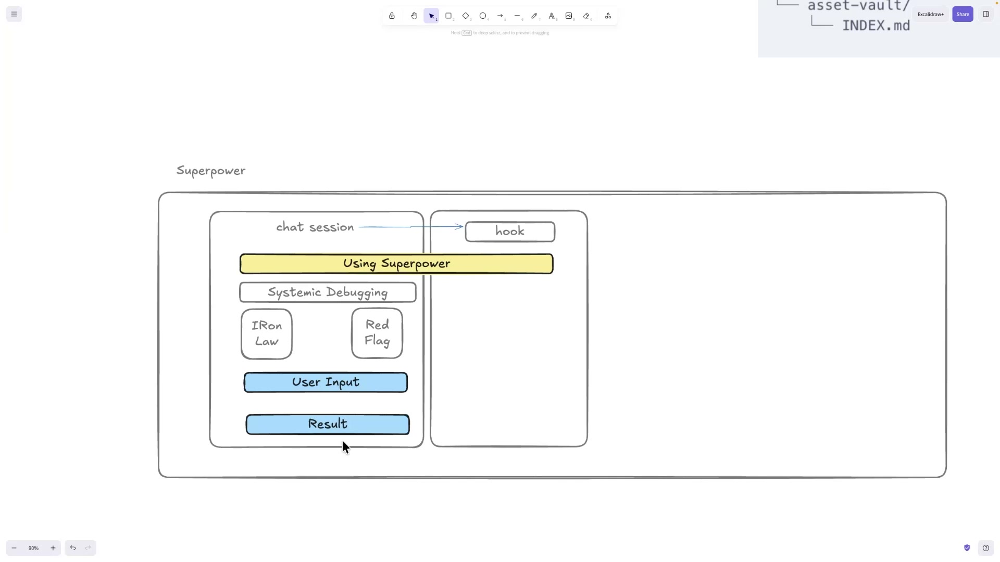
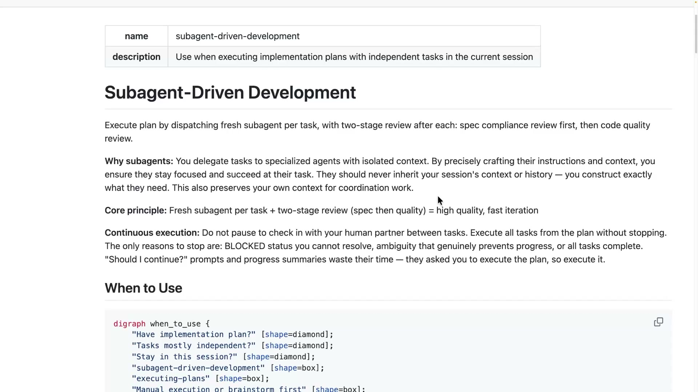
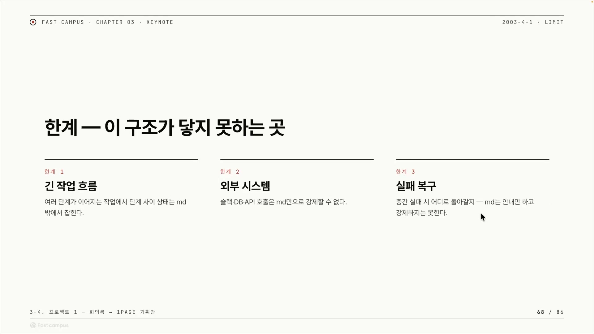

AI 코딩 에이전트를 길들이는 방법이라고 하면 보통은 코드를 떠올린다. 파이썬이나 JS로 래퍼를 짜고, 모델이 엉뚱한 짓을 하면 검증 로직으로 걸러내고, 외부 도구를 호출하는 어댑터를 붙인다. 그런데 obra/superpowers는 코드를 거의 쓰지 않는다. `.md` 파일, 그러니까 사람이 읽는 마크다운 텍스트만으로 에이전트의 역할과 금지와 절차를 잡는다. 그리고 그것만으로 GitHub 스타 약 206,000개를 받았다.

저장소를 열어 보면 규모가 그대로 드러난다. 스타 206k, 포크 18.4k, 커밋 440개, 최신 릴리스 v5.1.0이 3주 전, 그리고 일곱에서 여덟 개 정도의 프로바이더(에이전트 런타임)를 지원한다. 폴더에는 `hooks` · `scripts` · `skills` 같은 핵심 폴더가 있고, 루트에는 `AGENTS.md` · `CLAUDE.md` · `GEMINI.md` 같은 마크다운 지침 파일이 놓여 있다. 제작 주체는 Prime Radiant이고, 만든 아이디는 obra다. 케이스 스터디 제목의 `obra_superpowers`가 곧 그가 만든 이 저장소를 가리킨다.

이 글에서 풀려는 질문은 하나다. 코드가 아니라 텍스트가, 어떻게 모델을 빠져나가지 못하게 묶는 강제력이 되는가.

## 코드가 아니라 구조를 본다

케이스 스터디를 볼 때 코드가 어떻게 짜였는지를 들여다보는 건 큰 의미가 없다. 코드 디테일은 도메인이 바뀌면 그대로 버려진다. 정작 다른 도메인에서 내 하네스를 만들 때 가져다 쓸 수 있는 건 superpowers가 내린 구조적 결정이다. 그래서 봐야 할 것은 세 가지로 압축된다. **무엇을 결정론으로 잠갔는가, 무엇을 모델에게 위임했는가, 어디가 한계인가.** 이 세 질문이 글 전체를 관통한다.

superpowers의 답을 한 단어로 줄이면 "얇게(thin)"다. 하네스가 직접 로직을 코드로 박는 대신 판단과 실행을 모델에게 넘겼다. 이걸 강사는 Thin Skill, Thin Harness라고 부른다. 얇은 스킬을 얇은 하네스와 함께 굴리는 오픈소스는 흔치 않다.

얇게 가져간 데는 분명한 이득이 따라온다. 저장소를 보면 메인 커밋은 굉장히 오래됐는데도 프로젝트가 멀쩡히 돌아간다. LLM 생태계는 3주면 많은 툴이 바뀔 만큼 빠르게 변하는데, 그 변화를 견딘다는 뜻이다. 하네스를 코드로 두껍게 짜면 밑에 깔린 모델이 바뀔 때마다 손봐야 한다. 반대로 얇게 두고 모델에 위임하면 모델이 교체돼도 코어가 깨지지 않고, 모델이 좋아질수록 하네스도 같이 좋아진다. Thin Harness는 모델의 발전에 올라타는 설계다. 7\~8개 프로바이더를 동시에 지원하는 것도 특정 벤더에 묶이지 않았다는 같은 사실의 다른 얼굴이다.

그런데 강사가 superpowers를 쓰는 가장 큰 이유로 꼽은 건 따로 있다. **인간이 이해하기 쉽다는 것.** 코드를 짠다는 건 그 도메인의 경제적 사정과 상황에 맞춰 코드가 계속 진화해야 한다는 뜻이고, 레거시까지 포함해 그 진화에는 유지보수 비용이 든다. 마크다운 규칙 문서는 사람이 그냥 읽으면 이해되니, 코드를 읽고 구조를 파악하는 초기 인지 부담을 근본적으로 낮춘다. "이해하기 쉽다"는 단순한 편의가 아니라 장기 운영 비용의 문제다.

## 6기둥, 마크다운 하네스를 읽는 틀

구조를 본다는 추상적인 말은 여섯 칸의 골격으로 구체화된다. 스킬 마크다운 하나를 ROLE(역할) · GOAL(목표) · FORBID(금지) · OUTPUT(출력 형식) · EXAMPLE(예시) · CHECK(검수)로 쪼개고, superpowers의 여덟 개 스킬이 각 칸을 무엇으로 채웠는지를 매트릭스로 채운다. 6기둥은 superpowers만의 것이 아니라 마크다운 하네스 일반을 읽는 렌즈다.

칸을 하나씩 보면 superpowers의 성격이 드러난다.

**ROLE(역할)** 은 "너는 누구다"라는 인격을 길게 서술하지 않는다. 대신 description 문구에 호출 조건(트리거)을 담아 "이 스킬이 언제 불려야 하는지"로 역할을 대신한다. 호출 조건이 복잡한 스킬에만 별도로 When to Use 섹션을 둬서 AI의 판단을 돕는다. 역할 본문을 일부러 얇게 두는 건 모델 내부의 전문가 라우팅(Mixture of Experts)에 적절한 행동을 맡긴다는 뜻이다.

**GOAL(목표)** 은 각 스킬의 첫머리에 core principle 한 줄로 박힌다. `systematic-debugging`의 "ALWAYS find root cause before attempting fixes(시도하기 전에 항상 근본 원인을 찾아라)"가 대표 사례다. 역할과 목표를 얇게 가져간 만큼, 이 한 줄이 컨텍스트 안에서 닻이 된다. 모델이 긴 작업 중 표류해도 첫 문장으로 끌어당겨진다.

**FORBID(금지)** 는 6기둥 중 가장 특이하다. 단일 칸이 아니라 여러 장치의 합이다. Iron Law(철칙), `HARD-GATE`나 `EXTREMELY-IMPORTANT` 같은 XML 태그, Red Flags가 서로를 겹쳐 보강한다. 이 장치들은 뒤에서 따로 뜯어본다.

**OUTPUT(출력 형식)** 은 결과물의 파일명, 헤더, 섹션 순서까지 못 박는다. `executing-plans`는 플랜을 로드하고, 태스크를 실행하고, 마지막에 퍼포먼스 디브리프까지, 언제 멈추고 언제 사람에게 요청할지를 순서대로 펼쳐 보인다. 출력 모양을 고정하면 매번 비슷한 결과가 나온다.

**EXAMPLE(예시)** 은 good/bad를 짝지은 코드로 보여준다. 금지만 주면 모델이 무엇을 해야 할지 모르지만, bad 옆에 good을 붙이면 경계와 대안을 동시에 학습한다. `verification-before-completion` 같은 짧은 스킬조차 예시 패턴을 여섯 개나 담는데, 토큰을 써서라도 컨텍스트 안에서 존재감을 키우려는 의도적 선택이다.

**CHECK(검수)** 는 gate function으로 완료 조건을 잠근다. 정해진 단계를 전부 통과하기 전에는 "완료"를 선언하지 못하게 막는다. GOAL이 어디로 갈지를 한 줄로 박는다면, CHECK는 도착했는지를 게이트로 검증한다.

여기서 한 가지가 눈에 걸린다. ROLE과 GOAL을 이렇게 얇게 가져갔다면, 정작 "너는 누구다"라는 역할은 어디에 있는 걸까. 개별 스킬들을 아무리 뜯어봐도 역할 서술이 빈약하다. 강한 금지와 한 줄 원칙은 있어도 역할 자체는 비어 보인다. 그 답이 다음 메커니즘이다.

## 메타 스킬, 스킬 하나가 역할이 되는 법

개별 스킬에 역할이 비어 보이는 이유는, 역할을 한 군데로 끌어올려 메타 스킬에 몰아넣었기 때문이다. 그 한 군데가 `using-superpowers`다.

이 스킬의 description은 "어떤 대화를 시작하기 전에(when starting any conversation) 스킬을 어떻게 찾고 쓰는지를 확립한다"이다. 다른 스킬이 특정 상황에 호출되는 조건부 역할이라면, 이 스킬은 모든 대화의 입구에서 무조건 먼저 읽히는 자리를 차지한다.

본문을 열면 두 가지가 눈에 박힌다. 첫째는 대문자 강제 명령이다. "YOU DO NOT HAVE A CHOICE. YOU MUST USE IT.(너는 선택권이 없다. 무조건 써야 한다.)", "This is not negotiable. You cannot rationalize your way out of this.(협상의 여지가 없다. 합리화로 빠져나갈 수 없다.)" 빠져나갈 틈을 주지 않는 명령형 언어다.

둘째는 Instruction Priority(지시 우선순위)다. 화면에 박힌 계층은 이렇다.

| 우선순위 | 무엇 |
|---|---|
| 최상 | 유저의 명시적 지시(CLAUDE.md, GEMINI.md, AGENTS.md, 직접 요청) |
| 중간 | superpowers 스킬 |
| 최하 | 기본 시스템 프롬프트(default system prompt) |

보통 '역할'은 시스템 프롬프트가 준다. 그런데 superpowers는 그 시스템 프롬프트를 최하 우선순위로 깔아뭉개고, `using-superpowers`라는 스킬을 그 위에 올려 사실상의 역할로 만든다. 강사의 표현으로 "이 스킬 자체 하나가 역할로서, 롤(ROLE)로서 존재한다." 스킬이 곧 페르소나가 되는 구조다.

여기서 자연스러운 반문이 생긴다. 아무리 "대화 시작 전에 읽어라"라고 적어둬도 모델이 매번 읽는다는 보장이 없다. 마크다운에 적힌 지시는 무시될 수 있다. 이 빈틈을 메우는 게 훅(hook)이다.

훅은 '세션 시작', '프롬프트 종료' 같은 시스템 이벤트마다 새 이벤트를 발생시키는 네이티브 기능이다. 이 시점들은 모델의 의지와 무관하게 무조건 발생한다. `hooks.json`을 보면 `SessionStart` 이벤트에 명령 하나가 매달려 있다. 세션이 열릴 때마다 이 훅이 superpowers를 읽어서 additional context에 강제 주입하고, 사실상 "무조건 읽어라"라고 못 박는다. 2장에서 본 우선순위의 역전이 말로만 적힌 게 아니라, 훅이 매 세션 시작마다 그 프롬프트를 컨텍스트 맨 앞으로 실제로 밀어 넣는 행위로 실현되는 것이다.

정리하면 스킬이 역할이 되는 과정은 네 단계다. 세션 시작이라는 이벤트가 SessionStart 훅을 자동으로 발화시키고, 훅이 `using-superpowers`를 컨텍스트에 강제 주입하고, 주입된 본문이 Instruction Priority를 선언해 기존 시스템 프롬프트를 최하로 강등시키고, 그 결과 `using-superpowers`가 사실상의 역할이 된다. 강제력이 두 겹으로 겹친다. 훅이 시스템 레벨에서 강제 주입하고, 주입된 본문 안의 대문자 명령과 우선순위가 콘텐츠 레벨에서 또 한 번 "이걸 최우선으로 따르라"고 못 박는다. 빠져나갈 구멍이 없는 역할이 선다.

이 철학이 흥미로운 건 사용 단계에서 멈추지 않는다는 점이다. superpowers는 자신을 개발하는(기여하는) AI 에이전트에게도 마크다운으로 지침을 준다. `CLAUDE.md`를 심링크로 `AGENTS.md`를 바라보게 해 한 본문을 여러 진입점에서 공유하고, 그 안에 "If You Are an AI Agent" 섹션을 두어 컨트리뷰터 가이드라인을 에이전트가 읽게 한다. 사람이 읽는 기여 문서와 AI가 읽는 행동 지침을 같은 마크다운 한 장으로 통합한 것이다. "코드 대신 마크다운으로 행동을 잡는다"는 사상이 자기 자신에게도 적용된 셈이다.

## 금지 장치, 텍스트로 AI를 묶는 네 겹

메타 스킬이 무대를 깔았다면, 그 위에서 개별 스킬은 텍스트만으로 모델을 강하게 묶는다. 같은 마크다운 하네스라도 지향이 갈린다. 스킬 크리에이터(템플릿)는 모델이 스킬을 메타적으로 이해해 잘 만들도록 부드럽게 유도하는 쪽이고, superpowers는 더 강하게 통제하는 쪽이다.

가장 먼저 눈에 띄는 장치가 **Iron Law(철칙)** 다. 각 스킬에 한 줄로 강력한 원칙이나 금지를 박는다.

`systematic-debugging`의 Iron Law는 "NO FIXES WITHOUT ROOT CAUSE INVESTIGATION FIRST(근본 원인 조사 없이 수정 금지)"다. 그 위 Overview에는 "Random fixes waste time and create new bugs(임시 수정은 시간을 낭비하고 새 버그를 만든다)"라는 진단과 core principle이 함께 박혀 있다. 중요한 건 Iron Law가 모든 스킬에 무차별로 들어가지 않는다는 점이다. 디버깅, TDD, Verification Before Completion, Writing Skills처럼 "이건 무조건 이래야 한다"고 단언해야 결과가 보장되는 영역에만 선별적으로 깐다. 한 줄이라 컨텍스트 비용은 거의 없으면서, 모델이 어떤 갈림길에서도 되돌아올 기준점이 된다.

한 줄로 부족할 때 강도를 한 단계 올리는 게 **XML 태그**다. `HARD-GATE`, `EXTREMELY-IMPORTANT` 같은 태그를 SKILL.md 안에 배치해 강하게 빠져나가지 못하게 막는다. 짝으로 Red Flags(STOP 목록)와 합리화 방지(Rationalization Prevention)가 따라붙는다. Red Flags는 "이런 신호가 보이면 멈춰라"는 목록이고, 합리화 방지는 모델이 "이번만 예외로" 식으로 규칙을 우회하는 걸 미리 차단한다. 강사는 `EXTREMELY-IMPORTANT`가 "사실 그냥 다 비슷하게 강조하는 것"이라고 짚는다. 이 태그들은 마법이 아니라 강조의 데시벨을 키우는 수사적 장치이고, 대문자와 XML과 STOP 목록을 겹겹이 쌓아 모델이 무시하기 어려운 무게를 만든다.

가장 강한 통제 형태가 **gate function(게이트 함수)** 이다. 대표가 `verification-before-completion`이다.

여기엔 Iron Law "NO COMPLETION CLAIMS WITHOUT FRESH VERIFICATION EVIDENCE(새 검증 증거 없이 완료 선언 금지)"와 함께 다섯 단계 게이트가 박혀 있다. 무엇이 이 주장을 증명하는지 식별하고(IDENTIFY), 명령을 새로 완전히 실행하고(RUN), 출력을 읽어 종료 코드와 실패 수를 확인하고(READ), 출력이 주장을 뒷받침하는지 검증하고(VERIFY), 그 다음에야 비로소 주장한다(ONLY THEN). 그리고 마지막에 "Skip any step = lying, not verifying(단계를 건너뛰면 검증이 아니라 거짓말)"이라고 못 박는다. 철칙이 "증거 없이 단언하지 마라"는 방향을 세우고, 게이트 함수가 "이 다섯 단계를 통과한 증거가 있어야 통과"라는 구체적 관문으로 그 철칙을 집행한다. 모델이 검증 없이 "다 됐다"고 단언하는, LLM의 가장 위험한 습성을 구조적으로 차단한다.

지금까지가 "하지 마라"였다면, 마지막 한 겹은 "무조건 해라"다. `executing-plans`의 **TodoWrite 강제 등록** 이 대표다.

`executing-plans`는 계획을 실행할 때 우려가 없으면 TodoWrite를 만들고 진행하라고, 단순히 권하는 게 아니라 강제로 못 박는다. 여기서 강사가 짚는 깊은 통찰이 Ubiquitous Language(편재 언어)다. TodoWrite를 따로 설명하거나 래핑하지 않고, 이름 자체를 공용 언어처럼 스킬 안에 박아 넣었다. 이 선택에는 의도된 결과가 따른다. TodoWrite는 일부 프로바이더에 내장된 도구라, superpowers를 도입한 프로바이더들은 이 도구가 다 있었을 것이다. 반대로 TodoWrite가 없는 프로바이더는 이 스킬이 제대로 동작하지 않아 애초에 도입하지 않는다. "TodoWrite를 무조건 써라"는 한 줄이 사실상 호환 프로바이더를 거르는 필터로 작동하는 셈이다.

네 겹을 합치면 superpowers의 통제 장치가 완성된다. Iron Law(한 줄 철칙)로 방향을 세우고, HARD-GATE와 Red Flags로 강조 강도를 올리고, gate function으로 통과 관문을 만들고, TodoWrite 강제와 Ubiquitous Language로 동작을 박는다. 하나의 금지를 한 곳에만 두지 않고 원칙 · 게이트 · 예시 · Red Flag로 층층이 겹쳐 빠져나갈 틈을 줄인다. 코드 한 줄 없이, 그것도 짧은 스킬로 해낸다. 분량이 아니라 패턴의 밀도가 통제력을 만든다.

## 한 번의 작업이 도는 순서

장치를 다 봤으니 이것들이 실제 작업에서 어떤 순서로 도는지를 보자. 강사가 Excalidraw에 손으로 그린 다이어그램이 흐름의 전부를 담는다.

작업을 시작하면 일단 컨텍스트가 존재한다. 챗이 시작되는 순간 세션 스타트 훅이 발화해 `using-superpowers`를 가져온다(다이어그램에서 노란색으로 강조된 블록). 그 위에 작업에 맞는 특정 스킬, 가령 `systematic-debugging`이 읽히면서 Iron Law를 더하고, 그 위에 금지와 Red Flag를 또 "팡 때려 넣는다." 컨텍스트에 금지층이 층층이 쌓인다.

| 단계 | 컨텍스트에 더해지는 것 | 누가 넣나 |
|---|---|---|
| 세션 시작 | using-superpowers(메타 스킬) | SessionStart 훅 |
| 스킬 호출 | Iron Law | 특정 스킬(예: systematic-debugging) |
| 누적 | 금지 + Red Flag | 같은 스킬 |

여기서 강사가 던지는 질문이 핵심이다. 금지와 원칙만 잔뜩 쌓였을 뿐인데, 어떻게 작업이 진행되는가. 답은 이 마크다운 화면이 유저의 인풋을 강력하게 바라보는 화면이라는 데 있다. 흐름은 유저 인풋을 기다리고, 그 유저 인풋이 결과(Result)를 만든다. 스킬이 직접 무언가를 실행하는 게 아니다. 그래서 강사는 이 스킬들을 "메타적인 스킬"이라 부른다. 스킬 자체는 일을 하지 않고, 유저 인풋이 일하도록 무대(역할 · 금지 · 원칙)를 깔아주는 역할에 머문다.

흐름이 늘 깔끔하게 끝나는 건 아니다. 컨텍스트가 오염되면 두 갈래로 분기한다. 세션을 아예 꺼서 새로 시작하거나, 메인 세션을 늘려 다시 플래닝하거나 개발한다. 케이스 스터디 내내 강조되는 게 "메인 세션의 위험함"이다. 한 세션에서 모든 걸 처리하다 컨텍스트가 길어지면 망가지기 시작한다. 이 문제의식이 다음 분업 설계로 이어진다.

## 서브에이전트, 통제가 아니라 이해로 나눈다

메인 세션이 위험한 이유는 컨텍스트 오염이다. 한 세션에서 계획 · 개발 · 검증을 모두 굴리면 이전 작업의 찌꺼기(중간 결과, 시행착오, 무관한 맥락)가 쌓여 모델의 판단을 흐린다. superpowers는 개발 단계를 서브에이전트에게 떼어 넘겨 이를 완화한다. 떼어 넘긴 일은 별도의 깨끗한 컨텍스트에서 돌아가므로, 메인 세션이 그 세부 맥락으로 오염되지 않는다. 서브에이전트는 단순한 병렬 처리 도구가 아니라 컨텍스트 오염을 줄이는 핵심 장치로 배치된 것이다.

`subagent-driven-development`의 설계 철학이 superpowers 전체를 관통한다. 이 스킬은 "왜 서브에이전트를 쓰는지"를 먼저 설명한다. 화면의 "Why subagents" 항목은 일을 격리된 컨텍스트의 전문 에이전트에게 위임하면, 그들이 세션 히스토리를 물려받지 않고 정확히 필요한 것만 받아 집중력을 유지한다고 풀어준다. 이것은 다른 스킬의 강한 금지("무조건 해야 돼")와는 결이 다르다. 금지 장치가 탈출구를 막아 행동을 통제하는 쪽이라면, 여기서는 이유를 납득시켜 모델이 스스로 판단하게 한다.

왜 이 방식인가. 서브에이전트를 쓸지 말지는 작업의 성격에 따라 달라지는, 본질적으로 맥락 의존적인 판단이다. "무조건 써라"로 못 박으면 안 써도 될 단순 작업까지 위임해 오히려 오버헤드가 생긴다. 그래서 통제 대신 이해를 택했다. 핵심 부품은 When to Use 그래프다. 화면 아래쪽 `digraph when_to_use`가 보여주듯, "구현 계획이 있는가", "태스크가 대체로 독립적인가", "이 세션에 머물러야 하는가" 같은 판단 노드를 수도코드로 표현한다. 이 그래프가 서브에이전트라는 개념을 모델과 공유하는 공통 언어로 정착시키고, 무엇을 어떻게 넘길지를 수도코드 형태로 우아하게 표현한다.

같은 When to Use를 쓰면서도 `executing-plans`는 분리축이 다르다. 작업을 Same Session / Phase / Sub-Agent / Per-task 중 어디에 배치할지를 미리 분리한다. 두 스킬이 겨냥하는 공통 목표는 같다. "No Context Pollution(컨텍스트 오염 없음), No Context Switch(컨텍스트 전환 없음)." `executing-plans`는 작업 단위로 미리 분리해두는 방식으로, `subagent-driven-development`는 상황이 왔을 때 넘길지 판단하는 방식으로 같은 목표에 접근한다.

위임을 결정한 다음 문제는 그 서브에이전트를 어떤 모델로 돌릴 것인가다. `subagent-driven-development`는 Model Selection까지 안내하는데, 여기서도 강제가 아니라 부드럽게 알려주는 방식이다. 기계적인 단순 작업인지, 여러 부분을 통합하는 작업인지, 아키텍처 수준의 판단이 필요한지에 따라 더 가벼운 모델로 충분한지 더 강한 모델이 필요한지를 모델 스스로 가늠하게 한다. 모든 서브에이전트를 최고 모델로 돌리면 낭비고, 전부 가벼운 모델로 돌리면 어려운 작업이 무너진다. 복잡도에 모델을 맞추는 판단을 마크다운 텍스트만으로 위임한 것이다.

이렇게 해서 마크다운 하네스가 단일 세션을 넘어 분업형으로 가는 토대가 마련된다. 의사결정 트리(When to Use 그래프)가 그 진입로다. "이 스킬을 호출하면 자동으로 분업된다"가 아니라 "왜 언제 나눌지를 모델이 이해하고 스스로 나눈다." 통제가 아니라 이해로 분업을 유도하는 것, 이것이 마크다운 하네스다운 분업 설계다.

## 강점과 한계, 같은 동전의 양면

이제 관찰을 평가로 바꿀 차례다. 6기둥 분석에서 건져 올린 건 네 가지다. `using-superpowers`를 메타 스킬로 만들어 역할을 주입한 것, 유저 인풋을 받는 지점으로 권한을 설계한 것, 강력한 금지 목록, 서브에이전트로 넘기는 의사결정 트리, 그리고 못 박힌 출력 모양.

강점은 추상적 미덕이 아니라 막아주는 구체적 실패로 본다.

**위험 행동 차단.** Iron Law, EXTREMELY-IMPORTANT, Red Flag를 스킬마다 박고, 한 군데가 아니라 여러 군데에서 하나의 금지를 겹쳐 보강한다. 메타 스킬이 세션 시작 때 금지를 깔고, 하위 스킬이 자기 Iron Law를 그 위에 또 쌓는다. 그래서 "근본 원인 없이 수정" 같은 위험 행동으로 빠져나가지 못한다.

**톤 일관성.** 강사가 마크다운 하네스의 가장 큰 장점으로 콕 집은 항목이다. 어떤 대화든 `using-superpowers`를 먼저 거치고 여러 메타 스킬을 거쳐 작업에 들어가니, 첫 시작이 항상 같다. 코드 하네스는 분기와 상태에 따라 시작점이 흔들릴 수 있지만, 훅이 세션 시작마다 같은 메타 스킬을 강제 주입하는 구조는 출발선을 결정론으로 고정한다. 모델의 비결정성을 없앨 순 없어도 첫 프레임은 매번 똑같이 깔리고, 그게 태도와 우선순위와 금지의 일관성으로 이어진다.

**책임 경계.** 사람이 결정할 부분과 모델이 알아서 할 부분을 명확히 나눈다. 이 화면은 유저 인풋을 강력하게 바라보는 화면이고, 모델에게 전권을 주지 않고 결정의 분기점마다 사람을 끼워 넣는다. 어디서 멈추고 어디서 요청해야 하는지까지 못 박은 게 이 경계의 구현이다.

그런데 이 강점들은 곧 한계의 다른 얼굴이기도 하다. 마크다운 하네스라는 선택 자체가 정한 구조적 경계가 있고, 그 경계 밖은 superpowers의 잘못이 아니라 도구의 본성이다.

**긴 작업 흐름.** 서브에이전트로 위임하고, pass by value로 값을 넘겨받고, 다시 검증하는 흐름이 이어지면 컨텍스트가 계속 쌓인다. 위임으로 세부 과정은 격리해도 주고받는 값 자체는 메인에 남고, 검증하려면 그 결과를 끌어와야 하니 또 쌓인다. 개발처럼 인텐시브한 작업일수록 심하다. 강사는 자신의 광산운송시스템 벤치마크를 예로 든다. 플래닝과 개발을 분리할 때 개발 컨텍스트가 커질수록 세션 분리, 순서 보장, 리플레이어블(재현 가능), 이밸류에이터가 새 컨텍스트에서 제대로 도는 것, 이 네 가지가 보장돼야 하는데 superpowers는 이를 인간의 손에 위임해버렸다. 마크다운 텍스트로는 이 상태 관리를 강제할 수단이 없기 때문이다. 긴 작업은 마크다운 밖에서 상태 관리를 했어야 한다.

**외부 시스템.** 슬랙, DB, API 호출 자체가 이 스킬에는 없다. 외부 연동은 모델에게 많이 위임된 형태이고, 그게 명시돼 있지 않으니 마크다운만으로는 강제할 수 없다. 외부 시스템과 엮이는 순간 그 강력했던 금지 장치가 힘을 잃는다. 강사의 처방은 분명하다. 외부 시스템을 꼭 써야 한다면 MCP를 확실히 쓰는 게 맞다. 다만 단서를 단다. "세 번의 외부 MCP 호출을 무조건 보장해야 한다" 같은 강한 제약은 마크다운에 Red Flag를 아무리 박아도 불안하고, 그건 MCP 툴콜 안쪽에서 보장하는 방식으로 풀어야 한다. 덤으로 MCP는 인증키와 권한과 보안 문제까지 해결해 준다. 마크다운만으로는 어렵다.

**실패 복구.** 작업이 길어지면서 망가지기 시작했을 때 어디로 돌아가야 할지 스냅샷을 찍어두지 못한다. 복구는 커밋 기반이어야 하는데 superpowers는 마크다운이다 보니 돌아갈 지점을 모르게 된다. 텍스트 하네스에는 되감기 지점이라는 개념 자체가 없다.

세 한계는 공통점이 있다. 모두 마크다운 밖, 그러니까 상태 관리 · MCP · 커밋이라는 다른 도구의 영역이다.

## 내 하네스로 가져갈 것

그래서 무엇을 가져갈까. 강사는 네 가지로 결론을 맺는다.

첫째, **한 줄 행동 규칙을 훅으로 주입하기.** 각 스킬에 core principle을 한 줄로 못 박고, 그 스킬을 훅으로 세션 시작 때 강제 주입한다. superpowers가 `using-superpowers`를 메타 롤로 깔던 그 메커니즘 그대로다. 강사가 "한 줄 행동 규칙은 확실히 좋다, 훅 기반으로 스킬을 넣는 건 너무 좋다"고 꼽은 핵심이다.

둘째, **책임 경계 표시.** 사람이 결정할 부분과 아닌 부분을 명시적으로 나눈다.

셋째, **의사결정 트리로 서브에이전트 위임.** "무조건 써라"가 아니라 Ubiquitous Language와 수도코드로 "왜 서브에이전트를 써야 하는지"를 이해시켜, 맥락에 맞춰 모델이 스스로 판단하게 한다. 마크다운 하네스에서 분업형으로 넘어가는 토대다.

넷째, **외부 호출은 MCP로.** 마크다운만으로는 외부 호출의 신뢰를 보장할 수 없다는 게 한계다. 메시지가 잘 보내졌는지, 이벤트를 제대로 전파했는지를 따져야 하는 입장이라면 MCP 기반으로 처리하는 게 맞다. 인증키 · 권한 · 보안까지 MCP에서 해결되기 때문이다.

한 줄로 줄이면 이렇다. 마크다운 하네스는 위험 차단 · 톤 일관성 · 책임 경계를 결정론으로 잘 잡지만, 긴 작업의 상태 관리 · 외부 시스템 · 실패 복구는 구조적으로 닿지 못한다. 그래서 가져올 것은 마크다운이 잘하는 패턴(한 줄 규칙, 책임 경계, 의사결정 트리)이고, 못하는 곳은 MCP와 커밋과 외부 상태 관리로 보강하면서 분업형 하네스로 넘어가는 토대로 쓴다. 코드 없이 텍스트만으로 206k 스타를 받은 하네스가 증명한 건, 텍스트가 강제력이 될 수 있다는 것과 동시에 그 강제력이 어디서 멈추는지였다.
