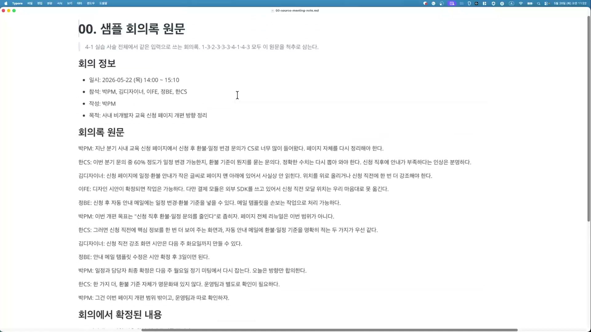
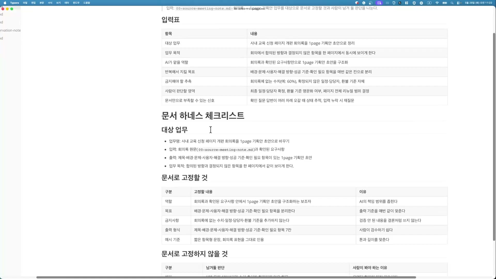
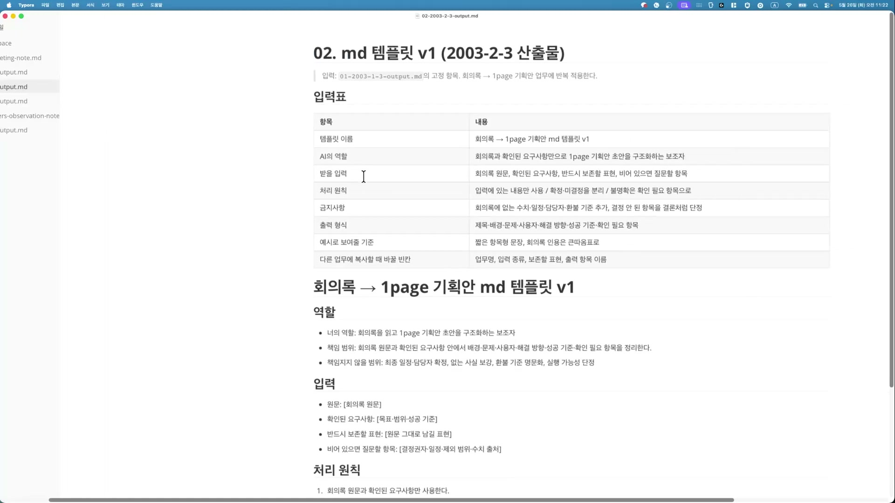
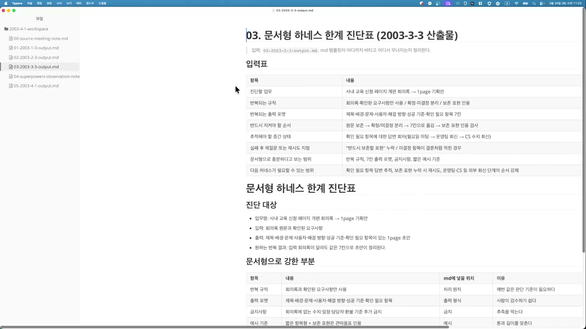
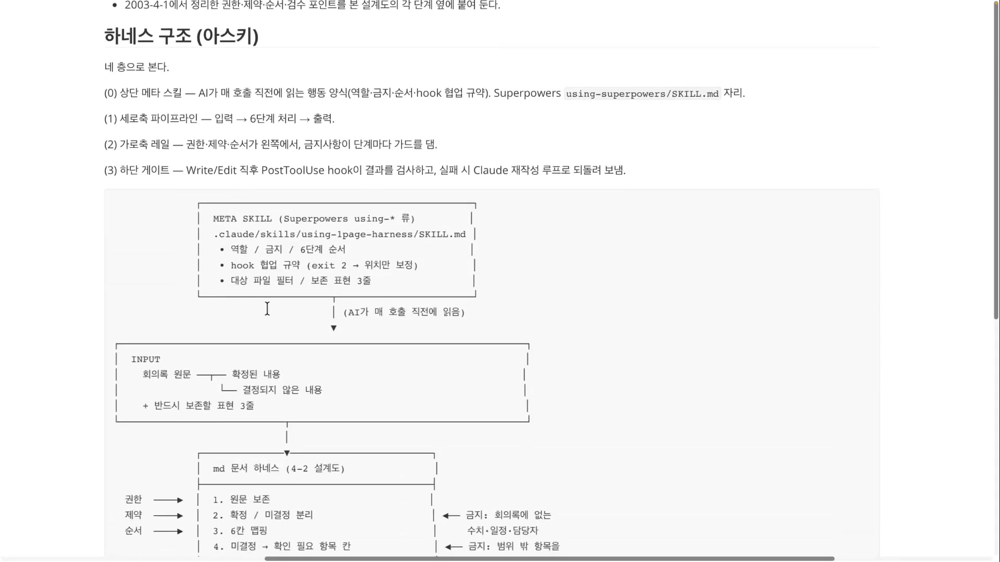
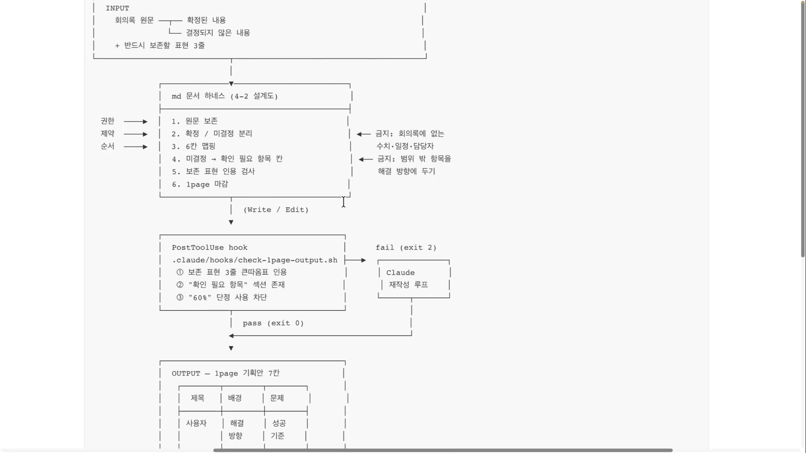
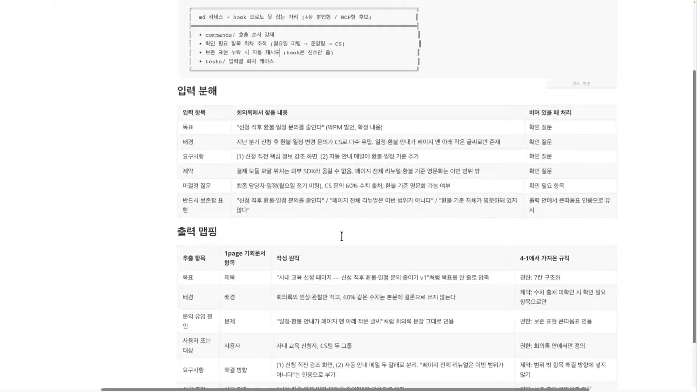
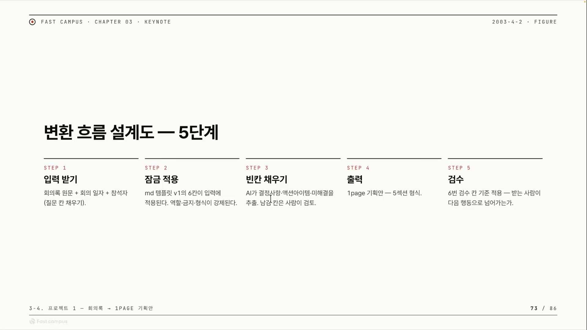

같은 일을 LLM에게 두 번 시키면, 두 번 다르게 돌아온다. 회의록을 던지고 "한 페이지 기획안으로 정리해줘"라고 하면 첫 번째 답은 그럴듯하다. 그런데 같은 프롬프트를 다음 회의록에 다시 쓰면 칸 이름이 바뀌고, 없던 수치가 결론처럼 박히고, 아직 안 정해진 일정이 확정인 양 적힌다. 이걸 드리프트(drift)라고 부른다. 모델이 매번 조금씩 다른 방향으로 새는 것이다.

문제는 "더 똑똑한 모델"로 풀리지 않는다. 똑똑해질수록 더 그럴듯하게 새기 때문이다. 풀리는 방식은 의외로 단순하다. 모델에게 매번 같은 직무기술서를 먼저 읽히는 것. 역할이 무엇이고, 무엇을 하면 안 되고, 어떤 순서로 처리하라는 규칙을 마크다운 문서 한 장에 박아두면, 그 문서가 모델의 행동을 잡아준다. 이 글은 그 문서 한 장이 어디까지 행동을 강제할 수 있고, 어디서부터는 훅과 MCP 같은 코드로 올려야 하는지를 정리한 것이다. 소재는 회의록을 1page 기획안으로 바꾸는 변환 흐름 하나지만, 진짜 주제는 "LLM에게 반복 업무를 시킬 때 어디까지 글로 버티고 언제 도구를 꺼내는가"다.

## 변환이 어려운 건 회의록이 어렵기 때문이다

먼저 변환할 원문을 보자. 사내 비개발자 교육 신청 페이지를 개편하자는 회의록 한 장이다. 박PM, 김디자이너, 이FE, 정BE, 한CS 다섯 명이 한 시간 남짓 나눈 대화가 발언 그대로 적혀 있다.



이 대화를 그냥 요약하면 안 되는 이유가 발언 곳곳에 박혀 있다.

- 한CS: "이번 분기 문의 중 60% 정도가 일정 변경 가능한지, 환불 기준이 뭔지를 묻는 문의다. **정확한 수치는 다시 뽑아 와야 한다.**"
- 박PM: "이번 개편 목표는 '신청 직후 환불·일정 문의를 줄인다'로 좁히자. **페이지 전체 리뉴얼은 이번 범위가 아니다.**"
- 이FE: "결제 모듈은 외부 SDK를 쓰고 있어서 신청 직전 모달 위치는 우리 마음대로 못 옮긴다."
- 박PM: "일정과 담당자 최종 확정은 다음 주 월요일 정기 미팅에서 다시 잡는다. 오늘은 방향만 합의한다."
- 한CS: "환불 기준 자체가 명문화돼 있지 않다. 운영팀과 별도로 확인이 필요하다."

순진한 요약기는 "문의의 60%가 일정·환불 관련"이라고 단정 지어 적는다. 발언자 본인이 "정확한 수치는 다시 뽑아 와야 한다"고 단서를 붙였는데도 그 단서를 떨어뜨린다. 일정과 담당자도 아직 안 정해졌는데 표가 비면 허전하니까 그럴듯한 날짜를 채워 넣는다. 환불 기준 명문화는 박PM이 "이번 범위 밖"이라고 못 박았는데도 해결 방향에 슬쩍 끼워 넣는다.

회의록 한 장에 함정이 이렇게 많다. 그리고 함정마다 모델이 빠지는 방식이 정해져 있다. 그렇다면 함정마다 빠지지 않게 막는 규칙도 정할 수 있다는 뜻이다. 그 규칙 모음이 바로 하네스다.

| 회의록 속 함정 | 하네스가 처리하는 방식 |
|---|---|
| "60%" 에 발언자가 직접 "정확한 수치는 다시 뽑아 와야 한다" 단서를 붙임 | 본문에 수치를 결론처럼 쓰지 않음. 확인 필요 항목으로만 남김 |
| 최종 일정·담당자가 "다음 주 월요일 미팅에서 확정" | 미결정으로 분리해 확인 필요 항목 칸으로 |
| 환불 기준 명문화 = "범위 밖, 운영팀 별도 확인" | 범위 밖 항목을 해결 방향에 넣지 않음 |
| 결제 모달 위치 = 외부 SDK라 못 옮김 | 제약으로 기록 |
| 페이지 전체 리뉴얼 = 범위 아님 | 보존 표현으로 인용하고 범위 밖 표시 |

여기서 한 가지 더. 이 회의록에는 글자 그대로 살려야 하는 표현이 셋 있다. 의역하면 의미가 미묘하게 틀어지는 문장들이라, 출력에서 큰따옴표 그대로 인용하게 강제한다.

1. "신청 직후 환불·일정 문의를 줄인다"
2. "페이지 전체 리뉴얼은 이번 범위가 아니다"
3. "환불 기준 자체가 명문화돼 있지 않다"

## 문서 한 장으로 잠그기

함정 목록이 정해졌으니 이제 그걸 모델이 매번 읽을 문서로 굳힌다. 강의는 이 과정을 세 단계 산출물로 나눠 보여준다. 점검표를 먼저 만들고, 점검표를 실제 프롬프트 템플릿으로 박고, 마지막으로 그 템플릿이 어디서 무너지는지를 진단하는 순서다.

첫 단계는 체크리스트다. "이 업무에 AI를 붙이기 전에 무엇을 문서로 고정할지"를 정하는 사전 점검표로, 역할 · 목표 · 금지사항 · 출력 형식 · 예시 기준을 한 줄씩 못 박는다.



| 구분 | 고정할 내용 | 이유 |
|---|---|---|
| 역할 | 회의록과 확인된 요구사항 안에서 1page 기획안 초안을 구조화하는 보조자 | AI의 책임 범위를 좁힌다 |
| 목표 | 배경·문제·사용자·해결 방향·성공 기준·확인 필요 항목을 분리한다 | 출력 기준을 매번 같이 맞춘다 |
| 금지사항 | 회의록에 없는 수치·일정·담당자·환불 기준을 추가하지 않는다 | 검증 안 된 내용을 결론처럼 쓰지 않는다 |
| 출력 형식 | 제목·배경·문제·사용자·해결 방향·성공 기준·확인 필요 항목 | 사람이 검수하기 쉽다 |
| 예시 기준 | 짧은 항목형 문장, 회의록 표현을 그대로 인용 | 톤과 길이를 맞춘다 |

역할 칸을 보면 "보조자"라는 말로 책임 범위를 의도적으로 좁혀 둔다. 모델이 회의를 주도해 새 결정을 내리는 게 아니라, 이미 모인 발언을 칸에 나눠 담기만 하라는 뜻이다. 권한을 좁히는 것이 드리프트를 막는 첫 수다.

이 점검표의 "고정할 내용"을 실제 프롬프트 본문으로 옮긴 것이 md 템플릿 v1이다. 회의록을 줄 때마다 앞에 붙이는, 재사용 가능한 지시문 한 장이다.



템플릿 본문은 네 덩어리로 나뉜다. 각 덩어리가 모델의 행동을 한 겹씩 잡는다.

#### 역할

이 칸은 모델이 할 일과 안 할 일을 가른다. "책임지지 않을 범위"를 명시적으로 적어 둔 게 핵심인데, 최종 일정과 담당자 확정, 없는 사실 보강, 환불 기준 명문화, 실행 가능성 단정이 거기 들어간다. 모델이 알아서 채우고 싶어 하는 칸들을 미리 "네 일이 아니다"라고 못 박는 것이다.

#### 입력

이 칸은 받을 재료를 정한다. 회의록 원문, 확인된 요구사항, 반드시 보존할 표현, 그리고 "비어 있으면 질문할 항목"이다. 마지막 항목은 결정권자가 안 보이거나, 일정이 "다음 미팅에서 확정"으로만 있거나, 수치에 "다시 뽑아 와야 한다" 단서가 붙으면 채우지 말고 질문으로 남기라는 조건을 미리 깔아둔다.

#### 처리 원칙

순서를 정한다. 회의록과 확인된 요구사항만 쓴다, 확정과 미결정을 먼저 가른다, 불확실한 건 결론이 아니라 확인 필요 항목으로 남긴다, 보존 표현은 인용 부호로 유지한다.

#### 금지

이 칸은 처리 원칙의 그림자다. 회의록에 없는 수치, 일정, 담당자를 추가하지 않는다. 이 금지가 곧 앞에서 본 함정 목록의 방어선이다.

세 번째 산출물은 한계 진단표다. 앞의 템플릿이 "어디까지 버티고 어디서 무너지는지"를 정리한 표로, 이게 다음 장의 핵심 통찰로 이어지는 다리다.



진단표에서 가장 중요한 칸은 두 개다. "문서형으로 충분한 범위"에는 반복 규칙, 고정 출력 포맷, 금지사항, 짧은 예시 기준이 들어간다. "다음 하네스가 필요한 범위"에는 확인 필요 항목의 답변 추적, 보존 표현 누락 시 재시도, 운영팀·CS 외부 회신 순서 강제가 들어간다.

여기서 말하는 "강한 부분, 약한 부분"은 이 회의록 사례의 강약이 아니라 **마크다운 문서 하네스라는 방식 자체**의 강약이다. 매번 같아야 하는 것(규칙·포맷·금지선)에는 강하고, 흐름과 상태가 있는 것(회차 추적·재시도·외부 연결)에는 약하다. 이 경계가 이 글 전체의 척추다. (참고로 진단표의 "약한 부분" 표 본문은 강의 화면에서 스크롤 밖으로 잘려 다 보이지 않는다. 다만 위 "다음 하네스가 필요한 범위"가 그 요약 역할을 한다.)

## 조각들을 하나의 흐름으로

체크리스트, 템플릿, 한계표는 따로 놓고 보면 흩어진 종이 세 장이다. 변환 흐름 설계도는 이 조각들을 하나의 파이프라인으로 조립한다. 강의에서 이 부분이 클라이맥스다. 강사 표현으로 "텍스트가 많아 바로 그리기 어려워서 ASCII로 뽑아봤다"는 그 도식이다.



도식은 위에서 아래로 네 층이다.

#### 0층 META SKILL

맨 위 박스다. AI가 매 호출 직전에 읽는 행동 양식 파일로, 역할, 금지, 6단계 순서, hook 협업 규약, 보존 표현 3줄을 담는다. 사람이 매번 규칙을 붙여 주는 게 아니라, 세션이 열릴 때 이 파일이 컨텍스트에 먼저 깔린다. 위 도식의 화살표 옆에 "AI가 매 호출 직전에 읽음"이라고 적힌 그 자리다.

#### 1층 INPUT

회의록 원문을 받자마자 확정된 내용과 결정되지 않은 내용으로 가른다. 여기에 보존 표현 3줄을 함께 넘긴다. 변환의 첫 동작이 "분류"라는 점이 중요하다. 정리하기 전에 먼저 무엇이 정해졌고 무엇이 안 정해졌는지부터 가른다.

#### 2층 md 문서 하네스

변환의 본체다. 1번부터 6번까지 순서가 곧 강제다.



| 단계 | 라벨 | 하는 일 |
|---|---|---|
| 1 | 원문 보존 | 회의록 표현을 임의로 바꾸지 않음 |
| 2 | 확정 / 미결정 분리 | 합의된 것과 안 된 것을 먼저 가름 |
| 3 | 칸 맵핑 | 추출 항목을 출력 칸에 대응 |
| 4 | 미결정 → 확인 필요 항목 칸 | 안 정해진 건 결론이 아니라 질문으로 |
| 5 | 보존 표현 인용 검사 | 3줄이 큰따옴표로 살아있는지 |
| 6 | 1page 마감 | 한 페이지에 들어가게 닫음 |

이 6단계 박스 양옆에 레일이 붙는다. 왼쪽에서 권한·제약·순서가 각 단계가 따라야 할 규칙을 대고, 오른쪽에서 금지 두 종이 가드를 댄다. 오른쪽 금지는 "회의록에 없는 수치·일정·담당자 추가 금지"와 "범위 밖 항목을 해결 방향에 두기 금지"다. 6단계가 앞으로 나아가는 세로축 파이프라인이라면, 양옆 레일은 그 진행이 옆으로 새지 않게 막는 가로축 가드레일이다.

#### 3층 PostToolUse hook

Write나 Edit로 결과가 나온 직후 자동으로 도는 검사기다. 셋을 본다. 보존 표현 3줄이 큰따옴표로 살아있는가, "확인 필요 항목" 섹션이 존재하는가, "60%" 같은 미확인 수치를 단정으로 쓰지 않았는가. 검사를 통과하면(exit 0) 출력으로 진행하고, 실패하면(exit 2) Claude를 재작성 루프로 되돌린다.

#### 4층 OUTPUT

1page 기획안이 나온다. 칸은 제목, 배경, 문제, 사용자, 해결 방향, 성공 기준, 확인 필요 항목 일곱이다.

여기서 칸 수에 관해 한 가지 짚어둘 게 있다. 강의 자료마다 출력 칸 수를 다르게 부른다. 체크리스트와 템플릿 본문은 7칸이라 하고, ASCII 설계도 2층 라벨은 "6칸 맵핑"이라 적고, 마무리 슬라이드는 "5섹션"이라 부른다. 이건 추출 오류가 아니라 원본 자체의 흔들림이다. 확인 필요 항목을 따로 처리하면 맵핑은 6칸으로 세고, 표지를 묶으면 5섹션으로 세는 식의 셈 차이다. 기본은 위 일곱 칸으로 두되, 강의가 6칸이나 5섹션으로도 부른다는 것 정도로 기억하면 된다.

## 문서로 안 되는 건 훅이 잡는다

설계도에는 박스가 두 개 더 있다. 둘 다 훅이다. 문서가 "써 둔 규칙"이라면, 훅은 "특정 타이밍에 자동으로 끼어드는 코드"다. 마크다운은 모델에게 부탁할 뿐 실행을 강제하지 못한다. 그 실행 강제를 훅이 메운다.

**SessionStart 훅**은 설계도 0층, 그 META SKILL 박스를 실제로 주입하는 장치다. 세션이 열릴 때 `using-1page-harness/SKILL.md`를 컨텍스트에 자동으로 밀어 넣는다. 강사 표현으로 "메타 스킬을 훅 기반으로 세션이 열렸을 때 주입시키는 형태"다. 이게 되면 모델이 일을 시작하기 전부터 행동 양식이 항상 먼저 깔려 있다. 사람이 매번 "회의록에 없는 사실은 만들지 마"라고 붙일 필요가 없어진다.

**PostToolUse 훅**은 설계도 3층의 그 검증 게이트다. Write나 Edit가 문서를 수정한 직후 검사기를 호출해 제대로 됐는지 한 번 더 확인하고, 안 되면 재작성 루프로 돌린다. 여기에 META SKILL과의 협업 규약이 하나 걸려 있다. "exit 2면 위치만 보정"이다. 훅이 막았을 때 모델은 글 전체를 새로 쓰는 게 아니라 지적된 위치만 고친다. 검사기가 실패 신호를 주면, 그 신호를 어떻게 받을지를 문서 쪽에 미리 적어 둔 것이다.

그런데 문서로도 훅으로도 못 잡는 자리가 있다. 설계도는 이걸 별도 박스로 명시한다. "md 하네스 + hook으로도 못 잡는 자리 (4장 분업형 / MCP형 후보)".



| 못 잡는 자리 | 왜 문서·훅으로 안 되나 |
|---|---|
| commands 호출 순서 강제 | 마크다운은 순서를 권고만 할 뿐 실행을 강제 못 함 |
| 확인 필요 항목 회차 추적 (월요일 미팅 → 운영팀 → CS) | 여러 번 오가는 상태를 문서가 들고 있지 못함 |
| 보존 표현 누락 시 자동 재시도 | 훅은 신호(exit 2)만 줌. 자동 반복 실행은 못 함 |
| tests 입력별 회귀 케이스 | 여러 입력에 대한 반복 검증은 문서 밖 |

회차 추적을 보자. 이 회의록의 미결정 항목들은 한 번에 안 끝난다. 일정은 월요일 미팅에서 잡히고, 환불 기준은 운영팀 회신을 기다려야 하고, 60% 수치는 CS가 다시 뽑아 와야 한다. 답이 여러 번에 걸쳐 오간다. 그런데 마크다운 문서는 상태를 들고 있지 못한다. 매번 새 세션이라 "지난번에 운영팀 답이 왔다"는 사실을 기억하지 못한다. 이건 상태를 저장하는 코드, 즉 MCP나 분업형으로 올려야 하는 일이다.

정리하면 책임이 3단으로 쌓인다.

```
문서(md 하네스)  →  매번 같아야 하는 것: 역할·금지·고정 포맷·순서 권고·검수 기준
   ↓ 못 잡으면
훅(hooks)        →  타이밍 개입: 시작 시 규칙 주입(SessionStart) · 출력 후 검증(PostToolUse)
   ↓ 그래도 못 잡으면
MCP/분업형       →  상태·반복·외부연결: 호출순서 강제·회차 추적·자동 재시도·외부 팀 기록
```

이 3단 계층이 이 글에서 가장 멀리 가는 통찰이다. "LLM 자동화를 어디까지 마크다운으로 버티고, 언제 코드와 도구로 올릴 것인가"라는 질문의 구체적인 답이다. 회의록은 그 답을 보여주는 예시일 뿐이다. 매번 똑같이 적용되는 규칙은 문서로 충분하다. 타이밍을 잡아야 하면 훅으로 올린다. 상태를 들고 있어야 하거나 외부와 반복해서 주고받아야 하면 그제서야 MCP를 꺼낸다. 순서를 거꾸로 밟아 처음부터 MCP로 짜면 과한 엔지니어링이 되고, 끝까지 문서로 버티면 회차 추적에서 무너진다.

## 좋은 변환은 칸을 채우는 게 아니다

강사가 클립을 닫으며 같은 흐름을 다섯 단계로 압축한다. 입력 받기, 잠금 적용, 빈칸 채우기, 출력, 검수.



이 5단계에서 마지막 칸이 가장 실무적이다. 검수의 기준이 "받는 사람이 다음 행동으로 넘어가는가"다. 출력의 품질을 형식 충족으로 정의하지 않는다. 칸이 다 찼는지, 줄 수가 맞는지가 아니라, 이 기획안을 받은 임원이 이걸 읽고 다음 결정을 내릴 수 있는지로 정의한다.

이 기준이 앞의 모든 규칙을 다시 설명해 준다. 60% 수치를 단정 짓지 않고 확인 필요 항목으로 남기는 이유는, 받는 사람이 그 숫자를 믿고 잘못된 결정을 내리지 않게 하기 위해서다. 미결정 일정을 결론처럼 적지 않는 이유도, 받는 사람이 "이건 아직 안 정해졌으니 월요일에 확인하자"로 넘어가게 하기 위해서다. 칸을 그럴듯하게 채우는 변환은 받는 사람을 멈춰 세운다. 무엇이 확정이고 무엇이 미정인지 구분이 안 되니까. 좋은 변환은 받는 사람을 다음 결정으로 넘긴다.

그래서 마크다운 한 장은 LLM의 직무기술서다. 역할과 금지와 순서를 문서에 박으면 행동이 고정되고, 문서가 못 잡는 상태와 반복은 훅과 MCP로 올린다. 그 경계를 가르는 감각, 그리고 출력을 "수신자가 움직이는가"로 판정하는 기준. 회의록을 기획안으로 바꾸는 작은 실습이 결국 가리키는 건 이 두 가지다.
