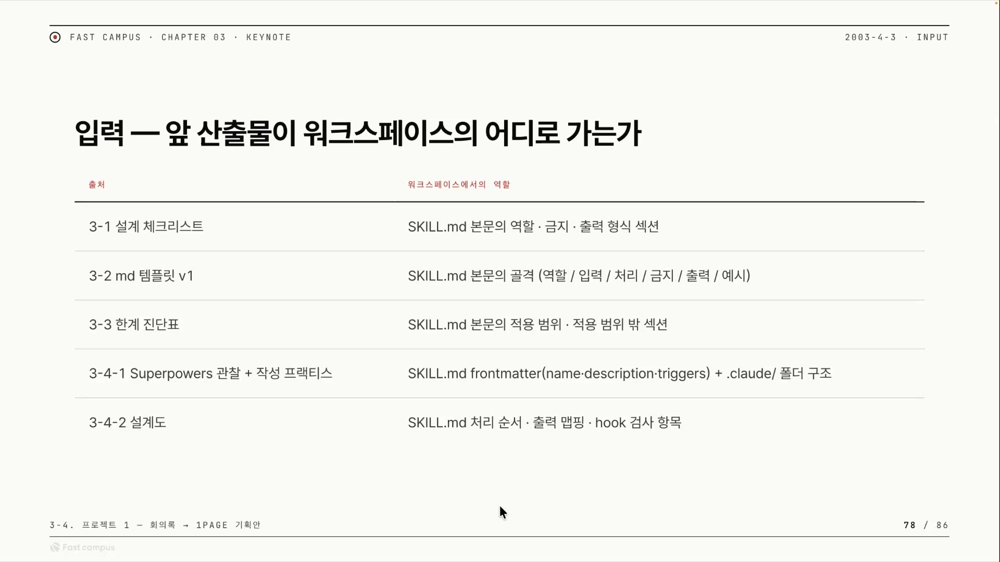
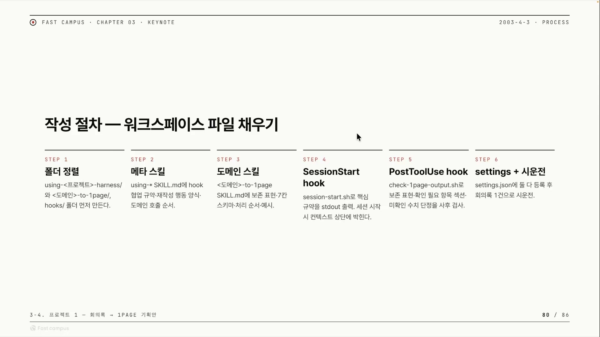
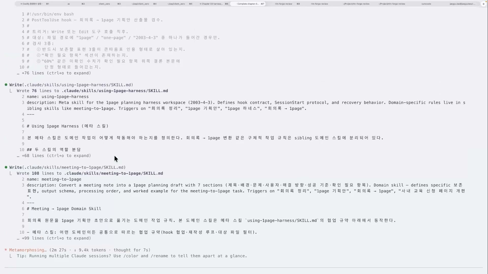
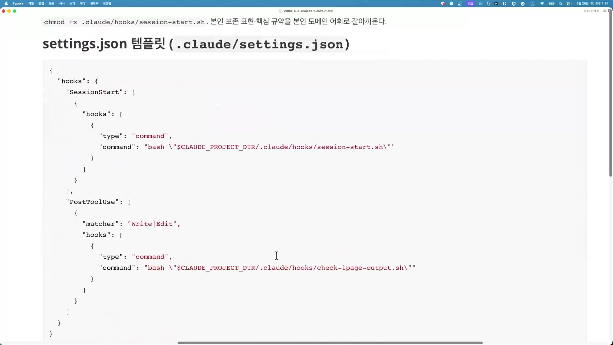
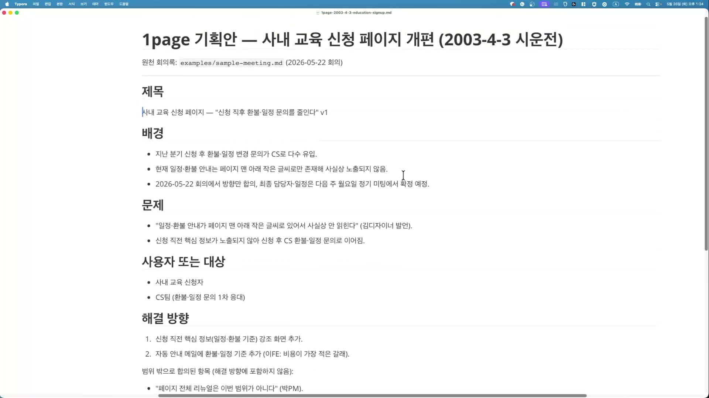
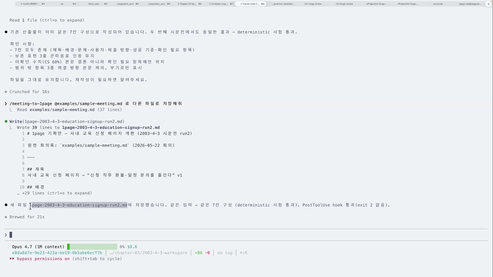
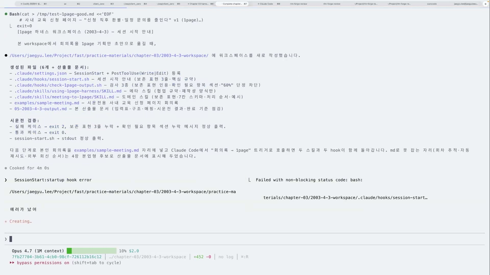
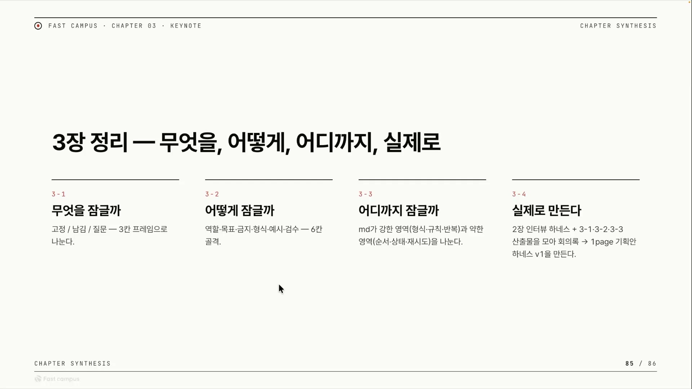

같은 회의록을 두 번 던지면, 같은 모양의 기획문서가 두 번 나온다. 이 한 줄이 이번에 만든 것의 전부다.

회의가 끝나면 누군가는 노트를 정리해 한 장짜리 기획문서로 옮긴다. 제목을 뽑고, 배경을 적고, 무엇이 문제이고 누구를 위한 일인지 정리한다. 사람이 하면 매번 조금씩 달라진다. 어떤 날은 일곱 칸 중 하나를 빠뜨리고, 어떤 날은 회의에서 나오지도 않은 숫자를 결론에 슬쩍 적는다. 이 작업을 AI에게 맡기면 흔들림은 더 커진다. 같은 입력을 줘도 LLM은 매번 형식과 내용이 미묘하게 달라지기 때문이다.

이 강의는 그 흔들림을 구조로 가두는 실습이다. Claude Code의 훅(hook) 2개와 스킬(skill) 2개를 한 폴더에 엮어, "회의록을 던지면 7칸짜리 1페이지 기획문서가 매번 같은 형식으로 나오는" 장치를 직접 만든다. 이런 장치를 하네스(harness)라고 부른다.

강사의 비유가 정확하다. LLM은 본래 "정말 랜덤 확률 그 자체"인 야생마다. 여기에 하네스(마구)를 입혀 길들인다. 야생마를 죽이는 게 아니라, 가고 싶은 방향으로만 가도록 고삐를 쥐는 것이다. 그래서 결과물의 모양이 흔들리지 않는다.

먼저 짚어둘 게 하나 있다. 강의 파일명과 모듈 라벨은 "Chapter 4"로 붙어 있지만, 슬라이드와 강사의 말은 전부 3장 기준이다. 강사 본인이 "챕터 3가 끝나게 되었어요"라고 말하고 끝에서 "다음 챕터는 4장"을 예고한다. 그러니까 이 글에서 만드는 하네스는 3장(마크다운 하네스)을 마무리하는 프로젝트 실습이고, 분업형 하네스는 다음 단계 예고다.

## 하네스란 무엇인가

강사의 정의를 그대로 옮기면, 하네스는 "각각의 작업을 결정적으로(디터미니스틱하게) AI에게 위임할 수 있게 만드는 구조"다. 풀어 쓰면 이렇다. 직접 타이핑하던 시대가 지나고 AI에게 시키는 시대가 됐으니, 이제 중요한 건 "무엇을 어떤 순서로 시킬지의 구조"다. 그 구조를 머릿속에 잘 넣고 AI에게 잘 설명하면 하네스는 의외로 쉽게 만들어진다.

하네스를 이루는 부품은 두 가지다. 무엇을 할지 정의하는 스킬, 그리고 언제 어떻게 강제할지 통제하는 훅. 스킬만 있으면 "지켜주길 바라는" 수준에 머문다. 훅이 붙어야 "안 지키면 막는" 강제가 된다. 마크다운(스킬)으로 안 되는 통제를 코드(훅)로 보강하는 셈이다.

여기서 핵심 단어인 "결정성"을 정확히 짚고 가야 한다. 강사는 결정성과 멱등성을 거의 같은 뜻으로 쓰는데, 둘 다 한 문장으로 풀면 <strong>"같은 입력을 넣으면 같은 형식의 결과가 나온다"</strong>는 뜻이다. 주의할 점은, 이게 토큰 단위로 글자까지 똑같다는 말이 아니라는 것이다. 강사도 "파일이 길거나 컨텍스트가 길어지면 조금 더 달라질 수는 있다"고 인정한다. 하네스가 실제로 보장하는 건 출력의 모양이다. 7칸 구성, 보존해야 할 표현, 검수 통과 여부, 이 모양이 흔들리지 않는다. 글자가 아니라 모양을 고정한다는 것이 이 강의가 진짜 말하고 싶은 한 가지다.

> [학습 지식] 엄밀히는 멱등성(같은 입력을 여러 번 적용해도 결과가 같음)과 결정성(같은 입력이면 항상 같은 출력)은 다른 개념이다. 이 강의의 실험("같은 회의록 두 번 넣어 같은 형식")은 멱등성에 가깝다. 강의 자체는 둘을 구분하지 않고 "결정적으로 만든다"는 큰 그림만 전한다.

## 폴더 하나가 곧 하네스다

하네스의 실체는 폴더 하나다. Claude Code는 작업 폴더 안의 `.claude/`를 자동으로 읽기 때문에, 그 폴더에 들어가서 Claude를 켜는 것만으로 하네스가 작동한다. 거꾸로 말하면, 그 폴더 밖에서 켜면 아무 일도 일어나지 않는다. 데모 중에 강사가 "워크스페이스에 들어가야지만 내부의 닷클로드가 동작한다"고 거듭 강조한 이유가 이것이다.

폴더 안에는 파일 6개와 산출물 문서가 들어간다.

```
2003-4-3-workspace/
├── .claude/
│   ├── settings.json                  훅 2개를 Claude Code에 등록
│   ├── hooks/
│   │   ├── session-start.sh           세션 시작 시 규약을 컨텍스트에 주입 (사전 안내)
│   │   └── check-1page-output.sh      Write/Edit 직후 산출물 검사 (사후 검수)
│   └── skills/
│       ├── using-1page-harness/SKILL.md   메타 스킬: 협업 규약·재작성 양식·도메인 호출 순서
│       └── meeting-to-1page/SKILL.md      도메인 스킬: 보존 표현·7칸 스키마·처리 순서·예시
├── examples/
│   └── sample-meeting.md              시운전용 샘플 회의록
└── 05-2003-4-3-output.md              이 워크스페이스 자체를 설명하는 산출물 문서
```

한 번 실행되면 이 부품들이 세 지점에서 출력을 가둔다. 세션을 켜는 순간 SessionStart 훅이 규약을 컨텍스트 맨 위에 박는다(사전). 사용자가 트리거를 말하면 메타 스킬과 도메인 스킬이 변환을 수행한다(도중). Claude가 결과 파일을 쓰는 순간 PostToolUse 훅이 산출물을 검사한다(사후). 사전, 도중, 사후. 이 3단 구조가 아키텍처의 골자다.

한 가지 더 눈여겨볼 점은, 이 워크스페이스가 무에서 만들어진 게 아니라는 것이다. 3장에서 만든 부품들이 자리를 옮겨 들어왔다. 설계 체크리스트는 SKILL.md의 역할·금지·출력 형식 섹션이 되고, md 템플릿은 SKILL.md의 골격이 되고, 한계 진단표는 적용 범위 섹션이 된다.



하네스는 갑자기 짜는 게 아니라, 앞서 만든 설계 부품들을 한 폴더에 조립하는 일이다.

## 만드는 순서, 여섯 스텝

작성은 여섯 스텝으로 진행된다.



폴더를 먼저 정렬하고, 메타 스킬을 쓰고, 도메인 스킬을 쓰고, SessionStart 훅과 PostToolUse 훅을 만들고, 마지막으로 settings.json에 훅 둘을 등록한 뒤 회의록 한 건으로 시운전한다. 강의에서는 이 6스텝을 실습자료(워크스페이스 골격)에 미리 담아 와서, Claude에게 "옮기지 말고 새로 만들어 달라"고 시키며 라이브로 채워 나간다.

## 스킬을 둘로 가른 이유

스킬이 하나면 될 것 같은데 왜 둘일까. 핵심은 관심사를 나누는 데 있다. 메타 스킬은 "어떤 도메인이든 공통으로 지킬 규약"을 담고, 도메인 스킬은 "이 업무에서만 쓸 변환 규칙"을 담는다.

메타 스킬 `using-1page-harness`의 본문 첫 줄이 이 분리를 정확히 선언한다. "본 메타 스킬은 도메인 작업이 어떻게 작동해야 하는지를 정의한다. 회의록을 1page로 바꾸는 구체적 규칙은 sibling 도메인 스킬에 분리되어 있다." 메타가 담는 건 훅과 어떻게 손발을 맞출지(협업 규약), 검수에 걸렸을 때 어떻게 다시 쓸지(재작성 양식), 어떤 도메인 스킬을 언제 부를지(호출 순서)다.

도메인 스킬 `meeting-to-1page`는 실제 업무 지식을 담는다. 보존해야 할 표현, 7칸 스키마, 처리 순서, 그리고 예시. 곧 "이 회의록을 실제로 어떻게 변환하나"의 전부다.



이렇게 나눠 두면 도메인이 바뀌어도 메타는 그대로 둔 채 도메인만 갈아끼울 수 있다. "회의록을 1page로" 대신 "면접 기록을 평가서로", "버그 리포트를 재현 노트로" 같은 다른 반복 업무를 만들 때, 협업 규약을 다시 쓸 필요가 없다는 뜻이다. 두 스킬의 트리거 단어가 같은 것("회의록 정리", "1page 기획안" 등)도 의도된 설계다. 사용자가 한 마디 하면 메타와 도메인이 함께 깨어난다.

이 메타/도메인 분리는 강사가 즉흥으로 만든 게 아니다. Superpowers라는 스킬 프레임워크의 검증된 패턴을 자기 업무에 이식한 것이다.

> [학습 지식] Superpowers는 Claude Code용 스킬 프레임워크로, 대화 시작마다 도는 디스패처 스킬 `using-superpowers`를 둔다. 메타 스킬이 다른 스킬을 오케스트레이션하는 구조다. 이 강의의 `using-1page-harness`가 바로 그 발상을 자기 도메인에 적용한 것이다. 강사가 "using-superpowers 했던 것처럼"이라고 짧게 언급하고 넘어간 게 이 연결고리다.

## 훅 둘, 시작 전 브리핑과 출력 후 검수

훅은 Claude Code가 특정 시점에 자동으로 실행하는 셸 스크립트다. 강사가 직접 부르지 않아도, "세션이 시작될 때"나 "도구를 쓴 직후" 같은 순간에 Claude Code가 알아서 돌린다. 이 강의는 두 시점을 쓴다.

어느 시점에 어떤 스크립트를 돌릴지는 `settings.json`에서 선언한다.



읽는 법은 단순하다. `SessionStart`와 `PostToolUse`는 언제 돌릴지(시점)를 정한다. `matcher: "Write|Edit"`는 PostToolUse를 파일을 쓰는 도구(Write·Edit) 직후에만 돌리라는 필터다. `command`는 돌릴 스크립트인데, `$CLAUDE_PROJECT_DIR`는 Claude Code가 채워주는 변수로 `.claude`가 있는 프로젝트 루트의 절대경로를 가리킨다. 이 변수를 잘못 쓰면 경로가 깨지는데, 실제로 데모 중에 그 일이 터진다(뒤에서 본다).

**SessionStart 훅은 시작 전 브리핑이다.** 세션이 시작되거나 `/clear` 직후에 돌면서, 핵심 규약과 보존 표현을 stdout으로 출력한다. 그 출력이 세션 컨텍스트 맨 위에 박힌다. 효과는 분명하다. 사용자가 아무 말도 하지 않아도, Claude가 처음부터 "나는 이 워크스페이스에서 회의록을 1page로 옮기는 역할이고, 이런 규약을 지켜야 한다"를 알고 시작한다. 데모에서 강사가 "지금 너는 무슨 역할을 하고 있어?"라고 물으니, 메타 스킬이 주입돼 있어 Claude가 자기 역할을 바로 답한다.

**PostToolUse 훅은 출력 후 검수다.** Write/Edit로 파일을 쓴 직후에 돌면서 산출물을 검사한다. 단, 파일 경로에 `1page`·`one-page`·`2003-4-3` 중 하나가 들어간 산출물만 본다. 엉뚱한 파일은 건드리지 않도록 이름이 곧 검사 대상 필터다. 검사는 세 가지다.

1. 반드시 보존할 표현 3줄이 큰따옴표 인용으로 살아 있는가. (회의 원문 발언을 AI가 멋대로 바꾸지 못하게)
2. "확인 필요 항목" 섹션이 존재하는가. (미결정 사항을 결론에 섞지 말고 따로 모았는가)
3. "60%" 같은 미확인 수치가 결론 본문에 단정 형태로 들어갔는가. (회의록에 근거 없는 숫자를 사실처럼 쓰면 막는다)

판정은 통과면 exit 0, 위반이면 exit 2다. exit 2는 단순한 실패가 아니다.

> [학습 지식] Claude Code의 PostToolUse 훅은 exit code 2일 때 차단(blocking)으로 동작해, 사유 메시지를 Claude에게 되돌려준다. 그래서 훅이 "이 줄이 빠졌다"고 말하면 Claude가 그걸 읽고 스스로 고쳐 다시 Write한다. 검수가 곧 자동 수정 루프가 되는 것이다.

두 훅은 깔끔하게 대칭을 이룬다. SessionStart는 시작 전에 규약을 넣어주고(입력), PostToolUse는 출력 직후 결과를 검사한다(출력). 하나는 작업 전 브리핑, 하나는 작업 후 검수. 마크다운(스킬)만으로는 "지켜주길 바라는" 수준이라, 훅(코드)이 들어가야 비로소 강제가 된다.

## 회의록 한 장이 1페이지가 되기까지

이론은 여기까지다. 실제 입력과 출력을 보면 하네스가 무슨 일을 하는지가 또렷해진다.

입력은 평범한 회의록이다. "사내 교육 신청 페이지 개편" 회의록으로, 일시와 참석자, 목적, 발언 기록이 담겨 있다. 신청 직후 환불·일정 변경 문의가 CS에 다수 유입돼 페이지를 개편하기로 한 회의다. 이 안에는 세 종류가 뒤섞여 있다. 확정된 것(개편 방향), 미결정인 것(최종 담당자·일정), 그리고 근거 없는 수치(나중에 등장하는 "CS 60%"). 하네스가 할 일은 이 셋을 깔끔하게 가르는 것이다.

워크스페이스 폴더에서 Claude Code를 켜고(SessionStart 훅이 먼저 돈다), 회의록을 물려 트리거를 말하면, Claude가 변환을 수행한다. 결과는 7칸짜리 한 장이다.



7칸은 제목, 배경, 문제, 사용자(또는 대상), 해결 방향, 성공 기준, 확인 필요 항목이다. 이 7칸이 도메인 스킬이 강제하는 "출력의 모양"이고, PostToolUse 훅이 마지막 칸("확인 필요 항목")의 존재를 검사한다.

이 산출물을 뜯어보면 하네스가 실제로 한 일이 눈에 보인다. AI가 회의록을 요약할 때 흔히 저지르는 실수를 구조로 막은 사례다.

첫째, 발언을 큰따옴표로 살린다. 박PM과 김디자이너의 말이 AI 말투로 뭉개지지 않고 원문 그대로 들어간다.

- `"오늘은 방향만 합의한다. 최종 담당자·일정은 다음 주 월요일 정기 미팅에서 확정한다."`
- `"일정·환불 안내가 페이지 맨 아래 작은 글씨로 있어서 사실상 안 읽힌다."`
- `"페이지 전체 리뉴얼은 이번 범위가 아니다."`

이 3줄이 "반드시 보존할 표현 3줄"의 실체이고, PostToolUse 검사 1번이 이게 살아 있는지 본다.

둘째, 확정과 미결정을 가른다. "방향만 합의 / 담당자·일정은 다음 주 확정"을 결론에 섞지 않고 배경과 확인 필요 항목으로 분리한다.

셋째, 근거 없는 수치를 결론에 못 박지 않는다. "CS 문의 60%" 같은 미확인 수치는 결론 본문이 아니라 확인 필요 항목에만 둔다. 회의록에 없는 숫자를 사실처럼 단정하면 PostToolUse 검사 3번이 막는다.

발언을 왜곡하고, 미결정을 단정하고, 없는 숫자를 지어내는 것. AI가 회의록을 다룰 때 가장 자주 미끄러지는 이 세 지점을 스킬이 규칙으로 적고 훅이 사후에 잡아낸다.

## 두 번 넣어도 같은가

하네스가 흔들리지 않는다는 걸 어떻게 증명할까. 방법은 단순하다. 같은 회의록을 다시 넣어, 출력 칸 구성이 첫 번째와 같은지 본다.



두 번째 실행에서 Claude가 내린 판정은 이렇다. "기존 산출물이 이미 같은 7칸 구성으로 작성되어 있습니다. 두 번째 시운전에서도 동일한 결과, deterministic 시험 통과." Claude는 스스로 네 가지를 점검했다. 7칸이 모두 있는지, 보존 표현 3줄이 큰따옴표로 살아 있는지. 미확인 수치인 CS 60%가 결론 본문이 아니라 확인 필요 항목에만 있는지, 그리고 범위 밖 항목이 해결 방향에서 빠지고 부기로만 남았는지까지 훑었다. 그리고 결과를 `1page-2003-4-3-education-signup-run2.md`라는 별도 파일로 저장했다. run1과 run2 두 파일이 같은 7칸 구조라는 것, 이게 멱등성의 증거다.

다시 강조하면, 통과의 의미는 "칸 구성·보존 표현·검수 규칙이 동일하다"이지 "토큰까지 똑같다"가 아니다. 그래도 형식이 깨지지 않고, 설령 깨져도 PostToolUse 훅이 막는다.

실제로 데모 중 한 번은 출력이 망가져 훅이 실패(exit 2)했다. 원인은 마침표 같은 사소한 형식이었다. 강사 표현으로 "정확히 고정을 해야 되는데 마침표를 적어서 검수가 됐다." 형식이 흐트러지자 훅이 곧바로 잡아내 되돌려보냈다는 뜻이다. 검수가 말뿐이 아니라 실제로 막아준다는 걸 보여주는 장면이다. "같은 출력을 받기 위해 PostToolUse 훅을 쓴다"는 게 이 순간 작동한다.

## 만들다 부딪히는 진짜 함정

이 강의가 신뢰를 주는 지점은 실패를 숨기지 않는다는 데 있다. 워크스페이스를 켜자마자 SessionStart 훅이 에러를 뱉었다.



에러 메시지의 경로를 보면 `practice-materials/chapter-03/2003-4-3-workspace/`가 두 번 들어가 있다. 그래서 실제 스크립트 파일을 못 찾았다. 원인은 `$CLAUDE_PROJECT_DIR`를 잘못 이해한 것이었다. 이 변수는 이미 `.claude`가 있는 워크스페이스 루트의 절대경로를 가리킨다. 그런데 AI가 그 변수 뒤에 워크스페이스 경로를 한 번 더 붙여서, 루트에 루트를 더한 꼴이 됐다. 고치는 법은 간단하다. 변수 뒤에는 `.claude/hooks/...`만 붙인다.

강사는 이 원인을 "컨텍스트 컨태미네이션(context contamination)"이라 불렀다. AI가 워크스페이스를 만드는 동안 상위 경로 정보가 컨텍스트에 남아 있다 보니, `$CLAUDE_PROJECT_DIR`가 이미 그걸 포함한다는 걸 무시하고 경로 조각을 그대로 끌어다 중복 삽입한 실수라는 진단이다. 엄밀히는 "경로 중복" 버그이고, "컨텍스트 오염"은 그 근본 원인에 강사가 붙인 이름이다. 수정하고 다시 켜니 훅은 문제없이 돌았다.

여기서 얻을 교훈은 셋이다. 하네스도 한 번에 안 된다. AI가 짠 설정조차 경로 한 줄에서 깨지므로, 만들고 켜 보고 고치는 루프가 정상이다. 그리고 `$CLAUDE_PROJECT_DIR` 같은 변수가 "이미 무엇을 가리키는지"를 알아야 한다. 절대경로 변수에 또 같은 경로를 붙이면 중복된다. 마지막으로, 에러 메시지의 경로를 그대로 읽으면 답이 보인다. 중복된 경로가 화면에 그대로 찍혀 있어서, 강사는 보자마자 원인을 짚었다.

## 여기까지, 그리고 다음

마크다운과 셸 훅만으로 간단한 반복 업무(회의록을 1page로)를 결정적으로 자동화하는 데까지 왔다. 강사 표현으로 "LLM이 변주가 있는 상황에서도 훅·메타 스킬·스킬로 어느 정도 좁혀(narrow down) 본" 경험이다.

이제 이 폴더 안에 들어오면, 매번 프롬프트를 새로 쓰고 템플릿을 손으로 채울 필요 없이 같은 모양의 결과가 나온다. 강사가 정리한 한 문장이 이 강의의 핵심을 담는다. 소프트웨어 엔지니어링의 본질이 "에러가 터지고 그걸 어떻게 동작하게 만드느냐"라면, AI를 다루는 하네스 엔지니어링도 똑같다. 똑같은 움직임이 나오게 하고, 그게 오차범위 안에 들어오게 만든다. 그래서 훅을 넣어 검수하고 세션을 넣어 같은 출발선에 세운다. 이것이 하네스 엔지니어링이다.

이 골격은 Claude에만 묶이지 않는다. 마크다운과 훅 기반이라, 코덱스 같은 다른 프로바이더에서도 같은 하네스를 만들 수 있다(특정 호출 방식의 제약은 있다). 특정 도구에 종속된 기법이 아니라 패턴이라는 뜻이다.

물론 마크다운과 훅으로 닿지 못하는 곳이 있다. 여러 회의록에 걸친 답변 추적, 자동 재시도 횟수 제어, 메일 발송 같은 외부 회신, 입력별 회귀 케이스. 공통점은 이들이 "형식·규칙·반복"이 아니라 "순서와 상태, 재시도, 외부 연동"의 문제라는 것이다. 마크다운 스킬과 단발 훅으로는 잡기 어렵다. 이 빈자리를 메우는 게 다음 단계의 분업형 하네스(여러 단계로 나눔)와 MCP형 하네스(외부 시스템 연동)다.

마지막으로 이 강의가 닫는 3장 전체를 한눈에 정리하면 이렇다.



무엇을 잠글까(고정·남김·질문의 3칸 프레임), 어떻게 잠글까(역할과 목표, 금지, 형식, 예시, 검수의 6칸 골격), 어디까지 잠글까(md가 강한 영역과 약한 영역의 구분), 그리고 실제로 만든다. 이번 실습이 바로 마지막 칸, "실제로 만든다"의 실행편이었다.

마크다운과 훅만으로 야생마의 한쪽 고삐는 잡았다. 순서·상태·재시도라는 나머지 고삐는 분업형 하네스와 MCP에서 잡는다.
