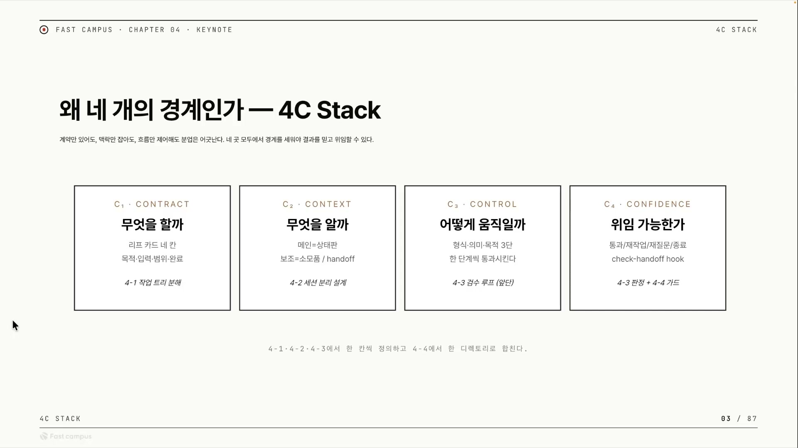
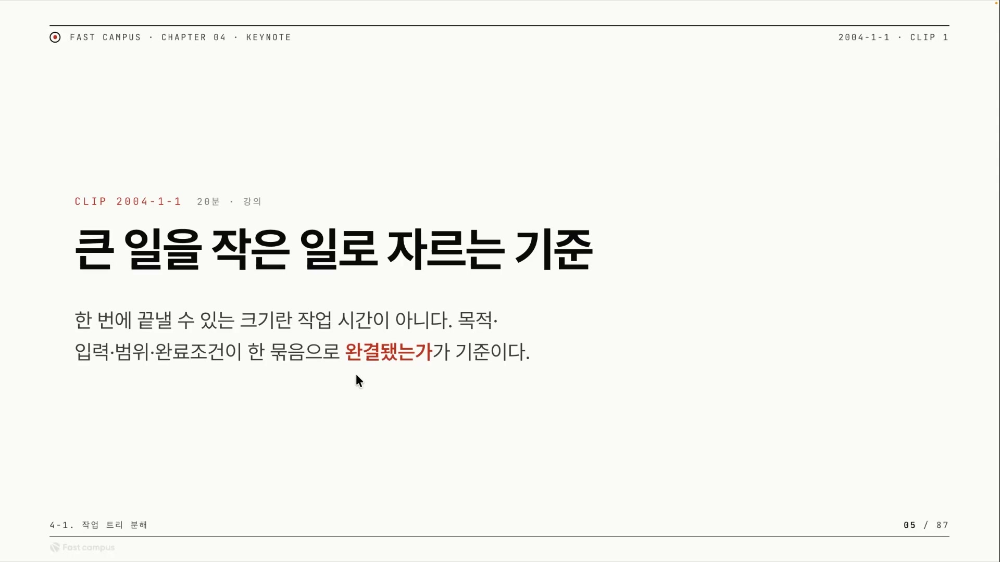
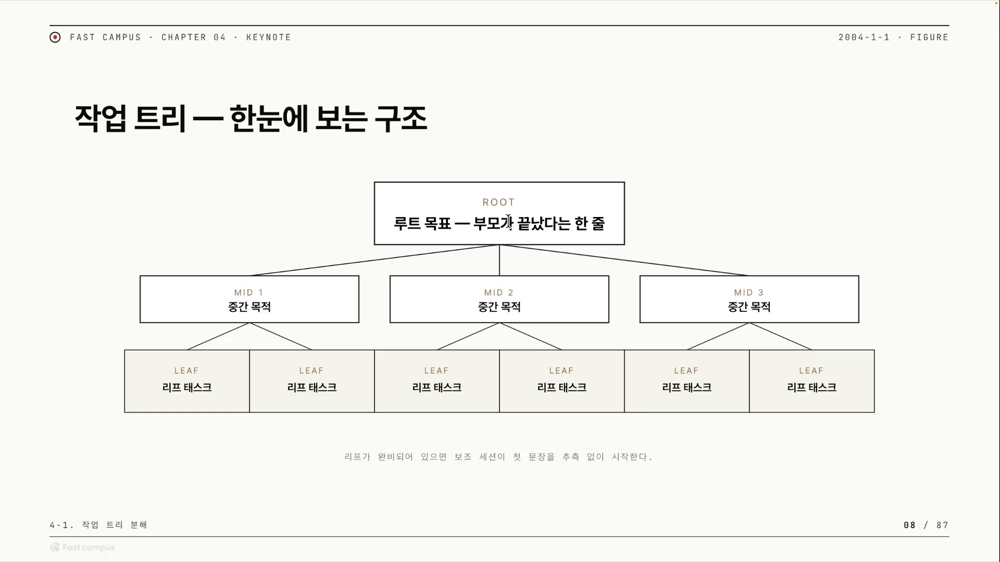
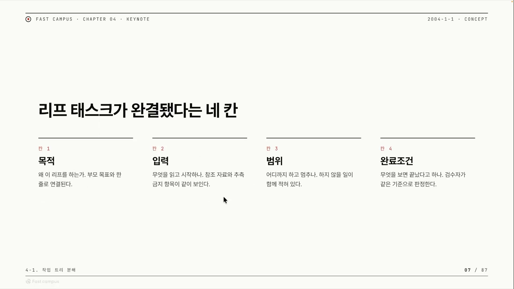
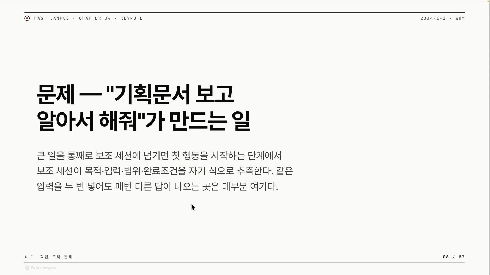
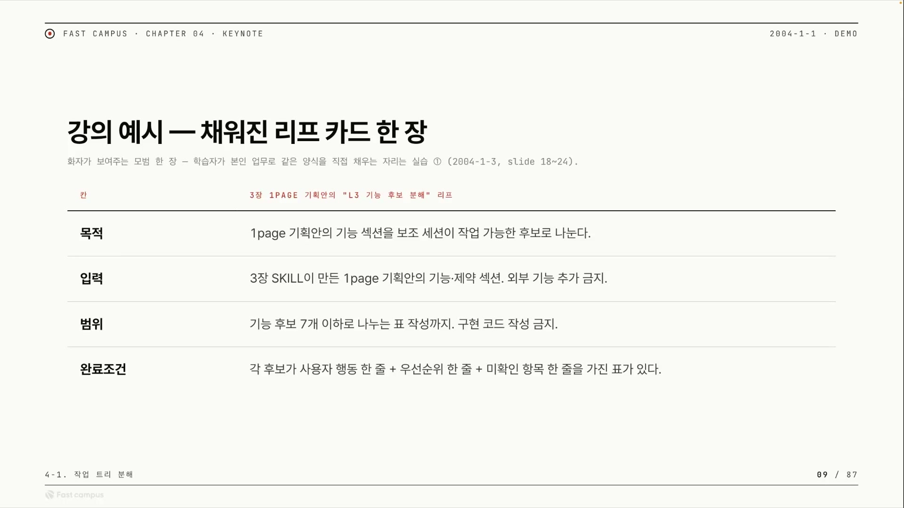
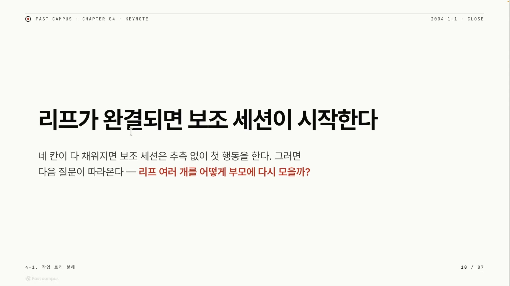

"이 기획 문서 보고 알아서 잘 만들어줘." 코덱스의 goal 같은 장기 실행 에이전트에 이렇게 큰 일을 통째로 넘기면, 에이전트는 목적도 범위도 완료 기준도 자기 식으로 추측해 채운다. 그리고 15분쯤 돌다 멈춘다. 같은 문장을 다시 넣어도 매번 다른 결과가 나온다. 입력은 같은데 출력이 흔들리는 것이다.

이 강의는 거기서 출발한다. 패스트캠퍼스 하네스 엔지니어링 과정에서, 단일 세션으로 돌리던 마크다운 하네스를 넘어 여러 에이전트에게 일을 나눠 맡기는 분업형 하네스로 넘어가는 첫 강의다. 강사는 자신이 직접 만든 하네스 우로보로스(Ouroboros)를 끌고 와, 그걸 만들며 부딪친 문제들을 토대로 이야기를 풀어간다. 핵심 질문은 하나다. 큰 일을 작은 일로 자를 때, 무엇을 기준으로 자르는가.

미리 답을 말하면, 기준은 "얼마나 빨리 끝나는가(작업 시간)"가 아니다. "넘길 계약이 다 채워졌는가(완결됐는가)"다. 이 한 문장이 강의 전체를 관통한다. 왜 그게 기준이 되는지는 분업이 시작되는 자리에서부터 풀린다.

## 왜 일을 나누는가: 메인은 지휘자, 보조는 일회용 메모리

분업의 동기는 단순하다. 메인 세션의 컨텍스트를 아끼기 위해서다.

에이전트에게 일을 시키다 보면 대화가 길어지고, 읽어들인 자료가 쌓이고, 그만큼 메인 세션이 무거워진다. 무거워진 메인은 점점 산만해진다. 그래서 일을 직접 하는 대신 서브에이전트(보조 세션)에게 위임한다. 이때 메인과 보조의 역할이 갈린다.

- 메인 세션은 **오케스트레이션 상태판**이 된다. 직접 일하지 않고, 누가 무엇을 어디까지 했는지 상태만 관리하고 지휘한다.
- 보조 세션은 **디스포저블(일회용) 메모리**다. 메모리를 잠깐 할당해 일을 시키고, 결과만 받은 뒤 버린다. 강사의 표현으로는 소모품처럼 쓴다.

여기서 한 가지 장치가 더 필요하다. 보조가 한 일의 결과를 메인이 통째로 받아오면, 메인은 다시 무거워진다. 그래서 결과를 통째로 받지 않고 요약(핸드오프)이나 참조만 받는다. 강사는 이걸 컴퓨터 공학의 비유로 설명한다. 함수에 값을 넘길 때 통째로 복사해 넘기는 패스 바이 밸류가 있고, 값이 있는 곳의 주소만 넘기는 패스 바이 레퍼런스가 있다. 보조의 작업 결과도 마찬가지다. 결과 전체를 받아오는 대신, "결과는 저기에 있다"는 주소표만 받는 쪽이 메인을 가볍게 둔다.

> "이 컨텍스트를 얼마나 메인에 덜 주면서 실제 작업을 완성시키냐가 하네스의 핵심이라고 보입니다."

이게 빈말이 아니라는 증거가 클로드 코드의 '에이전트 팀' 사례다. 한때 클로드 코드가 에이전트 팀 기능을 발표했을 때, 강사는 당시엔 완전 와우 모먼트였다고 회상한다. 그런데 그 기능은 곧 사라졌다. 여러 에이전트를 지휘하는 데 컨텍스트가 너무 많이 소모됐기 때문이다. 결국 사람들은 에이전트 팀 대신 서브에이전트 기반으로 옮겨가거나, 기능을 MCP로 빼내는 쪽을 택했다. 지휘에 드는 컨텍스트를 아껴야 한다는 문제의식이 실제로 도구의 흥망을 갈랐다.

그러면 메인은 어떻게 직접 안고 있지 않으면서도 상태를 알까. 상태를 컨텍스트가 아니라 바깥에 둔다. 파일이든 DB든 MCP든, 어딘가에 "지금 어느 보조가 무슨 작업을 하고 있다"를 적어두고, 메인은 필요할 때 그걸 조회한다. 강사도 평소 다이어그램에 작업 흐름을 스케치하며 상태를 관리한다고 한다. 정리하면 풀어야 할 질문은 두 가지다. 어떤 작업을 보조에게 넘길 것인가, 그리고 컨텍스트를 어떻게 관리할 것인가. "이 두 가지를 알면 거의 많은 문제가 풀린다."

## 분업을 통제하는 네 개의 경계, 4C

위임은 불안한 일이다. 일을 남에게 맡길 때 우리가 품는 불안을 넷으로 나눠 보면, 강사가 정리한 4C 프레임워크가 그대로 보인다.

- Contract(컨트랙트), 어디까지 해야 하는지 모름. 그래서 에이전트가 바운더리를 넘지 않게 계약을 준다. 오버 엔지니어링과 드리프트를 막는다.
- Context(컨텍스트), 무엇을 알아야 하는지 모름. 그래서 필요한 정보만 선별해 주고, 불필요한 건 넘기지 않는다.
- Control(컨트롤), 딴짓을 안 할지 모름. 그래서 흐름을 스킬로, MCP라면 코드로 제어한다.
- Confidence(컨피던스), 잘했는지 모름. 그래서 얼마나 자신감 있게 위임하고 결과를 어떻게 검증할지를 정한다.

강사는 이 4C를 업계 정설로 내놓지 않는다. 우로보로스를 "에이전트 OS까지 올려보자"는 비전으로 만들며, "하네스를 어디까지 구성해야 하는가"를 고민하다 스스로 정리한 틀이라고 분명히 한다.

> "지금 정답은 사실 없는 상황이다 보니까, 저도 한번 이렇게 우로보로스 만들면서 느낀 것들을 4C, 4개의 C로 생각을 해봤습니다."

배경을 조금 보태두면 신뢰가 선다. '하네스 엔지니어링'이라는 분야 자체는 강사의 조어가 아니라 2026년에 통용되기 시작한 신생어다. AI 에이전트를 감싸 프로덕션에서 신뢰성 있게 동작하게 만드는 시스템과 제약, 피드백 루프를 설계하는 일을 가리키고, HashiCorp 공동창업자 Mitchell Hashimoto가 2026년 2월 초 글로 대중화한 것으로 널리 귀속된다. "프롬프트 엔지니어링 → 컨텍스트 엔지니어링 → 하네스 엔지니어링"으로 이어지는 흐름의 셋째다. 그러니까 강사의 4C는, 이 통용 분야 안에서 한 실무자가 내놓은 개인적 정리틀이다.

4C가 추상적인 개념틀로만 끝나지 않는다는 증거도 있다. 코덱스와 클로드 코드에는 goal(골)이라는 명령어가 있다. 골은 상태를 컨텍스트 너머에 계속 저장하고, 그 기반으로 계약을 주며, "그 골만 작업하게" 통제를 지속적으로 주입한다. 강사는 "그 골이라는 명령어 자체가 이 4C 스택을 굉장히 잘 이행하고 있다"고 본다. 4C는 머릿속 도식이 아니라 이미 도구로 구현돼 돌아가고 있는 것이다.

이 강의는 네 개 중 첫 번째 C, Contract에 거의 모든 시간을 쓴다. 나머지 C는 개관과 예고 수준이다. Contract를 실제로 푸는 방법이 바로 작업 트리 분해다.

## 첫 번째 C, 큰 골을 트리로 쪼개기

큰 골을 한 에이전트가 통째로 하면 두 가지가 생긴다. 일이 너무 크면 목표에서 벗어나는 드리프트(drift)가 일어나고, 하지도 않은 일을 했다고 말하는 레이지(lazy) 현상이 나온다. 그래서 검수가 필요하지만, 검수보다 먼저 와야 할 게 잘 쪼개는 일이다.

쪼개는 방법으로 강사가 드는 건 맥킨지 스타일, 곧 MECE다.

> "제일 중요한 건 맥킨지 스타일처럼 쪼개야 된다는 겁니다. 이를 쪼개서 그 child의 합이 parent가 된다면, 너무나 큰 꼴이더라도 잘 분리해서 진행할 수 있어요."

여기서 핵심은 "child의 합 = parent"라는 한 줄이다. 자식 작업들을 빠짐없이, 겹침 없이 다 합치면 부모 작업이 정확히 복원된다. 이게 MECE(Mutually Exclusive, Collectively Exhaustive: 상호배타 · 전체포괄)가 말하는 분해다. 분해가 제대로 됐는지 가늠하는 기준은 이것이다. 쪼갠 조각을 다시 합쳤을 때 원래 목표가 온전히 되살아나는가.

이런 분해는 낯선 게 아니다. 클로드 코드나 코덱스가 작업 전에 to-do 플랜을 세우는 것도 일을 쪼개는 일종의 분해다. 강사가 한 걸음 더 보태는 건, 쪼갠 플랜들 사이에 의존성이 없다면 여러 서브에이전트를 병렬로 돌릴 수 있다는 점이다. 서로 기다릴 필요가 없는 조각들을 각각 계약으로 묶어 동시에 넘긴다.

### 자르는 기준은 시간이 아니다

여기서 이 강의의 반전이 나온다. 보통 "잘게 쪼갠다"고 하면 "빨리 끝나는 단위로 쪼갠다"를 떠올린다. 강사는 이걸 뒤집는다.

> "한 번에 끝낼 수 있는 크기가 작업 시간이 아니라는 거죠."

근거는 실제 관찰이다. 코덱스의 goal은 한 시간, 길게는 하루 넘게 돌기도 한다. 그게 어떻게 가능한가. 완료 조건과 목적과 범위를 제대로 넣어줬고, 에이전트가 그 계약을 끝까지 지켰기 때문이다.

> "컨트랙트가 잘 지켜지면 (작업이) 오래 갑니다. 실제로 오래 가고요."

길게 도는 게 문제가 아니다. 계약이 명확하면 길게 돌아도 새지 않는다. 반대로 계약이 모호하면 15분 만에 멈춘다. 그러니 작업을 자를 때 물어야 할 건 "이 조각이 몇 분짜리인가"가 아니다. "이 조각은 넘길 계약, 곧 목적과 입력과 범위와 완료조건이 다 채워졌는가"다. 자르는 기준은 시간이 아니라 계약의 완결이다.

### 트리의 모양

이 기준으로 잘라 내려가면 작업은 트리가 된다.

맨 위 루트는 인간의 목표 한 줄이다. 그 한 줄을 그대로 쓰지 않고, 소크라틱 리즈닝(질문으로 가정을 캐묻는 방식)을 통해 AI와 인간이 공유하는 이해(쉐어드 온톨로지)를 바탕으로 다시 한 줄로 정리한다. 이 재진술된 루트가 중간 목적 몇 개로 갈리고, 중간 목적이 다시 더 잘게 갈리며 내려간다. 가장 밑, 더는 쪼개지지 않는 단위가 리프(leaf) 태스크다.

규칙은 단순하다. **리프 노드가 만들어진 뒤에야 서브에이전트에게 일을 시킨다.** 아직 충분히 안 쪼개진 중간 단계를 그냥 넘기면, 보조 세션이 다시 추측하기 시작하고 드리프트하기 쉽다.

이렇게 잘게 쪼개면 따라오는 이득이 하나 있다. 강사가 X에서 받은 피드백인데, 트리로 충분히 잘게 쪼개고 나면 최고급(프론티어) 모델이 아니어도 리프 태스크를 잘 구현하더라는 것이다. GLM(Zhipu AI가 내놓은 오픈소스 저가 코딩 모델) 같은 싼 모델로도 됐다고 한다. 잘 쪼개면 프론티어 모델 의존을 줄일 수 있다는 강사의 주장과 맞는다.

여기서 한 가지 보태두자. 클로드 코드의 UI는 그대로 두고 백엔드 모델만 GLM으로 바꿔 쓰는 구성(BYOK)이 실제로 통용된다. 강사가 콕 집어 말한 대목은 아니지만, "프론티어 모델만 의존하지 않아도 된다"는 그의 주장이 빈말이 아님을 보여주는 실제 사례다. 분해가 단지 정돈의 문제가 아니라 비용과 종속성의 문제이기도 한 셈이다.

## 자른 조각을 넘기는 법, 핸드오프 카드 네 칸

트리로 쪼갰다면, 이제 각 리프를 보조에게 넘길 차례다. 무엇이 갖춰져야 좋은 넘김인가. 강사의 답은 네 칸이다.

> "목적, 그리고 입력, 범위, 없는 조건(완료조건) 이 네 가지가 있으면 좋은 핸드오프라고 볼 수 있어요."

| 칸 | 무엇을 적나 | 일상으로 옮기면 |
|---|---|---|
| 목적 | 왜 이걸 하는가(골) | 이 일을 왜 시키는지 |
| 입력 | 무엇을 읽고 시작하나(참조 자료) | 무슨 자료를 보고 하면 되는지 |
| 범위 | 어디까지 하고 어디부터 금지인가(제약조건) | 어디까지가 네 몫이고 어디부터는 손대지 말지 |
| 완료조건 | 언제 끝내나(Stop Rule · 성공조건) | 무엇을 보면 끝났다고 할지 |

이 네 칸은 신입에게 일을 시킬 때 적어주는 업무 지시서와 다르지 않다. 왜 하는지, 무엇을 보고 하는지, 어디까지 하는지, 언제 끝내는지. 그게 다 적혀 있으면 추측할 자리가 없다. 강사도 이 구조가 앞선 마크다운 하네스나 인터뷰 하네스에서 만든 것과 비슷하다고 짚는다. 완전히 새 개념이 아니라, 같은 골격을 분업형으로 확장한 것이다.

이제 앞에서 본 "알아서 해줘"의 문제로 돌아가 보자.

"알아서 해줘"는 네 칸이 다 비어 있는 카드다. 그래서 보조는 네 칸을 자기 식으로 추측해 채우고, 추측은 매번 달라지므로 같은 입력에도 다른 답이 나온다.

> "같은 입력을 이렇게 역동성 있게 만들 수는 없다는 겁니다."

같은 입력엔 같은 결과가 나와야 한다(재현 가능성). 모호함이 그걸 깬다. 반대로 네 칸이 다 채워진 카드는 어떤 모습인가. 강사가 직접 채워 든 예시가 이렇다.

목적에는 "1page 기획안의 기능 섹션을 보조 세션이 작업 가능한 후보로 나눈다", 입력에는 "3장에서 만든 기획안의 기능과 제약 섹션, 외부 기능 추가 금지", 범위에는 "기능 후보 7개 이하로 나누는 표 작성까지, 구현 코드 작성 금지", 완료조건에는 "각 후보가 사용자 행동과 우선순위, 미확인 항목을 가진 표가 있다"가 들어간다. 빈 카드와 이 카드의 차이가 곧 15분 만에 멈추는 작업과 하루 넘게 도는 작업의 차이다.

모호함을 미리 걷어내는 장치도 강사 도구에 들어 있다. 우로보로스에는 한 번 결정화한 스펙(시드 컨트랙트)을 여러 보조 세션에 똑같이 넘겨 "이 골이 정확히 무엇이고 무엇을 해야 하는지"를 일관되게 알려주는 기능이 있다. 모호한 인간의 골 한 줄을 소크라틱 리즈닝 인터뷰로 캐물어 구체화하는 단계도 있다. 강사에 따르면 이 소크라틱 인터뷰가 더 널리 쓰이는 도구인 OMC(oh-my-claudecode)나 OMX(oh-my-codex)의 딥 인터뷰로 발전하는 계기가 됐다.

완료를 판정하는 강사의 실전 팁은 이렇다. 골은 본질적으로 결정적으로 잡기 어렵다. 그래서 강사는 서브에이전트 열 개를 소환해 작업 완성도를 0\~10점으로 채점시키고, 평균이 9점 이상이면 멈추게 한다. 이렇게 멈추는 기준을 엄격하게 걸면 작업이 24시간 넘게 도는 경우도 많이 생긴다고 한다. 멈춤 조건이 까다로울수록 작업은 더 끝까지 간다.

그래서 "왜 하네스 엔지니어링을 하는가"라는 질문에 강사는 이렇게 답한다. 결국 목적과 입력과 범위를 어떻게 잘 만들어주느냐의 문제라고. 네 칸을 잘 채우는 일, 그게 하네스 엔지니어링의 실체라는 것이다.

## 마지막 C, 넘긴 일을 어떻게 믿나

자르고(Contract) 넘겼다면 남는 질문은 하나다. 넘긴 일이 진짜 끝났는지, 제대로 됐는지를 어떻게 믿는가. 이게 네 번째 C, Confidence다. 에이전트의 "다 했어요"는 그 자체로 증거가 아니라 검증해야 할 입력일 뿐이라는 것, 이 강의는 거기까지만 짚고 지나간다. 검증을 실제로 어떻게 구현하느냐는 뒤따르는 검증 파트의 몫이다.

## 정리: 리프가 완결되면 비로소 보조가 시작한다

한 줄로 줄이면 이렇다. 큰 일을 작은 일로 자르는 기준은 작업 시간이 아니라 계약의 완결이다.

목적 · 입력 · 범위 · 완료조건이라는 네 칸이 다 채워진 리프, 그게 보조에게 넘길 수 있는 최소 단위다. 네 칸이 채워졌을 때 보조 세션은 추측 없이 첫 행동을 시작하고, 추측이 없으니 같은 입력에 같은 결과가 나온다. 채워지지 않은 채로 넘기면 보조는 다시 추측하고, 작업은 15분 만에 샌다.

그리고 자연스레 다음 질문이 따라온다. 리프 하나하나를 보조가 끝내고 결과를 부모에게 돌려보냈을 때, 그 결과들을 합치면 정말 부모가 완성된 게 맞는가. child의 합이 parent가 된다는 분해의 약속이, 합칠 때도 지켜졌는지를 확인하는 일. 그게 이 다음에 올 이야기다.
