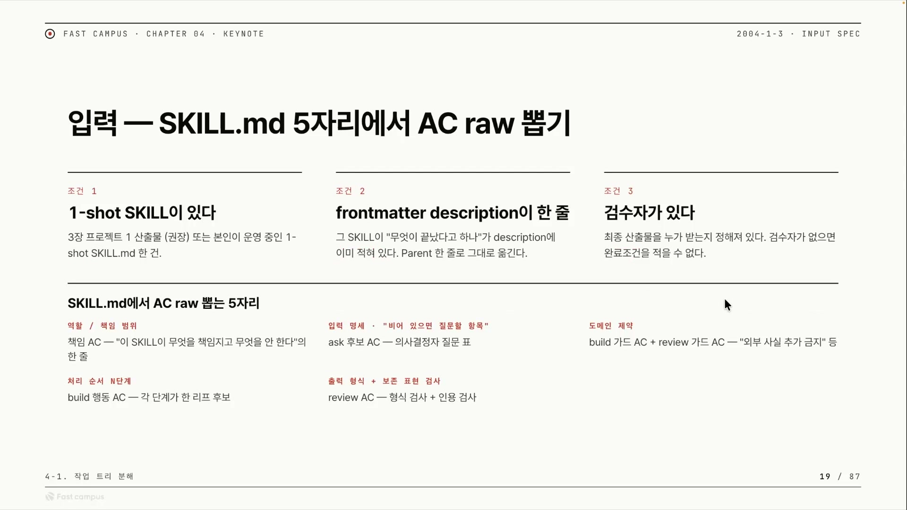
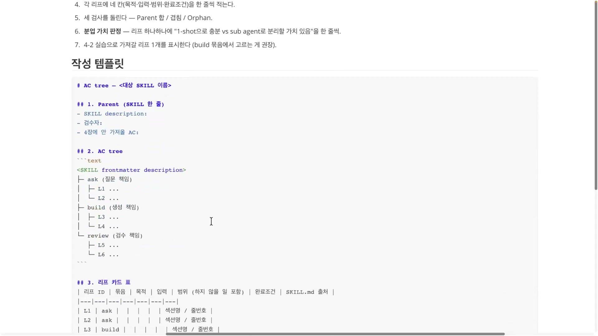
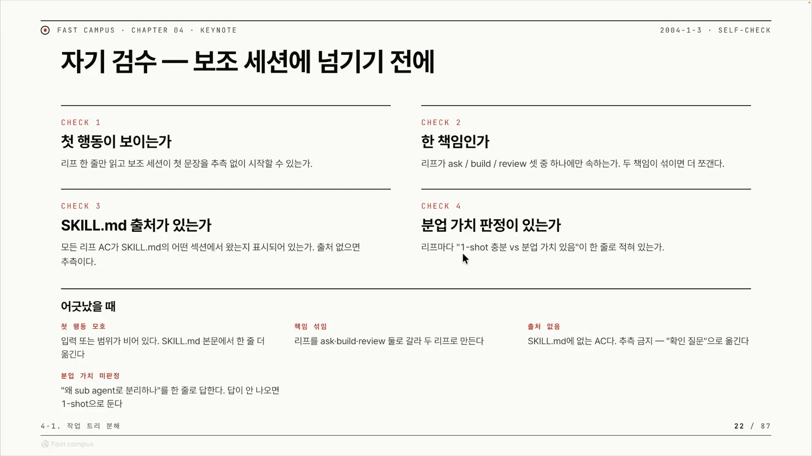
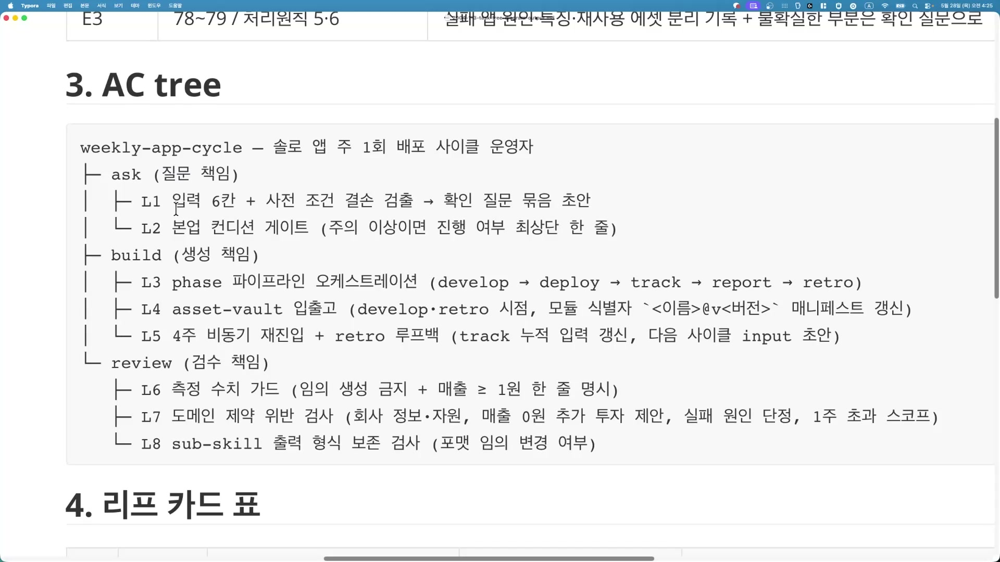
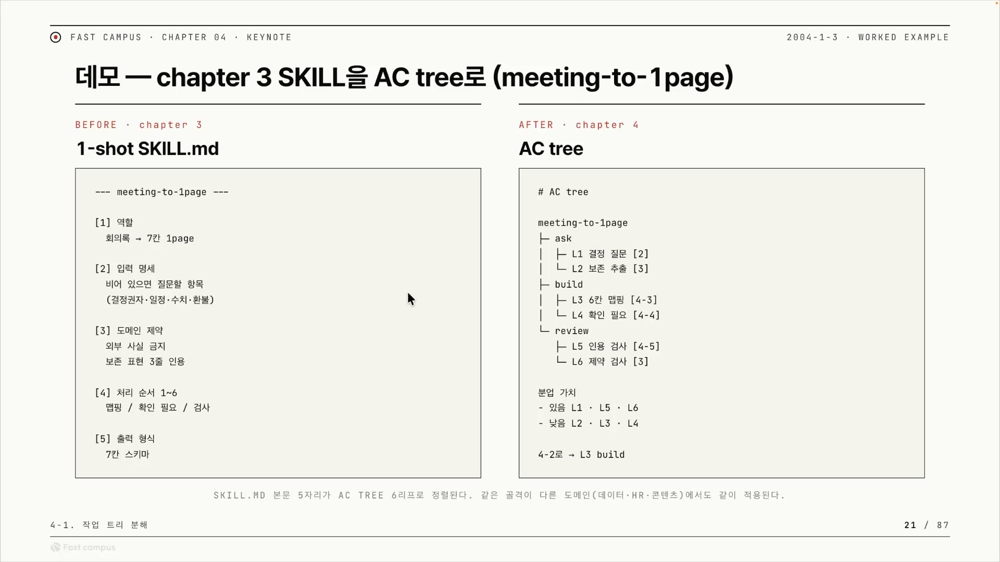
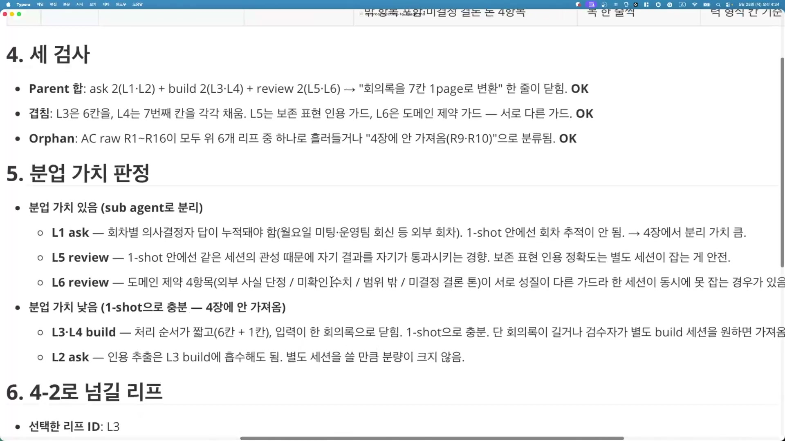

3장에서 회의록을 기획안으로 바꾸는 스킬을 하나 만들었다. `meeting-to-1page` 라는 이름의, 회의록 원문을 받아 7칸짜리 1page 기획안 초안으로 바꿔주는 마크다운 스킬이다. 그 스킬의 `SKILL.md` 한 파일 안에는 다섯 가지가 통째로 들어 있다. 역할(회의록을 7칸 1page로 바꾼다), 입력 명세(비어 있으면 사람에게 물어볼 항목, 가령 결정권자나 일정이나 수치나 환불 기준), 도메인 제약(외부 사실을 지어내지 말 것, 보존해야 할 표현은 3줄 인용), 처리 순서 1\~6단계, 출력 형식(7칸 스키마).

문제는 이 묶음 전체를 한 세션이 한꺼번에 떠안고 돌린다는 데 있다. 회의록이 길어지거나, 회차를 거듭하며 의사결정이 누적되거나, 만든 결과를 같은 세션이 자기 손으로 검수해 통과시키는 편향이 끼면, 한 세션으로는 점점 버거워진다. 강사의 말로 옮기면 "메인 세션으로만 진행을 하던 걸" 이제 나눠 보자는 것이다. 이 글은 그 "나누는 방법"을, 즉 이미 완성된 1-shot 스킬 하나를 분업 후보로 다시 진단하는 절차를 정리한다.

## 분해가 아니라 재정렬이다

먼저 이 작업이 무엇이 아닌지부터 못박는 게 좋다. 백지에서 새 업무를 잘게 쪼개는 일이 아니다. 이미 손에 든 완성된 스킬을 놓고 "이걸 여러 서브에이전트로 떼어낼 수 있나"를 따져보는 일이다. 대상은 새로 정의할 업무가 아니라 어제 만들어 돌리고 있는 스킬이다.

이 진단의 산출물을 강의는 AC tree 라고 부른다. 한 장짜리 다이어그램인데, 스킬이 지고 있던 책임들을 ask · build · review 세 묶음으로 다시 정렬하고, 각 묶음 끝에 잘게 나뉜 책임 단위(리프)를 매단 트리다. 핵심 단위가 AC인데, Accountability에서 온 말로 "누가 무엇이 끝났다고 책임지는가"의 한 덩어리를 가리킨다. 슬라이드가 "책임 AC", "ask 후보 AC", "build 가드 AC", "review AC" 식으로 쓰는 그 AC다.

트리는 늘 세 갈래로 갈린다. 강사가 입에 붙도록 반복하는 ask · build · review가 그것이다.

| 묶음 | 책임 | 강사의 표현 |
|---|---|---|
| **ask** | 비어 있는 입력과 미결정 사항을 사람에게 물어 채운다 | "물어볼 수 있는 에이전트" |
| **build** | 실제로 만들고 개발한다 | "실제로 뭔가 작업을 하는 에이전트" |
| **review** | 형식 · 제약 · 보존 표현을 검사한다 | "검수하는 에이전트" |

이 셋이 뒤에 서브에이전트로 떼어낼 후보가 된다. 다만 셋을 무조건 다 떼는 게 아니라, 리프마다 떼어낼 가치를 따로 판정하는 게 이 실습의 알맹이다. 그 판정은 뒤에서 다룬다.

왜 굳이 이렇게까지 하느냐고 물으면, 강사의 답은 하네스(harness)다. 같은 입력이면 늘 같은 결과를 내는, 목표 업무에 맞춰 분업 골격을 짜둔 재사용 가능한 실행 틀. AC tree는 그 자체가 목적이 아니라 그 하네스를 만들기 위한 설계도에 가깝다. "이런 실습을 반복하다 보면 결국 지금 목표로 하는 업무가 잘 맞는 하네스로, 데터미니스틱하게 우리가 원하는 결과를 얻을 수 있게끔 바뀔 거라고 믿습니다."

## SKILL.md의 다섯 자리에서 AC를 길어 올린다

분석을 시작하려면 세 가지 선결 조건이 갖춰져 있어야 한다. 하나라도 없으면 트리를 그릴 수 없다.

| 조건 | 내용 |
|---|---|
| **1-shot SKILL이 있다** | 분석할 대상 `SKILL.md` 한 건 |
| **frontmatter description이 한 줄** | "이 스킬이 무엇이 끝났다고 하느냐"가 이미 description에 적혀 있다. 이 한 줄을 트리의 뿌리(Parent)로 그대로 옮긴다 |
| **검수자가 있다** | 최종 산출물을 누가 받는지 정해져 있어야 한다. 검수자가 없으면 완료조건 자체를 적을 수 없다 |

조건이 갖춰졌으면 이제 AC를 뽑는다. 여기가 이 방법론에서 가장 구체적인 대목이다. 추측으로 책임 항목을 만들어내지 않는다. `SKILL.md` 본문의 정해진 다섯 위치에서만 길어 올린다. 어느 자리가 어떤 종류의 AC를 낳는지가 1:1로 정해져 있다.



| `SKILL.md`의 위치 | 여기서 나오는 AC |
|---|---|
| 역할 / 책임 범위 | **책임 AC**, 즉 "이 스킬이 무엇을 책임지고 무엇을 안 한다"의 한 줄 |
| 입력 명세, "비어 있으면 질문할 항목" | **ask 후보 AC**, 의사결정자에게 물을 질문 |
| 도메인 제약 | **build 가드 AC + review 가드 AC**, "외부 사실 추가 금지" 같은 제약 |
| 처리 순서 N단계 | **build 행동 AC**, 각 단계가 하나의 리프 후보 |
| 출력 형식 + 보존 표현 검사 | **review AC**, 형식 검사 + 인용 검사 |

이렇게 뽑으면 모든 AC가 출처를 갖는다. `SKILL.md`의 어느 섹션 몇 번째 줄에서 왔는지가 따라붙는다. 출처가 없는 AC는 곧 추측이고, 이 강의에서 추측은 금지다. 뽑은 결과는 `A1, A2, B1...` 같은 AC raw 목록으로 표에 적는다. Raw ID, 줄번호와 섹션, 원문 요약, 1차 분류 정도를 한 줄씩.

## 트리로 정렬하고, 리프마다 카드를 단다

AC raw를 ask · build · review 세 묶음으로 보내고, 각 묶음 아래에 리프(L1 · L2 ...)를 단다. 작성 템플릿은 아래 슬라이드가 그대로 보여준다.



```text
<SKILL frontmatter description>
├─ ask (질문 책임)
│  ├─ L1 ...
│  └─ L2 ...
├─ build (생성 책임)
│  ├─ L3 ...
│  └─ L4 ...
└─ review (검수 책임)
   ├─ L5 ...
   └─ L6 ...
```

리프는 보통 6\~9개쯤 나온다. 트리를 다 그렸으면 리프마다 카드를 한 장씩 붙인다. 카드에는 네 칸이 들어간다. 목적 · 입력 · 범위 · 완료조건, 그리고 `SKILL.md` 출처. 이 네 칸 중에서 가장 일을 많이 하는 건 범위 칸이다. 범위 칸에는 "할 일"이 아니라 **하지 않을 일을 적는다**. 예를 들어 "비어 있는 값을 추정으로 채우지 않는다" 같은 문장이 범위 칸에 들어간다. 이게 리프와 리프 사이에 책임 경계를 만든다. 완료조건은 앞서 정한 검수자가 그대로 받아낼 수 있는 형태여야 한다.

리프를 다 적었으면 트리가 멀쩡한지 세 가지로 검산한다.

| 검사 | 묻는 것 |
|---|---|
| **Parent 합** | 리프 전체를 더하면 Parent 한 줄이 닫히는가 |
| **겹침** | 두 리프가 같은 일을 중복하지 않는가 |
| **Orphan** | 떠도는 리프가 없는가. 모든 AC raw가 어떤 리프로 흘러들거나 "안 가져옴"으로 분류됐는가 |

셋 중 Orphan 검사가 가장 무겁다. 이게 뒤에 나올 "분모 없는 리프 금지" 원칙과 곧장 이어진다.

## 핵심은 분업 가치 판정이다

트리를 그리는 건 준비일 뿐이고, 진짜 알맹이는 그 다음에 온다. 리프 하나하나에 "이건 1-shot으로 충분한가, 아니면 서브에이전트로 떼어낼 가치가 있는가"를 한 줄씩 판정하는 일이다. 강사가 거듭 강조하는 문장이 이 대목이다. "정말 이게 분업할 수 있는지, 서브에이전트한테 넘겨도 좋은 일인지를 같이 본다."

판정의 리트머스는 단순하다. "왜 이걸 sub agent로 분리하나"를 한 줄로 답할 수 있으면 떼고, 그 한 줄이 안 나오면 1-shot으로 둔다. 분리 이유를 한 문장으로 못 대면 분리하지 않는다는 뜻이다.

떼어낼 가치가 큰 경우는 대체로 세 갈래로 모인다.

첫째, **누적이나 추적이 필요할 때 뗀다.** 회차를 넘나드는 상태를 1-shot은 들고 있지 못한다. 월요일 미팅에서 나온 의사결정이 운영팀 회신과 합쳐지고 그게 다음 회차로 누적돼야 하는 상황이라면, 한 세션 안에서는 회차 추적이 안 된다. ask 묶음이 여기에 자주 걸린다.

둘째, **자기 검수 편향을 피하려 뗀다.** 결과를 만든 세션이 검수까지 맡으면 같은 세션의 관성 때문에 자기 결과를 자기가 통과시키는 쪽으로 기운다. 보존 표현 인용이 정확한지 같은 검사는 별도 세션이 잡는 편이 안전하다. review 묶음이 여기 자주 걸린다.

셋째, **비중이 크면 뗀다.** 개발(build)이 보통 가장 무겁다. 강사도 "개발 쪽 비중이 가장 크다"며 build 분리 가치를 1순위로 본다.

반대로 떼지 말아야 할 경우도 분명하다. 처리 순서가 짧고 입력이 하나로 닫혀 있으면 한 패스로 끝나니 분리 비용만 든다. 스킬이 이미 오케스트레이션 같은 컨트롤을 쥐고 있으면 서브에이전트는 중복이라, "호출 한 줄이면 끝나서" 떼어낼 이유가 없다. 분기나 문자열 잇기(concat)처럼 같은 입력이면 늘 같은 결과가 나오는 결정적 작업도 뗄 게 없다.

분리가 공짜가 아니라는 점도 함께 기억해야 한다. 서브에이전트끼리 대화하게 만들려면 그 사이에 MCP 같은 프로토콜을 깔아야 해서 복잡도가 올라간다. 떼는 것 자체에 비용이 붙는다. 그래서 한 줄로 정당화 못 하는 분리는 하지 않는다.

판정까지 마쳤으면, 보조 세션에 트리를 넘기기 전 마지막으로 네 가지를 스스로 점검한다.



| | 체크 | 묻는 것 |
|---|---|---|
| **CHECK 1** | 첫 행동이 보이는가 | 리프 한 줄만 읽고 보조 세션이 추측 없이 첫 문장을 시작할 수 있는가 |
| **CHECK 2** | 한 책임인가 | 리프가 ask · build · review 셋 중 하나에만 속하는가. 두 책임이 섞이면 더 쪼갠다 |
| **CHECK 3** | 출처가 있는가 | 모든 리프 AC가 `SKILL.md` 어느 섹션에서 왔는지 표시돼 있는가. 출처가 없으면 추측이다 |
| **CHECK 4** | 분업 가치 판정이 있는가 | 리프마다 "1-shot 충분 vs 분업 가치 있음"이 한 줄로 적혀 있는가 |

어긋났을 때의 처방은 신기할 만큼 한 방향을 가리킨다. 첫 행동이 모호하면 입력이나 범위가 비어 있다는 뜻이니 `SKILL.md`에서 한 줄을 더 옮긴다. 책임이 섞였으면 리프를 둘로 갈라 두 리프로 만든다. 출처가 없으면 그건 `SKILL.md`에 없는 AC라는 뜻이니 추측으로 메우지 말고 "확인 질문"으로 돌린다. 분업 가치가 아직 안 적혔으면 "왜 분리하나"를 한 줄로 답해보고, 답이 안 나오면 1-shot으로 둔다. 모호하면 `SKILL.md`로 돌아가고, 섞이면 쪼개고, 모르면 묻는 것(ask)으로 돌린다. 추측으로 빈 칸을 메우지 않는 게 이 모든 처방을 관통하는 규율이다.

## 예시 하나, weekly-app-cycle

첫 예시는 강사 본인의 스킬인 `weekly-app-cycle`이다. 솔로 모바일 앱 개발자의 주 1회 배포 사이클을 운영하는 스킬로, `develop / deploy / track / report / retro / asset-vault` 여섯 개의 sub-skill을 순서대로 호출해 한 사이클 산출물을 한 묶음으로 만든다.

Parent 한 줄은 그 description을 그대로 옮긴 것이고, 검수자는 매출 리포트를 받는 본인이다. AC raw는 18개가 나왔다. 그중 phase 분기로 sub-skill 파일을 Read 하는 것, 출력 섹션을 순서대로 잇는(concat) 것, sub-skill의 처리 원칙을 그대로 따르는 규칙, 이 셋은 모두 결정적 작업이라 한 패스로 끝난다. 그래서 "4장에 안 가져올 AC"로 빠진다.



```text
weekly-app-cycle (솔로 앱 주 1회 배포 사이클 운영자)
├─ ask
│  ├─ L1 입력 6칸 + 사전 조건 결손 검출 → 확인 질문 묶음 초안
│  └─ L2 본업 컨디션 게이트 (주의 이상이면 진행 여부 최상단 한 줄)
├─ build
│  ├─ L3 phase 파이프라인 오케스트레이션 (develop→deploy→track→report→retro)
│  ├─ L4 asset-vault 입출고 (모듈 식별자 <이름>@v<버전> 매니페스트 갱신)
│  └─ L5 4주 비동기 재진입 + retro 루프백
└─ review
   ├─ L6 측정 수치 가드 (임의 생성 금지 + 매출 ≥ 1원 한 줄 명시)
   ├─ L7 도메인 제약 위반 검사 (회사 정보·자원, 매출 0원 추가 투자 등)
   └─ L8 sub-skill 출력 형식 보존 검사
```

리프 카드에서 범위 칸이 어떻게 경계를 긋는지가 잘 드러난다. L1(ask)은 6칸이 비어 있는지와 사전 조건(flutter · Xcode)이 미충족인지만 본다. 비어 있는 값을 추정으로 채우지 않는다. L3(build)은 full이면 5개 phase를 순서대로, 단일 phase면 그 하나만 돌리되 sub-skill 출력 형식은 건드리지 않는다. 형식 보존은 L8의 책임이기 때문이다.

이 예시에서 눈에 띄는 건 review가 셋(L6 · L7 · L8)으로 갈린 점이다. 측정 수치 가드, 도메인 제약 위반 검사, 출력 형식 보존이 서로 성질이 달라서다. 수치가 임의로 생성됐는지 보는 일과, 형식이 보존됐는지 보는 일은 같은 세션이 동시에 잘 잡지 못한다. 성질이 다른 가드는 갈라 둔다는 원칙이 그대로 적용된 셈이다.

## 예시 둘, meeting-to-1page

두 번째 예시가 바로 글 첫머리의 그 스킬, 3장에서 만든 `meeting-to-1page`다. 회의록 원문을 1page 기획안 초안(7칸)으로 바꾼다. Parent는 그 한 줄이고, 검수자는 1page를 받는 의사결정자다. AC raw는 16개 나왔고, 처리 순서 1·2단계(원문 보존, 확정과 미결정 분리)는 1-shot 한 패스에 끝나 "안 가져옴"으로 빠진다.



여섯 리프는 각 묶음에 둘씩 떨어진다. ask는 결정 항목을 추출하는 질문(L1)과 보존 표현 후보 추출(L2), build는 6칸 맵핑(L3)과 확인 필요 항목을 한 칸으로 모으는 일(L4), review는 보존 표현 인용 검사(L5)와 도메인 제약 위반 검사(L6)다. 왼쪽 `SKILL.md`의 다섯 자리가 오른쪽 6리프로 어떻게 흘러가는지가 위 한 장에 그대로 담긴다. 입력 명세는 L1로, 도메인 제약은 L2와 L6으로, 처리 순서는 L3과 L4로, 출력 형식 검사는 L5로 간다.

이 예시가 표준 사례로 좋은 이유는 분업 가치 판정이 깔끔하게 갈리기 때문이다.



분업 가치가 있다고 판정된 건 L1 · L5 · L6이다. L1은 앞서 말한 회차 누적 때문이고, L5는 자기 결과를 자기가 통과시키는 편향 때문이며, L6은 도메인 제약 네 항목(외부 사실 단정 / 미확인 수치 / 범위 밖 / 미결정 결론 톤)이 서로 성질이 다른 가드라 한 세션이 동시에 다 못 잡을 수 있어서다. 반대로 L2 · L3 · L4는 1-shot으로 충분하다고 봤다. 처리 순서가 짧고 입력이 한 회의록으로 닫혀 있기 때문이다. 다만 회의록이 길어지거나 검수자가 별도 build 세션을 원하면 L3 · L4도 가져온다는 단서가 붙는다.

강사는 build인 L3의 분업 가치를 "낮다"고 평가하면서도, 정작 다음 단원으로 넘길 리프로는 그 L3을 골랐다. 슬라이드가 대는 이유는 하나, L3이 build 묶음의 가장 큰 단위(6칸 맵핑)라는 것이다. 앞선 weekly 예시도 build 리프를 다음 단계로 가져갔다. 두 경우 모두 build의 큰 리프를 넘긴다는 점에서, build가 가장 무겁고 분리 가치가 크다는 이 강의의 일관된 입장이 다시 확인된다.

## 하지 말아야 할 두 가지, 가드 금지와 orphan 금지

실습 끝에 강사가 정작 힘주어 말하는 건 트리를 멋지게 그리는 법이 아니라 "이것만은 하지 말라"는 두 가지다.

하나는 **가드 에이전트를 따로 세우지 말라**는 것이다. review나 제약 검사를 "가드 전담 에이전트"로 떼어내고 싶은 유혹이 생기는데, 그러면 문제가 생긴다. 가드는 독립된 책임 단위가 아니라 다른 책임에 붙어 있는 검사이기 때문이다. 이걸 별도 에이전트로 떼면 "무엇을 막는 가드인지"의 원천(parent)이 사라진다. 그래서 제약은 그것이 지키는 build나 review 리프 안의 "범위(하지 않을 일)"로 흡수시키는 게 맞다.

다른 하나가 더 중요한데, **분모 없는 리프를 만들지 말라**는 것이다. 강사는 이걸 "분모가 없는 올포원(orphan)"이라 부른다. 트리를 쪼개다 보면 `SKILL.md` 어디에도 근거가 없는, 위에 매달릴 데가 없는 책임이 떠다니게 될 때가 있다. 상위 책임이 없으니 분모가 없는 셈이고, 이런 리프는 서브에이전트에게 "이상한 걸 만들라"고 시키는 꼴이 된다. 앞에서 본 세 검사 중 Orphan 검사가, 그리고 CHECK 3(출처가 있는가)이 바로 이걸 막는 장치다. 모든 AC raw가 어떤 리프로 흘러들거나 "안 가져옴"으로 분류돼야 하고, 떠도는 게 하나라도 있으면 그 트리는 틀린 것이다. 강사의 말로는, "오히려 트리를 쪼개면서 이런 확실한 원천이 있는지도 체크해보는 게 좋다."

이 두 함정은 사실 같은 원칙의 양면이다. 추측으로 만들어낸 책임은 트리에 들어와선 안 되고, 불확실한 게 있으면 build가 떠안는 게 아니라 ask가 떠안는다. 모르면 만들지 말고 묻는다.

그래서 이 강의가 말하는 "좋은 분해"는 다섯 줄로 압축된다. 모든 리프는 `SKILL.md`에 출처가 있다. 모든 리프는 ask · build · review 한 책임에만 속한다. 떠도는 리프가 없다. 리프마다 분리 이유가 한 줄로 있고, 없으면 1-shot으로 둔다. 그리고 분리는 누적이나 편향이나 비중이 있는 곳에만 하고, 결정적이고 짧고 이미 통제된 일은 그대로 둔다. 이렇게 얻은 AC tree 다이어그램 한 장이, 다음 단원에서 세션을 실제로 나누고 하네스를 짤 때의 출발점이 된다.
