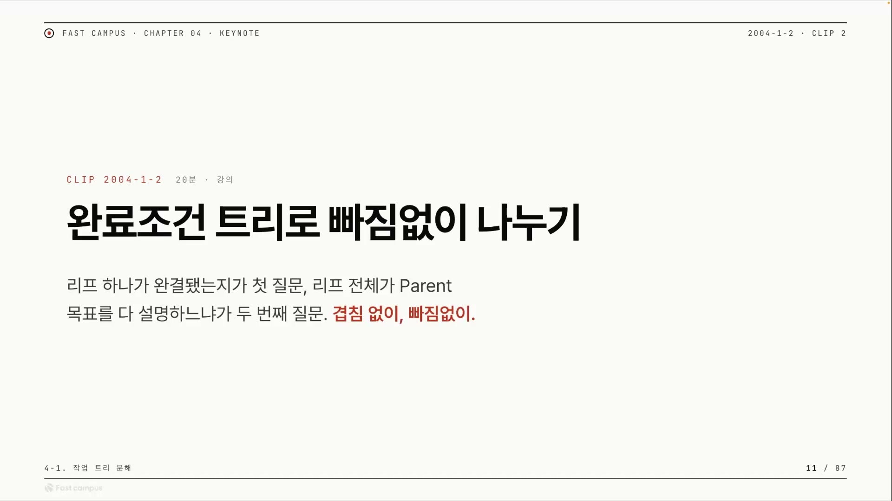
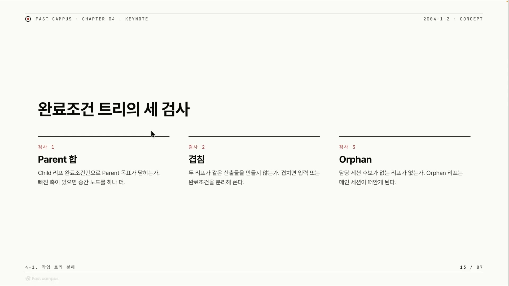
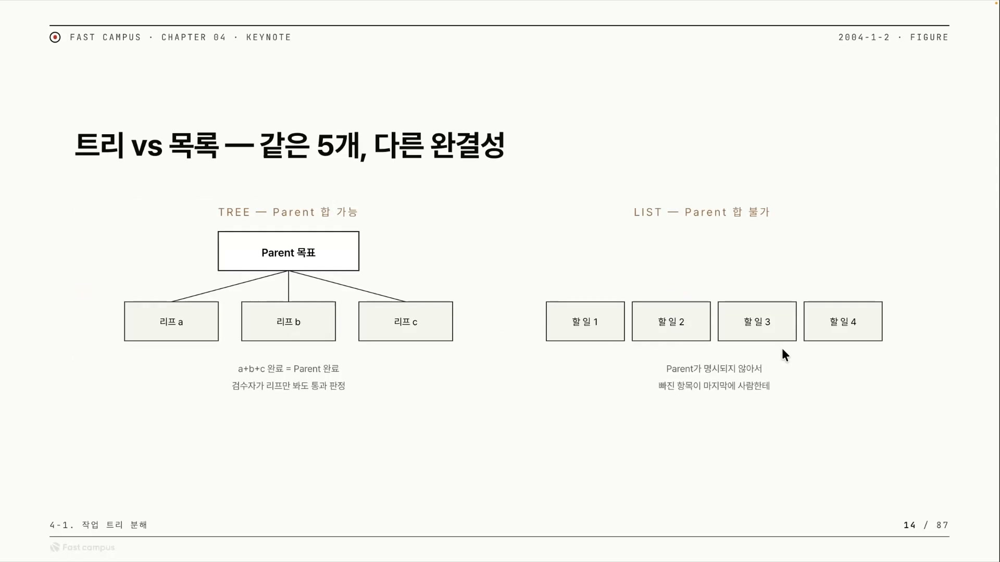

큰 작업 하나를 에이전트에게 통째로 던지면 어떻게 될까. "이 기획안을 개발할 수 있는 상태로 만들어줘" 같은 목표를 그대로 넘기면, 그 안에는 모호한 구석이 남아 있다. 모호함은 빈칸이고, 모델은 그 빈칸을 자기 추측으로 메운다. 한번 추측이 들어가면 다음 단계는 그 추측 위에서 또 추측을 쌓고, 빗나감이 복리로 불어난다. 이게 드리프트(drift), 처음 목표에서 작업이 진행될수록 서서히 엉뚱한 방향으로 흘러가는 현상이다.

분업형 서브 에이전트를 쓰면 이게 더 심해진다. 서브 에이전트는 "무언가를 완료하고 결과를 반환하라"는 역할로 호출된다. 그래서 목표가 불명확해도 멈추거나 되묻기보다, 일단 그럴듯한 무언가를 끝내서 돌려주는 쪽으로 기운다. 이 "끝내야 한다"는 압박이 모호한 목표와 만나면, 원래 요구가 아닌 것을 완료해버린다. 드리프트는 모델이 게을러서 나는 게 아니라, '반환해야 하는 구조'가 모호함과 만나 생기는 구조적 부작용이다.

그래서 큰 목표를 그냥 던지면 안 되고, 서브 에이전트들이 처리하기 좋은 형태로 쪼개줘야 한다. 이 글은 그 쪼개는 방법, 완료조건 트리(AC 트리)를 다룬다. 핵심 주장을 미리 한 줄로 박아두면 이렇다. 큰 작업을 완료조건 트리로 빠짐없이 · 겹침없이 쪼개고 리프(leaf)마다 증거로 검증할 수 있게 만들면, 부모(parent)는 따로 검증할 필요가 없어진다.

## 겹침 없이, 빠짐없이: MECE라는 분해 원리

쪼개는 데도 품질 기준이 있어서, 강의는 두 단어를 빨간 글씨로 강조한다. 겹침 없이, 빠짐없이. 이게 맥킨지의 MECE 어프로치다.

MECE는 Mutually Exclusive, Collectively Exhaustive의 약자다. 1960년대 후반 맥킨지의 바버라 민토(Barbara Minto)가 고안한 분류 원칙으로, 어떤 집합을 하위 항목으로 나눌 때 두 가지를 요구한다. 항목끼리 서로 겹치지 않을 것(Mutually Exclusive), 그리고 다 합치면 전체를 빠짐없이 덮을 것(Collectively Exhaustive). 컨설팅 펌이 복잡한 문제를 구조적으로 푸는 기본 원리다.

보통 MECE는 '깔끔한 분류법'으로 소개되지만, 작업 분해에 붙이면 두 축이 에이전트 운영의 실패 모드와 정확히 맞물린다.

- 겹침 없이(ME). 두 서브 에이전트가 같은 파일을 동시에 건드리면 충돌이 난다. 안 겹치게 나누는 것이 곧 충돌 회피다.
- 빠짐없이(CE). 받은 태스크는 완전하게 다 조사하고 체크해서 결과를 낸다. 리프들의 합이 부모를 빠짐없이 덮어야, 부모가 미완으로 남는 사고가 안 난다.

추상 원리를 구체적 장애로 번역한 것, 이게 이 분해법의 첫 번째 통찰이다.

이 접근은 결국 분할정복(divide and conquer)이다. 큰 문제를 더 작고 다루기 쉬운 하위 문제로 나누고, 각각을 풀고, 그 답을 합쳐 원래 문제를 푼다. 머지소트 · 퀵소트가 그 대표다. 부모(큰 문제)를 리프(하위 문제)로 나누고, 서브 에이전트가 각 리프를 풀고, 리프 결과들을 합쳐 부모를 완성한다. MECE는 이 "나누기" 단계의 품질 기준이다.

다만 알고리즘과 결정적으로 다른 점이 하나 있다. 알고리즘의 분할정복은 '합치기(combine)'가 자동으로 보장되지만, 에이전트 작업에서는 그렇지 않다. 사람이, 혹은 별도 조정자가 MECE를 지켜 나눠줘야만 합쳐진다. 이 차이가 다음 문제로 이어진다.

## 리프를 다 끝냈는데 부모가 안 닫힌다

문제 상황을 하나 던져보자. 서브 에이전트들에게 업무를 쭉 나눠줬다. 리프 노드 쪽에서 "일 5개 다 끝냈습니다" 하고 리턴했다. 그런데 부모는 여전히 완료가 안 된 것처럼 보인다.

왜 이런 일이 날까. 부모의 성공 기준과 리프 5개의 완료 기준의 합이 똑같지 않아서다. 두 방향으로 어긋날 수 있다.

- 합이 부족할 때(빠짐). 리프들을 다 합쳐도 부모 목표에 도달하지 못한다. 빠진 축이 있다. 리프는 전부 성공 리턴인데 부모는 미완이고, "끝냈다"는 거짓 신호가 뜬다.
- 합이 과잉일 때(많아서). 부모 목표보다 리프가 더 많은 걸 요구한다. 불필요한 일, 중복, 범위 이탈이 생긴다.

부족한 것만 문제가 아니라 과잉도 어긋남이다. 그래서 강사가 든 핵심 명제는 이렇다. 부모 목표 자체가 자식 리프의 완료조건의 합으로 무조건 설명되어야 한다.

여기서 한 가지 경우를 더 짚는다. 부모와 리프 사이에 이 합의 등식이 아예 정의돼 있지 않은 상태, 그냥 할 일을 나열만 한 상태라면 그건 잘 나눠진 게 아니다. "이것들을 다 하면 부모가 완성된다"는 보증이 없는 단순 to-do list와 다를 게 없다. 트리를 그렸다고 끝이 아니라, 합의 등식이 박혀 있어야 트리다.

## 완료조건 트리의 세 검사

이 명제를 실제로 점검하는 방법이 세 검사다. 강의는 이를 AC 트리의 세 검사 레이어라 부른다. 검사 1은 합이 닫히는가, 검사 2는 겹치지 않는가, 검사 3은 빠진 담당이 없는가. 앞서 본 MECE가 그대로 검사로 내려온다. 검사 1은 완전성, 검사 2는 ME(겹침 없음), 검사 3은 CE(빠짐 없음)에 대응한다.

### 검사 1, Parent 합

부모 목표가 리프 완료조건들의 합으로 완수되는지(닫히는지) 확인한다. 합의 등식이 성립하는가를 묻는 검사다. 이게 안 되면 방금 본 "리프 5개 다 끝냈는데 부모 미완" 사고가 그대로 난다.

이 검사에서 주로 걸리는 건 부모 목표가 너무 클 때다. 지구 정복 같은 목표를 한 단계 분해로 리프까지 내리려 하면 절대 닫히지 않는다. 해법은 한 번에 리프로 가지 않고, 중간 노드를 하나 끼우는 것이다. 큰 부모를 일단 중간 노드들로 쪼개고, 그 중간 노드를 다시 리프로 감싸면 레벨 2 트리가 된다.

오타니의 만다라트 81칸이 같은 구조다. 이루려는 꿈을 가운데 적고, 그걸 9개로 쪼개고, 각 칸을 다시 9개로 쪼개 81칸을 만든다. 가운데 큰 목표를 계층적으로 작은 칸들로 분해하는 것, 그게 중간 노드를 끼워 한 단계 더 깊이 내려가는 일과 같다. 합이 닫히면 통과, 안 닫히면 중간 노드를 더해 트리를 깊게 만든 뒤 다시 검사 1을 건다.

### 검사 2, 겹침

트리가 쪼개진 뒤, 두 리프가 같은 산출물(같은 파일)을 수정하거나 만들지 않는지 확인한다. 같은 파일을 두 에이전트가 건드리면 충돌이다. 절대 겹치면 안 된다. MECE의 ME 축, 겹침 없이가 여기 온다.

막는 순서는 이렇다. 1순위는 사전 방지, 애초에 안 겹치게 잘 쪼개 둔다. 겹칠 수밖에 없는 자리라면 입력(컨텍스트)이나 완료조건을 분리해서 준다. 그래도 겹침 구간이 생기면(실제로 같은 파일을 만질 수밖에 없는 상황은 생긴다) 그 충돌을 로그에 쌓고 코디네이터(coordinator)를 호출한다. 코디네이터는 트리를 몇 개 더 추가하면서 충돌을 해결하는 작업을 따로 진행한다.

### 검사 3, Orphan

모든 리프에 그 리프를 담당할 세션 후보가 배정돼 있는지 확인한다. 담당이 없는 리프가 고아(Orphan) 리프다. 리프를 다 완성하지 않고는 트리가 완료됐다고 말할 수 없으니, 모든 리프가 빠짐없이 누군가에게 맡겨져야 한다. MECE의 CE 축, 빠짐없이가 여기 온다.

Orphan은 두 경로로 생긴다. 하나는 애초에 그 리프를 담당할 서브 에이전트 풀이 없는 경우. 다른 하나는 검사 2의 충돌을 해결하는 과정에서 새로 튀어나온, 아무도 안 맡은 잔여 작업. Orphan 리프는 메인 세션이 떠안거나 코디네이터를 또 두어 처리한다.

세 검사는 독립된 체크리스트가 아니라 연쇄다. 검사 2의 겹침이 충돌을 부르고, 그 충돌이 검사 3의 Orphan 잔여 작업을 낳고, 그 잔여 작업은 메인 세션이나 코디네이터가 받아 다시 트리에 흡수된다.

여기서 잠깐, '완료조건'이라는 말의 뿌리를 짚어두면 이 검사들이 더 또렷해진다. AC는 애자일의 Acceptance Criteria(인수 기준)에서 왔다. 하나의 작업 단위가 "완료(done)"로 인정받기 위해 만족해야 하는 조건들, 즉 이해관계자가 그 작업을 받아들이는 기준이다. 좋은 AC의 핵심 성질은 테스트 가능(testable)하다는 것이다. 명확한 합격/불합격을 가져야 하고, 각 항목이 독립적으로 검증돼야 한다. 완료조건 트리는 이 AC를 트리로 계층화한 것이다. 애자일에서 AC가 하나의 작업에 붙는 합격선이라면, 여기서는 거기에 "리프 AC들의 합 = 부모 AC"라는 등식을 추가로 요구한다.

## 트리 vs 목록: 왜 트리여야 검증이 되나

같은 5개 작업이라도 트리로 묶느냐 목록으로 늘어놓느냐에 따라 "다 끝났다"를 누가, 어떻게, 얼마나 확실하게 판정할 수 있는지가 갈린다.

목록(List)일 때를 보자. 할 일을 순서대로 던지다 보면 할 일이 점점 많아진다. 할 일 1의 검수가 제대로 안 됐으면, 할 일 2를 받은 에이전트가 "이거 안 했네, 이것도 하겠습니다" 하고 앞 작업까지 떠안는다. 결국 할 일 4를 받은 에이전트는 사실상 할 일 1, 2, 3이 다 됐는지까지 체크할 수밖에 없다. 검증 부담이 뒤로 갈수록 누적되고 전염된다. 마지막 작업이 앞의 모든 작업을 책임지는 구조다.

트리(Tree)는 다르다. A · B · C의 합이 부모 완료라고 정의해 두면, 검수자가 리프만 딱 보고 "이건 무조건 성공했다"고 확실하게 말할 수 있다. 리프 a를 검증하는 사람은 리프 b, c를 신경 쓸 필요가 없다. 각 리프 검증이 서로 독립이다.

이게 검증의 지역성이다. 트리는 "전체가 됐는가?"라는 큰 질문을, 서로 겹치지 않는 작은 질문 여럿으로 쪼갠 다음, 각 질문의 답을 그 리프 안에서만 닫는다. 한 리프의 통과 여부가 다른 리프 상태에 의존하지 않으니 책임이 깔끔하게 분리된다. 목록은 작업을 순서로만 늘어놓을 뿐 "전체 = 부분들의 합"이라는 계약을 명시하지 않아서, 그 합을 확인하는 일이 결국 마지막 항목이나 사람에게 몰린다.

같은 5개를 쪼개도, 목록은 "나열"이고 트리는 "등식"이다. 그래서 이건 단순 분해가 아니라 검증 가능한 분해다. 분해의 가치는 잘게 나눈 데 있지 않고, "리프가 다 되면 부모가 된다"를 기계적으로 보증하는 데 있다.

## 리프 판정을 믿을 수 있어야 한다: Deterministic Confidence

리프만 보고 부모를 판정하려면 전제가 하나 필요하다. 각 리프가 "끝났다"고 한 말 자체를 믿을 수 있어야 한다. 못 믿으면 결국 사람이 전부 다시 봐야 하고, 트리의 이점이 사라진다.

강사는 이 신뢰를 챕터 1에서 다룬 "Deterministic하게 Confidence를 평가한다"는 개념으로 연결한다. 여기서 Confidence는 완료 · 검증 · 승인을 얼마나 신뢰할 수 있는가를 뜻한다. 이 신뢰가 결정론적으로, 즉 같은 입력이면 같은 판정이 나오게, 그때그때 모델 기분 따라 흔들리지 않게 평가돼야 한다. 그래야 서브 에이전트 각자가 일을 잘했는지 평가할 수 있고, 그 결과를 믿을 수 있고, 비로소 부모가 완성됐는지 체크할 수 있다.

인과를 정리하면 이렇다. 리프 판정을 믿을 수 있어야(Deterministic Confidence), 리프 통과를 신뢰할 수 있고, 그래야 리프 합으로 부모 완료를 판정할 수 있다. 이 전제가 무너지면 "리프만 봐도 된다"가 성립하지 않는다.

## Verification Boundary: 주장이 아니라 증거로 판정한다

그렇다면 리프가 "끝났다"는 말을 어떻게 믿을 수 있게 만드는가. 핵심은 에이전트의 주장(claim)을 그대로 믿지 않고, 증거를 거쳐 별도의 검증기(verifier)가 판정하게 하는 것이다.

슬라이드의 한 줄이 이 구조를 압축한다. 완료 보고는 입력일 뿐입니다. 에이전트가 "다 했다"고 한 주장은 그 자체로 완료가 아니다. 그래서 화면이 위아래 두 면으로 갈린다.

위쪽 계획 면에서는 씨앗 계약(Seed Contract, 목표 · 완료조건 · 제약)에서 출발해, AC를 프로필에 맞는 리프들로 분해하고(AC Decomposition), 에이전트가 도구를 실행한 뒤 완료를 주장한다(Agent Runtime). 여기서 아래로 꺾이는 화살표에 EVIDENCE ONLY라는 라벨이 붙는다. 위에서 아래로 넘어갈 때 넘어가는 것은 오직 증거뿐이라는 뜻이다.

아래쪽 검증 면에서는 그 증거를 받아 판정한다. 증거 목록(Evidence Manifest)은 실제로 어떤 파일을 건드렸고, 어떤 명령을 실행했고, 어떤 산출물이 나왔는가다. 검증기(Verifier)는 이 증거가 주장과 맞아떨어지는지 검사하고, 그 판정(verdict)을 기록(Store)에 남긴다.

결정적인 건 증거 기반이라는 점이다. Verifier는 에이전트의 자기 주장을 믿고 통과시키는 게 아니다. 자기 주장은 입력일 뿐이고, Verifier가 보는 것은 실제 파일 · 명령 · 산출물이다. 주장과 증거가 맞아떨어질 때만 통과시킨다. 그렇게 통과한 리프들의 합이 부모를 정의하므로, 부모는 따로 검증할 필요가 없다. 이게 이 클립의 결론이다. 에이전트의 "다 했어요"는 완료가 아니라 입력이고, 완료는 증거가 verifier를 통과한 뒤에야 확정된다.

슬라이드에 적힌 AgentOS, replay 기록, Store는 강의에서 말로 깊이 풀리지 않고 라벨로만 스친다. 그래서 여기서도 더 끌어오지 않는다.

## 같은 골격, 다른 도메인

지금까지가 추상 원리라면, 이 원리가 실제로 어디에 착지하는지를 보여주는 자리가 데모다. 강사의 메시지는 한 문장이다. 골격은 같다.

왼쪽 CASE A는 1page 기획안을 하네스가 개발할 수 있는 상태로 만드는 일이다. 부모는 "기획안을 개발 준비 상태로". 입력 정리 단계에서 기획안의 확정된 것은 보존하고(L1 필드 보존), 아직 미정인 것은 질문으로 남긴다(L2 열린 질문). 작업 분해 단계에서 기능 후보와 우선순위를 만들고 검수 기준을 둔다. 부모 합은 입력 정리 + 작업 분해.

오른쪽 CASE B는 주간 임원 보고 자동화다. 부모는 "월 9시 1page 임원 보고". 임원 보고를 하려면 지표 수집이 필요하고, 지표 수집을 하려면 SQL을 추출하고 이상치를 탐지해야 한다. 목표에서 거꾸로 내려가며 리프까지 쪼갠다. 부모 합은 수집 + 작성.

두 사례를 나란히 놓으면 같은 꼴이 보인다.

- 둘 다 부모 한 줄 → 중간 노드 2개 → 리프 4\~5개 → 부모 합 검사.
- 둘 다 중간 노드 구조가 "앞단에서 재료를 모으고(입력 정리/지표 수집), 뒷단에서 가공한다(작업 분해/본문 작성)"는 동일한 패턴이다.
- 둘 다 마지막 리프가 검수 노드다(L5 검수 기준/L5 톤·정확 검수). 앞에서 본 "리프 합으로 부모를 닫는다"는 원리가, 검수 리프를 트리 안에 못 박는 형태로 두 도메인 모두에서 똑같이 나타난다.

골격이 같다는 건 단순한 관찰이 아니다. 트리 분해를 한 번 익히면 코드 작성에도 임원 보고서 작성에도 똑같이 쓴다는 뜻이다. 채워 넣는 라벨만 바뀌고 구조는 고정이다. 방법론이 도메인을 가리지 않는 자산이 된다.

## Profile-aware Decomposition: 도메인에 맞춰 도구 · 증거 · 검증을 갈아끼운다

골격을 계속 쪼개다 보면 한 가지가 더 보인다. 같은 AC라도 도메인이 다르면, 그 리프가 쓸 수 있는 도구도, 내야 하는 증거도, 통과해야 하는 검증 방식도 달라야 한다는 것이다.

강사가 이걸 발견한 계기는 결과의 들쭉날쭉함이다. 같은 프롬프트인데 어떨 땐 잘 되고 어쩔 땐 안 된다. 강사는 이를 LLM이 Mixture of Experts(MoE)로 동작하는 탓에 "다른 전문가가 배정돼서 그렇다"고 설명한다. MoE는 입력 토큰마다 라우터가 일부 '전문가' 서브네트워크만 골라 활성화하는 구조인데, 그 전문가가 "코딩 전문가 vs 리서치 전문가"처럼 사람이 이해하는 의미 단위로 나뉜다는 보장은 없고 결과 편차에는 샘플링 무작위성 등 다른 원인도 섞이니, 이 설명은 엄밀한 인과라기보다 직관적 비유로 보는 게 맞다.

하지만 처방 자체는 비유의 정확성과 별개로 잘 작동했다. AC를 쪼갤 때 작업 성격에 맞는 프로필을 통째로 끼워 넣는 것이다. 프로필 하나를 바꾸면 세 가지가 동시에 바뀐다.

| | profile: code | profile: research |
|---|---|---|
| 도구(TOOLS) | Read / Edit / Bash | Search / Read / Write |
| 증거(EVIDENCE) | file_change + test_command | cited_claim + source_trace |
| 검증기(VERIFIER) | structural + command_success | citation_consistency |

도구를 보면 code 프로필은 파일을 읽고 고치고 셸을 돌리지만, research 프로필은 셸과 코드 수정이 빠지고 검색이 들어온다. 리서치 에이전트에게 Bash를 쥐여주지 않는다. 할 수 있는 일의 범위 자체를 프로필이 제한한다. 증거도 다르다. 코드는 파일 변경과 테스트 명령으로, 리서치는 인용 달린 주장과 출처 추적으로 완료를 증명한다. 검증기도 따라 달라진다. 코드는 "테스트가 통과했냐"를 기계적으로 보고, 리서치는 "인용이 말이 되냐(주장과 출처가 어긋나지 않냐)"를 본다.

그래서 profile-aware decomposition은 "에이전트마다 성격 부여" 같은 막연한 얘기가 아니다. 도구 권한 + 증거 형식 + 검증 규칙을 하나의 프로필로 묶어, AC를 쪼갤 때 도메인에 맞는 묶음을 통째로 끼워 넣는 것이다. 리프가 자기 도메인에 맞는 방식으로만 완료를 증명하게 강제하는 장치다. 강사의 말로는, 이렇게 하니 더 잘 됐다.

## 정리

이 모든 개념, 즉 완료조건 AC 트리, 세 검사(부모 합 · 겹침 · Orphan), 코디네이터, 증거 기반 verifier, 도메인별 프로필은 칠판 위 이론이 아니다. 발표자가 직접 만들어 운영하는 Agent OS 우로보로스(Ouroboros)에서 나온 방법론이다. 우로보로스의 태그라인은 "Stop prompting. Start specifying", 임시변통 프롬프팅을 명세 우선 워크플로로 바꾸는 시스템이다. "AC 트리를 빠짐없이 쪼갠다"는 실제 재귀적 AC 분해 기능으로, "증거가 맞아야 통과한다"는 부모의 주장이 반드시 자식의 증거를 인용해야 한다는 규칙으로 코드에 박혀 있다. (다만 코디네이터나 프로필 같은 일부 세부 명칭은 공개 문서에 그대로는 안 나온다. 핵심 골격은 실재하되 세부 이름의 1:1 대응은 강의용 정리일 수 있다.)

처음 질문으로 돌아가면, 큰 작업 하나를 통째로 던지면 드리프트가 난다. 그래서 MECE로 겹침 없이 · 빠짐없이 쪼개고, 세 검사로 부모 합 · 겹침 · Orphan을 점검하고, 리프마다 증거로 검증한다. 리프가 다 완결됐고 리프들의 합이 부모를 설명한다. 이 두 검사를 통과하면 부모는 따로 검증할 필요가 없다. 분해의 진짜 목적은 일을 잘게 만드는 게 아니라, "리프가 다 되면 부모가 된다"는 보증을 세우는 것이다.
