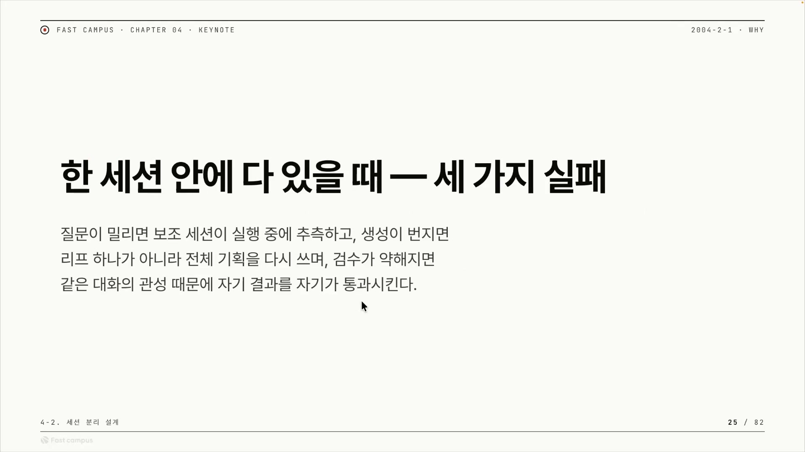
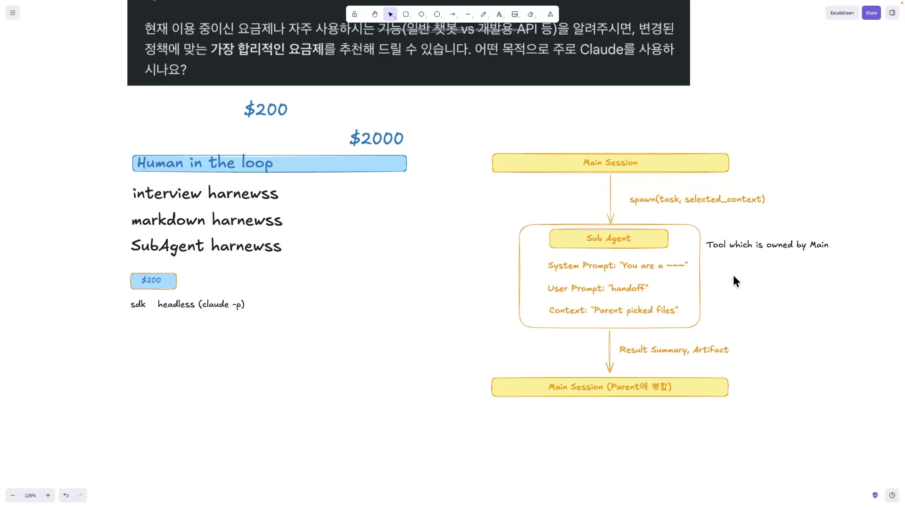
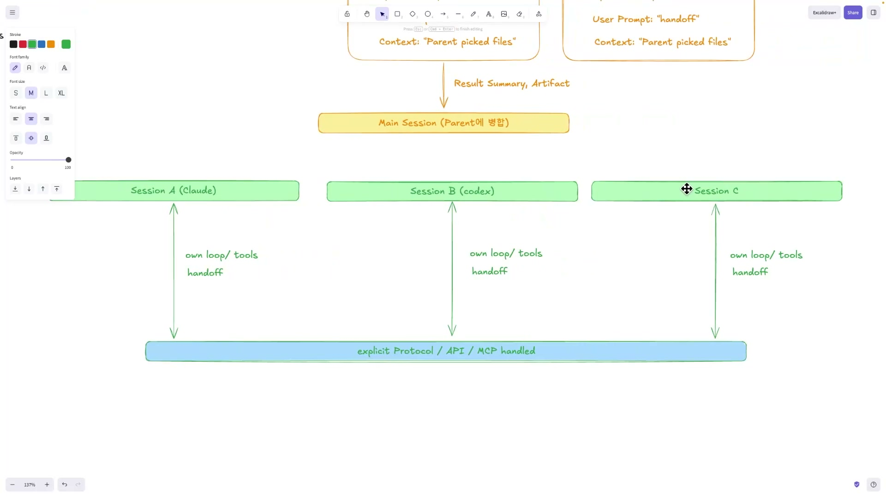
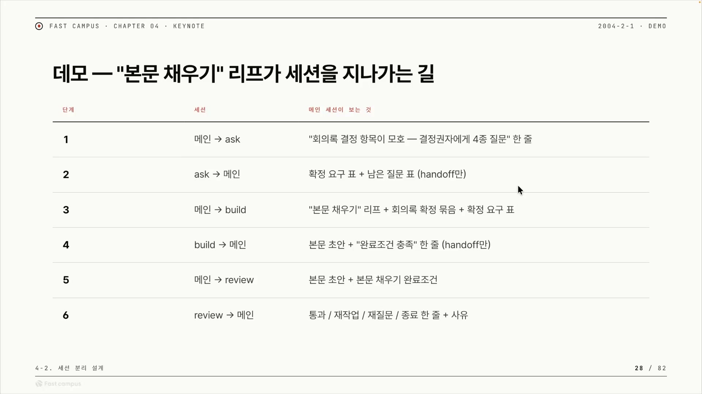

AI 코딩 에이전트에게 일을 시킬 때 우리는 보통 한 대화창에 모든 걸 쏟아붓는다. "이 회의록으로 기획안 좀 써줘"라고 하면, 에이전트는 같은 창 안에서 모호한 부분을 스스로 메우고, 본문을 채우고, 다 됐는지 스스로 점검한 다음 "완료했습니다"라고 내놓는다. 묻고, 만들고, 검사하기가 한 흐름에 들어 있다. 편하다. 그런데 이 편함이 정확히 문제의 출발점이다.

자기가 쓴 글을 자기가 교정해 본 사람은 안다. 오타가 눈에 잘 안 들어온다. 방금 그 문장을 왜 그렇게 썼는지 머릿속에 다 남아 있으니, 읽는 게 아니라 떠올리게 된다. 에이전트도 똑같다. 작성한 맥락이 그대로 남아 있는 상태에서 검수를 시키면, 결과물을 새로 읽는 게 아니라 "내가 이렇게 만들었으니 맞겠지" 하고 넘어간다. 검수가 통과 도장 찍는 절차로 전락한다.

이 글은 그래서 나온 한 가지 설계 원칙을 정리한 것이다. 질문(ask), 생성(build), 검수(review)를 한 세션에 몰아넣지 말고, 서로 다른 세션으로 나눠라.

## 한 세션에 다 몰면 무너지는 세 가지

한 곳에서 묻고 만들고 검수까지 하면 무엇이 망가지는가.

첫째, **추측이 끼어든다.** 질문해야 할 만큼 모호한 지점인데도, 에이전트가 작업을 멈추지 않고 그냥 "아마 이런 뜻이겠지" 하고 메워버린다. 확실하지 않은 자리를 확실한 척 채운 것, 이게 환각(hallucination)이다.

둘째, **그 추측이 도미노로 번진다.** 잘못 메운 값 하나가 다음 단계의 입력이 되고, 그걸 받은 부분이 또 그 위에 쌓는다. 잎(leaf) 하나가 틀린 데서 끝나지 않고, 그 잎에 연결된 가지 전체가 같이 무너진다. 회의록의 한 항목을 잘못 해석했을 뿐인데 기획안 전체를 다시 써야 하는 상황이 이렇게 생긴다.

셋째, **검수가 무력해진다.** 앞서 말한 자기 교정의 함정이다. 같은 대화 안에서 작업 과정의 시행착오와 자기 합리화를 다 지켜본 채로 검수에 들어가면, "이 맥락 안에서 작업했다"는 결론이 이미 머릿속에 박혀 있다. 그러니 결과만 냉정하게 보지 못하고 너그럽게 통과시킨다.

세 가지를 관통하는 한 단어는 편향(bias)이다. 한 세션의 컨텍스트가 그 세션이 겪은 시행착오로 채워진다는 것 자체가 리스크다. 그렇다면 해법은 단순하다. 검수를 작업 과정을 전혀 모르는 독립된 컨텍스트에 맡기면, "새 눈"이 결과만 보고 판정한다. 질문도 메인의 맥락에 오염되기 전에 떼어 놓으면 편향 없는 질문이 나온다. 세션 경계가 곧 편향과 환각을 막는 방화벽이 되는 셈이다.

## 나누는 두 가지 방식: 종속형과 분리형

"세션을 나눈다"는 말은 실제로 두 가지 다른 구조를 가리킨다. 둘은 겉모습이 비슷해 보이지만 핵심이 정반대다.

### 종속형: 서브에이전트

첫 번째는 서브에이전트(sub-agent) 방식이다. 메인 세션이 부모가 되어 자식 에이전트를 띄운다(spawn). 이때 부모는 자식에게 할 일(task)과 맥락(context)을 함께 넘긴다.

자식인 서브에이전트는 세 가지를 입력으로 받는다. 자기가 누구인지 정하는 시스템 프롬프트("You are \~"), 우리가 만들어 넘긴 핸드오프(handoff)인 유저 프롬프트, 그리고 부모가 골라 준 파일들로 이뤄진 컨텍스트다. 일을 마치면 결과를 부모에게 돌려준다. 통째로 돌려주는 게 아니라 결과 요약(result summary)이나 산출물(artifact) 형태로 압축해서 주고, 그게 부모에 병합되어 부모의 다음 출력에 영향을 준다. 이렇게 여럿을 띄우면 멀티 서브에이전트가 된다.

여기까지만 보면 자식이 독립된 일꾼처럼 보인다. 하지만 핵심은 정반대다. **서브에이전트는 분리된 것처럼 보여도 메인 세션에 종속돼 있다.** 자식의 컨텍스트 윈도우(context window)는 따로지만, 대화 기록 자체는 메인이 소유하고, 자식에게 줄 컨텍스트도 부모가 정하며, 돌려준 결과는 메인에 병합된다. 무엇보다 자식의 런타임 루프(runtime loop)가 따로 없다. 부모 오케스트레이터 아래의 하위 작업으로 돌 뿐이다.

이 종속성에는 양면이 있다. 좋은 쪽은 자식이 부모가 가진 툴을 그대로 물려받아 쓸 수 있다는 점, 구조가 간단하다는 점이다. 나쁜 쪽은 결과를 잘못 넘기는 순간 부모 상태를 오염시킬 수 있다는 점이다. "논리적으로는 분기돼 있다"고 쳐도, 자식이 내민 결과가 메인에 병합되는 한 오염이 흘러들 경로는 열려 있다.

### 분리형: 독립세션

두 번째는 독립세션(independent session) 방식이다. 여기엔 부모-자식 관계가 없다. 메인 세션을 따로 둘 수는 있지만 필수가 아니고, 동등한 독립 세션 여러 개가 나란히 존재한다.

각 세션은 자기 컨텍스트를 독립적으로 가지고, 서로 섞지 않는다. 공유가 필요하면 오직 명시적인 핸드오프 레이어, 즉 프로토콜이나 API, MCP(Model Context Protocol)를 통해서만 주고받는다. 그림에서 위쪽 세션들과 아래쪽 "explicit Protocol / API / MCP" 막대가 그 구조다. 세션끼리 직접 컨텍스트를 들여다보는 길은 없고, 모든 교환이 저 가운데 레이어를 거친다.

종속형과의 결정적 차이는 런타임 루프에 있다. 서브에이전트는 부모의 런타임 루프 안에서 돌았지만, 독립세션에는 그것들을 묶어 줄 런타임이 없다. **그러니 우리가 직접 런타임 루프를 만들어야 비로소 동작한다.** 이게 분리형의 진입 비용이자 본질이다.

우로보로스(Ouroboros)는 코덱스 앱에서도 클로드 코드에서도 돈다. 우로보로스만의 런타임이 세션 바깥에 따로 있기 때문이다. 런타임 루프가 특정 세션에 묶여 있지 않으니, 세션 자리에는 클로드가 와도 되고 코덱스가 와도 되고 헤르메스(Hermes)가 와도 된다. 그림의 Session A, B, C에 서로 다른 도구가 꽂혀 있는 게 그래서다. 다만 종속형과 달리 도구는 부모에게 상속받는 게 아니라 각 세션에 일일이 알려줘야 한다.

이 바깥 런타임이 결과를 합치고, 툴을 관리하고, 에이전트들의 라이프사이클을 돌보고, 세션 사이의 메모리 동기화까지 맡는다면, 그건 사실상 하나의 프로그램이다. 강의는 이걸 "에이전트 OS(Agent OS)"라 부른다. 우로보로스가 스스로를 에이전트 OS라 칭하는 것과 같은 관점이다. 우로보로스는 인터뷰어가 코드 실행과 분리된 독립 에이전트로 동작해 MCP로 질문을 가져오고, 헤르메스는 자체 런타임을 갖춰 재시작해도 전부 기억하며, 오마이 오픈에이전트(Oh My OpenAgent)는 스킬마다 자체 MCP 서버를 작업 범위로 격리해 띄워 컨텍스트 오염을 막는다. 세 도구 모두 자체 런타임, 독립 세션, MCP · 프로토콜 연결, 재시작에도 살아남는 상태라는 같은 골격을 공유한다.

| 항목 | 종속형 (서브에이전트) | 분리형 (독립세션) |
|---|---|---|
| 메인 세션 | 있음, 부모가 소유 | 없어도 됨 |
| 런타임 루프 | 부모 아래 하위 작업 | 직접 구축, 자체 런타임 |
| 컨텍스트 | 각자 별도, 단 결과가 메인에 병합(오염 경로) | 각자 독립, 병합 없음 |
| 연결 방식 | 부모-자식 spawn | 프로토콜 · API · MCP 핸드오프 |
| 도구 | 부모 것 상속 | 세션마다 알려줘야 함 |
| 대표 사례 | 클로드 코드 서브에이전트 | 우로보로스, 헤르메스, 오마이 오픈에이전트 |

여기서 한 가지 분명히 해 둘 게 있다. 강의는 이 설계의 배경으로 앤트로픽(Anthropic)의 요금 개편을 깔았다. 자동 · 백그라운드로 도는 사용에 비용이 더 붙을 것이고, 그러니 클로드 코드 하나에 종속되지 말고 다른 런타임으로 갈아탈 수 있어야 한다는 위기감이었다. 그런데 그 개편은 2026년 6월 15일 시행 당일 전면 중단됐다. SDK나 헤드리스 호출에 크레딧을 따로 차감한다던 정책은 현재 적용되지 않는다. 그러니 세션을 나눌 이유의 무게를 비용에 두면 글이 통째로 어긋난다. 진짜 이유는 비용이 아니라 품질, 곧 앞에서 본 편향과 환각의 차단이다.

## 세션마다 역할을 정한다: ask, build, review

나누기로 했으면, 각 세션이 무엇을 맡고 무엇을 받으면 안 되며 무엇을 핸드오프로 남길지를 정해야 한다. 묻고, 만들고, 검사하기를 메인 세션이 지휘하는 네 역할로 쪼갠 설계는 이렇다.

| 세션 | 맡는 일 | 받으면 안 되는 것 | 남길 핸드오프 |
|---|---|---|---|
| 메인 (런타임 루프) | 전체 목표, 현재 상태, 다음 결정을 보존하는 방향키 | 일회성(disposable) 메모리, 자잘한 작업 부스러기 | 상태판, 즉 어떤 상태이고 무엇을 결정했고 무엇이 남았는지 |
| ask (질문) | 모호한 지점에 대한 질문 생성 | 초안 생성, 임의 해석 | 질문 목록 |
| build (생성) | 본문이나 코드 작성 | 버그 수정 같은 남의 일 | 무엇을 했는지, 받은 task를 제대로 수행했는지 |
| review (검수) | 독립 컨텍스트에서 결과가 목적 · 범위 · 완료조건을 만족하는지 판정 | 작업 과정의 편향 | 통과, 재작업, 재질문, 종료 중 무엇인지 |

표에서 정말 곱씹을 칸은 가운데, "받으면 안 되는 것"이다. 각 역할이 무엇을 하느냐보다 무엇을 떠안지 말아야 하느냐에 이 설계의 핵심이 들어 있다.

**메인은 방향키다.** 전체 목표와 현재 상태, 다음 결정만 들고 있는 상태판 역할이다. 그래서 자잘한 시행착오, 곧 일회성 메모리를 받으면 안 된다. 부스러기까지 떠안는 순간 메인의 컨텍스트가 시행착오로 오염되고, 그게 바로 처음에 본 편향의 입구다. 코덱스나 클로드의 `goal` 명령어가 메인 세션에 목표를 계속 주입해 "아, 내가 이걸 하고 있었지" 하고 방향을 다시 잡게 해주는 것이 이 방향키 역할의 좋은 예다.

ask는 질문만 한다. 질문하라고 보냈더니 초안과 임의 해석까지 멋대로 만들어 오면 안 된다. 모호한 자리를 메우지 말고 그냥 질문 목록만 핸드오프로 남기는 게 ask의 일이다.

**build는 만들되, 배운 건 워커끼리만 나눈다.** 빌드 워커들끼리는 "나 이런 실수 했으니 너넨 하지 마" 같은 학습을 공유할 수 있다. 요즘 말하는 컴파운드 엔지니어링(compound engineering), 즉 매번 더 잘 만드는 시스템을 쌓는 것이 이 좁은 맥락에서 나온다. 단, 그 실수 기록을 ask나 review 같은 다른 역할에 흘리면 안 된다. 검수자가 작성자의 변명을 미리 들어버리면 새 눈이 흐려지기 때문이다.

**review는 새 눈으로 합격 · 불합격을 가른다.** 독립된 컨텍스트가 필수다. 작업 과정을 모르는 상태에서 결과물만 보고 목적 · 범위 · 완료조건을 만족하는지 판정한다. 핸드오프로는 통과인지, 재작업인지, 남은 질문이 있는지, 종료해도 되는지를 남긴다. 작업을 끝내도 되는지 판단하는 스탑룰(stop rule)까지 review가 가져가도 된다.

추상적인 역할 분담이 실제로 어떻게 흐르는지는 회의록으로 기획안을 쓰는 작업에서 따라가 볼 수 있다.

메인이 먼저 ask 서브에이전트를 소환해 "모호한 부분을 질문으로 만들어 달라"고 시키면, ask는 질문 목록만 돌려준다. 메인은 그 질문과 답을 묶어 build에 넘기고, build는 본문을 채워 돌려준다. 메인은 그 초안을 다시 review에 넘기고, review는 완료조건을 만족하는지 판정해 통과 여부를 메인에 돌려준다. 메인이 허브, ask와 build와 review가 스포크인 구조다. 주목할 점은 표의 오른쪽 칸이다. 단계마다 메인이 받는 것은 대화 전문이 아니라 "확정 요구 표", "완료조건 충족 한 줄" 같은 압축된 한 장이다. 보조 세션이 겪은 과정은 거기 들어가지 않는다.

## 결국은 회수 양식이다

세션을 나누는 기술 자체는 절반일 뿐이다. 나눴으면 흩어진 결과를 어떻게 다시 받아내느냐가 남는다. 메인 세션이 보조 세션의 대화 전문을 들고 있지 않으려면, 보조 세션이 돌려줄 한 장의 형식이 미리 정해져 있어야 한다. 이 핸드오프 출력 형식을 정하는 것이 하네스 엔지니어링에서 가장 중요한 역할을 한다.

여기서 결정성(deterministic)이 갈린다. LLM 모델 자체는 확률적이라 같은 입력에도 답이 흔들린다. 모델은 못 믿는다. 하지만 세션 사이를 오가는 핸드오프를 정해진 출력 형식으로 강제하면, 경계를 흐르는 데이터는 규격화된다. 그 규격 위에 검증과 자동화를 얹을 수 있다. 하네스 엔지니어링의 정의 자체가 "확률적 모델을 감싸는 결정론적 소프트웨어 레이어"인데, 핸드오프 양식이 바로 그 레이어의 인터페이스다. 모델은 못 믿어도 형식은 믿을 수 있게 만드는 것, 그것이 결정성의 실체다.

그러고 보면 이 글은 한 바퀴를 돈 셈이다. 편향과 환각이 한 컨텍스트 안에서 번지는 걸 막으려고 세션을 나눴고, 나누고 나서는 흩어진 결과를 정해진 양식으로 다시 묶었다. 떼어내는 것과 규격으로 잇는 것은 한 쌍이다. 세션 분리는 수단이고, 진짜 본질은 나뉜 결과를 정해진 양식으로 회수해 재현 가능하게 만드는 데 있다.
