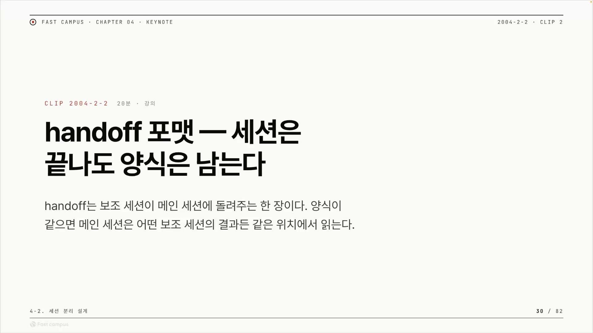
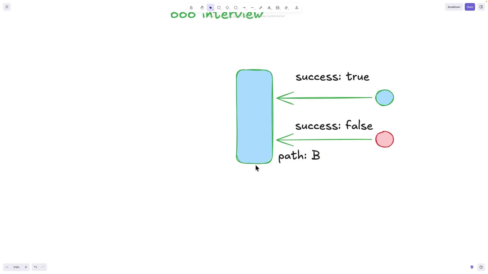
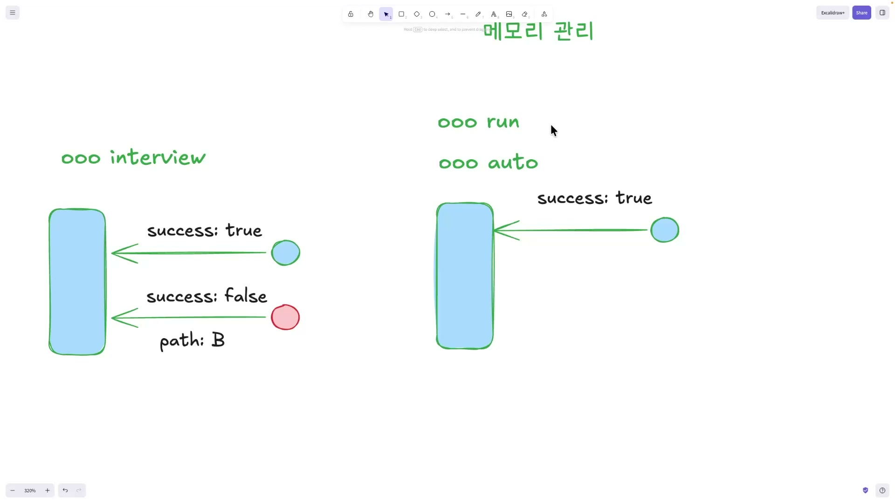
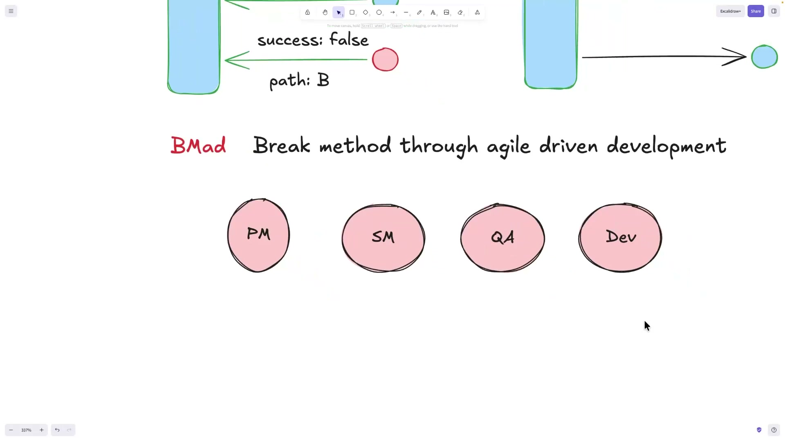
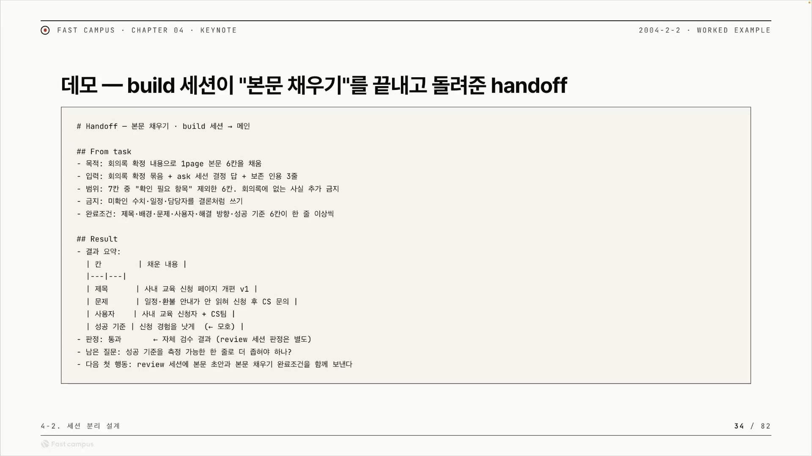
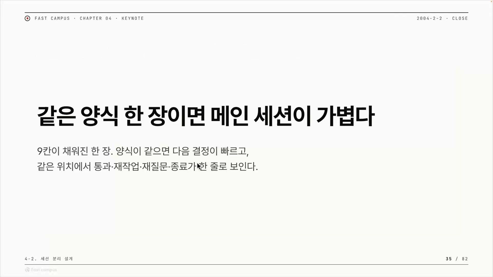

서브에이전트에게 일을 시키고 결과를 돌려받는 구조를 짜다 보면, 한 가지 사실이 점점 분명해진다. 작업이 끝난 세션은 버려진다. 그 안에서 오갔던 대화, 중간 계산, 임시 메모는 세션이 닫히는 순간 같이 사라진다. 그런데 그 세션이 메인에게 넘긴 결과 한 장은 남아서 다음으로 이어진다. 강의는 이 대비를 한 줄로 못박는다. "세션은 끝나도 양식은 남는다."



그래서 진짜 설계해야 하는 건 세션의 기억이 아니라, 세션이 넘기는 그 한 장의 양식이다. 이 양식을 어떻게 고정하느냐가 강의가 말하는 하네스 엔지니어링의 핵심이다.

## 출력 형식을 고정하지 않으면 모든 게 LLM에게 돌아간다

용어부터 풀어 둔다. 에이전트는 모델 하나로 돌아가지 않는다. 모델(LLM)은 안에서 확률적으로 답을 내고, 그 바깥을 감싸 모델의 행동을 받아 검증하고 실행하고 기록하는 고정된 틀이 따로 있다. 이 틀을 하네스(harness)라고 부르고, 이 틀을 잘 짜는 일이 하네스 엔지니어링이다. 모델은 같은 질문에도 매번 조금씩 다르게 답하지만, 하네스는 늘 같은 규칙으로 그 답을 처리한다. 신뢰할 수 있는 에이전트는 이렇게 흔들리는 모델을 흔들리지 않는 바깥 틀로 감싸서 만든다.

서브에이전트가 일을 끝내고 결과를 돌려줄 때, 그 결과를 어떤 모양으로 받을지가 바로 이 하네스가 책임지는 일이다. 강의는 여기를 가장 중요한 지점이라고 본다. 이유는 인과를 따라가 보면 분명하다.

```
서브에이전트가 일을 끝냄
   ↓ 결과를 받아야 함
결과를 "어떤 양식으로" 받을지가 안 정해져 있으면
   ↓
메인 세션이 그 들쭉날쭉한 결과의 뜻을 LLM 해석에 맡겨 판단함
   ↓ LLM 해석은 매번 흔들림(확률적)
deterministic(같은 입력 → 같은 처리)이 깨짐
```

코드는 정해진 모양만 읽는다. "success" 같은 칸이 늘 같은 자리에 있으면 코드가 그 한 줄을 읽고 다음을 정할 수 있지만, 결과가 매번 다른 자유 문장으로 오면 "이 글이 성공을 뜻하는 건가"를 코드가 판단하지 못한다. 그 판단을 누가 하느냐. 결국 LLM이다. 결과 자체는 어차피 메인 세션의 LLM에게 들어가 읽힌다. 문제는 형식이 정해져 있지 않으면 그 뜻을 가려내 다음을 정하는 일까지 LLM의 해석에 기대게 된다는 점이다. LLM의 판단은 같은 입력에도 흔들릴 수 있으니, 그 순간 deterministic이라는 단어 자체를 못 쓰게 된다.

"그럼 그 평가를 아예 LLM한테 맡기면 되지 않나" 하는 생각이 자연스럽게 든다. 한 LLM이 다른 LLM의 출력을 채점하게 하는 방식을 LLM as a Judge라고 한다. 입력과 출력과 채점 기준을 주고 점수나 판정을 받는 것이다. 강의는 이걸 부정하지는 않되, 상시 수단으로 삼을 수는 없다고 본다. 평가 한 번이 곧 또 한 번의 LLM 호출이기 때문이다. 검사하려고 매번 사람을 한 명 더 부르는 격이라, 단계마다 그걸 붙이면 비용과 지연이 쌓이고 평가 자체도 확률적으로 흔들린다.

그래서 강의가 권하는 방향은 출력 형식을 미리 고정하는 것이다. 양식이 일정하면 정해진 칸을 코드가 늘 같은 자리에서 같은 방식으로 읽어 분기할 수 있고, 매 중간 결과의 뜻을 LLM에게 다시 판단시키지 않아도 된다. 핵심은 LLM을 코드로 완전히 걷어내는 게 아니라, 단계마다 LLM의 해석에 기대던 부담을 덜어 내는 데 있다. 그러면 사람이 매 결과를 들여다보며 "이거 성공이야? 다음에 뭐 하지?"를 판단할 필요가 줄어든다. 양식을 고정한다는 기술적 선택이 결국 사람의 감시 비용을 줄이는 데로 이어진다.

## 에러를 사고가 아니라 데이터로 받는다

추상적인 원리를 구체적인 그림으로 옮겨 보자. 강의가 든 예시는 우로보로스(Ouroboros)라는 에이전트 도구의 인터뷰 단계다. 우로보로스는 `ooo`라는 트리거로 부르는 스킬 묶음으로, `ooo interview`를 치면 인터뷰 스킬이 돌면서 사용자에게 물을 질문을 만들어 낸다. 그 질문이 메인 세션으로 돌아오는 것이 곧 핸드오프다.

문제는 보조 세션이 늘 깨끗한 질문만 돌려주리란 보장이 없다는 점이다. 버그가 나서 질문이 비거나, 엉뚱한 게 올 수 있다. 보통 프로그램에서 이런 실패는 갑자기 터지는 사고(예외)다. 그러면 받는 쪽은 매번 "이건 무슨 에러지"를 따로 해석해야 한다. 모양이 제각각이니까.

강의의 답은 단순하다. 에러 형식만 잘 잡아 주면 된다. 결과 봉투 맨 위에 `success`라는 칸을 항상 두고, 거기에 `true` 또는 `false`만 들어가게 한다. 메인 세션은 봉투를 열면 제일 먼저 이 한 줄을 본다.



여기서 발상의 핵심이 나온다. **실패를 갑자기 터지는 사고가 아니라, 미리 정해 둔 칸에 담긴 데이터의 한 값으로 다룬다.** 성공 봉투와 실패 봉투의 겉모양이 똑같다. 잘 됐으면 `success: true`, 잘못됐으면 `success: false`라고 적힌 같은 모양의 봉투가 온다. 그래서 메인 세션은 사고를 수습하는 게 아니라, 값을 읽고 갈림길을 고르는 단순 작업만 하면 된다.

`success: false`일 때 그냥 멈추는 것도 아니다. 다이어그램에는 실패 쪽 화살표 아래에 `path: B`가 붙어 있다. 실패하면 정해진 다음 경로로 넘긴다는 뜻이다. 강사의 설명을 그대로 옮기면, false일 때 한쪽 경로는 MCP(Model Context Protocol, 외부 도구나 데이터에 연결하는 표준) 형태로 넘기고, 다른 경로는 "메인 세션이 알아서 진행해라"로 우회한다. 두 경로의 정확한 역할 구분까지는 이 발췌만으로 단정하기 어렵지만, 핵심은 분명하다. 실패조차 다음 행동이 정해져 있다.

형식이 이렇게 고정되면 한 가지가 따라온다. 분기를 코드로 짤 수도 있지만, 형식이 늘 같으니 "이 봉투 읽고 알아서 다음 거 해"를 메인 세션의 LLM에게 그냥 맡겨도 흐름이 깨지지 않는다. 헷갈릴 여지가 없기 때문이다. 강사의 말대로, 출력 형식이 똑같았을 때 비로소 LLM에게 시켜도 되는 상황이 만들어진다. 형식 표준화가 자동화의 전제조건인 셈이다.

## 형식을 모르고 만들면 새 기능이 옛 도구를 멈춰 세운다

지금까지가 "형식을 고정하라"는 성공 원칙이라면, 강의는 바로 이어서 그걸 안 지켰을 때 실제로 무슨 일이 벌어지는지를 자기 경험으로 보여 준다. 이 실패담이 글에서 가장 설득력 있는 장면이다.

먼저 등장인물을 정리한다. 골(goal) 모드는 에이전트에게 "이게 끝나면 작업 완료"라는 목표 조건을 박아 두는 방식이다. 매 턴이 끝날 때마다 작은 평가 모델이 "조건 충족됐어?"를 검사하고, 아직이면 다음 턴을 또 돌린다. 사람이 매번 "계속해"라고 안 쳐도 목표까지 알아서 굴러간다. 오토(Auto)는 그 골을 따라잡자고 만든 자동 진행 기능으로, 목표가 안 끝났으면 멈추지 않고 다음 작업으로 자동 연결한다. 둘 다 Codex CLI의 기능이다.



사고는 이렇게 났다. 강사는 원래 `ooo run`이라는, 실제 실행을 돌리는 기능을 직접 구현해 뒀다. 이 run은 워낙 오래 걸린다는 걸 알고 있어서, 스킬에 "절대 기다리지 마, 기다리지 말고 상태 체크를 따로 해"라고 적어 뒀다. 던져 놓고 메인 세션은 거기 붙잡혀 있지 말라는, 비동기 설계다.

그런데 새로 만든 오토는 이 run의 출력 형식을 모른 채 만들어졌다. run이 "나 오래 걸려, 이건 정상이야"라고 말해 줄 약속이 없었다. 그러니 결과를 기다리던 쪽에서 타임아웃이 연달아 터졌다. 타임아웃은 보통 "이 정도 시간 안에 답 오겠지" 하고 잡아 둔 제한 시간이고, 그 시간이 지나면 시스템은 으레 "실패했다"고 처리한다. 오토는 이 타임아웃을 실패로 읽고 멈춰 버렸다. 자동으로 굴러가던 게 급제동이 걸린 것이다. 강사 말로 "블록이 되면 오토가 브레이크가 밟힌 것"인데, 그러면 자동 진행이라는 효용 자체가 사라진다.

고친 방법은 코드를 크게 뜯는 게 아니었다. 타임아웃이라는 값의 의미를 다시 정의한 것이다.

| 구분 | 고치기 전 | 고친 뒤 |
|---|---|---|
| 타임아웃의 의미 | 제한 시간 초과 = 실패 | 얼마나 걸릴지를 어림으로 알려 주는 추정값 |
| 메인 세션의 반응 | 타임아웃 뜨면 멈춤(블록) | 추정 시간이 끝나도 기다리지 말고 계속 진행 |
| 결과 | 오토가 브레이크 밟혀 정지 | 정상적으로 돈 결과를 얻음 |

타임아웃을 "정확히 몇 초"가 아니라 "한 이 정도쯤 걸리지 않을까"라는 눈대중 추정값으로 보면, 그 시간이 지났다고 작업이 망한 게 아니다. 그냥 어림보다 좀 더 걸리는 것뿐이다. 그래서 "추정 시간이 끝나도 기다리지 말고 진행해"로 약속을 바꾸자, run이 오래 걸리는 게 더 이상 실패 신호로 오인되지 않아 멈춤이 사라졌다.

교훈은 두 갈래로 읽힌다. 첫째, 에이전트끼리 협업할 때 "성공/실패"만 형식으로 정하면 부족하다. "아직 진행 중", "오래 걸림" 같은 신호도 똑같이 1급 시민으로 형식에 넣어야 한다. 안 그러면 받는 쪽이 침묵을 실패로 오해한다. 둘째, 타임아웃은 본질적으로 사실이 아니라 약속이다. 시간 초과가 곧 실패라는 건 우리가 정한 해석일 뿐이라, 같은 숫자도 약속을 바꾸면 멈춤이 아니라 진행 신호가 된다. 출력 형식 통일은 예쁘게 정리하는 일이 아니라 사고를 막는 일이라는 게 이 사례의 결론이다.

## 다음 행동을 비워 두면 결국 만능 하나만 부르게 된다

좋은 핸드오프는 성공/실패만 알려 주는 데서 그치지 않는다. "그래서 이제 뭘 해야 하는지"까지 적어 준다. 이 칸을 비워 두면 그 빈자리를 사람이 채워야 한다. 결과 한 장을 받고 "이게 성공인가 실패인가, 막힌 건가"를 판정하고, "그럼 이제 누구를 부르지"를 고르는 일이 매번 사람 머리로 돌아온다. 이 부담이 쌓이면 어떻게 망가지는지, 강의는 비매드(BMAD)를 "제일 좋은 나쁜 예시"로 든다.



비매드는 역할별 에이전트를 여러 개 둔다. PM(기획), Scrum Master(스토리 준비), QA(품질 검수), Dev(개발) 식으로. 역할을 나눈 것 자체는 좋은 분리다. 문제는 한 에이전트가 일을 끝내고 결과를 마크다운으로 위임해 버리는데, 그 결과만 봐서는 지금 상황에서 다음에 누구를 불러야 하는지를 알 수 없다는 점이다. 다음 담당자를 고르는 라우팅이 양식에 안 박혀 있으니 그 판단이 사람에게 떨어진다.

그다음이 안티패턴의 핵심이다.

```
역할 에이전트는 여럿(PM/SM/QA/Dev) 있는데
   ↓ 결과만 보고는 "다음에 누구?"를 모름
사람이 헷갈려서 둘을 같이 불러 보거나
   ↓ 그것도 지치니까
"아무거나 다 시킬 수 있는" 마스터 하나만 부르게 됨
   ↓
결국 호출이 그 마스터 하나로 수렴
   ↓
역할을 나눠 둔 이점이 통째로 사라짐
```

만능 하나로 수렴하는 순간, 세션을 나눈 목적이 무너진다. 각 역할이 좁은 일만 결정론적으로 처리하게 해서 검증을 쪼개려던 것이었는데, 모든 게 한 에이전트의 자유재량으로 돌아가니 다시 통제 안 되는 거대한 블랙박스가 된다. 강의가 이걸 가장 주의해야 할 갓 에이전트(god agent)라고 부르는 이유다.

여기서 오해하면 안 되는 게 있다. 갓 에이전트는 증상이지 병이 아니다. 병은 결과물이 다음 행동을 지정하지 않는 마크다운 위임이다. 비매드가 역할을 잘못 나눠서가 아니라, 넘겨주는 양식이 "다음 행동"을 비워 둬서 라우팅 부담이 사람에게 떨어진 것이 화근이다. 강의도 균형을 잡는다. 이건 옛 버전(v4)의 이야기이고, 요즘 비매드는 v6가 되면서 스킬 기반으로 엄청 좋아졌다고 분명히 덧붙인다. 다만 비매드의 철학 자체가 "방향은 사람이 정한다"라서 자동 라우팅이 쉽지 않다는 단서도 함께 단다. 그러니 논지는 "비매드가 나쁘다"가 아니라 "다음 행동을 사람이 정하게 둔 설계가 나쁘다"이다.

해독제는 단순하다. 핸드오프 첫 줄만 보고 다음 세션이 바로 시작되게 만든다. 우로보로스가 실물 사례다. 인터뷰가 끝나면 "다음은 무엇", 그다음 단계가 끝나면 또 "다음은 무엇" 식으로 매 단계가 다음 단계를 가이드로 내려준다. 다음 세션 입장에서 무엇이 바로 진행될지가 정해져 있으니 사람이 끼어들 일이 없다. 앞서 사고가 났던 오토 기능도 사실 여기서 나왔다. 각 단계가 다음 단계를 명시하니 그 전체를 끊김 없는 한 흐름으로 이어 붙일 수 있게 되고, 그 자동 흐름이 곧 오토다. 오토는 별도 마법이 아니라 "다음 행동을 양식이 정한다"의 자연스러운 귀결이다.

좋은 핸드오프와 나쁜 핸드오프를 칸으로 끊으면 이렇게 갈린다.

| 구분 | 나쁜 handoff | 좋은 handoff |
|---|---|---|
| 길이 | 대화 전문 전체 | 한 장, 표와 한 줄 판정 |
| 다음 행동 | 읽고 사람이 다시 정해야 함 | 첫 줄만 보고 다음 세션이 시작 |
| 남은 질문 | 본문 어디엔가 흩어져 있음 | "남은 질문" 칸에 따로 모여 있음 |
| 판정 | "잘 됐다 / 안 됐다" 같은 말투 | 통과 / 재작업 / 재질문 / 종료 중 하나 |

판정 칸의 차이가 특히 중요하다. "음, 대체로 괜찮은데 좀 아쉬워요" 같은 자유로운 말투는 코드가 못 읽는다. 의미를 알려면 또 LLM을 불러야 하고, 그러면 앞에서 본 "예측 못 한 형식 → LLM 의존 → 결정론 붕괴" 사슬로 돌아간다. 반면 판정을 정해진 값 중 하나(enum)로 잡으면, 코드가 글자 그대로 비교해 분기할 수 있다. `PASS`면 다음 단계, `RETRY`면 같은 일 다시, 하는 식이다. 강사의 말로 "판정은 enum 값으로 타입이 나눠져야 하는데, 좋다 안 좋다로 되면 정량화되지 않고 하네스 엔지니어링하기에 좋지 않다." 값이 유한한 집합이면 "100번 중 통과 몇 번"처럼 셀 수 있고, 셀 수 있어야 하네스의 성능을 측정하고 개선할 수 있다.

남은 질문 칸도 같은 역할이다. 강의는 남은 질문이 본문 어디엔가 흩어져 있으면 비매드와 비슷하다고, 한곳에 모아 둬야 한다고 못박는다. 흩어진 정보를 사람이 긁어모으는 것 자체가 인지부하이기 때문이다. 결국 좋은 핸드오프는 사람이 떠안던 "판정하고 라우팅하는" 일을 양식 안으로 끌어와 비워 두지 못하게 하는 장치다.

## 같은 마크다운도 지시문으로 쓰면 흔들리고 계약서로 쓰면 고정된다

이 모든 양식을 담는 그릇은 마크다운이고, 그 위의 YAML이다. 마크다운은 사람도 읽고 기계도 읽는 중간 지대다. 사람에겐 평범한 글처럼 보이지만 `#` 헤더, `-` 불릿, 표 같은 구조 기호가 박혀 있어서 코드가 "어느 줄이 무슨 칸인지"를 집어낼 수 있다. 요즘 에이전트에게 일과 규칙을 넘기는 통로가 `AGENTS.md`, `CLAUDE.md` 같은 마크다운 파일로 굳어지고 있는 것도 같은 이유다.

그런데 강의는 같은 마크다운 한 장이라도 두 가지로 쓸 수 있다고 가른다. 자연어 지시문으로 쓰느냐, 계약서로 쓰느냐다.

| | 자연어 지시문으로 쓸 때 | 계약서로 쓸 때 |
|---|---|---|
| 모양 | `## 다음 행동` 밑에 "알아서 잘 처리해 줘" | `next_action: RETRY`처럼 정해진 키와 값 |
| 받는 쪽의 처리 | 그 자유 문장의 뜻을 알려고 LLM을 또 호출 | 코드로 곧장 분기 |
| 결과 | 매번 흔들림, 결정론 불가 | 흔들림 없음, 결정론 |

`## 다음 행동` 밑에 "상태를 다시 확인하고 필요하면 재시도한다"라고 자유 문장으로 쓰면, 사람은 알아듣지만 코드가 이 문장에서 "재시도하라는 거야?"를 끄집어내려면 결국 LLM에게 다시 해석을 시켜야 한다. 같은 내용을 `next_action: RETRY`라고 쓰면, `next_action`이라는 키에 `RETRY`라는 정해진 값 하나가 딱 들어가서 코드가 그 한 줄만 읽으면 끝이다. 해석할 게 없다. 강사가 마크다운을 넘어 YAML을 말하는 이유가 이것이다. 마크다운은 구조의 틀을 주고, YAML은 거기에 키와 값의 형태까지 못박는다. 그래서 한 단계 더 계약서답다.

강사는 4C 프레임워크를 들며 "마크다운을 그냥 자연어라고 생각하고 뭐 하라고 쉽게 넘기는 거로 보면 안 된다"고 말한다. 다만 강의가 4C의 네 항목을 구체적으로 밝히지는 않으니, 여기서는 그 프레임워크의 정확한 내용을 단정하지 않고 강의가 빌려 쓴 취지만 받는다. 핵심은 한 문장이다. 마크다운을 자연어로 쓰면 판단의 부담이 사람이나 LLM에게 떠넘겨지고, 계약서로 쓰면 그 부담이 코드의 자동 분기로 흡수된다. "쉽게 넘기지 마라"는 "받는 쪽이 다시 해석하게 만들지 마라"는 뜻이다.

그리고 한 칸 더 간다. 행동만 정하는 게 아니라 돌려줄 결과의 칸과 필드와 값의 형태까지, 즉 출력 스키마까지 미리 못박으면, 받는 쪽이 그 결과를 코드로 읽어 들일 수 있다. 이게 단순한 정리용이 아니라 검증의 토대가 되는 지점으로 이어진다.

## 출력 형식이 에이전트의 거짓말을 코드로 잡는다

강의는 회의록을 던지면 기획안 한 장을 뽑는 데모로 닫는다. 여기서 빌드(build) 서브에이전트가 본문을 채우고, 그 결과를 메인 세션에 핸드오프로 돌려준다.



이 한 장이 앞에서 말한 "좋은 핸드오프"의 완성형이다. 자유서술이 아니라 칸이 정해진 한 장이고, 받은 지시(From task)와 실제 한 일(Result)이 같은 문서 안에 나란히 들어 있다. From task에는 목적, 입력, 범위, 금지, 완료조건이 적혀 있고, Result에는 결과 요약 표와 판정, 남은 질문, 다음 첫 행동이 적혀 있다. 눈여겨볼 칸이 둘 있다. 성공 기준 칸에는 "신청 경험을 낫게"라고 적고 그 옆에 "(← 모호)"라고 스스로 표시해 뒀다. 판정 칸에는 "통과"라고 적되 "← 자체 검수 결과, review 세션 판정은 별도"라고 단서를 달았다. 자기가 낸 판정과 별도의 검수 판정을 구분해 둔 것이다.

이 구조가 왜 중요한가. 지시와 결과가 한 장에 나란히 있으면, 에이전트가 "이거 했다"고 적은 주장을 실제 결과물과 대조할 수 있다. LLM은 확률적이라 실제로 하지 않은 일을 했다고 그럴듯하게 적을 수 있다. 핸드오프에는 "이 제목을 이렇게 채웠다"고 적혀 있는데 실제 파일을 열어 보니 그 제목이 없다. 주장과 산출물이 맞지 않는다.

보통은 이걸 어떻게 잡나. 형식이 제각각이면 "에이전트가 진짜 했는지"를 확인하려고 또 다른 LLM에게 물어야 한다. 한 번의 LLM 호출이 더 붙고, 그 검사 자체도 틀릴 수 있다. 그런데 출력 형식이 칸으로 고정돼 있으면 코드가 직접 대조할 수 있다.

```
핸드오프가 주장한 값          실제 파일 상태            코드의 판정
─────────────────────────    ─────────────────────    ──────────
"제목 채움: 'OOO'"       vs   파일에 'OOO' 없음      →  거짓 → 재작업
판정: 통과               vs   review 통과 기록 없음  →  불일치 → 재작업
완료조건: 6칸 채움       vs   파일에 4칸만 채워짐    →  미완료 → 재작업
```

코드는 "이 자유서술이 성공을 뜻하나"는 못 읽지만, "핸드오프의 제목 칸 값이 실제 파일 안에 글자 그대로 들어 있나"는 읽을 수 있다. 후자는 단순 문자열 대조라 결정론적이다. 형식이 칸으로 고정돼 있어서 어디를 비교할지가 정해져 있기 때문에 가능한 일이다. 강사의 말로, 실제 에이전트가 했는지 안 했는지를 LLM에게 여쭙는 게 아니라 출력 형식이 잘 만들어져 있다면 코드로 검증할 수 있고, 그게 되면 에이전트의 거짓말을 코드로써 잡아낼 수 있게 된다.

여기까지 오면 처음의 명제가 한 바퀴 돌아 닫힌다. 출력 형식을 고정하라는 말이 결국 무엇을 위한 것이었나. 강사가 마지막에 정리한 효과는 네 가지다. 출력 형식이 항상 같으면 결과가 다음 흐름에 영향을 주지 않으니 흐름이 안정되고(첫째), 메인 세션이 서브에이전트가 내부적으로 무슨 도구를 어떻게 불렀는지를 일일이 이해하지 않아도 정해진 칸만 보고 분기하면 되니 해석이 필요 없고(둘째), 그 덕에 멈춰서 재해석할 일이 없어 흐름이 빠르고 매끄럽고(셋째), 사람이 리뷰할 때도 통과, 재작업, 재질문, 종료 중 무엇인지를 같은 자리에서 한 줄로 판단할 수 있다(넷째).



봉투 안을 다 읽지 않고 겉면의 도장만 보고 다음 칸으로 보낸다. 내용을 이해하는 게 아니라 형식을 맞추는 것이라, 어떤 서브에이전트의 결과든 같은 코드 경로로 흘러간다. 그래서 같은 양식 한 장이면 메인 세션이 가볍다. 세션은 끝나면 버려지지만, 그 양식 한 장이 남아 다음을 결정론적으로 굴린다는 것, 그게 이 강의가 핸드오프 포맷 설계로 도달한 결론이다.
