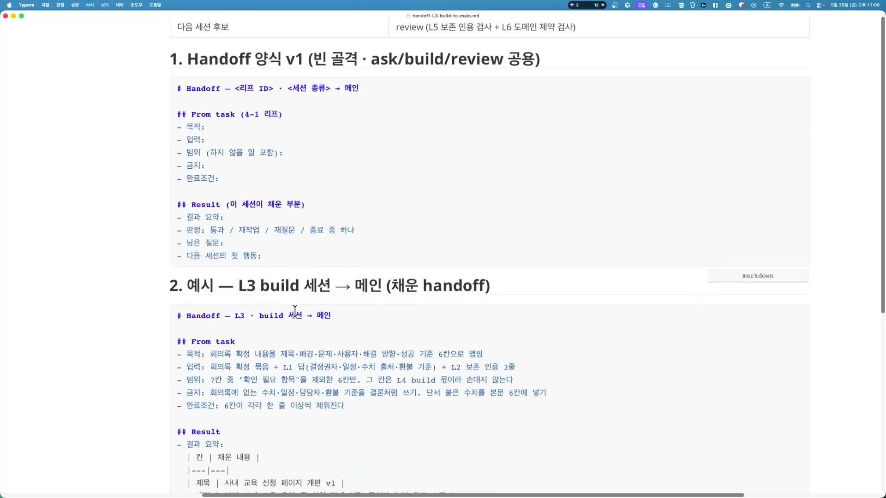
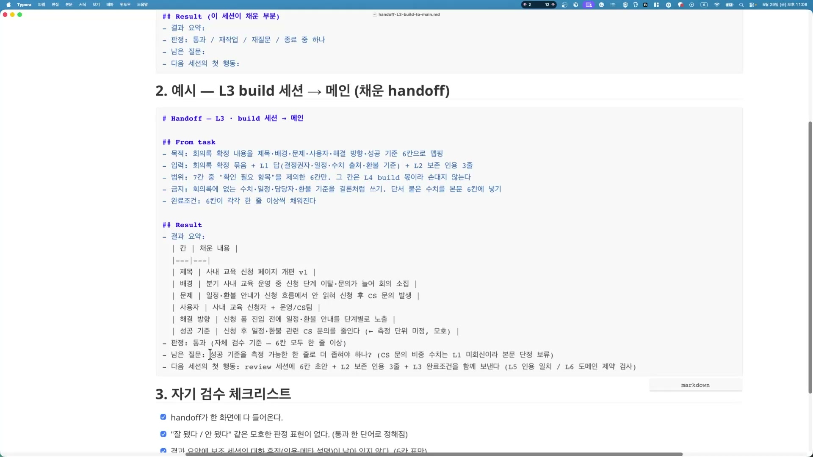
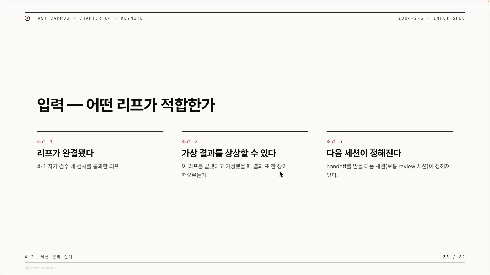
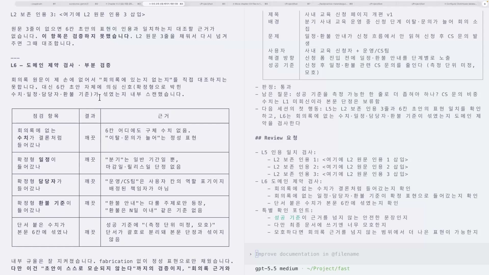
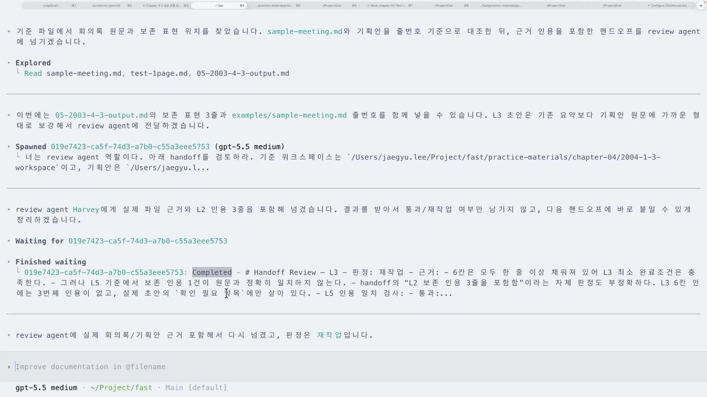
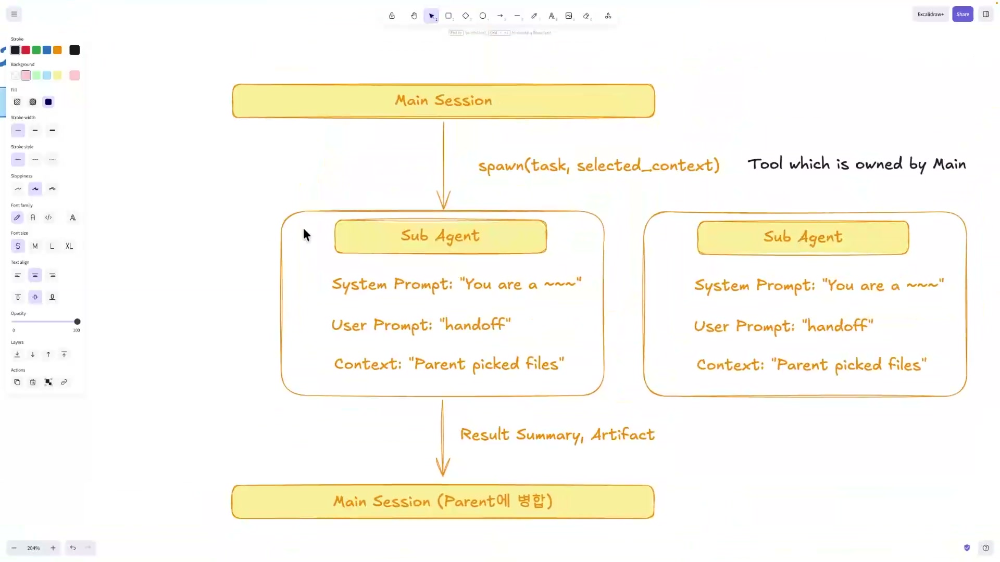

AI에게 큰 일을 한 번에 시키면 컨텍스트가 터진다. 회의록을 받아 기획안 한 장을 뽑는다고 해보자. 회의록을 읽고, 핵심을 추리고, 빠진 정보를 되묻고, 초안을 쓰고, 그 초안이 회의록을 왜곡하지 않았는지 검증하고, 고치고. 이 전부를 한 대화 안에 욱여넣으면 모델은 앞에서 한 말을 잊고, 자기가 쓴 초안에 편들고, 점점 원래 주문과 다른 방향으로 흘러간다.

그래서 일을 세션으로 쪼갠다. 회의록을 6칸으로 정리하는 건 빌드 세션, 그게 원문을 지켰는지 따지는 건 리뷰 세션, 전체를 지휘하는 건 메인 세션. 세션은 각자 독립된 런타임에서 돌고, 컨텍스트가 서로 격리돼 있다. 빌드 세션이 무슨 생각으로 그 표를 채웠는지 리뷰 세션은 모른다.

그런데 쪼개는 순간 새 문제가 생긴다. 쪼갠 조각들을 어떻게 다시 모으나.

이 글은 패스트캠퍼스 AI 에이전트 워크플로 강의 중 「세션 분리 설계」 실습편을 정리한 것이다. 강사는 그 "다시 모으는" 문제를 푸는 도구로 handoff(핸드오프) 양식을 직접 만들어 보인다. Claude Code를 빌드 세션으로, Codex를 리뷰 세션으로 두 도구를 나란히 띄우고, 한 세션이 뱉은 결과를 손으로 복사해 다음 세션에 붙여 넣는다. 22분짜리 실습인데, 마지막에 이 "손으로 복사하는 짓"의 정체가 뒤집힌다.

## 결과를 받는 그릇을 미리 정한다

세션이 나뉘면 결과 회수 양식이 미리 정해져 있어야 한다. 강사가 산출물 정의 문서에 박아 둔 한 문장이 이 실습의 논지 전부다.

> "여러 세션이 모두 같은 9칸으로 채워서 돌려주면, 메인 세션은 같은 위치에서 다음 결정을 한다."

핵심은 같은 위치다. 보조 세션이 무얼 했든, 결과를 동일한 9칸으로 돌려준다. 그러면 메인 세션은 결과 요약은 여기, 판정은 여기, 다음 행동은 여기, 이렇게 매번 같은 자리에서 읽는다. 만약 양식이 없다면 빌드는 줄글로, 리뷰는 표로, 다른 세션은 불릿으로 결과를 돌려줄 것이다. 메인은 세 번 다 다른 모양을 파싱해 해석해야 하고, 그 해석 과정에서 정보가 새고 방향이 어긋난다. 강사가 "드리프트"라 부르는 게 이것이다. 양식은 자유 서술을 고정 슬롯으로 바꿔, 매 세션의 출력을 같은 규격으로 수렴시키는 장치다.

그 9칸이 정확히 어떻게 생겼는지가 이 실습의 알맹이다. 빈 골격 전문은 이렇다.

```markdown
# Handoff — <리프 ID> · <세션 종류> → 메인

## From task (4-1 리프)
- 목적:
- 입력:
- 범위 (하지 않을 일 포함):
- 금지:
- 완료조건:

## Result (이 세션이 채운 부분)
- 결과 요약:
- 판정: 통과 / 재작업 / 재질문 / 종료 중 하나
- 남은 질문:
- 다음 세션의 첫 행동:
```



이 한 장이 `ask` · `build` · `review` 세 종류 보조 세션이 공용으로 쓰는 양식이다. `handoff-L3-build-to-main.md` 같은 마크다운 파일 하나로 떨어진다.

골격을 둘로 가르는 게 이해의 열쇠다. 위쪽 From task 5칸은 이전에 이미 정해진 것, 곧 받아 온 작업 정의다. 목적, 입력, 범위, 금지, 완료조건, "내가 무슨 일을 받았는가". 아래쪽 Result 4칸은 이 세션이 채우는 부분이다. 결과 요약, 판정, 남은 질문, 다음 세션의 첫 행동, "내가 무엇을 했고, 어떻게 판정하며, 무엇을 남기고, 다음은 무엇인가". From task 5 더하기 Result 4가 강사가 거듭 말하는 9칸이다.

칸 이름 옆 괄호는 라벨이 아니라 규칙이다. `범위 (하지 않을 일 포함)`은 할 일만이 아니라 하지 않을 일까지 적게 강제해, 세션이 제 영역을 넘지 못하게 막는다. `판정: 통과 / 재작업 / 재질문 / 종료 중 하나`는 자유 서술을 금지하고 네 단어 중 하나로 못박는다. "잘 된 것 같아요" 같은 모호어가 들어오면 다음 세션이 그걸 또 해석해야 하고, 거기서 정보가 샌다. `다음 세션의 첫 행동`은 다음이 할 일을 동사로 적게 해 루프가 끊기지 않게 한다. 빡빡함이 흠이 아니라 미덕인 양식이다.

## 채우고 나서 스스로 검사한다

강사는 본인 도메인인 "사내 교육 신청 페이지 개편"으로 양식 한 장을 채운다. 분기 사내 교육을 운영하는데 신청 단계에서 이탈과 문의가 늘어 회의가 소집됐고, 그 회의록을 6칸으로 맵핑하는 게 L3 빌드 리프다. 받은 작업(From task)은 이렇게 들어간다.

- **목적**: 회의록 확정 내용을 제목, 배경, 문제, 사용자, 해결 방향, 성공 기준 6칸으로 맵핑
- **입력**: 회의록 확정 묶음 더하기 L1 답(결정권자, 일정, 수치 출처, 환불 기준) 더하기 L2 보존 인용 3줄
- **범위**: 7칸 중 "확인 필요 항목"을 제외한 6칸만. 그 칸은 L4 build 몫이라 손대지 않는다
- **금지**: 회의록에 없는 수치, 일정, 담당자, 환불 기준을 결론처럼 쓰기. 단서 붙은 수치를 본문 6칸에 넣기
- **완료조건**: 6칸이 각각 한 줄 이상씩 채워진다

빌드 세션이 채운 결과(Result)의 6칸 표는 이렇다.

| 칸 | 채운 내용 |
|---|---|
| 제목 | 사내 교육 신청 페이지 개편 v1 |
| 배경 | 분기 사내 교육 운영 중 신청 단계 이탈·문의가 늘어 회의 소집 |
| 문제 | 일정·환불 안내가 신청 흐름에서 안 읽혀 신청 후 CS 문의 발생 |
| 사용자 | 사내 교육 신청자 더하기 운영/CS팀 |
| 해결 방향 | 신청 폼 진입 전에 일정·환불 안내를 단계별로 노출 |
| 성공 기준 | 신청 후 일정·환불 관련 CS 문의를 줄인다 (측정 단위 미정, 모호) |

판정은 통과, 자체 검수 기준으로 6칸 모두 한 줄 이상 채웠다. 남은 질문 칸엔 "성공 기준을 측정 가능한 한 줄로 더 좁혀야 하나"를 적어 둔다. CS 문의 비중 수치는 L1이 미회신이라 본문에 단정하지 않고 보류했다. 다음 세션의 첫 행동 칸엔 "review 세션에 6칸 초안 더하기 L2 보존 인용 3줄 더하기 L3 완료조건을 함께 보낸다"고 동사로 못박는다.

다 채우고 나면 스스로 거는 검사 네 개가 붙는다.



- handoff가 한 화면에 다 들어온다 (한 장 분량 강제)
- "잘 됐다 / 안 됐다" 같은 모호한 판정 표현이 없다 (통과 한 단어로 정해짐)
- 결과 요약에 보조 세션의 대화 흔적(인용·메타 설명)이 남아 있지 않다 (6칸 표만)
- 다음 세션의 첫 행동이 "검토 부탁" 같은 모호한 표현이 아니다 ("\~를 보낸다" 동사 더하기 목적어)

이 네 줄이 양식의 설계 철학을 압축한다. 한 장으로, 모호어 없이, 대화 흔적 없이, 동작을 명시해서. 그런데 이 채운 예시가 "통과"라고 스스로 적었다는 점을 기억해 두자. 잠시 뒤 리뷰 세션이 같은 결과물을 전혀 다른 눈으로 깐다.

## 아무 작업이나 떼면 안 된다

"세션 분리"라는 말을 들으면 일단 다 나누고 싶어진다. 강의는 그 반대편에서 출발한다. 나눠도 되는 작업을 거르는 세 조건부터 제시한다.



조건 1은 리프가 완결됐을 것. 4-1 단계에서 자기 검수 네 검사를 이미 통과한 리프여야 한다. 조건 2는 가상 결과를 상상할 수 있을 것. 이 작업을 끝냈다고 가정했을 때 결과 표 한 장이 머릿속에 떠올라야 한다. 조건 3은 다음 세션이 정해질 것. handoff를 받을 다음 세션, 보통 review 세션이 미리 정해져 있어야 한다.

세 조건이 각각 무엇을 걸러 내는지 보면 왜 하필 이 셋인지가 드러난다. 완결성을 안 따지면, 자기 검수도 안 통과한 어설픈 작업을 떼는 순간 넘겨받은 세션이 미완성을 검증하느라 헛돈다. 결과를 한 장 표로 못 그리는 작업은 애초에 9칸 양식에 담기지 않는다. 넘길 곳이 없는 작업은 "다음 세션의 첫 행동" 칸을 못 채운다. 결국 세 조건은 "이 작업이 9칸 양식을 채울 수 있는가"를 거르는 필터다. 조건 2는 Result 칸을, 조건 3은 다음 행동 칸을 가리킨다. 양식과 조건이 서로를 정의하는 셈이다.

실무에서의 순서가 여기서 갈린다. AI에게 양식을 통째로 만들라고 던지지 않는다. 먼저 입력표를 손으로 채운다. 리프 이름, 리프의 작업 정의(이게 그대로 From task가 된다), 보조 세션 종류, 가상 결과 한 장, 다음 세션 후보. 이 표를 채운 뒤에야 AI에게 "이 입력으로 handoff 양식 v1과 예시 한 장을 작성해줘"라고 시킨다. 양식은 그 표에서 기계적으로 펼쳐진다. 채워야 할 슬롯만 넘겨주고 펼치게 하는 것, 이게 양식을 다루는 일반적인 방식이다.

## 만들고, 깐다, 그리고 거듭 깨진다

빌드가 만들고 리뷰가 깐다. 둘은 컨텍스트가 분리돼 있어, 리뷰는 만든 쪽의 사정을 모른 채 냉정하게 판정한다. 퇴짜를 놓으면 빌드가 다시 한다. 강사는 이 루프에 앤트로픽이 정리한 이름을 붙인다.

> "이 방식이 앤트로픽에서 얘기했던 것처럼, 그 제네레이터와 이밸류에이터가 '서로 안 만들어졌다 다시 해와라', 이 구조가 이런 식으로 동작한다고 보시면 될 것 같습니다."

앤트로픽 「Building Effective Agents」가 정리한 다섯 워크플로 중 하나인 evaluator-optimizer다. 한 LLM이 응답을 생성하고 다른 LLM이 평가·피드백을 주는 루프인데, 명확한 평가 기준이 있고 반복 개선이 측정 가능한 가치를 줄 때 효과적이다. 문서가 드는 대표 예시가 문학 번역이다. 번역 LLM이 처음 못 잡는 뉘앙스를 평가 LLM이 비평해 고치게 한다. 이 실습에선 빌드가 generator, 리뷰가 evaluator다. "회의록에 없는 수치를 쓰지 마라" 같은 명확한 도메인 기준이 있어서 패턴이 잘 들어맞는다.

리뷰 세션은 두 검사를 돌린다. L5 보존 인용 검사는 본문 6칸의 표현이 L2 원문 인용 3줄과 일치하는지, 원문에 없는 걸 지어내지 않았는지 본다. L6 도메인 제약 검사는 회의록에 없는 수치, 일정, 담당자, 환불 기준을 결론처럼 쓰지 않았는지 본다.



L6를 통과한 결과 테이블이 흥미롭다. "회의록에 없는 수치가 결론처럼 들어갔나"는 깨끗, 6칸 어디에도 구체 수치가 없고 "이탈·문의가 늘어"는 정성 표현이라서다. "분기"는 일반 기간일 뿐 마감일 단정이 아니라서 깨끗, "운영/CS팀"은 역할 표기지 사람 책임자가 아니라서 깨끗. 성공 기준에 붙은 "(측정 단위 미정, 모호)" 단서도 괄호로 분리돼 본문에 안 섞였다. 리뷰의 결론은 "fabrication 없이 정성 표현으로만 채웠습니다"였다. 여기서 보이는 건, 양식의 "금지" 칸이 그대로 리뷰의 체크 항목이 됐다는 사실이다. 양식이 검증을 미리 설계해 둔 것이다.

그런데 이 실습은 깔끔하게 안 끝난다. 리뷰가 거듭 퇴짜를 놓는다.

첫 번째 실패. 빌드가 인용 자리를 채우지 않고 빈 placeholder를 그대로 넘긴다. 리뷰는 대조할 원문이 없어 검증 자체를 못 하고 "검증 불가"를 띄운다. 강사의 말은 이랬다. "제가 모르고 여기다 그냥 플레이스홀더를 그대로 넣었네요. 그래서 핸드오프가 제대로 되지 않는다, 검증하지 못했다고 얘기하네요." 양식의 칸을 비우면 루프가 거기서 멈춘다.

두 번째 실패는 실패처럼 보이지만 사실은 시스템이 일하는 장면이다. 빌더는 "통과"라고 적었는데, 리뷰는 "조건부 통과"로 판정을 뒤집는다. 강사의 설명이 핵심을 짚는다. "빌더는 통과라고 얘기를 했는데, 지금 보면 조건부 통과로 바뀌었습니다. 서로 컨텍스트가 다르고, 깨끗한 컨텍스트에서 리뷰를 하다 보니까." 만든 사람은 자기 작업에 편든다. 검증자가 만든 사람의 맥락을 물려받지 않아야 냉정하게 본다. 세션 분리는 이 자기 편향 차단을 구조로 강제하는 장치였고, 판정이 갈렸다는 건 그 구조가 의도대로 작동했다는 증거다.

세 번째 실패는 마침표 하나다. L2 보존 인용에서 마침표가 빠져 원문과 정확히 일치하지 않았고, 리뷰는 재작업을 때린다.



리뷰 결과 원문은 이렇게 적혀 있었다. "판정: 재작업. 근거: 6칸은 모두 한 줄 이상 채워져 있어 L3 최소 완료조건은 충족한다. 그러나 L5 기준에서 보존 인용 1건이 원문과 정확히 일치하지 않는다. handoff의 'L2 보존 인용 3줄을 포함함'이라는 자체 판정도 부정확하다." 리뷰를 돌린 건 `gpt-5.5 medium` 모델이고, "너는 review agent 역할이다, 아래 handoff를 검토하라"는 시스템 프롬프트로 역할을 부여받은 별도 세션이다. 마침표 하나에 재작업이라니 깐깐해 보이지만, 강사는 오히려 이걸 긍정적으로 평가한다. "마침표가 빠져서 실패를 했네요. 이런 식으로 리뷰가 확실하게 잘 해주는 것을 확인할 수 있었고요."

여기서 글의 방향이 뒤집힌다. 실패를 보며 "강의가 잘 안 됐네" 싶을 수 있지만, 이 실패야말로 시스템이 일하고 있다는 증거다. 리뷰가 placeholder도, 컨텍스트 차이도, 마침표 하나도 다 잡아낸다는 건, 양식이 빡빡해서 검증이 작동한다는 뜻이다. 양식이 느슨했으면 리뷰가 깔 거리조차 없었다. 빌드의 자체 판정과 리뷰의 판정이 다른 게 정상이다. 같으면 세션을 나눈 의미가 없다.

## 손으로 옮기던 그것이, 사실은 spawn이었다

22분 내내 강사는 빌드 결과를 손으로 복사해 리뷰에 붙여 넣었다. 비효율적으로 보인다. 자동으로 넘기면 될 걸 왜 일일이 손으로 하나. 마지막에 강사가 다이어그램 한 장으로 답한다.



메인 세션이 서브에이전트를 spawn하면서 작업과 선택된 컨텍스트를 넘긴다. 서브에이전트는 끝나면 결과 요약(Result Summary)과 산출물(Artifact)을 메인에 돌려주고, 메인은 그걸 부모에 병합한다. 다이어그램 우측엔 "Tool which is owned by Main"이라 적혀 있다. 서브에이전트는 메인이 소유한 하나의 도구라는 뜻이다.

이 구조가 사람이 손으로 한 것과 정확히 같다. 사실 강사는 영상 중반에 이미 복선을 깔아 뒀다. "지금 이게 런타임이 서로 분리되어 있으니까 제가 손으로 이렇게 넘겨주고 있는데, 손으로 넘겨주는 게 사실 독립적인 런타임이 되면 이거를 대체할 수 있겠죠." 독립 런타임이 생기면 사람 손이 spawn으로 대체된다.

메인이 서브에이전트를 부를 때 넘기는 건 정확히 세 가지다. 다이어그램의 각 서브에이전트 박스에 그대로 적혀 있다.

| 소환 시 넘기는 것 | 다이어그램의 값 | 이 실습에서의 대응 |
|---|---|---|
| System Prompt | "You are a \~" (역할 부여) | "너는 review agent 역할이다" |
| User Prompt | "handoff" | 우리가 만든 handoff 양식 한 장 |
| Context | "Parent picked files" | 부모가 고른 입력 파일 |

여기서 모든 게 맞물린다. 우리가 앞에서 공들여 만든 handoff 양식은, 서브에이전트 소환의 User Prompt 자리에 들어가는 바로 그것이었다. 양식을 잘 만드는 일이 곧 서브에이전트에게 일을 잘 시키는 일이다. 그래서 "왜 지금 수동으로 하나"에 답이 나온다. 자동화가 가능한데도 손으로 하는 건, 양식(프로토콜)을 손에 익혀야 자동화의 인터페이스를 제대로 설계할 수 있기 때문이다. 본질은 도구가 아니라 양식 설계에 있다.

강사는 이 구조를 더 넓은 그림에 놓는다. 중간 단계의 데이터 모양을 미리 못박아 두면 세션 간 흐름이 결정적이 되어 재현과 자동화가 가능해진다. 그가 든 예가 우로보로스(Ouroboros)라는 파이프라인이다. seed가 만들어지면 그걸 run으로 보내는 식으로, 중간 과정의 데이터를 미리 정해 둔다. handoff 양식도 그 "정해 둔 중간 데이터"의 한 사례다.

## 한 장, 그게 산출물이다

이 실습의 산출물은 거창하지 않다. 9칸 골격 한 장과 본인 리프 하나로 채운 예시 한 장, 한 페이지 분량이 전부다. 이 양식은 다음 단계에서 3단 검수표의 입력으로 들어가 판정 칸을 더 자세히 푼다.

작아 보이지만, 여기엔 큰 결정이 깔려 있다. 세션을 나눌 때 가장 먼저 정해야 할 건 똑똑한 모델이나 좋은 프롬프트가 아니라, 세션끼리 결과를 주고받을 그릇의 모양이다. 그 그릇을 빡빡하게 깎아 두면, 리뷰는 마침표 하나까지 잡아내고, 손으로 하던 복사는 그대로 자동 spawn의 인터페이스가 된다. 양식이 곧 시스템이다.
