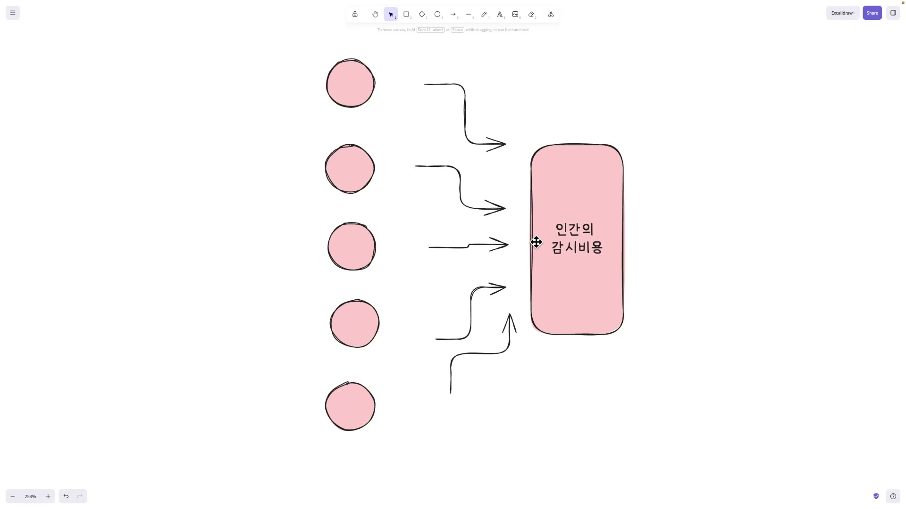
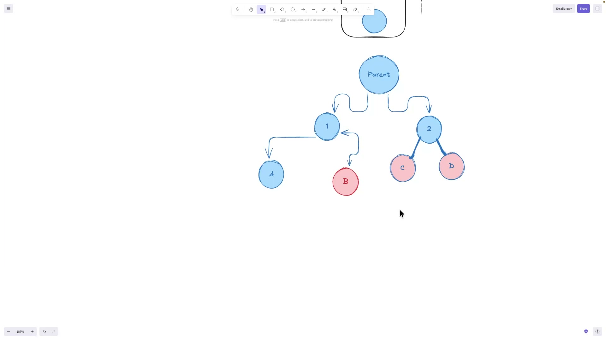
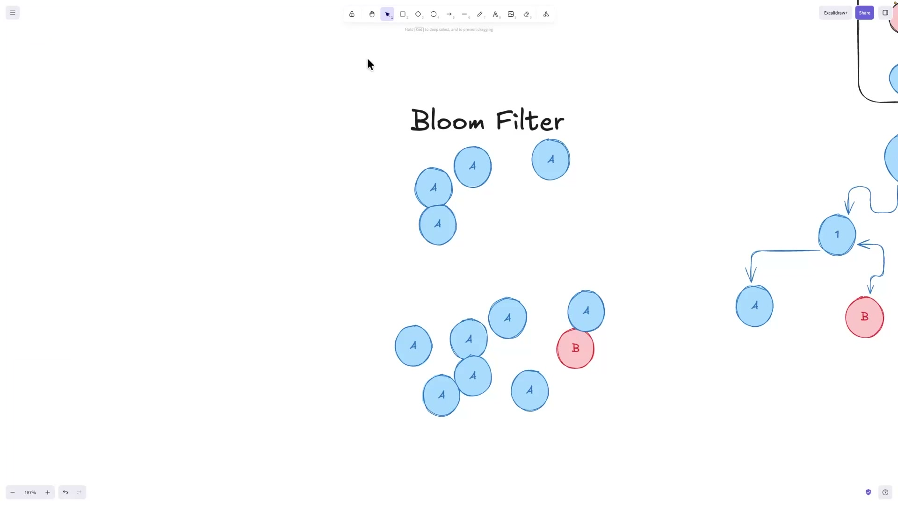
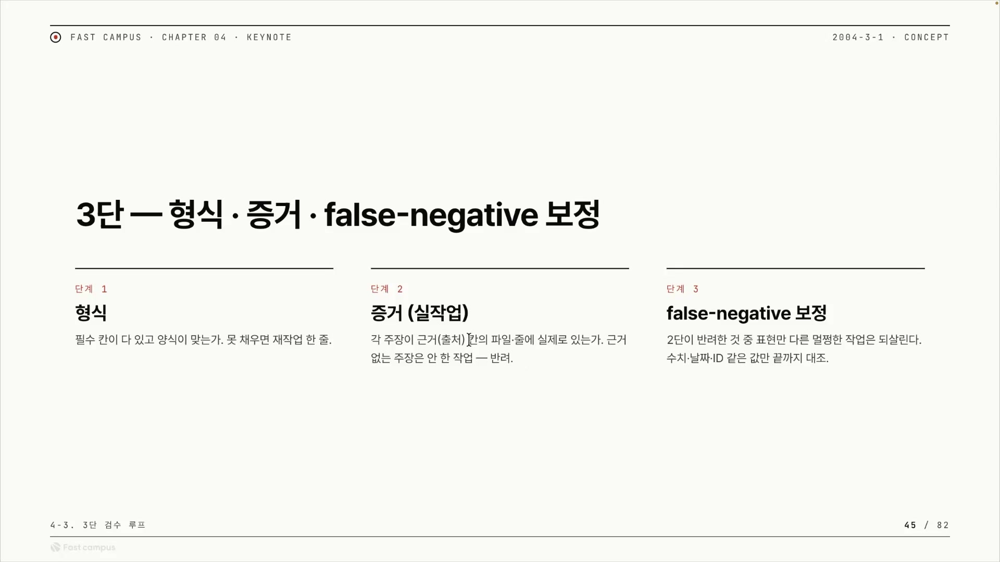
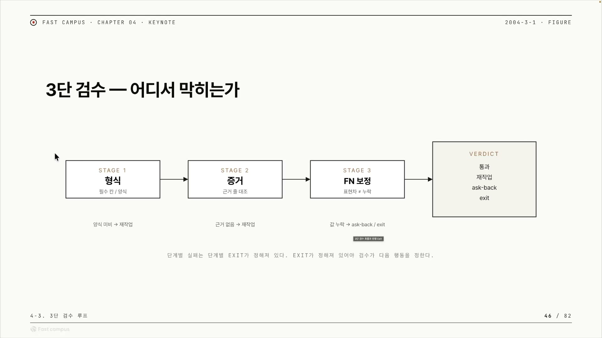
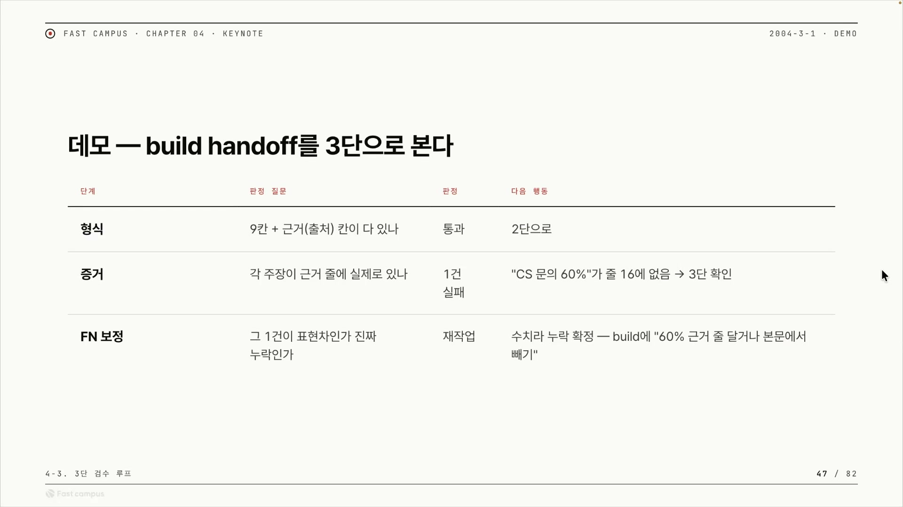
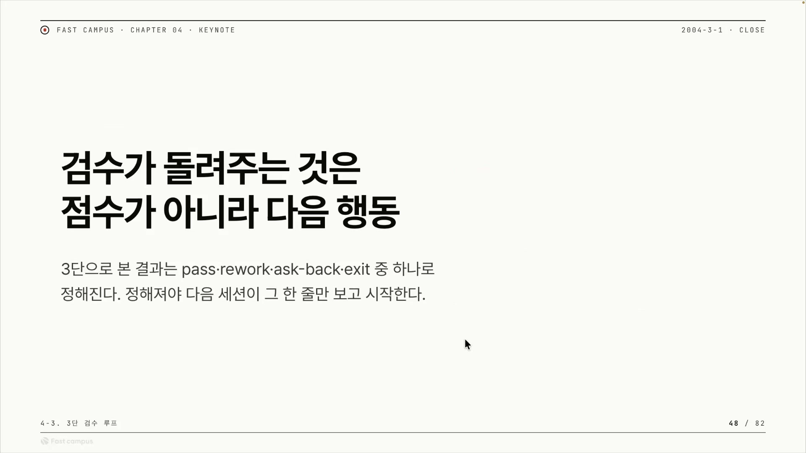
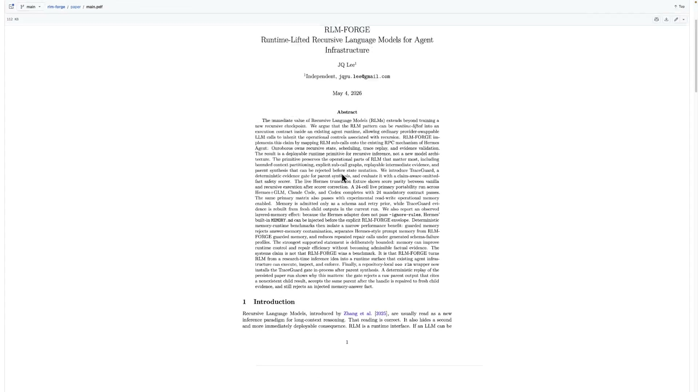

에이전트에게 일을 맡긴다는 건, 그 에이전트가 "다 했어요" 하고 넘긴 결과를 믿는다는 뜻이다. 믿지 못하면 사람이 그 결과를 매번 직접 들여다봐야 한다. 이 강의는 바로 그 지점, "에이전트의 자기보고를 어디까지 믿을 수 있는가"에서 출발한다.

한 작업을 끝내고 결과를 다음으로 넘기는 것을 핸드오프(handoff)라고 부른다. 위임이 성립하려면 이 핸드오프가 제대로 된 작업이라고 믿을 수 있어야 한다. 그런데 못 믿으면 사람이 LLM이 한 작업을 일일이 감시하게 되고, 여기서 비용이 생긴다. 슬라이드와 발화에 그대로 나오는 용어로 인간 감시비용(Cost of Human Oversight)이다. 사람이 에이전트의 산출물을 확인하고 승인하고 고치는 데 드는 시간과 주의력을 가리킨다.

## 감시비용이 생기면 병렬의 이득이 사라진다

감시비용이 왜 문제인지는 숫자로 풀면 분명해진다. AI에게 일을 시키는 매력은 여러 개를 동시에 빠르게 처리할 수 있다는 데 있다. 작업 열 개를 한꺼번에 던지면 열 배 빨리 끝난다. 그런데 그 결과 열 개를 사람이 하나하나 검사해야 한다면, 만드는 속도가 아무리 빨라도 검사 속도가 천장이 된다. 만드는 건 열 배 빨라졌는데 검수는 그대로라면 전체 속도는 검수에 묶인다.

발표자는 이 현상을 병목과 백프레셔(back-pressure)로 설명한다. 백프레셔는 원래 큐나 스트림 처리에서 쓰는 말이다. 앞 단계가 뒤 단계가 소화할 수 있는 것보다 빨리 일을 밀어내면, 뒤에서 "천천히 보내라"는 신호가 거꾸로 올라가 흐름이 억제된다. 에이전트로 옮기면, 검증 단계나 사람 리뷰어가 밀릴 때 상류의 에이전트가 미검증 산출물을 무한히 쌓지 못하도록 작업 생성 자체가 늦춰진다는 뜻이다. 감시가 느리면 파이프라인 전체가 그 속도에 갇힌다.

그래서 목표가 분명해진다. 사람이 일일이 안 봐도 되도록, 이 감시비용을 0에 가깝게 만드는 것이다. 발표자는 여기서 두 가지를 가른다. 에이전트를 감싸 원하는 형태로 깎아내는 실행틀을 하네스(harness)라고 부르고, 중간중간 사람이 끼어 확인하는 방식을 Human in the Loop이라고 부른다. 사람이 끼는 순간 감시비용이 든다. 우리가 만들고 싶은 건 AI가 여러 개를 처리하면서도 사람이 감시하지 않아도 되는 하네스다.

## 가짜 핸드오프 하나가 도미노로 번진다

검수가 없으면 정확히 무슨 일이 나는지를 보자. 큰 작업을 잘게 쪼개 맡기는 상황을 가정한다. 조직도처럼 맨 위에 Parent가 있고, 그 아래 중간 노드 1과 2가 있고, 맨 아래에 실제 일을 하는 말단 노드 A · B · C · D가 달린다. 이 맨 아래 말단을 리프(leaf)라고 부른다.

여기서 리프 B가 "그럴듯해 보이지만 실제로는 잘못된" 핸드오프를 줬다고 해보자. 겉보기엔 멀쩡하지만 일은 제대로 안 된 가짜 완료다. 문제는 B 혼자서 끝나지 않는다는 데 있다. B의 결과를 기다리고 있던, B가 끝나야만 진행되는 작업들이 줄줄이 오염된다.

도식의 색이 이걸 그대로 보여준다. 잘못된 B는 빨강이고, B의 여파가 번진 C · D는 분홍으로 물든다. 정상인 A만 파랑으로 남는다. 한 말단의 거짓이 형제와 상위 의존 노드로 도미노처럼 번지는 것이다. 이렇게 실제 상태가 원래 의도에서 점점 벗어나는 현상을 드리프트(drift)라고 한다. 머신러닝에서 데이터나 모델이 기준에서 서서히 벗어나는 걸 부르는 말인데, 에이전트 맥락에서는 출력과 행동이 원래 의도에서 누적해서 이탈하는 것을 가리킨다.

핵심은 이거다. B가 잘못됐다는 사실을, 그 결과가 하류로 흘러가기 전에 잡았어야 한다. 이게 3단 검수가 존재하는 이유다.

## LLM으로 LLM을 검수하면 의심이 끝나지 않는다

검수를 어떻게 만들 것인가. 가장 자연스러운 발상은 LLM을 하나 더 두는 것이다. LLM에게 다른 LLM의 핸드오프를 평가하게 하는 LLM-as-a-judge다. 그런데 발표자는 여기에 분명히 반대한다. 그 심판으로 쓴 LLM도 확률적이라, 결국 그 심판을 또 감시하고 싶어진다는 것이다. 검수자를 믿으려면 검수자의 검수자가 필요하고, 그렇게 의심이 무한히 이어진다. 감시비용은 사라지지 않고 한 층 위로 옮겨갈 뿐이다.

그래서 발표자의 처방은 "실제로 쓸 수 있는가"를 판정하는 그 게이트를 결정론적(deterministic)으로 만들자는 것이다. 결정론적이라는 건 같은 입력에 항상 같은 출력을 낸다는 뜻이다. 매번 답이 흔들리는 LLM과 정반대다. 발표자의 논리는 이렇다. 판정이 그때그때 바뀌면 우리는 또 의심하게 된다. 의심을 없애려면 검문소가 코드 로직이나 멱등성(idempotency) 있는 로직으로 동작해야 한다. "파일 X를 생성" 대신 "X가 없으면 생성"으로 짜면 몇 번을 재시도해도 결과가 같은, 바로 그 성질이다.

대비가 선명하다. 우리는 배포된 프로그램은 테스트가 끝나면 동작을 믿는다. 결정론적이기 때문이다. 그런데 LLM은 늘 확률적이라, 하네스가 없으면 항상 드리프트가 난다. 그러니 검수 게이트만큼은 LLM 바깥의 결정론적 코드로 둬서, 한 번 통과한 건 믿을 수 있게 만들자는 것이다.

### 자기보고를 의심하고, 증거로 대조한다

그렇다면 그 결정론적 게이트는 무엇을 보는가. 의심의 대상은 "안 한 작업을 한 척하는 자기보고"다. 에이전트가 말로만 "다 했어요"라고 주장하는 것이다. 처방은 그 주장에 실제 증거가 있는지를 기계적으로 찾아보는 것이다. 발표자가 쓰는 방법은 세 단계로 정리된다.

1. 에이전트에 모든 로그를 심는다. 파일 툴 호출, 파일 수정 같은 행위가 로그로 남는다.
2. 에이전트에게 "어떤 파일을 수정했고 어떤 액션을 했는지"를 JSON 같은 정해진 형식으로 던지게 한다.
3. 그 JSON을 파싱해서 로그(증거)와 주장이 일치하는지 대조한다. 증거에 그 파일 수정이 실제로 있으면 통과.

LLM에게 다시 판단을 시키는 게 아니라 "주장 대 로그"를 목록으로 맞춰보는 것이라 결정론적이다. 이렇게 자기보고를 그대로 믿지 않고 검증 가능한 증거로만 통과시키는 방식을 증거 기반 게이팅(Evidence-Gating)이라고 부를 수 있다. 발표자가 "형식이 중요하다"를 반복하는 이유도 여기 있다. 증거와 주장을 코드로 대조하려면, 에이전트의 산출이 필수 칸을 갖춘 정해진 형식이어야 파싱이 된다. 형식은 증거 대조의 전제조건이다.

### Bloom filter 비유는 의도만 빌리고, 라벨은 바로잡아 쓴다

발표자는 이 비대칭적인 게이트를 설명하려고 false negative와 Bloom filter를 끌어온다. 그런데 이 두 용어는 강의에서 표준과 어긋나게 쓰이는 지점이 있어, 정의를 한 번 못박고 넘어가야 한다.

먼저 표준 정의다. false positive와 false negative는 "무엇을 양성(positive)으로 두느냐"를 정해야 의미가 생긴다. 양성은 "이 검사가 잡아내려는 대상"이다.

- False positive(거짓 양성): 실제는 음성인데 검사가 양성이라 판정. "아닌 걸 맞다고."
- False negative(거짓 음성): 실제는 양성인데 검사가 음성이라 판정. "맞는 걸 놓침."

검증 게이트에서 이 라벨이 헷갈리는 건, 같은 사건이라도 무엇을 양성으로 두느냐에 따라 이름이 뒤집히기 때문이다. "결함(안 된 작업)을 탐지하는" 게이트로 보면, 진짜 망가진 작업을 "문제없음"으로 통과시키는 것이 false negative다. 보안에서 공격을 못 잡고 흘려보내는 걸 false negative라 부르고, 테스트에서 버그를 놓치는 걸 false negative라 부르는 것과 같은 어법이다. 발표자가 "안 했는데 했다고 통과시키는 것 = false negative, 이걸 제일 크게 막아야 한다"고 말하는 건 이 결함 탐지 프레임에서는 맞다. 이 글도 그 프레임으로 false negative를 쓴다.

문제는 Bloom filter 쪽이다. Bloom filter는 "이 원소가 집합에 있나"라는 물음에 두 가지로만 답하는 자료구조다. "확실히 없음"은 100% 정확하고, "있을 수도 있음"은 틀릴 수 있다. 그래서 (양성 = 집합에 있음으로 두면) 없는 걸 있다고 하는 false positive는 가능하지만, 있는 걸 없다고 하는 false negative는 설계상 절대 일어나지 않는다. Bloom filter가 교과서에서 유명한 바로 그 이유가 "false negative가 없고 false positive만 있다"는 성질이다.

강의에서는 이 성질이 반대로 설명된다. "맞는데 못 가져온다 = false positive", "false negative가 Bloom filter에서 많이 나온다"는 식이다. 하지만 "맞는(있는) 걸 못 가져옴"은 정의상 false negative이고, 게다가 그 false negative야말로 Bloom filter에서 절대 안 나는 것이다. 그러니 라벨을 그대로 옮기면 안 된다.

발표자가 이 비유로 정말 하고 싶었던 말은 라벨 너머에 있다. "나쁜 건 절대 흘려보내지 않는, 한쪽 오류만 허용하는 필터"를 만들자는 것이다. 검증 게이트도 그렇게 설계하면 된다. 나쁜 걸 통과시키는 오류(발표자가 false negative라 부르는 것)는 0으로 막고, 반대쪽 오류(멀쩡한 걸 반려하는 것)는 감수한다. 멀쩡한 걸 다시 시키는 건 시간 낭비일 뿐이지만, 안 된 걸 통과시키면 앞서 본 도미노가 시작되기 때문이다. 비대칭이 핵심이다.

## 3단 검수 루프: 형식, 증거, false negative 보정

이 원리를 구체적인 장치로 만든 것이 3단 검수 루프다. 핸드오프 하나를 세 단계의 검문소에 통과시킨다.

각 단계는 통과하면 다음으로 넘기고, 실패하면 그 단계에 정해진 출구로 빠진다. 단순히 점수를 매기는 게 아니라 "어디서 왜 막혔는지, 그래서 뭘 할지"가 결정되는 구조다.

1단은 형식이다. 산출물에 필수 칸이 다 있고 양식이 맞는가를 본다. 이게 1단계인 이유는 앞서 말한 대로다. 뒤의 증거 대조를 결정론적 코드로 파싱하려면 형식부터 갖춰져 있어야 한다. 양식이 안 맞으면 출구는 재작업이다. "형식 다시 맞춰 와."

2단은 증거다. 에이전트의 각 주장이, 근거로 제시한 파일과 줄에 실제로 존재하는가를 본다. 규칙은 단호하다. 근거 없는 주장은 안 한 작업으로 간주하고 반려한다. 자기보고를 안 믿고 증거로 대조하는 그 Evidence-Gating이 여기서 작동한다.

3단은 false negative 보정이고, 가장 헷갈리는 단계다. 2단은 "근거 줄에 글자 그대로 없으면 반려"라서 깐깐하다. 그러다 보면 실제로는 제대로 했는데 표현이나 위치만 다른 멀쩡한 작업까지 억울하게 반려될 수 있다. 3단이 그 둘을 가른다. 동의어나 요약 때문에 표현만 다른 경우(표현차)는 되살려 통과 쪽으로 보내고, 수치 · 날짜 · ID처럼 딱 맞아야 하는 값이 실제로 빠진 경우(진짜 누락)는 false negative로 확정해 재작업으로 보낸다. 판정 도구가 "수치 · 날짜 · ID 같은 값만 끝까지 대조"인 건, 의미를 해석하는 게 아니라 딱 떨어지는 값의 정합성만 보기 때문에 결정론적으로 가능해서다.

이름이 "false negative 보정"인 이유가 여기서 드러난다. 2단을 느슨하게 통과시키면 "안 했는데 통과(false negative)"가 새고, 2단에서 다 반려하면 멀쩡한 것까지 버린다. 3단은 표현차는 풀어주고 진짜 누락만 끝까지 잡아, false negative를 최종 확정하고 보정한다. 발표자의 말처럼 false positive는 조금 놓쳐도 된다. 멀쩡한 걸 다시 시키는 것뿐이고, 그건 1단이나 2단에서 대체로 걸러진다. 끝까지 막아야 하는 건 false negative다.

### 데모: "CS 문의 60%" 한 건을 끝까지 따라가기

추상적인 세 단계를 실제 한 건으로 따라가면 그림이 또렷해진다. 슬라이드의 데모는 build 핸드오프 하나를 3단에 통과시킨다.

흐름은 이렇다. 형식 단계는 9칸과 근거 칸이 다 있어서 통과, 2단으로 넘어간다. 증거 단계에서 한 건이 걸린다. 본문이 "CS 문의 60%"라고 주장하는데, 근거로 댄 줄 16에 그 숫자가 없다. 여기서 바로 버리지 않고 3단으로 넘기는 게 핵심이다. 3단에서 "이게 표현차냐 진짜 누락이냐"를 묻는다. 60%는 수치다. 표현만 다른 게 아니라 값 자체가 근거에 없으니 진짜 누락으로 확정된다. 그래서 다음 행동은 재작업이다. build에게 "60%에 근거 줄을 달거나, 못 달면 본문에서 그 문장을 빼라"고 돌려보낸다.

회색지대는 따로 처리한다. 증거는 있고 일도 제대로 한 것 같은데 표현만 잘못한 경우라면, 결정론적으로 딱 안 갈리니 의미를 보는 시멘틱한 평가로 넘기거나, 에이전트에게 "나 진짜 했는데 형식이 안 맞았구나" 하고 다시 시키는 ask-back으로 처리할 수 있다. 결정론으로 깔끔하게 안 갈리는 부분만 이렇게 격리한다.

### 검수가 돌려주는 것은 점수가 아니라 다음 행동

3단을 다 거치면 판정(verdict)이 나온다. 그런데 그 판정의 형태가 이 강의의 마지막 메시지다.

판정은 네 가지 출구 중 하나다. pass(통과)면 핸드오프를 받아들이고, rework(재작업)면 형식이나 값을 고쳐 다시 시키고, ask-back이면 에이전트에게 되묻고, exit이면 더 진행이 안 되니 중단한다. 중요한 건 이게 "85점" 같은 점수가 아니라는 점이다. 점수를 주면 다음에 뭘 해야 할지 또 사람이 해석해야 한다. 행동 한 줄로 정해 두면 그 해석이 통째로 사라진다. 검수의 출력 형식을 점수가 아니라 행동으로 고정하는 것 자체가, 앞서 본 드리프트를 끊는 실용적인 설계다.

## 이게 실제로 돌아간다: ouroboros와 rlm-forge

지금까지의 원리는 발표자가 실제로 만든 오픈소스에 들어가 있다. 발표자는 GitHub `Q00`, 논문 저자 이름으로는 JQ Lee이고, 자작 구현체로 ouroboros와 rlm-forge를 사례로 든다.

ouroboros는 AI 코딩 에이전트의 비결정적 작업을 재생 가능하고 관찰 가능하며 정책에 구속된 실행으로 바꾸는 로컬 우선 "Agent OS"다. 작업을 계층적인 수용 기준(Acceptance Criteria) 트리로 쪼개는데, 앞에서 본 Parent와 리프 트리가 바로 이 구조에 대응한다. 평가 단계에 결정론적 게이트가 들어간다.

rlm-forge의 아키텍처는 세 층으로 나뉜다. 바깥에서 재귀를 제어하고 상태와 스케줄링을 맡는 Ouroboros, 경계 지어진 호출 하나를 실행하고 증거 핸들이 담긴 구조화 JSON을 반환하는 내부 런타임 Hermes Agent, 그리고 부모의 합성 결과가 자식이 실제로 돌려준 증거에 의해 뒷받침되는 사실만 주장하는지를 대조하는 증거 게이트 TraceGuard다. TraceGuard는 두 가지 실패를 거부한다. 증거에 없는 사실을 주장하거나, 대응 증거가 없는 핸들을 인용하는 경우다. LLM에게 다시 판단을 시키지 않고 증거 목록을 대조하는, 정확히 그 결정론적 검증이다. 앞에서 말한 Evidence-Gating과 "false negative 막기"가 코드로는 이 TraceGuard다.

이 접근은 논문으로도 정리돼 있다. 「RLM-FORGE: Runtime-Lifted Recursive Language Models for Agent Infrastructure」다. 새 재귀 모델을 학습할 필요 없이, 재귀의 패턴을 기존 에이전트 런타임 안의 실행 계약으로 "런타임-리프트"하면 평범한 LLM 호출도 재귀의 운영 통제를 물려받는다는 주장이다. 새 모델 아키텍처가 아니라 시스템 논문이라는 게 핵심이다. 눈여겨볼 결과는 절제 실험(ablation)이다. TraceGuard가 안전하지 않은 부모 합성을 거부하면 증거 게이팅된 실행은 안전하게 유지되지만, 같은 형태의 정책이라도 증거 게이팅을 빼면 실패한다는 것이다. 증거 게이팅이 안전성의 핵심임을 실험으로 보인 셈이다. 다만 이건 발표자 본인의 작업이므로, 검증된 정설이라기보다 "발표자가 실제로 만들고 논문으로 ablation까지 한 접근"으로 받아들이는 게 맞다. 실험도 통제된 환경 중심이고, 실제 작업으로의 일반화는 논문 스스로 향후 과제로 남겨 둔다.

한 가지 짚어둘 것이 있다. 강의 끝에서 발표자는 다음 세션 주제로 OMC(oh-my-claudecode)와 OMX(oh-my-codex)를 예고한다. Claude Code와 Codex에서 서브에이전트를 어떻게 쓰는지, 그게 MCP나 하네스와 어떻게 다른지를 이 둘로 다룬다는 것이다. 그런데 이 OMC와 OMX는 발표자 본인의 작품이 아니라 다른 개발자 Yeachan Heo의 프로젝트다. 같은 하네스 생태계에서 ouroboros를 영감으로 크레딧하는 이웃 도구이지, "발표자가 만든 오마이 시리즈"가 아니다.

## 정리

이 강의를 한 줄로 줄이면 이렇다. LLM 에이전트의 "다 했다"는 자기보고를 그대로 믿지 말고, 결정론적 게이트로 형식 · 증거 · false negative 보정 세 단계를 거쳐 검수하되, 그 결과는 점수가 아니라 다음 행동 한 줄로 돌려주자는 것이다.

논리의 뼈대를 되짚으면, 출발점은 감시비용이었다. 사람이 일일이 봐야 하면 병렬의 이득이 사라지고, 검증 안 된 핸드오프 하나가 의존 작업으로 드리프트를 전염시킨다. 이걸 막으려고 LLM 심판을 두면 의심이 끝나지 않으니, 게이트를 결정론적 코드로 만들어 주장과 증거를 기계적으로 대조한다. 그 대조를 형식, 증거, false negative 보정의 3단으로 짜고, 끝에는 점수 대신 pass · rework · ask-back · exit 중 하나를 돌려준다. 그래야 다음 세션이 그 한 줄만 보고 이어갈 수 있다. 하네스는 Claude나 Codex 같은 도구에만 있는 게 아니라, 에이전트 자체에 이런 결정론적 게이트를 심는 방식으로도 만들 수 있다는 것, 그게 이 강의가 보여준 메타적인 그림이다.
