AI 에이전트에게 일을 시키는 사람들 사이에서 요즘 자주 나오는 착각이 하나 있다. 에이전트를 많이 띄울수록 일을 잘 시키는 거라는 생각이다. 병렬로 여러 마리를 돌리면 빨라 보이고, 뭔가 거창하게 협업하는 것처럼 느껴진다. 그런데 강연자는 이 강의에서 정반대 이야기를 한다. 중요한 건 몇 마리를 띄우느냐가 아니라, 에이전트가 내놓은 결과를 어떻게 믿을 수 있게 검증하느냐다.

이 글은 패스트캠퍼스 강의 한 편(Chapter 3 · Ch03-02. oh-my-claudecode 팀 파이프라인과 검수 루프 구조)을 정리한 공부 노트다. oh-my-claudecode(줄여서 OMC)라는 실제 오픈소스를 해부해, 여러 에이전트가 협업할 때 일을 어떻게 나누고(팀 파이프라인) 그 결과를 어떻게 검증하는지(검수 루프)를 따라간다. 강연자는 OMC를 잘 만든 모범 사례로 보고, 그 설계 선택들을 자기 문제의식과 연결한다.

## 출발점: 검증을 못 하면 감시 비용이 든다

강연자가 OMC를 분석 대상으로 고른 이유는 한 문장에 담겨 있다. "Deterministic하게 검증하지 못하면 결국에 감시 비용이 든다." 조직에서 에이전트를 실제로 굴려보며 깨달은 것이라고 한다.

풀어 보면 이렇다. AI가 코드를 한 뭉치 만들어 놓고 "다 했습니다(done)"라고 보고한다. 그게 진짜인지 누군가는 확인해야 한다. 만약 기계가 자동으로 합격 · 불합격을 딱 떨어지게 판정할 수 있게(deterministic = 같은 입력이면 항상 같은 결론) 만들어 두지 않으면, 매번 사람이 눈으로 들여다봐야 한다. 그 사람의 시간이 곧 비용이다. 그래서 핵심 질문은 "어떻게 하면 사람이 안 봐도 되게 검증을 자동화하느냐"가 된다.

이 문제의식 위에서 강연자가 던지는 두 가지 질문이 강의 전체를 끌고 간다. OMC는 서브에이전트(특정 임무만 맡아 잠깐 돌고 사라지는 보조 AI)를 어떻게 쪼개 쓰는가, 그리고 그 결과를 어떻게 검수하는가.

강연자는 도입에서 OMC의 GitHub 저장소를 직접 띄운다.

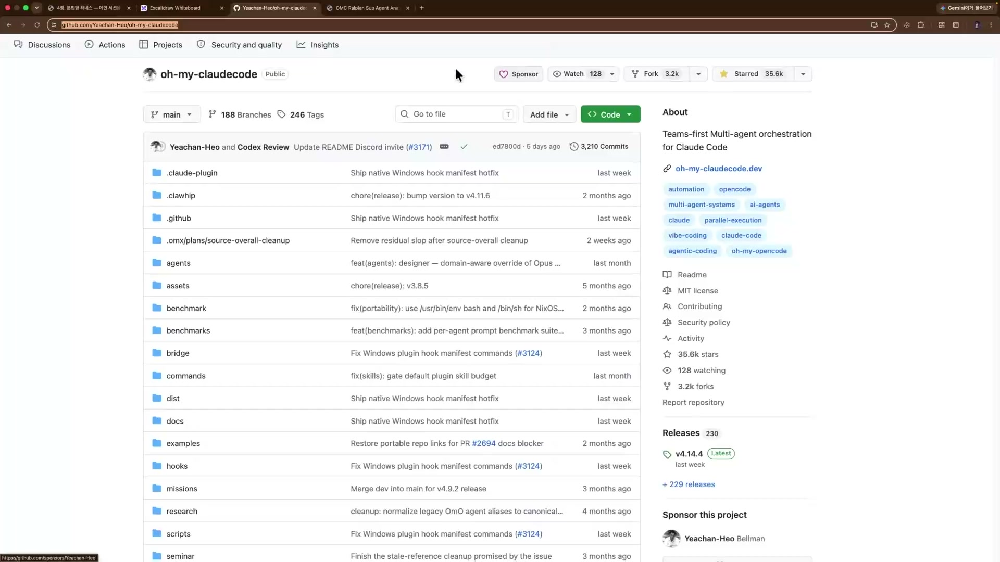

저장소 About 패널에 적힌 한 줄 정의가 OMC의 정체성이다.

> Teams-first Multi-agent orchestration for Claude Code
> (클로드 코드를 위한, '팀 우선' 다중 에이전트 오케스트레이션)

클로드 코드(Claude Code)는 앤트로픽이 만든, 터미널에서 돌아가는 AI 코딩 도구다. OMC는 그 위에서 동작하는 전용 확장이고, AI 한 명에게 다 시키는 대신 여러 에이전트에게 역할을 나눠주고 지휘(orchestrate)한다. '팀 우선'이라는 건 단일 에이전트가 아니라 '팀'으로 일하는 걸 기본 전제로 삼았다는 뜻이다. README 슬로건은 더 도발적이다. "Don't learn Claude Code. Just use OMC.(클로드 코드를 배우지 마라. 그냥 OMC를 써라.)" 화면에 표시된 규모는 스타 약 35.6k, 포크 3.2k, 커밋 3,210, 릴리스 230, 최신 v4.14.4, MIT 라이선스. 제작자는 허예찬(@Yeachan-Heo)으로, 개인 토이 프로젝트가 아니라 여러 기여자가 함께 굴리는 프로젝트다.

이 강의의 자세는 단순 기능 소개가 아니다. 강연자의 표현으로는 "예찬님이 어떤 생각으로 이걸 만들었는지를 같이 보자"는 것, 즉 제작자의 설계 의도를 역추적하는 방식이다.

## 4C 스택: 작업을 어디서 끊을지 설계한다

강연자는 OMC를 4C 스택이라는 렌즈로 본다. 한 작업을 네 개의 경계로 쪼개 보는 틀이다.

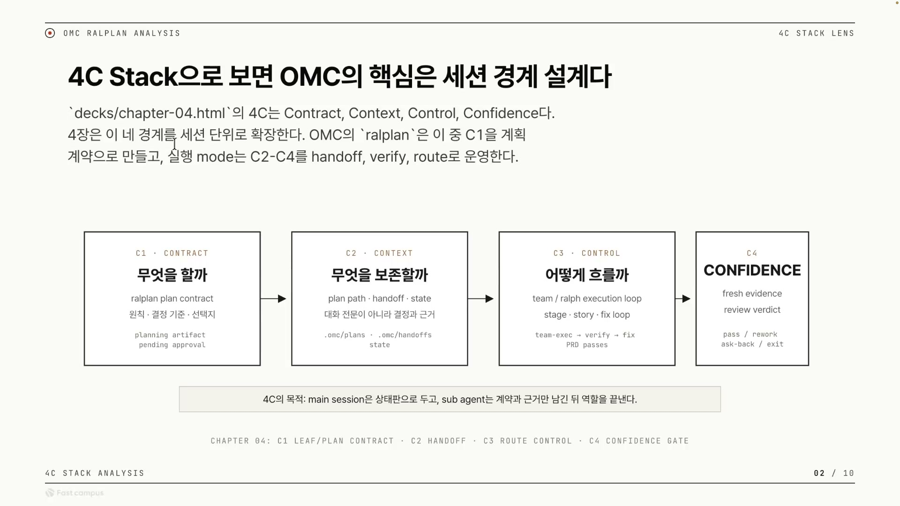

| 약자 | 이름 | 던지는 질문 | 한 줄 의미 |
|------|------|------------|-----------|
| C1 | Contract | 무엇을 할까 | 작업 계약 = 확정된 계획서 |
| C2 | Context | 무엇을 보존할까 | 다음 단계로 넘길 것만 골라 저장 |
| C3 | Control | 어떻게 흐를까 | 실행과 검증·수정의 흐름 제어 |
| C4 | Confidence | 완료를 어떻게 확신할까 | 결과가 진짜 맞는지 검수 |

여기서 핵심은 4C가 추상적인 4단계로 끝나지 않는다는 점이다. OMC는 이 넷을 머릿속 개념이 아니라 실제 세션 · 파일 경계로 잘라 운영한다. 슬라이드 하단 명제가 그걸 압축한다. "main session은 상태판으로 두고, sub agent는 계약과 근거만 남긴 뒤 역할을 끝낸다." 메인 세션은 지금 어디까지 진행됐는지 보는 상태판 역할만 하고, 실제 작업은 서브에이전트가 맡되 그들은 결정과 근거만 남기고 사라진다는 구조다.

OMC가 4C를 실제로 어떤 장치로 구현하는지 대응시키면 이렇게 된다.

- **C1 Contract** = ralplan이 만든 plan contract(확정된 계획서). 모호함을 없앤 뒤 계획을 만들어 리포지토리에 저장한다.
- **C2 Context** = handoff · state를 파일로 저장. 대화 전문이 아니라 "무엇을 왜 결정했는지"만 남긴다. 컨텍스트를 들고 다니는 방법은 여러 가지(메인 세션 메모리, 파일, DB, MCP)지만 OMC는 파일을 택했다.
- **C3 Control** = ralph execution loop과 stage·story·fix loop으로 흐름을 제어한다. 실행 → 검증 → 수정으로 돈다.
- **C4 Confidence** = fresh evidence(새로 수집한 증거)로 검수한다. 여기에 OMC만의 특징이 몰려 있다.

왜 굳이 작업을 네 경계로 잘라야 할까. 답은 검수 때문이다. 만든 AI가 같은 자리에서 스스로 "잘 됐다"고 하면 그건 검수가 아니라 자기 채점이다. 만드는 책임과 검수하는 책임을 같은 맥락에 두면 채점이 무너진다. 그래서 계획하는 자, 실행하는 자, 검수하는 자를 한 세션에 섞지 않고 경계로 가른다. 이것이 강의 전체를 관통하는 한 문장, "검수 가능한 경계 설계"다. 강연자가 못 박는 결론은 "OMC에서 가져올 것은 구현 복사가 아니라 이 네 경계의 분리 방식"이라는 것이다. "하네스를 똑같이 만드는 건 전혀 의미가 없다"는 말도 같은 뜻이다.

## 랄플랜: 코드를 짜기 전에 세 에이전트가 계획을 깎는다

강연자가 OMC에서 가장 특이하다고 꼽은 게 랄플랜(ralplan)이다. 랄프(ralph, 같은 작업을 완료 조건까지 반복해서 돌리는 실행 메커니즘)를 계획 수립에 붙인 것이다. 한 명이 계획을 뽑고 끝내는 게 아니라, 역할이 다른 세 에이전트를 돌리면서 둘이 다 통과시킬 때까지 계획을 반복해서 다시 짠다.

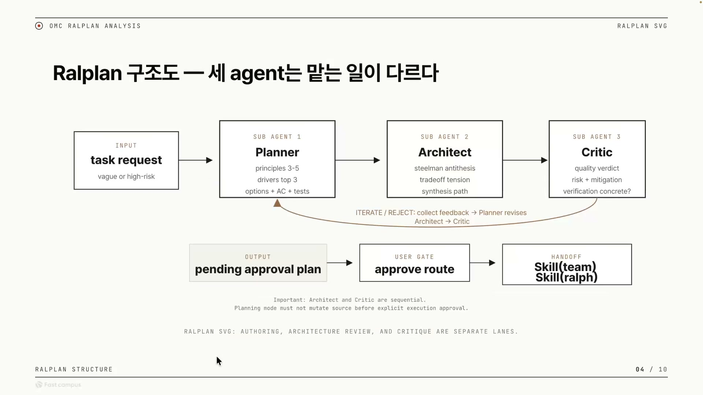

세 에이전트가 맡는 일은 서로 다르다.

| 순서 | 에이전트 | 책임 | 풀어서 |
|------|---------|------|--------|
| SUB AGENT 1 | Planner | principles 3-5 / drivers top 3 / options + AC + tests | 원칙 3\~5개를 잡고, 가장 중요한 동인 상위 3개를 추리고, 선택지와 완료 조건(AC = acceptance criteria, 합격 기준)과 테스트를 묶어 계획을 작성한다 |
| SUB AGENT 2 | Architect | steelman antithesis / tradeoff tension / synthesis path | 계획을 일부러 가장 강하게 반박(steelman)하고, 트레이드오프의 긴장 지점을 드러내며, 그걸 봉합할 종합 경로를 찾는다. 구조적으로 문제없는지 검토한다 |
| SUB AGENT 3 | Critic | quality verdict / risk + mitigation / verification concrete? | 품질 판정을 내리고, 리스크와 완화책을 점검하며, "검증이 구체적인가?"를 따진다. 적대적으로 깐다 |

흐름은 task request에서 Planner → Architect → Critic으로 가다가, Architect나 Critic이 거절(REJECT)하면 피드백을 모아 Planner가 다시 고치고(revises) 또 Architect → Critic 순서로 검토받는다. 승인이 날 때까지 같은 계획을 계속 깎는다. 통과한 뒤에도 곧장 실행하지 않는다. 출력은 "승인 대기 계획(pending approval plan)"으로 나가고, 실제 사람이 한 번 더 승인하는 유저 게이트(휴먼인더루프)를 거친 다음에야 실행 스킬(team 또는 ralph)로 핸드오프된다.

강연자가 Critic을 설명하며 한 말이 인상적이다. Critic은 "항상 거절하는 친구"라는 것이다. 이건 버그가 아니라 설계된 적대성이다. Critic의 기본 태도를 통과가 아니라 거절로 둬야, Planner는 Critic을 납득시키기 위해 계획을 더 단단하게 만들 수밖에 없다. 쉽게 통과되는 검토는 검토가 아니라는 철학이 깐깐한 반대자 한 명으로 박혀 있는 셈이다.

슬라이드 하단의 두 줄 주의문이 이 구조의 못이다. 하나, **Architect와 Critic은 순차(sequential)다.** 동시에 돌리지 않고 구조 검토가 먼저, 비평이 그 다음이다. 둘, **플래닝 모드는 명시적 실행 승인 전까지 소스(원본 코드)를 건드리면 안 된다.** 계획 단계에서는 절대 파일을 수정하지 않는다. 실수의 비용이 가장 싼 시점, 아직 한 줄도 안 짠 시점에 모호함을 다 제거하겠다는 것이다.

참고로 랄플랜 앞단에는 딥 인터뷰(deep interview)라는 단계가 하나 더 있다. 오로보로스(Ouroboros)의 소크라틱 리즈닝(질문을 던져 모호한 요청을 다듬는 방식)을 OMC로 가져온 것으로, 합의 루프에 들어가기 전 사용자의 모호한 요청 자체를 질문으로 한 번 더 다듬는다.

## 실행 파이프라인: 팀 패스와 랄프 패스

랄플랜이 계약을 만들면, 승인된 계약은 두 갈래의 실행 경로 중 하나로 흘러간다. 전체 그림을 한 장으로 보면 이렇다.

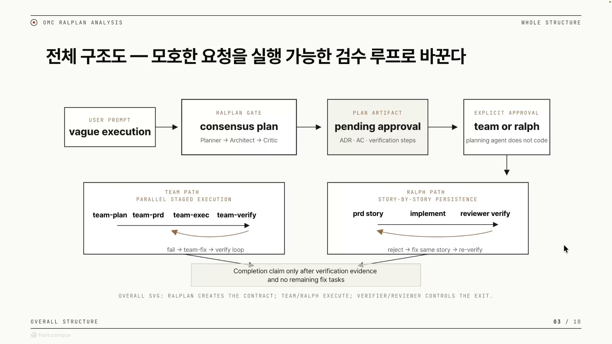

상단 가로줄은 모호한 요청이 실행 가능한 계약으로 바뀌는 과정이다. `vague execution`(모호한 실행 요청)에서 시작해 `consensus plan`(Planner → Architect → Critic 합의 계획)을 거치고, `pending approval`(승인 대기 산출물)에 도달한다. 이 산출물이 곧 계약인데, 구체적으로는 ADR(어떤 구조 · 결정을 택했는지 기록) · AC(합격 기준) · verification steps(검증 절차) 세 가지가 합쳐진 것이다. 마지막으로 `team or ralph`, 즉 사용자가 명시적으로 승인하고 나서야 두 실행 모드 중 하나를 고른다. 이 박스 아래에 적힌 한 줄이 핵심이다. `planning agent does not code`, 계획 에이전트는 코드를 짜지 않는다.

승인을 받은 계약은 하단 두 경로 중 하나로 내려간다.

- **TEAM PATH (병렬 스테이지 실행)**: `team-plan → team-prd → team-exec → team-verify` 로 스테이지마다 다른 전문가(스페셜리스트)가 자기 몫을 맡는다. 검증에서 실패가 나면 `team-fix`가 고치고 다시 verify로 돌아간다.
- **RALPH PATH (스토리 단위로 끈질기게)**: `prd story → implement → reviewer verify` 를 한 스토리에 대해 반복한다. 리뷰어가 거부(reject)하면 같은 스토리를 다시 고쳐 재검증하고, 통과할 때까지 그 스토리에 매달린 뒤 다음으로 넘어간다.

두 패스의 차이를 한 표로 정리하면 이렇다.

| | RALPH PATH | TEAM PATH |
|---|---|---|
| 구조 | 한 줄기로 빙빙 도는 반복 루프 | 스테이지별 스페셜리스트 분담 |
| 단계 | prd story → implement → reviewer verify | team-plan → team-prd → team-exec → team-verify |
| 루프 조건 | reject → fix same story → re-verify | fail → team-fix → verify loop |
| 작업 단위 | 스토리 하나에 끝까지 매달림 | 스테이지마다 다른 에이전트로 분리 |

두 경로 모두 같은 종료 조건을 공유한다. 슬라이드 가운데로 모이는 박스에 적힌 문구다. "Completion claim only after verification evidence and no remaining fix tasks(완료 선언은 검증 증거가 있고, 남은 픽스 작업이 없을 때만)." 강연자의 표현으로는 "어떤 픽스가 아예 없으면, 고칠 게 없으면 멈춘다." 픽스가 하나라도 남아 있는 한 루프는 멈추지 않는다. 멈추는 기준이 에이전트의 주관적 판단("다 한 것 같다")이 아니라 객관적 상태("고칠 게 0개다")라는 게 이 구조의 강함이다.

### 누가 누구를 띄우는가: 메인 세션 런타임 루프

위 파이프라인의 스테이지들은 추상적인 박스가 아니라, 하나의 메인 세션이 서브에이전트를 띄워 돌리는 런타임 구조 위에서 동작한다.

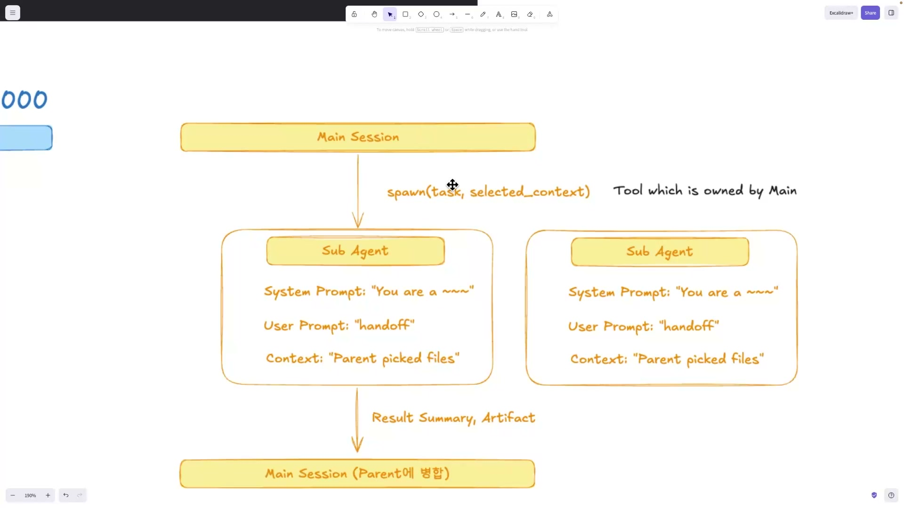

메인 세션이 서브에이전트를 띄우는 호출이 `spawn(task, selected_context)`이고, 그 옆에 "Tool which is owned by Main(메인이 소유한 도구)"라고 적혀 있다. 서브에이전트가 또 다른 서브에이전트를 마음대로 띄우는 게 아니라 통제권이 메인에 집중돼 있다는 뜻이다. 인자도 둘인데, 맡길 작업(task)과 메인이 골라서 넘겨주는 컨텍스트(selected_context)다. 메인이 자기 컨텍스트 전부가 아니라 필요한 부분만 선별해 자식에게 건넨다.

띄워진 서브에이전트는 세 가지를 받아 시작한다. 시스템 프롬프트("You are a \~\~\~", 너는 무슨 역할이다), 유저 프롬프트("handoff", 인계받은 작업 지시), 컨텍스트("Parent picked files", 부모가 골라준 파일들). 일을 마치면 작업 과정 전체가 아니라 결과 요약(Result Summary)과 산출물(Artifact)만 메인 세션으로 돌려보내 병합한다.

이 루프가 만드는 건 컨텍스트 위생(context hygiene)이다. 자식은 자기 일에 필요한 것만 보고 일하니 메인의 컨텍스트가 오염되지 않고, 메인은 자식의 장황한 로그가 아니라 결론만 받는다. 그리고 팀 스킬은 이 루프 위에서 stage(plan / prd / exec / verify / fix)별로 각각의 스페셜리스트를 라우팅하며 서브에이전트 팀을 만든다.

강연자가 여기서 강조한 통찰이 하나 있다. "서브에이전트를 병렬로 수행하는 것도 중요하지만, 전체 흐름을 강제하는 스킬 자체도 중요하다." 병렬 실행은 속도를 주지만, 흐름을 강제하는 스킬이 없으면 격리된 서브에이전트들은 제각각 흩어진다. OMC는 통제권은 메인에 집중하고, 흐름은 스킬이 강제하고, 출구는 검증이 통제하는 세 겹의 강제로 자율 에이전트의 무질서를 잡는다.

## 3단 검수 게이트: "done"은 아직 승인이 아니다

이제 OMC의 검수 구조다. 강연자가 "재밌어서 가져왔다"고 한 부분이다. 출발점은 단호하다. 에이전트가 스스로 "done"이라고 말해도 그건 아직 받아들여지지 않은 것(not accepted yet)이다.

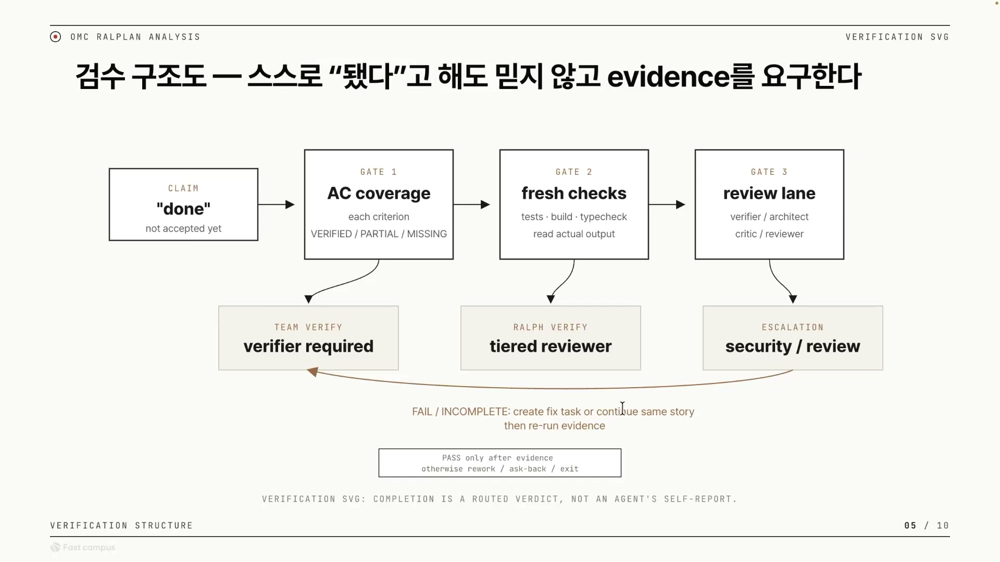

"done이라고 주장하면 3개의 레이어가 존재한다"는 게 강연자 설명이다. 게이트마다 검증하는 종류가 다르다.

| 게이트 | 이름 | 무엇을 보나 | 박스 안 텍스트 |
|---|---|---|---|
| GATE 1 | AC coverage | 완전성: 인수 기준을 항목별로 다 충족했는가 | each criterion / VERIFIED · PARTIAL · MISSING |
| GATE 2 | fresh checks | 현실성: 실제로 동작하는가 | tests · build · typecheck / read actual output |
| GATE 3 | review lane | 품질: 잘 만들었는가 | verifier / architect / critic / reviewer |

GATE 1의 판정값이 점수가 아니라 `VERIFIED / PARTIAL / MISSING`이라는 상태 라벨인 게 상징적이다. 강연자가 따로 짚는다. "점수가 아니라, 무엇을 고쳐야 하는지 확실히 얘기해줘야 한다." "73점입니다"는 다음 행동을 알려주지 못하지만, "기준 3번이 MISSING"은 무엇을 할지를 가리킨다. GATE 2의 `read actual output`(실제 출력을 읽음)도 같은 결이다. 에이전트가 "테스트 통과했어요"라고 말하는 것으로는 부족하고, 새로(fresh) 돌린 빌드 · 테스트의 진짜 출력이 근거여야 한다.

세 게이트 아래에는 회색 박스가 하나씩 매달려 있다. 그 게이트를 더 강하게 거는 방식이다. GATE 1 아래 TEAM VERIFY(팀 모드에서는 verifier가 반드시 검증), GATE 2 아래 RALPH VERIFY(랄프 루프에서는 tiered reviewer가 다시 검증), GATE 3 아래 ESCALATION(위험하면 security 리뷰 등으로 에스컬레이션). 실패(FAIL/INCOMPLETE)하면 fix task를 새로 만들거나 같은 스토리를 이어서 다시 하고, 증거를 다시 돌린다(re-run evidence). 통과(PASS)는 오직 증거가 있을 때만이다.

여기서 강연자의 핵심 통찰이 나온다. 세 게이트가 각각 LLM as judge로 돌아간다는 것이다. 즉 검수 주체를 사람이 아니라 또 다른 LLM 심사자에게 맡기되, 그것을 세 군데에 둔다. AC 커버리지도 LLM as judge, fresh check도 빌드가 제대로 동작하는지 진짜 출력을 보고 LLM as judge, review lane도 LLM as judge. 강연자 말 그대로 "LLM as judge, LLM as judge, LLM as judge"인 3단계 구조다. 중요한 건 세 심사가 보는 대상이 다르다는 점이다. 같은 질문("done 맞아?")을 세 번 묻는 게 아니라, 완전성 · 현실성 · 품질이라는 세 축으로 나눠 각각에 심사자를 붙였다. 한 심사자가 놓치는 걸 다른 축이 잡는 다층 구조다.

### 검수 강도는 변경 위험에 따라 올라간다

같은 게이트라도 얼마나 강하게 걸지는 변경의 위험도에 따라 3티어로 나뉜다.

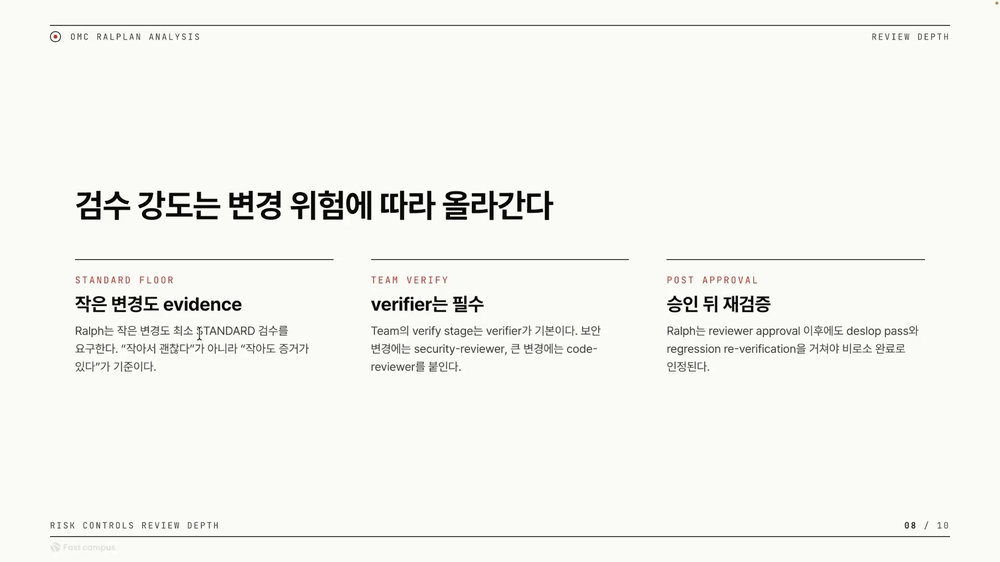

- **STANDARD FLOOR (바닥선)**: Ralph는 작은 변경도 최소 STANDARD 검수를 요구한다. "작아서 괜찮다"가 아니라 "작아도 증거가 있다"가 기준이다.
- **TEAM VERIFY (팀 검증)**: Team의 verify stage는 verifier가 기본이다. 보안 변경에는 security-reviewer, 큰 변경에는 code-reviewer를 붙인다.
- **POST APPROVAL (승인 후)**: Ralph는 reviewer approval 이후에도 deslop pass(AI가 만든 군더더기, 즉 slop을 걷어내는 패스)와 regression re-verification(회귀 재검증)을 거쳐야 비로소 완료로 인정된다.

티어가 높을수록 강도가 누적된다. 1번 티어의 메시지가 이 구조 전체의 정신이다. 작은 변경이라고 검수를 면제하지 않는다. 3번 티어는 흔한 직관을 깬다. 보통 리뷰어가 승인하면 끝이라고 생각하지만, 여기선 승인이 끝이 아니다.

## 책임을 나누는 것이지 많이 띄우는 게 아니다

지금까지의 디테일이 결국 무엇을 위한 것인지, 강연자는 한 문장으로 못 박는다. "서브에이전트를 많이 띄우는 게 아니라, 책임을 나눈다." 같은 멀티에이전트 시스템을 두 가지 렌즈로 보면 차이가 분명해진다.

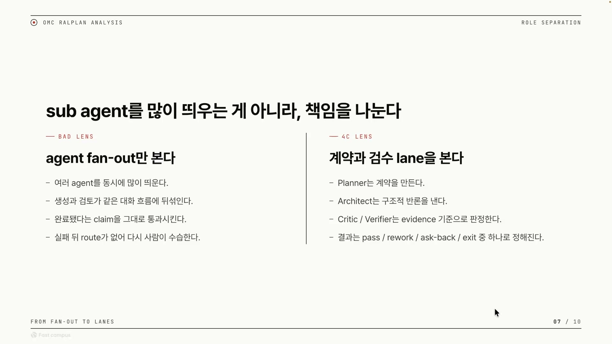

| | BAD LENS (agent fan-out만 본다) | 4C LENS (계약과 검수 lane을 본다) |
|---|---|---|
| 무엇을 하나 | 여러 에이전트를 동시에 많이 띄운다 | Planner는 계약을 만든다 |
| 흐름의 모양 | 생성과 검토가 같은 대화 흐름에 뒤섞인다 | Architect는 구조적 반론을 낸다 |
| 클레임 처리 | "완료됐다"는 claim을 그대로 통과시킨다 | Critic / Verifier는 evidence 기준으로 판정한다 |
| 실패 시 | route가 없어 다시 사람이 수습한다 | pass / rework / ask-back / exit 중 하나로 정해진다 |

왼쪽은 "에이전트를 많이 = 잘"이라는 직관의 함정이다. 동시에 많이 띄우고 메인 세션에 검토를 떠넘기면, 생성과 검토가 뒤섞여 무엇이 끝났고 무엇이 검증됐는지 경계가 흐려진다. 그러면 검증 안 된 클레임이 그냥 통과된다. 강연자 결론은 "에이전트의 병렬 처리만으로는 좋지 않다"는 것, 그리고 LLM as judge를 적극 써서 검증되지 않은 클레임이 통과하지 못하게 해야 한다는 것이다. 병렬성은 수단이지 목적이 아니다. 흐름을 잡지 못한 병렬은 오히려 해롭다.

이 철학은 슬로건으로만 있는 게 아니라 레포의 스킬 파일들에 검증 가능한 제약으로 박혀 있다.

| 근거 파일 | 확인한 구조 | 강의 해석 |
|---|---|---|
| skills/ralplan | plan --consensus 별칭. Planner·Architect·Critic 합의 루프. 명시 승인 전 source mutation 금지 | C1 Contract를 실행 전에 확정한다 |
| skills/plan | Architect와 Critic은 순차 실행. Critic 미승인 시 최대 5회 re-review loop | 병렬 수량보다 review order가 중요하다 |
| skills/team | team-plan → team-prd → team-exec → team-verify → team-fix. stage별 specialist routing | C2-C3가 stage와 handoff로 남는다 |
| skills/ralph | PRD story별 acceptance criteria, reviewer verification, deslop, regression re-verification | C4 Confidence는 fresh evidence까지 요구한다 |

특히 skills/plan의 "Critic 미승인 시 최대 5회 re-review loop"가 "많이 띄우기 ≠ 잘 쓰기"의 가장 직접적인 증거다. 동시에 몇 개를 띄웠느냐가 아니라 어떤 순서로 검토가 도느냐가 품질을 만든다. 책임 분리는 "승인 전 mutation 금지", "Critic 미승인 시 5회 재리뷰", "fresh evidence 요구" 같은 코드 차원의 가드레일로 존재한다.

## 검수를 코드로: Deterministic Review Gate

여기까지가 OMC가 실제로 한 일이다. 그런데 강연자는 한 발 더 나간다. OMC의 검수 3단이 모두 LLM as judge라는 점에서 한계를 본다.

> 검증 자체를 또 LLM에게 맡겨버리면, 그리고 인간이 한 번 더 마지막에 검증을 해야 하는데, 이걸 어떻게 Deterministic Gate를 통해 인간의 감시 비용을 없앨지가 관건이다.

LLM as judge로 검수하면 토큰을 쓰고, 느려지고, 그 검수 과정에서 또 할루시네이션이 날 수 있다. 결정적으로, 검증을 LLM이 하면 그 검증이 맞는지 사람이 다시 봐야 한다. 자동화의 목적이 무너진다. 그래서 강연자가 제안하는 건 결정론적 코드 게이트다. 같은 입력이면 항상 같은 판정이 나오니 사람이 다시 확인할 필요가 없다. 핵심은 "전부 코드로 하라"가 아니라, 코드로 잡을 수 있는 건 코드로 잡아 사람의 개입 지점을 최소화하자는 것이다.

게이트는 검수 한 건이 마크다운 한 장으로 끝나도록 짠 템플릿이다.

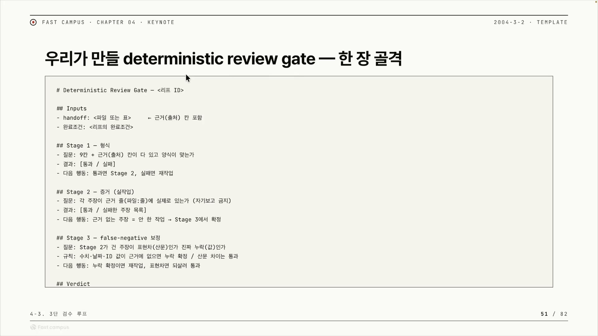

세 단계로 판단한다.

- **Stage 1 (형식)**: 가장 싼 검사. handoff가 정해진 9칸 + 근거(출처) 칸을 다 갖췄고 양식이 맞는지만 본다. 실패면 즉시 재작업으로 돌린다. 증거까지 볼 것도 없다.
- **Stage 2 (증거, 실작업)**: 핵심이다. 각 주장이 근거 줄(파일:줄)에 실제로 존재하는지 본다. 포인트는 자기보고 금지다. 에이전트가 "했습니다"라고 말한 걸 믿지 않고 실제 파일의 줄을 가리켜야 한다. 근거 없는 주장은 안 한 작업으로 취급한다.
- **Stage 3 (false-negative 보정)**: Stage 2는 빡빡해서 거짓 부정을 낼 수 있다. 실제로는 맞는데 표현이 달라서 "근거 없음"으로 잘못 걸린 경우다. 규칙은 명확하다. 수치 · 날짜 · ID 같은 값이 근거에 없으면 진짜 누락으로 확정(재작업), 단순한 표현 차이(산문 paraphrase)면 통과로 되살림. 값은 엄격히, 문장은 너그럽게 가른다.

이게 실제로 돌아가는 모습을 강연자가 회의록 본문 초안 검수로 보여준다.

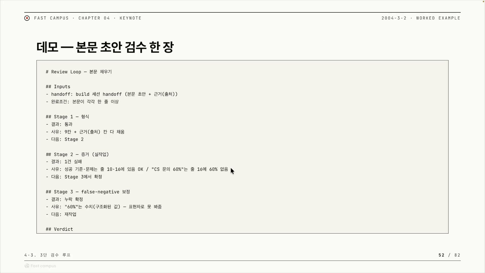

따라가 보면 이렇다. Stage 1은 9칸과 근거 칸을 다 채워 통과. Stage 2에서 1건 실패가 난다. '성공 기준' · '문제' 같은 주장은 근거 줄(줄 10, 줄 16)에 실제로 있어서 OK인데, "CS 문의 60%"라는 주장은 근거로 가리킨 줄 16에 정작 60%라는 값이 없다. 자기보고는 "근거 있음"이지만 실제 줄엔 없으니 실패. Stage 3로 넘어가 확정한다. 만약 "60%"가 단순한 문장 표현 차이였다면 되살렸겠지만, "60%"는 수치라서 표현차로 봐주지 않는다. 누락 확정. 최종 판정은 rework다. Stage 2의 빡빡함이 거짓 주장을 잡고, Stage 3의 보정 규칙이 멀쩡한 걸 떨어뜨리는 일을 막는다. 둘이 짝으로 돌아야 검수가 신뢰할 만해진다.

### verdict에는 반드시 route를 붙인다

강연자가 가장 힘주어 말한 원칙이다. 판정(verdict)을 던질 때 점수나 평가만 주지 말고, 다음 행동(route)을 꼭 같이 줘야 한다. "이거 받으면 뭐 해?"에 답해야 한다는 것이다.

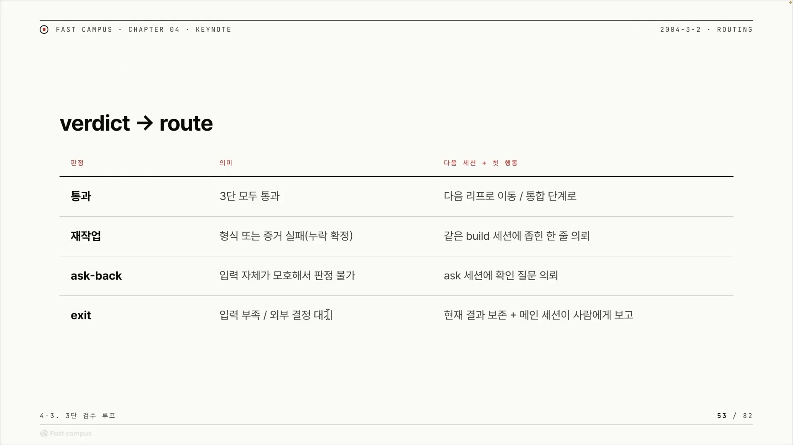

- **통과(pass)**: 3단 모두 통과 → 다음 리프로 이동하거나 통합 단계로.
- **재작업(rework)**: 형식 또는 증거 실패(누락 확정) → 같은 build 세션에 "이것만 고쳐라"고 좁힌 한 줄로 되던진다. 통째로 다시 시키지 않는다.
- **ask-back**: 틀린 게 아니라 입력 자체가 모호해서 판정 불가 → ask 세션에 확인 질문을 돌린다.
- **exit**: 입력 부족이거나 외부 결정(사람 · 다른 시스템)을 기다려야 함 → 현재 결과를 보존하고 메인 세션이 사람에게 보고한다.

여기서 눈여겨볼 건 네 판정 중 exit만이 사람을 부르는 출구라는 점이다. 나머지 셋은 기계 안에서 루프가 돈다. 점수만 주면 받은 쪽이 다시 사람에게 물어야 하지만, 판정마다 다음 행동을 명시하면 다음 세션이 사람 개입 없이 바로 움직인다. 그래서 검수가 사람을 부르는 지점이 exit 하나로 좁혀진다. 강연자에 따르면 이 verdict → route 방식은 OMC도 오로보로스도 이미 그렇게 되어 있고, 요즘 하네스들의 공통 움직임이라고 한다. 입력 쪽은 소크라틱 리즈닝으로 모호함을 깎고, 출력 쪽은 route를 붙인 verdict로 다음 행동을 명시하는 흐름이다.

다만 코드 게이트가 어디서나 깔끔하게 되는 건 아니다. 서브에이전트는 입출력이 분리돼 있어 코드 게이트를 끼우기 좋지만, 메인 세션 런타임 루프에서는 코드로 게이트를 만들기 쉽지 않다. 그래서 OMC가 한 방식대로 서브에이전트가 다른 서브에이전트를 검수하게 해 사람이 보기 쉬운 형식을 만들어 우회하고, MCP 안으로 넘어가면 독자적인 런타임이 생기므로 거기선 다시 코드로 검증할 수 있다.

## 정리하며

강의를 관통하는 한 문장은 처음과 끝이 같다. AI 에이전트를 잘 쓴다는 건 서브에이전트를 많이 띄우는 게 아니라, 검증할 수 있는 책임 경계를 나누고 그 흐름을 강제하는 것이다. 강연자가 OMC라는 실제 사례로 증명한 흐름은 이렇게 요약된다.

1. **문제**: 결정론적으로 검증하지 못하면 결국 사람의 감시 비용이 남는다.
2. **OMC의 해법**: 4C로 세션 경계를 나누고, 랄플랜으로 계획의 모호함을 깎고, 팀 · 랄프 패스로 실행을 분리하고, 3단 게이트와 3단계 LLM as judge로 검증한다. 실행과 검토를 같은 책임으로 섞지 않는다.
3. **OMC의 한계**: 검수 3단이 모두 LLM as judge라, 토큰 · 속도 · 할루시네이션 비용이 들고 사람의 마지막 검증이 완전히 사라지지 않는다.
4. **강연자의 지향**: LLM 판정 일부를 코드 기반 Deterministic Review Gate로 대체해 감시 비용을 더 줄인다. 3단(형식 → 증거 → false-negative 보정) + 4판정(pass · rework · ask-back · exit, 각각 route 포함)을 한 장의 마크다운으로 끝낸다.

처음 OMC의 검수 루프를 보면 게이트가 세 개에, 티어가 세 개에, 심사자가 또 LLM이라 복잡해 보인다. 그런데 그 복잡함의 목적은 단 하나, "다 했다"는 말 대신 증거로 라우팅된 완료를 만드는 것이다. 슬라이드 문구 그대로 "완료는 에이전트의 자기 보고가 아니라, 라우팅된 판정이다."

따라 만들 게 아니라 가져갈 것은 분명하다. 계획 · 실행 · 검수를 한 맥락에 섞지 말 것, verdict에는 route를 붙일 것, 그리고 코드로 잡을 수 있는 검수는 코드로 끌어내려 사람이 다시 보지 않아도 되게 할 것. 검수를 기능 구현의 뒷처리가 아니라 설계의 1급 시민으로 두는 순간, 에이전트 시스템의 품질이 달라진다는 게 이 강의가 남기는 한 가지다.
