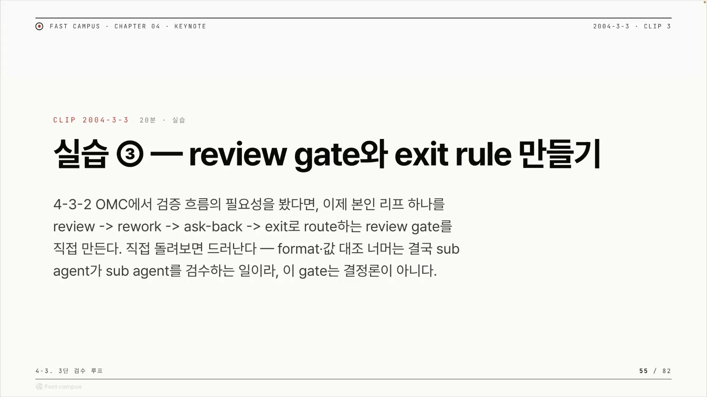
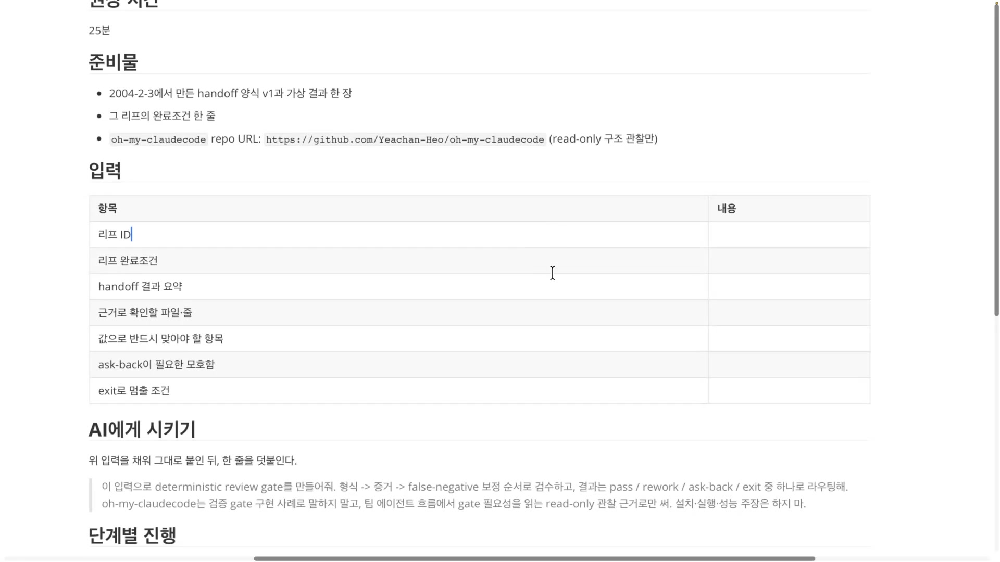
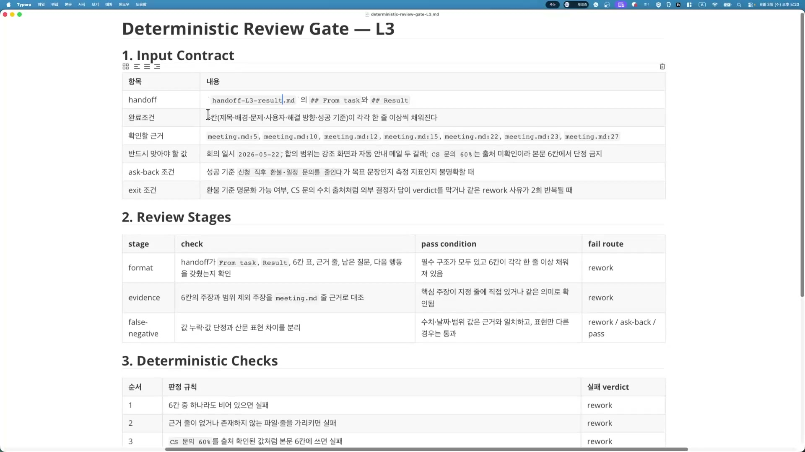
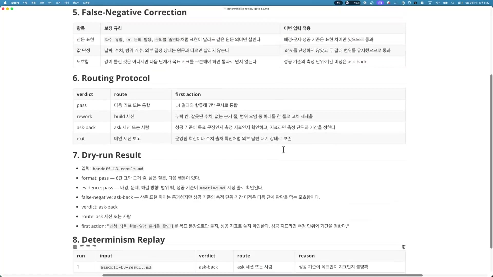
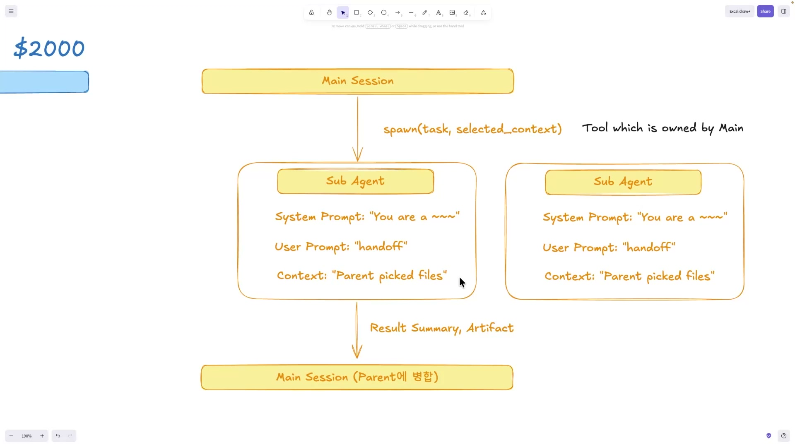
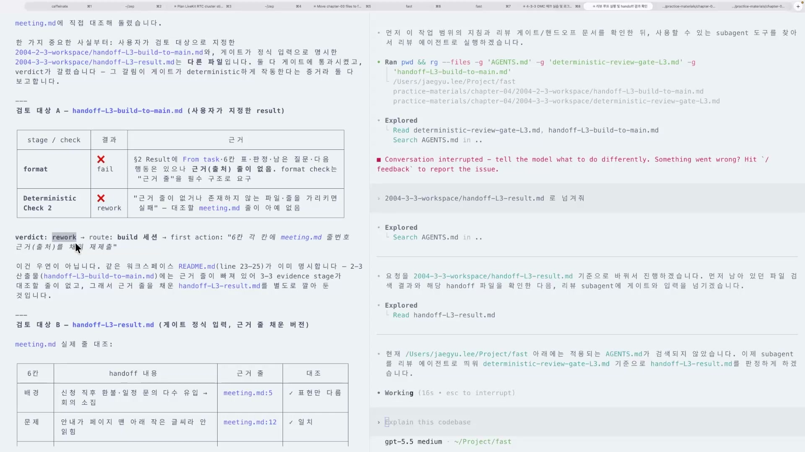
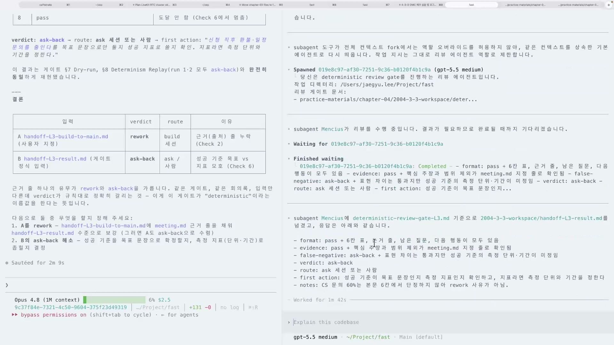
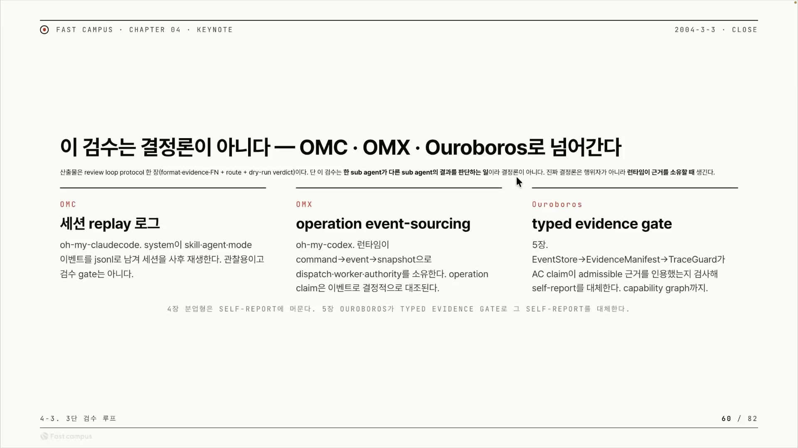

AI에게 일을 시키는 건 이제 쉬운 축에 든다. 큰 목표를 작은 작업으로 쪼개고, 서브 에이전트에게 리프(leaf) 하나씩 던지면 알아서 코드를 짜고 글을 채워 결과를 들고 온다. 문제는 그 다음이다. 서브 에이전트가 "다 했습니다" 하고 내민 결과물을, 누가 검사하나?

매번 사람이 직접 읽으면 된다. 하지만 그건 확장이 안 된다. 에이전트 열 개를 병렬로 돌려 놓고 그 출력을 사람이 하나하나 다시 읽어야 한다면, 자동화의 이점이 사라진다. 그래서 검수 자체를 시스템으로 만들어야 한다. 결과물을 받아서 통과시킬지, 다시 시킬지, 사람에게 되물을지를 정해주는 <strong>게이트(gate)</strong>가 필요하다.

이 글은 패스트캠퍼스 "3단 검수 루프" 챕터의 실습 한 편을 정리한 것이다. 강의에서는 앞서 케이스 스터디로 뜯어본 OMC(oh-my-claudecode)의 검수 구조를 참고해, 서브 에이전트의 출력을 거르는 리뷰 게이트를 직접 만들어 본다. 핵심은 두 가지 기준이다. 언제 멈추고(exit), 언제 사람에게 되묻는가(ask-back).

## "LLM아, 검수해줘"는 왜 못 믿나

LLM에게 검수를 시키는 것만으로는 결정론적(deterministic)이지 않다. 결정론적이지 않다는 건, 같은 결과물을 같은 기준으로 두 번 검사해도 판정이 흔들릴 수 있다는 뜻이다.

이건 강의가 발명한 문제가 아니라 LLM-as-a-judge라는 패턴 자체가 안고 있는 한계다. LLM에게 다른 LLM(또는 자기 자신)의 출력을 채점시키면, 의미 품질은 대규모로 잡아낼 수 있지만 샘플링 때문에 판정이 매번 조금씩 달라지고, 먼저 본 답을 후하게 보거나(위치 편향) 긴 답을 선호하거나(길이 편향) 자기가 쓴 답을 편애하는(자기선호 편향) 경향이 끼어든다. 강의자도 이 점을 숨기지 않는다. 면밀히 말하면 여기서 배우는 리뷰 게이트는 결정론적이지 않다는 것이고, 다음 편에서 진짜 결정론적인 게이트가 무엇인지 알아보자고 한다. 이번 실습은 처음부터 불완전한 1단계임을 인정하고 들어가는 셈이다.

그렇다면 LLM 검수가 못 미덥다고 손으로 돌아갈 게 아니라, 못 믿는 부분과 믿어도 되는 부분을 갈라야 한다. 출력 형식이 맞는지, 빈 칸이 있는지 같은 **구조적인 판정은 코드로** 처리하면 항상 같은 답이 나온다. 반대로 "이 수치가 근거와 정말 맞는가" 같은 **의미 판단은 LLM에게** 맡길 수밖에 없다. 게이트의 설계는 결국 이 둘을 어떻게 나누고, 나뉜 판정을 어떻게 하나의 행동으로 합치느냐의 문제다.

## 게이트의 입력: 무엇을 받아 검수하나

게이트는 허공에서 검수하지 않는다. 검수를 시작하려면 <strong>입력 계약(input contract)</strong>이 있어야 한다. 무엇을 받아서, 무엇과 대조해 판정할지를 미리 못박아 두는 약속이다. 강의에서 쓰는 입력은 세 가지다. 앞 실습(handoff 설계 편)에서 만든 핸드오프 양식, 그 핸드오프를 수행한 가상 결과 한 장, 그리고 그 리프의 완료 조건.

이 셋을 그냥 던지는 게 아니라, 입력 계약서의 정해진 칸에 채워 넣는다.

| 항목 | 의미 |
|---|---|
| 리프 ID | 어떤 작업 단위의 결과인가 |
| 리프 완료조건 | 이 작업이 "끝났다"의 정의 |
| handoff 결과 요약 | 서브 에이전트가 했다고 보고한 내용 |
| 근거로 확인할 파일 · 줄 | 그 보고를 대조할 출처 |
| 값으로 맞아야 할 항목 | 수치 · 날짜 · 범위처럼 정확히 일치해야 하는 것 |
| ask-back이 필요한 모호함 | 확신이 안 서면 사람에게 되물을 지점 |
| exit로 멈출 조건 | 더 진행하지 않고 멈춰야 할 조건 |

여기서 눈여겨볼 칸은 마지막 둘이다. **게이트를 만들기 전에 이미 "어디서 되묻고 어디서 멈출지"를 입력에 박아 둔다.** exit과 ask-back은 나중에 즉흥적으로 떠올리는 게 아니라, 검수를 시작하기도 전에 계약으로 선언하는 조건이다.

완료 조건도 단순한 메모가 아니다. "이 태스크가 어떻게 끝났는지"에 대한 판정 룰을 제공하는 형태여야 한다. 즉 완료 조건은 게이트가 결과를 무엇과 비교해 합격/불합격을 가를지 정해주는 자(尺)다.

## 3단 검수: 형식, 증거, 값

입력이 갖춰지면 게이트는 세 축으로 결과물을 본다.

- **Format**: 출력 형식이 맞는가. 요구한 표 · 칸이 다 있는가.
- **Evidence**: 증거를 제대로 줬는가. 주장에 붙은 출처가 실제로 맞는가.
- **Value(값)**: 수치 · 날짜 · 범위가 근거와 일치하는가.

세 축을 나란히 두면 코드와 LLM의 분업선이 또렷이 보인다. Format은 기계적으로 판정할 수 있다. 비어 있는 칸이 있는지, 형식이 깨졌는지는 규칙으로 거르면 항상 같은 답이 나온다. 반면 Value는 강의자 표현으로 "사실 찾기가 애매한" 영역이다. 근거 파일의 어떤 줄과 결과의 어떤 숫자가 같은 것을 가리키는지를 판단하려면 의미를 읽어야 한다. 그래서 여기엔 LLM 저지가 필요하다.

형식 쪽 판정을 떠받치는 게 결정론적 체크(Deterministic Checks)다. "비어 있다" 같은 구조적 결함을 코드로 잡아 곧장 판정을 내린다. 그리고 각 주장이 어떤 근거(파일 · 줄)에 매여 있는지를 표로 정리한 Evidence Matrix가 그 옆에 붙는다. 이건 서브 에이전트의 자기 보고(self-report)를 그냥 믿지 않고, 보고와 근거를 대조하려는 장치다. "에이전트의 자평을 믿지 않는다"는 이 발상이 진짜 결정론으로 가는 길목의 핵심이 된다.

이런 명세 문서를 사람이 처음부터 손으로 다 쓰지는 않는다. 강의에서는 입력 계약을 채운 뒤 "deterministic review gate를 만들어줘"라는 한 줄을 덧붙여 클로드나 코덱스에게 문서를 생성시킨다. 결과로 나온 `deterministic-review-gate-L3.md`에는 입력 계약부터 리뷰 스테이지, 결정론적 체크, 증거 매트릭스, 라우팅, 모의 실행 결과, 결정성 재현까지 한 장으로 담긴다.

## verdict는 점수가 아니라 행동이다

**판정(verdict)은 점수가 아니라 다음에 할 행동이어야 한다.**

게이트가 "0.7점"이라고 답하면 어떻게 되나. 메인 세션은 그 숫자를 받아 "0.7이면 통과인가 재작성인가"를 다시 해석해야 한다. 그 해석이 또 흔들린다. 점수로 두는 순간 비결정성이 한 겹 더 쌓인다. 강의자의 말 그대로다. "벌딕(verdict)을 받고 뭘 해야 되는지를 넘겨 주어야만 우리가 이걸 추론할 필요가 없다."

그래서 게이트의 판정은 숫자가 아니라 네 가지 행동 중 하나로 떨어진다.

| verdict | route (어디로) | first action (무엇부터) |
|---|---|---|
| **pass** | 다음 리프 또는 통합 | 결과를 합류해 문서로 통합 |
| **rework** | build 세션 | 누락 칸, 잘못된 수치, 없는 근거, 범위 오염 중 하나를 고쳐 재제출 |
| **ask-back** | ask 세션 또는 사람 | 성공 기준이 목표 문장인지 측정 지표인지 확인, 지표라면 단위 · 기간을 정함 |
| **exit** | 메인 세션 보고 | 외부 답변 대기처럼 멈춰야 할 상태로 보존 |

판정이 곧 행동 지시이기 때문에, 메인 세션은 결과를 해석할 필요 없이 바로 라우팅한다. `rework`가 나오면 build 세션으로 돌려 고쳐 오게 하고, `ask-back`이 나오면 사람(또는 질문 전담 세션)으로 넘긴다. 이게 강의 제목이 약속한 두 기준의 정체다. exit은 더 진행하지 않고 멈춰 보존해야 할 조건(이를테면 외부 답을 기다려야 하는 상황)에서 떨어지고, ask-back은 게이트가 혼자 확신하기엔 모호한 지점에서 사람에게 escalate하는 통로다.

ask-back을 따로 두는 이유는 분명하다. LLM 저지를 거쳐 의미까지 봤다 해도, 결국 남는 질문은 "이걸 위임해도 되는가"다. LLM의 결과물은 확률적이라, 프로그램으로 검증되지 않는 한 마지막엔 사람이 한 번 봐야 한다. ask-back은 그 사람-검수를 시스템 안의 정식 분기로 끌어들인 장치다. 게이트가 모든 걸 통과시키는 척 넘기는 거짓 음성(false-negative)을 막는 안전판이기도 하다.

## 데모: 같은 게이트, 두 런타임

말로만 설계하면 미덥지 않으니 실습은 게이트를 실제로 돌려 본다. 앞 실습에서 만든 핸드오프와 가상 결과를 입력으로, 리뷰 루프를 코덱스에서 한 번, 클로드에서 한 번 실행한다.

검수를 직접 수행하는 건 메인 세션이 소환(spawn)한 서브 에이전트다. 메인이 리뷰 에이전트를 띄우고, 그 에이전트가 게이트 문서를 읽어 판정을 내린 뒤 결과를 부모(parent) 세션으로 돌려 병합한다.

이때 서브 에이전트에게 넘기는 건 세 가지로 갈린다. **System Prompt**로 "당신은 무엇이다"라는 역할을 정하고, **Context**로 리뷰 게이트 규칙 문서를 넣고, **User Prompt**로 검수할 핸드오프 결과를 던진다. 검수 규칙(Context)과 검수 대상(User Prompt)을 분리해 주는 게 핵심이다.

실행 결과를 읽어 보면, 한 입력에서는 형식이 깨져 `rework`가 떨어지고 build 세션으로 라우팅된다.

다른 입력에서는 형식과 증거는 통과(pass)했지만 거짓 음성 교정 단계에서 모호함이 잡혀 `ask-back`이 나온다. 구체적으로는 "신청 직후 환불 · 일정 문의를 줄인다"는 문장을 목표 문장으로 둘지, 성공 지표로 쓸지가 불분명했고, 지표라면 측정 단위와 기간을 정해야 한다는 되물음이다. 게이트가 6개 항목을 다 점검하고, 결정론적 체크도 동작한 끝에 내린 판정이다.

흥미로운 건 코덱스와 클로드가 같은 판정에 수렴했다는 점이다. 두 에이전트 모두 `ask-back`을 냈다. 이 게이트는 코드로 컴파일되어 도는 프로그램이 아니라 마크다운 문서로만 정의돼 있는데도, 서로 다른 두 런타임이 같은 결과를 낸 것이다. 검수 프로토콜을 문서 한 장으로 못박아 두면 어느 에이전트에 물려도 비슷하게 동작한다는, 이식 가능성의 약한 증거다. 다만 강의자도 단서를 단다. LLM 저지인 이상 여러 번 돌려 봐야 더 확실하고, 두 번 같았다고 결정론이 보장되는 건 아니다.

## 솔직한 한계: 이건 진짜 결정론이 아니다

여기서 강의는 자기가 만든 것을 스스로 뒤집는다. "요거는 진짜 결정론적이라고 얘기하기는 어렵습니다."

이유는 처음에 깔아 둔 문제로 되돌아온다. 우리가 만든 리뷰 루프는 결국 한 서브 에이전트가 다른 서브 에이전트의 결과를 판단하는 구조다. LLM이 LLM을 검수한다. 두 번 돌려 같은 ask-back이 나온 건 다행스러운 수렴이지, 보장된 결정성은 아니다. 만들어 봤지만 반쪽짜리라는 고백을 달고, 다음 단계로 넘어간다.

그럼 진짜 결정론으로 가려면 무엇이 달라져야 하나. 강의자의 명제는 이렇다. **결정론은 런타임이 증거(evidence)를 어떻게 소유하느냐에 달려 있다.**

검수를 메인 세션(LLM 대화)에만 의지하면, 세션이 새로 시작되거나 여러 세션이 병렬로 도는 순간 증거를 받아내기 어렵다. 대화 맥락은 휘발하기 때문이다. 해법의 방향은 에이전트의 자기 보고를 믿지 않는 것이다. 각 작업 노드는 일을 하고 나서 "잘 끝냈다"고 셀프 리포트를 준다. 그런데 그 자평을 검증하지 않고 받아들이면 자신만만한 오답이 연쇄로 번진다. 그래서 행위를 <strong>이벤트 스토어(event store)</strong>에 불변 기록으로 저장하고, <strong>에비던스 매니페스트(evidence manifest)</strong>로 "나는 이런 증거를 근거로 이 답을 했다"를 추적 가능하게 남긴다. 작업 노드가 스스로 채점하는 상황을 구조적으로 없애는 것이다. 이는 에이전트를 위한 이벤트 소싱(event sourcing) 패턴으로, 자기 보고(operation claim)와 검증 가능한 증거(evidence manifest)를 분리한다는 발상이다.

## 증거를 누가 소유하나: OMC, OMX, Ouroboros

이 관점으로 세 런타임을 나란히 놓으면 차이가 또렷해진다. 비교의 축은 하나다. 증거를 어떻게 다루고, 검수 게이트가 결정론적인가.

| 런타임 | 증거를 다루는 방식 | 결정론적 게이트 |
|---|---|---|
| **OMC** (oh-my-claudecode) | system, skill, agent, mode 같은 이벤트를 JSONL로 남기는 세션 replay 로그. 사후 재생 · 관찰용이다. | 없음 (검수 게이트는 쓰지 않는다고 명시) |
| **OMX** (oh-my-codex) | 런타임 자체가 command, event, snapshot으로 디스패치 · 워커 · 권한을 소유하고, operation claim을 이벤트로 결정적으로 대조한다. | 있음 |
| **Ouroboros** | EventStore에서 EvidenceManifest, TraceGuard로 이어지며 작업 노드의 claim이 인정 가능한(admissible) 근거를 인용했는지 검사해 self-report를 대체한다. | 있음 (typed evidence gate) |

같은 "기록을 남긴다"처럼 보여도 결이 다르다. OMC는 무슨 일이 있었는지 **관찰**하려고 로그를 남긴다. 사후에 세션을 재생해 들여다보는 용도이지, 그 기록으로 합격/불합격을 가르는 게이트로 쓰지는 않는다. 반면 OMX와 Ouroboros는 런타임이 증거를 **소유**하고 그걸로 **검증**한다. 결정론은 후자에서 나온다. 자기 보고가 아니라 런타임이 쥔 증거가 판정의 근거이기 때문이다.

Ouroboros는 MCP 기반이라 클로드 코드 · 코덱스 같은 여러 런타임 위에서 동작하고, 헤르메스(Hermes)라는 Rust 런타임을 백엔드로 둔다. 최근에는 파이(Pi) 어댑터를 통합하는 PRD 작업이 진행 중이라고 한다. 이쪽은 강의자 본인이 만드는 런타임이라 다소 홍보색이 있으니, 여기서는 "런타임이 증거를 소유하면 결정론적 게이트를 만들 수 있다"는 한 사례로만 읽으면 된다.

## 정리하면

이번 실습이 남기는 건 완성된 결정론적 게이트가 아니라, 그 게이트로 가는 길의 지도다.

- 검수는 사람이 매번 하면 확장이 안 되니 **게이트로 시스템화**한다.
- LLM 검수만으로는 결정론이 아니니, **형식 · 구조는 코드로, 의미 · 증거는 LLM 저지로** 나눈다.
- 판정은 점수가 아니라 <strong>다음 행동(pass, rework, ask-back, exit)</strong>으로 줘서, 메인 세션이 해석 없이 바로 라우팅하게 한다.
- exit과 ask-back은 게이트를 만들기 전에 **입력 계약에 미리 박아 두는** 멈춤 · 되묻기 조건이다.
- 그럼에도 LLM이 LLM을 검수하는 한 진짜 결정론은 아니다. 진짜로 가려면 **런타임이 증거를 소유**해야 한다.

다음 클립에서는 이 마지막 한 걸음, OMX를 뜯어보며 증거 기반으로 에이전트의 작업을 잡는 하네스를 직접 만드는 쪽으로 넘어간다.
