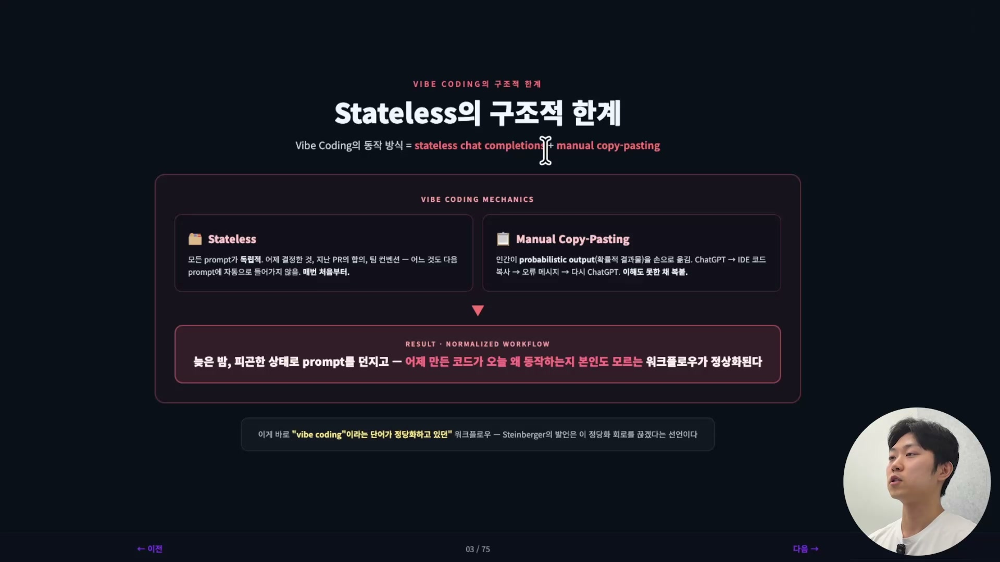
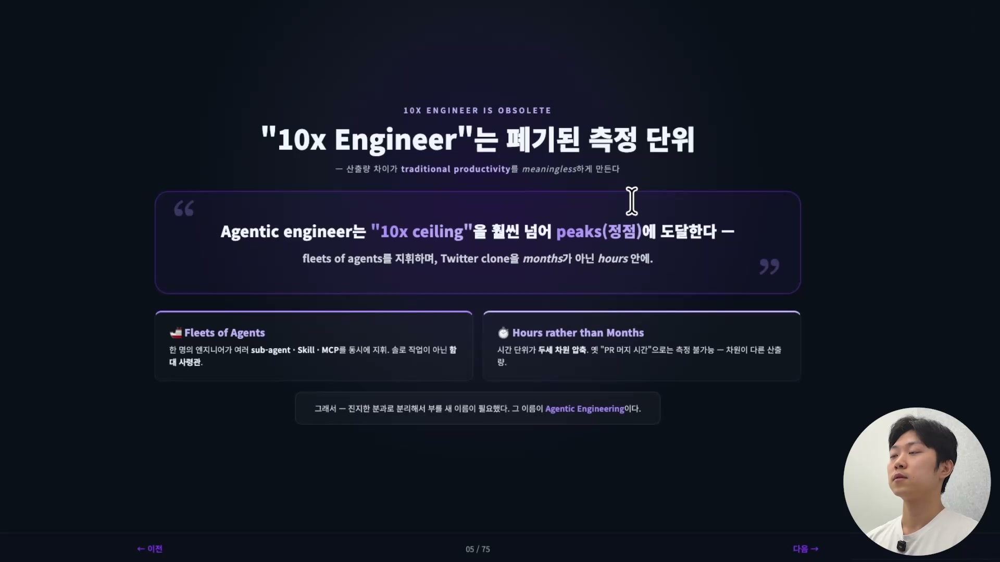
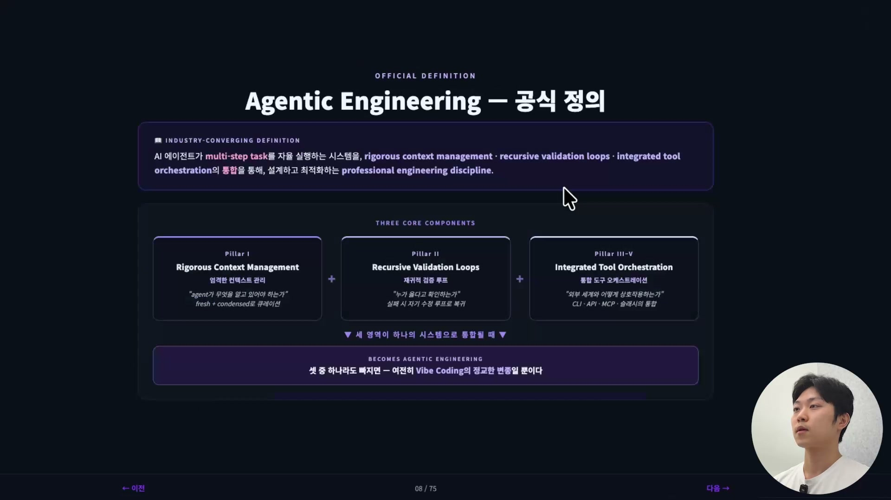

바이브 코딩(Vibe Coding)을 만든 사람이 안드레이 카파시(Andrej Karpathy)다. 그가 가볍게 트윗을 하면서 생긴 말로, AI에게 자연어로 말하면 코드가 나온다는 현상을 정확히 포착한 단어였다. 누구나 코딩할 수 있다는 민주화의 깃발이었고, 진입장벽을 무너뜨린 해방의 단어였다. 그런데 불과 2년 만에 같은 단어를 두고 오픈클로를 만든 피터 슈타인버거(Peter Steinberger)는 이렇게 못박았다.

> "바이브 코딩은 이제 슬롭(slop)이다."

슬롭은 AI가 쏟아내는 품질 낮은 결과물을 가리키는 말이다. 혁신의 상징이 쓰레기라는 낙인이 됐다. 이 강의 챕터의 결론을 먼저 말하면, 손코딩의 시대는 빠르게 끝나가고 그 자리를 에이전틱 엔지니어링(Agentic Engineering)이 채워가고 있다. 그리고 이걸 받아들이는 팀과 여전히 바이브 코딩에 머무는 팀의 격차는 곧 엄청나게 벌어진다.

## 바이브 코딩은 무엇으로 동작했나

슈타인버거의 한 마디가 충격적이었던 건, 그게 단순한 험담이 아니라 구조적 진단이었기 때문이다. 바이브 코딩이 동작하는 방식을 기술적으로 표현하면 두 단어로 줄어든다. **stateless chat completion과 manual copy-pasting, 이 둘이 합쳐진 게 바이브 코딩의 전부다.**

stateless는 말 그대로 state(상태)가 없다는 뜻이다. 모든 프롬프트가 독립적이다. 어제 결정한 것, 지난 PR에서 합의한 것, 팀의 컨벤션, 그 어느 것도 다음 프롬프트에 자동으로 들어가지 않는다. 매번 처음부터 시작한다. 그래서 그 맥락을 채워 넣는 일은 전부 인간 몫이 된다. 챗봇이 뱉은 코드를 사람이 손으로 IDE에 옮기고, 오류 메시지가 나오면 그걸 다시 챗봇에 붙여넣는다. 이게 manual copy-pasting이다.

문제는 인간이 모든 걸 다 해야 하는데, 인간은 오류를 낼 확률이 아주 높다는 데 있다. stateless한 특징과 복붙이 결합하면 전형적인 장면이 나온다. 조금 피곤한 상태로 프롬프트를 던지고, 돌아온 코드를 이해하지도 못한 채 붙여넣고, 새벽 3시에 그렇게 바이브 코딩을 하고 잠든다. 다음 날 일어나 보면 왜 이렇게 이상한 코드가 만들어져 있는지 본인도 모른다.

바로 이 워크플로우를 '바이브 코딩'이라는 단어가 정당화하고 있었다. "지금 나 바이브 코딩 중이야"라는 말은 어떻게 보면 "지금 나 제대로 생각 안 하고 있어"와 같은 뜻이 돼버렸고, 슈타인버거가 슬롭이라고 못박은 건 바로 그 면죄부를 거두겠다는 뜻이었다.

## 대립이 아니라 다른 방향: Floor와 Ceiling

그렇다고 바이브 코딩이 쓸모없었다는 얘기는 아니다. 카파시가 세쿼이아 캐피탈(Sequoia Capital)에서 한 이야기인데, 바이브 코딩과 에이전틱 엔지니어링은 서로 대립하는 개념이 아니다. 같은 흐름이 서로 다른 방향으로 갈라진 두 갈래다.

카파시는 바이브 코딩을 "raising the floor", 바닥을 올린 것이라고 표현했다. 모든 사용자의 베이스라인을 끌어올렸다는 뜻이다. 비개발자도 개발을 할 수 있게 됐으니, 이건 분명한 혁신이었다. 반면 에이전틱 엔지니어링은 천장 쪽을 다룬다. "preserving the professional quality bar", 산업 수준의 품질 기준을 유지하는 것이다. 누구나 만들 수 있게 만든 게 바이브 코딩이라면, 그걸 프로다운 소프트웨어로서 품질까지 지켜내는 데 초점을 맞춘 게 에이전틱 엔지니어링이다.

| 차원 | Vibe Coding · 바닥을 올린다 | Agentic Engineering · 천장을 깬다 |
| --- | --- | --- |
| 초점 | 모든 사용자의 베이스라인 향상 | 산업 수준의 품질 기준 유지 |
| 접근 | 즉흥적 의도 표현으로 빠른 프로토타이핑 | 규율 있는 엔지니어링 실천 |
| 결과물 | 생각의 속도로 동작하는 프로토타입 | 산업 규모의 빠르고 안전하고 견고한 시스템 |

입구가 내려간 만큼 천장이 올라간 셈이라, 둘은 서로 다른 일을 하면서도 충돌하지 않는다.

## 10x 엔지니어는 이미 폐기된 단위

이 격차가 만들어내는 흥미로운 효과가 하나 있다. 예전에는 평범한 엔지니어보다 10배의 생산성을 내는 '10x 엔지니어'가 최고의 극찬이었다. 그런데 에이전틱 시대에 들어서면 이 말이 오히려 옛말이 된다.

카파시의 표현으로는, 이제 10x 천장(ceiling)이 아니라 그걸 훨씬 넘어선 정점에 도달한다. 한 명의 엔지니어가 여러 서브 에이전트와 스킬, 도구를 동시에 부리는 함대(fleets of agents)의 사령관이 되어, 옛날 같으면 몇 달 걸릴 시스템을 몇 시간 안에 만들 수 있는 시대가 왔다는 것이다. 시간 단위 자체가 달라지니, '10배'라는 표현은 이들 앞에서 무의미할 정도로 작은 숫자가 된다.

## 왜 '코딩'이 아니라 '엔지니어링'인가

바이브 코딩이라는 단어를 만든 바로 그 카파시가, 다음 패러다임에는 '엔지니어링'이라는 단어를 골랐다. 이건 우연이 아니다. 카파시는 인터뷰에서 두 가지 이유를 들었다.

코딩은 글을 쓰는 행위다. 엔지니어링은 시스템을 설계하는 행위다. 둘은 다르다. 바이브 코딩의 결과물은 사실 텍스트, 즉 복사 붙여넣기된 코드 조각들이다. 그러나 에이전틱 시대의 결과물은 정교하게 세팅된 환경 위에 얹혀 작동하는 상태, 그 자체다. 에이전트가 도구를 골라 쓰고, 결과를 보고, 판단하고, 검증하는 루프 전체가 산출물이라는 것이다.

| | Coding (버려진 단어) | Engineering (선택된 단어) |
| --- | --- | --- |
| 정의 | 글을 쓰는 행위 | 시스템을 설계하는 행위 |
| 결과물 | 텍스트 · 복붙된 코드 조각 | 동작하는 구조 · 검증 루프 전체 |

카파시가 굳이 '엔지니어링'을 고른 건, 단어의 폭 자체가 달라져서 이제 이 일이 글쓰기가 아니라 시스템 설계 영역으로 넘어왔기 때문이다.

## 엔지니어가 새로 짊어진 세 가지

그러면 에이전트가 자율적으로 작동하는 시스템을 만들려면 엔지니어에게 뭐가 필요할까. 카파시의 표현 그대로 세 가지다.

첫째, 시스템 설계(system design)다. 에이전트가 어떤 도구를 가질 수 있는지, 어떤 권한을 가질 수 있는지, 서브 에이전트를 어떻게 불러야 하는지, 그 에이전틱 구조를 설계할 수 있어야 한다. 함수 하나가 아니라 전체 그래프를 그리는 일이다.

둘째, 의도적 사고(intentional thought)다. 바이브 코딩이 즉흥적이라면, 에이전틱 엔지니어링은 의도적이어야 한다. 어디서 시작할지, 어디서 검증할지, 에이전트를 어디서 멈추게 할지가 모두 설계되어 있어야 한다.

셋째, 견고한 환경(robust environments)이다. 에이전트가 자율적으로 작동할 수 있는 환경 자체를 만드는 일이다. claude.md, 검증 인프라, CLI를 잘 활용하게 만드는 것, AI를 위한 코드베이스를 만드는 것이 다 여기에 들어간다. 에이전트의 코드를 대신 짜주는 게 아니라 에이전트가 일할 환경을 만들어주는 것, 그게 바로 엔지니어링이다.

## 에이전틱 엔지니어링의 공식 정의

이 세 가지를 업계가 하나의 정의로 모았다.

> 에이전틱 엔지니어링이란, AI 에이전트가 멀티스텝 태스크(multi-step task)를 자율 실행하는 시스템을, 엄격한 컨텍스트 관리 · 재귀적 검증 루프 · 통합 도구 오케스트레이션이라는 세 코어 컴포넌트의 통합을 통해 설계하고 최적화하는 전문 엔지니어링 분과다.

첫째는 컨텍스트 관리다. 셋 중 가장 중요한 기둥으로, 어떤 컨텍스트를 주느냐가 결과를 가른다. garbage in, garbage out, 쓰레기를 주면 AI가 아무리 똑똑해도 쓰레기를 내놓을 수밖에 없다. 그래서 무엇을 알려줄지, 그 컨텍스트를 어떻게 잘 줄지가 핵심 질문이 된다.

둘째는 검증이다. 에이전트가 루프를 돌게 하려면 좋은 검증 루프를 사람이 시스템적으로 설계해줘야 한다. 누가 옳다고 확인하는가, 실패하면 어떻게 자기 수정 루프로 복귀시키는가의 문제다.

셋째는 도구다. 에이전트에게 무엇을, 어떻게 줄지가 정말 중요하다. 에이전트가 일을 하려는데 도구가 없다면, 사람이 돌아와서 직접 하는 게 아니라 그 도구를 지어줘야 한다. CLI, API, 그리고 스킬을 통합하는 일이다.

이 세 영역이 하나의 시스템으로 통합되어 작동할 때 비로소 에이전틱 엔지니어링이라고 부를 수 있다. 셋 중 하나라도 빠지면 여전히 바이브 코딩의 정교한 변종일 뿐이다.

## 전환을 밀어붙이는 네 가지 동인

마지막으로, 이 전환이 왜 지금 일어나고 있는가. 네 개의 화살표가 동시에 같은 방향을 가리킨다.

첫째는 아키텍처적 엄격함이다. 즉흥적인 프롬팅에서 벗어나 의도적으로 시스템을 설계해야 한다. 메인 에이전트에서 서브 에이전트로, 다시 서브 에이전트에서 스킬로 위임하는 계층 구조를 엄격하게 설계해야 멀티 에이전트가 일할 수 있다. 단일 에이전트를 풀어두는 게 아니라 계층 자체를 그리는 일이다.

둘째는 프로페셔널 표준이다. 프롬프트를 복사 붙여넣기 하고 공유하는 방식으로는 유지보수가 불가능하다. 에이전트 작업, 예를 들어 claude.md 같은 것도 모두 git diff처럼, git PR처럼 추적하고 리뷰하고 롤백할 수 있어야 한다. 프롬프트를 유지보수되는 코드, 1년 뒤 3년 뒤에도 이해 가능한 자산으로 다뤄야 한다.

셋째는 역량 스케일링이다. 바이브 코딩의 가장 큰 한계가 여기 있다. 원샷 프롬프트로 접근하면 모델의 역량을 제대로 못 쓴다. 모델이 발전하는 만큼 그 모델을 담는 그릇, 즉 모델을 둘러싼 환경과 작업 구조도 함께 발전해야 한다.

넷째는 운영 효율이다. 우리는 더 이상 코드를 작성하는 사람이 아니라 에이전트를 작동시키는 사람, 에이전트를 설계하는 아키텍트가 되어야 한다. 그게 100배, 200배의 효율을 내는 길이다.

네 동인은 모두 같은 방향을 가리킨다. 코딩의 손작업에서 시스템의 설계로. 코딩을 하는 사람에서 시스템의 설계자로 머릿속을 바꾸는 것, 그게 에이전틱 엔지니어링의 큰 그림이다.
