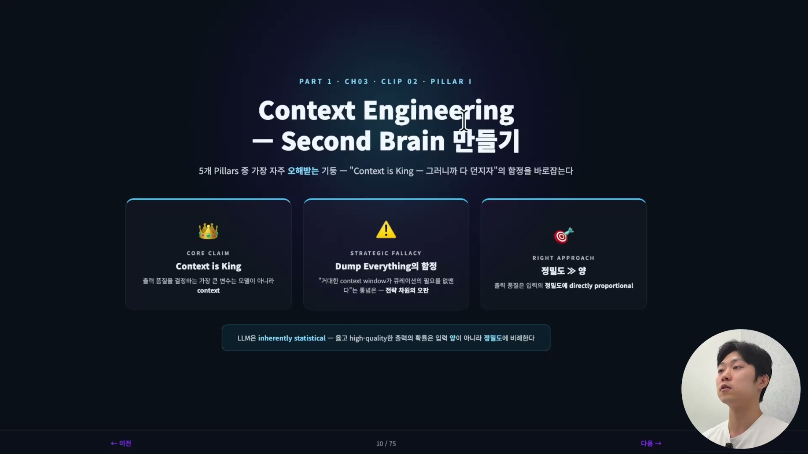
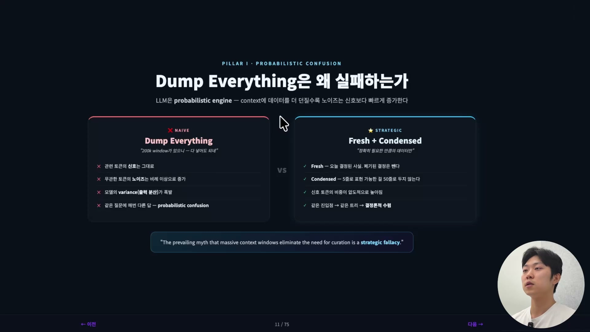
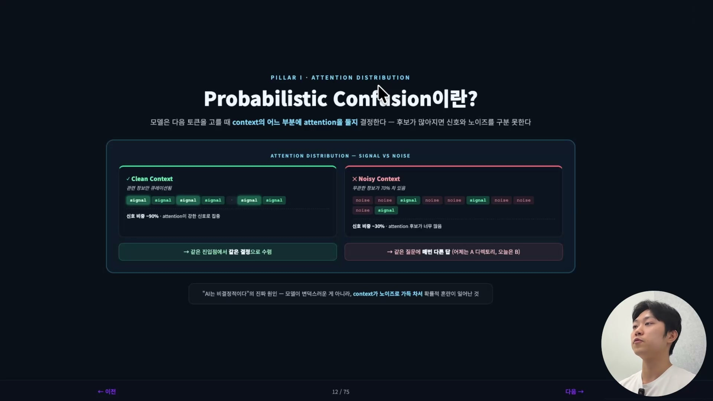
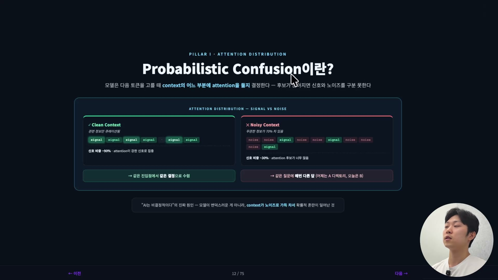
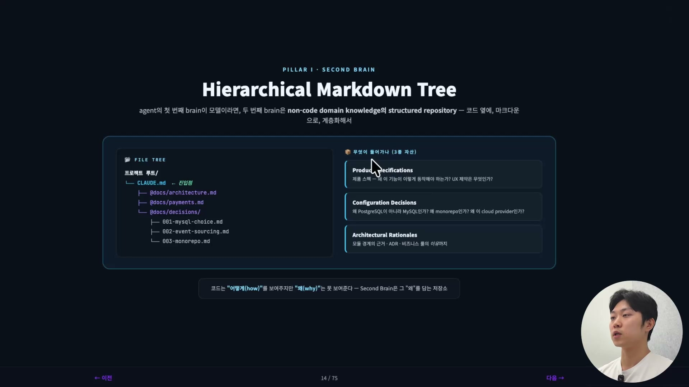
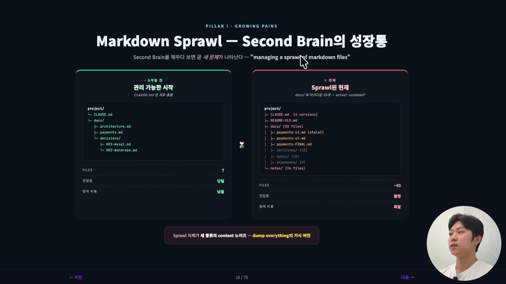
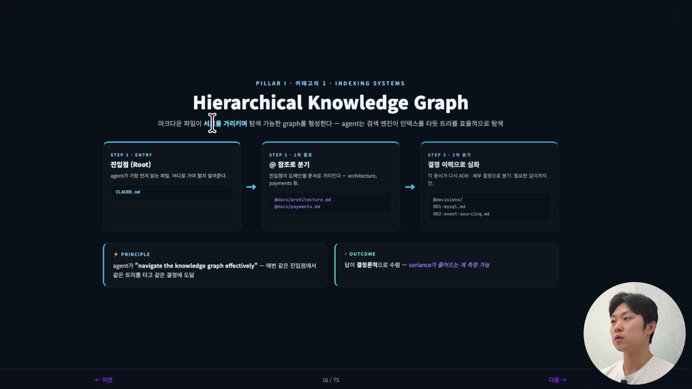
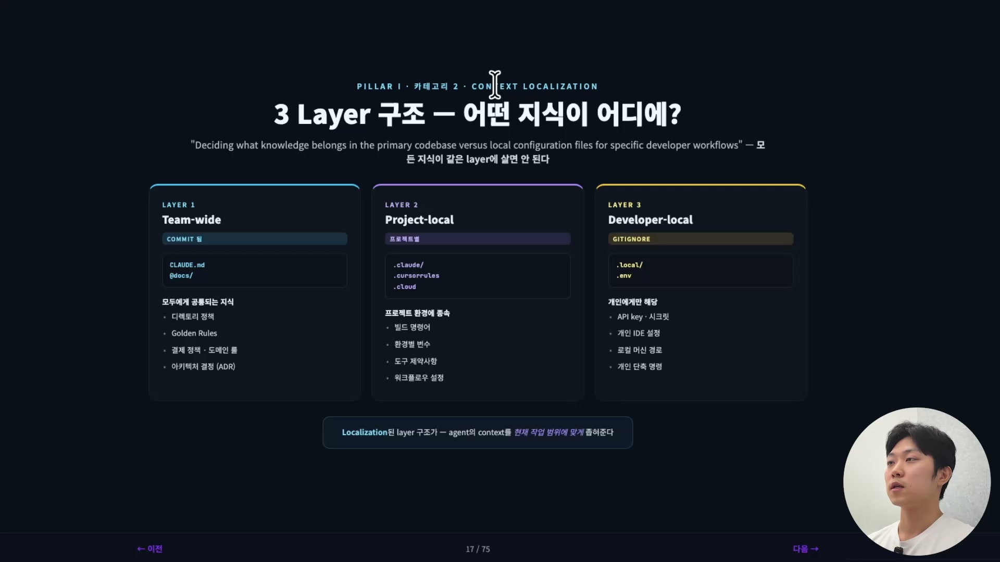
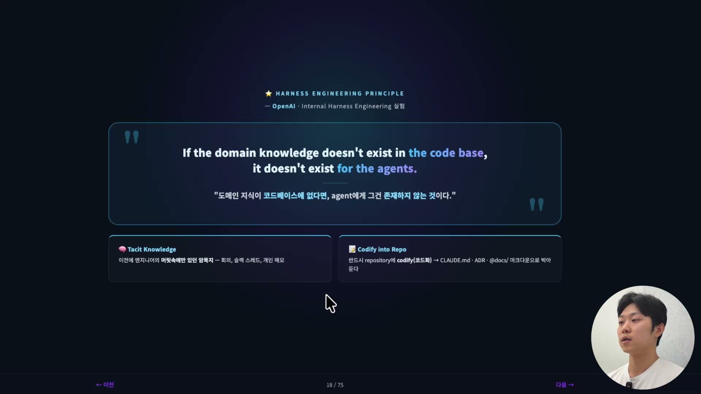
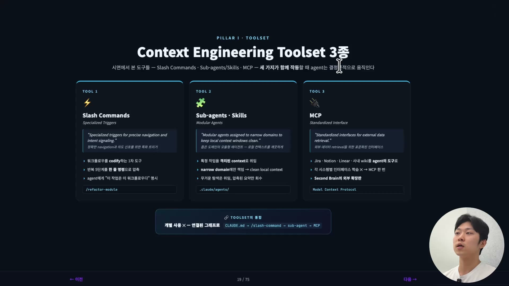

에이전트의 출력 품질을 결정하는 가장 큰 변수는 무엇일까. 흔히 모델이라고 답하지만, 이 강의는 모델이 아니라 컨텍스트라고 못 박는다. 같은 GPT, 같은 Claude를 써도 무엇을 입력으로 넣어주느냐에 따라 결과가 갈린다는 것이다. 그래서 다섯 개의 기둥(Pillar) 중 첫 번째가 컨텍스트 엔지니어링이고, 동시에 가장 자주 오해받는 기둥이기도 하다.

오해는 한 문장에서 시작한다. "Context is King." 이 말 자체는 유명하고, 또 옳다. 문제는 여기에 사람들이 자기 멋대로 뒷말을 붙이면서 생긴다. "컨텍스트가 왕이라며? 그럼 최대한 많이 던져주면 알아서 잘 해주겠지." 앞부분 'Context is King'은 옳지만, 뒷부분 '그러니까 다 던지자'는 틀렸다. 이 강의 전체는 사실상 이 한 줄의 오해를 푸는 과정이다.

## 다 던지면 왜 실패하는가

dump everything이라는 발상이 힘을 얻은 데는 이유가 있다. 컨텍스트 윈도우가 계속 커졌기 때문이다. 처음엔 100K, 200K였다가 최근엔 100만(1 million) 토큰짜리 윈도우까지 나왔다. 그릇이 이렇게 커졌으니 그냥 다 부어 넣으면 알아서 골라 쓰겠지, 하는 기대가 자연스럽게 따라온다. 강의는 이 기대를 정면으로 부정한다. 거대한 컨텍스트 윈도우가 큐레이션의 필요를 없앤다는 통념은 완전한 오해라는 것이다.

근거는 LLM이 무엇인지로 돌아간다. LLM은 통계 모델, 곧 확률 엔진이다. 입력 토큰의 분포를 바탕으로 다음 토큰의 확률을 계산해 뱉는다. 그래서 코드처럼 같은 입력에 같은 출력이 나오는 결정론적 시스템이 아니라, 매번 답이 조금씩 달라질 수 있는 확률적 시스템이다. 여기서 핵심 명제가 나온다. 높은 품질의 출력이 나올 확률은 입력의 정밀도에 직접 비례한다. 양이 아니라 정밀도다. 같은 정보를 더 정확하고 더 압축해서 줄수록 좋은 답이 나올 확률이 올라간다.

그런데 컨텍스트에 데이터를 더, 더, 더 던질수록 정작 늘어나는 건 신호가 아니라 노이즈다. 지금 답에 무관한 토큰이 잔뜩 섞여 들어오고, 그만큼 모델의 출력 분산(variance)이 폭발적으로 커진다. 분산이 커진다는 건 같은 질문에도 답이 이리저리 흔들린다는 뜻이고, 더 나아가 없는 사실을 지어내는 환각(hallucination)이 높아진다는 뜻이다. 강의는 이걸 머릿속 비유로 푼다. 머릿속에 생각이 너무 많으면 정확한 판단을 내리기 어렵다. 반대로 딱 필요한 10페이지짜리 자료만 주고 "여기서 이거 찾아줘" 하면 답이 또렷해진다. 모래사장에서 바늘을 찾는 일과 같다. 리포트 한두 개를 주고 찾는 것과 100개를 주고 찾는 것은 난이도가 전혀 다르다.

그래서 대안은 두 단어로 압축된다. **Fresh, 그리고 Condensed.** Fresh는 신선한 컨텍스트가 많은 컨텍스트보다 낫다는 것이다. 오늘 유효한 결정만 남기고 폐기된 결정은 뺀다. Condensed는 정밀도다. 같은 정보를 다섯 줄로 표현할 수 있으면 50줄로 두지 말라는 뜻이다. 이 둘이 나중에 나올 모든 실천의 바탕이 된다.

## Probabilistic Confusion · "AI는 변덕스럽다"의 진짜 원인

노이즈가 왜 그렇게 치명적인지를 한 단계 더 들어가 보면 어텐션(attention) 이야기가 나온다. 모델은 다음 토큰을 고를 때, 컨텍스트의 어느 부분에 주의를 둘지를 결정한다. 컨텍스트가 깨끗하다는 건, 신호가 강한 토큰에 주의가 집중된다는 뜻이다. 반대로 컨텍스트가 모래사장이 되어 무관한 정보가 가령 70%를 차지하면, 주의를 둘 후보가 너무 많아진다. 좋은 신호와 나쁜 신호를 구분하지 못하는 상태, 이게 바로 Probabilistic Confusion(확률적 혼란)이다.

이 혼란의 결과가 우리가 익히 겪는 증상이다. 같은 질문에 매번 다른 답이 나온다. 어제는 이 디렉토리에 코드를 두라더니 오늘은 다른 디렉토리를 가리키고, 어제 추천한 라이브러리를 오늘은 다른 걸로 바꾼다. "AI는 비결정적이라 못 믿겠다"는 흔한 불평의 원인이 여기 있다. 모델이 변덕스러워서가 아니라, 컨텍스트가 노이즈로 가득 차 있어서 생기는 일이다. 원인을 모델이 아니라 컨텍스트로 옮겨 보면, 해결의 방향도 따라 바뀐다.

## 컨텍스트 윈도우는 한계가 아니라 버짓이다

여기서 관점을 바꾸는 비유가 하나 나온다. 컨텍스트 윈도우는 한계(limit)가 아니라 버짓(budget)이다. 통장에 든 돈이라고 생각하면 된다. 통장에 100만 원이 있다고 해서 매번 100만 원을 다 쓰지는 않는다. 마찬가지로 200K 윈도우가 있다고 200K를 꽉 채우면 안 된다. 윈도우 전체는 쓸 수 있는 예산일 뿐이고, 그 안에서 신호가 가장 강한 토큰만 골라 채울 줄 알아야 한다. 그게 컨텍스트 엔지니어링이다.

이 관점 위에서 강의는 컨텍스트 엔지니어링의 공식 정의를 한 줄로 제시한다. "정확히 필요한 만큼의 데이터를 최적화하는 것, 그 이상도 그 이하도 아니다(the practice of optimizing for the exact right amount of data, nothing more, nothing less)." 핵심 단어는 앞서 나온 Fresh와 Condensed 두 개다. 윈도우를 다 쓰지 않고 일부만 정밀하게 채워도, 그 일부가 거의 100% 신호라면 윈도우를 가득 채운 쪽보다 낫다.

## 세컨드 브레인 · 에이전트의 두 번째 뇌

정의를 알았으니 실용적인 도구로 넘어간다. 세컨드 브레인(Second Brain)이라는 개념이다. 에이전트의 첫 번째 뇌가 모델이라면, 두 번째 뇌는 컨텍스트다. 그리고 그 컨텍스트가 실제로 사는 곳은 결국 리포지토리다. 리포지토리에 들어 있는 것이 곧 이 에이전트의 세컨드 브레인이라고 이해하면 된다.

이 두 번째 뇌에 꼭 들어가야 하는 핵심 자산이 세 종류로 정리된다. 첫째는 **제품 스펙(Product Specification, PRD)** 이다. 왜 이 기능이 이렇게 동작해야 하는지, UX는 무엇이고 제약은 무엇인지를 담는다. 둘째는 **설정 결정(Configuration Decisions)** 이다. 왜 PostgreSQL이 아니라 MySQL을 골랐는지, 왜 monorepo인지, 왜 이 클라우드 제공자인지 같은 선택의 이유다. 셋째는 **아키텍처 의사결정 기록(ADR)과 그 래셔널(rationale)** 이다. 모듈 경계를 그렇게 그은 근거, 비즈니스 룰의 이유까지 포함한다.

세 자산이 가리키는 핵심은 하나다. 코드만 봐서는 알 수 없는 것들이 있다는 것. 코드는 '어떻게(how)'를 보여주지만 '왜(why)'는 보여주지 못한다. 이 제품이 왜 이렇게 동작해야 하는지, 왜 이 아키텍처를 골랐는지는 보통 우리 머릿속에만 있다. 그걸 우리만 알고 있으면 에이전트는 영영 알 수 없다. 코드베이스 밖에 흩어진 그 '왜'를 코드베이스 안에 넣어둬야 에이전트도 볼 수 있다. 세컨드 브레인은 코드가 담지 못하는 그 '왜'를 담는 저장소다.

## Markdown Sprawl · 세컨드 브레인의 성장통

세컨드 브레인을 잘 만들어 두라는 결론까지 오면, 곧바로 새 문제가 따라온다. 채우다 보면 마크다운 파일이 점점 늘어나는 것이다. 강의는 이걸 Markdown Sprawl(마크다운 난립), 또는 컨텍스트 블로트(bloat)라고 부른다.

장면은 익숙하다. 6개월 전에는 아주 깔끔하게 7개 파일로 시작했는데, 시간이 지나니 80개쯤으로 불어난다. payments 문서가 v1이 되고 v2가 되고 FINAL이 된다. 우리가 흔히 만드는 "보고서_최종_최종.pptx" 같은 파일 더미와 똑같다. 어느 게 살아 있는 문서이고 어느 게 폐기된 건지 분간이 안 된다. 이렇게 방치하면 그 자체로 컨텍스트에 노이즈가 쌓인 셈이고, 결국 dump everything과 다를 게 없어진다. 잘 시작했지만 유지보수가 안 돼서 다시 노이즈로 돌아간 상태다. 그래서 세컨드 브레인은 만드는 것보다 관리하는 것이 진짜 과제다.

이 성장통을 다스리는 해결책이 세 갈래로 이어진다.

## 해결 1 · 계층적 인덱싱과 지식 그래프

첫째는 인덱싱이다. 마크다운 파일을 다운로드 폴더처럼 그냥 계속 쌓아두기만 하면 안 되고, 그래프를 만들어야 한다. 파일들이 서로를 가리키며 탐색 가능한 구조, 곧 지식 그래프(Knowledge Graph)를 형성하게 하는 것이다. Obsidian이나 LLM Wiki 같은 도구가 요즘 주목받는 이유가 바로 이것이다. 강의는 우리 뇌를 빗댄다. 뇌의 뉴런도 서로 연결되어 맵을, 그래프를 그리고 있다. 에이전트의 세컨드 브레인도 그렇게 짜여야 한다.

구조는 이렇게 돈다. 진입점(entry point)은 무조건 CLAUDE.md, 아니면 Agents.md다. 에이전트가 가장 먼저 읽는 파일이고, 여기서부터 참조로 분기시킨다. 아키텍처 얘기가 나오면 architecture 문서로 가라, 결제 얘기가 나오면 payments 문서로 가라. 그 문서에서 다시 세부 결정으로, ADR 안의 개별 decision으로 분기를 이어간다. 검색 엔진이 인덱스를 타고 들어가듯 에이전트가 트리를 따라 탐색하는 것이다.

효과는 일관성이다. 같은 진입점에서 같은 트리를 타면 매번 같은 결정에 도달하고, 답이 결정론적으로 수렴한다. 앞서 본 "매번 답이 달라지는" 문제를 정면으로 누른다. 그래서 세컨드 브레인의 챌린지는 단순히 마크다운 파일을 만드는 게 아니라, 이 계층적 인덱싱(hierarchical indexing)을 만드는 것이다.

## 해결 2 · 컨텍스트 로컬라이제이션

둘째는 컨텍스트 로컬라이제이션(context localization)이다. 어떤 지식이 어디에 있어야 하는지를 정해주는 일이다. 모든 지식을 같은 자리에 몰아넣지 않고, 레이어를 셋으로 나눠 위치를 가른다.

첫 번째 레이어는 **팀 레벨(Team-wide)** 이다. 모두에게 공통되는 지식으로, commit해서 함께 공유한다. 디렉토리 정책, Golden Rules, 결제 정책 같은 도메인 룰, 아키텍처 결정(ADR)이 여기 들어간다. 두 번째는 **프로젝트 레벨(Project-local)** 이다. 프로젝트 환경에 종속되는 지식으로, 빌드 명령어, 환경별 변수, 도구 제약, 워크플로우 설정 같은 것이다. 세 번째는 **로컬 레벨(Developer-local)** 이다. 개인에게만 해당하는 것으로, API 키나 시크릿, 개인 IDE 설정, 로컬 머신 경로처럼 gitignore로 빠지는 정보다. 이렇게 레이어가 잘 나뉜 코드베이스에서는, 에이전트가 컨텍스트를 지금 작업 범위에 맞게 좁혀 가져올 수 있다.

## 해결 3 · Harness 엔지니어링

셋째는 Harness 엔지니어링이다. 이건 컨텍스트 엔지니어링과 아주 밀접해서, 강의에서는 별도 섹션으로 따로 다룬다고 예고만 하고 핵심 한 문장으로 넘어간다. OpenAI가 Harness Engineering에 대한 페이퍼를 썼는데, 강의자는 그 한 문장이 이 챕터 전체를 압축한다고 본다.

"도메인 지식이 코드베이스에 없다면, 에이전트한테 그건 존재하지 않는 것이다(If the domain knowledge doesn't exist in the code base, it doesn't exist for the agents)." 이 문장이 말하는 규칙은 분명하다. 에이전트가 효과적이려면, 엔지니어의 머릿속에만 있던 암묵지(tacit knowledge)가 반드시 이 프로젝트, 이 리포지토리에 코드화(codify)되어야 한다. 회의에서 오간 말, 슬랙 스레드, 개인 메모에 흩어져 있던 '왜'들을 CLAUDE.md와 ADR, @docs/ 마크다운에 박아 넣는 것이다. 세컨드 브레인 이야기와 그대로 이어진다. 머릿속에 남겨 두면 에이전트에겐 없는 것과 같다.

그 코드화를 돕는 도구들이 우리가 이미 배운 것들이다. 슬래시 커맨드는 워크플로우를, 곧 프롬프트를 코드화해 결정론적으로 만든다. 잘 짠 슬래시 커맨드의 프롬프트 자체가 에이전트에게 좋은 컨텍스트가 된다. 서브 에이전트나 스킬도 마찬가지로 잘 만들어 두면 좋은 컨텍스트가 된다. MCP는 세컨드 브레인의 외부 확장판이라고 보면 된다. 이런 것들을 잘 셋업하는 것이 컨텍스트 엔지니어링의 시작이다.

## 정리

전체를 한 줄로 다시 묶으면 이렇다. 컨텍스트는 왕이다(Context is King), 하지만 절대 다 던지면(dump everything) 안 된다. LLM이 확률 엔진이라서, 노이즈가 더해질수록 출력의 분산이 커지고 품질이 떨어지기 때문이다. 그래서 우리는 머릿속 암묵지를 리포지토리에 코드화한 세컨드 브레인을 짓되, 그게 다시 Markdown Sprawl로 무너지지 않게 계층적 인덱싱과 로컬라이제이션, 그리고 슬래시 커맨드, 서브 에이전트, 스킬, MCP로 관리해야 한다. 컨텍스트를 이렇게 정밀하게 큐레이션하고 나면, 다음 질문이 자연스럽게 따라온다. 에이전트가 작업을 마치고 "Done"이라고 했을 때, 그게 진짜 잘 끝났는지는 어떻게 확인할까. 그 검증, 곧 에이전틱 밸리데이션이 다음 기둥이다.
