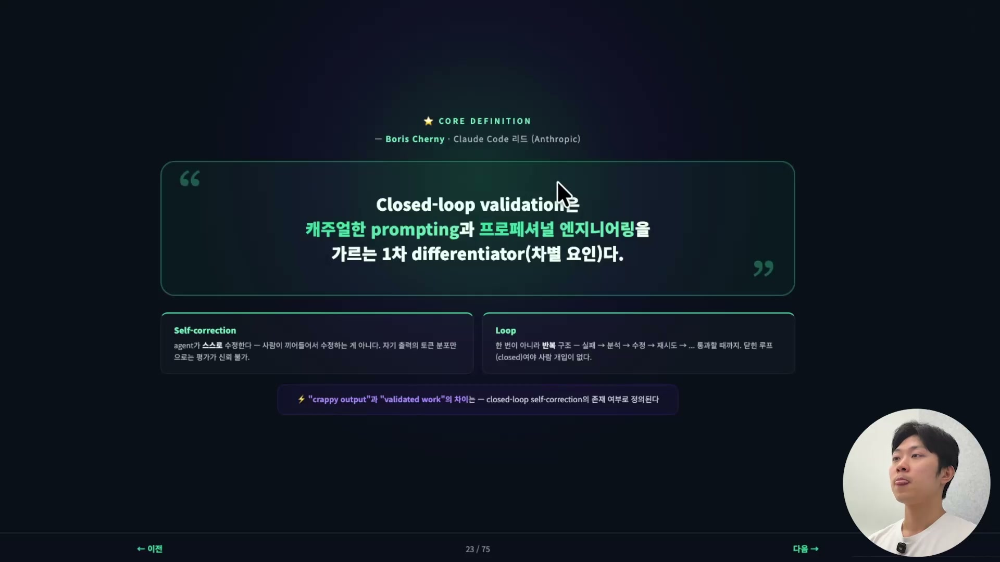
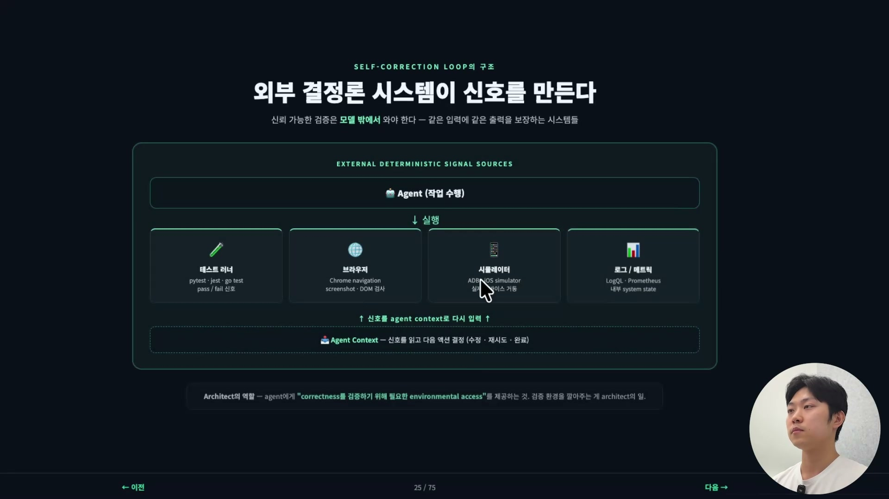
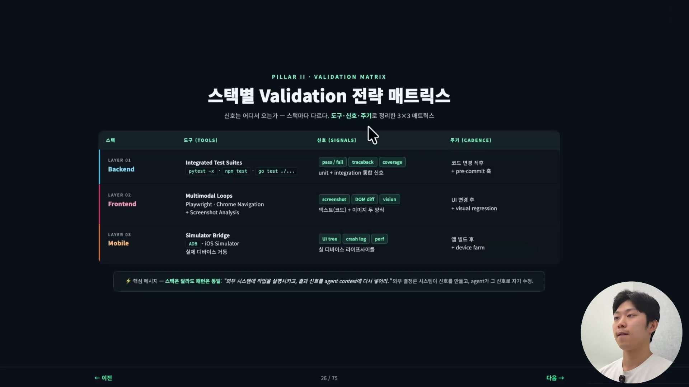
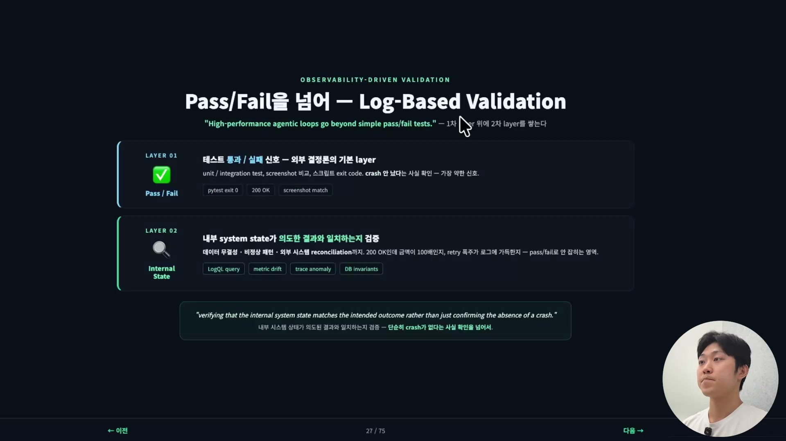
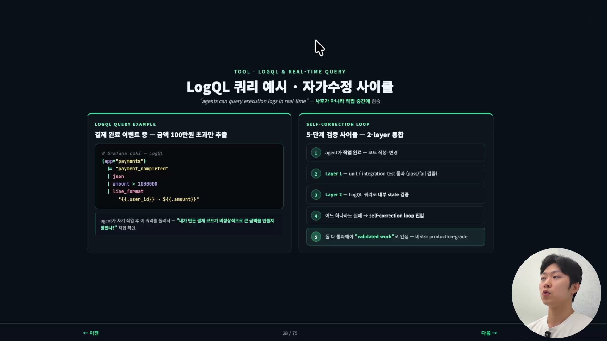
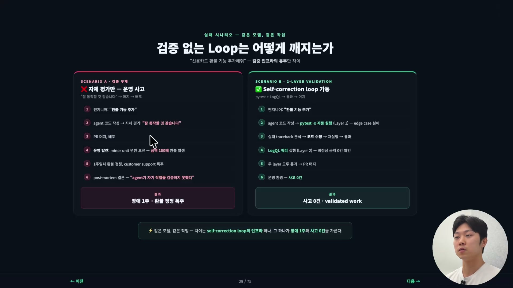

에이전트가 "작업 다 끝났습니다"라고 말한다. 이 한마디를 우리는 어디까지 믿을 수 있을까. 정말 끝난 게 맞는지, 검증은 됐는지, 그래서 그 코드가 실제로 돌아가긴 하는지를 우리가 알 방법이 없다면, 그 에이전트 루프는 무너지기 직전의 루프다. Agentic Validation은 바로 이 질문에 답하는 인프라를 다룬다. 에이전트의 "끝났습니다"를 검증 가능한 사실로 바꾸는 장치가 무엇이고, 그게 없으면 무엇이 깨지는지가 이 글의 주제다.

## 닫힌 루프냐, 열린 루프냐

먼저 이 클립 전체를 관통하는 한 문장이 있다. Claude Code를 만든 Boris Cherny의 표현을 그대로 옮기면, Closed-loop validation은 캐주얼한 prompting과 프로페셔널 엔지니어링을 가르는 1차 차별 요인(differentiator)이다.



닫힌 루프 검증, 즉 closed-loop validation이 뭔지부터 풀어보자. 에이전트가 자기 작업을 스스로 검증하고, 그 검증 결과를 신호로 받아 다음 작업을 하고, 또 검증하고, 이 과정이 끊기지 않고 도는 것이다. 핵심은 "닫혀(closed) 있다"는 데 있다. 사람이 중간에 끼어들어 "이거 맞아?"를 판정해줄 필요가 없다는 뜻이다. 루프가 열려(open) 있지 않다는 것, 그래서 에이전트가 자기 작업을 자기가 평가하고 그 평가를 다음 행동의 입력으로 다시 쓴다는 것이다.

그래서 이 개념은 두 단어로 쪼개진다.

- Self-correction, 에이전트가 스스로 수정한다. 사람이 끼어들어 고치는 게 아니다.
- Loop, 한 번 검증하고 끝이 아니라 반복 구조다. 실패하면 분석하고, 수정하고, 다시 시도하고, 통과할 때까지 돈다.

이 self-correction loop가 동작하려면 에이전트에게 인프라가 있어야 한다. 인프라가 없으면 에이전트는 결과를 제출하기 전에 자기 상태와 진행을 검증할 방법 자체가 없다.

## 나쁜 출력과 검증된 출력은 무엇이 다른가

에이전트가 내놓는 출력은 결국 두 종류로 갈린다. 하나는 crappy output, 품질이 안 좋은 출력이다. 다른 하나는 validated work, 실제로 잘 되는 게 증명된 출력이다. 둘을 가르는 건 출력이 얼마나 그럴듯해 보이느냐가 아니라, 검증 신호가 어디서 왔느냐다.

| 차원 | Crappy Output | Validated Work |
|---|---|---|
| 신뢰 가능성 | "동작하는 것 같다" | "동작한다, 증명됨" |
| 검증 신호 출처 | 없음, 또는 LLM 자기 평가 | 외부 결정론 시스템 (테스트 · 로그 · 렌더링) |
| 자기 수정 | 불가능, 실패를 감지 못 함 | 자동, 실패 신호 → 재시도 → 재검증 |
| 6개월 후 상태 | 누구도 만지지 못함 | 검증돼 있어 유지보수 가능 |

crappy output은 동작하는 것처럼 보인다. 문제는 LLM이 자기가 만든 걸 스스로 평가할 수 없다는 데 있다. 동작하는 것 같긴 한데 그게 진짜 reliable한지, 이 출력을 계속 신뢰할 수 있는지를 모델 스스로는 판정하지 못한다. 검증 신호가 한 번도 남지 않았으니, 시간이 지나면 그 코드는 손댈 근거가 없는 코드가 된다.

validated work는 다르다. 테스트를 돌렸든 린트를 돌렸든, 어떤 식으로든 검증이 됐기 때문에 결정론적인 시스템이 된 것이다. 같은 입력에 같은 결과가 나오는 걸 확인했으니 유지보수가 가능한 워크플로우가 된다.

여기서 가장 중요한 줄은 "검증 신호의 출처"다. 에이전트한테 "이 코드 맞아?"라고 물어보면 에이전트는 꽤 자신 있게 "맞다"고 답한다. 그런데 그건 코드가 진짜 맞아서가 아니다. 그 답이 자기 출력의 토큰 분포에서 가장 그럴듯하게 보이기 때문이다. LLM은 확률 모델이고, 확률 엔진이 자기가 만든 결과를 자기가 평가하면 그 평가 역시 같은 확률 분포의 영향을 받는다. 그래서 자기 평가는 절대 신뢰할 수 없다. 신뢰 가능한 검증은 모델 밖에서 와야 한다.

## 신호는 모델 밖에서 온다

모델 밖이란 구체적으로 어디인가. 컴파일러, 테스트, 브라우저 테스팅, 시뮬레이터, 로깅. 이런 외부의 결정론적 시스템이 에이전트에게 신호를 보내줘야 한다. 같은 입력에 같은 출력을 보장하는 시스템에서 받은 신호여야 의미가 있다.



구조로 보면 흐름이 분명해진다. 위쪽에서 에이전트가 작업을 수행한다. 그 작업은 아래의 외부 결정론 시스템으로 실행된다. 테스트 러너(pytest, jest, go test), 브라우저(Chrome navigation, screenshot, DOM 검사), 시뮬레이터(ADB, iOS simulator), 로그/메트릭(LogQL, Prometheus) 같은 것들이다. 각 시스템은 pass/fail이나 내부 system state 같은 신호를 만들어낸다. 그리고 이 신호가 다시 에이전트의 context로 입력된다. 에이전트는 그 신호를 읽고 다음 액션을 결정한다. 수정할지, 재시도할지, 완료할지. 이게 self-correction loop의 구조이자 Agentic Validation의 인프라다.

그래서 아키텍트의 역할이 분명해진다. 에이전트에게 correctness를 검증하기 위해 필요한 환경 접근(environmental access)을 제공하는 것, 즉 이 검증 환경을 깔아주는 게 아키텍트의 일이다. 이 루프가 있느냐 없느냐가 앞에서 본 crappy output과 validated work의 차이를 만든다.

## 스택은 달라도 패턴은 같다

신호가 외부에서 온다면, 그 외부가 스택마다 조금씩 다르다. 백엔드, 프론트엔드, 모바일이 각자 다른 도구로 다른 신호를 만든다.



백엔드는 통합 테스트 묶음으로 신호를 받는다. pytest, npm test, go test 같은 걸 돌려 unit과 integration 테스트를 합친 신호를 얻고, pass/fail, traceback, coverage가 그 신호다. 코드를 바꾼 직후나 pre-commit 훅에서 자주자주 돌려야 한다.

프론트엔드는 클라이언트 사이드라 양상이 다르다. Playwright나 Chrome navigation으로 브라우저를 직접 다루고, 스크린샷을 찍어 그걸 vision으로 보거나 DOM diff를 본다. end-to-end 테스팅을 만들어 비주얼로 확인하는 식이다. 텍스트(코드)와 이미지 두 양식을 함께 쓴다는 게 백엔드와 다른 점이다.

모바일은 강의에서도 잘 모른다고 유보했지만, 패턴은 같으리라고 본다. ADB나 iOS 시뮬레이터로 실제 디바이스 거동을 보고, UI tree나 crash log, perf를 신호로 삼는 식일 것이다.

스택은 셋 다 다르다. 그런데 패턴은 동일하다. 외부 시스템에 작업을 실행시키고, 그 결과 신호를 다시 agent context에 넣어, 에이전트가 자기 수정을 하게 만든다. 이게 도구만 바뀔 뿐 어느 스택에서나 똑같이 작동하는 골격이고, Agentic Validation 인프라의 핵심이다.

## Pass/Fail만으로는 부족하다

지금까지 본 세 가지는 전부 pass/fail 신호였다. 테스트 통과, 테스트 실패. 이걸 1차 레이어라고 하면, 고성능 에이전트 루프는 여기서 끝나지 않는다. 2차 레이어가 더 있다. Observability-driven validation, 관측 가능성에 기반한 검증이다.



Observability는 로그, 메트릭, 트레이스, 이벤트 같은 자산의 형태를 말한다. 이런 것들은 pass/fail로 깔끔하게 나뉘지 않는다. 그냥 숫자거나 기록일 뿐이다. 그래서 1차 레이어의 통과/실패 위에, 이 관측 신호를 읽는 2차 레이어를 쌓아야 루프가 더 고성능이 된다.

왜 pass/fail만으로는 부족한가. 결제 API를 예로 들어보자. API 테스팅을 통과했다고 하자. 그런데 금액 단위 변환 버그 때문에 실제로는 청구 금액이 100배가 됐다. 결제 자체는 성공했고 API 테스트도 통과했지만, 비즈니스 로직 관점에서는 완전히 망가진 것이다. 혹은 결제는 성공했는데 영수증 이메일 발송이 누락됐다. API는 성공 신호를 줬는데 말이다.

unit 테스트나 integration 테스트, E2E 테스트는 이런 걸 어느 정도 잡을 확률이 높긴 하다. 하지만 데이터 무결성 문제와 내부 시스템 상태의 문제는 pass/fail로 쉽게 안 잡힌다. 그래서 내부 시스템 상태가 우리가 의도한 비즈니스 로직, 그 결과와 일치하는지를 검증하는 일을 2차 레이어에서 해줘야 좋다.

이걸 한 줄로 정리하면, 단순히 크래시가 없다는 사실 확인을 넘어 내부 시스템 상태가 의도된 결과와 일치하는지를 검증하는 것이다. 크래시가 나야만 서비스 장애인 게 아니어서, 크래시가 안 났다는 건 사실 약한 신호일 뿐이다. 진짜 강한 신호는 내부 상태가 정확한가, 내부 로직이 정확한가다.

## LogQL로 내부 상태를 직접 묻는다

이 2차 레이어를 OpenAI에서는 LogQL이라는 쿼리로 했다고 한다. 강의에서도 직접 써본 건 아니라 자세히는 모른다고 밝히고 있다. 다만 쓰임새는 분명하다. LogQL을 써서, 예를 들어 내가 만든 결제 코드가 비정상적으로 큰 금액을 만들지는 않는지를 직접 물어보는 것이다. 이런 건 pass/fail로는 알 수 없는 종류다.



쿼리는 이런 모양이다.

```
# Grafana Loki — LogQL
{app="payments"}
  |= "payment_completed"
  | json
  | amount > 1000000
  | line_format
    "{{.user_id}} → ${{.amount}}"
```

payments 앱의 로그에서 payment_completed 이벤트만 골라, JSON으로 파싱한 뒤, amount가 100만원을 넘는 건만 추려서 사용자 ID와 금액으로 출력하는 쿼리다. 에이전트는 자기 작업을 마친 뒤 이 쿼리를 돌려서 "내가 만든 결제 코드가 비정상적으로 큰 금액을 만들지 않았나?"를 직접 확인한다. 사후 감사가 아니라 작업 중간에, 실시간으로 자기 코드가 만든 실제 데이터를 검증하는 것이다.

그래서 production-grade 코드가 되려면 두 레이어를 모두 통과해야 한다. 정리하면 다음 다섯 단계다.

1. 에이전트가 작업을 완료한다. 코드를 작성하거나 변경한다.
2. Layer 1, unit/integration 테스트를 통과한다(pass/fail 검증).
3. Layer 2, LogQL 쿼리로 내부 상태를 검증한다.
4. 둘 중 어느 하나라도 실패하면 self-correction loop로 진입한다.
5. 둘 다 통과해야 validated work로 인정한다. 비로소 production-grade다.

## 검증 없는 루프는 이렇게 깨진다

같은 모델, 같은 작업인데 검증 인프라의 유무만 다른 두 시나리오가 있다. 의뢰는 똑같다. "환불 기능 추가해줘."



검증이 없는 쪽(왼쪽)은 이렇게 흘러간다. 에이전트가 코드를 작성하고, 자체 평가를 한다. 앞에서 절대 믿으면 안 된다고 한 그 자기 평가다. "잘 동작할 것 같습니다." 그대로 PR을 머지하고 배포한다. 그리고 운영에서 발견된다. minor unit 변환 오류로 금액이 100배 환불되고 있다. 버그가 이미 프로덕션에 올라가 있으니 큰일이 났다. 환불을 정정하는 데 1주가 걸리고, 그동안 customer support는 폭주한다.

여기서 가장 잘못된 결론, 가장 틀린 postmortem은 "에이전트 때문이다", "에이전트의 잘못이다"라는 것이다. 이건 가장 틀린 답이다. 이건 사람의 잘못이다. 검증 환경을 제대로 세팅하지 못한 사람, 검증 인프라와 컨텍스트 엔지니어링을 제대로 하지 않은 우리 인간의 잘못이다.

검증이 있는 쪽(오른쪽)은 같은 의뢰에서 다르게 흘러간다. 에이전트가 코드를 작성하고 pytest를 자동 실행한다(Layer 1). edge case가 실패한다. 실패 traceback을 분석해 코드를 수정하고 다시 돌려 통과시킨다. 그다음 Layer 2로 넘어가 LogQL 쿼리로 비정상 금액이 0건임을 확인한다. 두 레이어를 모두 통과한 뒤에야 머지한다. 운영 환경에서 사고는 0건이다.

같은 모델, 같은 작업이다. 두 시나리오를 가른 건 모델의 똑똑함이 아니라 self-correction loop라는 인프라 하나가 있느냐 없느냐였고, 그 하나가 장애 1주와 사고 0건을 갈랐다.

## 정리

crappy output과 좋은 output을 가르는 건 Agentic Validation 인프라, 곧 self-correction loop다. self-correction loop는 에이전트가 결과를 제출하기 전에 자기 상태와 진행을 검증할 수 있는 인프라를 말한다. 그리고 그 검증의 출발점은 하나의 절대 규칙이다. 자기 평가는 절대 신뢰할 수 없다. 확률 엔진의 자기 평가는 같은 확률 분포의 영향을 받기 때문이다.

그래서 우리는 외부의 결정론적 시스템이 주는 신호에 의존해야 한다. 그 신호는 두 층으로 쌓인다. 1차 레이어는 테스트의 pass/fail이고, 2차 레이어는 log-based validation으로, 내부 시스템 상태가 프로덕트의 의도와, 비즈니스 로직과 일치하는지까지 검증한다. 크래시가 없다는 건 약한 신호이고, 내부 상태가 정확하다는 게 강한 신호다.

여기까지가 Context Engineering(Pillar 1)에 이은 Agentic Validation(Pillar 2)의 인프라다. 그런데 다음 문제가 남는다. 에이전트가 자꾸 사람한테 물어본다. "GitHub 포털 로그인 좀 해주세요." "데이터베이스 콘솔에서 이것 좀 봐주세요." 그때마다 사람이 뭔가를 해줘야 한다. 이게 바로 friction이다. 검증은 갖췄는데 사람을 계속 호출하는 이 마찰을 없애는 게 다음 주제, Agentic Tooling(Pillar 3)이다.
