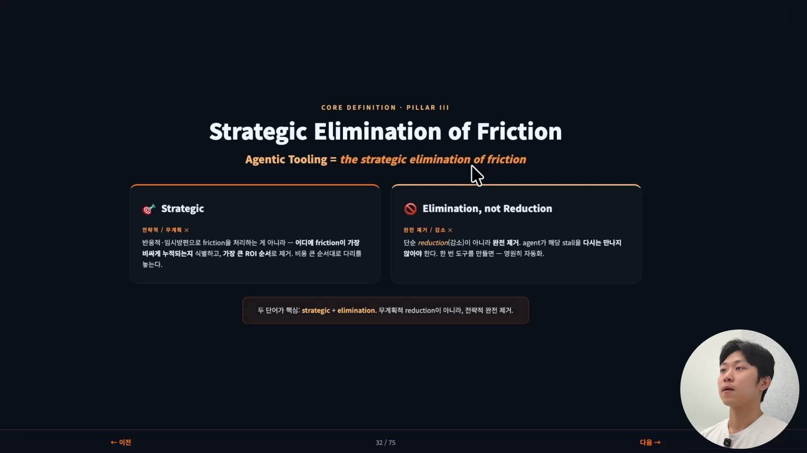
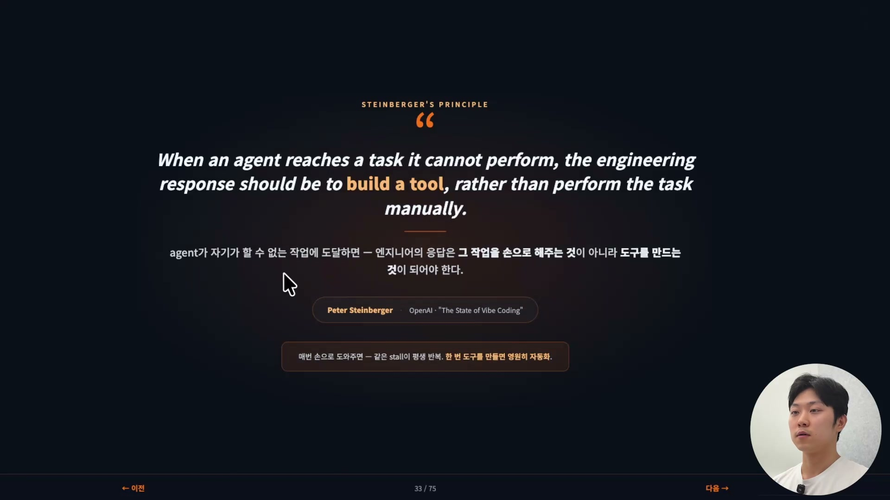
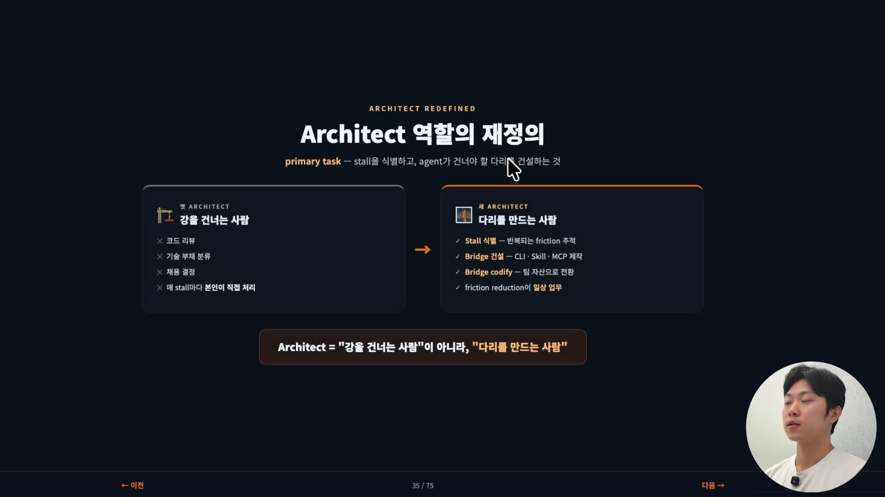
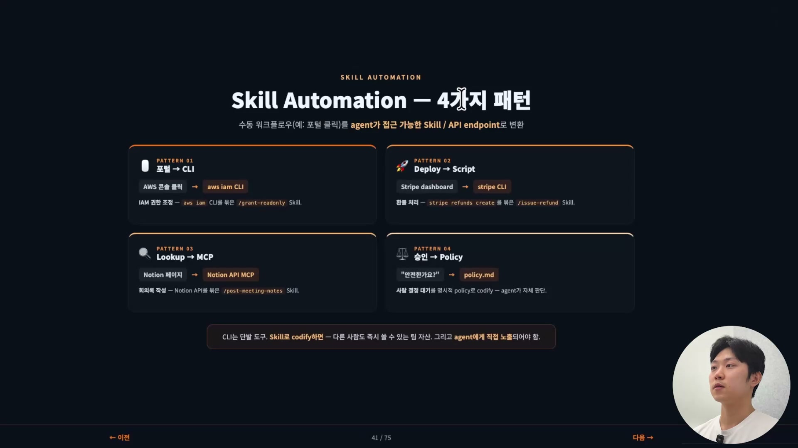
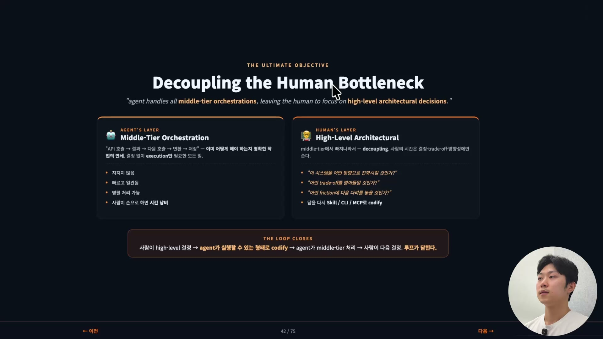

잘 돌아가던 에이전트가 어느 순간 멈춘다. 화면에는 이런 문장이 떠 있다. "GitHub UI로 들어가서 PR을 만들어주세요. 만들고 나면 알려주세요. 그때 작업을 계속하겠습니다." 에이전트가 스스로 건너지 못하는 지점에 다다랐고, 그 자리를 사람이 손으로 메워주기를 기다리는 것이다.

이 멈춤이 바로 프릭션(friction)이다. 그리고 프릭션은 단순한 불편이 아니라 에이전트 루프에서 가장 비싼 자원, 즉 인간의 시간을 빼앗아가는 지점이다. Pillar 3 "Agentic Tooling"은 이 멈춤을 사람이 매번 손으로 메우지 말고, 도구를 만들어 에이전트가 다음부터는 알아서 건너가게 하라는 이야기다.

## 한 줄 정의, 마찰의 전략적 제거

Agentic Tooling을 한 줄로 압축하면 "마찰의 전략적 제거(strategic elimination of friction)"다. 짧지만 단어 둘이 각자 무게를 지고 있다.

먼저 <strong>전략적(strategic)</strong>이다. 계획이 있다는 뜻이다. 프릭션이 보인다고 무작정 다 없애려 들지 않는다. 어디에서 프릭션이 가장 비싸게 누적되는지를 먼저 알고, ROI가 큰 순서대로 제거한다. 반응적으로 임시방편을 덧대는 게 아니라, 비용이 큰 곳부터 다리를 놓는다.

다음은 <strong>제거(elimination)</strong>다. 감소(reduction)가 아니라는 점이 핵심이다. 마찰을 조금 줄여놓으면 에이전트는 같은 자리에서 또 멈춘다. 목표는 에이전트가 그 멈춤을 다시는 만나지 않게 만드는 것이다. 그래서 한 번 손보면 영원히 자동화되는 쪽으로 간다.

이 두 단어가 그대로 행동 원칙으로 이어진다. 피터 스타인버거(Peter Steinberger)는 이렇게 말했다.

> When an agent reaches a task it cannot perform, the engineering response should be to build a tool, rather than perform the task manually.
> (에이전트가 자기가 할 수 없는 작업에 도달하면, 엔지니어의 응답은 그 작업을 손으로 해주는 것이 아니라 도구를 만드는 것이어야 한다.)

우리말에도 비슷한 말이 있다. 물고기를 잡아주지 말고 잡는 법을 알려주라는 것. 에이전트가 물고기를 못 잡는다면, 잡아서 건네주지 말고 낚싯대를 쥐여주라는 뜻이다. 손으로 도와주면 그 순간만 넘어가고 다음에 또 같은 일이 반복된다. 도구를 한 번 만들어두면 그 다음부터는 개입할 필요가 없다.

## 프릭션이란 무엇인가

원문 그대로 옮기면, 프릭션은 "인간의 개입을 강제하는 모든 병목"이다. 에이전트가 자기 도구로 해결하지 못할 때마다 사람을 부르고, 우리가 시간을 써야 하는 그 모든 시점이 마찰이다.

흔한 패턴은 이렇게 나타난다.

- **포털 내비게이션** ("GitHub UI에서 설정을 바꿔주세요", "AWS 콘솔에서 IAM 롤을 만들어주세요"). 사람이 웹 화면을 손으로 눌러야 하는 일.
- **수동 인증** ("로그인을 해주시면 토큰을 발급해드리겠습니다"). 사람이 직접 인증을 통과해야 하는 일.
- **외부 도구 실행** ("엑셀로 파일을 열어서 데이터를 가공해주세요"). 에이전트 밖의 프로그램을 사람이 돌려야 하는 일.
- **사람의 결정 대기** ("이 변경이 안전한지 확인해주세요"). 사람의 판단을 기다리는 일. 다만 이건 명시적인 정책(policy) 프로세스가 있으면 에이전트도 답할 수 있는 질문이 많다.

이 각각은 에이전트가 건너지 못한 강이다. 우리가 다리를 놓아주면 된다.

## 엔지니어에서 아키텍트로

여기서 역할이 바뀐다. 우리는 코드를 직접 짜는 엔지니어라기보다, 시스템을 설계하는 아키텍트가 된다. 프릭션을 식별하고, 에이전트가 건너야 할 다리를 건설하는 사람이다.

핵심은 강을 건너는 방식의 차이다. 에이전트가 부를 때마다 달려가 손을 잡고 함께 강을 건너는 게 아니라, 다리를 놓아 다음부터는 에이전트 혼자 건너가게 만든다. 옛 아키텍트가 코드 리뷰를 하고 기술 부채를 분류했다면, 이 시대의 아키텍트는 프릭션을 식별하고 에이전트를 위한 브릿지를 짓고 그 브릿지를 코드화한다. 프릭션을 없애는 일이 일상 업무가 되는 것이다.

## 프릭션을 분류하는 4가지 카테고리

마찰을 체계적으로 없애려면 먼저 종류를 나눠야 한다. 프릭션을 네 카테고리로 분류하고, 카테고리마다 맞는 대응 도구를 만든다.

| 카테고리 | 무엇인가 | 대응 도구 |
| --- | --- | --- |
| Manual Intervention | 손으로 파일을 편집하거나, 데이터를 포매팅하거나, 설정을 바꾸는 로컬 작업 | 그 작업을 새 CLI 도구로 |
| API Gap | GitHub, AWS처럼 외부 시스템과 주고받아야 하는 일 | API endpoint나 스크립트를 줘서 에이전트가 직접 호출 |
| Agent Wait State | 에이전트가 사람의 입력을 기다리며 멈춘 상태 | Skill 또는 MCP |
| CLI-First Integration | 신규 시스템을 도입할 때의 접근 방식 | CLI를 1차 다리로 우선 검토 |

카테고리 1과 2는 닮았지만 스코프가 다르다. 카테고리 1은 로컬 파일을 다루는 일이고, 카테고리 2는 외부 시스템과 엮이는 일이다. 둘 다 하는 모든 인스턴스를 추적해두었다가 도구로 만드는 게 출발점이다.

카테고리 3, 즉 에이전트가 사람의 입력을 기다리는 상태는 특히 비싸다. 사람의 시간만 잡아먹는 게 아니라 에이전트의 시간까지 함께 멈춰 세우기 때문이다. 그래서 가장 비싼 프릭션 신호로 본다. 매뉴얼 룩업이나 승인 같은 그런 대기 상태는 Skill이나 MCP 서버로 어느 정도 자동화할 수 있다.

## CLI를 1차 다리로 두는 이유

네 번째 카테고리가 사실상 나머지를 떠받친다. 신규 시스템을 도입할 때는 CLI를 항상 가장 먼저 떠올려야 한다. CLI는 에이전트와 복잡한 오케스트레이션 사이의 1차 다리(primary bridge)다. 에이전트가 어떤 작업을 못 한다면, 곧바로 "그 작업을 CLI로 만들어줄 수 있을까"를 생각하는 것이다.

왜 하필 CLI일까. 이유가 넷이다.

첫째, 에이전트는 이미 텍스트로 작동한다. CLI도 텍스트로 작동한다. 그래서 에이전트가 가장 편하게 쓸 수 있는 인터페이스가 CLI다. 우리가 손에 익은 도구를 쓰고 싶어 하듯, 에이전트에게 가장 손에 익은 것이 CLI다.

둘째, 거의 모든 시스템이 CLI를 제공한다. 우리가 보는 웹사이트나 그래픽 인터페이스(GUI)는 사실 그 위에 얹힌 레이어일 뿐이다. 핵심 기능은 거의 항상 CLI로 접근할 수 있다.

셋째, CLI는 조합 가능(composable)하다. 모든 정보를 한 번에 다 주는 게 아니라, 리모컨처럼 필요한 동작 하나씩을 따로 부른다. 볼륨을 올리고 싶으면 올리라 하고, 내리고 싶으면 내리라 한다. 이렇게 잘게 나뉘어 조합되는 방식은 에이전트가 가장 잘하는 영역이기도 하다.

넷째, 자동화가 가능하다. 명령 한 줄을 그대로 스킬로 바꿔 코드화할 수 있다. 그래서 "이 작업에 CLI가 있는가, 어떻게 쓰는가"를 묻는 습관이 Agentic Tooling의 첫 번째 실천이다.

## 스킬로 코드화하는 4가지 패턴

CLI는 강력하지만 단발적인 도구다. 한 번 치고 끝나는 명령이다. 그 위에 스킬(skill)을 감싸면 워크플로우가 되고, 다른 사람도 즉시 쓸 수 있는 팀의 자산이 된다. 수동적인 개발자 워크플로우를 에이전트가 접근 가능한 스킬로 변환하는 것이다. 패턴은 네 가지로 정리된다.

- **포털을 CLI로.** AWS 콘솔을 손으로 누르던 IAM 권한 조정을, `aws iam` CLI를 묶은 `/grant-readonly` 스킬로.
- **디플로이를 스크립트로.** Stripe 대시보드에서 하던 환불 처리를, `stripe refunds create`를 묶은 `/issue-refund` 스킬로.
- **룩업을 MCP로.** Notion 페이지를 뒤지던 회의록 작성을, Notion API를 묶은 `/post-meeting-notes` 스킬로.
- **승인을 Policy로.** "이거 안전한가요?"라는 사람 결정 대기를, 명시적인 `policy.md`로 코드화해 에이전트가 스스로 판단하게.

네 패턴의 공통점은 분명하다. 사람이 손으로 하던 클릭과 판단을, 에이전트가 직접 부를 수 있는 형태로 묶어 코드 안에 박아둔다. CLI는 단발이지만 스킬로 묶는 순간 재사용 가능한 자산이 되고, 무엇보다 에이전트에게 직접 노출된다.

## 궁극의 목표, 사람을 병목에서 떼어내기

이 모든 것이 향하는 지점은 하나다. 사람의 개입을 줄이는 것. 이 세 번째 기둥의 핵심 단어는 디커플링(decoupling), 즉 분리다. 무엇과 무엇을 떼어내는가.

작업은 두 층으로 나뉜다. 한쪽은 미들티어 오케스트레이션(middle-tier orchestration)이다. 이미 어떻게 해야 하는지 명확한 작업, 결정이 필요 없고 실행만 하면 되는 모든 일이다. "API를 호출하고, 결과를 받고, 다음 호출로 넘기고, 변환해서 저장한다" 같은 연쇄가 여기 속한다. 지치지 않고, 빠르고 일관되며, 병렬로 처리할 수 있어서 에이전트가 가장 잘하는 영역이다. 이 영역을 우리가 손으로 붙들고 있으면 그건 시간 낭비다. 오히려 이 영역을 최대한 넓혀야 한다.

다른 한쪽은 하이레벨 아키텍처(high-level architecture)다. 우리가 있어야 할 자리다. 결정, 트레이드오프, 방향 같은 질문들이다. "이 시스템을 어떤 방향으로 진화시킬 것인가", "어떤 트레이드오프를 받아들일 것인가", "어떤 프릭션에 다음 다리를 놓을 것인가." 이제 사람의 시간은 여기에만 써야 한다. 이 영역이 새로운 병목이 될 것이기 때문에, 미들티어에 시간을 쏟는 건 그만큼 아깝다.

그래서 루프는 이렇게 닫힌다. 사람이 기획하고 문제를 정의하고 하이레벨에서 모든 것을 결정한 다음, 에이전트가 실행할 수 있는 형태로 도구를 던져준다. 컨텍스트를 주고, 검증(validation) 인프라를 세우고, 툴링까지 다 넘긴다. 그러면 에이전트가 드디어 미들티어를 처리하고, 그 결과를 보고 사람이 다음 결정을 내린다. 루프가 한 바퀴 돌아 닫힌다. 미들티어에서 막히는 답이 나오면 그것을 다시 Skill이나 CLI, MCP로 코드화해 도구로 돌려주면 된다.

## 정리하면

아키텍트는 브릿지 빌더다. 강을 건넌 사람도, 물고기를 잡아주는 사람도 아니다. 다리를 만들고 낚싯대를 만드는 사람이다.

다시 짚으면 이렇다. Agentic Tooling은 마찰의 전략적 제거이고, 비용이 큰 순서대로 없애는 게 핵심이다. 인간의 개입을 강제하는 모든 것은 병목이므로, 결정이 필요 없는 미들티어 오케스트레이션에 우리의 힘을 쏟아선 안 된다. 도구를 지어 던져주고 빠진다. 에이전트가 못 하는 작업이 있다면 그 작업을 직접 하지 말고 도구를 만들어준다. 이 네 카테고리 진단과 네 패턴의 코드화가, 이 시대 엔지니어의 일상이 되어야 한다.

이렇게 에이전트가 필요로 하는 도구는 갖췄다. 그런데 그 도구들이 일하는 환경이 엉망이라면 어떨까. 같은 작업을 세 개의 디렉토리에서 제각각 다르게 처리하는 코드베이스, 어떤 라이브러리를 써야 할지 매번 헷갈리는 코드베이스라면, 도구가 아무리 좋아도 소용이 없다. 다음 기둥은 그 코드베이스 자체를 에이전트용으로 다듬는 이야기로 이어진다.
