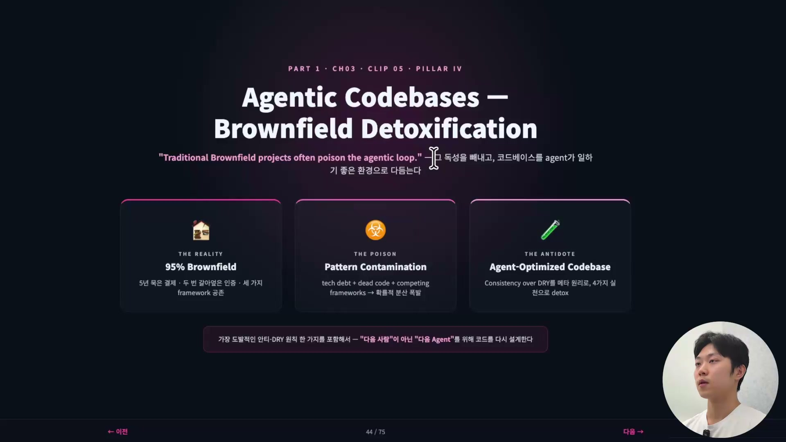
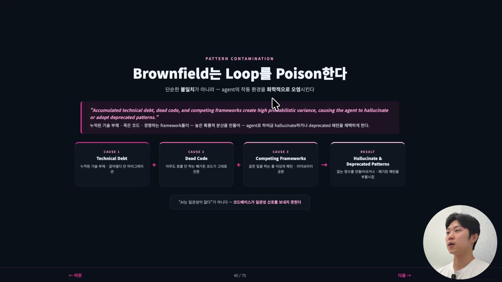
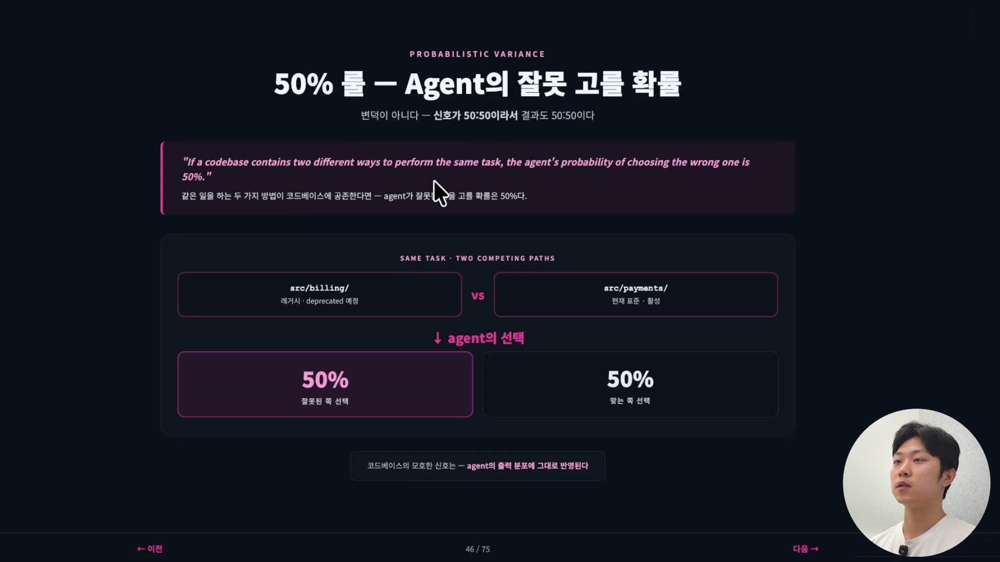
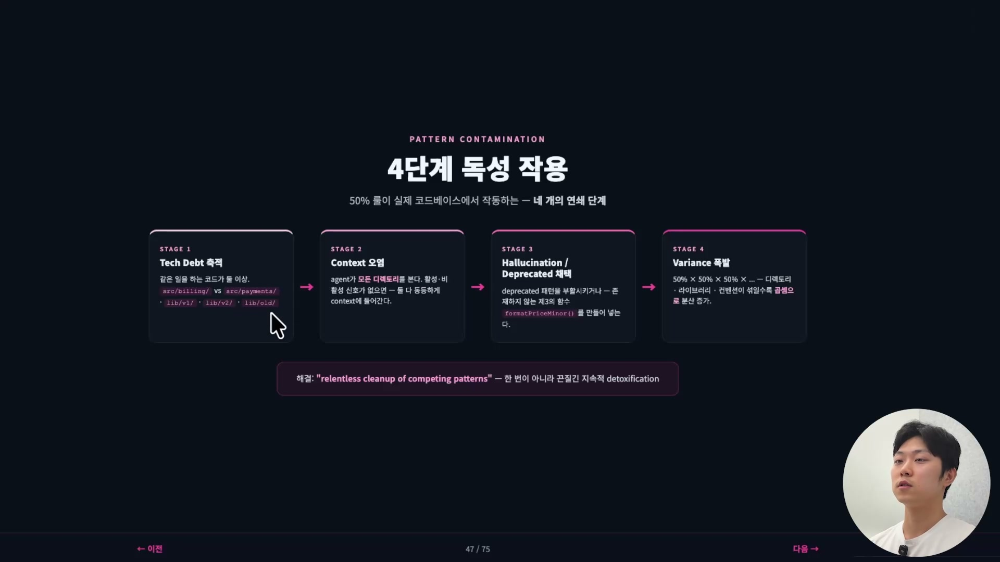
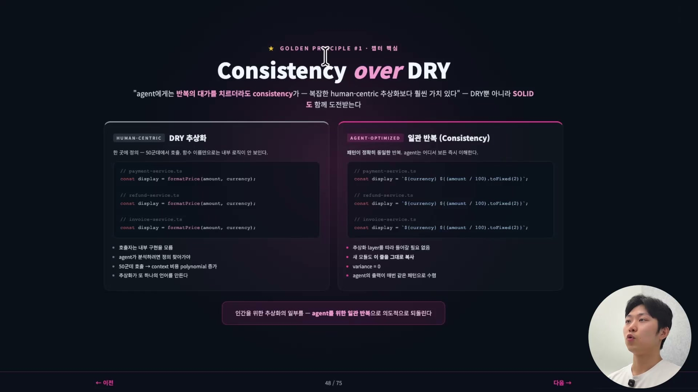
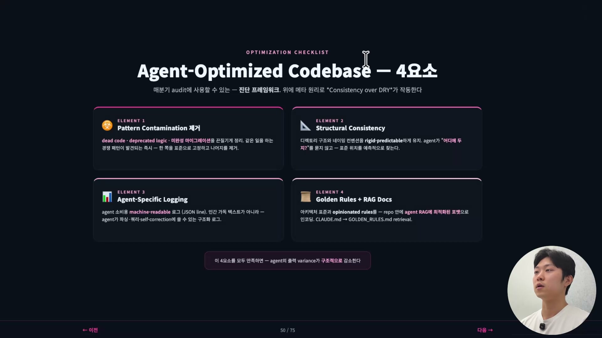
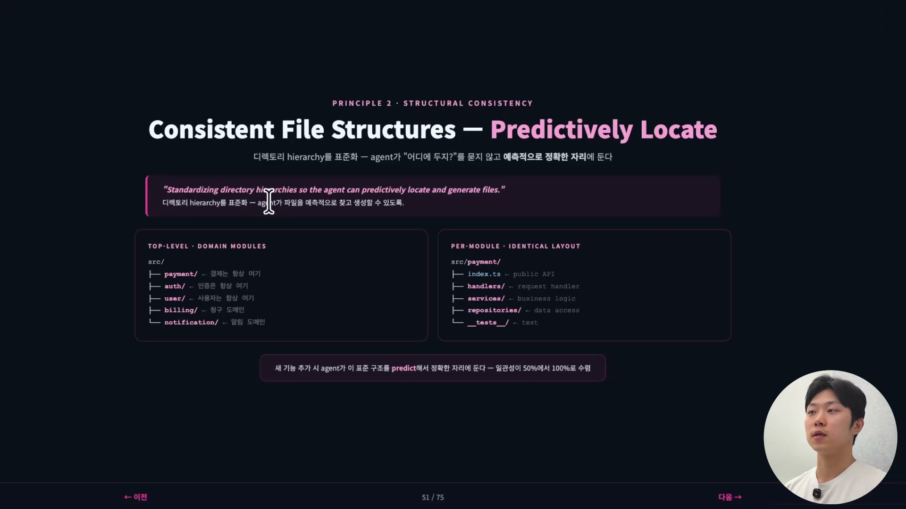
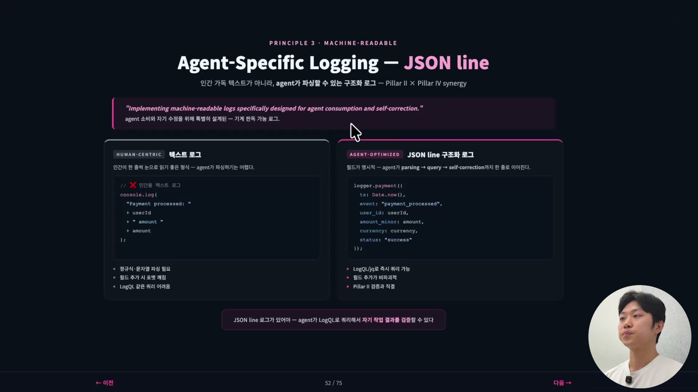
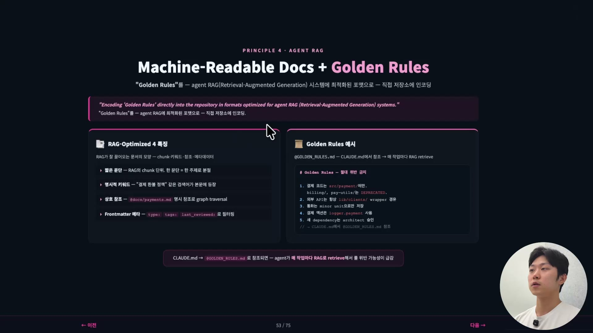

질문 하나로 시작한다. 내 코드베이스는 그린필드인가, 브라운필드인가.

브라운필드(brownfield) 코드베이스라는 말이 생소하다면, 오래 묵은 코드베이스라고 생각하면 된다. 5년 10년 동안 쌓인 코드들, 흔히 레거시(legacy)라고 부르는 그 코드베이스다. 현업에 있는 사람이라면 95% 이상이 여기서 일하고 있을 것이다. 갓 시작한 스타트업의 3개월짜리, 6개월짜리 리포지터리가 아닌 이상, 누구의 코드베이스도 깨끗할 수 없다. 5년 묵은 결제 모듈이 있고, 두 번 갈아엎은 인증 시스템이 있고, 세 가지 프레임워크가 공존하는 프론트엔드가 있다. 이게 현실이다.

문제는 이런 전통적인 브라운필드 프로젝트가 에이전틱 루프(agentic loop)에 독을 준다는 데 있다. 그래서 디톡스가 필요하다. 이 글에서 다룰 주제가 그것이다. 이미 독이 퍼진 코드베이스에서 그 독을 어떻게 빼내고, 코드베이스 자체를 에이전트가 일하기 좋은 환경으로 다듬을 것인가.

여기서 쓰는 "독(poison)"이라는 단어는 일부러 강하게 골랐다. 코드를 느슨하게 망가뜨리는 정도가 아니라, 에이전트의 동작을 화학적으로 오염시킨다는 뜻이기 때문이다.

## 패턴 오염, 같은 일을 하는 패턴이 둘이면

이 현상을 패턴 컨테미네이션(Pattern Contamination), 패턴 오염이라고 부른다. 정의는 이렇다. 같은 일을 하는 경쟁 패턴들이 코드베이스에 있으면, 그 패턴들이 에이전트의 컨텍스트를 오염시켜 확률적인 오류를 일으킨다.

"오염"이라는 단어를 쓰는 이유가 있다. 단순한 불일치 정도가 아니라, 에이전트의 작동 환경 자체를, 컨텍스트 자체를 오염시키기 때문이다. 원인은 대략 세 가지다. 누적된 기술 부채(technical debt), 아무도 호출하지 않는 죽은 코드(dead code), 그리고 경쟁하는 프레임워크. 이 셋이 합쳐져 분산을 만든다. 간단히 말하면 환각(hallucination)이다. 작업을 시작하려 할 때 작업을 제대로 못 하게 만들고, 결과물의 품질을 떨어뜨린다.

왜 이렇게 되는지를 가장 단순한 수치로 보여주는 게 50% 룰이다. 같은 일을 하는 두 가지 방법이 코드베이스에 공존한다고 하자. 그러면 에이전트가 잘못된 쪽을 고를 확률은 50%다. 당연한 이야기다. 예를 들어 `src/billing/`은 레거시라 폐기(deprecated) 예정이고 `src/payments/`가 현재 표준이라면, 에이전트 입장에서 둘 중 무엇이 맞는지 알려주는 신호가 없는 한, 선택은 반반으로 갈린다.

이게 확률적 모델의 한계다. 그리고 우리가 에이전트 코드베이스를 따로 만들어야 하는 이유이기도 하다. 코드베이스에 모호한 신호가 있으면, 에이전트의 출력은 그 모호함을 그대로 따라 분포대로 반영한다. 이건 변덕이 아니라 정직한 것이다. 신호가 50대 50이니 결과도 50대 50으로 나오는 것뿐이다.

## 4단계로 번지는 독성 작용

이 50% 룰이 실제 코드베이스에서 어떻게 작동하는지를 네 단계로 정리할 수 있다.

1단계, 같은 일을 하는 코드가 두 군데 혹은 그 이상에 존재한다. `src/billing/`과 `src/payments/`가 공존하고, `lib/v1/`, `lib/v2/`, `lib/old/`가 나란히 있다.

2단계, 컨텍스트가 오염된다. 에이전트는 작업 전에 항상 코드베이스를 탐색하는데, 탐색하다 보면 이 패턴도 있고 저 패턴도 있다는 걸 발견하고 그게 모두 컨텍스트에 들어간다. 활성·비활성을 가르는 신호가 없으면 둘 다 동등하게 컨텍스트에 올라간다.

3단계, 환각이 일어난다. 컨텍스트에 패턴이 여러 개 있으니 에이전트는 무엇을 써야 할지 모른다. 운이 좋으면 좋은 패턴을, 운이 나쁘면 나쁜 패턴을 쓴다. 3년 전에 폐기하기로 결정한 패턴을 갑자기 다시 꺼내 쓰기도 하고, 더 나쁜 경우에는 두 패턴이 섞여 아예 존재하지도 않는 함수, 가령 `formatPriceMinor()` 같은 걸 만들어낸다.

4단계, variance가 폭발한다. 디렉토리가 3개, 라이브러리가 2개, 컨벤션이 4개라고 하자. 하나여야 할 것들이다. 그런데 에이전트의 출력 분산은 이것들을 곱셈으로 키운다. 그래서 오늘은 이걸 했는데 내일은 갑자기 저걸 하는, 신뢰할 수 없는 도구가 되어버린다.

이 지점에서 엔지니어가 흔히 내리는 결론이 있다. "AI는 일관성이 없어서 못 쓰겠다." 이건 잘못된 결정이다. 문제는 늘 사람에서 온다. 지휘자이자 아키텍트인 우리가 환경 세팅을 제대로 못 한 것이지, AI의 잘못이 아니다. 진짜 원인은 코드베이스가 일관성을 보낼 신호 자체를 가지고 있지 않다는 데 있다.

## Consistency over DRY, 골든 프린시플

여기서 골든 프린시플(golden principle)이 나온다. 그런데 솔직히 말하면 이건 꽤 논쟁적인 주제다. 요즘 사람들이 도발적인 주장을 많이 하는 영역이기도 하다.

배경부터 짚자. DRY와 SOLID 같은 전통적인 소프트웨어 원칙이 있다. DRY는 Don't Repeat Yourself, 같은 코드를 여러 군데에 쓰지 말라는 뜻이다. 개발자들 사이에서 오랫동안 옳은 원칙으로 고수되어 왔고, AI도 그렇게 짜라고 학습되어 있다. 사람이 짠 코드로 학습했으니 당연하다.

그런데 요즘 이게 도전을 받는다. DRY나 SOLID 같은 원칙이 애초에 "인간이 코드를 읽기 좋게"라는 전제 위에 세워졌기 때문이다. 인간은 한 곳을 보면 전체를 추론할 수 있다. 그래서 추상화가 미덕이었다. 그런데 에이전트는 코드를 읽는 방식이 우리와 다르다.

예를 들어 코드베이스에 `formatPrice`라는 호출이 있다고 하자. 인간은 그 정의를 보러 간다. 정의를 한 번 보면 끝이다. `formatPrice`가 50군데에서 쓰여도 정의는 한 군데에 있으니, "아 이제 알겠다" 하고 넘어간다. 그런데 에이전트는 `formatPrice`가 50군데에서 쓰이고 있으면 그 50군데를 전부 컨텍스트로 끌어온다. 추상화가 오히려 컨텍스트 비용을 늘리는 것이다. 게다가 추상화는 새로운 언어를 하나 만든다. `formatPrice`가 무엇을 하는지 함수 이름만으로는 모르니 내부 로직을 읽어야 하고, 거기서 추론을 한 단계 더 해야 한다.

SOLID도 마찬가지다. 인터페이스를 분리하고 의존성을 분리하며 레이어를 계속 쌓는다. 우리한테는 이득이 크지만, 에이전트한테는 탐색해야 할 레이어가 늘어나는 비용이 된다.

그래서 나온 주장이 "Consistency over DRY", 즉 일관성을 위해서라면 반복을 감수하라는 것이다. 사람은 절대 이렇게 코드를 쓰지 않는다. 우리는 무조건 하나의 함수로 묶어 분리한다. 그런데 에이전트가 어차피 코드를 쓰고, 에이전트가 원하는 건 일관성, 곧 반복이다. 그러니 에이전트를 위해, 일관성을 위해 일부러 반복하라는 것이다.

슬라이드의 코드 비교가 이 차이를 정확히 보여준다. 왼쪽 DRY 방식은 `payment-service.ts`, `refund-service.ts`, `invoice-service.ts` 세 파일이 모두 `formatPrice(amount, currency)`를 호출한다. 호출자는 내부 구현을 모르고, 에이전트가 분석하려면 정의를 찾아가야 하며, 50군데 호출은 컨텍스트 비용을 다항식으로 늘린다. 오른쪽 일관 반복 방식은 같은 세 파일이 `` `${currency} ${(amount / 100).toFixed(2)}` `` 라는 표현식을 한 줄로 그대로 복사해 쓴다. 추상화 레이어를 따라 들어갈 필요가 없고, 새 모듈도 이 줄을 그대로 복사하면 되며, variance는 0이고, 에이전트의 출력이 매번 같은 패턴으로 수렴한다.

다만 분명히 해둘 게 있다. 이건 아직 논쟁 중인 주제다. 정답은 없다. DRY나 SOLID가 인간 가독성의 토대로서 여전히 필요하다는 건 변하지 않는다. 맹목적으로 갑자기 없애라는 게 아니다. 단지 에이전트가 선호하는 구조가 따로 있을 수 있고, 때로는 그게 우리가 고수해 온 것과 아예 다를 수 있다는 걸 인정하자는 것이다. 흑백 논리가 아니라 이 뉘앙스를 아는 게 중요하다.

## 에이전트 최적화 코드베이스의 4요소

그럼 에이전트 최적화 코드베이스(Agent-Optimized Codebase)를 만들 때 점검할 항목을 네 가지로 정리해 보자. 분기마다 audit, 곧 점검에 쓸 수 있는 진단 프레임워크다. 그 위에 메타 원리로 방금 본 Consistency over DRY가 작동한다.

**첫째, 패턴 오염 제거.** 앞에서 다룬 그것이다. 죽은 코드, 폐기된 로직, 미완성 마이그레이션을 끈질기게 정리한다. 같은 일을 하는 경쟁 패턴이 발견되는 즉시 한 쪽을 표준으로 고정하고 나머지를 제거한다. 슬라이드의 표현으로는 "relentless cleanup of competing patterns", 한 번이 아니라 끈질긴 지속적 디톡스다.

**둘째, 구조 일관성(Structural Consistency).** 디렉토리 구조와 네이밍 컨벤션을 표준화한다. 에이전트가 "이걸 어디에 둬야 하지?"라고 고민하지 않고, 표준 위치를 예측적으로 찾을 수 있도록 만드는 것이다.

방법은 두 층위로 나뉜다. 위 층위는 도메인 모듈을 표준 자리에 둔다. `src/` 아래 `payment/`는 결제, `auth/`는 인증, `user/`는 사용자, 이렇게 항상 같은 자리다. 아래 층위는 각 모듈 안의 레이아웃을 똑같이 맞춘다. `src/payment/` 안에 `index.ts`(public API), `handlers/`(request handler), `services/`(business logic), `repositories/`(data access), `__tests__/`(test)가 있다면, 다른 모듈 안도 정확히 같은 레이아웃이어야 한다. 그러면 새 기능을 추가할 때 에이전트가 이 표준 구조를 예측해서 정확한 자리에 둔다. 일관성이 50%에서 100%로 수렴한다.

**셋째, 에이전트를 위한 로깅(Agent-Specific Logging).** 지금까지 주석이나 로그는 우리, 인간을 위한 것이었다. 디버깅하기 쉽게 만든 것이다. 그런데 이제는 에이전트가 디버깅한다. 우리가 직접 디버깅할 일은 거의 없다. 그러니 로깅도 에이전트를 위한 것으로 바꿔야 한다.

차이는 이렇다. 인간용 텍스트 로그는 `console.log("Payment processed: " + userId + " amount " + amount)`처럼 문자열을 이어 붙인다. 사람이 한 줄씩 눈으로 읽기는 좋지만, 에이전트가 파싱하기는 어렵다. 정규식이나 문자열 파싱이 필요하고, 필드를 하나 추가하면 포맷이 깨지며, LogQL 같은 쿼리를 걸기도 어렵다. 반면 JSON line 구조화 로그는 `logger.payment({ ts, event: "payment_processed", user_id, amount_minor, currency, status: "success" })`처럼 필드가 명시적이다. LogQL이나 jq로 즉시 쿼리할 수 있고, 필드를 추가해도 기존 게 깨지지 않으며, 무엇보다 에이전트가 parsing → query → self-correction(자기 수정)까지 한 줄로 이어 갈 수 있다. 에이전트가 자기 작업의 결과를 LogQL로 쿼리해서 직접 검증할 수 있게 되는 것이다.

**넷째, Machine-Readable Docs와 Golden Rules.** 문서에도 에이전트를 위해 최적화된 포맷이 따로 있다. 에이전트는 문서를 읽을 때 RAG(Retrieval-Augmented Generation, 검색 증강 생성)를 사용하므로, 그 RAG가 잘 끌어올 수 있는 포맷으로 문서를 써야 한다.

RAG가 잘 끌어오는 문서에는 네 가지 특징이 있다. 한 문단을 한 주제로 짧게 끊고(RAG의 chunk 단위), "결제 환불 정책" 같은 검색어가 본문에 명시적으로 등장하게 하며, `@docs/payments.md`처럼 다른 문서를 명시적으로 상호 참조하고(graph traversal), frontmatter에 `type`·`tags`·`last_reviewed` 같은 메타를 달아 필터링할 수 있게 한다.

그리고 그 위에 Golden Rules가 얹힌다. 슬라이드의 예시를 보면 "절대 위반 금지"로 못박힌 규칙들이 간결하게 정리되어 있다. 결제 코드는 `src/payment/`에만 두고 `billing/`·`pay-utils/`는 DEPRECATED라거나, 외부 API는 항상 `lib/clients/` wrapper를 경유하라거나, 통화는 minor unit으로만 저장하라는 식이다. 이걸 `CLAUDE.md`가 `@GOLDEN_RULES.md`로 참조하게 해두면, 에이전트가 매 작업마다 RAG로 이 규칙을 retrieve(검색)해서 규칙 위반 가능성이 급감한다.

## 코드의 1차 독자는 이제 에이전트다

이 모든 변화를 관통하는 철학적인 한 줄이 있다.

> "We are no longer writing code for the next human to read, we are writing code for the next agent to execute."
> 우리는 더 이상 다음 사람이 읽을 코드를 쓰지 않는다. 다음 에이전트가 실행할 코드를 쓴다.

이게 진짜 핵심이다. AI 시대 이전에 우리는 유지보수를 위해, 우리 뒤에 올 사람을 위해 코드를 썼다. 추상화도, DRY도, SOLID도 다 그 사람들을 위한 것이었다. 그런데 이제는 그럴 필요가 없다. 에이전트를 위해, 에이전트가 에이전트를 위해 코드를 쓰는 것이다. 그래서 에이전트에 최적화된 코드베이스를 만드는 게 가장 중요하다.

지난 50년의 소프트웨어 엔지니어링이 "코드는 인간이 읽기 위한 것이다"라는 전제 위에 세워졌다면, 다음 10년, 다음 20년은 그 전제가 뒤집힌다. 코드의 1차 독자는 이제 에이전트다.

다만 코드베이스 하나를 아무리 잘 다듬어도 한계가 있다. 한 명이 잘 정리된 코드베이스를 갖추었는데 팀 전체의 워크플로우가 흩어져 있다면 효과가 없다. 개인의 최적화가 팀 차원의 누적 효과로 넘어가는 이야기, 컴파운드 엔지니어링(compound engineering)이 다음 기둥에서 이어진다.
