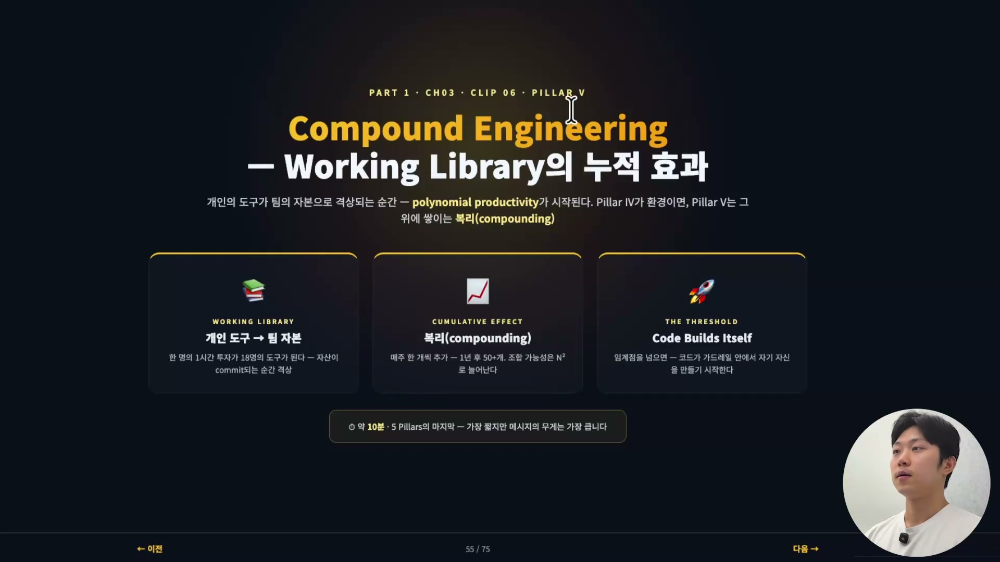
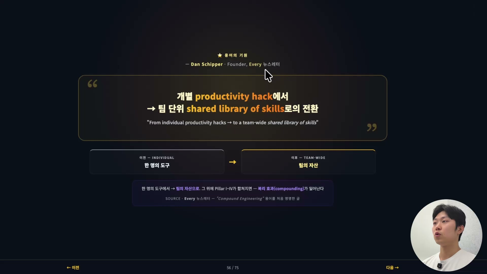
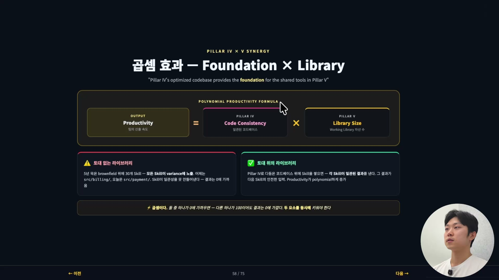
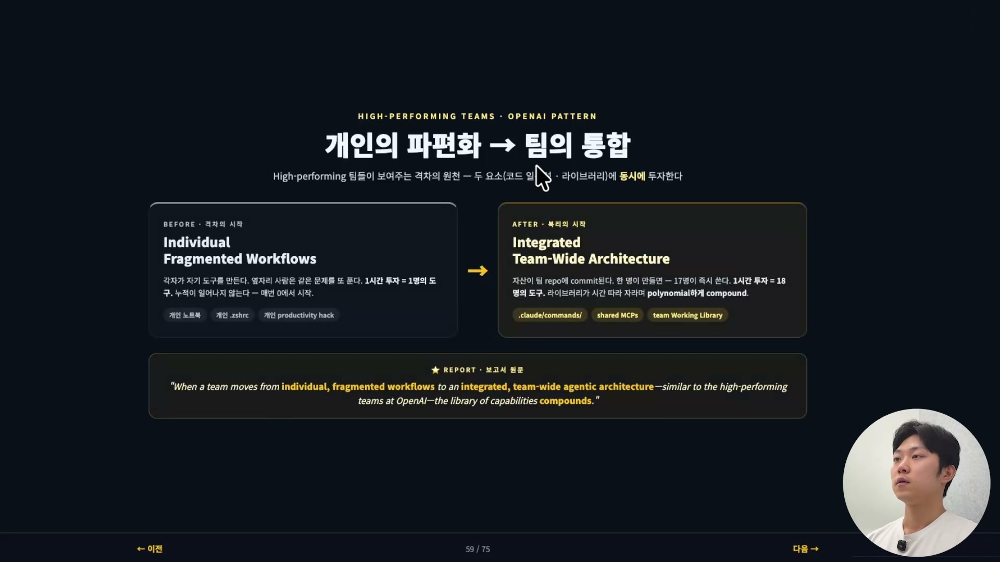
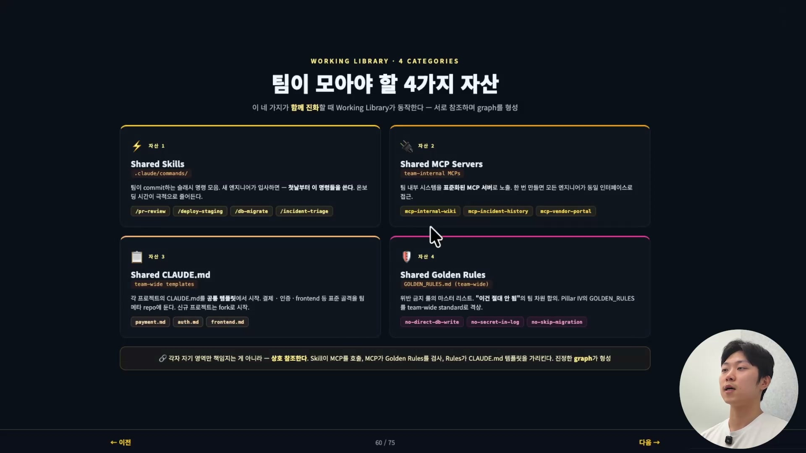
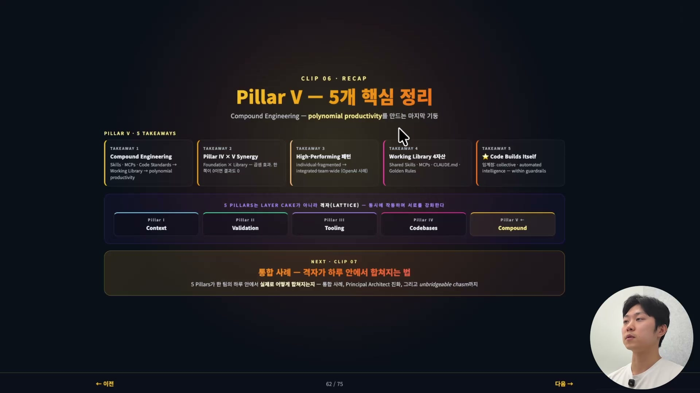

에이전틱 엔지니어링의 다섯 기둥 중 마지막은 분량으로 보면 가장 짧다. 그런데 강의에서는 이 기둥을 두고 "메시지의 무게는 가장 크다"고 말한다. 앞의 네 기둥과 결이 다르기 때문이다. 컨텍스트 엔지니어링, 에이전틱 밸리데이션, 에이전틱 툴링, 에이전틱 코드베이스. 이 넷은 전부 한 사람이 자기 작업 환경을 다듬는 이야기였다. 좋은 CLAUDE.md를 쓰고, 좋은 검증 루프를 걸고, 자주 쓰는 작업을 CLI로 만들고, 코드베이스를 깔끔하게 가꾸는 것. 다섯 번째 기둥은 그 다듬은 것을 개인에서 팀으로 끌어올린다. 이름은 컴파운드 엔지니어링(Compound Engineering)이다.

## 용어의 기원과 정의

컴파운드 엔지니어링이라는 말은 뉴스레터 회사 에브리(Every)의 창립자 댄 시퍼(Dan Schipper)가 처음 제안했다. 그가 잡은 핵심은 한 문장으로 요약된다. 개인의 생산성 요령에서 팀 전체가 공유하는 스킬 라이브러리로의 전환. 한 명의 도구를 팀의 자산으로 바꾸는 것, 그리고 그 위에서 다섯 기둥이 모두 합쳐질 때, 그제서야 컴파운드 엔지니어링이 일어난다.

비유로 정리하면 이렇다. 코드베이스가 환경이라면, 컴파운드 엔지니어링은 그 환경 위에 쌓이는 자본이다. 환경(네 번째 기둥, 에이전틱 코드베이스)을 먼저 다져 놓아야 그 위에 자본이 쌓인다는 순서가 여기 들어 있다. 이 순서는 뒤에서 곱셈 이야기로 다시 나온다.

좀 더 형식을 갖춘 정의는 이렇다. 컴파운드 엔지니어링은 개별 최적화(스킬, MCP, 코드 표준 같은 것들)가 팀 전체에 공유되고 하나의 중앙 Working Library로 통합될 때 실현되는 누적 효과다. 키워드는 셋이다. 산출물(개별 최적화), 공유(Working Library), 시간(누적 효과). 앞의 네 기둥에서 우리가 만든 것들이 곧 이 산출물이고, 그것을 팀으로 공유한 통합 저장소가 Working Library이며, 거기서 시간을 따라 복리가 붙는다.

## 1시간이 18명분이 되는 산수

개별 최적화는 그 하나만 보면 작아 보인다. 슬래시 명령어 하나, 스킬 하나, MCP 서버 하나. 그런데 이게 팀 차원으로 공유되는 순간 크기가 달라진다.

강의가 든 숫자가 직관적이다. 한 명이 1시간을 들여 슬래시 명령어 하나를 만든다. 그게 팀 저장소에 commit되면 17명이 그대로 가져다 쓴다. 만든 사람까지 합쳐 18명이 쓰는 도구가 된다. 1시간을 투자해 18명분의 도구를 만든 셈이다. 개인 자산이 팀 자본으로 올라온다는 말의 실체가 이 산수다.

여기에 시간이 붙으면 누적 효과, 즉 복리가 된다. 팀 라이브러리에 매주 새 도구가 하나씩 추가된다고 해보자. 1년이면 50개가 넘는다. 그런데 도구는 단순히 개수만 느는 게 아니라 서로 조합된다. 도구가 N개면 조합 가능성은 대략 N²로 늘어난다. 그래서 새 도구들이 합쳐져 새로운 워크플로우를 만들고, 라이브러리의 표현력은 1년 전과 비교 불가능한 수준으로 벌어진다. 강의는 이 증가를 다항식(polynomial) 생산성이라고 부른다. 요지는 도구를 더할수록 산출이 선형이 아니라 다항식으로 불어난다는 것이고, N²는 그중 가장 단순한 경우일 뿐이다.

## 곱셈이라는 함정

복리가 좋은 말처럼만 들리면 절반만 본 것이다. 강의는 이 기둥의 산수를 곱셈으로 못 박는다. 네 번째 기둥과 다섯 번째 기둥이 따로 노는 게 아니라 곱해진다는 것이다.

공식은 이렇게 적힌다. 팀의 산출 속도(Productivity)는 코드 일관성(Code Consistency, 네 번째 기둥)과 라이브러리 크기(Library Size, 다섯 번째 기둥)의 곱이다. 곱셈의 성질이 여기서 핵심이다. 두 값 중 하나가 0에 가까우면, 다른 하나가 100이어도 결과는 0에 가깝다.

강의가 든 예가 이 함정을 그대로 보여준다. 팀에 공유 스킬이 30개 있다고 하자. 라이브러리 크기는 충분하다. 그런데 코드베이스가 여전히 브라운필드다. 어제는 결제 코드가 `src/billing/`에 있었는데 오늘은 `src/payment/`에 있고, 코딩 컨벤션도 여러 개, 패턴도 여러 개로 흩어져 있다. 이 상태에서 스킬을 실행하면 결과가 제대로 나오지 않는다. 스킬이 일관성을 만들어내지 못하니, 30개의 스킬을 쌓아도 산출은 0에 가깝게 죽는다.

반대로 코드베이스를 먼저 다듬고 그 위에 스킬을 쌓으면, 그제야 스킬이 일관된 결과를 낸다. 그리고 그 일관된 결과가 다음 스킬의 안전한 입력이 되어 산출이 다항식으로 증가한다. 그래서 둘 다 동시에 키워야 한다는 결론이 나온다. 앞에서 "환경 위에 자본을 쌓는다"고 했던 순서가 여기서 곱셈으로 증명되는 셈이다.

## 개인의 파편화에서 팀의 통합으로

이 격차가 시작되는 지점은 사실 평범하다. 각자가 자기 도구를 만든다.

Before는 파편화된 상태다. 각자가 한 시간을 투자해 나를 위한 도구를 만든다. 옆자리 사람은 같은 문제를 또 푼다. 도구가 개인 노트북, 개인 `.zshrc`, 개인 productivity hack에 흩어져 있으니 누적이 일어나지 않는다. 매번 0에서 다시 시작한다. 여기서는 1시간 투자가 딱 1명분의 도구로 끝난다.

After는 통합된 상태다. 같은 도구가 팀 저장소에 commit되어 `.claude/commands/`, shared MCP, team Working Library 같은 형태로 모인다. 한 명이 만들면 17명이 즉시 쓰고, 라이브러리는 시간을 따라 자라며 복리로 불어난다. 1시간 투자가 18명분의 도구가 되는 그 산수가 다시 나온다.

강의는 이게 막연한 이상이 아니라 실제 패턴이라고 짚는다. 보고서 원문은 이렇게 적는다. "When a team moves from individual, fragmented workflows to an integrated, team-wide agentic architecture, similar to the high-performing teams at OpenAI, the library of capabilities compounds." (팀이 개인의 파편화된 워크플로로부터 OpenAI의 고성과 팀들처럼 통합된 팀 단위 에이전틱 아키텍처로 옮겨갈 때, 역량의 라이브러리가 복리로 불어난다.)

## 팀이 모아야 할 네 가지 자산

그렇다면 팀이 실제로 무엇을 모아야 하나. 강의는 네 카테고리로 정리한다. 결국 앞의 기둥들에서 이미 다 이야기한 것들이다.

| 자산 | 무엇인가 | 예시 |
| --- | --- | --- |
| Shared Skills | 팀이 commit하는 슬래시 명령어 모음. 새 엔지니어가 입사하면 첫날부터 이 명령들을 쓴다. 온보딩 시간이 크게 줄어든다. | `/pr-review`, `/deploy-staging`, `/db-migrate`, `/incident-triage` |
| Shared MCP Servers | 팀 내부 시스템을 표준화된 MCP 서버로 노출. 한 번 만들면 모든 엔지니어가 동일한 인터페이스로 접근한다. | `mcp-internal-wiki`, `mcp-incident-history`, `mcp-vendor-portal` |
| Shared CLAUDE.md | 각 프로젝트의 CLAUDE.md를 공통 템플릿에서 시작. 결제, 인증, frontend 같은 표준 골격을 팀 메타 저장소에 둔다. 신규 프로젝트는 fork로 시작한다. | `payment.md`, `auth.md`, `frontend.md` |
| Shared Golden Rules | "이건 절대 안 됨"의 팀 차원 합의. 위반 금지 룰의 마스터 리스트를 team-wide 표준으로 격상한다. | `no-direct-db-write`, `no-secret-in-log`, `no-skip-migration` |

네 번째 골든 룰은 따로 곱씹을 만하다. 팀 코드베이스 안의 패턴이나 룰은 어떻게 보면 암묵지에 가깝다. 머릿속에는 있는데 어디 적혀 있지는 않은 것들이다. 그걸 명문화해서 모아 두면, 컨텍스트 엔지니어링(첫 번째 기둥)이 비로소 진짜 힘을 발휘한다. 에이전트에게 던질 컨텍스트가 개인의 기억이 아니라 팀의 합의가 되기 때문이다.

이 네 자산은 각자 제 영역만 책임지고 끝나지 않는다. 서로 참조하면서 하나의 그래프(graph)를 이룬다. 스킬이 MCP를 호출하고, MCP가 골든 룰을 검사하고, 룰이 CLAUDE.md 템플릿을 가리킨다. 네 가지가 함께 진화할 때 Working Library가 동작한다.

## 코드가 자기 자신을 만들기 시작한다

시간이 충분히 지나 이 지식이 복리로 쌓이면, 강의는 이렇게 표현한다. 코드가 사실상 자기 자신을 만들기 시작하는 상태로 진입한다.

문자 그대로 코드가 알아서 태어난다는 뜻은 아니다. 확립된 가드레일 안에서 에이전트가 자유롭게 만들기 시작한다는 뜻이다. 가드레일이 곧 앞의 네 자산이다. 골든 룰이 경계를 긋고, 공유 스킬과 MCP가 손발이 되고, 공통 CLAUDE.md가 맥락을 준다. 팀이 누적해 온 라이브러리의 지능, 즉 개인 한 명의 지능이 아니라 팀이 함께 쌓은 지능을 에이전트가 라이브러리에서 retrieve해서 적용할 때, 사실상 팀 전체의 누적 지식이 동원된다. 이 팀에 특화된 천재 에이전트 한 명을 빚어내, 그가 팀의 일을 해내는 그림이다.

여기서 강의가 덧붙이는 숫자가 90/10 규칙이다. 새 기능의 90% 이상이 기존 자산의 조합으로 해결되고, 새로 작성하는 코드는 10% 미만이 된다. 엔지니어가 처음부터 코딩하는 게 아니라 조합을 설계하는 일로 옮겨간다는 것이다. 도구가 N개일 때 조합이 N²로 늘어난다던 그 다항식이, 실무에서는 "대부분의 일은 이미 있는 것들의 조합"이라는 모습이 된다.

## 다섯 기둥은 레이어 케이크가 아니라 격자다

마지막으로 다섯 기둥 전체를 한 번에 본다.

| 기둥 | 핵심 |
| --- | --- |
| Pillar I · Context | CLAUDE.md, 지식 그래프 |
| Pillar II · Validation | 닫힌 루프 검증 인프라 |
| Pillar III · Tooling | 표준 CLI · Skill · MCP |
| Pillar IV · Codebase | 골든 룰, 패턴 정합 |
| Pillar V · Compound | 개인 도구의 팀 자본화, 복리 |

이 다섯을 하나하나 따로 보면 안 된다. 다섯을 모두 할 줄 알아야 하고, 서로 상호 보완된다고 생각해야 한다. 컴파운드 엔지니어링에서 본 곱셈이 좋은 증거다. 코드베이스(IV) 없이 라이브러리(V)만 쌓으면 결과가 0으로 죽었다. 강의의 표현을 빌리면, 다섯 기둥은 차곡차곡 위로 쌓는 레이어 케이크가 아니라 격자(lattice)다. 동시에 작용하면서 서로를 강화한다.

그리고 컴파운드 엔지니어링이 마지막에 놓인 이유도 여기서 분명해진다. 앞의 네 기둥이 개인의 환경을 다듬는 일이었다면, 다섯 번째는 그 다듬은 것을 팀으로 끌어올려 복리를 거는 일이다. 한 사람의 1시간이 18명분이 되고, 도구 N개의 조합이 N²가 되고, 시간이 지나면 코드가 가드레일 안에서 스스로를 짓기 시작한다. 가장 짧은 기둥이 가장 무거운 메시지를 지는 까닭이다.
