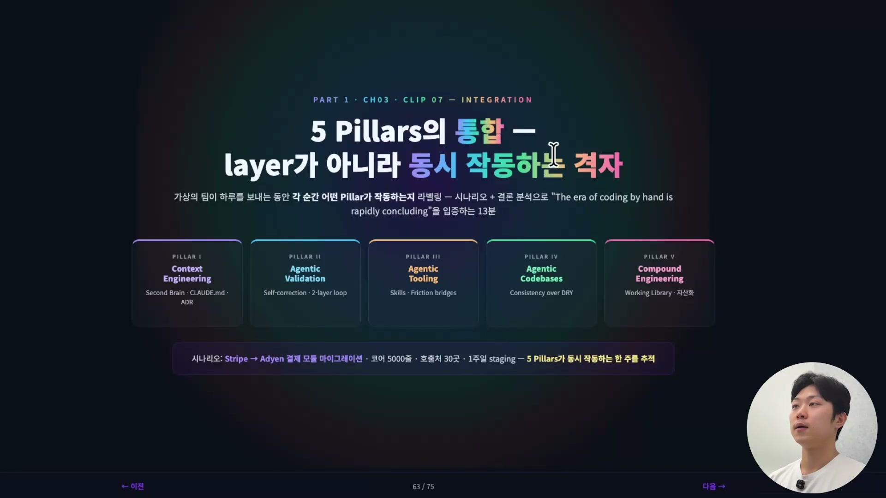
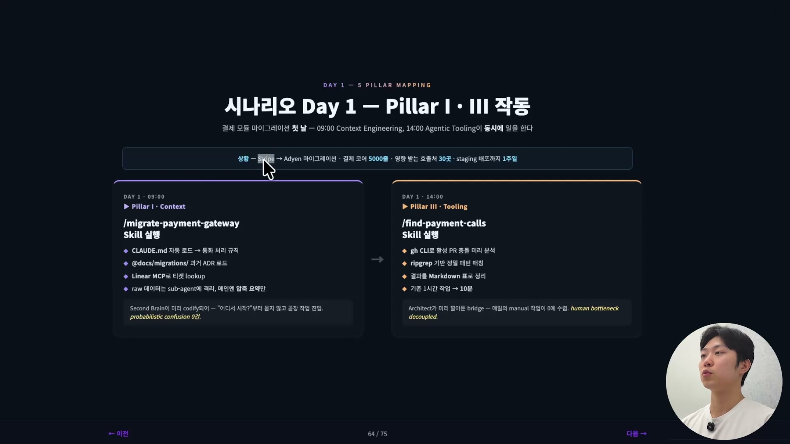
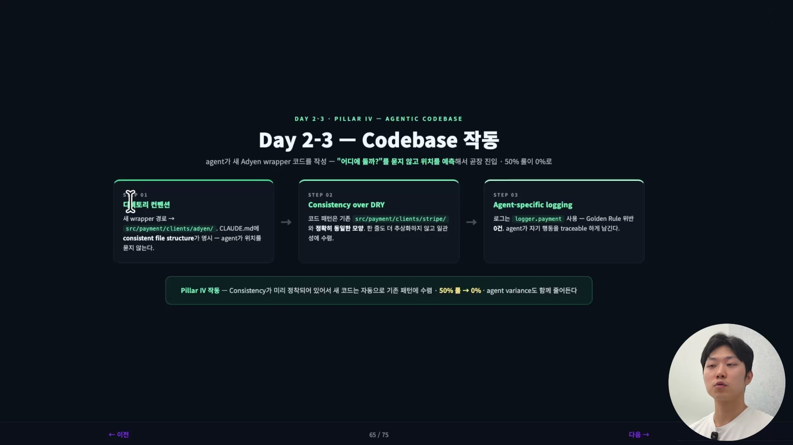
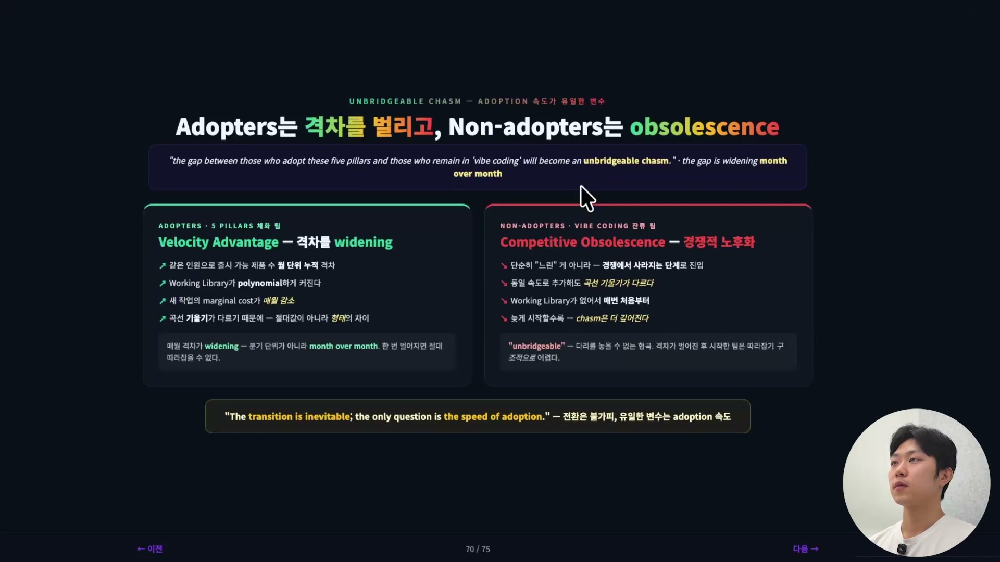
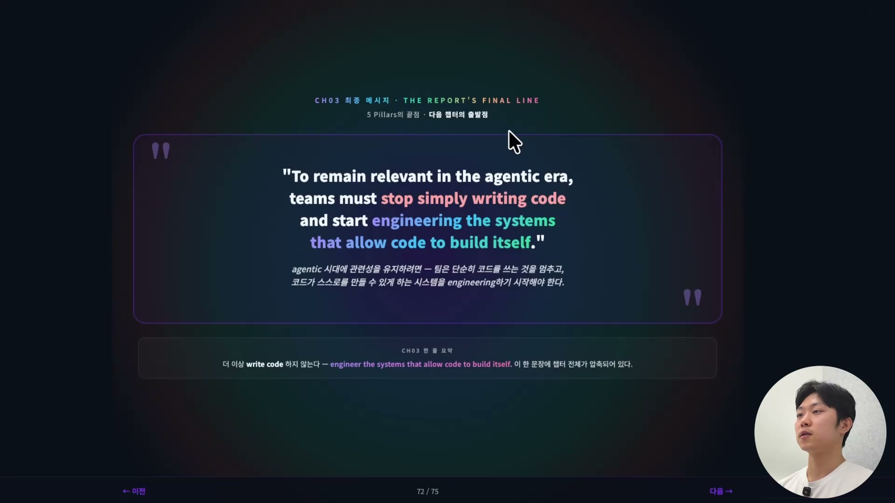

에이전틱 엔지니어링의 다섯 기둥을 따로따로 배우고 나면 한 가지 착각에 빠지기 쉽다. 기둥들이 1층, 2층, 3층처럼 쌓이는 레이어라는 착각이다. 컨텍스트를 먼저 깔고, 그 위에 검증을 올리고, 그 위에 또 툴링을 얹는 순서가 있는 것처럼 보인다. 하지만 실제로 잘 굴러가는 팀에서 이 기둥들은 층층이 쌓이지 않는다. 같은 작업의 같은 순간에 동시에 맞물려 돌아간다.

그래서 이 다섯 기둥을 하나의 그림으로 합쳐 보는 방법은 하나의 작업을 처음부터 끝까지 따라가면서 각 순간에 어떤 기둥이 작동하는지 라벨을 붙여 보는 것이다. 다섯 기둥을 다시 한 줄로 정리하면 이렇다. Context Engineering(Second Brain, CLAUDE.md, ADR), Agentic Validation(자기 수정, 2단 검증 루프), Agentic Tooling(스킬, friction bridge), Agentic Codebases(DRY보다 일관성), Compound Engineering(Working Library, 자산화). 이 다섯이 따로 노는 게 아니라 한 작업 안에서 서로를 떠받친다는 것을 보여주는 게 이 정리의 목적이다.

## 가상의 시나리오 하나

설명을 위해 가상의 작업 하나를 설정한다. 실제로 돌려본 작업이 아니라, 다섯 기둥이 어떻게 맞물리는지 보여주기 위해 짜인 시나리오다.

상황은 이렇다. 기존 Stripe 결제 모듈을 Adyen으로 마이그레이션해야 한다. 옮겨야 할 결제 코어 로직이 5000줄이고, 이 Stripe 모듈을 가져다 쓰는 곳(dependent한 호출처)이 30곳이나 된다. 그런데 스테이징 배포까지 주어진 시간은 일주일이다. 이 일을 에이전틱 엔지니어링이 잘 갖춰진 팀의 한 엔지니어가 어떻게 처리하는지, 하루 단위로 5단계를 따라간다.

## Day 1, 컨텍스트와 툴링이 같은 날 함께 움직인다

첫날 오전 9시, 컨텍스트 엔지니어링부터 시작한다. 말이 거창하지만 구체적으로는 이렇다. `CLAUDE.md`를 미리 만들어 두고 그게 자동으로 로드되는지 확인한다. 이 문서 안에는 통화 처리 규칙이 들어 있다. 그리고 `CLAUDE.md`가 가리키는 마이그레이션 관련 문서(과거 아키텍처 결정을 기록해 둔 ADR)를 통해, 우리가 과거에 어떤 아키텍처 결정을 어떻게 내렸는지를 Claude가 함께 읽는다. 여기에 Linear MCP로 티켓을 조회해 그 티켓의 정보대로 작업을 시작한다. 작업 중 쏟아지는 raw 데이터는 서브 에이전트에 격리해서, 메인 컨텍스트는 오염시키지 않고 압축된 요약만 받는다.

이 네 가지 동작(CLAUDE.md 자동 로드, ADR 참조, 티켓 조회, raw 데이터 격리)을 하나로 묶어 `migrate-payment-gateway`라는 스킬로 만들어 실행한다. 여기서 핵심은 Second Brain이다. CLAUDE.md, ADR 같은 팀의 암묵지가 미리 코드로 정착돼 있어서, Claude가 "어디서부터 시작하면 되냐"고 되묻지 않는다. 시작점을 알고 바로 작업에 진입한다. 첫 번째 기둥인 컨텍스트 엔지니어링이 잘 깔려 있을 때 벌어지는 일이다.

같은 날 오후 2시, 이번엔 `find-payment-calls`라는 스킬을 실행한다. 이 스킬은 GitHub CLI(`gh`)를 사용해 PR 충돌을 미리 분석하고, 그 분석을 바탕으로 정밀하게 패턴을 매칭한 뒤, 결과를 마크다운 표로 정리한다. 결제 호출부를 일일이 찾으면 원래 1시간 걸릴 일을 10분 만에 끝낸다.

여기서 작동하는 건 세 번째 기둥인 툴링이다. `gh` CLI, ripgrep 같은 도구를 에이전트가 쓸 수 있게 미리 쥐어줬기 때문에 가능했던 일이다. 만약 이 도구들을 에이전트가 쓸 수 없었다면, 사람이 직접 뛰어들어 어느 정도 시간을 써야 했을 것이다. 도구를 미리 갖춰 두면 사람의 수작업이 0에 수렴하고, 사람이 병목이 되지 않는다. 이게 에이전틱 툴링이 중요한 이유다.

여기서 눈여겨볼 점은, 컨텍스트(오전)와 툴링(오후)이 다른 기둥이지만 같은 날, 같은 마이그레이션 작업 안에서 이어 붙어 돌아갔다는 것이다. 레이어였다면 컨텍스트를 다 쌓은 뒤에야 툴링으로 넘어갔겠지만, 실제로는 하루 안에 둘 다 일을 한다.

## Day 2-3, 코드베이스가 에이전트의 길을 미리 닦아 둔다

둘째, 셋째 날에는 에이전트가 새 Adyen wrapper 코드를 작성한다. 이때 작동하는 건 네 번째 기둥, 에이전틱 코드베이스다. 세 단계로 나뉜다.

먼저 디렉토리 컨벤션이다. 새 wrapper의 경로는 `src/payment/clients/adyen/`이 되는데, 이 file structure가 일관되게(consistent) 지켜진다는 것이 CLAUDE.md에 명시돼 있다. 그래서 에이전트가 코드를 어디에 둘지 묻지 않고 위치를 예측해 곧장 진입한다. 코드베이스의 file structure가 일관되면 에이전트가 아주 잘 내비게이트한다.

두 번째는 "Consistency over DRY", 즉 DRY보다 일관성이다. 새 코드의 패턴을 기존 `src/payment/clients/stripe/`와 정확히 동일한 모양으로 맞춘다. 한 줄도 더 추상화하지 않고 일관성에 수렴시킨다. 코드 패턴이 똑같으니 에이전트가 헷갈릴 일이 없다.

세 번째는 agent-specific logging이다. 에이전트가 자기 행동을 로그로 남긴다. 나중에 디버깅할 때, 에이전트가 무엇을 했는지가 로그에 추적 가능하게(traceable) 남아 있으면 훨씬 편하게 디버깅할 수 있다.

이 세 가지를 한마디로 묶으면, 일관성이 미리 정착돼 있어서 새 코드가 자동으로 기존 패턴에 수렴한다는 것이다. 에이전트가 매번 다르게 짜는 출력의 들쭉날쭉함(variance)도 함께 줄어든다. 사람이 사전에 일관성을 깔아 둔 덕분에, 네 번째 기둥인 에이전틱 코드베이스 위에서 에이전트가 헷갈리거나 시간을 낭비하는 일이 없어진다.

## Day 4-5, 검증이 스스로 돌고 결과가 팀의 자산이 된다

마지막 4일과 5일에는 코드 마이그레이션이 끝났으니 배포 전에 검증을 해야 한다. 검증 방식은 항상 2단(2-layer) 검증이고, 여기에 사람이 개입하지 않는다. 이게 두 번째 기둥, 에이전틱 밸리데이션이다.

1차 레이어에서는 유닛 테스트를 돌린다. payment 관련 테스트 80건(유닛 + 통합)을 돌리고, edge case를 자동으로 추가한다. 0, 음수, 1000만 달러($10M) 같은 경계값을 넣어 본다. 거기에 Playwright 스크린샷으로 결제 페이지를 시각적으로 검증한다.

2차 레이어에서는 LogQL 쿼리를 사용한다. 단순 통과/실패(Pass/Fail)에서 놓칠 수 있는 내부 State나 비즈니스 로직까지 검증한다. 다시 말해, 에이전트가 자기 작업을 "크래시 안 났다" 수준이 아니라 "내부 상태가 의도와 일치한다" 수준까지 검증하는 것이다. 실패가 나오면 traceback을 읽고 스스로 수정해서, 통과시킬 때까지 다시 돌린다.

5일째는 PR을 머지하고 Working Library에 커밋한다. 다섯 번째 기둥, 컴파운드 엔지니어링이다. 이번 작업을 다른 곳에서도 재사용할 수 있도록, 만들어 둔 스킬을 일반화해서 머지한다. wrapper 패턴도 문서화해서 함께 머지한다. 그래야 나중에 Claude가 또 작업할 때 이 패턴을 읽고 암묵지를 알 수 있다. LogQL 검증 쿼리도 팀이 계속 모니터링할 수 있게 커밋해 둔다.

이렇게 해 두면 다음에 비슷한 마이그레이션이 생겼을 때, 이번에 쌓아 둔 패턴을 그대로 가져다 쓸 수 있다. 한 명이 일주일 걸려 한 작업이 팀의 영구 자산이 되고, 그 자산 위에서 다음 작업은 더 빨라진다. 이게 복리(compound) 효과다. 작업이 누적될수록 팀의 생산성은 올라가고, 같은 일에 드는 시간은 줄어든다.

## 다섯 기둥은 동시에 투자해야 효과가 난다

위 시나리오는 가상이지만, 실제로 잘 굴러가는 팀이 일하는 방식을 압축한 것이다. 다섯 기둥을 행으로 놓고, 각 기둥에 무엇을 투자하고, 무엇으로 측정하고, 어떤 효과가 나는지를 정리하면 이렇다.

| 기둥 | 투자 방식 | 측정 지표 | 효과 |
|---|---|---|---|
| I. Context | 진입점 CLAUDE.md + 계층형 마크다운 색인을 코드베이스 전체에 정착 | 새 엔지니어의 "첫 PR까지" 시간 | 확률적 혼란(probabilistic confusion) 0건, 온보딩 비용 감소 |
| II. Validation | 스택별 자동 검증(test + visual + log) + LogQL CI 통합 | 머지 후 rollback 비율 | 사람 개입 0회로 의도 일치까지 self-correct |
| III. Tooling | 신규 friction은 24시간 내 bridge 만들기 룰 | 매주 추가되는 shared Skill 개수 | 사람 병목 해소(human bottleneck decoupled), 수작업 0 수렴 |
| IV. Codebases | 분기별 "consistency audit", dead code 제거 + 컨벤션 통일 | 에이전트 출력의 variance | 50% 룰이 0%로, 위치 예측 정확도 상승 |
| V. Compound | Working Library에 commit cadence 강제 + 회고에서 자산 공유 | 라이브러리 사이즈, 재사용률 | 개별 작업이 영구 자산으로, polynomial하게 누적 |

핵심은 마지막 한 줄이다. 좋은 팀은 이 다섯 기둥에 동시에 투자한다. 어느 하나만 잘하고 나머지가 안 좋은 상태라면 드라마틱한 효과를 보기 어렵다. 다섯이 함께 맞물려야 비로소 시너지가 난다. 실제로 이 팀들은 1년 전 대비 같은 인원으로 출시 가능한 제품 수가 3배에서 5배로 늘어난다.

물론 처음부터 다섯을 한꺼번에 다 갖출 수는 없다. 시작은 하나씩이다. 이번 주는 컨텍스트 엔지니어링을 해 보겠다 하면, 팀 코드베이스에 우리의 암묵지가 들어 있는지부터 점검하며 Second Brain을 구축해 본다. 다른 날은 에이전틱 밸리데이션에 기여하고 싶다 하면, 팀에 유닛 테스트, E2E 테스트, LogQL 같은 고도화된 테스트가 있는지부터 확인한다. 이렇게 하나씩 채워 가되, 지향점은 다섯이 함께 도는 상태다.

## 역할 자체가 바뀌었다

이 챕터의 결론은 우리(프린시펄 아키텍트, 개발자)의 역할이 영구히 진화했다는 것이다. 슬라이드는 "The role of the Principal Architect has permanently evolved"라고 적는다. 방점은 "permanently"에 있다. 일시적 변화가 아니라 되돌릴 수 없는 변화이고, 이제 옛 형태로 돌아갈 수 없다.

옛 아키텍트는 코더 팀의 관리자였다. 코드 리뷰를 시간 단위로 처리하고, 일정을 관리(sprint planning)하고, 기술 부채를 분류하고 우선순위를 매기고, 사람을 사람이 평가하는 일. 한마디로 사람이 사람을 관리하는 layer였다. 새 아키텍트는 시스템 설계자다. 더 이상 코드 팀의 관리자가 아니다.

새 아키텍트가 하는 일을 세 축으로 보면 이렇다. 첫째, 에이전틱 루프를 설계한다. 에이전트가 어디서 시작하고, 어디서 검증하고, 어디서 멈추는지의 흐름을 설계하는 일이다. 코드를 작성하는 게 아니라 흐름을 설계한다. self-correction loop를 만들고 friction을 없애 주는 것이 모두 이 루프 아키텍처의 영역이다. 둘째, 컨텍스트 엔지니어링을 해서 Second Brain을 잘 만들어 둔다. 셋째, 에이전트 툴링 인프라와 팀을 위한 인프라를 만든다.

옛날 아키텍처에는 이런 분류 자체가 없었다. 그러니 이 직업 자체가 재설계됐다고 볼 수 있다. 에이전트를 위한 일이고, 에이전트를 위해 우리도 변해야 한다.

## 받아들인 팀과 그렇지 않은 팀

이 챕터의 마지막 메시지는 격차에 관한 것이다. 에이전틱 엔지니어링의 시대로 깊이 들어갈수록, 이 다섯 기둥을 받아들이는 팀과 여전히 바이브 코딩하는 팀 사이의 격차는 말도 안 되게 벌어져서, 받아들이지 않은 팀은 결국 경쟁에서 아예 사라진다.

무서운 건 이 격차가 벌어지는 속도다. 연 단위가 아니라 매일 혹은 매월 단위로 벌어진다. 받아들인 팀은 같은 인원으로 출시 가능한 제품 수가 그렇지 않은 팀보다 비교가 안 되게 많아지고, 한 번 벌어진 격차는 따라잡을 수 없는 협곡(unbridgeable chasm)이 된다. 슬라이드의 표현을 그대로 옮기면, "the gap between those who adopt these five pillars and those who remain in 'vibe coding' will become an unbridgeable chasm"이다. 다섯 기둥을 받아들인 쪽과 바이브 코딩에 머문 쪽의 격차가 다리를 놓을 수 없는 협곡이 된다는 뜻이다.

전환은 불가피하고, 유일한 변수는 adoption 속도라는 것이 결론이다. 그래서 늦지 않았다. 지금이라도 이런 역량을 키워야 한다는 게 핵심 메시지다.

## 코드를 쓰지 말고, 시스템을 엔지니어링하라

이 시대에 관련성을 유지하려면, 우리는 코드를 쓰는 것을 멈추고 코드가 스스로를 만들 수 있게 하는 시스템을 엔지니어링하기 시작해야 한다.

> "To remain relevant in the agentic era, teams must stop simply writing code and start engineering the systems that allow code to build itself."
> (에이전틱 시대에 관련성을 유지하려면, 팀은 단순히 코드를 쓰는 것을 멈추고 코드가 스스로를 만들 수 있게 하는 시스템을 엔지니어링하기 시작해야 한다.)

다섯 기둥은 결국 이 한 문장으로 모인다. 코드를 직접 짜는 사람에서, 코드가 스스로 만들어지게 하는 시스템을 짜는 사람으로. 컨텍스트로 시작점을 주고, 툴링으로 손발을 달아 주고, 일관된 코드베이스로 길을 닦고, 검증 루프로 스스로 고치게 하고, 그 결과를 자산으로 쌓아 다음 작업을 더 빠르게 만드는 것. 다섯이 같은 작업 안에서 동시에 맞물릴 때, 비로소 코드가 스스로를 만들기 시작한다.
