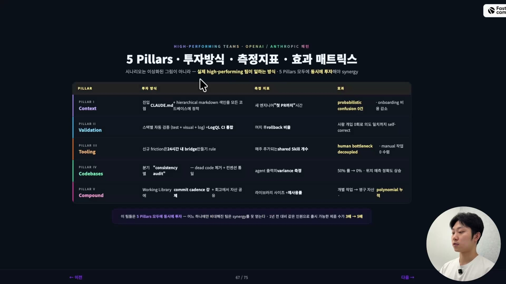
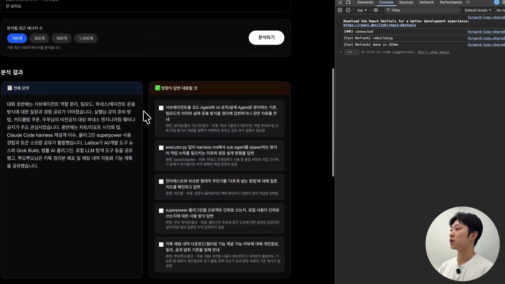
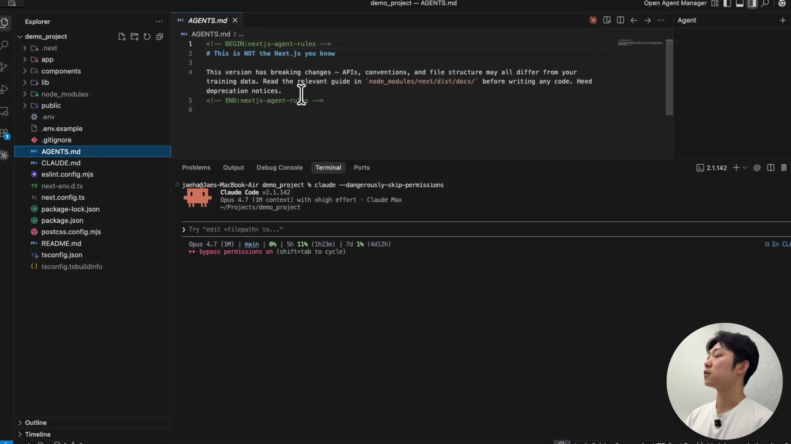
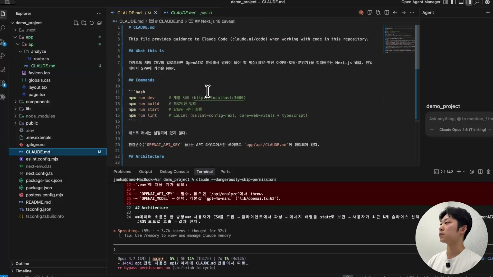
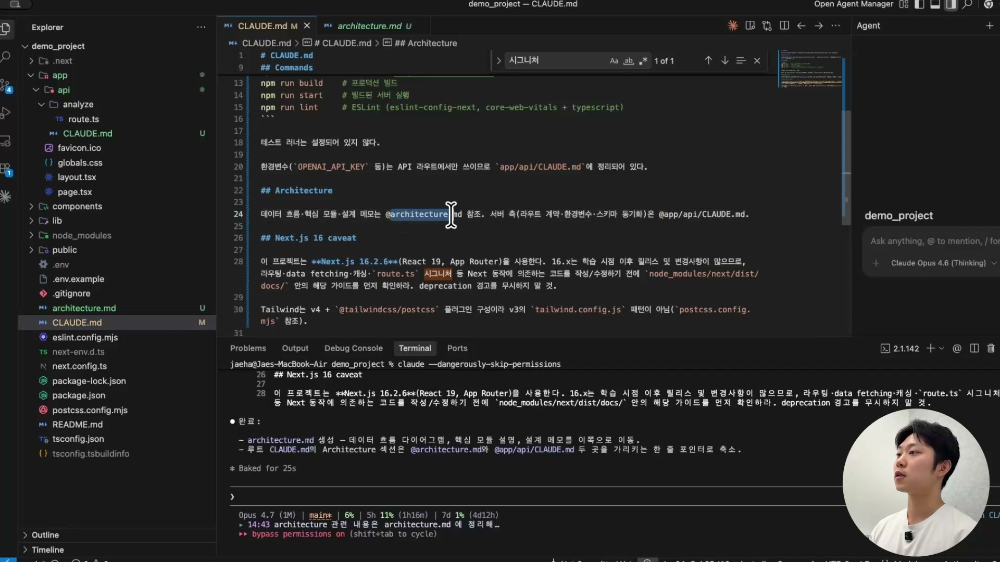
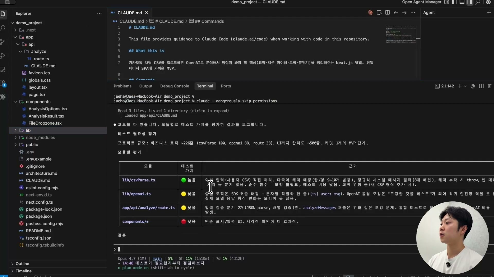
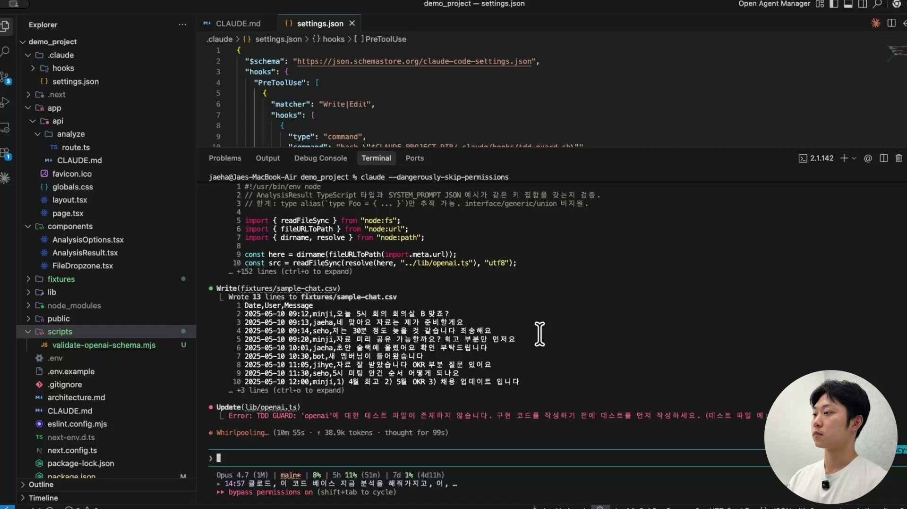
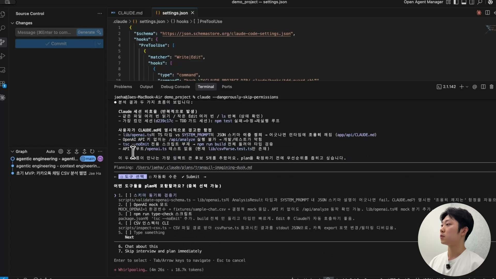
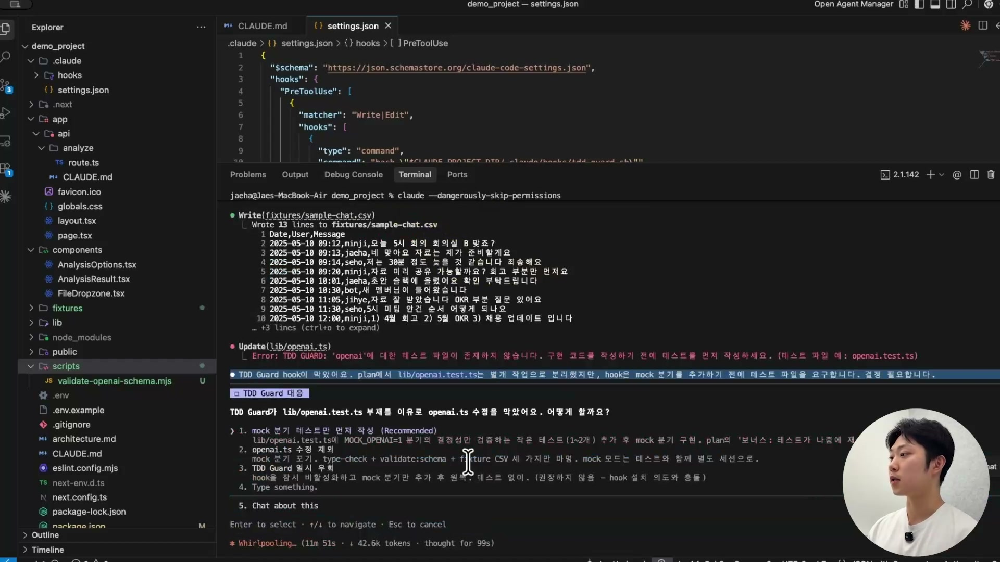
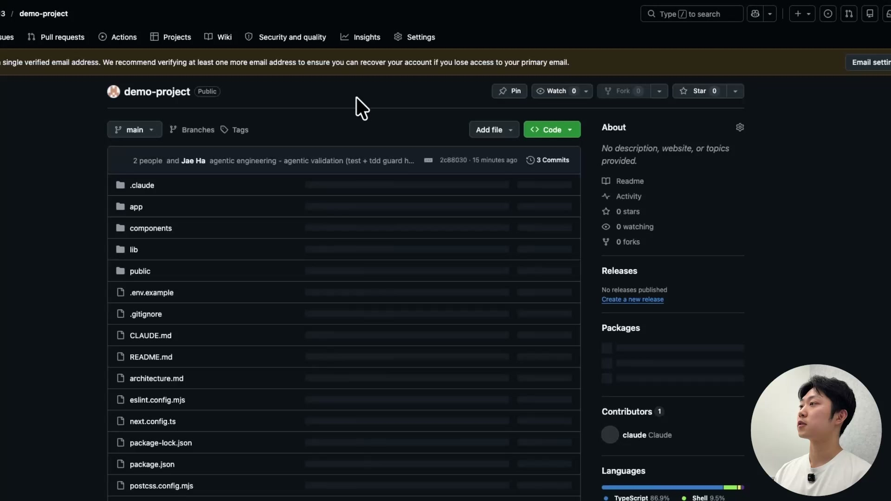

바이브 코딩으로 앱 하나를 10분 만에 만들어내는 건 이제 놀랍지 않다. 자연어로 "csv 받아서 채팅 분석해주는 앱 만들어줘"라고 던지면 클로드가 알아서 만든다. 문제는 그 다음이다. 그렇게 급히 만든 코드베이스는 대개 흐트러져 있다. 클로드가 멋대로 만들어둔 정체불명의 `AGENTS.md`가 굴러다니고, 테스트는 한 줄도 없고, 같은 작업을 시킬 때마다 에이전트가 파일을 처음부터 다시 읽는다.

이 강의는 그 흐트러진 코드베이스를 "에이전트 친화적"으로 바꾸는 과정을 보여준다. 핵심은 세 개의 기둥이다. 컨텍스트 엔지니어링, 에이전틱 밸리데이션, 에이전틱 툴링. 강의에서는 이걸 더 큰 다섯 기둥 틀 안에 놓고 설명한다.



다섯 기둥은 Context(컨텍스트), Validation(밸리데이션), Tooling(툴링), Codebases(코드베이스), Compound(컴파운드)다. 이 미니 실습에서는 앞의 세 개에 집중한다. 새로 만드는 작은 프로젝트라 정리할 코드베이스가 애초에 없고(Codebases), 1인 개발이라 팀 단위로 자산을 쌓는 컴파운드 엔지니어링은 해당되지 않기 때문이다. 코드베이스 정리는 이미 한참 굴러간 brownfield 프로젝트에서 진짜 위력을 발휘한다. 거기서는 dead code를 걷어내고 컨벤션을 하나로 통일하는 것만으로도 에이전트가 훨씬 잘 일하게 된다.

컨텍스트 엔지니어링은 에이전트에게 기억을 만들어주는 일, 에이전틱 밸리데이션은 에이전트의 결과물을 자동으로 검증하는 일, 에이전틱 툴링은 에이전트가 막히는 지점에 도구를 쥐여주는 일이다.

## 출발점: 바이브 코딩으로 만든 MVP

실습에서 만드는 앱은 단순하다. 카카오톡 오픈채팅방에서 내보낸 csv 파일을 업로드하면, OpenAI API로 그 채팅을 분석해 전체 요약, 방장이 답변할 것, 주요 토픽과 이슈, 활성 사용자, 분위기를 정리해주는 단일 페이지 웹앱이다. 데이터베이스는 없고, 프론트엔드와 API 라우트만 있다.

만드는 방식 자체가 이미 에이전트의 작동 원리를 보여준다. 플랜 모드로 요구사항을 던지면 클로드 코드는 작업을 여섯 개쯤의 태스크로 쪼갠다. CSV 파싱 라이브러리, OpenAI 호출 라이브러리, API 라우트, UI 컴포넌트 3종 같은 식이다. 그리고 각 태스크마다 Plan(계획), Execute(실행), Verify(검증) 루프를 돈다. 코드를 짜고, 타입 체크를 돌리고, 브라우저에서 페이지가 200 OK로 뜨는지까지 스스로 확인한다.



실제로 1만 9천여 행짜리 csv를 드래그앤드롭하니 시스템 메시지 3천 개를 걸러내고 분석 가능한 메시지 1만 6천 개를 인식한다. 최근 100개만 추려 분석을 돌리면 위 화면처럼 결과가 나온다. 10분에서 20분 만에 이 정도가 만들어진다. 중간에 에러가 나도 "에러가 났네"로 끝나지 않고 스스로 원인을 추론해 고친다. 자기 교정 루프(self-correction loop)다. 이 자기 교정이 되기 때문에 우리가 에이전트에게 일을 믿고 위임할 수 있는 것이다.

여기까지는 그냥 바이브 코딩이다. 진짜 이야기는 이 코드베이스에 세 기둥을 세우는 데서 시작한다.

## 컨텍스트 엔지니어링: 5분마다 기억이 리셋되는 친구에게 뇌를 만들어주기

클로드를 두고 강의에서 쓰는 비유가 정확하다. 영화 메멘토의 주인공처럼, 똑똑하지만 5분마다 기억이 리셋되는 친구다. 세션이 끝나면 이 프로젝트가 무엇이었는지, 어떤 컨벤션을 따랐는지 깡그리 잊는다. 다음 세션에서 "새 기능 만들어줘"라고 하면 코드를 처음부터 다 읽으며 다시 파악해야 한다.

그래서 기억 저장소를 만들어준다. 그게 컨텍스트 엔지니어링이고, 그 중심에 `CLAUDE.md`가 있다. 강의에서 컨텍스트 엔지니어링을 한마디로 정리한 게 인상적이다. 어렵게 생각하지 말고 "`CLAUDE.md` 하나 잘 만드는 것"만 해도 반은 먹고 들어간다는 것이다.

흥미롭게도 처음 코드베이스를 보면 클로드가 시키지도 않았는데 `AGENTS.md`와 `CLAUDE.md`를 만들어둔 상태다. 그런데 열어보면 우리가 원하는 게 아니다. "This version has breaking changes" 같은 에러를 그냥 로깅해둔 듯한 내용이고, 정작 이 프로젝트가 뭘 하는 앱인지에 대한 설명은 한 줄도 없다.



그래서 이 둘을 다 지우고 처음부터 다시 만든다. 가장 간단한 방법은 `/init` 커맨드다. 실행하면 클로드가 코드베이스를 훑어 `CLAUDE.md`를 알아서 생성한다. 이번엔 제대로다. "카카오톡 채팅 csv를 업로드하면 OpenAI로 분석해 핵심을 정리해주는 앱"이라는 설명부터, 어떤 명령으로 실행하는지, 환경 변수는 어디에 있는지까지 들어간다.

핵심은 그 다음이다. `CLAUDE.md`는 한 번 만들고 끝나는 게 아니라 코드처럼 유지보수하는 문서다. 기능이 추가되거나 수정될 때, 혹은 에이전트가 같은 실수를 반복할 때 그때그때 한 줄씩 더한다. 그러다 보면 줄이 계속 늘어난다.

### CLAUDE.md를 분산시키기

문서가 300줄을 넘어가면 루트 `CLAUDE.md` 하나에 모든 걸 담는 게 무리가 된다. 이때 해법은 책임을 파일별로 쪼개는 것이다. API 관련 내용은 `app/api/` 아래에 별도 `CLAUDE.md`를 만들어 옮기고, 루트에서는 그걸 가리키기만 한다.



작동 방식은 이렇다. 프로젝트는 항상 루트에서 시작하므로 루트 `CLAUDE.md`는 매번 읽힌다. 하지만 거기에는 "환경 변수는 `app/api/CLAUDE.md`에 정리되어 있다"는 포인터만 있을 뿐, 실제 API 작업을 시작하기 전까지는 그 하위 문서를 읽지 않는다. 필요할 때 가서 읽는다. lazy loading(필요할 때 로딩)이다.

### eager loading과 lazy loading을 가르는 기준

여기서 한 가지 표기 차이가 결정적이다. 참조 앞에 `@`를 붙이느냐다.

```markdown
데이터 흐름·핵심 모듈·설계 메모는 @architecture.md 참조.
```

`@`가 붙어 있으면 루트 `CLAUDE.md`를 읽는 순간 그 문서까지 곧바로 같이 읽는다. eager loading(항상 로딩)이다. `@`가 없으면 "`architecture.md`라는 게 있구나"라는 포인터만 들고 있다가, 정작 그 내용이 필요해질 때 비로소 읽어 컨텍스트에 올린다.



그럼 무엇에 `@`를 붙일까. 기준은 "프로젝트를 시작할 때 반드시 알아야 하는가"다. 아키텍처처럼 처음부터 알고 시작해야 품질이 좋아지는 지식은 숨기면 안 되니 `@`로 항상 읽게 한다. 반면 특정 작업을 할 때만 필요한 세부 정보는 `@`를 떼서 그때그때 불러오게 둔다. 모든 걸 항상 읽으면 컨텍스트가 금방 차고, 모든 걸 숨기면 품질이 떨어진다. 그 사이를 이 표기 하나로 조율하는 것이다.

참고로 컨텍스트 엔지니어링은 `CLAUDE.md`만이 아니다. 자주 쓰는 프롬프트를 스킬로 저장해두는 것, MCP를 붙이는 것도 다 컨텍스트 엔지니어링이다. 매번 똑같은 프롬프트를 손으로 칠 수는 없으니, 프로젝트용 프롬프트를 일관되게 저장해두고 필요할 때 꺼내 쓰는 것이다. 결국 "프롬프트를 저장하는 일"이라고 생각하면 쉽다.

## 에이전틱 밸리데이션: 검증을 시스템으로 강제하기

앞서 클로드는 시키지 않아도 타입 체크를 알아서 돌렸다. 그런데 이 "알아서"가 함정이다. 컨텍스트가 차거나 프로젝트가 커지면 에이전트는 검증을 빼먹는다. 그러니 사람이 매번 잔소리하는 대신, 빼먹을 수 없도록 시스템으로 강제해야 한다. 이게 에이전틱 밸리데이션이고, 그 첫 번째 레이어가 테스트다.

새 세션을 열고 "이 프로젝트 테스트 잘 커버되어 있는지 점검해줘"라고 플랜 모드로 물으면(읽기만 하는 작업이니 코드를 건드릴 확률을 낮추려고 플랜 모드를 쓴다) 답은 명확하다. 테스트가 하나도 없다. 그 많은 코드를 짜는 동안 테스트는 한 줄도 안 짠 것이다.

### 테스트는 다 짜는 게 답이 아니다

그렇다고 전부 테스트하는 게 정답은 아니다. 프론트엔드 컴포넌트처럼 자주 바뀌는 코드에 테스트를 빽빽하게 깔아두면, 간단한 변경 하나에 테스트가 깨지고 그 테스트를 고치느라 개발 속도가 오히려 떨어진다. 테스트가 병목이 되는 것이다. 반면 백엔드 로직이나 라이브러리처럼 안정적이고 중요한 코드는 테스트로 받쳐줘야 한다.

그래서 에이전트에게 모듈별로 테스트 가치를 평가하게 한다.



결과를 보면 판단이 명료하다. 순수 함수에 가까운 `csvParse`는 테스트 가치가 높고(초록), UI 컴포넌트는 자주 바뀌니 낮다(빨강). 클로드의 권고도 사람의 판단과 같다. MVP라 기능이 자주 바뀔 텐데 테스트를 전면으로 깔면 잘못 잡을 수 있으니, 외과적으로 가치 높은 것만 테스트하라는 것이다. 그래서 그 부분만 테스트를 추가한다. 이렇게 옵션을 골라 진행하는 행위 자체가 밸리데이션 인프라를 더하기 시작한 것이다.

### TDD Guard: 테스트 없이는 코드를 못 짜게 막기

테스트를 추가하는 데서 한 걸음 더 나아간다. TDD(테스트 주도 개발)를 훅으로 강제한다. 테스트를 먼저 쓰지 않으면 코드 작성 자체가 막히도록 만드는 것이다.

방법은 클로드 코드의 훅 설정이다. `.claude/settings.json`에 `PreToolUse` 훅을 걸어, `Write`나 `Edit`로 코드 파일을 만들려 할 때 TDD Guard 스크립트가 먼저 트리거되게 한다.

```json
{
  "hooks": {
    "PreToolUse": [
      {
        "matcher": "Write|Edit",
        "hooks": [
          { "type": "command", "command": "..." }
        ]
      }
    ]
  }
}
```

이 훅이 걸린 뒤로는 동작이 눈에 보이게 바뀐다. 스크립트를 만들려고 `openai.ts`를 작성하려 하자 곧바로 막힌다.



에러는 명확하다. "`openai.ts`에 대한 테스트 파일이 존재하지 않습니다. 구현 코드를 작성하기 전에 테스트를 먼저 작성하세요." 이제 `openai.ts`를 만들려면 `openai.test.ts`를 먼저 만들어야 한다. 검증이 인프라 레벨에서 강제되고 있다는 증거다.

강의에서 거듭 강조하는 게 이 지점이다. 검증 인프라를 가지고 있느냐 없느냐가 회사의 속도를 10배, 100배로 가른다. AI가 마음껏 날뛰되, 그 날뛰는 와중에도 안전하게 날뛸 수 있도록 만드는 게 밸리데이션이다.

## 에이전틱 툴링: 막히는 지점에 도구를 쥐여주기

마지막 기둥이다. 에이전틱 툴링은 에이전트가 무언가에 부딪히거나, 그래서 사람을 호출하게 되는 그 마찰(friction)을 없애는 일이다. 에이전트가 막힐 때마다 우리가 옆에 붙어 봐줄 수는 없으니, 막힐 일 자체를 줄여줘야 한다.

여기서 가장 똑똑한 접근은 "어떤 도구가 필요한지를 에이전트 본인에게 물어보는 것"이다. 일을 한 건 에이전트다. 어디서 막혔고, 어떤 도구를 쓰다 안 돼서 다른 도구로 돌아갔는지는 에이전트가 제일 잘 안다. 그래서 새 세션을 열고 "이 코드베이스를 분석해서, 네가 막혔거나 오래 걸렸던 세션들을 돌아보고, 어떤 스크립트나 도구를 주면 더 효율적으로 일할 수 있을지 제안해줘"라고 시킨다.

클로드는 explore 서브에이전트 두 개를 병렬로 띄워, 한쪽은 세션 로그의 비효율 패턴을, 다른 쪽은 현재 코드베이스와 스크립트 인벤토리를 동시에 분석한다. 그리고 두 흐름이 만나는 지점에서 임팩트가 큰 후보 다섯 개를 추린다.



추려진 후보가 구체적이다. 스키마 동기화 검증기(`AnalysisResult` 타입과 프롬프트 안 JSON 스키마 설명이 어긋나면 실패시키는 스크립트), API 키 없이도 동작 확인이 가능한 OpenAI mock 모드, 빌드 전체를 돌리지 않고 타입만 빠르게 검사하는 `npm run type-check` 스크립트, csv 파일을 받아 파싱 결과를 JSON으로 뱉는 CSV 인스펙터 같은 것들이다. 우리가 일일이 머리 싸맬 필요 없이, 일한 당사자가 자기에게 필요한 도구를 짚어준다.

### 마찰은 한 군데서만 풀리지 않는다

그런데 앞서 건 TDD Guard 때문에 재미있는 일이 벌어진다. 검증 스크립트를 만들려다 TDD Guard에 막혀, 클로드가 "테스트를 먼저 짤까요"라고 사람에게 결정을 요청한다.



강의는 이 멈춤 자체를 마찰로 본다. 에이전트가 사람을 불렀기 때문이다. 사람을 부르면 안 된다. 그럼 어떻게 마찰을 없앨까. 원인을 거슬러 올라가면, 플랜을 짤 때 테스트 작성이 구현 뒤 단계로 분리되어 있어서 충돌이 난 것이다. 그러니 `CLAUDE.md`에 한 줄을 더한다.

```markdown
플랜을 세울 때 테스트 작성을 구현 뒤 단계로 분리하지 마라. 항상 앞 단계로 분리해라.
```

이 한 줄이 다음부터 같은 마찰이 생길 확률을 크게 줄인다. 그리고 여기서 세 기둥이 어떻게 한 몸인지가 드러난다. `CLAUDE.md`를 고친 건 컨텍스트 엔지니어링이고, 그게 TDD Guard(밸리데이션)와 부딪힌 마찰을 풀어준 건 툴링이다. 하나를 손대니 다른 게 같이 좋아졌다. 기둥들을 따로 떼어 볼 게 아니라는 말의 의미가 이것이다. 하나만 잘해서는 작동하지 않고, 다섯 기둥이 모두 서 있을 때 비로소 시너지가 난다.

## 결과: 사람이 코드를 한 줄도 안 짠 코드베이스

세 기둥을 다 세우고 나면 커밋을 단계별로 나눠 GitHub에 올린다. 저장소의 기여자 목록을 보면 강사와 함께 `claude`가 공동 기여자로 찍혀 있다.



코드를 직접 짠 것도, 심지어 제대로 읽은 것도 없다. 그런데 MVP가 나왔고, 컨텍스트 엔지니어링과 밸리데이션과 툴링까지 입은 꽤 탄탄한 코드베이스가 됐다.

강의는 이 차이를 앞으로 바이브 코딩과 바이브 코딩이 아닌 프로젝트를 가르는 가장 큰 지표로 본다. 에이전틱 엔지니어링의 기둥들이 적용되어 있는가 아닌가. 그래서 엔지니어 면접도 바뀔 거라고 말한다. 알고리즘을 손으로 푸는 코딩 테스트는 의미가 없어진다. 코드는 AI가 짜니까. 대신 이 코드베이스의 컨텍스트 엔지니어링이 부족한 부분은 어디고 어떻게 개선할 것인지, 밸리데이션을 어떻게 더 탄탄하게 만들 것인지, 어떤 도구를 주면 에이전트 생산성이 올라갈지를 묻게 된다. 안드레이 카르파티가 말했듯, 클로드로 트위터 클론이나 슬랙 클론을 한두 시간 만에 빌드하게 한 뒤, 다른 에이전트로 그걸 공격해서 버티는 코드베이스인지를 보는 식의 면접이다.

엔지니어의 역량이 코딩에서 시스템 설계로 한 단계 올라간 것이다. 측정 단위도 바뀐다. 같은 프롬프트를 줬을 때 에이전트가 3분 걸리던 일을 2분에 끝내게 만들었다면, 그게 에이전트 생산성을 2배 올린 개선이다. 에이전트가 잘 일할 수 있는 환경을 설계하는 것, 그게 개발자의 가장 큰 역량이 된다.

마지막으로 강의가 당부하는 건 단순하다. 보는 걸로 끝내지 말 것. 카카오톡 csv 분석 앱이 아니어도 좋으니, 평소 만들고 싶던 걸 아주 작게 시작해서, 컨텍스트 · 밸리데이션 · 툴링을 한 레이어씩 직접 얹어볼 것.
