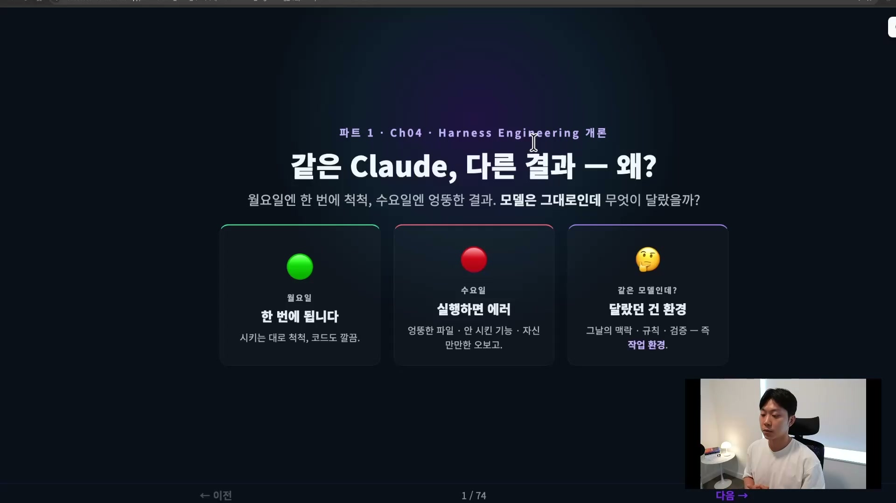
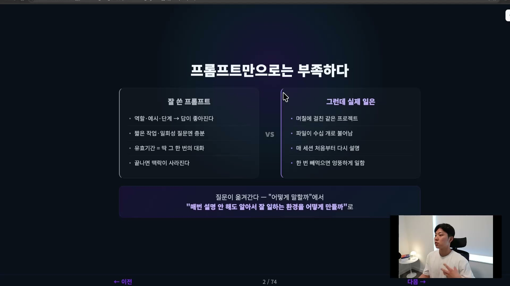
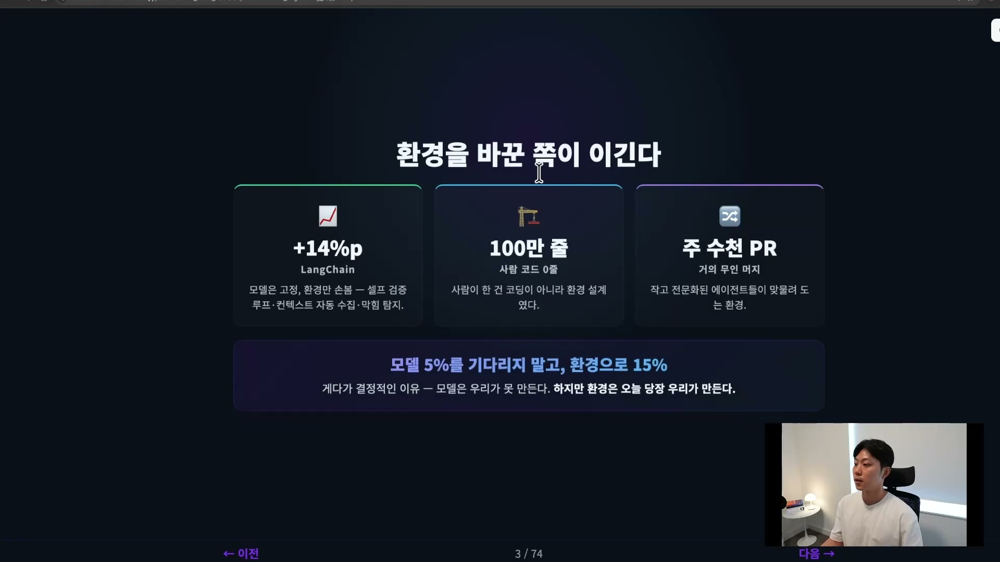
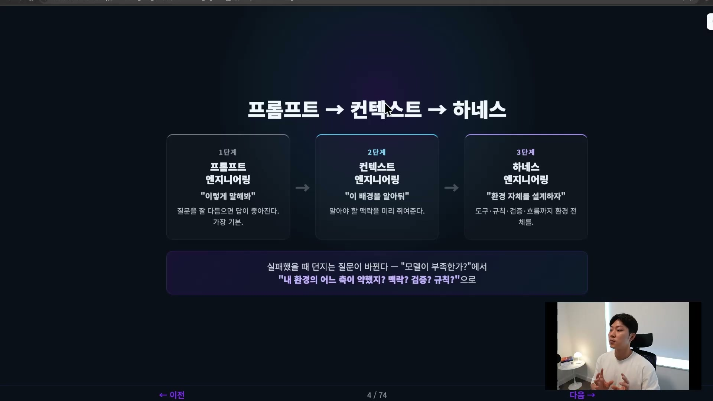
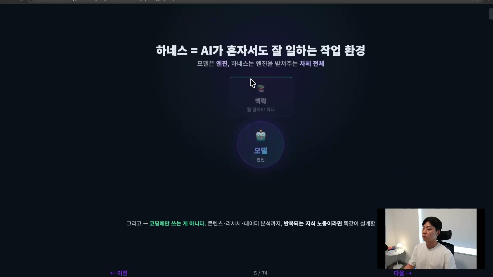
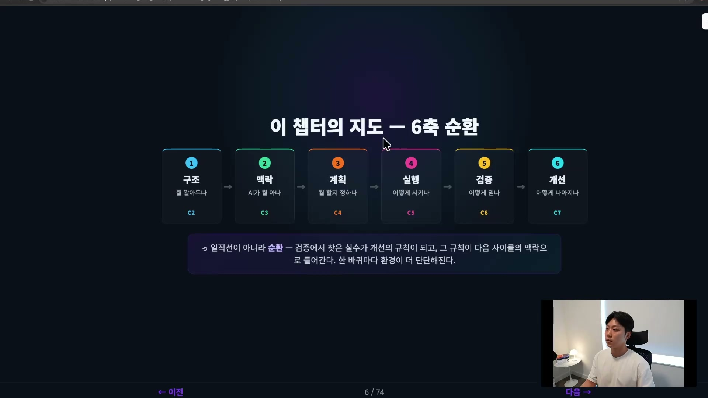

월요일에 클로드한테 일을 시켰더니 기가 막히게 해줬다. 프롬프트를 쓰니 코드도 깔끔하게 나오고, 한 번에 다 됐다. 그런데 수요일에 똑같은 모델한테 똑같은 프롬프트를 넣었더니, 갑자기 엉뚱한 파일을 건드리고 시키지도 않은 기능을 만들어 놓는다. 심지어 "다 끝냈습니다"라고 보고까지 했는데 막상 실행하면 에러가 난다. 같은 모델, 같은 프롬프트인데 왜 이렇게 다르게 동작했을까.

여기서 대부분은 모델을 탓한다. 아직 모델이 그 정도 수준까지 올라오지 않았구나, 다음 버전이 나오면 괜찮아지겠지, 그동안은 프롬프트를 더 고쳐 써야겠다. 그래서 더 크고 비싼 모델을 기다리거나 프롬프트를 깎는다. 그런데 에이전트를 현업에서 오래 굴려본 사람들의 결론은 정반대다. 문제를 모델에서 찾지 않는다. 모델이 일하는 환경을 개선해야 한다고 본다.

신입을 떠올려 보면 이해가 쉽다. 아무리 실력 좋은 신입을 뽑아도, 자료가 어디 있는지 모르고 회사 규칙도 모르고 누구한테 물어봐야 하는지도 모르는 상태로 일을 던져 놓으면 그 사람은 헤맬 수밖에 없다. 실력이 없어서가 아니라 환경이 받쳐주지 않아서다. 반대로 잘 정리된 환경에 두면, 실력이 조금 떨어지는 신입을 줘도 안정적으로 끝까지 일을 해낸다. AI도 정확히 똑같다. 월요일의 클로드와 수요일의 클로드는 같은 모델이고, 달랐던 건 그날그날의 환경, 즉 하네스(harness)다. 어떤 맥락이 깔려 있었는지, 어떤 규칙이 있었는지, 어떤 검증 장치가 있었는지에 따라 같은 모델이 다르게 동작한다. 이 환경을 설계하는 일이 바로 Harness Engineering이다.

## 프롬프트만으로는 왜 부족한가

처음 AI를 배울 때 익히는 건 보통 프롬프팅이다. 프롬프트 엔지니어링이라고도 한다. ChatGPT가 나오고 한동안은 프롬프트 작성자라는 직군이 새로 생겨서 높은 연봉을 받기도 했다. 어떻게 말하면 LLM이 더 좋은 답을 주는가, 역할을 부여하고 예시를 던지고 단계를 나눠 시키는 기술이 프롬프트 엔지니어링이었다. 이 자체는 지금도 중요하고 필요하다.

문제는 프롬프트의 유효기간이다. 잘 쓴 프롬프트는 딱 그 한 번의 대화를 좋게 만든다. 짧은 작업이나 일회성 질문에는 그걸로 충분하다. 그런데 실제 일은 그렇지 않다. 며칠에 걸쳐 같은 프로젝트를 만지고, 파일이 수십 개로 늘어나고, 어제 내린 결정을 오늘 이어가야 한다. 이때 프롬프트만으로 버티려고 하면, 매 세션마다 "우리 프로젝트는 이런 구조고, 이런 규칙을 지켜야 하고, 어제는 여기까지 이야기했고"를 처음부터 다시 설명해야 한다.

한두 번은 괜찮다. 그런데 이게 매일 반복되면 사람의 능률부터 떨어지고, AI도 자연스럽게 좋은 퍼포먼스를 내지 못한다. 게다가 한 번이라도 실수로 뭔가 빼먹은 날에는, AI가 그 맥락 없이 엉뚱하게 일을 할 수밖에 없다. 그래서 질문이 옮겨간다. "어떻게 말할까"에서 "어떻게 하면 매번 좋은 프롬프트를 던져주지 않아도 알아서 잘 일하는 환경을 만들 수 있을까"로. 한 번 잘 말하는 것에서, 잘 일하는 환경을 깔아주는 쪽으로 무게중심이 이동하는 것이다.

## 환경을 바꾼 쪽이 이긴다

환경이 중요하다는 말이 듣기 좋은 구호로 끝나면 안 되니, 실제 숫자를 보자. 사례는 세 가지다.

첫 번째는 LangChain 팀의 사례다. 어떤 코딩 벤치마크에서 모델도 고정하고 프롬프트도 고정한 채, 그 주변 환경, 즉 하네스만 손봤다. 셀프 검증 루프를 넣어 AI가 자기 결과를 다시 확인하게 하고, 필요한 컨텍스트를 자동으로 모아주고, 막혔을 때를 탐지하게 만들었다. 이렇게 하네스만 바꿔 다시 벤치마크를 돌린 결과 성능이 14%p 올랐다고 한다. 모델을 통째로 바꿔 얻는 개선이 보통 몇 퍼센트 수준인 걸 생각하면, 모델은 그대로 둔 채 얻은 이 차이는 엄청나다.

두 번째와 세 번째는 이게 일회성이 아니라는 증거다. 어떤 팀은 사람이 손으로 짠 코드가 0줄인데도 100만 줄 규모의 코드베이스를 굴린다. 사람이 한 일은 코딩이 아니라 환경 설계였다. 또 어떤 곳은 매주 수백, 수천 개의 PR을 사람의 개입 거의 없이 자동으로 머지한다. 작고 전문화된 에이전트 여러 개가 맞물려 오케스트레이션되는 환경 없이는 불가능한 규모다.

한 줄로 정리하면 이렇다. 모델이 교체돼 몇 퍼센트 좋아지기를 기다리는 것보다, 하네스를 잘 설계해 15% 그 이상을 끌어올리는 게 지금 훨씬 현실적이다. 결정적인 이유가 하나 더 있다. 모델은 우리가 만들지 못한다. 매일 대여료를 내고 쓰는 블랙박스에 가깝고, 그건 모델 회사의 몫이다. 반면 환경은 우리가 오늘 당장 만들고 개선할 수 있다. 통제권이 우리한테 있는 영역이라는 점이 중요하다.

## 프롬프트에서 컨텍스트로, 다시 하네스로

이 흐름은 크게 세 단계로 볼 수 있다.

첫 번째는 프롬프트 엔지니어링이다. "이렇게 말해봐", 질문을 잘 다듬으면 답이 좋아진다는 게 핵심이다. 가장 기본이고 다들 여기서 시작한다. 그런데 아무리 프롬프트를 잘 깎아도 맥락이 없으면 AI가 좋은 퍼포먼스를 내지 못한다는 걸 모두가 깨달으면서 두 번째, 컨텍스트 엔지니어링으로 넘어간다. 프로젝트 구조나 지난 결정 같은 맥락을 미리 깔아 두고 매번 AI가 읽게 하면, AI가 상황을 이해하고 더 잘한다. 매번 프롬프트를 다듬는 대신 맥락을 먼저 쥐어주는 쪽으로 옮겨간 것이다.

세 번째가 하네스 엔지니어링이다. 환경 자체를 설계하자는 것이다. 맥락뿐 아니라 어떤 도구를 쥐어주는지, 어떤 규칙을 정하는지, 어떻게 검증 루프와 작업 흐름을 만드는지, 그런 오케스트레이션 레이어까지 설계한다. 앞의 LangChain 사례가 보여줬듯 모델도 프롬프트도 같았지만 하네스를 바꾸니 퍼포먼스가 드라마틱하게 좋아졌다. 일일이 챙기지 않아도 AI가 혼자 알아서 잘 돌아가는 환경을 내가 만들 수 있게 된다.

여기서 가장 중요한 변화는 실패했을 때 던지는 질문이 바뀐다는 점이다. 1단계에서는 "내가 프롬프트를 잘못 썼나?"라고 묻는다. 그래도 안 되면 "모델이 잘못하고 있나?"로 넘어간다. 3단계에 오면 질문이 "내 하네스의 어느 부분이 부족했는가"로 바뀐다. 맥락이 부족했나, 검증 루프가 약했나, 규칙을 안 써뒀나. 이 질문으로 넘어오는 순간, 우리가 통제권을 가지고 고칠 수 있는 구체적인 지점을 손에 쥐게 된다.

## 하네스를 한 문장으로

Harness Engineering을 한 문장으로 정의하면, AI가 혼자서도 잘 일할 수 있는 작업 환경을 만들어 주는 일이다. 이 작업 환경은 크게 네 가지를 포함한다.

- **맥락(컨텍스트)**: AI가 무엇을 알아야 하는지. 우리 프로젝트의 스택은 뭐고 컨벤션은 뭔지.
- **제한**: 무엇을 하면 안 되는지. 메인 브랜치에 함부로 푸시하지 마라, 이 폴더는 건드리지 마라 같은 것.
- **작업 흐름(오케스트레이션 레이어)**: 어떤 순서로 일하는지. 계획을 먼저 세우고 실행하고 검증하는 루프도 하네스로 커스터마이즈한다.
- **검증**: AI가 이 작업을 잘 끝냈는지 못 끝냈는지 확인하는 일. 테스트를 돌리고 다른 에이전트가 리뷰하게 만드는 게 하네스의 일부다.

이 네 가지가 모델을 한가운데 두고 빙 둘러싼다. 모델은 엔진이고, 하네스는 그 엔진이 제대로 굴러가게 받쳐주는 차체 전체다. 그중에서도 검증이 가장 중요하다. "다 끝냈습니다"라는 보고가 진짜인지 가짜인지를 가르는 게 결국 검증 장치이기 때문이다.

하나 더, 하네스는 코딩에만 국한된 엔지니어링이 아니다. 강의에서는 유튜브 콘텐츠 제작, 회사나 학교의 리서치, 데이터 분석처럼 반복되는 지식 노동이라면 똑같은 방식으로 환경을 설계할 수 있다고 말한다. 요즘은 웹툰도 이 하네스를 세팅해서 만든다고 한다. 그래서 "이건 개발자만의 얘기구나"라고 접어 두기보다, 반복되는 일을 가진 사람이라면 누구에게나 적용되는 틀로 보는 게 맞다.

## 환경을 설계한다는 건 무엇을 한다는 것인가, 6개의 축

환경을 설계한다는 게 구체적으로 뭘 한다는 걸까. 이걸 여섯 개의 축으로 나눌 수 있다. 이 여섯이 챕터 전체의 지도다.

1. **구조**: 환경을 어떻게 세팅하느냐. 폴더 구성, 도구 배치, 경계 설정처럼 하네스의 뼈대를 먼저 잡는다.
2. **맥락**: AI가 무엇을 아는가. 설정 파일과 규칙을 넣어준다.
3. **계획**: 이 하네스가 어떤 일을 실행해야 하는지, LLM이 무엇을 해야 하는지를 하네스를 통해 계획으로 만든다.
4. **실행**: 어떻게 일을 시킬지 정한다. 서브 에이전트 패턴을 쓸지, 에이전트 팀 패턴을 쓸지, 둘을 섞을지를 하네스가 자체적으로 정할 수 있어야 한다.
5. **검증**: 결과를 어떻게 테스트하고, 그 결과를 어떻게 믿을 수 있는가.
6. **개선**: 하네스는 한 번 만든다고 끝이 아니다. 처음 만들면 아주 잘 안 된다. 프로토타입이라고 생각하고, 계속 개선해 내가 원하는 환경에 맞게 다듬어 가는 게 핵심이다.

여기서 꼭 기억할 게 있다. 이 여섯은 일직선이 아니라 순환이다. 구조를 깔고, 맥락을 주고, 계획하고, 실행해서, 검증한다. 그리고 그걸 토대로 개선하는데, 그 개선이 다시 구조와 맥락, 계획이나 실행을 바꾼다. 한 바퀴 돌 때마다 모델이 아니라 환경이 조금 더 똑똑해진다.

예를 들어 검증에서 자꾸 같은 실수가 반복된다는 걸 발견하면, 그걸 개선 단계에서 규칙으로 만든다. 그 규칙이 다음 사이클의 맥락으로 들어가면서 하네스가 점점 단단해지고 고도화된다. 이게 모델은 똑같은데 더 좋은 결과가 나오는 이유다.

그래서 무엇을 배우든 머릿속에 하나만 계속 떠올리면 된다. 내 프로젝트라면 이 여섯 축 중에서 지금 어디가 비어 있는가. 구조가 없는지, 맥락 관리를 안 하고 있었는지, 검증을 그냥 AI한테 맡기고 있었는지. 그 빈칸을 찾는 게 하네스 엔지니어링의 출발점이다.
