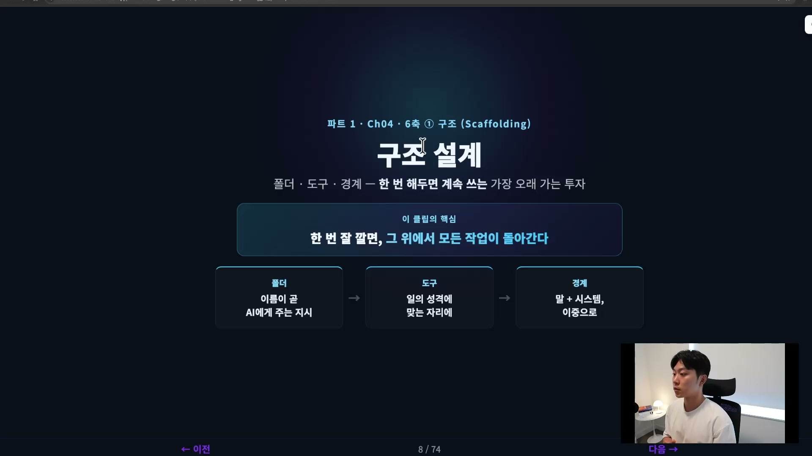
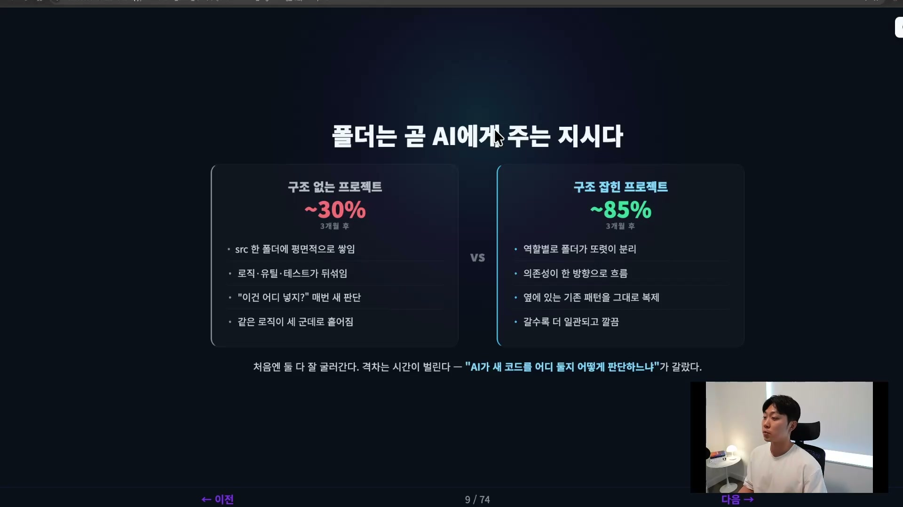
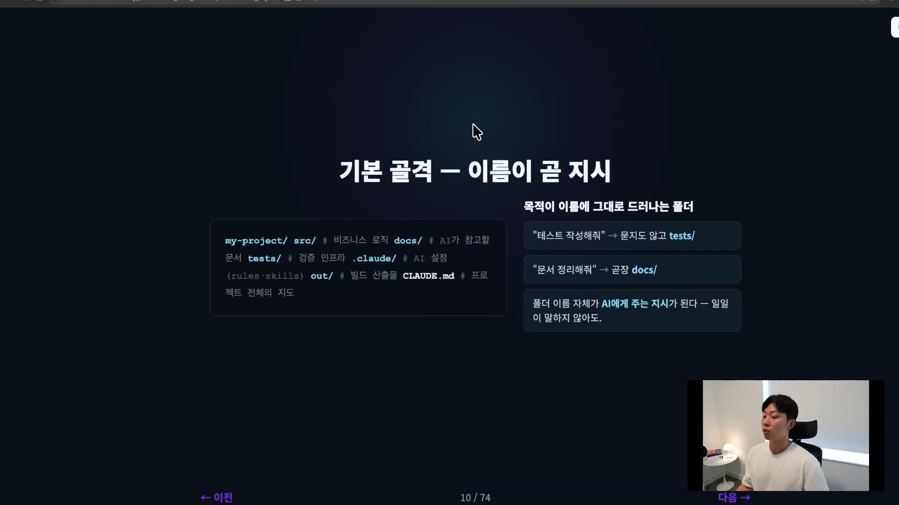
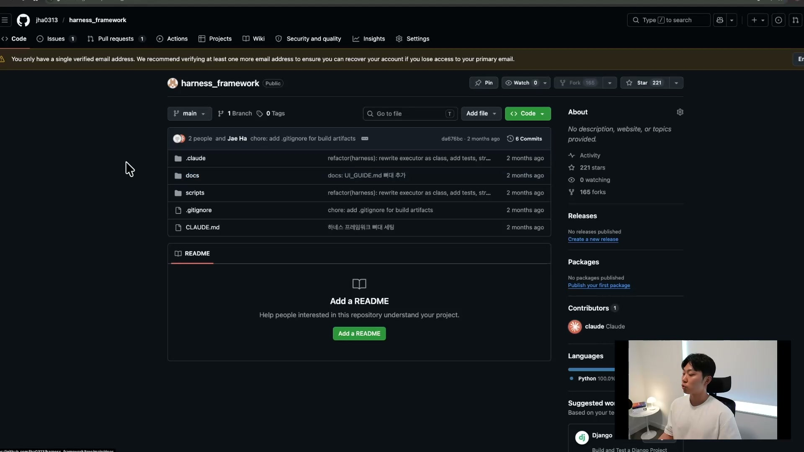
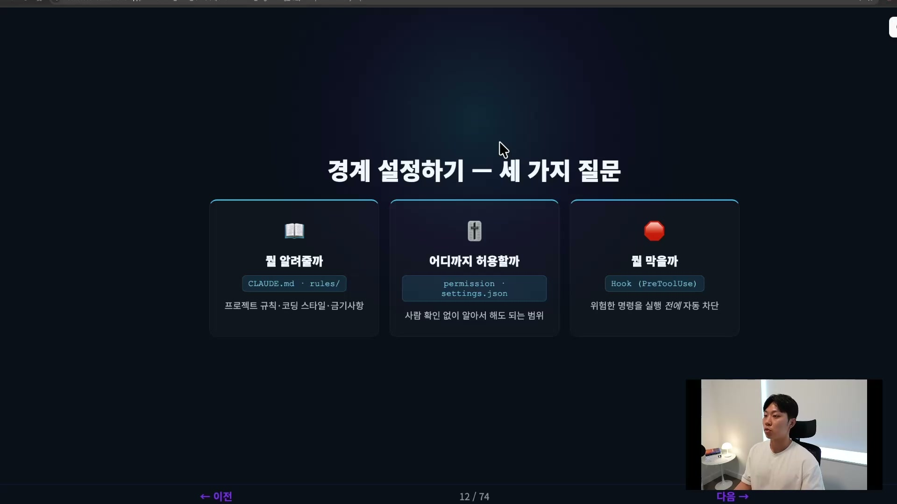
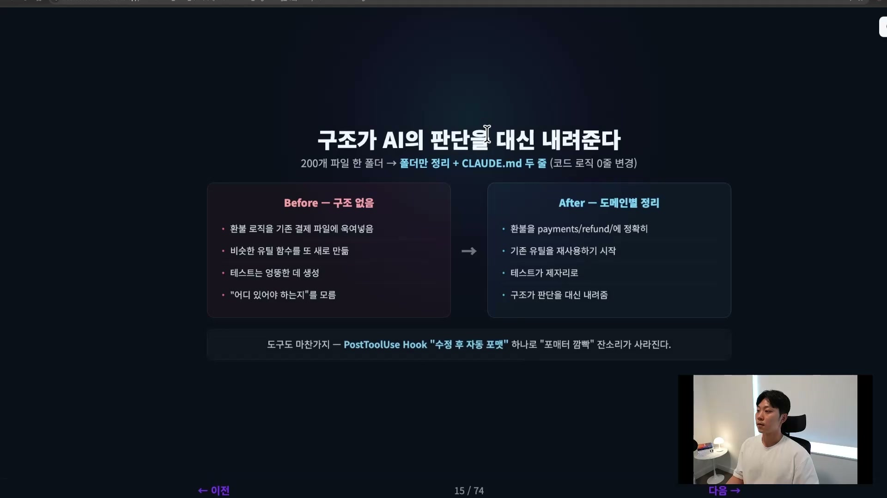

하네스 엔지니어링에는 챙겨야 할 축이 여섯 개 있다. 그중 맨 처음에 놓이는 게 구조다. 구조라고 하면 거창하게 들리지만, 실제로 정하는 건 세 가지뿐이다. 폴더를 어떻게 나눌지, 도구를 어디에 둘지, 그리고 어디는 손대면 안 되는지. 이게 전부다.



이 셋에는 공통점이 하나 있다. 한 번 잘해두면 그 뒤로 계속 쓴다는 것. 맥락이나 계획 같은 다른 축은 작업이 바뀔 때마다 조금씩 손봐야 한다. 오늘 만드는 기능이 어제와 다르면 줄 맥락도 달라지니까. 그런데 구조는 처음에 한 번 깔아두면 그 위에서 모든 작업이 돌아간다. 그래서 투자 대비 효과가 가장 오래가는 축이고, 가장 먼저 챙겨야 하는 축이다. 토대가 부실하면 그 위에 뭘 쌓아도 흔들린다.

## 폴더, 이름이 곧 AI에게 주는 지시

폴더 구조는 사소해 보인다. 폴더 좀 나누는 게 무슨 대수냐 싶다. 그런데 시간이 지날수록 결과를 가장 크게 가르는 게 이 부분이다.

두 프로젝트를 비교해 보자. 한쪽은 파일이 전부 `src` 폴더 하나에 평면적으로 쌓여 있다. 비즈니스 로직과 잡다한 유틸이 한데 섞여 있고, 테스트는 아무렇게나 흩어져 있다. 다른 한쪽은 역할별로 폴더가 뚜렷이 나뉘어 있다. 도메인은 도메인대로, 서비스는 서비스 레이어대로, 인프라는 인프라대로 분리되어 있고, 의존성이 한 방향으로 흐른다.

처음에는 둘 다 굴러간다. 차이가 안 보인다. 그런데 며칠만 지나도, 한 달 두 달 지나면서 격차가 크게 벌어진다. 눈덩이처럼 점점 불어난다.



왜 그럴까. 핵심은 AI가 새 코드를 어디 둘지 어떻게 판단하느냐는 질문이다. 구조가 없는 쪽에서 AI는 매번 "이건 어디 놓지"를 새로 고민하고, 그때그때 다른 결정을 내린다. 그러다 보면 비슷한 로직이 세 군데에 흩어지고, 일관성이 결국 무너진다. 반대로 구조가 잡힌 쪽에서 AI는 옆에 있는 기존 패턴을 그대로 복제한다. 결제 모듈이 이렇게 생겼으니 정산 모듈도 같은 인터페이스, 같은 모양, 같은 구조로 만들어야겠다고 판단하는 식이다. 그래서 시간이 갈수록 오히려 더 일관되고 깔끔해진다. 강의에서 든 수치로는, 3개월 뒤 한쪽은 효율성 30퍼센트 언저리에서 헤매고 다른 쪽은 85퍼센트까지 올라간다.

그럼 어떤 골격을 권할까. 사실 정답은 프로젝트마다 다 다를 수 있다. 다만 기본형은 이렇게 잡는다.



```
my-project/
  src/         # 비즈니스 로직, 코드
  docs/        # AI가 참고할 문서 (PRD, 아키텍처 등)
  tests/       # 테스트, 검증 인프라
  .claude/     # AI 설정 (rules, skills)
  out/         # 빌드 산출물
  CLAUDE.md    # 프로젝트 전체 지도
```

`src`에는 비즈니스 로직 같은 코드가 들어간다. `docs`에는 AI가 참고할 문서가 다 들어간다. PRD나 아키텍처 문서 같은 것들이다. `tests`에는 테스트와 검증 인프라가, `.claude`에는 AI 설정이 들어간다. 클로드면 `.claude`, 코덱스면 `.codex` 식으로 도구에 맞는 이름을 쓰고 그 안에 rules나 skills를 둔다. 빌드 산출물은 `out`으로, 그리고 프로젝트 전체의 지도 역할을 하는 `CLAUDE.md`를 루트에 둔다.

말로만 보면 실감이 안 날 수 있는데, 실제 레포에서는 이 골격이 이렇게 구현된다.



클로드는 `.claude`로, 문서는 `docs`로, 스크립트는 `scripts`로 모여 있다. 여기에 작업을 진행하면서 파일을 점점 쌓아 올리게 된다.

핵심은 하나다. 목적이 이름에 그대로 드러나는 폴더여야 한다. 이렇게 해두면 신기한 일이 벌어진다. AI에게 "테스트 작성해줘" 하면 묻지도 않고 `tests`로 가서 작성하고, "문서 정리해줘" 하면 곧장 `docs`로 간다. 폴더 이름 자체가 AI에게 주어지는 지시가 되는 것이다. 테스트는 여기 넣으라고 일일이 말하지 않아도, 구조가 그걸 대신 말해준다.

## 도구, 일의 성격에 맞는 자리에

구조의 두 번째는 도구 배치다. 클로드 코드에는 다섯 종류의 부품이 있다고 볼 수 있다.


이름을 외울 필요는 없다. 중요한 건 어떤 일을 어디에 맡길지에 대한 감각이다. 다섯을 일의 성격으로 나눠 보면 이렇다.

| 부품 | 성격 | 맡기는 일 |
| --- | --- | --- |
| Skill | 반복 작업 | `/commit`, `/code review`처럼 늘 같은 순서로 하는 작업을 한 명령으로 굳힌다 |
| Hook | 자동 규칙 | 작업 전 차단, 작업 후 검사, 멈출 때 끼어들기, 알림 보내기처럼 자동으로 지켜져야 할 규칙 |
| Agent | 일손 추가 | 코드리뷰, 리서치 등을 서브 에이전트로 쪼개 파견한다 |
| MCP | 바깥 연결 | DB, 메신저, 이슈 트래커 같은 바깥 세계와 AI를 잇는다 |
| Plugin | 묶어 배포 | Skill, Hook 묶음을 팀 단위로 한 번에 공유한다 |

반복되는 일은 스킬에 넣는 게 좋다. 자주 쓰는 작업을 스킬로 만들어 두면 "이 작업은 늘 이 순서대로 한다"가 명령 하나로 고정된다. 자동으로 지켜져야 할 규칙은 훅으로 건다. 일을 쪼개 여러 일손에 나누고 싶으면 에이전트로 파견한다. 바깥 세계와 연결할 때는 MCP, 그리고 이 모든 걸 하나로 묶어 팀과 공유하는 게 플러그인이다.

여기서 한 가지 알아둘 게 있다. 클로드 코드 자체가 이미 하네스다. 즉 이 다섯 부품은 우리가 새로 발명하는 게 아니라, 클로드 안에 이미 구조화되어 배치되어 있는 것들이다. 외우기보다, "일의 성격에 맞는 자리에 도구를 건다"는 감각만 가지면 된다. 그 배치 자체가 곧 구조 설계다.

## 경계, AI가 어디까지 할 수 있는가

구조의 마지막은 경계다. AI가 무엇을 알고, 어디까지 할 수 있고, 무엇을 하면 안 되는지를 정하는 일이다. 어떻게 보면 맥락과도 비슷한데, 세 개의 질문으로 나뉜다.



**뭘 알려줄까.** `CLAUDE.md`와 rules에 적는 내용이다. 프로젝트 규칙, 코딩 스타일, 자주 실패하는 패턴 같은 것을 적어준다.

**어디까지 허용할까.** 퍼미션 모드와 `settings.json`으로 정한다. 사람 확인 없이 AI가 알아서 해도 되는 범위를 여기서 긋는다.

**뭘 막을까.** 훅으로 막는다. 위험한 명령을 실행하기 전에 자동으로 차단하는 식이다.

여기서 중요한 원칙이 있다. 좋은 경계는 겹쳐서 친다. 말로 한 번 해주고, 시스템으로 또 한 번 해준다.


예를 들어 `CLAUDE.md`에 "main 브랜치에 직접 push 금지"라고 적어둔다. 그런데 이건 말 그대로 제한일 뿐이라, 클로드 코드가 지키지 않을 확률이 있다. 긴 작업 중에는 깜빡할 수 있다. 그래서 동시에 훅에도 이런 위험한 커맨드(`rm -rf`, `push --force` 같은)를 적어 두고 강제화한다. 시스템 레벨로 막아두면 시스템은 절대 깜빡하지 않는다. 말로 의도를 전달하고, 시스템으로 사고를 물리적으로 차단하는 이중 레이어다.

## 자주 하는 실수 두 가지

구조 설계에서 자주 보는 실수가 둘 있다.

첫째는 구조 없이 일단 시작하는 것이다. "나중에 정리하지" 하고 평면적으로 쌓다가, AI가 일관성을 잃기 시작할 때쯤이면 이미 정리가 큰일이 된다. 정리하다가 버그가 많이 생기기도 한다.

둘째는 경계를 치지 않고 클로드 코드에 모든 걸 다 맡기는 것이다. 권한을 다 열어두면 빠르고 귀찮지 않아서 일이 더 잘 진행되는 느낌이 든다. 그런데 한 번 실수가 일어나면 돌이킬 수 없는 사고가 된다. 자율성은 경계와 짝으로 이어져야 한다.

더 와닿게 강의에서 든 사례가 있다. 어떤 프로젝트는 파일이 200개 넘게 한 폴더에 쌓여 있었다. AI에게 기능을 추가해 달라고 했더니 잘 못했다. 테스트를 엉뚱한 데 만들고, 유틸 파일도 엉뚱한 데 만들었다.



이건 AI가 못해서가 아니다. 이게 어디 있어야 하는지 알려주는 구조가 없었기 때문이다. 폴더만 도메인별로 간단히 정리하니까(코드 로직은 한 줄도 안 바꾸고 폴더만 정리하고 `CLAUDE.md` 두 줄을 더한 것뿐인데) AI가 그제서야 환불 로직을 `payments/refund/`에 정확히 놓고, 기존 유틸을 재사용하기 시작했다. 구조가 AI의 판단을 대신 내려준 것이다.

도구 배치도 마찬가지다. 어떤 팀은 코드를 고치고 나서 포매터와 린트를 항상 돌리지는 않는다는 문제가 있었다. 그걸 PostToolUse 훅으로, 즉 "수정 후 자동 포맷"으로 걸었더니 매번 빠짐없이 하더라는 것이다. 사람의 습관을 탓할 게 아니라 환경을 바꿔주면 된다. 모델을 탓하면 안 된다.

## 정리

구조 설계는 세 줄로 압축된다.

- **폴더**는 이름이 곧 지시가 되게 짠다.
- **도구**는 일의 성격에 맞는 자리에 건다.
- **경계**는 말과 시스템으로 겹쳐서 친다.

셋 다 해두면 한 번 깔고 계속 쓰는, 가장 오래 가는 투자가 된다. 다만 구조를 아무리 잘 깔아놔도, 일할 AI가 오늘 뭘 만드는지 어떤 규칙을 지켜야 하는지 모르면 소용이 없다. 그래서 다음 축은 맥락 설계로 이어진다.
