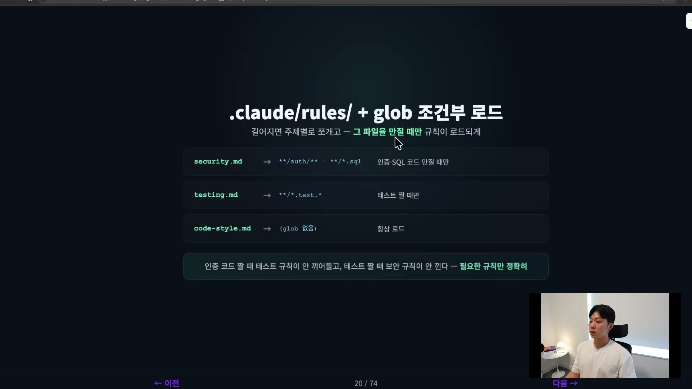
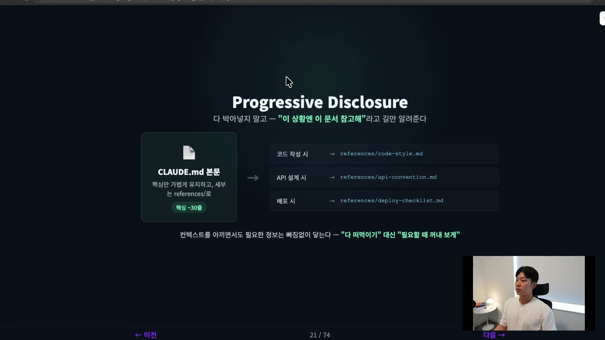

구조를 깔았으면, 그 구조 안에서 AI가 무엇을 알고 일할지를 정해야 한다. 이게 맥락 설계다.

여기서 가장 먼저 깨야 할 직관이 하나 있다. 맥락은 많이 줄수록 좋다는 생각이다. 다 알려주면 더 잘하겠지 싶지만, 실제로는 정반대다. 너무 많이 주면 AI가 오히려 헷갈린다. 강의에서는 이걸 모래사장에서 바늘 찾기에 빗댄다. 천 페이지짜리 자료를 던져주고 신입에게 일을 시키는 것과, 한두 페이지만 주고 시키는 것 중 어느 쪽이 더 잘할지는 답이 정해져 있다. 정작 지금 중요한 정보가 잡다한 정보 사이에 묻혀버리기 때문이다.

그래서 맥락 설계의 진짜 질문은 "얼마나 많이 주느냐"가 아니라 "무엇을, 언제, 적재적소에 주느냐"다.

맥락 설계의 답은 네 갈래다. 설정 파일은 세 겹으로 상속된다는 것, CLAUDE.md는 핵심만 가볍게 둔다는 것, 두꺼운 규칙은 분리해 필요할 때만 읽게 한다는 것, 그리고 세션에 쌓이는 맥락은 주기적으로 비운다는 것이다. 하나씩 본다.

## 설정은 세 겹으로 상속된다

클로드 코드의 설정 파일은 세 층으로 상속된다. 회사 규칙에 비유하면 이해가 빠르다. 전사 규칙이 있고, 그 아래 팀 규칙이 있고, 특정 업무에만 적용되는 세부 규칙이 있다. CLAUDE.md도 똑같이 세 층이다.

맨 위는 유저 레벨이다. `~/.claude/CLAUDE.md`에 두는 내용으로, 내 모든 프로젝트의 모든 세션에 공통으로 적용된다. 내 작업 습관이나 선호하는 스타일처럼, 프로젝트와 상관없이 "나"에게 묶이는 정보를 여기 적는다.

그 아래가 프로젝트 레벨이다. `project/CLAUDE.md`에는 그 프로젝트의 기술 스택, 컨벤션, 제약 같은 것을 적는다. 팀과 공유하는 규칙이라 보통 Git에 커밋한다.

마지막은 폴더 레벨이다. 프로젝트 폴더 안의 특정 폴더, 예를 들어 API나 데이터베이스 폴더 안에 또 CLAUDE.md를 둘 수 있다. 이건 그 폴더에서 작업할 때만 로드된다. 데이터베이스에만 적용되는 특수 규칙이 있다면 데이터베이스 폴더 아래 CLAUDE.md에 넣는 식이다.

규칙은 딱 하나다. 아래로 갈수록 범위가 좁고, 우선순위가 높다. 위층 규칙과 아래층 규칙이 충돌하면 항상 아래에 있는, 더 가까운 규칙이 이긴다. 유저 레벨에 "camelCase로 써라"가 있고 프로젝트 레벨에 "snake_case로 써라"가 있으면, 그 프로젝트 안에서는 snake_case가 유저 설정을 덮어쓴다.

## CLAUDE.md는 절대 크면 안 된다

각 층에 뭘 적는지는 정리됐다. 유저 레벨엔 습관, 프로젝트 레벨엔 그 프로젝트의 스택과 제약, 폴더 레벨엔 그 모듈만의 특수 규칙이다. 예를 들어 결제 서비스 프로젝트라면 프로젝트 CLAUDE.md에 "기술 스택은 Next.js, 아키텍처 규칙은 이렇게, 크리티컬 API는 하드코딩 금지" 같은 걸 적는다.

그런데 여기서 가장 중요한 원칙이 나온다. 200줄 안팎으로 유지해야 한다.

이유는 CLAUDE.md가 모든 세션마다 통째로 읽히기 때문이다. 매번 입력 토큰으로 들어간다. 캐싱 덕분에 비용은 그나마 괜찮지만, 문제는 비용이 아니다. 여기에 온갖 걸 다 우겨넣으면 정작 진짜 중요한 핵심 규칙을 클로드가 읽지 못할 확률이 높아진다. 앞에서 말한 모래사장의 바늘이 그대로 재현되는 것이다. 다 욱여넣을수록 오히려 AI 성능이 나빠진다. 많이 주는 게 좋은 게 아니라는 말이 여기서 다시 확인된다.

## 길어지면 분리한다: Progressive Disclosure

그럼 CLAUDE.md에 담고 싶은 게 200줄을 넘으면 어떻게 하나. 분리한다. `.claude` 폴더 안의 `rules` 폴더를 쓴다. 이건 클로드 공식 문서에도 나와 있는 방식이다.

rules 폴더 안에 세부 문서를 주제별로 만든다. 코딩 스타일은 `code-style.md`, 테스팅은 `testing.md`, 보안은 `security.md`, 데이터베이스는 `database.md` 식으로 쪼갠다. 그리고 핵심은, 그 주제의 파일을 만질 때만 해당 규칙이 로드되게 만드는 것이다. glob 패턴으로 조건을 건다.

`security.md`에 `**/auth/**`와 `**/*.sql` 같은 glob을 걸어두면 인증이나 SQL 코드를 만질 때만 그 규칙이 들어온다. `testing.md`에 `**/*.test.*`를 걸면 테스트를 짤 때만 로드된다. glob을 안 걸면 항상 로드된다. 인증 코드를 짤 때 테스트 규칙이 끼어들지 않고, 테스트를 짤 때 보안 규칙이 끼어들지 않는다. 필요한 규칙만 정확히 들어오는 것이다.

이걸 Progressive Disclosure라고 한다. 모든 걸 미리 떠먹여주는 대신, "이 상황엔 이 문서를 참고해"라고 길만 알려주는 방식이다.

실질적인 CLAUDE.md 본문은 아주 가볍게, 핵심 30줄 정도로 유지한다. 코드 작성할 때는 `references/code-style.md`, API 설계할 때는 `references/api-convention.md`, 배포할 때는 `references/deploy-checklist.md`를 보라고 가리키기만 한다. 책장에 책을 꽂아두는 것과 같다. AI는 그때 하는 일에 맞는 책을 그때 가서 골라 읽는다. 컨텍스트를 아끼면서도 필요한 정보는 빠짐없이 닿는다.

## 쌓인 맥락은 비운다

여기까지는 파일로 깔아두는 맥락이었다. 그런데 작업하는 동안 대화창에 쌓이는 맥락도 관리해야 한다. 이쪽이 흔히 말하는 컨텍스트 엔지니어링, 컨텍스트 관리다.

대화창의 컨텍스트가 많이 차는 걸 항상 두려워해야 한다. 강의에서 제시하는 기준은 이렇다. 20%까지는 보통 괜찮다. 그런데 30%, 40%를 넘어가기 시작하면 새 세션을 시작하거나 핸드오프로 다른 세션에서 작업하는 걸 추천한다. 50%를 넘어간 이후의 작업은 전부 쓸모없다고 생각해야 한다. AI 성능이 그만큼 떨어진 상태라 코드도 아웃풋도 품질이 나빠질 확률이 너무 높기 때문이다. 강사 본인도 50% 이후에 한 작업은 정말 쓰지 못할 때가 너무 많았다고 한다.

그럼 컨텍스트를 어떻게 비우나. 클로드는 두 가지 커맨드를 준다. `/clear`는 컨텍스트를 0%로 완전히 초기화하고, `/compact`는 지금까지의 대화를 요약해 압축한다.

다만 강의에서는 둘 다 거의 안 쓴다고 한다. `/clear` 할 일이 있으면 그냥 세션을 껐다 다시 켜고, `/compact` 할 일이 있으면 애초에 압축하지 않고 다른 세션으로 시작한다는 것이다. 캐시 때문에 `/clear`와 `/compact`가 더 낫다는 의견도 있지만 그건 잘 모르겠다고 덧붙인다. 대신 중요한 세션이면 포크로 복제하거나, 핸드오프로 어디까지 했고 다음에 뭘 할지를 파일에 남겨 새 세션이 그대로 이어받게 한다.

방법이 무엇이든 원칙은 같다. 20%, 30%, 40%가 되면 미련 없이 새로 시작하는 게 낫다. 컨텍스트는 채우는 것만큼 비우는 게 중요하다. 책상이 꽉 차면 일을 못 하는 것과 같다.

## 비웠으면 점검한다

비우는 것과 짝을 이루는 게 점검이다. 지금 컨텍스트가 얼마나 찼는지는 `/context`로 확인할 수 있다. 하지만 매번 명령어를 칠 수는 없으니, 제일 좋은 건 스테이터스 라인을 켜서 컨텍스트를 퍼센트로 항상 보이게 해두는 것이다. 퍼센트로 안 보면 지금 얼마나 찼는지 감이 안 오니, 계속 띄워놓고 체크하면서 작업하는 걸 추천한다.

점검 대상엔 스킬과 MCP도 포함된다. 강의에서는 스킬 쪽은 잘 모르겠지만 MCP가 은근히 컨텍스트를 많이 먹는 경향이 있다고 한다. 최근 클로드가 MCP를 그때그때 로드되게 바꾼 것 같긴 하지만, 필요 없는 스킬과 MCP가 너무 많이 깔린 프로젝트가 흔하다. 한 번씩 클린하게 비워주는 게 좋다. 스킬을 자주 안 쓴다면 안 쓰는 거나 마찬가지이니, 그런 건 과감히 없앤다. 주기적으로 비우고 점검하는 것, 일종의 하네스 건강검진이라고 할 수 있다.

## 안티패턴: "중요하니까 일단 CLAUDE.md에"

지금까지의 원칙을 거꾸로 뒤집으면 가장 흔한 실수가 보인다. "이거 중요하니까 일단 CLAUDE.md에 넣어두자"는 습관이다.

이렇게 하나씩 쌓다 보면 비대해진 CLAUDE.md 안에 서로 모순되는 규칙이 끼어든다. 위쪽엔 "주석은 영어로", 아래쪽엔 "주석은 한글로" 같은 식이다. AI 입장에선 둘 다 진실인 지시가 충돌하니 그때그때 다르게 행동한다. 길어질수록 앞뒤가 흐려진다.

그래서 규칙을 추가할 때마다 한 번씩 물어야 한다. "이게 항상 필요한가, 특정 상황에서만 필요한가?" 항상 필요하면 CLAUDE.md에, 특정 상황에서만 필요하면 `rules/`에 glob을 걸어서, 길고 세부적인 내용이면 `references/`로 빼는 것이다. 이 분기가 앞에서 본 세 원칙을 그대로 따른다.

정리하면 맥락 설계는 결국 무엇을, 언제 AI에게 알릴지를 설계하는 일이다. 설정은 세 겹으로 상속되고 가까운 게 이긴다. CLAUDE.md는 핵심만 가볍게 두고, 두꺼운 건 rules와 references로 분리해 필요할 때 꺼내 읽게 한다. 세션에 쌓이는 맥락은 30\~40%를 넘기기 전에 비우고 주기적으로 점검한다. 네 원칙이 가리키는 곳은 하나다. 많이 주는 게 아니라, 필요한 것을 필요한 때에 정확히 닿게 하는 것.
