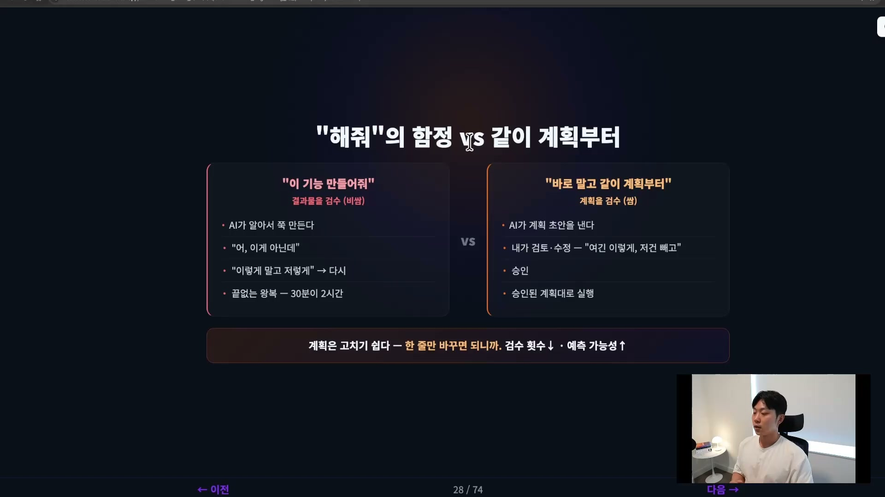
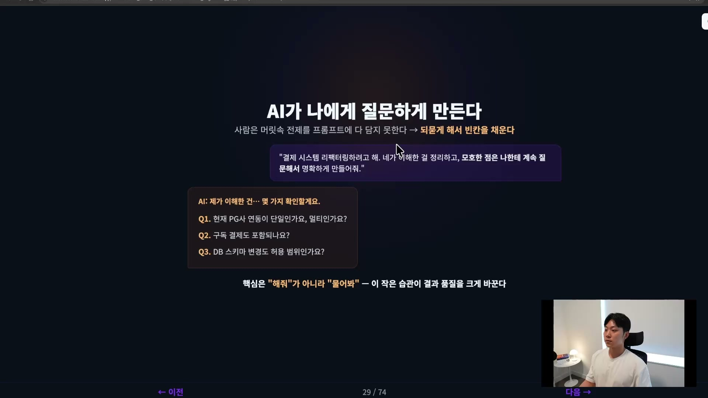
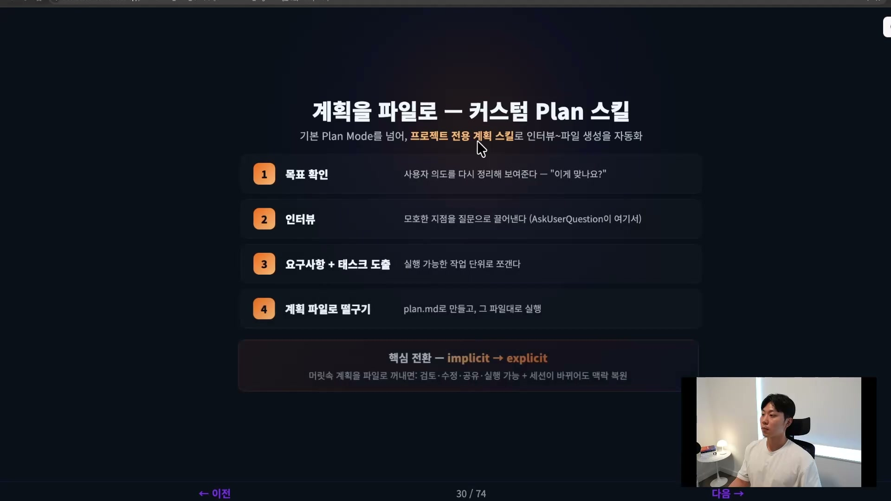
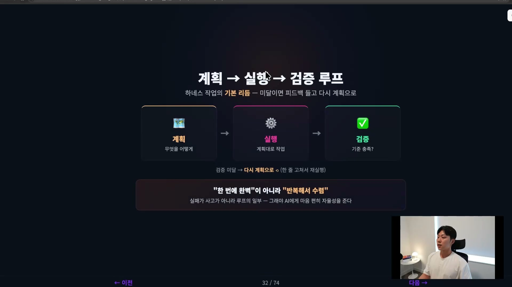
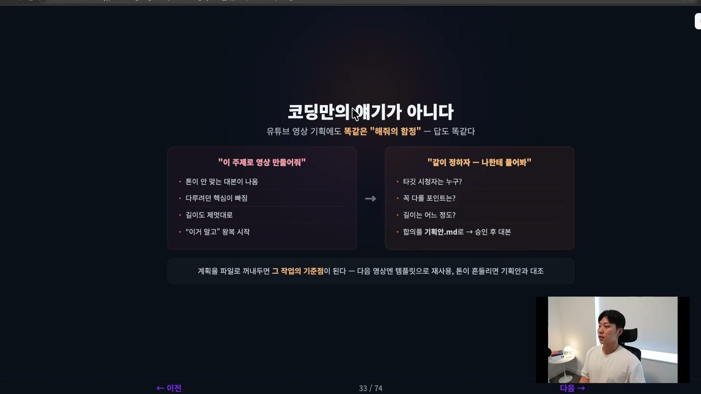

AI에게 일을 시킬 때 가장 비싸게 치르는 실수는, 모델이 멍청해서 생기는 게 아니다. 그냥 "이거 만들어줘"라고 던지는 데서 시작한다. 강의에서는 이걸 "해줘" 함정이라고 부른다. 일을 맡기기 전에 무엇을 어떻게 할지 먼저 정하는 계획 단계, 그 단계를 건너뛰었을 때 벌어지는 일이다.

흐름은 늘 비슷하다. "이 기능 만들어줘"라고 한다. AI가 만든다. 결과를 보니 잘못 만들어졌다. "이렇게 말고 저렇게 해줘"라고 다시 시킨다. 또 만든다. 검수했더니 또 틀렸다. 이 왕복이 끝나질 않는다. 30분이면 끝날 일이 2시간이 되고 4시간이 된다.

왜 이럴까. AI가 멍청해서가 아니다. 모델은 정말 똑똑하다. 문제는 다른 데 있다. AI가 내 머릿속에 있는 전제를 모른 채로 만들었기 때문이다. 나는 당연히 PG사는 토스를 쓰고, 구독 결제는 당연히 포함이라고 생각했는데, 그건 그냥 내 머릿속에만 있는 그림이다. AI가 그 정보를 알 길이 없다. 그러니 AI는 자기 나름대로 합리적으로 빈칸을 추측해서 만들었지만, 내 머릿속 그림과는 다른 결과가 나온다.

반대 패턴은 이렇다. "이거 만들 건데, 바로 만들지 말고 같이 계획부터 세워보자." 그러면 AI가 계획 초안을 내고, 내가 그 계획을 검토하고 수정한다. "여기는 이렇게, 저건 빼고" 하면서 손을 본다. 그렇게 승인을 하면, 그제서야 승인된 계획대로 실행이 들어간다.

## 결과물을 검수하느냐, 계획을 검수하느냐

두 방식의 진짜 차이는 검수의 대상에 있다.

첫 번째는 만들어진 결과물을 놓고 검수한다. 잘못됐으면 다 갈아엎어야 할 확률이 높다. 두 번째는 계획, 즉 스펙을 놓고 검수한다(뒤에서 다룰 스펙 드리븐 디벨롭먼트와 아주 비슷한 결이다). 스펙은 고치기가 쉽다. 아직 구현을 하나도 하지 않은 상태이기 때문이다. 한 줄만 바꾸면 된다.

여기서 계획과 실행을 분리하면 검수 횟수가 줄고 결과의 예측 가능성이 확 올라간다. 결과물을 검수하는 건 비싼 작업이지만, 계획과 스펙을 검수하는 건 그보다 훨씬 싸다. 같은 검수라도 어디에 거느냐에 따라 비용이 이렇게 갈린다.

## 사람은 자기 전제를 다 말하지 못한다

그럼 좋은 계획은 어떻게 나올까. 핵심은 하나를 인정하는 데서 출발한다. 사람은 자기 머릿속에 있는 전제를 프롬프트에 다 담지 못한다.

우리는 머릿속에 있는 걸 프롬프트로 다 옮기지 못한다. 내가 다 말해줄 수도 없고, 설령 내가 말을 한다 해도 AI가 그걸 다 알아듣는 것도 아니다. 그러면 방향을 뒤집어야 한다. 내가 다 말하는 대신, AI가 나한테 질문을 하게 만든다.

강의 화자가 PM과 일하면서 가장 많이 듣는 얘기가 "고객도 본인이 원하는 걸 모른다"는 말이라고 한다. 우리도 우리가 원하는 걸 다 알지 못한다. 그런데 AI와 얘기를 주고받다 보면 "아, 이런 걸 원하는구나" "이런 게 필요하구나" 하고 빠져 있던 맥락이 드러난다.

시작은 이렇게 한다. "결제 시스템 리팩터링하려고 해. 네가 지금 이해한 걸 정리해주고, 모호한 점은 나한테 계속 질문해서 이 플랜을 명확하게 만들어줘." 그러면 AI가 질문을 던진다. PG사 연동이 단일인지 멀티인지, 구독 결제도 포함되는지, DB 스키마 변경도 허용 범위인지. 내가 그 질문에 답을 해주면, 그제서야 AI가 명확한 전제 위에서 스펙을 세운다.

핵심은 "해줘"가 아니라 "물어봐"라고 부탁하는 것이다. AI가 스스로 빈칸을 채우게 만드는 것. 이 작은 습관 하나가 결과 품질을 크게 바꾼다.

## 계획을 머릿속에서 파일로 꺼낸다

클로드 코드에는 기본적으로 플랜 모드가 있다. 계획과 실행을 분리해주는 기능이다. 계획을 먼저 보여주고, 내가 승인해야 그때 실행으로 넘어간다.

그런데 여기에도 한계가 있다. 매번 우리가 쓴 맥락을 말로 풀어줘야 하고, 계획의 형식도 그때그때 다르다. 그래서 한 걸음 더 나아가면, 프로젝트 전용 계획 스킬을 만드는 게 제일 좋다. 인터뷰부터 요구사항 도출, 계획 파일 생성까지 한 번에 자동화하는 것이다.

흐름은 네 단계로 돈다. 먼저 사용자의 의도와 목표를 확인한다. 내가 이해한 건 이건데 맞느냐고 다시 정리해서 보여준다. 두 번째로 인터뷰를 한다. 모호한 지점을 질문으로 이끌어낸다(AskUserQuestion이 여기서 쓰인다). 세 번째로 요구사항과 태스크를 도출한다. 정리된 요구사항을 실행 가능한 작업 단위로 쪼갠다. 마지막으로 그 태스크와 요구사항을 `plan.md` 같은 계획 파일로 만들고, 그 파일대로 실행한다.

여기서 일어나는 핵심 전환은 암묵적(implicit)에서 명시적(explicit)으로 가는 것이다. 머릿속에만 있던 암묵적 계획을, 눈에 보이는 파일로 명시적으로 꺼내는 것이다. 파일이 되는 순간 여러 가지가 가능해진다. 쉽게 검토할 수 있고, 고칠 수 있고, 팀과 공유할 수 있고, 그대로 실행시킬 수도 있다. 작업이 길어져 세션이 바뀌어도 그 계획 파일만 다시 읽으면 맥락이 복원된다.

## 계획 10분이 실행 2시간을 아낀다

계획 단계에서 모호함을 줄이는 만큼 실행 품질이 올라간다. 우리가 미처 생각하지 못한 엣지 케이스를 계획 단계에서 잡아내야지, 결과물 단계에서 잡아내면 안 된다. "아 맞다, 환불은 어떻게 처리하지?" 같은 것들을 계획에서 미리 끌어내면, 실행은 그만큼 깔끔해진다.

그래서 계획에서 10분을 쓰면 실행에서 2시간을 아낄 수 있다. 계획에 쓰는 시간은 비용이 아니라 투자다.

## 계획, 실행, 검증 루프

마지막으로 큰 그림 하나. 일은 계획, 실행, 검증 루프로 돈다.

검증에서 기준에 미달하면 피드백을 들고 다시 계획으로 돌아간다. 이 루프가 하네스 작업의 기본 리듬이다.

여기서 중요한 마인드셋이 하나 있다. 한 번에 완벽하게가 아니라, 반복해서 수렴한다는 것이다. 처음부터 완벽한 결과를 기대할 수 없다. 이 루프를 돌리면서 정답에 점점 가까워지는 구조로 본다. 그러면 한 번 어긋나도 당황하지 않는다. 검증에서 걸렸으니 계획을 조금 고쳐서 다시 돌리면 된다고 생각하면 된다.

**실패가 사고가 아니라 루프의 일부다.** 실패는 오히려 좋은 것이다. 이런 관점이 있어야 AI에게 마음 편히 자율성을 줄 수 있다.

## 코딩만의 얘기가 아니다

계획하기는 코딩에만 국한되는 얘기가 아니다. 유튜브 영상 기획에서도 똑같이 통한다. "이 주제로 영상 만들어줘"라고 던지면 AI가 대본을 쭉 써온다. 그런데 톤이 맞지 않고, 내가 원하는 핵심이 빠지고, 길이도 제멋대로다. "아 이거 고쳐줘, 저거 고쳐줘"의 왕복이 시작된다. 똑같은 "해줘"의 함정이다.

여기서도 답은 똑같다. "영상을 기획할 건데 같이 정해보자. 타깃 시청자는 누구고, 꼭 다뤄야 할 포인트는 뭐고, 길이는 어느 정도인지 나한테 한번 물어봐줘." 그러면 AI가 그제서야 질문을 하고 인터뷰를 한다. 내가 답을 하고, 그 합의를 `기획안.md` 같은 파일로 만든다.

이 스펙으로 만든다는 게 중요한데, AI 시대에는 이게 코드보다 더 중요하다고까지 말할 수 있다. 그 파일에는 타깃, 핵심 메시지, 톤, 구성, 길이 같은 것들이 다 정리돼 있다. 그걸 승인하고 나서야 대본을 쓰게 만든다.

플랜 파일이 있으면 또 좋은 점이 있다. 다음 영상을 만들 때 그 파일을 템플릿처럼 재사용할 수 있고, 중간에 "이 톤이 왜 이럴까" 싶을 때는 기획안으로 돌아가서 대조할 수 있다. 검증의 기준점이 생기는 것이다. 그래서 개발이든 콘텐츠든 리서치든, 반복되는 일이라면 바로 하지 말고 계획을 파일로, 스펙으로 정리하는 습관을 들이는 게 좋다.

정리하면 이렇다. "해줘" 대신 "같이 계획하자"라고 하기. AI가 나한테 묻게, 인터뷰하게 만들기. 머릿속에 있는 계획을 파일로, 스펙으로 만들기. 그리고 전체를 계획, 실행, 검증 루프로 계속 개선하기. 계획에 쓰는 시간은 비용이 아니라 투자다.

계획까지 다 썼으면 이제 진짜 실행이 남는다. 그런데 실행에도 방식이 여러 가지다. 에이전트 하나에게 혼자 시킬지, 아니면 오케스트레이터를 두고 서브 에이전트 여러 개에게 병렬로 일을 시킬지. 그건 오케스트레이션의 영역이다.
